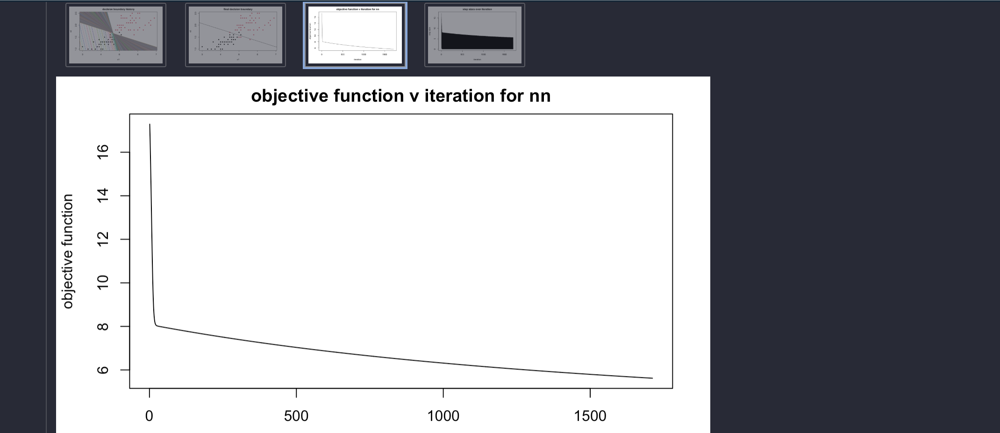

```{r}
# loading required data and libraries
library(dplyr)
library(plotly)
library(randomcoloR)
library(neuralnet)

data(iris) # irisdata.csv built into r

iris_unsupervised <- iris[ , -5] # remove species

ir_c <- iris[ which(iris$Species != "setosa"), ] 
rownames(ir_c) = seq(length = nrow(ir_c))        # reset rows

ir_c_unsupervised <- ir_c[ , -5] # remove species

set.seed(69) # ensure reproducability of results
```

# Clustering (35P total)

## a 15P

Write a program that implements the k-means clustering algorithm on the iris data set. You should use
the objective function and learning rule you derived in W4 Q1 (and your implementation will help you
uncover any errors, so it is helpful to do this before you turn in W4.)

```{r}
empty_cluster <- function() {
  df <- data.frame(Sepal.Length = numeric(),
                   Sepal.Width = numeric(),
                   Petal.Length = numeric(),
                   Petal.Width = numeric())
  return(df)
}

initial_clusters <- function(K) {
  clusters <- list()
  for (k in 1:K) {
    clusters[[k]] <- empty_cluster()
  }
  return(clusters)
}

initial_means <- function(K, dataframe) {
  means <- initial_clusters(K)
  random_initial <- dataframe[sample(nrow(dataframe), 3), ]
  for (k in 1:K) {
    means[[k]][1, ] <- random_initial[k, ]
  }
  return(means)
}

get_diffs <- function(x_n, means, K) {
  diffs <- initial_clusters(K)
    for (k in 1:K) {
      mean_k <- means[[k]][1, ]
      diff <- (abs(x_n - mean_k))^2
      diffs[[k]][1, ] <- diff
    }
  return(diffs)
}

get_min_se <- function(diffs) {
  K <- length(diffs)
  ses <- empty_cluster()
  
  for (k in 1:K) {
    ses[nrow(ses) + 1, ] <- diffs[[k]][1, ]
  }
  
  min <- (ses %>% arrange(Sepal.Length, Sepal.Width, Petal.Length, Petal.Width))[1, ]
  return(min)
}

get_cluster_mean <- function(cluster) {
  mean <- empty_cluster()
  mean[1, 1] <- mean(cluster[ , 1])
  mean[1, 2] <- mean(cluster[ , 2])
  mean[1, 3] <- mean(cluster[ , 3])
  mean[1, 4] <- mean(cluster[ , 4])
  return(mean)
}

get_clusters <- function(K, dataframe, means) {
  clusters <- initial_clusters(K)
  all_mins <- empty_cluster()
  clusters_vector <- c()
  N <- nrow(dataframe)
  for (n in 1:N) {
    x_n <- dataframe[n, ]
    diffs <- get_diffs(x_n, means, K)
    min_se <- get_min_se(diffs)
    all_mins[n, ] <- min_se
    
    for (k in 1:K) {
      se <- diffs[[k]][1, ]
      if (all_equal(se, min_se) == TRUE) {
        clusters[[k]] <- rbind(clusters[[k]], x_n)
        clusters_vector <- c(clusters_vector, k)
        break
      }
    }
  }
  
  clusters_type <- list(clusters=clusters, mins = all_mins, vec = clusters_vector)
  
  return(clusters_type)
}

get_min_diffs <- function(K, dataframe, means) {
  
  N <- nrow(dataframe)
  for (n in 1:N) {
    x_n <- dataframe[n, ]
    diffs <- get_diffs(x_n, means, K)
    min_se <- get_min_se(diffs)
    
  }
  return(all_mins)
}

update_means <- function(K, clusters, means) {
  new_means <- initial_clusters(K)
  for (k in 1:K) {
    new_means[[k]][1, ] <- get_cluster_mean(clusters$clusters[[k]])
  }
  return(new_means)
}

empty_sum <- function() {
  sum <- empty_cluster()
  sum[1, ] <- c(0.00, 0.00, 0.00, 0.00)
  return(sum)
}

sum_min_diffs <- function(all_mins) {
  sum <- empty_sum()
  N <- nrow(all_mins)
  for (n in 1:N) {
    old <- sum[1, ]
    diff <- all_mins[n, ]
    sum[1, ] <- old + diff
  }
  
  return(sum)
}

not_zero <- function(diff_sum) {
  op <- diff_sum[ , 1] > 0.00 &
        diff_sum[ , 2] > 0.00 &
        diff_sum[ , 3] > 0.00 &
        diff_sum[ , 4] > 0.00
  return(op)
}

k_means <- function(K, dataframe, cls) {
  
  means <- initial_means(K, dataframe)
  clusters <- get_clusters(K, dataframe, means)
  all_mins <- clusters$mins
  prev_sum <- empty_sum()
  curr_sum <- sum_min_diffs(all_mins)
  
  iter <- 0
  
  diff_sum_hist <- empty_cluster()
  means_hist <- c(list(means))
  clusters_hist <- c(list(clusters))
  diff_sum <- abs(curr_sum[1, ] - prev_sum[1, ])
  while (not_zero(diff_sum) | iter < 10) {
    # update
    means <- update_means(K, clusters, means)
    clusters <- get_clusters(K, dataframe, means)
    
    means_hist <- c(means_hist, list(means))
    clusters_hist <- c(clusters_hist, list(clusters))
    all_mins <- clusters$mins
    
    # increment
    prev_sum[1, ] <- curr_sum[1, ]
    curr_sum[1, ] <- sum_min_diffs(all_mins)
    diff_sum <- abs(curr_sum[1, ] - prev_sum[1, ])
    diff_sum_hist <- rbind(diff_sum_hist, diff_sum)
    iter <- iter + 1
  }
  
  max_iter <- nrow(diff_sum_hist)
  itr_vec <- c()
  diff_hist <- c()
  for(of_iteration in 1:max_iter) {
    itr_vec <- c(itr_vec, of_iteration)
    diff_sum_sum <- rowSums(diff_sum_hist[of_iteration, ])
    diff_hist <- c(diff_hist, abs(diff_sum_sum))
  }
  
  petal_l <- dataframe$Petal.Length
  petal_w <- dataframe$Petal.Width
  y <- as.factor(cls)

  kmeans <- list("petal_l"=petal_l,
                 "petal_w"=petal_w,
                 "y"=y,
                 "classes"=clusters, 
                 "centroids"=means, 
                 "mins"=all_mins, 
                 "iteration"=itr_vec, 
                 "objective_func"=curr_sum, 
                 "diff_hist" = diff_hist, 
                 "clusts_hist" = clusters_hist, 
                 "centroids_hist" = means_hist)
  
  return(kmeans) 
}
```

```{r}
k_means_result_2 <- k_means(2, ir_c_unsupervised, ir_c$Species)
k_means_result <- k_means(3, iris_unsupervised, iris$Species)
```  

## b 5P

Plot the value of the objective function as a function of the iteration 

$$D = \sum_{n=1}^N \sum_{k=1}^K r_{n,k} ||\boldsymbol{x}_n - \boldsymbol{\mu}_k||^2$$

to show that your learning rule and implementation minimizes this expression.

```{r}
plot(k_means_result$iteration, k_means_result$diff_hist, 
     type = "l", 
     xlab = "iteration", 
     ylab = "objective function (diff between curr and prev)")
points(k_means_result$iteration, k_means_result$diff_hist, 
       pch = 16)
```

## c 5P

Plot the results of the learning process by showing the initial, intermediate, and converged cluster centers overlaid on the data for k = 2 and k = 3.

The black point is k = 1

The red point is k = 2

The green point is k = 3

```{r}
plot_means <- function(iter, k_means_set) {
  x1 <- k_means_set$petal_l
  x2 <- k_means_set$petal_w
  y <- as.factor(k_means_set$y)
  K <- length(k_means_set$centroids)
  
  
  plot(x1, x2, col = y, pch = 16, 
       xlab = "petal length", ylab = "petal width", 
       main = "learning (mean update history)")
  
  colors_for_centroids <- c("black", "red", "green")
    for (k in 1:K) {
      desired_col <- colors_for_centroids[k]
      points(k_means_set$centroids_hist[[iter]][[k]]$Petal.Length, 
             k_means_set$centroids_hist[[iter]][[k]]$Petal.Width, 
             col = desired_col, pch = 4, cex = 2)
      abline(v = k_means_set$centroids_hist[[iter]][[k]]$Petal.Length, 
             col = desired_col, lty = 2)
      abline(h = k_means_set$centroids_hist[[iter]][[k]]$Petal.Width, 
             col = desired_col, lty = 2)
    }
}


plot_learning <- function(k_means_set) {
  iters <- length(k_means_result$centroids_hist)
  for (i in 1:iters) {
    plot_means(i, k_means_set)
  }
}

```

```{r}
# k = 2
plot_learning(k_means_result_2)
```

```{r}
# k = 3
plot_learning(k_means_result)
```

The classifications change depending on randomization of initial means, as expected.

## d 10P

Devise a method to plot the decision boundaries for this dataset using the optimized parameters. Explain your approach and plot your results.
(optimized parameters = means)

Approach:

calculate y = mx + b for midpoints between means as decision boundary

```{r}
order_means <- function(means) {
  new_means <- empty_cluster()
  for (k in 1:length(means)) {
    new_means[k, ] <- means[[k]][1, ]
  }
  new_means <- new_means %>% arrange(Petal.Length, Petal.Width)
  
  return(new_means)
}

plot_decision_boundaries <- function(means) {
  plot(iris$Petal.Length, iris$Petal.Width, 
       col = iris$Species, pch = 16, 
       xlab = "petal length", ylab = "petal width", 
       main = "decision boundaries for k means")
  ordered_means <- order_means(means)
  K <- nrow(ordered_means)
  for (k in 2:K) {
    m1 <- ordered_means[k-1, ]
    m2 <- ordered_means[k, ]
    x1 <- m1$Petal.Length
    y1 <- m1$Petal.Width
    if (k == 2) {
      points(m1$Petal.Length, m1$Petal.Width, 
             pch = 8, cex = 2, col = randomColor())
    }
    points(m2$Petal.Length, m2$Petal.Width, 
           pch = 8, cex = 2, col = randomColor())
    
    x2 <- m2$Petal.Length
    y2 <- m2$Petal.Width
    
    reciprocal_slope <- -((x2-x1) / (y2-y1))
    intercept <- ((y1 - (reciprocal_slope * x1)
                   ) + (y2 - (reciprocal_slope * x2)
                        )
                  ) / 2
    abline(intercept, reciprocal_slope)
  }
}

plot_decision_boundaries(k_means_result$centroids)
```

# Linear Decision Boundaries (30P total)

Single layer neural network

## a 10P

Inspect the iris dataset which is provided with the assignment file on Canvas. Write a program (or use a library) that loads the iris data set and plots the 2nd and 3rd iris classes, similar to the plots shown in lecture on neural networks (i.e. using the petal width and length dimensions).

Simple plotting of versicolor (2nd class) and virginica (3rd class) with Petal Width ~ Petal Length for analysis:

```{r}
plot(ir_c$Petal.Length, ir_c$Petal.Width, col = ir_c$Species,
     pch = 16,
     xlab = "petal length", ylab = "petal width", main = "simple")
```

## b 5P

```{r}
# setup dataset
# 0, 1 for species as binary classifier
determine_class <- function(species) {
  cols <- c()
  for (s in species) {
    if (s == "versicolor") {
      cols <- c(cols, 0)
    }
    else {
      cols <- c(cols, 1)
    }
  }
  return(cols)
}

df <- mutate(ir_c, y = determine_class(Species)) 
df <- df [ , -5]


## 3:4 => PetalLength, PetalWidth
# x <- scale(df[ , c(3:4)]) # -> with standardized data
x <- df[ , c(3:4)]          # -> without standardized data

y <- df$y
dim(y) <- c(length(y), 1)

x <- as.matrix(x, byrow = TRUE)
x <- t(x)

y <- as.matrix(y, byrow = TRUE)
y <- t(y)

```

Define a function that computes the output of simple one-layer neural network using a sigmoid non-linearity (linear classification with sigmoid non-linearity).

```{r}
# add bias to x
x_nn <- function(x) {
  m <- dim(x)[2]
  x_0 <- matrix(rep(1, m), nrow = 1)
  x <- rbind(x_0, x)
  return(x)
}

new_weight <- function(w1, w2, bias = NULL) {
  w0 <- 0
  if (!is.null(bias)) {
    w0 <- bias
  }
  weight <- c(w0, w1, w2)
  return(t(weight))
}

random_weight <- function(n_x, n_y, bias = NULL) {
  w0 <- 0
  if (!is.null(bias)) {
    w0 <- bias
  }
  weight <- matrix(runif(n_y * n_x), nrow = n_y, ncol = n_x, byrow = TRUE)
  weight <- cbind(matrix(c(w0)), weight)
  return(weight)
}

random_weight(2, 1)

initial_weight <- function(x, y, weight = NULL, bias = NULL) {
  n_x <- (dim(x)[1] - 1)
  n_y <- dim(y)[1]
  W <- random_weight(n_x, n_y, bias)
  if (!is.null(weight)) {
    W <- weight
  }
  return(W)
}

sigmoid <- function(x) {
  return(1 / (1 + exp(-x)))
}

fwd_prop <- function(x, y, W) {
  n_x <- (dim(x)[1] - 1)
  n_y <- dim(y)[1]
  
  Z <- W %*% x
  A <- sigmoid(Z)
  
  fwd_pass <- list("Z" = Z,
                   "A" = A)
  return(fwd_pass)
}

prediction <- function(A) {
  return(round(A))
}

non_linearity <- function(x, y, weight = NULL, bias = NULL) {
  X <- x_nn(x)
  W <- initial_weight(X, y, weight, bias)
  fwd_pass <- fwd_prop(X, y, W)
  predict <- prediction(fwd_pass$A)
  
  model <- list("x0" = X[1, ],
                "x1" = X[2, ],
                "x2" = X[3, ],
                "y" = y,
                "W" = W,
                "fwd_feed" = fwd_pass,
                "pred" = predict)
  return(model)
}
```

## c 5P

Write a function that plots the decision boundary for the non-linearity above overlaid on the iris data.
Choose a boundary (by setting weight parameters by hand) that roughly separates the two classes. Use
an output of 0 to indicate the 2nd iris class, and 1 to indicate the 3rd.

```{r}
W1 <- 2
W2 <- 5
BIAS <- -18.5

get_slope_intercept <- function(W) {
  w_1 <- W[1, 2]
  w_2 <- W[1, 3]
  w_0 <- W[1, 1]
  
  m <- -(w_1 / w_2)
  b <- -(w_0 / w_2)
  
  db_comp <- list("m" = m, 
                  "b" = b)
  
  return(db_comp)
}

plot_nl_db <- function(x, y, w1, w2, w0) {
  W <- new_weight(w1, w2, w0)
  si <- get_slope_intercept(W)
  nl_cw_model <- non_linearity(x, y, W, w0)
  nl_cw_model$y <- as.factor(nl_cw_model$y)
  plot(nl_cw_model$x1, nl_cw_model$x2, 
       col = nl_cw_model$y, pch = 16,
       xlab = "x1", ylab = "x2", main = "decision boundary")
  m <- si$m
  b <- si$b
  abline(a = b, b = m)
}

plot_nl_db(x, y, W1, W2, BIAS)
```

## d 5P

Use a surface plot from a 3D plotting libary (e.g. in matlab or using matplotlib in python) to plot the
output of your neural network over the input space. This should be similar to learning curve shown in
fig 19.17 (18.17 in 3rd ed.) of the textbook.

```{r}
weight <- new_weight(W1, W2, BIAS)
nl_cw_model <- non_linearity(x, y, weight)
x1 <- nl_cw_model$x1
x2 <- nl_cw_model$x2
summation_output <- nl_cw_model$fwd_feed$Z[1, ]
sigmoid_output <- nl_cw_model$fwd_feed$A[1, ]
plot(summation_output, sigmoid_output, type = "l", 
     xlab = "Z", ylab = "A", 
     main = "sigmoid activation function (testing for 2d)")

# dynamic plotting function, have to screenshot
# plot_ly(x = ~x1, y = ~x2, z = ~sigmoid_output, type = 'mesh3d') %>% add_lines()
```


## e 5P

Show the output of your simple classifier using examples from the 2nd and 3rd Iris classes. Choose
examples that are unambigious as well as those that are near the decision boundary.

Desired examples: 

0:

- closer to db: 3, 23, 28, 37

- farther from db: 49, 32

1: 

- closer to db: 70, 89, 84, 77

- farther from db: 51, 73

```{r}
desired_sets <- c(3, 23, 28, 32, 37, 49, 51, 70, 73, 77, 84, 89)
examples_x <- x[ , desired_sets]
examples_y <- t(y[ , desired_sets])
custom_weight <- new_weight(W1, W2, BIAS)
nl_eg_model <- non_linearity(examples_x, examples_y, custom_weight, BIAS)

# display the output of the non-linearity function
nl_eg_model
```

```{r}
plot_nl_db(x, y, W1, W2, BIAS)
points(nl_eg_model$x1, nl_eg_model$x2, pch = 8, col = "blue", cex = 2)
```

# Neural Networks (30P total)

## a 10P

Write a program that calculates the mean-squared error of the iris data for the neural network defined
above. The function should take three arguments: the data vectors, the parameters defining the neural
network, and the pattern classes.

```{r}
# calculate error
# used to determine convergence
err_mse <- function(y, A) {
  mse <- (A - y)^2
  err <- sum(mse) / 2
  return(err)
}
```

## b 5P

Compute the mean squared error for two different settings of the weights (i.e. two different decision
boundaries). Like above, select these by hand and choose settings that give large and small errors
respectively. Plot both boundaries on the dataset as above.

```{r}
W1A <- W1
W2A <- W2
W0A <- BIAS

weight_a <- new_weight(W1A, W2A, W0A)
nl_a <- non_linearity(x, y, weight_a)

W1B <- 1
W2B <- 7
W0B <- -23.5

weight_b <- new_weight(W1B, W2B, W0B)
nl_b <- non_linearity(x, y, weight_b)

# compute err for params a (low error)
err_mse(y, nl_a$fwd_feed$A)
plot_nl_db(x, y, W1A, W2A, W0A)

# compute err for params b (high error)
err_mse(y, nl_b$fwd_feed$A)
plot_nl_db(x, y, W1B, W2B, W0B)

# error with random weight
nl_r <- non_linearity(x, y)
err_mse(y, nl_r$fwd_feed$A)

# max discovered error bound: 25 (w1 = 8, w2 = 1, w0 = -4)
```

## c 10P

Give a mathematical derivation the gradient of the objective function above with respect to the neural
network weights. You will have to use chain rule and the derivative of the sigmoid function as discussed
in class. Use w0 to represent the bias term. You should show and explain each step.

The error function is defined as below:

$$E = \frac{1}{2} \sum_{n=1}^N (\hat{Y} - Y_{ref})^2 = \frac{1}{2} \sum_{n=1}^N (A - Y_{ref})^2$$

where $A$ is the output of the sigmoid activation function (predicted output), $Y_{ref}$ is the actual output

To derive the error function wrt the weight, we will use the chain rule

$$\frac{DE}{DW} = \frac{DE}{DA} \frac{DA}{DZ} \frac{DZ}{DW}$$

where $A$ is the output of the sigmoid activation function, $Z$ is the input for the sigmoid activition function (or the output of the  multiplication ${W}{X}$ ), and $W$ is the weight, all in vector form. After deriving with the chain rule, we get:

$$\frac{DE}{DW} = \sum_{n=1}^N (A) (1 - A) (A - Y_{ref}) X_n$$

in vector form. It should also be known that:

$$DW = \frac{DE}{DW}$$

so that it can be used when determining the update rule for the weight.

## d 5P

Show how the gradient can be written in both scalar and vector form

Part c is derived in vector form

Scalar Form:

$$\frac{DE}{DW} = \sum_{n=1}^N \sum_{i=1}^I (a_i) (1 - a_i) (a_i - y_{i_{ref}}) x_{ni}$$

where $N$ is number of dimensions (number of variables); $I$ is number of samples

Vector Form:

$$\frac{DE}{DW} = \sum_{n=1}^N (A) (1 - A) (A - Y_{actual}) X_n$$
## e 10P

Write code that computes the summed gradient for an ensemble of patterns. Illustrate the gradient by showing (i.e. plotting) how the decision boundary changes for a small step.

```{r}
# gradient derivation from error (back propagation)
# the code that "computes the summed gradient for an ensemble of patterns"
back_prop <- function(x, y, A) {
  m <- dim(x)[2]
  
  ones <- t(matrix(rep(1, m)))
  dA <- A * (ones - A)
  dZ <- (A - y)
  deriv_step <- dA * dZ
  dW <- x %*% t(deriv_step)
  
  return(t(dW))
}

# gradient descent
# (update weight)
descend <- function(dW, W, N) {
  eps <- 0.1 / N
  update <- eps %*% dW
  new_W <- W - update
  return(new_W)
}
```


```{r}

three_e_m <- c()
three_e_b <- c()

moon <- x_nn(x)
earth <- dim(moon)[2]

small_step_for_man <- new_weight(W1, W2, BIAS)
large_leap_for_mankind <- get_slope_intercept(small_step_for_man)
to_the_moon <- fwd_prop(moon, y, small_step_for_man)
three_e_m <- c(three_e_m, large_leap_for_mankind$m)
three_e_b <- c(three_e_b, large_leap_for_mankind$b)

back_to_earth <- back_prop(moon, y, to_the_moon$A)
small_step_for_man <- descend(back_to_earth, small_step_for_man, earth)
large_leap_for_mankind <- get_slope_intercept(small_step_for_man)
three_e_m <- c(three_e_m, large_leap_for_mankind$m)
three_e_b <- c(three_e_b, large_leap_for_mankind$b)

plot(x[1, ], x[2, ], 
     col = as.factor(y), 
     pch = 16, 
     xlab = "x1", ylab = "x2",
     main = "tiny lil' changes in decision boundary (lil' bits)")

abline(three_e_b[1], three_e_m[1], col = randomColor())
abline(three_e_b[2], three_e_m[2], col = randomColor())
```

# Learning Decision Boundary through optimization (30P total)

## a 5P

Using your code above, write a program that implements gradient descent to optimize the decision 
boundary for the iris dataset.

```{r}
# putting it all together
# keep history of decision boundary data
# keep history of iteration and "objective function" data
# 10 max iterations by default
nn_model <- function(x, y, weight = NULL, bias = NULL, min_diff = 1e-6) {
  # initialization
  X <- x_nn(x)
  N <- dim(X)[2]
  
  # reused vars
  W <- initial_weight(X, y, weight, bias)
  fwd_pass <- fwd_prop(X, y, W)
  Z <- fwd_pass$Z
  A <- fwd_pass$A
  err <- err_mse(y, A)
  dec_bound <- get_slope_intercept(W)
  # preservation of history
  m_hist <- c(dec_bound$m)
  b_hist <- c(dec_bound$b)
  err_hist <- c(err)
  # increment vars
  diff <- abs(0 - err)
  iter <- 1
  # iteration history
  diff_hist <- c(diff)
  iter_hist <- c(iter)
  while (diff > min_diff) { # diff > 0 |
    # loop preprocess
    back_pass <- back_prop(X, y, A)
    # reused vars
    W <- descend(back_pass, W, N)
    fwd_pass <- fwd_prop(X, y, W)
    Z <- fwd_pass$Z
    A <- fwd_pass$A
    err <- err_mse(y, A)
    dec_bound <- get_slope_intercept(W)
    # preservation of history
    m_hist <- c(m_hist, dec_bound$m)
    b_hist <- c(b_hist, dec_bound$b)
    err_hist <- c(err_hist, err)
    # increments
    diff <- abs(diff - err)
    iter <- iter + 1
    # increment history
    diff_hist <- c(diff_hist, diff)
    iter_hist <- c(iter_hist, iter)
  }
  
  model <- list("X"=X,
                "y"=y,
                "W"=W,
                "Z"=fwd_pass$Z,
                "A"=fwd_pass$A,
                "err"=err,
                "dec_bound"=dec_bound,
                "err_hist"=err_hist,
                "b_hist"=b_hist,
                "m_hist"=m_hist,
                "diff_hist"=diff_hist,
                "iter_hist"=iter_hist,
                "iteration"=iter)
  
  return(model)
}

my_weight <- new_weight(W1, W2, BIAS)
nn_full <- nn_model(x, y, my_weight, BIAS)
```

## b 5P

In your program, include code that shows the progress in two plots: the first should show the current
decision boundary location overlaid on the data; the second should show the learning curve, i.e. a plot of
the objective function as a function of the iteration.

```{r}
# plot functions
# plot decision boundary history over time
# "x0" = X[1, ],
# "x1" = X[2, ],
# "x2" = X[3, ],
plot_dec_bound_hist <- function(nn_model) {
  x1 <- nn_model$X[2, ]
  x2 <- nn_model$X[3, ]
  y <- as.factor(nn_model$y)
  tital <- paste("decision boundary history")
  plot(x1, x2,
       col = y, pch = 16,
       xlab = "x1", ylab = "x2",
       main = tital)
  for (i in nn_model$iter_hist) {
    a <- nn_model$b_hist[i]
    b <- nn_model$m_hist[i]
    abline(a, b, col = randomColor())
  }
}

plot_db_nn <- function(nn_model) {
    x1 <- nn_model$X[2, ]
    x2 <- nn_model$X[3, ]
    y <- as.factor(nn_model$y)
    tital <- paste("final decision boundary")
    plot(x1, x2,
         col = y, pch = 16,
         xlab = "x1", ylab = "x2",
         main = tital)
    a <- nn_model$dec_bound$b
    b <- nn_model$dec_bound$m
    abline(a, b, col = "black")
}

# plot objective function by iteration over time
plot_nn_learning <- function(nn_model) {
  plot(nn_model$iter_hist, nn_model$err_hist,
       type = "l",
       pch = 16, col = "black",
       xlab = "iteration", ylab = "objective function",
       main = "objective function v iteration for nn")
}

plot_step_sizes <- function(nn_model) {
  plot(nn_model$iter_hist, nn_model$diff_hist,
       type = "l",
       pch = 16, col = "black",
       xlab = "iteration", ylab = "step size",
       main = "step sizes over iteration")
}
```

```{r}
plot_dec_bound_hist(nn_full)
plot_db_nn(nn_full)
plot_nn_learning(nn_full)
plot_step_sizes(nn_full)
```

## c 10P

Run your code on the iris data set starting from a random setting of the weights. 

Note: you might need to restrict the degree of randomness so that the initial decision boundary is visible somewhere in the
plot. 

In your writeup, show the two output plots at the initial, middle, and final locations of the decision
boundary

```{r}
nn_random <- nn_model(x, y, bias = -3, min_diff = 1e-9)
plot_dec_bound_hist(nn_random)
plot_db_nn(nn_random)
plot_nn_learning(nn_random)
plot_step_sizes(nn_random)
```

## d 5P

Explain how you chose the gradient step size

[Minimum step size](https://www.andreaperlato.com/theorypost/gradient-descent-step-by-step/) is generally defined to be a value that's $0.001$ or smaller. To choose an appropriate [step size](https://www.cs.cmu.edu/~ggordon/10725-F12/scribes/10725_Lecture5.pdf), we could look at the differences between errors throughout history:


Once the history in the differences between errors has been examined, the minimum gradient step size was chosen to be $exp(-6) = e^{-6} = 10^{-6} = 0.000001$ and is the point where we stop the learning process. When testing, this step size proved to be efficient.

But if this is referring to the $\epsilon$ value (gradient step size ~= learning rate), then during class discussion, it was explained to be 

$$\epsilon = \frac{0.1}{N}$$

where $N$ is # samples (observations, ...). I ultimately let the code handle the step size. This gives us slow convergence.

## e 5P

Explain how you chose a stopping criterion

Initially decided on max iteration, but max iteration requires manual input. A more dynamic approach to discovering iteration would be better.

So instead of having a max iteration, we could have a minimum difference threshold (min gradient step size) that we think is appropriate which indicates a point where we'd assume the objective function (differences in error) to have been converged. 

Basically the difference in error doesn't have to be exactly 0, but a value close to 0. The greater the precision, the more accurate the data becomes, but the less payoff there is. A good default value I came up with is $exp(-6) = e^{-6} = 10^{-6} = 0.000001$. It's precise enough for assuming convergence, but can be changed depending on how much of a convergence is desired. This allows the error and decision boundary to converge to a certain point given the weights, meaning the error depends on how accurate the weights are and never really hits 0 (at least based on my error implementation).

There may be some issues when plotting this randomly, but we'll have to "restrict the degree of randomness" to ensure a valid input space:





# Using an ML Toolbox (27P total)

Use a machine learning toolbox to generalize the network to perform classification on the full iris dataset. 

Your network should have one or more hidden layers and classify all three iris classes
using all four data dimensions. Show your results and explain your architecture.
In addition to implementing the neural network classifier, also think of an issue to explore. 

Write your own mini-tutorial to report your results. Here are some examples of topics you can consider:
  - Illustrate how a multi-layer network makes a decision.
  - Explore different non-linearities.
  - Explore different network architectures and their classication and generalization performance.
  - Explore algorithms for adjusting the learning rate.

There are many tutorials using different toolboxes available on the internet. You can follow any you find useful
to get started but do not just copy them for this extra credit portion of the assignment. You can make use of
material you find useful, but cite your sources in your writeup. The TAs will check for straight copying, so
please don’t do this.
If you do use material from a source, simplify it to focus on a single topic and understand it well enough that
you can explain it and modify it for our own purposes. Your write up should explain the ideas, code, and results
in your own words and make use of tables or figures.
The extra credit is worth 20% of the points, so it should be about 20% of the effort for the main part of the
assignment. **Trivial examples will receive little or no credit.** Your goal should be to teach yourself about
something about a neural network-related topic, and the write up should written as if you are explaining it to
one of your classmates.

Step 1 -> Figure out an appropriate ml toolbox to use (some options: neuralnet, nnet, tensorflow, keras, ...). This can change depending on how the data will be analyzed.

Multi Layered Neural Network How-To (for training/learning only)

Step 1 -> Perform analysis on the data to determine how many layers are needed, what [activation functions](https://towardsdatascience.com/activation-functions-neural-networks-1cbd9f8d91d6) will be used for each layer, and how big each layer will be (neural network architecture for data), and the error for the data (maybe, because it's highly likely that the error is dynamically derived based on the activation function used). It may be important to understand the mathematical derivation of the architecture before building it out.

Step 2 -> Consider the analyses and plotting that will be performed to prove learning and learning efficiency

Step 3 -> Start building designed architecture

Step 4 -> Plot learning and learning performance, analyze general performance of neural network. Useful performance metrics:

confusion matrix


precision =  # TP / (# TP + # FP)
recall    =  # TP / (# TP + # FN)
f1 score  =  harmonic mean of precision and recall (2 * (p * r) / (p + r))
accuracy  =  percentage of the all correct predictions out total predictions made

```{r}

# confusion matrix
# TN = True Negative, FP = False Positive
# FN = False Negative, TP = True Positive
#      0   1      
# 0 [ TN, FP ]
# 1 [ FN, TP ]
confusion_matrix <- function(y, y_prediction) {
  tb_cm <- table(y, y_prediction)
  return(tb_cm)
}

# metrics of performance
# precision (p) =  # true positives / # true positives + # false positives
# recall (r)    =  # true positives / # true positives + # false negatives
# f1 score (f1) =  harmonic mean of precision and recall (2 * (p * r) / (p + r))
# accuracy (a)  =  percent of correct predictions out of total predictions 
#               =  (#tp + #tn)/(#tp + #fp + #tn + #fn)
metrics <- function(tb) {
  tn <- tb[1]
  tp <- tb[4]
  fn <- tb[3]
  fp <- tb[2]
  a <- (tp + tn) / (tp + fp + tn + fn)
  r <- tp / (tp + fn)
  p <- tp / (tp + fp)
  f1 <- 2 * ((p * r) / (p + r))
  
  metric <- list("acc" = a,
                 "rec" = r,
                 "prec" = p,
                 "f" = f1)
  return(metric)
}
```

We're going to be using the full iris dataset to perform learning/training, and no testing. We will be using rules of convergence to see how 

```{r}
factor_species <- function(species) {
  cols <- c()
  n_species <- length(species)
  for (i in 1:n_species) {
    s <- species[i]
    if (s == "setosa") {
      cols <- c(cols, 0)
      next
    }
    if (s == "versicolor") {
      cols <- c(cols, 1)
      next
    }
    if (s == "virginica") {
      cols <- c(cols, 2)
    }
  }
  return(cols)
}

iris_data <- mutate(iris, species = factor_species(Species))[ , -5]
```

```{r}
iris_net <- neuralnet(species ~ Petal.Length+Petal.Width+Sepal.Length+Sepal.Width,
                      data = iris_data, hidden = c(4, 4), linear.output = FALSE,
                      act.fct = 'logistic', err.fct = 'sse', threshold = 1e-9)

plot(iris_net, col.hidden = 'darkgreen', col.hidden.synapse = 'red')
iris_net$result.matrix

iris_net$net.result
```

