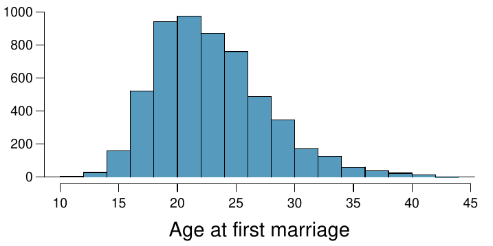
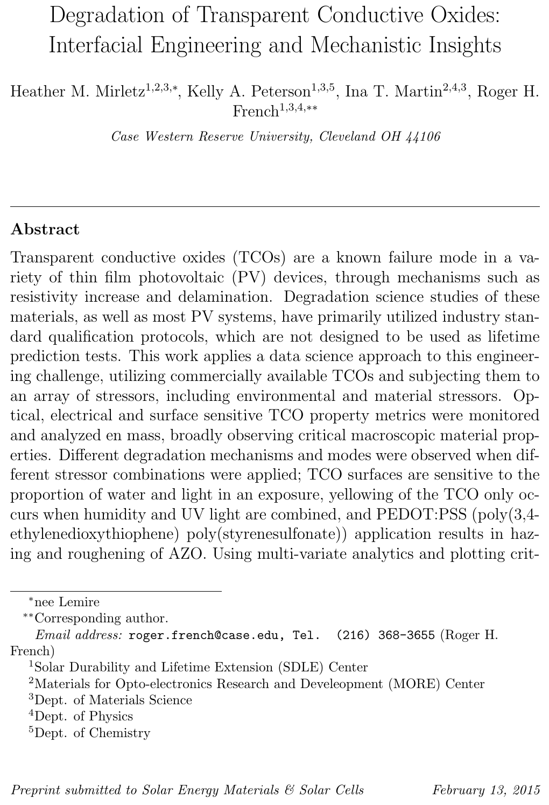
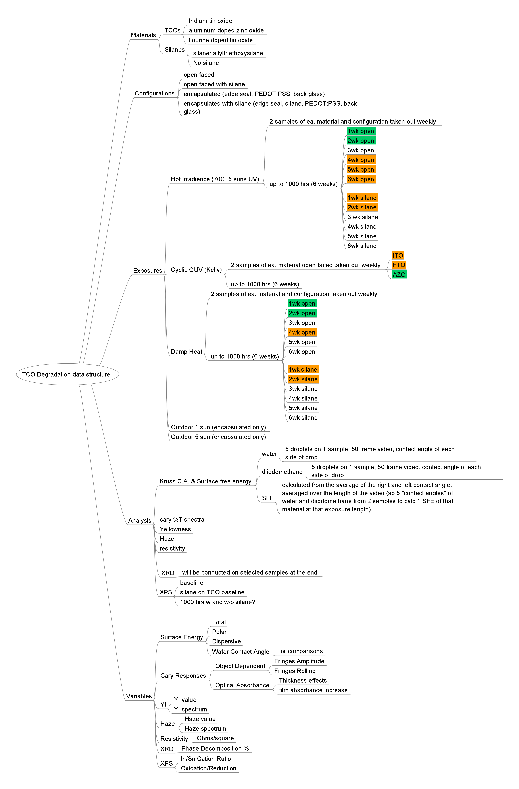
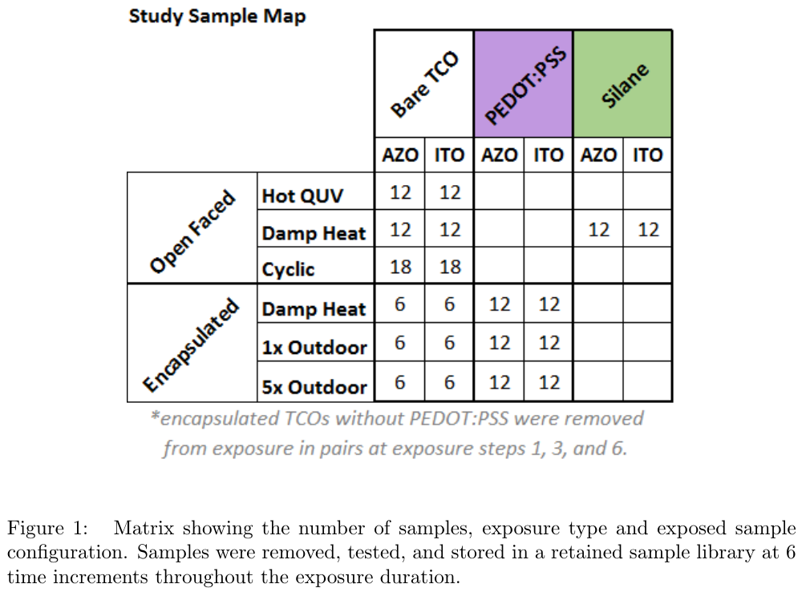
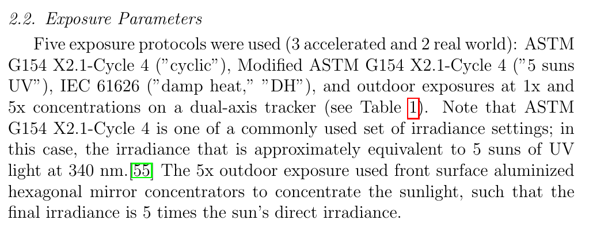
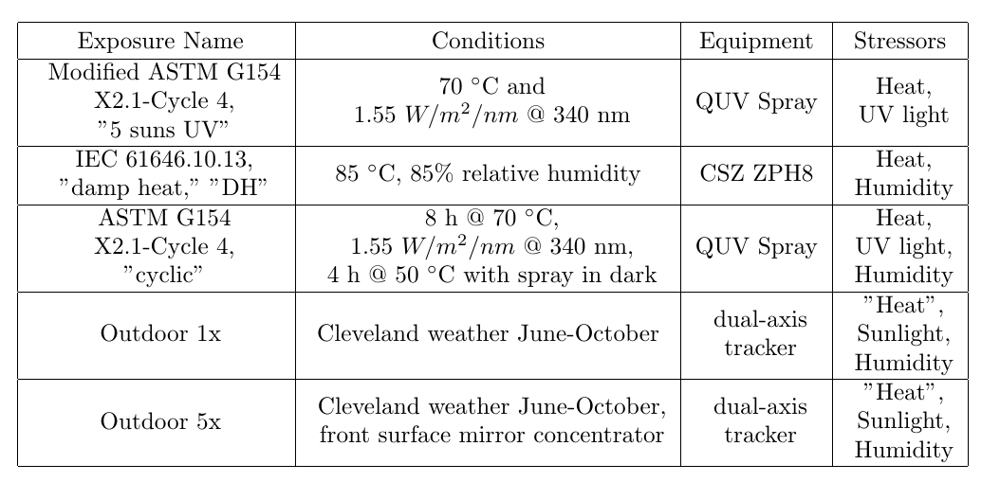

```{r setup, include = FALSE}
knitr::opts_chunk$set(
  cache = FALSE, # if TRUE knitr will cache results to reuse in future knits
  fig.width = 4.5, # the width for plots created by code chunk
  fig.height = 3.5, # the height for plots created by code chunk
  fig.align = 'center', # how to align graphics. 'left', 'right', 'center'
  dpi = 300, 
  dev = 'png', # Makes each fig a png, and avoids plotting every data point
  # eval = FALSE, # if FALSE, then the R code chunks are not evaluated
  # results = 'asis', # knitr passes through results without reformatting
  echo = TRUE, # if FALSE knitr won't display code in chunk above it's results
  message = TRUE, # if FALSE knitr won't display messages generated by code
  strip.white = TRUE, # if FALSE knitr won't remove white spaces at beg or end of code chunk
  warning = FALSE, # if FALSE knitr won't display warning messages in the doc
  error = TRUE) # report errors
  # options(tinytex.verbose = TRUE)
```


## Final Exam ( worth 20 pts)

  - Will be held Monday 12/19 
      - From 12pm to 3pm, in Nord 356, or remote
  - Comprehensive overview of the course 
  
### Academic Integrity Policy
  
All students in this course are expected to adhere to University standards of 
academic integrity. 

Cheating, plagiarism, misrepresentation, and other forms of 
academic dishonesty will not be tolerated. 

This includes, but is not limited to, consulting with another person during an 
exam, turning in written work that was prepared by someone other than you, 
making minor modifications to the work of someone else and turning it in as 
your own, or engaging in misrepresentation in seeking a postponement 
or extension. 

  - Ignorance will not be accepted as an excuse. 
  - If you are not sure whether something you plan to submit 
    - would be considered either cheating or plagiarism, 
    - it is your responsibility to ask for clarification.  
    
For complete information, please go to [CWRU Academic Integrity Policy](https://bulletin.case.edu/undergraduate-studies/academic-integrity/).   
  
### Final Exam Format

  - The exam will appear in the prof repo
  - In /assignments/exam-final folder
  - Done as `.Rmd` file to turn in as `.pdf` report
  - Submit Final Exam `.Rmd`, `.pdf` to the Canvas Assignment Page

### Types of Questions

  - 8 questions total
  - OI Stats questions to do
  - Data Wrangling: Tidying, EDA, 
  - 5 Paragraph Essay Question with cites: about Data Science 
    - Citations to literature supporting your discussion
      - These are done as footnotes
      - Format: Author, Title, Source:Journal,Magazine, Page, Year, URL link
  - Data Analysis: Modeling using Linear Regression

### Points per question 

  - 1. OIS 1 pt
  - 2. OIS 1 pt
  - 3. OIS 1 pt
  - 4. Tidy data wrangling 2 pt
  - 5. EDA, Summary Stats & Visualization 3 pts
  - 6. 5 paragraph Essay 4 pts
  - 7. EDA on Real Dataset problem 4 pts
  - 8. Linear Regression on a dataset 4 pts
    - Do an exploratory data analysis on Degradation of Transparent Conductive Oxides
  
You have a pdf of OIStats book in your readings folder of your Repo

  - this is open book, open resource test

If the answer to a question part, like a), is in your code block, 

  - put `# a)` to show it in your code


____________

# 1. Hypothesis Test: Car Insurance  (1 pt)

### OIStats v2 4.30 

A car insurance company advertises that customers switching to their insurance save, on average, 432 on their yearly premiums. 

A market researcher at a competing insurance discounter is interested in showing that this value is an overestimate so he can provide evidence to government regulators that the company is falsely advertising their prices.
    
He randomly samples 82 customers who recently switched to this insurance and finds an average savings of 395 USD, with a standard deviation of 102.


1.a) Are conditions for inference satisfied?

1.b) Perform a hypothesis test and state your conclusion.

1.c) Do you agree with the market researcher 

  - that the amount of savings advertised is an overestimate? 
  - Explain your reasoning.

1.d) Calculate a 90% confidence interval 

  - for the average amount of savings 
    - of all customers who switch their insurance.

1.e) Do your results from the hypothesis test 

  - and the confidence interval agree? 
  - Explain.

## ANSWER 1.a) 

Size = 82 > 30, meaning Central Limit Theorem can be applied, therefore conditions for inference are satisfied

## ANSWER 1.b) 

$\mu$ = average insurance savings

Null Hypothesis H0: $\mu \ge 432$
Alternative Hypothesis HA:$\mu < 432$

Lower Tailed Test:

```{r}
library(stats)
act <- 432
exp <- 395
sd <- 102
n <- 82
df <- n - 1
sig_lvl <- 0.05
number <- sd / sqrt(n)

t <- (exp - act) / (number)
pt(t, df, lower.tail = TRUE)
```

p-value = 0.0008 < sig-level = 0.05 => reject null hypothesis in favor of alternative, meaning false advertisement is happening

## ANSWER 1.c) 

sample size consisted of only people who switched to the insurance, meaning it was biased. Not worth agreeing

## ANSWER 1.d) 

```{r}
conf_int <- 0.9
sig_lvl <- (1 - conf_int)  / 2
z <- qnorm(sig_lvl, lower.tail = FALSE)

e <- z * number

interval <- c(exp - e, exp + e)
interval
```
actual (432) is NOT within bounds of the confidence interval (376-413) meaning false advertising is happening

## ANSWER 1.e)

The results from the hypothesis test and confidence interval do match:

- hypothesis test states false advertisement (alternative hypothesis)

- confidence interval does not reach 432, meaning false advertisement

____________

# 2. Speed Reading (1 pt)

### OIStats v3 4.23

A company offering online speed reading courses 

  - claims that students who take their courses 
    - show a 5 times (500%) increase in 
    - the number of words they can read in a minute without losing comprehension. 

A random sample of 100 students yielded 

  - an average increase of 415% 
    - with a standard deviation of 220%. 
    
Is there evidence that the company’s claim is false? => Main Question

2.a) Are conditions for inference satisfied?

2.b) Perform a hypothesis test evaluating 

  - if the company’s claim is reasonable 
    - or if the true average improvement is less than 500%. 
  - Make sure to interpret your response 
    - in context of the hypothesis test 
    - and the data. 
  - Use $\alpha = 0.025$.

2.c) Calculate a 95% confidence interval 

  - for the average increase in the number of words 
    - students can read in a minute 
    - without losing comprehension.

2.d) Do your results from the hypothesis test 

  - and the confidence interval agree? 
  - Explain.

## ANSWER 2.a) 

Sample Size is > 30, conditions for inference satisfied

## ANSWER 2.b)

mu = avg increase

Null Hypothesis: $\mu \ge 500$
Alternative Hypothesis: $\mu \lt 500$


```{r}
act <- 500
exp <- 415
conf_lvl <- 0.95
sig_lvl <- (1 - conf_lvl) / 2
n <- 100
sd <- 220
df <- n - 1
denom  <- sd / sqrt(n)
t <- (exp - act) / denom
pt(t, df, lower.tail = TRUE)
```
0.00001 < 0.025, reject null hypothesis in favor of alternative, meaning there IS evidence that the company’s claim is false

## ANSWER 2.c) 

```{r}
z <- qnorm(sig_lvl, lower.tail = F)
e <- z * denom

c(exp - e, exp + e)
```

claim (500) is not within bounds of confidence interval (371, 458) therefore there IS evidence that the company’s claim is false

## ANSWER 2.d) 

Results from the hypothesis test and confidence interval do agree. With their calculated values, both outputs argue that there IS evidence that the company’s claim is false; just presented in different ways


____________

# 3. 95% Confidence Interval with Average Age of First Marriage (1 pt)

### OIStats v4 7.56 Age at first marriage

The National Survey of Family Growth conducted by the Centers for Disease Control 

  - gathers information on 
    - family life, 
    - marriage and divorce, 
    - pregnancy, 
    - infertility, 
    - use of contraception, 
    - and men’s and women’s health. 
    
One of the variables collected on this survey is the age at first marriage. 
  
The histogram below shows the distribution of ages at first marriage of 5,534 randomly sampled women between 2006 and 2010. The average age at first marriage among these women is 23.44 with a standard deviation of 4.72.



Estimate the average age at first marriage of women 

  - using a 95% confidence interval, 
    - and interpret this interval in context. 
  - Discuss any relevant assumptions.

```{r}
n <- 5534
exp <- 23.44
sd <- 4.72
conf_lvl <- 0.95
sig_lvl <- (1 - conf_lvl) / 2
denom  <- sd / sqrt(n)
z <- qnorm(sig_lvl, lower.tail = F)
e <- z * denom

c(exp - e, exp + e)
```

## ANSWERS:

Distribution is symmetric, slightly skewed to the left, but that's fine. From the data given: CI is calculated to be [23.32, 23.56]. With 95% confidence we can say that the average age at first marriage of women is 23 years old (23.32, 23.56).

____________

# 4. Tidy Data Wrangling (2 pts)

This question uses a dataset from a case-control study of (o)esophageal cancer in Ille-et-Vilaine, France.

This dataset is relatively clean, but there are some adjustments that we would like to make to make it more readable for us to answer questions.

Some issues with the data might be left over from the method of data entry
  
  - remove the inconsistent "g/day" text from each entry that has it
  - *without* removing the whole observation or that specific predictor

Let's only deal with bounded values

  - remove the age group 75+
  - remove the alcohol group 120+
  - remove the tobacco group 30+
  
The question we want to answer is: do groups with higher levels of daily tobacco consumption have higher occurrences of (o)esopheageal cancer?

Which tobacco group (not including 75+) has the highest occurrence of (o)esophageal cancer?

We'll answer this by using $\frac{ncases}{ncontrols}$, which we'll call occurrence percentage

Calculate occurrence percentage for each age group summarize this in a table


```{r}
library(tidyverse)
data(esoph)

esoph_filtered <- esoph[esoph$agegp != "75+" & esoph$alcgp != "120+" & esoph$tobgp != "30+", 
                        ] %>% mutate(alcgp = gsub("g/day", "", alcgp), 
                                     tobgp = gsub("g/day", "", tobgp))

esoph_filtered %>% group_by(tobgp
             ) %>% summarize(mean_cases = mean(ncases),
                             sd_cases = sd(ncases),
                             mean_controls = mean(ncontrols),
                             sd_controls = sd(ncontrols))

```

## ANSWERS: from the summary statistics of both case and controls grouped by tobacco consumption, as the tobacco consumption increases, the number of cases as well as controls of (o)esophageal cancer decreases, with the lowest level of tobacco consumption having the highest mean occurences


____________

# 5. EDA, Summary Stats & Visualization (3 pts)

For this question, we'll look at some classical Michelson data from 1879 on the speed of light. 

The data consists of 5 experiments, each with 20 consecutive runs with a speed of light measurement for each run (km/sec, with 299000 subtracted).

We want to compare the different experiments using visualizations and summary statistics.

5.a) Create a table reporting summary statistics for each experiment. 

And report the following: variance, standard deviation, mean, maximum

5.b) Create visualizations comparing the different experiments

  - how is the data in each experiment distributed? 
    - (justify using at least one plot)
  - use a box and whisker plot to compare the means and distributions
  

```{r}
data(morley)
```

## ANSWER 5.a)

```{r}
library(dplyr)
morley$Expt <- as.factor(morley$Expt)

stats_by_expt <- morley %>% group_by(Expt
                      ) %>% summarize(mean = mean(Speed), 
                                      var = var(Speed), 
                                      sd = sd(Speed), 
                                      max = max(Speed))

stats_by_expt
```


## ANSWER 5.b) 

```{r}
library(ggplot2)

ggplot(data = morley,
       mapping = aes(x = Speed, fill = Expt)
       ) + geom_histogram(position = "identity"
       ) + ggtitle("Frequency of Speed by Experiment")

ggplot(data = subset(morley, Expt == 1),
       mapping = aes(x = Speed)
       ) + geom_histogram(position = "identity"
       ) + ggtitle("Frequency of Speed (Expt 1)")

ggplot(data = subset(morley, Expt == 2),
       mapping = aes(x = Speed)
       ) + geom_histogram(position = "identity"
       ) + ggtitle("Frequency of Speed (Expt 2)")

ggplot(data = subset(morley, Expt == 3),
       mapping = aes(x = Speed)
       ) + geom_histogram(position = "identity"
       ) + ggtitle("Frequency of Speed (Expt 3)")

ggplot(data = subset(morley, Expt == 4),
       mapping = aes(x = Speed)
       ) + geom_histogram(position = "identity"
       ) + ggtitle("Frequency of Speed (Expt 4)")

ggplot(data = subset(morley, Expt == 5),
       mapping = aes(x = Speed)
       ) + geom_histogram(position = "identity"
       ) + ggtitle("Frequency of Speed (Expt 5)")

ggplot(data = morley,
       mapping = aes(x = Run, 
                     y = Speed, 
                     group = Expt, 
                     color = Expt, 
                     fill = Expt)
       ) + geom_point(
       ) + geom_line(
       ) + ggtitle("Speed over Run by Experiment")

ggplot(data = morley, aes(x = Expt, 
                          y = Speed)
       ) + geom_boxplot(aes(color = Expt), 
                        show.legend = TRUE
       ) + labs(x = "Experiment",
                y = "Speed",
                color = "Expt"
       ) + ggtitle("Speed Summaries by Experiment")
```
Experiment 1 is skewed to the right, 2 and 3 as well, 4 is oscillating, 5 looks to be in the middle. 3 suffers from a massive speed drop between runs 4 and 7; goes back up instantaneously in runs 8-10. 1 kind of does the same thing between 10-15, and 1-5. 2 looks to be the most consistent, coming right after 2 is 4 and 5. 1 has the highest mean, 5 has the lowest, but it's strongly leaning to the lower half of the data.


____________

# 6. What is data science? (5 paragraph essay with citations) (4 pts)

What do you find most interesting or exciting 

  - about data science and EDA? 
  - What defines data science and how has it come about.  
  - What are its characteristics, and what are the elements of 
    - a data science tool chain, 
    - a data science pipeline, and 
    - a data analysis.  

Use the structure of a 5 paragraph essay 

  - (Introduction, 3 topic paragraphs, 1 concluding paragraph) 
  - with citations/references.  

### Data Science Experience

Data Science is the science encapsulating the processing of data to generate new information or gain more knowledge about the data in general, to be able to classify it and generalize it as a whole, or infer new things in the future, or whatever else the purpose handling the data is supposed to achieve. Data analysis can be done in 2 ways, one of them being more dominant than the other, and the other to characterize certain models together. Exploratory Data Science is a bit more dominant or powerful to explore new ways to analyze the data, whereas utilizing ML Algorithms and Statistical Models helps to automate the process we have already discovered (in a way, not entirely). I've taken two courses alongside this course this semester, where one heavily influences and transform the data analysis process (AI), and one that uses it to protect digital systems (Cybersecurity). 

A common concept that went through discussion is, "what do we do with the information we obtain, and how do we interpret it?" The data science process is as follows: 1 - Data Collection Process: get raw data from the real world, reformat and process the data, clean the data; 2 - Data Analysis Process: perform data analysis on it (either EDA or ML Algos/Stat Models). If the data is not sufficient in the Data Analysis Process, go back to the Data Collection Process. Rinse and repeat between these 2 processes until we can clearly and confidently communicate/visualize/report our findings to the world. From these findings, we can build products based on this analysis that can help better the world.

The data scientist must ask, "What data needs to be collected? What do I want it to look like? What question am I supposed to answer with this? Why am I doing this?", and formulate hypothesis, try again frequently, until there is a new concrete idea has emerged from this analysis that can simplify the data to something more comprehensible, concise, and potentially reusable under similar conditions of data (which then become statistical models) [1]. This idea and the models can then be used to create or automate processes of data handling and processing, quickly determining validity of data, etc.

Something I learned from using this process is to delete faulty records from a database in some database tables. I used the DSCI process to collect, process, interpret, and rinse and repeat for the duration of this semester until I finally was able to create a model, a set of queries, that can fix this faulty data in the database to ensure proper history and record keeping of the data records over the course of their lifetime. I especially used EDA in this context, because some data cannot be fit into certain models, and for this, we have to explore (the understanding of the problem that is trying to be solved changes as time passes) and traverse the data until we can properly understand what it's trying to say and generalize it under a certain train of thought. 

EDA is the willingness to look for things we do and do not believe to be there. There is no hypothesis, no model.So what we do is systematically go through the data, use plots (plot distributions, time series), transform the variables to look into PAIRWISE relationships between the variables, and generate summary statistics (mean, min, max, quartiles, and outliers). Ultimately, the data is NOT the objective, modeling and TIDY data helps, but understanding using the data to represent some aspect of reality is what's important [1].


1 - [/2-class/2208-351-351m-451-w05b-f2-Inference-DSCIprocess]

____________

# 7. EDA of TCO degradation (4 pts)

This problem will be similar to the LE3 on Degradation of Hard Coat Acrylics. 

  - But you are given a `.csv` file of a clean and tidy data set.
  - You will need to do EDA and make figures and summaries of what you find.
  - And list the insights you can develop from your EDA.
  - The `.csv` datafile is located in the data subfolder of the `exam-final`

TCO's are transparent conductive oxides

  - Such as ITO, AZO and FTO.
  - Heather Lemire Mirletz did her MS thesis on these 
  - and has a journal paper being published.

Here is the abstract of the paper



Here is a mindmap of her data science study



Here is information on the samples studied



Here is information about the exposures she did



And a table about the exposures



Some questions to try to address, showing your results.

  - 7.a) Which type of TCO (ITO, AZO, FTO) is most stable?
  - 7.b) Which type of Exposure is most aggressive?
  - 7.c) How do open vs. encapsulated samples compare.
  - 7.d) What other insights can you identify and demonstrate from your EDA?

```{r}
exposures <- read.csv('data/TCOs.csv')
exposures <- exposures[!(is.na(exposures$SFEtot)), ]
```

ANSWERS:

## ANSWER 7.a) 

```{r}
stats_by_TCO <- exposures %>% group_by(MaterialType
                      ) %>% summarize(mean = mean(SFEtot), 
                                      sd = sd(SFEtot))
stats_by_TCO
```

FTO is most stable

## ANSWER 7.b) 

```{r}
stats_by_exposure <- exposures %>% group_by(ExposureType
                      ) %>% summarize(mean = mean(SFEtot),
                                      sd = sd(SFEtot))
stats_by_exposure
```

Cyclic is most aggresive

## ANSWER 7.c) 

```{r}
stats_by_silane <- exposures %>% group_by(Silane
                      ) %>% summarize(mean = mean(SFEtot),
                                      sd = sd(SFEtot))
stats_by_silane
```

closed capsules have higher average and lower sd values than open ones


## ANSWER 7.d) 

couldn't finish this


____________

# 8. Linear regression on a dataset (4 pts)

Here we'll use a base R dataset about vapor pressure to discuss the use of linearity in science.

The Dataset contains 19 observations of temperature (Celsius) vs. vapor pressure (mmHg) for mercury

8.a) Start by plotting the data, temperature (x) vs. vapor pressure (y). This relationship is clearly not linear. 

However, we may be able to pull a linear relationship from these two metrics. A simplified form of the "Antoine equation" can be used to model the relationship between temperature and vapor pressure:

$$log{P} = A - \frac{B}{T}$$
  - $P$ is vapor pressure, $T$ is temperature
  - $A$ and $B$ are constants representing y intercept and slope
  
Let's use this equation to fit our data with a linear model.

8.b) Mutate two new columns from the existing data, for $log{P}$ and for $\frac{1}{T}$

8.c) Create a linear model using lm() using the new columns as your variables

8.d) Plot your linear model with $log{P}$ and $\frac{1}{T}$ axes

8.e) Report the results of your model (model summary) in a table 
  
8.f) What are your approximations for $A$ and $B$ in the simplified Antoine model using this data?
  
```{r}
data(pressure)
```

ANSWERS:

[if an answer is in your code block, put `# a)` to show it in your code]

## ANSWER 8.a)

```{r}
pressure <- pressure[-1, ]
ggplot(pressure,
       aes(x = temperature, y = pressure)
       ) + geom_point(
       ) + geom_line(
       )
```

The plot indicates exponential growth between temperature and pressure

## ANSWER 8.b)

```{r}
pressure <- pressure %>% mutate(logp = log(pressure), frac = 1 / temperature)
```


## ANSWER 8.c)

```{r}
regress_pressure <- lm(logp ~ frac, pressure)
regress_pressure
```

## ANSWER 8.d)

```{r}
ggplot(pressure,
       aes(x = frac, y = logp)
       ) + geom_point(
       ) + geom_line(
       ) + geom_smooth(method = "lm")
```

## ANSWER 8.e)

```{r}
summary(regress_pressure)
```

## ANSWER 8.f)

y (logP) = b (A) + m (-B) x (1/T)

Intercept (A) = 4.48

Slope (B) = -294

The approximations A and B represent intercept and slope respectively
____________