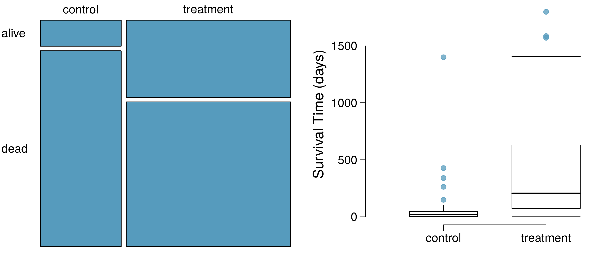
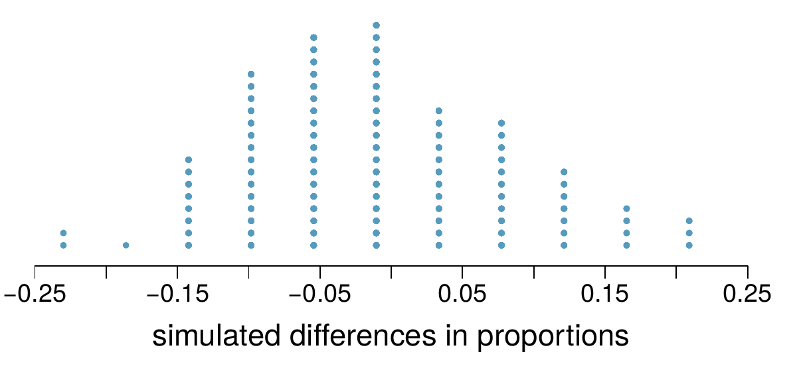

```{r setup, include = FALSE}
knitr::opts_chunk$set(
  cache = FALSE, # if TRUE knitr will cache results to reuse in future knits
  fig.width = 6, # the width for plots created by code chunk
  fig.height = 4.5, # the height for plots created by code chunk
  fig.align = 'center', # how to align graphics. 'left', 'right', 'center'
  dpi = 150, 
  # eval = FALSE, # if FALSE, then the R code chunks are not evaluated
  # results = 'asis', # knitr passes through results without reformatting
  echo = TRUE, # if FALSE knitr won't display code in chunk above it's results
  message = TRUE, # if FALSE knitr won't display messages generated by code
  strip.white = TRUE, # if FALSE knitr won't remove white spaces at beg or end of code chunk
  warning = FALSE) # if FALSE knitr won't display warning messages in the doc
  # options(tinytex.verbose = TRUE)
```

<!--
# Script Name: 2008-351-351m-451-LE1b-NAME.Rmd
# Purpose: This is an Rmd LE file to do your LE in
# Authors: Roger H. French
# License: All rights reserved.
##########
# Latest Changelog Entries:
# v0.00.01 - 1501cwru-dsci-NAMEIT.RMD - Roger French started this blank Rmd
##########

# Rmd code goes below the comment marker!
-->

\setcounter{section}{1}
\setcounter{subsection}{0}

### LE1, 7 points, 7 questions. 

#### In every assignment file, 

  - **CHANGE "NAME" to your Name!!!!**
    - **Otherwise you have git "Merge Conflicts"**

#### Lab Exercise (LE) 1

  - Due Tuesday September 13th
    - By midnight
  - Answers to these problems may be in the back of the book (OIStats-v4), 
    - so you can check your work.  
  - The grading is done on how you show your thinking, 
    - explain yourself and 
    - show your R code and 
    - the output you got from your code.
  - Code style is important 
    - Follow Rstudio code diagnostics notices
    - And the [Google R Style Guide](https://google.github.io/styleguide/Rguide.xml)
    - Which is related to the [Tidyverse Style Guide](https://style.tidyverse.org/)
    - Also available in your class repo, cheat sheets

To be done as an Rmd file, 

  - where you turn in 
    - the Rmd file and 
    - the compiled pdf showing your work. 
    - and the R script of IntroR.R
    
You will want to produce a report type format 

  - (html and pdf type document) to turn in. 
  - And not an ioslides or beamer (slide type) compiled output. 
    - These are presentation formats, and can be fussy

Also are you backing up your git repo 

  - in a second and third location, 
  - to avoid corruption problems?

### So by now I believe everyone has

#### Logged into your Markov Rstudio Server, (or your ODS Desktop).   

	- If you have questions or problems
	  - Ask them in the class DSCI Slack channel 

#### Ask Questions in CWRU-DSCI Slack Channel for DSCI351-351M-451

  - This is the easier way to ask and answer questions
  - You can use @Raymond Wieser and @Roger French 
    - To direct a question to us
    - But anyone can answer the questions

#### 351, 351M and 451 students 

  - Will all do the last part of the homework, 
    - where you are doing some R coding, 
    - inside the R code blocks of the Rmd file 
    - (between the $```{r}$ and the $```$ that closes the R code block in the Rmd file.
    
#### And 451 students 

  - will start writing about what they are considering for their Semester Project.  
    - Read about the 451 Semester Project in 5-SemProj-451>2208-DSCI451-ENGR2451-SemProjectnotes.Rmd
  - Your SemProj will have 3 in-class report outs on progress, and a final full report. 
  - It should ideally be related to your thesis research, 
    - and be a data analysis project that will help advance your research.  
  - We will be defining and refining what you will do your Semester Project on, 
    - in the next few weeks.    

#### Here are answers to a few questions we usually get about HW1

Question A. "I am having trouble converting the Rmd file containing lab exercise 1 into a PDF. I was able to save it as a .txt file--is it okay if I submit that instead of a PDF?"

Once you have made a *.Rmd file, you compile it to make the pdf, by hitting the Knit button at the top of the Rstudio text editor, or you can click on the Knit button to choose Knit to PDF from the choices.  

You can also use the keyboard shortcut Cntrl+Shift+K.  (You can find lots of keyboard shortcuts help with Alt+Shift+K). 

And if you open the LE1b Rmd file named "2008-351-351M-451-LE1b-NAME.Rmd" and change NAME to your own name.  

Then you can immediately compile that Rmd file to make the pdf.  This way you'll know that its not some error in what you have added to the file's text.

Compiling to pdf, uses the LaTeX publishing distribution on your VDI. So if you are trying this on your own personal computer, it won't work, since you probably don't have a LaTeX distribution, such as MikTeX (for windows), MacTeX (for Macs), or TexLive for Linux, installed, so can't produce a LaTeX pdf output.  
       

Question B. "I was also wondering where we are supposed to submit our homework assignments. Are we supposed to upload them onto BitBucket?"

For CWRU students you upload your *.Rmd file (so we can see your coding style and commenting), and your compiled Pdf file to our Canvas Assignment page in canvas.case.edu for the DSCI351-351M-451 class.

For the Pitt, UCF and UTRGV students, upload to your campuses Canvas Site for grading. 

-------------------------------------

Summary of LE1 (quick tip: use Ctrl+Shift+O for viewing all the sub-questions):-

  - LE1-1: 1/2 pt.
  - LE1-2: 1 pt.
  - LE1-3: 1 pt.
  - LE1-4: 1 pt.
  - LE1-5: 1 pt.
  - LE1-6: 1/2 pt.
  - LE1-7: 2 pt.

Remember to include text-based answers of the questions next to 'ANSWER ->'.

Text-based answers carry points.

## LE1-1. (½ pt.) Basic R operations:

- Show an example of addition, subtraction, multiplication, division, and an exponential below

```{r}
print(6 + 2)
print(6 - 2)
print(6 * 2)
print(6 / 2)
print(exp(6))
```

## LE1-2. (1 pt.) Structure of a Data Analysis

### Read about the Structure of a Data Analysis, by Jeff Leek 

  - Located in .3-readings/0-Leek-DataAnalysisStructure-slides/
    - Leek-ADataAnalysisStructureAndOrganizing.pdf
    - 1503LeekDataAnalyticStyle-outline.txt
  - And take a look at Leek's book in ./readings/Texts/Leek-DataAnalyticStyle.pdf
  - This is the approach we take in Applied Data Science
    - Focus on the Question, the Dataset, and the Analysis and Reporting it
 
#### On organizing a data analysis

  - Jeff Leek is a Biostatistician
  - At Johns Hopkins School of Public Health 

#### Steps in a data analysis

  - Define the question
  - Define the ideal data set
  - Determine what data you can access
  - Obtain the data
  - Clean the data
  - Exploratory data analysis
  - Statistical prediction/modeling
  - Interpret results
  - Challenge results
  - Synthesize/write up results
  - Create reproducible code


### Exploratory Data Analysis (EDA) using data frames

  - Data frames are an important data format in R
  - Example data can be loaded from base R
  - Run the code below to load the iris dataset into your environment
  - This data set will be used for the later problems

```{r}
data("iris")
head(iris)
```

  - Give the class of each of the columns in the iris data set
  - Explain what is a factor and how it differs from a character

```{r}
irisFactor <- factor(iris)
irisFactor
```

ANSWER -> Factors have predefined levels of hierarchy, whereas characters can be anything. Factors are stored as numbers of each column/field present in the data set in alphabetical order and a table of levels based on these numbers. This saves a lot of memory for categorical data and make comparison operations quicker because of the way that factors are stored as numbers.

  - Use the table() function to determine how many species there are 
    - and how many observation each one has (Species column in the data frame)

```{r}
irisTable <- table(iris$Species)
irisTable
```

ANSWER -> 3 species: setosa, versicolor, virginica. 50 of setosa, versicolor, and virginica.

  - Use the subset() function create a new data frame of only versicolor flower data

```{r}
subset(iris, Species == "versicolor")

```

  - Give the mean and median of each of the numeric columns for the versicolor data frame
  - Why might the mean and median of the entire iris dataset be misleading?

```{r}

versiColorData <- subset(iris, Species == "versicolor")
print("Petal.Length")
median(versiColorData$Petal.Length)
mean(versiColorData$Petal.Length)
print("Petal.Width")
median(versiColorData$Petal.Width)
mean(versiColorData$Petal.Width)
print("Sepal.Length")
median(versiColorData$Sepal.Length)
mean(versiColorData$Sepal.Length)
print("Sepal.Width")
median(versiColorData$Sepal.Width)
mean(versiColorData$Sepal.Width)
```

ANSWER -> It may be misleading because the species are different, each species probably has their own control statistic.

### Modeling and plotting

  - Use the lm() and plot() functions to build a simple linear model 
    - of versicolor petal length as a function of petal width
  - What are the dependent and independent variables in this case?
  - Add the model to the plot with abline()

```{r}
versiColorData <- subset(iris, Species == "versicolor")
versiColorLm <- stats::lm(versiColorData$Petal.Length~versiColorData$Petal.Width)
versiColorLm
plot(versiColorLm)
plot(versiColorData$Petal.Length~versiColorData$Petal.Width, main = "(VersiColor Petal) Length vs. Width", xlab = "Petal Width", ylab = "Petal Length")
abline(versiColorLm, col = "green")
```

ANSWER -> dependent is the petal length(what we are trying to predict), independent is petal width (our predictor)

- Print the summary of this model

```{r}
summary(versiColorLm)
```


## LE1-3. (1 pt.) Data Basics: OpenIntroStats Exercise 1.9 1n Chapter 1, pg. 20.  

Answer this in this Rmd file and 

  - explain what you are doing, 
  - i.e. show your R code and work.

#### OIS Exercise 1.9 Fisher’s irises, OISv4 page 20. 

[Sir Ronald Aylmer Fisher](https://en.wikipedia.org/wiki/Ronald_Fisher) was

  - An English statistician, evolutionary biologist, geneticist 
    - and unfortunately a [eugenicist](https://en.wikipedia.org/wiki/Eugenics)
  - Who worked on a data set that contained 
    - sepal length and width, and petal length and width 
    - from three species of iris flowers 
      - (setosa, versicolor and virginica). 
  - There were 50 flowers from each species in the data set.
  
### (3a) How many cases were included in the data?

  Show your R code!
  
```{r}
nrow(iris)
```
  
ANSWER -> 150 cases
  
### (3b) How many numerical variables are included in the data? 

  - Indicate what they are, and 
  - if they are continuous or discrete.
  
```{r}
str(iris)
numeric_cols <- unlist(lapply(iris, is.numeric))
numeric_cols
ncol(iris[ , numeric_cols])
discrete_cols <- unlist(lapply(iris, is.integer))
continuous_cols <- unlist(lapply(iris, is.double))
discrete_cols
continuous_cols
```

ANSWER -> There are 4 numerical variables: Petal.Length, Petal.Width, Sepal.Length, Sepal.Width. None of them are discrete(integer/whole numbers), all of them are continuous(double/decimal numbers)
    
### (3c) How many categorical variables are included in the data, 

  - and what are they? 
  - List the corresponding levels (categories).

```{r}
str(iris)
categorical_cols <- unlist(lapply(iris, is.factor))
categorical_cols
levels(iris[ , categorical_cols])
```

ANSWER -> 1 categorical variable: Species. 3 levels: setosa, versicolor, virginica 

## LE1-4. (1 pt.) Examining Numerical Data:. Distributions and Appropriate Statistics

  OISv4 Exercise 2.16 p. 59. 

For each of the following, answer three things

i) State whether you expect the distribution to be 

  - symmetric, 
  - right skewed, 
  - or left skewed. 

ii) Also specify whether the mean or median 

  - would best represent a typical observation in the data, 
  
iii) and whether the variability of observations 

  - would be best represented 
  - using the standard deviation or IQR. 

Explain your reasoning.

### (LE1-4a) Housing prices in a country 

  - where 25% of the houses cost below $350,000, 
  - 50% of the houses cost below $450,000, 
  - 75% of the houses cost below $1,000,000 
  - and there are a meaningful number of houses that cost more than $6,000,000.

ANSWER -> 
Quartiles: Q1 = 350000, Q2 = 450000, Q3 = 1000000
  Diff1 = Q2-Q1 = 100000; Diff2 = Q3-Q2 = 550000
  Diff2 > Diff1 => The distribution would be right skewed
  If the distribution is right skewed, then
  1 - Median would best represent a typical observation in data
  2 - IQR would best represent the variability of observations

### (LE1-4b) Housing prices in a country where 

  - 25% of the houses cost below $300,000, 
  - 50% of the houses cost below $600,000, 
  - 75% of the houses cost below $900,000 
  - and very few houses that cost more than $1,200,000.
  
ANSWER -> 
Quartiles: Q1 = 300000, Q2 = 600000, Q3 = 900000
  Diff1 = Q2-Q1 = 300000; Diff2 = Q3-Q2 = 300000
  Diff2 = Diff1 => The distribution would be symmetric
  If the distribution is symmetric, then
  1 - Mean would best represent a typical observation in data
  2 - Standard Deviation would best represent the variability of observations
  
### (LE1-4c) Number of alcoholic drinks consumed by college students in a given week. 

Assume that most of these students don’t drink

  - since they are under 21 years old, 
  - and only a few drink excessively.

ANSWER -> On average, there are 4 years of college and most students hit 21 on their second half of third year or first half of fourth year. Given the assumption that most students don't drink due to age restrictions and that a few drink excessively, the distribution is expected to be right skewed.
  If the distribution is right skewed, then
  1 - Median would best represent a typical observation in data
  2 - IQR would best represent the variability of observations
  
### (LE1-4d) Annual salaries of the employees at a Fortune 500 company 

  - where only a few high level executives earn much higher salaries 
  - than all the other employees.

ANSWER -> In this case it would be right skewed, a few high level executives earn "much higher" salaries than the others. 
  If the distribution is right skewed, then
  1 - Median would best represent a typical observation in data
  2 - IQR would best represent the variability of observations

## LE1-5. (1 pt.) Examining Numerical Data: OpenIntroStats Exercise 2.9 

in OISv4 Chapter 2, pg 57.

#### Exercise 2.9 Means and SDs. 

For each part, compare distributions (1) and (2) 

  - based on their means and standard deviations. 
  
You do not need to calculate these statistics; 

  - simply state how the means and the standard deviations compare. 

Make sure to explain your reasoning. 

  - Hint: It may be useful to sketch dot plots of the distributions.

### LE1-5a) 
    (1) 3, 5, 6, 7, 9
    (2) 3, 5, 6, 7, 20

```{r}
aLisOne <- c(3, 5, 6, 7, 9)
aLisTwo <- c(3, 5, 6, 7, 20)

mean(aLisOne)
sd(aLisOne)

mean(aLisTwo)
sd(aLisTwo)

adf <- data.frame(aLisOne, aLisTwo)
boxplot(adf)
```

ANSWER -> Mean differs on the value of the last element of each distribution. Because the value of the last element of the second distribution is more than double the value of the last element of the first distribution, the standard deviation (as well as the mean) has a greater value, and gives a greater spread of the acceptable data. This difference makes the mean and the standard deviation more difficult to interpret, and makes them false indicators of what the data should actually represent. The data is skewed towards the greatest value.

### LE1-5b) 
    (1) 3, 5, 6, 7, 9
    (2) 3, 5, 7, 8, 9

```{r}
bLisOne <- c(3, 5, 6, 7, 9)
bLisTwo <- c(3, 5, 7, 8, 9)

mean(bLisOne)
sd(bLisOne)

mean(bLisTwo)
sd(bLisTwo)

bdf <- data.frame(bLisOne, bLisTwo)
boxplot(bdf)
```  

ANSWER -> Range of acceptable values remains the same, mean and sd of the second distribution is slightly greater than the mean of the first. otherwise, both share a similar determination of the distribution.

### LE1-5c) 
    (1) 1, 2, 3, 4, 5
    (2) 6, 7, 8, 9, 10

```{r}
cLisOne <- c(1, 2, 3, 4, 5)
cLisTwo <- c(6, 7, 8, 9, 10)

mean(cLisOne)
sd(cLisOne)

mean(cLisTwo)
sd(cLisTwo)

cdf <- data.frame(cLisOne, cLisTwo)
boxplot(cdf)
```

ANSWER -> Standard deviation is the same on both distributions because the spread of the numbers in the distributions are the same. Mean is only different because the number ranges are different. Scale is maintained.

### LE1-5d) 
    (1) 0, 10, 50, 60, 100
    (2) 0, 100, 500, 600, 1000

```{r}
dLisOne <- c(0, 10, 50, 60, 100)
dLisTwo <- c(0, 100, 500, 600, 1000)

mean(dLisOne)
sd(dLisOne)

mean(dLisTwo)
sd(dLisTwo)

ddf <- data.frame(dLisOne, dLisTwo)
boxplot(ddf)
```

ANSWER -> The second distribution is a multiple of the first, so it implies that the mean and standard distribution scale accordingly with the multiple.


## LE1-6. (½ pt.) For Loops

Using a for loop 

  - complete the problem below in the given code space
  - Create a data frame of 
    - the average temperature (Temp) and 
    - wind speeds (Wind) for each month
  - The data frame must have 3 columns - 
    - average temperature, 
    - average wind speed, and 
    - month number (5, 6, etc.), 
  - colnames are up to you

You may only use one for loop
  - You may not hard code (i.e. type in manually) 
    - the number of each month
  -Hint: you may find the unique() function useful


```{r}

data("airquality")
head(airquality)
str(airquality)

tempToWind <- data.frame(temp=numeric(),
                         wind=numeric(),
                         month=integer())

for (i in unique(airquality$Month)) {
  dataForMonth <- subset(airquality, Month == i)
  tempToWind[nrow(tempToWind) + 1, ] <- c(mean(dataForMonth$Wind), mean(dataForMonth$Temp), i)
}

str(tempToWind)

plot(tempToWind$temp~tempToWind$month)
plot(tempToWind$wind~tempToWind$month)
```


## LE1-7.	(2 pts.) Heart Transplants 

#### Heart Transplants, Chapter 2, Exercise 2.26, p. 76.

The Stanford University Heart Transplant Study was conducted to determine 

  - whether an experimental heart transplant program increased lifespan. 
  - Each patient entering the program was designated 
    - an official heart transplant candidate, 
    - meaning that they were gravely ill 
    - and would most likely benefit from a new heart. 
  - Some patients got a transplant and some did not. 
  
The variable transplant indicates 

  - which group the patients were in; 
    - patients in the treatment group got a transplant and 
    - those in the control group did not. 

Of the 34 patients in the control group, 

  - 30 died. 

Of the 69 people in the treatment group, 

  - 45 died. 
  
Another variable called survived was used 

  - to indicate whether or not 
  - the patient was alive at the end of the study.[1]



### LE1-7a) Based on the mosaic plot, 

  - is survival independent of whether or not the patient got a transplant? 
  - Explain your reasoning.

ANSWER -> Survival time has greatly increased when the patient got the transplant treatment relative to the control group. Control group's alive-dead ratio favors the dead a lot more, whereas the treatment group shows more patients to be alive than dead. So survival would definitely be DEPENDENT on whether or not the patient got the transplant rather than independent.

### LE1-7b) What do the box plots above 

  - suggest about the efficacy (effectiveness) of the heart transplant treatment.

ANSWER -> The box plots suggests the the heart transplant treatment to be very effective. The IQR of the treatment is vastly greater than that of the control, as well as the median. The box plot of the treatment is right skewed, meaning the median and IQR values are reliable and serves as the best possible representation of the data. A patient considering a heart transplant should take the treatment instead of not taking it.

### LE1-7c) What proportion  

  - of patients in the treatment group and what proportion of patients in the control group
  - died?

```{r}
controlDeathProportion <- 30/34 * 100
controlDeathProportion
treatmentDeathProportion <- 45/69 * 100
treatmentDeathProportion
```

ANSWER -> 88.24% of the control group patients died and 65.22% of the treatment group patients died

### LE1-7d) One approach for investigating whether or not the treatment is effective 

  - is to use a randomization technique.

#### LE1-7d-i. What are the claims being tested?

ANSWER -> Does the heart transplant treatment increase a patient's lifespan/survival time?

#### LE1-7d-ii. The paragraph below describes the set up for such approach, if we were to do it without using statistical software. 

```{r}
totalAmount <- 69 + 34
totalDead <- 30 + 45
totalAlive <- totalAmount - totalDead
totalDead
totalAlive
treatmentDeathProportion - controlDeathProportion
```
  - Fill in the blanks with a number or phrase, whichever is appropriate.

We write alive on 28 cards representing patients who were alive at the end of
the study, and dead on 75 cards representing patients who were not. 

Then, we shuffle these cards and split them into two groups: 

  - one group of size 69 representing treatment, 
  - and another group of size 34  representing control. 

We calculate the difference between the proportion of dead cards in the treatment and control
groups (treatment - control) and record this value. 

We repeat this 100 times to build a distribution centered a ~ 0. 

Lastly, we calculate the fraction of simulations where the simulated differences in proportions are -23.02%.

If this fraction is low, 

  - we conclude that it is unlikely to have observed such an outcome by chance 
    - and that the null hypothesis should be rejected 
    - in favor of the alternative hypothesis.
    
#### LE1-7d-iii. What do the simulation results shown below suggest 

  - about the effectiveness of the transplant program?



ANSWER -> With a difference of -23.02% (~ -0.23), and with reference to the graph the represents the results of the 100 times that the simulated difference of proportion, it seems that 2/100 times a -0.23 difference would be the case(2%). Since this fraction is low, it is unlikely that this outcome has been observed by chance, meaning that we reject the null hypothesis in favor of the alternative hypothesis.

#### Links
 
1. B. Turnbull et al. “Survivorship of Heart Transplant Data”. In: Journal of the American Statistical Association 69 (1974), pp. 74–80. [https://www.jstor.org/stable/pdf/2285502.pdf](https://www.jstor.org/stable/pdf/2285502.pdf)
 
2. [http://www.r-project.org](http://www.r-project.org) 

3. [http://rmarkdown.rstudio.com/](http://rmarkdown.rstudio.com/)  

4. [Open Intro Statistics version 4](https://www.openintro.org/book/os/)

<!--
# Keep a complete change log history at bottom of file.
# Complete Change Log History
# v0.00.00 - 1405-07 - Nick Wheeler made the blank script
# v1 -> rename
# v2 -> le1-le5a done
# v3 -> le5b-le7 (entir le1) done
##########
Here are standard YAML Headers for Rmarkdown/Markdown/PanDoc
  1. Beamer slides and PDF Report, html
  2. html and PDF report as full long pages
  3.ioSlides slides and PDF report. ioSlides is buggy, not well supported, but looks nice. 

-->