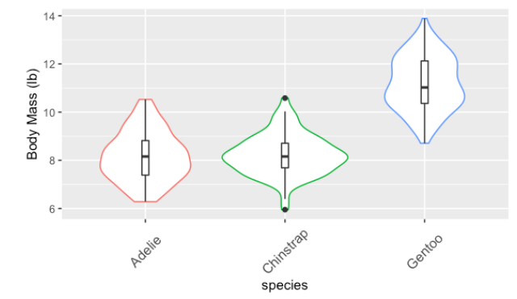

<!--
# Script Name: 2008-351-351m-451-LE4-NAME.Rmd
# Purpose: This is an Rmd LE file to do your LE in
# Authors: Roger H. French
# License: All rights reserved.
##########
# Latest Changelog Entries:
# v0.00.01 - 1501cwru-dsci-NAMEIT.RMD - Roger French started this blank Rmd
##########

# Rmd code goes below the comment marker!
-->

\setcounter{section}{4}
\setcounter{subsection}{0}

```{r setup, include = FALSE}
knitr::opts_chunk$set(
  cache = FALSE, # if TRUE knitr will cache results to reuse in future knits
  fig.width = 5, # the width for plots created by code chunk
  fig.height = 3, # the height for plots created by code chunk
  fig.align = 'center', # how to align graphics. 'left', 'right', 'center'
  dpi = 300, 
  dev = 'png', # Makes each fig a png, and avoids plotting every data point
  # eval = FALSE, # if FALSE, then the R code chunks are not evaluated
  # results = 'asis', # knitr passes through results without reformatting
  echo = TRUE, # if FALSE knitr won't display code in chunk above it's results
  message = TRUE, # if FALSE knitr won't display messages generated by code
  strip.white = TRUE, # if FALSE knitr won't remove white spaces at beg or end of code chunk
  warning = FALSE, # if FALSE knitr won't display warning messages in the doc
  error = TRUE) # report errors
  # options(tinytex.verbose = TRUE)
```

### LE4, 10 points, 5 questions. 

Summary of points (use Ctrl + Shift + O for seeing sub-questions easily):-

Coding style: 1 point

  - LE4-1: 1.5 points
  - LE4-2: 1.5 points
  - LE4-3: 2 points
  - LE4-4: 2 points
  - LE4-5: 2 points
  
#### Lab Exercise (LE) 4

Tidyverse is a set of R packages that make our lives easier when handling unclean data. This lab exercise will highlight the advantages of using these functions as opposed to base R functions. 

--------------------------------------------

## LE4-1. Binomial distribution and normal approximation

(a) A six-sided die is rolled 10 times.  What are the chances of getting exactly 2 ones? (1/4 point)

HINT: Use the `dbinom` command.  
```{r}
prob <- 1/6
number_ones <- 2
number_rolls <- 10
dbinom(number_ones, number_rolls, prob)
```


ANSWER -> ~0.29

(b) Now plot the probability distribution for getting x number of ones in 10 rolls.  (1/4 point)

Check to make sure your plot agrees with your result in (a).

```{r}
library(ggplot2)
number_ones <- c(1:10)
getBinomialDistibution <- function(variable, num_trials, probability) {
  distribution <- data.frame(success = integer(), probability = numeric())
  for (trial in variable) {
    suc <- as.integer(trial)
    distribution[nrow(distribution) + suc,] <- c(suc, dbinom(suc,num_trials,probability))
  }
  return(distribution)
}

plotNumOnes <- function(x, size, prob) {
  variableNumOnes <- getBinomialDistibution(x, size, prob)
  plot <- ggplot(variableNumOnes, aes(x = success, y = probability)
                ) + labs(title = "Probability Distribution For Number Of Ones"
                ) + stat_function(data = variableNumOnes, fun = dbinom
                ) + geom_line()
      return(plot)
}

plotNumOnes(number_ones, number_rolls, prob)

```

(c) Now plot the probability distribution for getting x number of ones in 30 rolls.  (1/4 point)
```{r}
#number_ones <- 1:10
number_rolls <- 30
number_ones <- 1:15
plotNumOnes(number_ones, number_rolls, prob)
```

(d) Now plot the probability distribution for getting x number of ones in 100 rolls.  (1/4 point)
```{r}
#number_ones <- 1:10
number_rolls <- 100
number_ones <- 1:40
plotNumOnes(number_ones, number_rolls, prob)
```

(e) What do you notice about the plots as you increase the number of rolls?  Why is that? (1/4 point)

ANSWER-> The plot skews to the right as the number of rolls increase and the number of ones increase


(f) Let's compare the normal approximation for 30 rolls and 100 rolls.  
For 30 rolls, calculate the exact probability of rolling four 6's. 
Use the normal approximation to estimate the probability of rolling four 6's.  
Hint:  Calculate the probability between 3.5 and 4.5.   (1/4 point)

```{r}
number_ones <- 4
number_rolls <- 30

NormalApproximation <- function(x, size, prob) {
  lower_bound <- x - 0.5
  upper_bound <- x + 0.5
  avg <- size * prob
  sd <- sqrt(avg * (1 - prob))
  lower <- pnorm(lower_bound, avg, sd, lower.tail = TRUE)
  upper <- pnorm(upper_bound, avg, sd, lower.tail = TRUE)
  approx <- upper - lower
  return(approx)
}

exact <- dbinom(number_ones, number_rolls, prob)
normal <- NormalApproximation(number_ones, number_rolls, prob)

exact
normal

```

ANSWER-> The exact probability is 0.185
The probability using the normal approximation is 0.172

(g) Now, let's use the normal approximation for 100 rolls.  
For 100 rolls, calculate the exact probability of rolling fourteen 6's. 
Use the normal approximation to estimate the probability of rolling fourteen 6's.  
What do you notice about the normal approximation with 100 rolls versus 30 rolls? (1/4 point)

```{r}
number_ones <- 14
number_rolls <- 100

exact <- dbinom(number_ones, number_rolls, prob)
normal <- NormalApproximation(number_ones, number_rolls, prob)

exact
normal

```
<<<<<<< HEAD:1-assignments/lab-exercise/LE4/2208-351-351m-451-LE4-MXD601.Rmd

ANSWER-> The exact probability is 0.087
The probability using the normal approximation is 0.083
=======
ANSWER-> The exact probability is ____
The probability using the normal approximation is _____
>>>>>>> main:1-assignments/lab-exercise/LE4/2208-351-351m-451-LE4-NAME.Rmd
The normal approximation is more accurate with more rolls.  

--------------------------------------------

## LE4-2. Tuberculosis in different countries (2 points)

<<<<<<< HEAD:1-assignments/lab-exercise/LE4/2208-351-351m-451-LE4-MXD601.Rmd
Tidyverse contains several tables containing information about TB cases 
in various countries in different data formats. 
=======
Tidyverse contains several tables containing information about 
TB cases in various countries in different data formats. 
>>>>>>> main:1-assignments/lab-exercise/LE4/2208-351-351m-451-LE4-NAME.Rmd

In this exercise, we will work on reshaping data into the desired format.

We want to calculate the TB cases per capita in units of per 10,000 people, 
`case_per_10000`.

<<<<<<< HEAD:1-assignments/lab-exercise/LE4/2208-351-351m-451-LE4-MXD601.Rmd
The ideal format of a data frame to answer this question is one with columns: 
country, year, cases, and population. 
    
Then the problem could be answered with a single `mutate()` call.
However, data doesn't always come in the ideal format.  

We will use the `dcast` and `melt` functions in the library `reshape2` 
to manipulate the data in the desired format and then
use the `mutate()` function to get our answer.  

Also it will be useful to review [the topic of `Joins` in R4DS](https://r4ds.had.co.nz/relational-data.html?q=inner%20join#understanding-joins)
=======
The ideal format of a data frame to answer this question is one with columns 
country, year, cases, and population. Then the problem could be answered with a 
single `mutate()` call.

However, data doesn't always come in the ideal format.  We will use the 
`dcast` and `melt` functions in the library `reshape2` to 
manipulate the data in the desired format and then use the `mutate()` 
function to get our answer.  

Also it will be useful 
  - to review [the topic of  `Joins` in R4DS](https://r4ds.had.co.nz/relational-data.html?q=inner%20join#understanding-joins)
>>>>>>> main:1-assignments/lab-exercise/LE4/2208-351-351m-451-LE4-NAME.Rmd
  
  
### LE4-2a (3/4 points)

<<<<<<< HEAD:1-assignments/lab-exercise/LE4/2208-351-351m-451-LE4-MXD601.Rmd
In table2, each row represents a (country, year, variable) combination. 
The column count contains the values of variables cases and population 
in separate rows.

Since table2 is a tibble, a modified, or "enhanced" form of a dataframe, 
it is best to use the `glimpse` or `print` command on it. You can limit 
the number of rows that `print` will show to n = 10, 
for example with `print(table2, n = 10)`.
  
Use `dcast` to reshape dataframes from long form to wide form with the four
=======
In table2, each row represents a (country, year, variable) combination. The column count contains the values of variables cases and population in separate rows.

Since table2 is a tibble, a modified, or "enhanced" form of a dataframe, 
it is best to use the `glimpse` or `print` command on it. You can limit the 
number of rows that `print` will show to n = 10, for example with 
`print(table2, n = 10)`.

  - Use `dcast` to reshape dataframes from long form to wide form with the four
>>>>>>> main:1-assignments/lab-exercise/LE4/2208-351-351m-451-LE4-NAME.Rmd
desired columns.
Then, use mutate to add the column `case_per_10000`

Read about [the `cast' function]
(https://www.rdocumentation.org/packages/reshape2/versions/1.4.4/topics/cast)


```{r}
library(reshape2)
library(dplyr)
library(tidyverse)

data(table2)
table2$type <- as.factor(table2$type) 

casted <- dcast(table2, country + year ~ type)
casted$year <- as.factor(casted$year)
table2_modified <- mutate(casted, case_per_10000 = (cases / population) * 10000) %>% arrange(country)
glimpse(table2_modified)
```

### LE4-2b (3/4 points)

Table 4 is split into two tables where

  - Table4a contains the values of cases and 
  - Table4b contains the values of population. 
  
Within each table, 
  - each row represents a country, 
  - each column represents a year, 
  - and the cells are the value of the table’s variable for that country and year.

  - Use the `melt` function to reshape Table4a and Table4b into 3 columns.
  - Use the `rename` function to rename the columns appropriately.
  - Use the `left_join` function to join Table4a and Table4b together into a 
    single Table4 dataframe.
  - Sort the rows of Table4 appropriately using `arrange()`
  - Finally, use mutate to add the column `case_per_10000`
  
```{r}
data(table4a, table4b)

melted4a <- melt(table4a, id.vars = c("country"), variable.name = "year", value.name = "cases")
melted4b <- melt(table4b, id.vars = c("country"), variable.name = "year", value.name = "population")
table4joined <- left_join(melted4a, melted4b, by = c("country", "year"))
table4_modified <- mutate(table4joined, case_per_10000 = (cases / population) * 10000) %>% arrange(country)
glimpse(table4_modified)
```

Compare your modified Table2 and Table4 to make sure they match each other.  
```{r}
glimpse(table4_modified)
glimpse(table2_modified)
```


--------------------------------------------


## LE4-3. dplyr functions (2 points)

We will work with the Palmer penguins dataset.  

```{r}
library(tidyverse)
library(palmerpenguins)
data(penguins)
sapply(penguins, class)
```

<<<<<<< HEAD:1-assignments/lab-exercise/LE4/2208-351-351m-451-LE4-MXD601.Rmd
(a) Modify the dataframe with a new column `bill_aspect_ratio` that contains 
the aspect ratio (`bill_length_mm/bill_depth_mm`) of all the penguins in the dataset. 

Compute the average `bill_aspect_ratio` of all the penguins in the dataset. (1/4 point)

HINT: When using the mean function, use the option `na.rm = TRUE` since some entries for 
`bill_aspect_ratio` are NA.
=======
(a) Modify the dataframe with a new column `bill_aspect_ratio` that contains the aspect ratio (`bill_length_mm/bill_depth_mm`) of all the penguins in the dataset. Compute the average `bill_aspect_ratio` of all the penguins in the dataset.   (1/4 point)
>>>>>>> main:1-assignments/lab-exercise/LE4/2208-351-351m-451-LE4-NAME.Rmd

HINT: When using the mean function, use the option `na.rm = TRUE' since some entries for `bill_aspect_ratio` are NA.
```{r}
penguins_aspect_ratio <- mutate(penguins, bill_aspect_ratio = bill_length_mm/bill_depth_mm)
mean_bill_aspect_ratio <- mean(penguins_aspect_ratio$bill_aspect_ratio, na.rm = TRUE)
mean_bill_aspect_ratio
```

ANSWER-> The mean bill aspect ratio is 2.61

(b) Find the mean `bill_aspect_ratio` by island for all the penguins.  (1/4 point)
```{r}
penguins_aspect_ratio$island <- as.factor(penguins_aspect_ratio$island)
penguins_by_island <- dcast(penguins_aspect_ratio, bill_aspect_ratio ~ island)
mean_biscoe <- mean(penguins_by_island$bill_aspect_ratio[penguins_by_island$Biscoe > 0], na.rm = TRUE)
mean_dream <- mean(penguins_by_island$bill_aspect_ratio[penguins_by_island$Dream > 0], na.rm = TRUE)
mean_torgersen <- mean(penguins_by_island$bill_aspect_ratio[penguins_by_island$Torgersen > 0], na.rm = TRUE)

mean_biscoe
mean_dream
mean_torgersen
```

ANSWER-> Biscoe: 2.91
         Dream: 2.41
         Torgersen: 2.12

(c) Create a new column `body_mass_lb` where you convert `body_mass_g` to pounds. (1/4 point)

What is the mean mass of all the penguins in pounds?
What is the standard deviation of all the penguins in pounds?
```{r}
lbs_in_g <- 0.00220462

penguins <- mutate(penguins, body_mass_lb = body_mass_g * lbs_in_g)
mean_body_mass_lb <- mean(penguins$body_mass_lb, na.rm = TRUE)
sd_body_mass_lb <- sd(penguins$body_mass_lb, na.rm = TRUE)

mean_body_mass_lb
sd_body_mass_lb
```

ANSWER-> The mean is 9.27 lbs.
  The standard deviation is 1.77 lbs.

(d) Plot a histogram of all the penguins `body_mass_lb`.
Use the mean and standard deviation above to plot a normal plot on top of the histogram.  Why does the normal approximation not seem to work very well here?  
What would you do to make the normal approximation work better? (1/4 point)

```{r}

penguins <- mutate(penguins, norm_body_mass = dnorm(body_mass_lb, mean_body_mass_lb, sd_body_mass_lb)) 
ggplot(data = penguins, mapping = aes(x=body_mass_lb, y=norm_body_mass, mean, sd)
       ) + labs(title = "Normalized Body Mass Histogram (lbs)"
       ) + xlab ("Body Mass (lb)"
       ) + ylab("Normal Body Mass (lb)"
       ) + geom_histogram(binwidth = 0.1, alpha = 0.4, stat='identity'
       ) + stat_function(data = penguins, fun = dnorm) + geom_line()


```

ANSWER-> skewed to the left, and normal approximation is pretty discrete

This is an example of a plot generated using geom_violin in ggplot
using the penguins dataset. (1/2 point)



Recreate this plot using ggplot as best you can. It does not have to be 
identical, but your plot should be

  - professionally presentable and 
  - contain all the relevant information. 

You should use the theme() function in ggplot to set custom axis labels with
  
  - angled labels and 
  - appropriate font size.

```{r}

ggplot(data=penguins, 
       mapping=aes(x=species, y=body_mass_lb, color=species, mean, sd)
       ) + ylab("Body Mass (lb)"
                ) + geom_violin(
                ) + geom_boxplot(width=0.1,
                                 color="black")

```

(f) Let's make a function 
that selects all the species `species_select` and `variable_select` and makes 
a histogram with color `color_plot` and plots the 
normal approximation (use `stat_function()`) on top of the histogram.
(1/2 point)

```{r}

PlotHistogramSpecies <-
  function(penguins, species_select, variable_select, color_plot) {
    penguins_for_species <- subset(penguins, species = species_select, select = c(variable_select))
    penguins_for_species$variable_select = penguins_for_species[ , variable_select]
    
    histogram <- ggplot(penguins_for_species, 
                        aes(x = penguins_for_species, color = color_plot, mean, sd)
                        ) + stat_function(fun = dnorm(variable_select, mean = mean(variable_select), sd = sd(variable_select))
                        ) + geom_histogram()
    return(histogram)
}

```

Test your function on the following three function calls.  

```{r}
PlotHistogramSpecies(penguins, species_select = 'Adelie', variable_select = 'body_mass_lb', color_plot = 'blue') 
```

```{r}
PlotHistogramSpecies(penguins, species_select = 'Chinstrap', variable_select = 'bill_length_mm', color_plot = 'red') 
```

```{r}
PlotHistogramSpecies(penguins, species_select = 'Gentoo', variable_select = 'flipper_length_mm', color_plot = 'green') 
```

## LE4-4 EDA of sports salaries (2 points)

There is a dataset of basketball player's salaries from the 1984 through the
2017 season. The season is defined by what year it starts in. 

We'll use tidyverse throughout this problem. 

And lets use a ggplot theme for our plots, 

  - so they look like a newspaper or magazine of your choice. 

ggplot2 has built in themes


ggthemes package has more interesting ones. 

  - You can read about ggplot themes in R4DS Ch 28.6
  - but the more famous themes are in the ggthemes package. 
  

```{r}
library(tidyverse)
library(ggthemes)

```

(a) So first read in the data, its in two .csv files for players and for salaries.
The players file is like a key file to identify the players. (1/4 point)

Figure out which column in `df_players` maps to which column in `df_salaries`.  
Then, combine these into a single dataframe using `merge`.
Rename the column, `season_start` to `year`

```{r}
# read in data
df_players <- read_csv("./data/players.csv")
df_salaries <- read_csv("./data/salaries_1985to2018.csv")
df_salaries %>% rename("id" = "player_id")
df_nba <- merge(df_players, df_salaries, by = "id")
df_nba %>% rename("year" = "season_start")
glimpse(df_nba)

```

Since each observation is one player's salary for 1 year.

(b) Make a plot of players salaries as a function of year.  (1/4 point)

```{r}


```

(c) Display the top paid player for each year from 2000 onward.
Use the function `top_n()` and `select`.  (1/4 point)

```{r}


```

(d) Next plot how many teams there are in each season since 2000. 
(1/4 point)

```{r}
# count no. of teams by year


```

What year was a team added to the league?  Use the web to determine what team that was. 

ANSWER: 

  


(e) Make a stacked histogram plot so that is shows players per team and sums the teams up to show the total players for each year on the y axis. 

Use the command `summarize(n_players = n_distinct(id), .groups='keep')` to summarize the number of players on each team 
and use `geom_col` to create the histogram of the groups.  

(1/4 point)

```{r}
# count no. of players by year


```

(f) Now lets look at the total salary by year. (1/4 point)

Use the `summarize_at` function to get the total salary per year.
Then plot the total salary by year.  

```{r}


```

(g) 
How is the salary pool of each team? 

  - Are they all comparable?
  - Or are their large differences?

Make a plot of the salary of each team by year.  

Group the player salaries by year and by team.  
Then, use the summarize command and plot all team
salaries using different colors.  (1/2 point)

Add a `geom_smooth(size = 0.5)` to show the overall trend

```{r}
# total salary by year by team


```

ANSWER (How is the salary pool for each team?) ->


## LE4-5 Acrylic Hardcoats continued (2 points)

You will practice reading in data and writing efficient code.  

A good practice in developing code is to write out pseudocode, which serves an outline for your code.  The pseudocode has been written out here for you.  
  
Write a function that will 

  - Go into a particular folder.
  - Get all the files in that folder using `files <- list.files(path = folder_name)`
  - Search around the four wavelengths specified +- 50 for the maximum value around 
  - Save the peak at that wavenumber
  - Include the step as the last column
  
The resulting dataframe should have six columns for each observation: 
  
  - `ID`: the sample ID
  - 'FTIR_1250': the maximum peak near wavenumber 1250 
  - 'FTIR_1700': the maximum peak near wavenumber 1700
  - 'FTIR_2900': the maximum peak near wavenumber 2900
  - 'FTIR_3350': the maximum peak near wavenumber 3350
  - 'step': the step from the folder

Your final data frame `df_FTIR` should be 366 rows and 6 columns.  

Key: Do not duplicate code.  

As you are developing your code, initially test out the function on a single file.  Then, test it on a list of files in one folder.  Then, test it on all folders. This will make debugging easier.   

If you write your code efficiently, you should be able to code everything in only 30 lines of code or less.  

```{r}

library(ggplot2)
library(dplyr)

# wavenumbers we want peak intensities at
wavenumber_peaks = c(1250,1700,2900,3350) # units of 1/cm
exposure_steps <- 0:4

DeterminePeakIntensities <- function(step_number, wavenumber_peaks,
                                     wavenumber_peak_range = 50) {
  # search around all the wavenumbers range around each wavenumber to search for peak; 
  # will search +- wave_number_peak_range around the wavenumber
  
  
  
  
  return(data_FTIR_peaks_all)
}

df_FTIR <- exposure_steps %>% map_dfr(DeterminePeakIntensities, wavenumber_peaks)
dim(df_FTIR)


```

#### Links
 
http://www.r-project.org 

http://rmarkdown.rstudio.com/  

Chris Davis: https://data.world/datadavis/nba-salaries