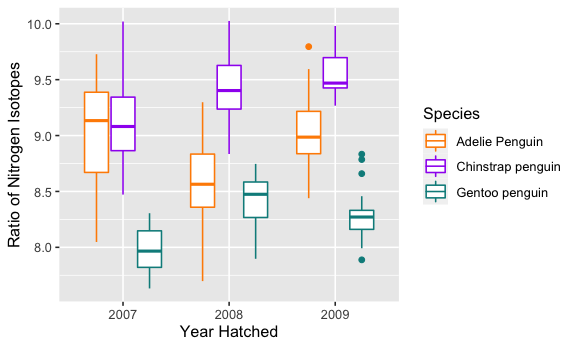
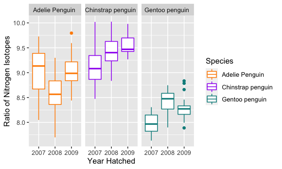
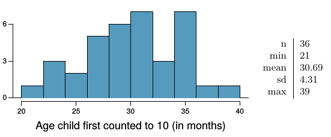
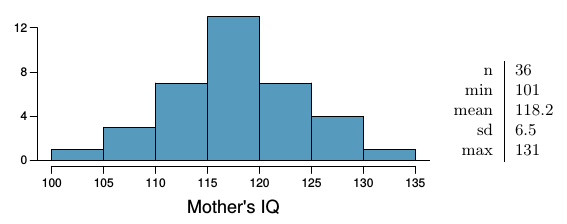

<!--
# Script Name: 2008-351-351m-451-LE5-NAME.Rmd
# Purpose: This is an Rmd LE file to do your LE in
# Authors: Roger H. French
# License: All rights reserved.
##########
# Latest Changelog Entries:
# v0.00.01 - 
##########
# Rmd code goes below the comment marker!
-->

\setcounter{section}{5}
\setcounter{subsection}{0}

```{r setup, include = FALSE}
knitr::opts_chunk$set(
  cache = FALSE, # if TRUE knitr will cache results to reuse in future knits
  fig.width = 5, # the width for plots created by code chunk
  fig.height = 3, # the height for plots created by code chunk
  fig.align = 'center', # how to align graphics. 'left', 'right', 'center'
  dpi = 300, 
  dev = 'png', # Makes each fig a png, and avoids plotting every data point
  # eval = FALSE, # if FALSE, then the R code chunks are not evaluated
  # results = 'asis', # knitr passes through results without reformatting
  echo = TRUE, # if FALSE knitr won't display code in chunk above it's results
  message = TRUE, # if FALSE knitr won't display messages generated by code
  strip.white = TRUE, # if FALSE knitr won't remove white spaces at beg or end of code chunk
  warning = FALSE, # if FALSE knitr won't display warning messages in the doc
  error = TRUE) # report errors
  # options(tinytex.verbose = TRUE)
```

### LE5, 10 points, 5 questions. 

Summary of points (use Ctrl + Shift + O for seeing sub-questions easily):-

Coding style: 1 point

  - LE5-1: 1 point
  - LE5-2: 1 point
  - LE5-3: 2 points
  - LE5-4: 1.5 point
  - LE5-5: 1.5 points
  - LE5-6: 2 points
  
-----

## 1 Statistical Tests of Significance (1 point) 

This question uses beaver body temperature data from the `beavers` datasets built into base R.
  

```{r, echo=FALSE, include=FALSE}
library(dplyr)
```


### 1.1 Statistical testing hypotheses (0.25 points)


What assumptions do we need to make before conducting our statistical tests?

ANSWER=> Statistical tests commonly assume that:
1 - data is normally distributed
2 - data is independent
3 - data shares similar variance

### 1.2. Beaver data exploration (0.25 points)

Merge `beaver1` and `beaver2` into the same dataframe `beaver`
with an additional column `number` indicating which beaver.

```{r}
bvr1 <- datasets::beaver1
bvr2 <- datasets::beaver2
bvr1['number'] <- '1'
bvr2['number'] <- '2'

beaver <- rbind(bvr1, bvr2)
```

Filter out

  - the `beaver` data between 9:00 AM (9)  and 6:00 (18) PM (inclusive) -> `df_beaver_daytime`
  - the `beaver` data between 6:00 PM (18) and 9:00 (9)  AM (exclusive) -> `df_beaver_nighttime`
  
for each beaver's temperature.
    
What is 

  - the mean daytime temperature?
  - the mean nighttime temperature?

```{r}
df_beaver_daytime <- subset(beaver, time > 900 & time < 1800)
df_beaver_nighttime <- subset(beaver, !(time > 900 & time < 1800))

mean(df_beaver_daytime$temp)
mean(df_beaver_nighttime$temp)
```

ANSWER=> MEAN DAYTIME = 37.06644
         MEAN NIGHTTIME = 37.33682

### 1.3 Statistical Tests (0.25)

Would it be possible to use the combined beaver dataset to test the hypothesis if beaver temperatures are different from human body temp?
Assume humans have a mean temperature of 37 $^o$C) and $\sigma^2 = 1$.

If not, explain why not.  
If yes, perform the statistical test and explain the result.  

```{r}
meanHumanTemp <- 37
varianceHumanTemp <- 1

meanBeaverTemp <- mean(beaver$temp)
varianceBeaverTemp <- var(beaver$temp)

sprintf("mean temps compare => human: %s, beaver: %s", meanHumanTemp, meanBeaverTemp)
sprintf("variance temps compare => human: %s, beaver: %s", varianceHumanTemp, varianceBeaverTemp)
```

ANSWER=> The sample size for humans hasn't been given, therefore, it wouldn't be possible. Included mean and variance compare as metadata  


parameters of interest: mean and variance test for independence

  (null hypothesis($H_o$): beaver temp and human body temp is independent, so it's not possible to test the hypothesis if beaver temperatures are different from human body temp)
  (alternative hypothesis($H_a$): beaver temp and human body temp is dependent, so it is possible to test the hypothesis if beaver temperatures are different from human body temp)

### 1.4 Statistical Tests (0.25)

I want to determine if beaver 1 and beaver 2 have the same temperature. Can I use the two datasets to determine whether they have the same temperature?  

If not, explain why not and describe how the datasets would need to be modified.
If yes, perform the statistical test and explain the result.  

```{r}
numBeaver1 <- nrow(bvr1)
meanBeaver1Temp <- mean(bvr1$temp)
varianceBeaver1Temp <- var(bvr1$temp)

numBeaver2 <- nrow(bvr2)
meanBeaver2Temp <- mean(bvr2$temp)
varianceBeaver2Temp <- var(bvr2$temp)

sprintf("mean temps compare => beaver1: %s, beaver2: %s", 
        meanBeaver1Temp, 
        meanBeaver2Temp)
sprintf("variance temps compare => beaver1: %s, beaver2: %s", 
        varianceBeaver1Temp, 
        varianceBeaver2Temp)

# Start Test Statistic Calculation
# Null Hypothesis Ho = meanBeaver2Temp = meanBeaver1Temp
# Alternative Hypothesis Ha = meanBeaver2Temp != meanBeaver1Temp

# step 1: derive a pooled standard deviation

dof <- numBeaver1 + numBeaver2 - 2
spBeaver1 <- (numBeaver1 - 1) * varianceBeaver1Temp
spBeaver2 <- (numBeaver2 - 1) * varianceBeaver2Temp

pool <- sqrt((spBeaver1 + spBeaver2)/dof)

# step 2: get t-test statistic
meanBeaverDiff <- meanBeaver1Temp - meanBeaver2Temp

testStatistic <- meanBeaverDiff/(pool * sqrt((1/numBeaver1) + (1/numBeaver2)))

# step 3: get p value
# expected pvalue = 0.05
pVal <- pt(testStatistic, dof)
pVal
```

ANSWER=> Sample size is given, so a statistical test is able to be performed. Significance level of the test is 0.05, if the p-value we derive is close to 0.05, then we can say beaver1 temp is the same as beaver2 temp. Otherwise, they're not the same.

null hypothesis($H_o$): beaver1 temp and beaver2 temp is independent, so it's possible to determine whether they have the same temperature
alternative hypothesis($H_o$): beaver1 temp and beaver2 temp is dependent, so it's NOT possible to determine whether they have the same temperature

pvalue is far lower than 0.05, so they are not the same


## 2 Statistical Tests for Two Samples (0.5 point)

People think a new vaccine may be help reduce cases of the flu.  

Well-controlled experiments are needed to determine whether the benefits of this new drug outweigh the risks. The basic method is COMPARISON.The experiment should also be run DOUBLE-BLIND 
(**Neither the doctors or subjects should know who was in the treatment group and who was in the control group.**).

**double blinding**:  

  - Subjects do not know whether they got the treatment or the placebo.  
  - Neither did those who evaluated the response.  
  
The drug is given to subjects in the treatment group, but not given to subjects in the control group. Subjects should be assigned to the treatment or control group at random.

Human judgement for determining who is in which group often results in **BIAS**.  
It is better to **rely on impersonal chance**.
It is also important to **use a placebo**.
During the experiments subjects were blinded and did not know whether they were in the treatment or control group.  
This is to ensure that their response is to the actual vaccine and not the idea of the treatment.  
The **strength of an idea or placebo-effect** has shown to for example patients experiencing pain relief.  

Many forms of COVID are difficult to diagnose and in borderline cases, doctors could be affected by knowing whether the subject was vaccinated.

Doctors have to decide whether the subject contracted COVID during the experiment => So doctors were not told what group the subject belonged to.

This randomized, placebo-controlled, double blind experiment is the best design there is.  

### 2.1 Normality

Do we need the data to be normal to carry out our test?  Why or why not?

ANSWER=> Running a randomized, double blind, placebo-controlled experiment to reducing BIAS gives the most accurate data needed for the data scientist, so we don't need the data to be normalized to carry out the test. Given this, we can assume equal variances

### 2.2 Hypothesis Testing

400,000 people were part of a randomized placebo-controlled double-blind study.  
Half were assigned to the vaccine group and the other half to the placebo:

  - In the vaccine group, there were 57 cases of the flu.  
  - In the placebo group, there were 142.  
  
What is 

  - the null hypothesis ($H_o$)
  - and the alternative hypothesis ($H_a$)?  

ANSWER=> 

null hypothesis ($H_o$): vaccine effects are ineffective and are equal to the placebo effects (true mean difference is equal to 0)
alternative hypothesis ($H_a$): vaccine effects are effective and are less than the placebo effects (true mean difference is not equal to 0)

### 2.3 T-Test

Is the observed difference due to chance? 
What is the p-value and what is the conclusion?
Create appropriate vectors and use the function `t.test()`

```{r}
nVacc <- 200000
nPlac <- 200000

vacc <- 57
plac <- 142

meanVacc <- vacc/nVacc
meanPlac <- plac/nPlac

sdVacc <- sqrt((meanVacc * (1 - meanVacc))/nVacc)
sdPlac <- sqrt((meanPlac * (1 - meanPlac))/nPlac)

vaccSet <- c(rnorm(nVacc, meanVacc, sdVacc))
placSet <- c(rnorm(nPlac, meanPlac, sdPlac))

t.test(placSet, vaccSet, paired = TRUE)
```

ANSWER => Based on the t.test function; 

  - observed difference due to chance is 0.0004
  - pvalue = 2.2e-16
  - confidence interval = {0.0004246519, 0.0004252697}
  - conclusion = null hypothesis is rejected, favoring alternative hypothesis

----

## 3 Data Exploration and Visualization of Palmer's Penguins (2 points)

We will now perform some elementary data cleaning and EDA. The [Palmer's Penguins](https://allisonhorst.github.io/palmerpenguins/index.html)
dataset includes measurements of penguin characteristics used in sampling population dynamics. 

Included in the `palmerspenguins` data set are
  - Raw Data File
  - Cleaned Data File
    
Our goal is to perform some elementary operations on the RAW data in order to use the cleaned data for a future time. 
```{r}
library(palmerpenguins)
data("penguins_raw")
data("penguins")
```


### 3.1 (.25 points)

Raw data files often contain improperly named columns that are not in accordance with R naming conventions. 

Two commonly used naming conventions are 

  - [camelCase](https://en.wikipedia.org/wiki/Camel_case) 
  - [snake_case](https://en.wikipedia.org/wiki/Snake_case)

Using one of the above naming conventions

  - Rename the columns
      - Avoiding Special Characters
      - Spaces
      - "dashes"

```{r}
library(dplyr)
# since clean data is in snake case, I will be using snake case to solve

snaky_penguins <- penguins_raw %>% rename("study_name" = "studyName"
           ) %>% rename("sample_number" = "Sample Number"
           ) %>% rename("species" = "Species"
           ) %>% rename("region" = "Region"
           ) %>% rename("island" = "Island"
           ) %>% rename("stage" = "Stage"
           ) %>% rename("id" = "Individual ID"
           ) %>% rename("clutch_completion" = "Clutch Completion"
           ) %>% rename("date_egg" = "Date Egg"
           ) %>% rename("culmen_length" = "Culmen Length (mm)"
           ) %>% rename("culmen_depth" = "Culmen Depth (mm)"
           ) %>% rename("flipper_length" = "Flipper Length (mm)"
           ) %>% rename("body_mass" = "Body Mass (g)"
           ) %>% rename("sex" = "Sex"
           ) %>% rename("delta_n15" = "Delta 15 N (o/oo)"
           ) %>% rename("delta_c13" = "Delta 13 C (o/oo)"
           ) %>% rename("comments" = "Comments"
           ) 
           
glimpse(snaky_penguins, width = 0)
```

-----

### 3.2 (.5 points)

Raw data files often contain excess data that will not be used in our analysis.

Sometimes extraneous data is contained in cells with important data.

Let's try to separate out some of the useful information from the less useful
  - Separate the 'species' column into one for the 'scientific_name' and one for the 'common_name'
  - Separate the 'date_egg' column into three separate columns for
      - 'day_egg'
      - 'month_egg'
      - 'year_egg'
        
```{r}
# IMPORTANT NOTE: this r chunk is dependent on prior chunk in order to function properly. 
# to rerun, run prior chunk first AND THEN this chunk
# technically a ONE-TIME RUN
library(tidyr)
library(lubridate)

# species regex split pattern: " (" => [1~>common_name], [2~> sci_name]
# for common_name => remove " Pengiun" or " penguin"
# for sci_name => remove tailing ")"
speciesSplitPattern <- "\\s\\("
commonNameRemove <- "\\s[Pp]enguin"
sciNameRemove <- "\\)"

common_names <- vector("character", nrow(snaky_penguins))
sci_names <- vector("character", nrow(snaky_penguins))
specCt <- 1
for (spec in snaky_penguins$species) {
  species_split <- strsplit(spec, speciesSplitPattern)
  new_common_name <- gsub(commonNameRemove, "", species_split[[1]][1])
  new_sci_name <- gsub(sciNameRemove, "", species_split[[1]][2])
  common_names[specCt] <- new_common_name
  sci_names[specCt] <- new_sci_name
  specCt <- specCt + 1
}

snaky_penguins$common_name <- common_names
snaky_penguins$sci_name <- sci_names

# date is a date, not a character type, so use lubridate to refactor and parse
dateSplitPattern <- "\\-"
years_egg <- vector("character", nrow(snaky_penguins))
months_egg <- vector("character", nrow(snaky_penguins))
days_egg <- vector("character", nrow(snaky_penguins))
dateCt <- 1
for (dt in snaky_penguins$date_egg) {
  dt <- as_date(dt)
  new_year_egg <- year(dt)
  new_month_egg <- month(dt)
  new_day_egg <- day(dt)
  years_egg[dateCt] <- new_year_egg
  months_egg[dateCt] <- new_month_egg
  days_egg[dateCt] <- new_day_egg
  dateCt <- dateCt + 1
}

snaky_penguins$day_egg <- days_egg
snaky_penguins$month_egg <- months_egg
snaky_penguins$year_egg <- years_egg

print("remove used cols and move new cols to appropriate locations")
print("before:")
glimpse(snaky_penguins, width = 0)

cleanup <- c("species", "date_egg")
snaky_penguins <- snaky_penguins[ , !(names(snaky_penguins) %in% cleanup)]

snaky_penguins <- snaky_penguins %>% relocate(common_name, .after = sample_number
             ) %>% relocate(sci_name, .after = common_name
             ) %>% relocate(day_egg, .after = clutch_completion
             ) %>% relocate(month_egg, .after = day_egg
             ) %>% relocate(year_egg, .after = month_egg
             )

print("after:")
glimpse(snaky_penguins, width = 0)
```

**SOLUTION**: Use string patterns and regex to manipulate (from cheatsheet) =>

**NOTE: couldn't find space("\\s") and parenthesis("\\(", "\\)") regex escape sequences in cheatsheet**
METACHARACTERS
`\n New line`
`\r Carriage return`
`\t Tab`
`\v Vertical tab`
`\f Form feed`

CHARACTER CLASSES AND GROUPS
`. Any character except \n`
`| Or, e.g. (a|b)`
`[…] List permitted characters, e.g. [abc]`
`[a-z] Specify character ranges`
`[^…] List excluded characters`
`(…) Grouping, enables back referencing using \\N where N is an integer`

ANCHORS 
`^ Start of the string`
`$ End of the string`
`\\b Empty string at either edge of a word`
`\\B NOT the edge of a word`
`\\< Beginning of a word`
`\\> End of a word`

QUANTIFIERS
`* Matches at least 0 times`
`+ Matches at least 1 time`
`? Matches at most 1 time; optional string`
`{n} Matches exactly n times`
`{n,} Matches at least n times`
`{n,m} Matches between n and m times`

REGEX LOGIC
1 - Detect Pattern -> "...<pattern>..." 

  - base
    - `grep(pattern,string,value=<T/F>)`
    - `grepl(pattern,string)`
  - stringr
    - `stringr::str_detect(string,pattern)`
  
2 - Locate Pattern
  
  - base
    - `regexpr(pattern,string)` -> start pos and len of first match
    - `gregexpr(pattern,string)`-> start pos and len of all matches
  - stringr
    - `stringr:::str_locate(string, pattern)` -> start pos and end pos of first match
    - `stringr::str_locate_all(string, pattern)` -> start pos and end pos of all matches

3 - Extract Pattern

  - base
    - `regexpr(pattern,string)` -> start pos and len of first match
    - `gregexpr(pattern,string)`-> start pos and len of all matches
  - stringr
    - `stringr:::str_locate(string, pattern)` -> start pos and end pos of first match
    - `stringr::str_locate_all(string, pattern)` -> start pos and end pos of all matches

4 - Replace Pattern

  - base
    - `sub(pattern, replacement, string)` -> replace first
    - `gsub(pattern, replacement, string)` -> replace all **USED**
  - stringr
    - `stringr::str_replace(string, pattern, replacement)` -> replace first
    - `stringr::str_replace_all(string, pattern, replacement)` -> replace all
  

5 - Split String via Pattern

  - base
    - `strsplit(string, pattern)` **USED: wierd vector of vector return, need to be careful when using this** 
  - stringr
    - `stringr::stringr::str_split(string, pattern)`

-----

### 3.3 (.25 points)

Additionally, sometimes data will contain variables that you don't recognize. 

  - What is Delta 15 N?

ANSWER -> a number denoting the measure of the ratio of stable isotopes 15N:14N

-----

  - What is Delta 13 C?

ANSWER -> a number denoting the measure of the ratio of stable isotopes 13C:12C

-----

  - What is a penguin's culmen?
    
ANSWER -> the dorsal ridge of a bird's bill (i.e. bill)

-----

Rename the "culmen" variable 

  - into plain English 
  - using tidyverse functions.

```{r}
snaky_penguins <- snaky_penguins %>% rename("bill_length" = "culmen_length"
                               ) %>% rename("bill_width" = "culmen_depth"
                               ) 
glimpse(snaky_penguins, width = 0)
```

-----

What are the correlation coefficients between bill_length, bill_width, flipper_length, body_mass? (By species)
Use the `pairs.panels()` function in the `psych` library to plot the pairwise correlation plots between these four variables.
  

```{r}
library('psych')
library('GGally')
library('ggcorrplot')

bill_length_index <- 13
body_mass_index <- 16

# correlation payload
print("correlation table")
correlation <- cor(snaky_penguins[,bill_length_index:body_mass_index])
correlation
print("not good, each correlation is mapped to 1")

# general pairs function with just jumbled data
pairs(snaky_penguins[,bill_length_index:body_mass_index])

## ggpairs to uncover the RAW correlation plot with raw values
ggpairs(snaky_penguins[,bill_length_index:body_mass_index],
        title = "Raw Correlation")

## ggcorr tp uncover relationships between the correlation coefficients
ggcorr(snaky_penguins[,bill_length_index:body_mass_index],
       name = "Graphical Representation of Corr Coeffs")

ggcorrplot(snaky_penguins[,bill_length_index:body_mass_index],
           title = "ggcorrplot?")


## pairs.panels to uncover a more pretty correlation plot
pairs.panels(
  snaky_penguins[bill_length_index:body_mass_index],
  bg = c("red", "yellow", "blue")[snaky_penguins$common_name],
  pch = ".",
  method = 'pearson',
  main = "Correlation by Species?",
  smooth = FALSE,
  lm = FALSE,
  ellipses = FALSE,
  ci = TRUE
)


```

Which is your favorite pairwise correlation plot visualization? Explain why.

ANSWER=> pairs.panels did not color code as expected (dissapointing), it has simpler inputs. ggcorrplot looks like it has a slightly greater learning curve. although the data looks raw, the simplest to use was ggpairs (just pass in the correlation you want!) and it's basically like pairs.panels but without all the formatting. The simplicity of ggpairs trumps all in most cases.

When selecting columns, it is better to use the column names as opposed to the column indices? Why?

ANSWER => This sounds like a subjective preference question. Although using column names is ideal, column indices seems like it was more efficient to use. If needed, we can remap location of indices to take advantage of the [<start>:<end>] property via dplyr::relocate, move it where we deem appropriate, and then give indices an appropriate var name. I think this is simpler than having the functions figure out mapping of the columns to correctly interpret what columns we desire by name.


Which of the two variables are most strongly correlated?  What is the correlation coefficient of these two variables?

ANSWER -> flipper_length and body_mass (0.87, closest to $\pm$1)

Which of the two variables are least strongly correlated?  What is the correlation coefficient of these two variables?

ANSWER -> bill_width and bill_width (-0.24, farthest from $\pm$1)


### 3.4 (0.5 points)

What is the relationship between nitrogen radioactive isotope concentration and penguin birth year? (By species)

Use `ggplot2` to create the following plot.



```{r}
snaky_penguins$year_egg <- as.factor(snaky_penguins$year_egg)
snaky_penguins$common_name <- as.factor(snaky_penguins$common_name)

# ggplot is going to graph delta_n15 by year, factored by species
# Colors: Adelie -> darkorange, Chinstrap -> darkorchid, Gentoo -> darkcyan
ggplot(data = snaky_penguins, aes(x = year_egg, y = delta_n15)
       ) + geom_boxplot(aes(color = common_name), show.legend = TRUE
       ) + scale_color_manual(values = c("darkorange","purple","cyan4")
       ) + labs(x = "Year Hatched",
                y = "Ratio of Nitrogen Isotopes",
                color = "Species"
       )

```


### 3.5 (0.5 points)

Now use `ggplot2` to create the following plot.




```{r}
# ggplot is going to graph delta_n15 by species, factored by year
# Colors: Adelie -> darkorange, Chinstrap -> darkorchid, Gentoo -> darkcyan
ggplot(data = snaky_penguins, aes(x = year_egg, y = delta_n15)
       ) + geom_boxplot(aes(color = common_name), show.legend = TRUE
       ) + scale_color_manual(values = c("darkorange","purple","cyan4")
       ) + labs(x = "Year Hatched",
                y = "Ratio of Nitrogen Isotopes",
                color = "Species"
       ) + facet_wrap(~common_name)

```


## 4 Twitter Users (OIS Exercise 5.8) (1.5 point)

A poll conducted in 2013 found that 

  - 52% of U.S. adult Twitter users get at least some news on Twitter.
  - The standard error for this estimate was 2.4%, and a normal distribution may be used to model the sample proportion. 

### 4.1 Confidence Intervals (0.75 points)

Construct a 99% confidence interval for the fraction of U.S. adult Twitter users who get some news on Twitter, 
and interpret the confidence interval (CI) in context.

```{r}
ciFraction <- 0.99
sigLevel <- 1 - ciFraction
approxVal <- 1 - (sigLevel/2)

# the critical zscore value (from zscore table) for approximate value 0.995 is 2.5
sprintf("approximate value for critical z-score value = %s", 
        approxVal)
criticalVal <- 2.58
sprintf("critical z-score value = %s", 
        criticalVal)

pointEstimate <- 0.52
stdError <- 0.024

ci <- c(pointEstimate - (criticalVal * stdError), 
        pointEstimate + (criticalVal * stdError))

ci

```

ANSWER (interpret the CI) -> CI is (0.458, 0.582)


### 4.2 (OIS Exercise 5.10) (0.75 points)

Identify each of the following statements as true or false. 
Provide an explanation to justify each of your answers.

(a) The data provide statistically significant evidence that more than half of U.S. adult Twitter users get some news through Twitter. Use a significance level of $\alpha$ = 0.01.

null hypothesis($H_o$): The data provide statistically significant evidence that EXACTLY half of U.S. adult Twitter users get some news through Twitter
alternative hypothesis($H_a$): The data provide statistically significant evidence that MORE THAN half of U.S. adult Twitter users get some news through Twitter

```{r}
testEstimate <- 0.5
# TEST STAT: Z = (pointEstimate - testEstimate/stdError)
testStat <- (pointEstimate - testEstimate)/stdError

testStat
```

ANSWER -> FALSE. Test Statistic 0.83 is less than the critical Z-Score value 2.58, therefore null hypothesis Ho cannot be rejected.  

(b) Since the standard error is 2.4%, we can conclude that 97.6% of all U.S. adult Twitter users were included in the study.
    
ANSWER -> FALSE. standard error of the sample is NOT related to the population

(c) If we want to reduce the standard error of the estimate, we should collect less data.

ANSWER -> FALSE. standard error is inversely proportional to the sample size, if we want to reduce standard error we have to collect more data

(d) If we construct a 90% confidence interval for the percentage of U.S. adults Twitter users who get some news through Twitter, this confidence interval will be wider than a corresponding 99% confidence interval.

ANSWER -> FALSE. As confidence level increases, critical value increases. If critical value increases, width of confidence interval increases. A 90% confidence interval will be narrower than a 99% confidence interval


## 5 Gifted children (1.5 points)


### 5.1 Initial Study (0.75 points)

Researchers investigating characteristics of gifted children collected data from schools in a large city as a random sample of thirty-six children who were identified as gifted children soon after they reached the age of four 

The following histogram shows the distribution of the ages (in months) at which these children first counted to 10 successfully. Also provided are some sample statistics.[@graybill_regression_1994]


(a) Are conditions for inference satisfied?

```{r}
library(tidyverse)
library(openintro)
```

ANSWER -> random selection, independent, skew not too bad, single peak, sample size > 30. So conditions for inference are satisfied

(b) Suppose you read online that children first count to 10 successfully when they are 32 months old, on average. 
  
Perform a hypothesis test to evaluate if these data provide convincing evidence that the average age at which gifted children first count to 10 successfully is less than the general average of 32 months. Use a significance level of 0.10.

```{r}
confidenceIntervalFraction <- 0.90
significanceLevel <- 1 - confidenceIntervalFraction

numChildren <- 36
meanFirstCount <- 30.69
meanFirstCountTest <- 32
sdFirstCount<- 4.31 # NOTE: 4.81 fails to reject null hypothesis
minFirstCount <- 21
maxFirstCount <- 39

zChildren <- (meanFirstCount - meanFirstCountTest)/(sdFirstCount/sqrt(numChildren))

pValueFirstChildren <- 2 * pnorm(zChildren)

pValueFirstChildren
```

ANSWER -> 

significance level = 0.10

null hypothesis ($H_o$): data provides evidence that the average age at which gifted children first count to 10 successfully is EQUAL TO the general average of 32 months
alternative hypothesis ($H_a$): data provides evidence that the average age at which gifted children first count to 10 successfully is LESS THAN the general average of 32 months.

pvalue = 0.068

(c) Interpret the p-value in context of the hypothesis test and the data.
  
ANSWER -> pvalue is equal to significance level. Therefore, reject the null hypothesis and favoring the alternative, meaning this data does provide convincing evidence that the average age at which gifted children first count to 10 successfully is LESS THAN the general average of 32 months.

If the true mean is 32 months, the probability of getting statistics as extreme as that observed (< 30.69 or > 33.31) is .068. 
  
(d) Calculate a 90% confidence interval for the average age at which gifted children first count to 10 successfully.

```{r}
meanFirstCount <- meanFirstCountTest # reset mean to 32
zScore <- 1.645 # derived from probabilites table
ciFirstCount <- c(meanFirstCount - zScore * (sdFirstCount / sqrt(numChildren)),
                  meanFirstCount + zScore * (sdFirstCount / sqrt(numChildren)))

ciFirstCount
```

ANSWER -> 30.82, 33.18

(e) Do your results from the hypothesis test and the confidence interval agree? Explain.

ANSWER -> If the true mean is set, hypothesis test changes, 32 as the true mean is within the confidence interval (30-33), so null hypothesis would be failed to be rejected (meaning data provides evidence that the average age at which gifted children first count to 10 successfully is EQUAL TO the general average of 32 months), therefore they don't agree.


### 5.2 Gifted children study modified (0.75 points)

Gifted children Part I describes a study on gifted children. 

In this study, along with variables on the children, the researchers also collected data on the mother's and father's IQ of the 36 randomly sampled gifted children. 
    
The histogram below shows the distribution of mother's IQ and some sample statistics.

TWO TAILED TEST



(a) Perform a hypothesis test to evaluate if these data provide convincing evidence that the average IQ of mothers of gifted children is different than the average IQ for the population at large, which is 100. Use a significance level of 0.10.

```{r}
significanceLevel <- 0.1
nMomIQ <- 36
minMomIQ <- 101
sampleMeanMomIQ <- 118.2
sdMomIQ <- 6.5
maxMomIQ <- 131

populationMeanMomIQ <- 100

sampleSet <- c(rnorm(nMomIQ, sampleMeanMomIQ, sdMomIQ))
popSet <- c(rnorm(nMomIQ, populationMeanMomIQ, sdMomIQ))

t.test(placSet, vaccSet, paired = TRUE)

```


ANSWER -> 

significance level = 0.1
null hypothesis ($H_o$): data provides evidence that the average IQ of mothers of gifted children is THE SAME AS the average IQ for the entire population (100)
alternative hypothesis ($H_a$): data provides evidence that the average IQ of mothers of gifted children is DIFFERENT THAN the average IQ for the entire population (100)

pvalue < 2.2e-16 < significance level [0.1]

pvalue is less than the significance level, therefore reject null hypothesis to favor alternative, meaning the data provides convincing evidence that the average IQ of mothers of gifted children is different than the average IQ for the population at large, which is 100


(b) Calculate a 90% confidence interval for the average IQ of mothers of gifted children.
  
```{r}
dofMomIQ <- nMomIQ - 1
clMomIQ <- 0.9
approximateTVal <- 1 - (significanceLevel/2)
zScoreMomIQ <- 1.690 # from t table

ciMomIQ <- c(sampleMeanMomIQ - zScoreMomIQ * (sdMomIQ / sqrt(nMomIQ)),
             sampleMeanMomIQ + zScoreMomIQ * (sdMomIQ / sqrt(nMomIQ)))

ciMomIQ
```

ANSWER -> 116.369, 120.031

(c) Do your results from the hypothesis test and the confidence interval agree? Explain.

ANSWER -> ci > population mean (100). Therefore, the hypothesis test and confidence interval agree


## 6 Acrylic Hardcoats continued (2 points)

### 6.1 Merged Dataframe (0.5 points)

Read in `data_FTIR` and `data_color` from the LE3 and LE4, respectively, using `utils::read.csv()` or `readr::read_csv` which is the `tidyverse` version. The first column should be read in as the row name.  Merge the dataframes from LE3 and LE4 together into one data frame `data_color_FTIR`, where the two dataframes are merged by `ID` and by `step`.  

The dataframe `df_color_FTIR` should consist of 775 observations of 14 variables, where all the rows in `data_color` are retained.  

```{r}
library(dplyr)
library(reshape2)
df_FTIR <- read.csv('./data/data_FTIR.csv', row.names = 1) 
df_color <- read.csv('./data/data_color.csv', row.names = 1)

# `df_color_FTIR` should consist of 775 observations of 14 variables, where all the rows in `data_color` are retained
# RIGHT OUTER JOIN on ID and Steps (https://stackoverflow.com/questions/1299871/how-to-join-merge-data-frames-inner-outer-left-right)
df_color_FTIR <- merge(df_FTIR, df_color, by = c("ID", "Steps"), all.y = TRUE)

glimpse(df_color_FTIR)
```

### 6.2 Photodose calculation (1 point)

Read in the file `./data/acryhc-exp.csv`. We will now calculate the photodose in terms of $mJ/m^2$. Photodose is the integrated "dose" of photons of light the sample is exposed to over the time of the exposure steps. This dataframe gives the Exposure type as the column, and the number of hours for each exposure step.

"Melting", is done with either the `reshape` or the newer `meltr` package. The goal of `meltr` is to provide a fast and friendly way to read non-rectangular data (like ragged forms of ‘csv’, ‘tsv’, and ‘fwf’). There is a deprecated `melt` function in the `readr` package, but it will be removed. So its better to start using `reshape::melt` or the newer `meltr::melt` now. "Melt" the dataframe, using `melt` so that there are three columns:

    - `Steps`
    - `Exposure`
    - `hours`

The dataframe should be 35 by 3 since there are 

  - 7 types of exposures
  - 5 Steps
  
And 7 * 5 = 35.

Use `dplyr::recode()` to rename the exposures `X1x` to `1x` and `X5x` to `5x` to match those in `df_color_FTIR`.  Also, one of the exposures has been misspelled. Rename `mASTG154` to `mASTMG154`. _-> decided to use rename() in favor of simplicity_ 

Create a new column, `cumulative_hours` where the cumulative hours for each exposure are calculated.  

For example, if Exposure A had 
  - 3 hours for Step 1 and 
  - 5 hours for Step 2
  
THEN `cumulative_hours` for 

  - Step 1 should be 3 and
  - Step 2 should be 8.

```{r}
data_exposure_hours <- read.csv('./data/acryhc-exp.csv')
# rename cols
data_exposure_hours <- data_exposure_hours %>% rename("1x" = "X1x"
                                         ) %>% rename("5x" = "X5x"
                                         ) %>% rename("mASTMG154" = "mASTG154"
                                         )

# desired df = Steps(0,1,2,3,4); Exposure(baseline, mASTMG154, ASTMG154, HF, ASTMG155, 1x, 5x); hours()
# melt to desired df
data_exposure_hours <- melt(data_exposure_hours, id.vars = c("Steps"),
                            variable.name = "exposure", value.name = "hours")

data_exposure_hours <- data_exposure_hours[order(data_exposure_hours$Steps), ] # order by steps
row.names(data_exposure_hours) <- seq(length = nrow(data_exposure_hours))      # reorder row sequence

# get cumulative hours
cum_hours <- vector("integer", nrow(data_exposure_hours))

cumulativeHourForStep <- 0
for(index in 1:nrow(data_exposure_hours)) {
  currentStep <- data_exposure_hours[index, ]$Steps
  currentHour <- data_exposure_hours[index, ]$hours

  cumulativeHourForStep <- cumulativeHourForStep + currentHour
  cum_hours[index] <- cumulativeHourForStep
  
  # check if next step 
  nextStep <- 5
  if (index < (nrow(data_exposure_hours) - 1)) {
    nextStep <- data_exposure_hours[index + 1, ]$Steps
  }
  if (currentStep < nextStep) {
    cumulativeHourForStep <- 0
  }
}

data_exposure_hours$cumulative_hours <- cum_hours # add to df

glimpse(data_exposure_hours)
```

The following lookup table is provided. Create a new column `dose_per_hour` which is equal to `weight` * `UV`.


```{r}
exposure_type_lookup_MJ_m2 <- read.table(text = 
  "Exposure standard weight Full UV
  mASTMG154 QUV.340   8/12   0.30435 0.21835  
  ASTMG154 QUV.340    1   0.30435 0.21835
  baseline Baseline   1   0    0 
  HF       HF          1  0   0
  ASTMG155 QSUN.TUV   1   1.40655 0.09382
  1x      AM1.5      1  3.6 0.04599
  5x      X50x        1 181.44  2.31772", header = TRUE) %>% data.frame() %>% 
    transform(weight = sapply(weight, function(x) eval(parse(text = x))))
# rename exposure
exposure_type_lookup_MJ_m2 <- exposure_type_lookup_MJ_m2 %>% rename("exposure" = "Exposure")
# more code needed here
data_exposure_hours <- merge(data_exposure_hours, exposure_type_lookup_MJ_m2,
                             by = "exposure")
data_exposure_hours <- data_exposure_hours %>% mutate(dose_per_hour = weight * UV)
data_exposure_hours <- na.omit(data_exposure_hours) # handle NA values
data_exposure_hours <- data_exposure_hours %>% mutate(total_dose = cumulative_hours * dose_per_hour)

cleanup <- c("standard", "Full")
data_exposure_hours <- data_exposure_hours[ , !(names(data_exposure_hours) %in% cleanup)]

data_exposure_hours <- data_exposure_hours[order(data_exposure_hours$Steps), ] # order by steps
row.names(data_exposure_hours) <- seq(length = nrow(data_exposure_hours))      # reorder row sequence

glimpse(data_exposure_hours)
```


Now merge the column `cumulative_hours` into `df_color_FTIR` using `Exposure` and `Steps` 

And merge `dose_per_hour` into `df_color_FTIR` using `Exposure`.  

Finally, calculate a new variable `total_dose` which is `cumulative_hours` * `dose_per_hour`.

Your `df_color_FTIR` dataframe should now have
    - 775 rows 
    - and 17 columns.
  - And 3 new columns for 
    - `cumulative_hours`
    - `dose_per_hour` and 
    - `total_dose`.

```{r}
# rename exposure and haze
df_color_FTIR <- df_color_FTIR %>% rename("exposure" = "Exposure"
                             ) %>% rename("Haze" = "Haze...D65.10")
# merge
df_color_FTIR <- merge(df_color_FTIR, data_exposure_hours, by = c("exposure", "Steps"))

glimpse(df_color_FTIR)
```

### 6.3 Plot (0.5 points)

Rename the column `Haze...D65.10` to simply `Haze` and take a subset where the exposure is `1x`. 

Plot the Haze as a function of UV dose for each material for the 1x exposure. 

Do you notice any difference between substrates and the coatings on the substrates?
 
```{r}
single_time_exposure <- subset(df_color_FTIR, exposure == "1x")
ggplot(single_time_exposure, aes(x = Haze, y = UV)
       ) + geom_boxplot(aes(color = Product.Name))
```

ANSWER -> TPU seems to have most haze spread and skewed strongly to the left despite the long spread


-----


#### Links

https://www.statsandr.com/blog/how-to-perform-a-one-sample-t-test-by-hand-and-in-r-test-on-one-mean/#assumptions

https://www.statsandr.com/blog/student-s-t-test-in-r-and-by-hand-how-to-compare-two-groups-under-different-scenarios/
 
http://www.r-project.org 

http://rmarkdown.rstudio.com/  
