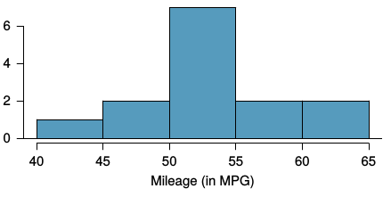
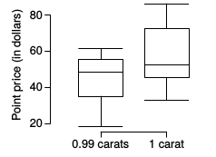
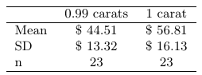
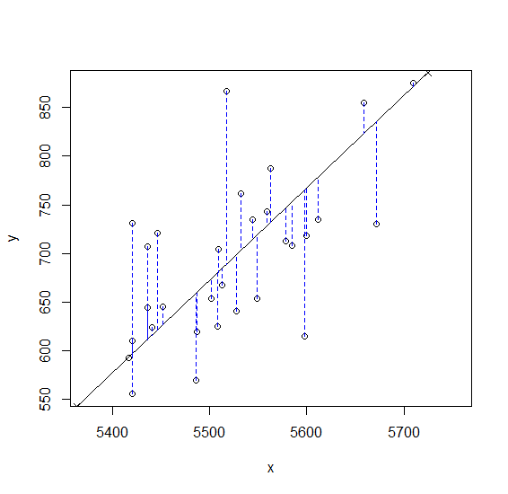
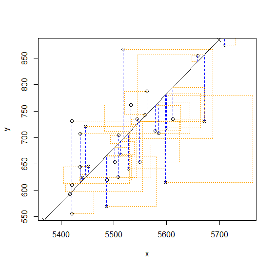

```{r setup, include = FALSE}
knitr::opts_chunk$set(
  cache = FALSE, # if TRUE knitr will cache results to reuse in future knits
  fig.width = 5, # the width for plots created by code chunk
  fig.height = 3, # the height for plots created by code chunk
  fig.align = 'center', # how to align graphics. 'left', 'right', 'center'
  dpi = 300, 
  dev = 'png', # Makes each fig a png, and avoids plotting every data point
  # eval = FALSE, # if FALSE, then the R code chunks are not evaluated
  # results = 'asis', # knitr passes through results without reformatting
  echo = TRUE, # if FALSE knitr won't display code in chunk above it's results
  message = TRUE, # if FALSE knitr won't display messages generated by code
  strip.white = TRUE, # if FALSE knitr won't remove white spaces at beg or end of code chunk
  warning = FALSE, # if FALSE knitr won't display warning messages in the doc
  error = TRUE) # report errors
  # options(tinytex.verbose = TRUE)

library(tidyverse)
```

\setcounter{section}{6}
\setcounter{subsection}{0}


### LE6, 10 points, 6 questions. 

Coding style: 1 point

  - LE6.1, 1.5 pt.
  - LE6.2, 1.5 pts.
  - LE6.3, 0.5 pts.
  - LE6.4, 1 pt.
  - LE6.5, 0.5 pt.
  - LE6.6, 4 pts

#### Lab Exercise (LE) 6

- Inference Guide

There is a useful Inference Cheat Sheet 

  - in your 3-readings/3-CheatSheets/ folder
  - `os2_extra_inference_guide.pdf`

-----

## LE6.1. Spray Paint

Suppose the area that can be painted using a single can of spray paint 

  - is slightly variable 
  - and follows a nearly normal distribution 
    - with a mean of 25 square feet 
    -  and a standard deviation of 3 square feet.
    
(a) What is the probability that 

  - the area covered by a can of spray paint 
  - is more than 27 square feet?
  
```{r}
# area that can be painted using a single can of spray paint
# normal (gaussian) distribution
mean_sp <- 25
sd_sp <- 3
goal_sp <- 27

pnorm(goal_sp, mean_sp, sd_sp, lower.tail = FALSE)
```
  
#### Answer => 0.25
  
(b) Suppose you want to spray paint 

  - an area of 540 square feet 
  - using 20 cans of spray paint. 

On average, how many square feet 

  - must each can be able to cover 
  - to spray paint all 540 square feet?

```{r}
area <- 540
num_cans <- 20

avg <- area / num_cans

avg
```

#### Answer -> 27 on average

(c) What is the probability 

  - that you can cover a 540 square feet area 
  - using 20 cans of spray paint?

```{r}
p_sd_sp <- sd_sp / sqrt(num_cans)
pnorm(avg, mean_sp, p_sd_sp, lower.tail = FALSE)
```


#### Answer => 0.0014


(d) If the area covered by a can of spray paint 

  - had a slightly skewed distribution, 
  - could you still calculate the probabilities in parts (a) and (c) 
    - using the normal distribution?

#### Answer => 

a: no the skew would get rid of the normality

c: yes sample mean from CLT 


-----

## LE6.2. Fuel efficiency of Prius. (OIS 5.8)

- [Fueleconomy.gov](http://www.fueleconomy.gov/), 

  - the official US government source 
    - for fuel economy information, 
  - allows users to share gas mileage information on their vehicles. 
  
The histogram below shows 

  - the distribution of gas mileage in miles per gallon (MPG) 
    -  from 14 users who drive a 2012 Toyota Prius. 
  - The sample mean is 53.3 MPG 
    - and the standard deviation is 5.2 MPG. 
  
Note that these data are user estimates 

  - and since the source data cannot be verified, 
  - the accuracy of these estimates are not guaranteed.[@noauthor_gas_nodate]



### LE6.2.1 We would like to use these data to evaluate 

  - the average gas mileage of all 2012 Prius drivers.

Do you think this is reasonable? 

  - Why or why not? 

#### Answer => Because histogram can be approximated to be normally distributed, the data is reasonable


### LE6.2.2 The EPA claims that a 2012 Prius gets 50 MPG 

  - (city and highway mileage combined). 
  
Do these data provide strong evidence against this estimate 

  - for drivers who participate on http://fueleconomy.gov? 
  - Note any assumptions you must make as you proceed with the test.


```{r}
actual_mpg <- 53.3
hypo_mpg <- 50
sd_mpg <- 5.2
sample_mpg <- 14 
p_sd_mpg <- sd_mpg / sqrt(sample_mpg)
df_mpg <- 14 - 1

test_stat_mpg <- (actual_mpg - hypo_mpg) / p_sd_mpg

pval <- 2 * pt(test_stat_mpg, df_mpg, lower.tail = FALSE)

alpha_mpg <- 0.05

if (pval != alpha_mpg) {
  print("reject H0")
} else {
  print("accept H0")
}
```

Null Hypothesis: average mileage of 2012 Prius drivers is 50 MPG

Alternative Hypothesis: average mileage of 2012 Prius drivers is not 50 MPG

#### Answer => reject null hypothesis, favoring alternative hypothesis. average gas mileage of all 2012 Prius drivers is not 50 MPG

### LE6.2.3 Calculate a 95% confidence interval 

  - for the average gas mileage of a 2012 Prius 
  - by drivers who participate on fueleconomy.gov.

```{r}
crit_val_mpg <- 2.16
me_mpg <- crit_val_mpg * p_sd_mpg
ci_mpg <- c(actual_mpg - me_mpg, actual_mpg + me_mpg)
ci_mpg
```

#### Answer ->  50.3, 56.3. The mean mpg given by fueleconomy.gov lies within the 95% confident interval.

## LE6.3 Calculate a 95% confidence interval 

In LE5, we determined that in the vaccine group of 200,000 people, 

  - there were 57 cases of the flu.  
  
Estimate the 95% confidence interval for 

  - the proportion of all Americans receiving the vaccine 
    - that will get the flu.
  
```{r}
pop <- 200000
flu <- 57
noflu <- pop - flu

sample_flu <- rep(1, flu)
sample_noflu <- rep(0, noflu)

sample_pop <- data.frame(
  has_flu = c(sample_flu, sample_noflu)
)

t.test(sample_pop)
```

#### Answer => 	One Sample t-test

data:  sample_pop
t = 7.5509, df = 2e+05, p-value = 4.341e-14
alternative hypothesis: true mean is not equal to 0
95 percent confidence interval:
 0.0002110229 0.0003589771
sample estimates:
mean of x 
 0.000285 


-----

## LE6.4. Diamonds 

### LE6.4.1 Diamonds Part I. (OIS 5.28)

- Prices of diamonds are determined by what is known as the 4 Cs:

  - cut,
  - clarity, 
  - color, 
  - and carat weight. 
  
The prices of diamonds go up 

  - as the carat weight increases, 
  -  but the increase is not smooth. 
  
For example, the difference between the size 

  - of a 0.99 carat diamond and 
    - a 1 carat diamond is undetectable to the naked human eye, 
  - but the price of a 1 carat diamond tends to be much higher 
    - than the price of a 0.99 diamond. 
  
In this question we use two random samples of diamonds, 

  - 0.99 carats and 1 carat, 
  - each sample of size 23, 
  
and compare the average prices of the diamonds. 

In order to be able to compare equivalent units, 

  - we first divide the price for each diamond 
  - by 100 times its weight in carats. 
  
That is, for a 0.99 carat diamond, we divide the price by 99. 

For a 1 carat diamond, we divide the price by 100. 

The distributions and some sample statistics are shown below.[@wickham_ggplot2:_2016]





Conduct a hypothesis test to evaluate 

  - if there is a difference between the average standardized prices 
  - of 0.99 and  1 carat diamonds. 

Make sure to 

  - state your hypotheses clearly, 
  - check relevant conditions, 
  - and interpret your results in context of the data.
 
 
```{r}
# 0.99 carat -> carA
m_car_a <- 44.51
sd_car_a <- 13.32

# 1 carat -> carB
m_car_b <- 56.81
sd_car_b <- 16.13


n_car <- 23
df_car <- 2 * n_car - 2
qt_df_car <- (((sd_car_a^2) / n_car + (sd_car_b^2) / n_car)^2
              ) / (
             (((sd_car_a^2 / n_car)^2) / (n_car - 1)
              ) + (((sd_car_a^2 / n_car)^2) / (n_car - 1)))
sd_car_err <- sqrt((sd_car_a^2 + sd_car_b^2)/n_car)

m_car_sub <- m_car_a - m_car_b

t_car <- m_car_sub / sd_car_err
p_val_car <- 2 * pt(t_car, df_car, lower.tail = TRUE)

alpha_car <- 0.05

if (p_val_car != alpha_car) {
  print("reject H0")
} else {
  print("accept H0")
}
```

Hypothesis:

Null Hypothesis H0: There is no difference between the average standardized prizes of 0.99 and 1 carat diamonds

Alternative Hypothesis HA: There is a difference between the average standardized prizes of 0.99 and 1 caret diamonds

#### Answer => Null hypothesis is rejected in favor of alternative hypothesis. There is enough evidence to support the claim that there is a difference between the average standardized prizes of 0.99 and 1 caret diamonds


### LE6.4.2 Diamonds Part II. (OIS 5.30)

- We discussed diamond prices

  - (standardized by weight) 
  -  for diamonds with weights 0.99 carats and 1 carat. 
  
See the table for summary statistics,

  - and then construct a 95% confidence interval 
  - for the average difference 
    - between the standardized prices of 0.99 and 1 carat diamonds. 

You may assume the conditions for inference are met. 

```{r}
m_car_sub <- m_car_sub
sd_car_err <- sd_car_err
qt_df_car <- qt_df_car
p_car_val <- 0.975

z_car <- qt(p_car_val, qt_df_car)

ci_car <- c(m_car_sub - (z_car * sd_car_err), m_car_sub + (z_car * sd_car_err)) 
ci_car
```

#### Answer => 95% CI for the average difference between the standardized prices of 0.99 and 1 carat diamonds: [-21, -3.6]

-----

## LE6.5 $\chi^2$ (Chi-Squared) Test

A gambler has been accused of using a loaded die, 

  - but proclaims innocence.

You've been called in to assess the die.  

  - You roll the die 60 times 
    - and record the results.  

Carefully state your null hypothesis.  

  - What is the $\chi^2$ statistic.  
  - How many degrees of freedom are there?  

What is the conclusion of the hypothesis test?  

Is it possible to state conclusively 

  - that the gambler cheated?  
  
Discuss the meaning of the significance level 

  - that you chose.  

```{r}
die_rolls <- read.csv('./data/dieRolls.csv', header = FALSE)
die_rolls <- strsplit(die_rolls$V1, " ")[[1]]

```

```{r}
n_die_rolls <- as.integer(length(die_rolls))

die_freq <- function(num) {
  freq_for_num <- 0
  for (roll in die_rolls[[1]]) {
    if (strtoi(roll) == strtoi(num)) {
      freq_for_num <- freq_for_num + 1
    }
  }
  return(freq_for_num)
}

one_frq <- die_freq("1")
two_frq <- die_freq("2")
thr_frq <- die_freq("3")
fou_frq <- die_freq("4")
fiv_frq <- die_freq("5")
six_frq <- die_freq("6")

die_freq_table <- data.frame(
  value = c(1:6),
  actual_freq = c(one_frq, two_frq, thr_frq, fou_frq, fiv_frq, six_frq),
  exp_freq = c(10, 10, 10, 10, 10, 10)
)

die_freq_table <- mutate(die_freq_table, chi_sq = ((exp_freq - actual_freq)^2)/exp_freq)

chi_sq_statistic <- sum(die_freq_table$chi_sq)


```

Null Hypothesis H0: each number on the die appears with equal frequency, meaning the gambler has not cheated, and the die is not loaded

Alternative Hypothesis HA: each number on the die does NOT appear with equal frequency, meaning the gambler has cheated, and the die is loaded

In 95% confidence at 5 degrees of freedom: benchmark value = 11.07

If chi squared statistic > 11.07 reject null hypothesis

Chi Squared Statistic = 14.2

Degrees of Freedom on a 6 sided die = 5

From chi squared table probability of larger value of chi squared is ~0.02 (p value)

#### Answer => chi squared statistic is > benchmark statistic, so we reject the null hypothesis in favor of the alternative hypothesis, meaning each number on the die does NOT appear with equal frequency, meaning the gambler has cheated, and the die is loaded


In a certain town, 

  - there are about one million eligible voters. 
  
A simple random sample of size 10,000 was chosen, 

  - to study the relationship 
  - between sex and participation 
    - in the last election. 
    
The results: 

               Men      Women
Voted        2,792      3,591
Didn't vote  1,486      2,131

  - What percent of men voted?  
  - What percent of women voted?

Make a chi-squared test of the null hypothesis that sex and voting are independent. Use the function `chisq.test()`.

```{r}
men_voted <- 2792
men_not_voted <- 1486

men_voted_sample <- rep("Voted", men_voted)
men_not_voted_sample <- rep("Didn't vote", men_not_voted)
men_sample <- c(men_voted_sample, men_not_voted_sample)

sample_men <- men_not_voted + men_voted

df_men <- data.frame(
  vote = men_sample,
  gender = rep("Men", sample_men)
)

women_voted <- 3591
women_not_voted <- 2131

women_voted_sample <- rep("Voted", women_voted)
women_not_voted_sample <- rep("Didn't vote", women_not_voted)
women_sample <- c(women_voted_sample, women_not_voted_sample)

sample_women <- women_not_voted + women_voted

df_women <- data.frame(
  vote = women_sample,
  gender = rep("Women", sample_women)
)

df_election <- rbind(df_men, df_women)

prob_men <- men_voted / sample_men
percent_men <- prob_men * 100

prob_women <- women_voted / sample_women
percent_women <- prob_women * 100

sample_voted <- men_voted + women_voted
sample_elect <- sample_men + sample_women

table(df_election$vote, df_election$gender)

chisq.test(df_election$vote, df_election$gender)
```

65.3% of men, 62.8% of women voted

significance level = 0.05 for ci of 95% 

Null Hypothesis: sex and voting participation are independent
Alternative Hypothesis: sex and voting participation are NOT independent

p value = 0.01 < significance level = 0.05 meaning, we reject null hypothesis in favor of the alternative, meaning sex and voting participation are NOT independent
#### Answer => sex and voting participation are NOT independent


## LE6.6 OIStats: Linear regression
 
- The movie Moneyball focuses on 

  - the “quest for the secret of success in baseball”. 

It follows a low-budget team, the Oakland Athletics, 

  - who believed that underused statistics, such as 
    - a player’s ability to get on base, 
  - better predict the ability to score runs than typical statistics 
    - like home runs, RBIs (runs batted in), and batting average. 
  - Obtaining players who excelled in these underused statistics 
    - turned out to be much more affordable for the team.

In this lab we’ll be looking at data from all 30 Major League Baseball teams 

  - and examining the linear relationship between runs scored in a season 
  - and a number of other player statistics. 

Our aim will be to summarize these relationships 

  - both graphically and numerically in order to find which variable, if any, 
  - helps us best predict a team’s runs scored in a season.

#### Data
 
- Let’s load up the data for the 2011 season.

  - Its a file `mlb11.RData`
  - Its located in the data folder of this LE6 in your class repo.
 
```{r}
load("./data/mlb11.rdata")
```

In addition to runs scored, 

  - there are seven traditionally used variables in the data set: 
    - at-bats, 
    - hits, 
    - home runs, 
    - batting average, 
    - strikeouts, 
    - stolen bases, 
    - and wins. 

There are also three newer variables: 

  - on-base percentage, 
  - slugging percentage, 
  - and on-base plus slugging. 

For the first portion of the analysis 
  - we’ll consider the seven traditional variables. 
  - At the end of the lab, you’ll work with the newer variables.

### LE6.6.1

- What type of plot would you use to display 

  - the relationship between runs and one of the other numerical variables? 

Plot this relationship using the variable at_bats as the predictor. 

  - Does the relationship look linear? 

```{r}
ggplot(mlb11, aes(x = at_bats, y = runs)
       ) + geom_point() + geom_smooth(method = lm)
```

#### Answer => The relationship looks moderately linear

- If you knew a team’s at_bats, 

 - would you be comfortable using a linear model 
 - to predict the number of runs?

Quantify the strength of the relationship with the correlation coefficient.

```{r}
cor(mlb11$at_bats, mlb11$runs)
```

#### Answer => correlation coefficient = 0.61, relationship is strong enough that it would be comfortable using a linear model to predict the number of runs

##### Sum of squared residuals

- Think back to the way that we described the distribution of a single variable. 

  - Recall that we discussed characteristics such as center, spread, and shape. 
  - It’s also useful to be able to describe 
    - the relationship of two numerical variables, 
    - such as runs and at_bats above.

### LE6.6.2

- Looking at your plot from the previous exercise, 

  - describe the relationship between these two variables. 

Make sure to discuss 

  - the form, direction, and strength of the relationship 
  - as well as any unusual observations.

#### Answer => moderately strong positive linear correlation between bats and runs. Direction is positive, the strength is moderate (because correlation has a mid spread, spread is tight enough to derive a linear model), form is the relationship/correlation, which exists

### LE6.6.3

- Just as we used the mean and standard deviation to summarize a single variable, 

  - we can summarize the relationship between these two variables 
    - by finding the line that best follows their association. 

Use the following interactive function 

  - to select the line that you think does the best job 
    - of going through the cloud of points.

```{r}
library(statsr)
# r script
```

**You'll need to run this command in an R script (.R file)**

  - You don't get the interactive prompts when in a .Rmd file
  
After running this command in a .R script, you’ll be prompted 

  - to click two points on the plot to define a line. 

Once you’ve done that, 

  - the line you specified will be shown in black 
  - and the residuals in blue. 

Note that there are 30 residuals, one for each of the 30 observations. 

  - Recall that the residuals are the difference 
  - between the observed values and the values predicted by the line:

   $$e_i = y_i- \hat{y}_i$$    

The most common way to do linear regression 

  - is to select the line that minimizes the sum of squared residuals.

To visualize the squared residuals, 

  - you can rerun the plot command 
  - and add the argument `showSquares = TRUE`.

```{r}
# rscript
```

Note that the output from the `plot_ss` function 

  - provides you with the slope and intercept of your line 
  - as well as the sum of squares.

Using `plot_ss`, choose a line 

  - that does a good job of minimizing the sum of squares. 

Run the function several times. 

  - What was the smallest sum of squares that you got? 
  - How does it compare to your neighbors?


#### Answer => Smallest SSE: 142777.4

Compares well to the neighbors


Call:
lm(formula = y ~ x, data = pts)

Coefficients:
(Intercept)            x  
 -4560.9544       0.9514  

Sum of Squares:  142777.4


Call:
lm(formula = y ~ x, data = pts)

Coefficients:
(Intercept)            x  
  -5005.254        1.034  

Sum of Squares:  156641.1

#####  The linear model

- It is rather cumbersome to try to get the correct least squares line, 

  - i. e. the line that minimizes the sum of squared residuals, 
  - through trial and error. 

Instead we can use the `lm` function in R 

  - to fit the linear model (a.k.a. regression line).

```{r}
regress_at_bats <- lm(runs~at_bats, mlb11)
```

The first argument in the function `lm` is a formula that takes the form `y ~ x`. 

  - Here it can be read that we want to make a linear model of runs 
    - as a function of at_bats. 
  - The second argument specifies that R should look in the mlb11 dataframe 
    - to find the runs and at_bats variables.

The output of `lm` is an object that contains all of the information we need 

  - about the linear model that was just fit. 
  - We can access this information using the summary function.

```{r} 
summary(regress_at_bats)
```

Let's consider this output piece by piece. 

  - First, the formula used to describe the model is shown at the top. 
  - After the formula you find the five-number summary of the residuals. 
  - The "Coefficients" table shown next is key; 
    - its first column displays the linear model's y-intercept 
    - and the coefficient of at_bats. 
  - With this table, we can write down 
    - the least squares regression line for the linear model:

$\hat{y}$ = -2789.2429 + 0.6305*$at_{bats}$

One last piece of information we will discuss from the summary output 

  - is the Multiple R-squared, or more simply, $R^2$. 
  - The $R^2$ value represents the proportion of variability 
    - in the response variable that is explained by the explanatory variable. 

For this model, what percentage of the variance in runs 

  - is explained by at-bats. 

#### Answer => Multiple R-squared:  0.3729 * 100 = 37.29% of variance in runs is explained by at-bats


### LE6.6.4
 
- Fit a new model that uses homeruns to predict runs. 

  - Using the estimates from the R output, 
    - write the equation of the regression line. 
  - What does the slope tell us in the context of 
    - the relationship between success of a team and its home runs?

```{r}
regress_hr <- lm(runs ~ homeruns, mlb11)
summary(regress_hr)
```

#### Answer => slope function:

$\hat{y}$ = 415.2389 + 1.8345*$homeruns$

slope is 1.8345: slope indicates average number of runs for each homerun

##### Prediction and prediction errors
 
- Create a scatterplot with the least squares line laid on top.
 
```{r, }
plot(runs~at_bats, mlb11)
abline(lm(runs~at_bats, mlb11))

ggplot(mlb11, aes(x = at_bats, y = runs)
       ) + geom_point() + geom_smooth(method = lm, se = FALSE)
```

The function `abline` plots a line based on its slope and intercept. 

  - How do you do it in `ggplot2`?

Here, we used a shortcut by providing the model m1, 

  - which contains both parameter estimates. 
  - This line can be used to predict y at any value of x. 
  - When predictions are made for values of x 
    - that are beyond the range of the observed data, 
    - it is referred to as extrapolation and is not usually recommended. 
  - However, predictions made within the range of the data are more reliable. 
  - They are also used to compute the residuals.
  

### LE6.6.5

- If a team manager saw the least squares regression line 

  - and not the actual data, 
  - how many runs would he or she predict for a team with 5,578 at-bats? 

Use the `interp1()` function in the library `pracma`.
```{r}
library(pracma)
```

```{r}
at_bats_team <- 5578
prediction_manual <- (-2789.2429 + 0.6305 * at_bats_team)
prediction_lib <- interp1(x = mlb11$at_bats, y = mlb11$runs, xi = at_bats_team, method = "linear")

prediction_manual
prediction_lib

residual_mlb <- prediction_manual - prediction_lib
residual_mlb
```


How many runs would he or she predict for a team with 5,578 at-bats? 

  - Is this an overestimate or an underestimate, and by how much? 
  - In other words, what is the residual for this prediction?

#### ANSWER => overestimate by 10. residual is 10.0611


##### Model diagnostics

- To assess whether the linear model is reliable, 

  - we need to check for 
    - (1) linearity, 
    - (2) nearly normal residuals, and 
    - (3) constant variability.

Linearity: You already checked 

  - if the relationship between runs and at-bats is linear using a scatterplot. 
  - verify this condition with a plot of the residuals vs. at-bats. 

#### ANSWER => 

- Plot of the residuals vs. at-bats. 

```{r}
plot(regress_at_bats$residuals~mlb11$at_bats,
     xlab="at_bats",
     ylab="residuals",
     main="residuals vs. at-bats")
```

### LE6.6.6

- Is there any apparent pattern in the residuals plot? 

  - What does this indicate about the linearity of the relationship 
    - between runs and at-bats?

#### Answer=> no apparent pattern in the residuals plot, meaning relationship between the runs and at-bats can be classified as linear

```{r}
mlb11$residual_at_bats <- regress_at_bats$residuals

ggplot(mlb11, aes(x = at_bats, y = residual_at_bats)
       ) + geom_point() + geom_smooth(method = lm)
```

### LE6.6.7

- Nearly normal residuals: To check this condition,

  - we can look at a histogram, 
    - `hist(m1$residuals)`, 
  - or a normal probability plot of the residuals.


Based on the histogram and the normal probability plot, 

  - does the nearly normal residuals condition appear to be met?

```{r}
nearly_normal_residuals <- mlb11$residual_at_bats
hist(nearly_normal_residuals)
qqnorm(nearly_normal_residuals)
qqline(nearly_normal_residuals)
```

#### Answer => Based on the histogram and the normal probability plot, the nearly normal residuals condition do appear to be met. Reason: data is generally symmetrical when looking at the normal probability plot even though the histogram displays a skew


##### Constant variability:

### LE6.6.8

- Based on the plot above, 

  - does the constant variability condition appear to be met?

#### Answer => Based on the plot, the constant variability condition does appear to be met. Reason: variability around line of best fit is roughly constant


### LE6.6.9

- Choose another traditional variable from mlb11 

  - that you think might be a good predictor of runs. 

Produce a scatterplot of 

  - the two variables 
  - and fit a linear model. 

At a glance, does there seem to be a linear relationship?

```{r}
runs_predictor <- mlb11$hits
runs <- mlb11$runs

ggplot(mlb11, aes(x = hits, y = runs)
       ) + geom_point() + geom_smooth(method = lm)

```

#### Answer: There does seems to be a linear relationship with runs and hits

How does this relationship compare to the relationship between runs and at_bats?

  - Use the $R^2$ values from the two model summaries to compare.
  - Does your variable seem to predict runs
    - better than at bats?
  - How can you tell?

```{r}
regress_hits <- lm(runs ~ hits, mlb11)
summary(regress_hits)
```


#### Answer=> Multiple R-squared:  0.6419 * 100 = 64.19% variance in runs is explained by hits, far greater than the 37.29% of variance in runs explained by at-bats; hits is a better determiner of runs over at bats.

### LE6.6.10

- Now that you can summarize the linear relationship between two variables, 

  - investigate the relationships 
    - between runs and each of the other five traditional variables. 

Which variable best predicts runs? 

Support your conclusion using 

  - the graphical 
  - and numerical methods we’ve discussed 
    - (for the sake of conciseness, 
    - only include output for the best variable, not all five).

```{r}
regress_batavg <- lm(runs ~ bat_avg, mlb11)
summary(regress_batavg)

regress_so <- lm(runs ~ strikeouts, mlb11)
summary(regress_so)

regress_sb <- lm(runs ~ stolen_bases, mlb11)
summary(regress_sb)

regress_w <- lm(runs ~ wins, mlb11)
summary(regress_w)

ggplot(mlb11, aes(x = bat_avg, y = runs)
       ) + geom_point() + geom_smooth(method = lm)

cor(mlb11$runs, mlb11$bat_avg)
```

#### ANSWER => Batting average is the best predictor of runs (with Multiple R-squared:  0.6561) with a correlation coefficient of 0.81


### LE6.6.11

- Now examine the three newer variables. 

  - These are the statistics used by the author of Moneyball 
    - to predict a teams success. 
  - In general, are they more or less effective at predicting runs 
    - than the old variables? 
  - Explain using appropriate graphical and numerical evidence. 
  - Of all ten variables we’ve analyzed, 
    - which seems to be the best predictor of runs? 
  - Using the limited (or not so limited) information you know 
    - about these baseball statistics, 
    - does your result make sense?
  - Check the model diagnostics for the regression model 
    - with the variable you decided was the best predictor for runs.
  
```{r}
regress_onbase <- lm(runs ~ new_onbase, mlb11)
summary(regress_onbase)

regress_slug <- lm(runs ~ new_slug, mlb11)
summary(regress_slug)

regress_ob_s <- lm(runs ~ new_obs, mlb11)
summary(regress_ob_s)

ggplot(mlb11, aes(x = new_onbase, y = runs)
       ) + geom_point() + geom_smooth(method = lm)

ggplot(mlb11, aes(x = new_slug, y = runs)
       ) + geom_point() + geom_smooth(method = lm)

ggplot(mlb11, aes(x = new_obs, y = runs)
       ) + geom_point() + geom_smooth(method = lm)

best_normal_residuals <- regress_ob_s$residuals
hist(best_normal_residuals)
qqnorm(best_normal_residuals)
qqline(best_normal_residuals)

cor(mlb11$runs, mlb11$new_obs)
```
 
#### Answer => All Multiple R Squared values of the new fields are better than the old fields, and it seems that the onbase by slug is the best predictor of all 10 variables, with a correlation coefficient of 0.97. Histogram displays best normal distribution, data is very symmetrical

 
-----


#### Links

[http://www.r-project.org](http://www.r-project.org) 

[http://rmarkdown.rstudio.com/](http://rmarkdown.rstudio.com/)  

[https://www.openintro.org/stat/textbook.php?stat_book=os](https://www.openintro.org/stat/textbook.php?stat_book=os)