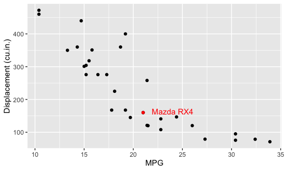

```{r setup, include = FALSE}
knitr::opts_chunk$set(
  cache = FALSE, # if TRUE knitr will cache results to reuse in future knits
  fig.width = 5, # the width for plots created by code chunk
  fig.height = 3, # the height for plots created by code chunk
  fig.align = 'center', # how to align graphics. 'left', 'right', 'center'
  dpi = 300, 
  dev = 'png', # Makes each fig a png, and avoids plotting every data point
  # eval = FALSE, # if FALSE, then the R code chunks are not evaluated
  # results = 'asis', # knitr passes through results without reformatting
  echo = TRUE, # if FALSE knitr won't display code in chunk above it's results
  message = TRUE, # if FALSE knitr won't display messages generated by code
  strip.white = TRUE, # if FALSE knitr won't remove white spaces at beg or end of code chunk
  warning = FALSE, # if FALSE knitr won't display warning messages in the doc
  error = TRUE) # report errors
  # options(tinytex.verbose = TRUE)
```

 \setcounter{section}{0}
 \setcounter{subsection}{0}
 \setcounter{subsubsection}{0}

## Instructions

###### NAME.Rmd => ...caseID.Rmd  

  - Don't forget to put your name in the script, and in the filename
  - Filename Schema;  2208-DSCI351-351m-451-MidTerm-YOURCaseID.Rmd 

Answers and Code Style

  - Show your R code, using good coding style
  - Explain your reasoning
  - And put your answers at "ANSWER <- ?"

## There are 8 Questions

  - Q1: 1 pt
  - Q2: 1/2 pt
  - Q3: 1/2 pt
  - Q4: 1 pt
  - Q5: 1 pt
  - Q6: 1 pt
  - Q7: 2 pts
  - Q8: 3 pts

# Question 1. The 4 Freedoms of FOSS (1 pt)

The definition of free and open-source software (FOSS) 

  - consists of four freedoms (freedoms 0 through 3). 

Which of the following is NOT one of the freedoms that are part of the definition?

  - A) The freedom to improve the program, and release your improvements to the
public, so that the whole community benefits.
  - B) The freedom to redistribute copies so you can help your neighbor.
  - C) The freedom to study how the program works, and adapt it to your needs.
  - D) The freedom to restrict access to the source code for the software.

ANSWER <- D


# Question 2. Variable Class (1/2 pt)

If I execute the expression 

```{r, echo=TRUE, message=TRUE}
x <- 4 
```

in R, 

  - what is the class of the object `x'?

ANSWER <- integer or numeric

What is the class of the object 

  - defined by the expression `y <- c(4, "a", TRUE)`?

```{r, echo=TRUE, message=TRUE}
y <- c(4, "a", TRUE)
y
```

ANSWER <- list or vector


# Question 3. Row Bind (1/2 pt)
   
If I have two vectors `a <- c(1, 3, 5)` and `b <- c(3, 2, 10)`, 
what is produced by the expression `rbind(a, b)`?

  - A) a 2 by 2 matrix
  - B) a vector of length 3
  - C) a matrix with two rows and three columns
  - D) a vector of length 2

```{r, echo=TRUE, message=TRUE}
a <- c(1, 3, 5)
b <- c(3, 2, 10)
rbind(a, b)
``` 

ANSWER <- C


# Question 4. Subsetting (1 pt)

Suppose I have a vector `d <- c(3, 5, 1, 10, 12, 6)` 
and I want to set all elements of this vector 
that are less than 6 to be equal to zero. 

What R code achieves this?

## Q4.1) Using base R commands

```{r, echo=TRUE, message=TRUE}
d <- c(3, 5, 1, 10, 12, 6)
d[d < 6] <- 0
d
``` 

## Q4.2) Using tidyverse commands

```{r, echo=TRUE, message=TRUE}
d <- c(3, 5, 1, 10, 12, 6)
replace(d, d < 6, 0)
```


# Question 5. Functions (1 pt)


## Q5.1) Using functions

  - Suppose I define the following function in R

```{r, echo=TRUE, message=TRUE}
  cube <- function(x, n) {
    x^3
  }
```

What is the result of running

 `cube(3)`


```{r, echo=TRUE, message=TRUE}
cube(3)
```

5.1 ANSWER <- 27


## Q5.2) Understanding code

The following code will produce a warning in R.

The warning may not show if run in a .Rmd file's R code block

  - If so you should copy the R code below and run it in your R console. 

```{r, echo=TRUE, message=TRUE}
  x <- 1:10
  if (x > 5) {
    x <- 0
  }
```

Why? 

5.2 ANSWER <- x is a vector, meaning there are multiple values for x. using 1:10 
instead of c(1:10) yields the same result. comparing a vector with a numeric value
will give an error because the types do not match.


# Question 6. Manipulating data (1 pts)

Load the 'mtcars' dataset in R with the following code

  `library(datasets)`
  `data(mtcars)`

There will be an object names `mtcars` in your workspace. 

You can find some information about the dataset by running

  `?mtcars`

What is the absolute difference between 

  - the average horsepower of 4 cylinder cars and 
  - the average horsepower of 8 cylinder cars ? 


```{r, echo=TRUE, message=TRUE}
library(datasets)
data(mtcars)
abs(mean(mtcars$hp[mtcars$cyl == 4]) - mean(mtcars$hp[mtcars$cyl == 8]))
```

6. ANSWER <- 126.58


# Question 7. Graphics (2 pts)

## Q7.1 Making histograms

  - Make a histogram of the number of cylinders in cars in the the `mtcars` dataset using the `hist()` function.  Label the x-axis 'Cylinders' and the title  'Histogram of Cylinders'.

```{r, echo=TRUE, message=TRUE}
hist(mtcars$cyl, 
     main="Histogram of Cylinders", 
     xlab="Cylinders")
```

  - Make a comparable graph using ggplot2 with x-axis label 'Cylinders', y-axis label 'Frequency', and title 'Histogram of Cylinders'
  
```{r, echo=TRUE, message=TRUE}
ggplot(data = mtcars,
       aes(x = cyl)
       ) + labs(title = "Histogram of Cylinders"
       ) + geom_histogram(binwidth = 1
       ) + xlab("Cylinders"
       ) + ylab("Frequency")

```

## Q7.2 Label a scatter plot

This is an example of a plot generated using `subset()` and `geom_text()` in ggplot using the mtcars dataset. (1 point)




Recreate this plot using ggplot as best you can.


```{r, echo=TRUE, message=TRUE}

ggplot(data = mtcars,
       aes(x = mpg, y = disp)
       ) + xlab("MPG"
       ) + ylab("Displacement (cu.in.)"
       ) + geom_point(
       ) + geom_point(data = mtcars["Mazda RX4", ],
                      aes(x = mpg, y = disp, color = "red")
       ) + geom_text(aes(x = mtcars["Mazda RX4", "mpg"] + 3,
                         y = mtcars["Mazda RX4", "disp"] + 5, 
                         label = "Mazda RX4", 
                         color = "red"), 
                     size = 3)

```


# Question 8. Analyze Lord of the Rings (LOR) ( 3 pts )

Its often said that we should "write code for humans, write data for computers".

  - An important aspect of "writing data for computers" 
    - is to make your data **tidy**. 

Key features of **tidy** data:

  - Each column is a variable
  - Each row is an observation

If you are struggling to make a figure, for example, 

  - stop and think hard about whether your data is tidy. 

Untidiness is a common, often overlooked 

  - cause of agony in data analysis 
  - and data visualization.

I will give you a concrete example of some untidy data

```{r}
library(tidyverse)
fotr <- read.csv('./data/2108The_Fellowship_Of_The_Ring.csv')
rotk <- read.csv('./data/2108The_Return_Of_The_King.csv')
tt <- read.csv('./data/2108The_Two_Towers.csv')

glimpse(fotr)
glimpse(rotk)
glimpse(tt)
```

We have one table per movie. 

  - In each table, we have the total number of words spoken, 
  - by characters of different races and genders.

You could imagine finding these three tables 

  - as separate worksheets in an Excel workbook. 
  - Or hanging out in some cells on the side of a worksheet 
    - that contains the underlying raw data. 
  - Or as tables on a webpage or in a Word document.

This data has been formatted for consumption by human eyeballs. 

  - The format makes it easy for a human 
    - to look up the number of words spoken 
    - by female elves in The Two Towers. 

But this format actually 

  - makes it pretty hard for a computer 
    - to pull out such counts 
  - and, more importantly, 
    - to compute on them or graph them.


## Q8.1 Basics of tidy data

An important aspect of "writing data for computers" 

  - is to make your data **tidy**. 

Two key features of **tidy** data are:

ANSWER <- 1. Each column is a variable
ANSWER <- 2. Each row is an observation

## Q8.2 Basic data questions

Just looking at these tables, answer these questions:

(You'll do this with code in the next part)

  - What's the total number of words spoken by male hobbits in each of the three movies?

Answer <- 3644 + 2673 + 2463 = 8780

  - Does a certain Race dominate a movie? 

Answer <- yes, FOTR -> Hobbit, ROTK -> Man, TT -> Man

  - Does the dominant Race differ across the movies?

Answer <- yes, FOTR -> Hobbit, ROTK -> Man, TT -> Man

## Q8.3 Scalability

How well does your approach scale 

  - If there were many more movies 
  - or if I provided you with updated data 
    - that includes all the Races 
    - (e.g. dwarves, orcs, etc.)?

Answer <- It wouldn't scale well because the data is melted down among the three
datasets, and may require dcast and mutate. (Long DataSet)

```{r}
lotr <- read.csv('./data/2108lotr-tidy.csv')
glimpse(lotr)
```

Notice that tidy data is generally taller and narrower. 

  - It doesn't fit nicely on the page. 
  - Certain elements get repeated a lot, 
    - e.g. `Hobbit`. 

For these reasons, 

  - we often instinctively resist **tidy** data 
    - as inefficient or ugly. 

But, unless and until you're making the final product 

  - for a textual presentation of data, 
  - ignore your yearning to see the data in a compact form.

Now using tidyverse packages, pipes and dplyr 

  - answer the following questions

## Q8.4 Analyzing total words

What's the total number of words spoken by male hobbits?

```{r, echo=TRUE, message=TRUE}
sum(lotr$Words[lotr$Gender == "Male" & lotr$Race == "Hobbit"])

```


Answer <- 8780

## Q8.5 Analyzing words by film and race

Does a certain race dominate a movie? 

Does the dominant race differ across the movies?

  - You'll first want to sum across gender, 
    - to obtain word counts for the different races by movie.

```{r, echo=TRUE, message=TRUE}
lotr$Race <- as.factor(lotr$Race)
lotr$Gender <- as.factor(lotr$Gender)
lotrByRace <- dcast(lotr, Film + Race + Words ~ Gender)
lotrByRace <- mutate(lotrByRace)
glimpse(lotrByRace)
```

Answer <- ?

## Q8.6 Visualize Results

Now using ggplot2 let us visualize these results. 

We can stare hard at those numbers to answer the question. 

  - But its even nicer to depict the word counts 
    - we just computed in a barchart.


```{r, echo=TRUE, message=TRUE}

```


