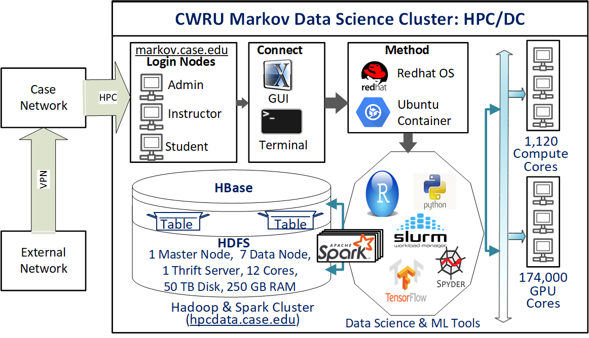

```{r setup, include = FALSE}
knitr::opts_chunk$set(
  cache = FALSE, # if TRUE knitr will cache results to reuse in future knits
  fig.width = 6, # the width for plots created by code chunk
  fig.height = 4.5, # the height for plots created by code chunk
  fig.align = 'center', # how to align graphics. 'left', 'right', 'center'
  dpi = 150, 
  # eval = FALSE, # if FALSE, then the R code chunks are not evaluated
  # results = 'asis', # knitr passes through results without reformatting
  echo = TRUE, # if FALSE knitr won't display code in chunk above it's results
  message = TRUE, # if FALSE knitr won't display messages generated by code
  strip.white = TRUE, # if FALSE knitr won't remove white spaces at beg or end of code chunk
  warning = FALSE) # if FALSE knitr won't display warning messages in the doc
  # options(tinytex.verbose = TRUE)
```

 \setcounter{section}{1}
 \setcounter{subsection}{2}
 \setcounter{subsubsection}{1}

#### Class Readings, Assignments, Syllabus Topics

##### Reading, Lab Exercises, SemProjects

  - Readings: 
    - For today: 
    - For next class: Peng R Programming (PRP), p 4-33
  - Laboratory Exercises: 
    - LE0 : An intro to R exercise, that counts as 0 points
    - LE1 : Given out in Thursday W01b
      - **LE1 due Tuesday Sept. 13th**
  - Office Hours: (Class Canvas Calendar for Zoom Link)
    - Mondays @ 4:00 PM to 5:00 PM, Will Oltjen
    - Saturday @ 3:00 PM to 4:00 PM, Kristen Hernandez 
    - **Office Hours are on Zoom, and recorded**
  - Exams
    - MidTerm: Tuesday October 18th, in class or remote, 11:30 - 12:45 PM
    - Final: Monday 12/19/2022, 12:00PM - 3:00PM, Nord 356 or remote

##### Textbooks

- Introduction to R and Data Science

  - For R, Coding, Inferential Statistics
    - Peng: R Programming for Data Science
    - Peng: Exploratory Data Analysis with R
  
Textbooks for this class

  - OIS = Diez, Barr, Çetinkaya-Runde: Open Intro Stat v4
  - R4DS = Wickham, Grolemund: R for Data Science
  
Textbooks for DSCI353/353M/453, And in your Repo now

  - ISLR = James, Witten, Hastie, Tibshirani: Intro to Statistical Learning with R 2nd Ed.
  - ESL = Trevor Hastie, Tibshirani, Friedman: Elements of Statistical Learning
  - DLwR = Chollet, Allaire: Deep Learning with R

Magazine Articles about Deep Learning

  - DL1 to DL13 are "Deep Learning" articles in 3-readings/2-articles/

##### Syllabus


##### Prof. Laura Bruckman will present in class today, Thursday, on SemProjs

- To give more information on the Semester Projects for DSCI453 students

  -  This includes 3 Reports Outs by 453 Students
    - That **all students will view and do peer grading of**

#### The Lab Exercises (LEs)

- Each LE is worth
  - LE1,2 are 7 points
  - LE3-7 are 10 points 
    - (except LE0 = 0 points)

So 64 points are in the Lab Exercises

  - So these are important and critical to learning
  - You will need to start on the early
    - This is why you are given two weeks to do them
  - You turn in both the .Rmd and the .pdf file
    - We grade on the .pdf file in Canvas
  - We expect good code styling
    - That matches the Google/Rstudio R Style Guide
    - Since this aides collaboration

#### Where we are at present in Class

- So as of today, 

We need to make all elements for the ODS tools chain working for you

  - You have logged into your CaseID email at http://webmail.case.edu
    - And have setup Duo for Two Factor Authentication (2FA)
  - You have joined the DSCI Slack
    - At https://cwru-dsci.slack.com
    - Using your CaseID@case.edu email 
  - You setup a bitbucket.org account
    - using your CaseID email account
    - And have setup your Bitbucket "App Password"
  - You have "forked" the 22f-dsci351-451-prof "prof" repo
    - And have change "prof" to your caseID
    - And made your fork in the CWRU-DSCI team
  - You have configured your git server
    - on both Markov, in your /home/CaseID/Git folder
      - and on ODS Desktop, in your H:/Git folder
      - and on your personal notebook computer, in a Git folder you make
    - And these configurations define your name and email
      - `git config --global user.name "[name]"`
      - `git config --global user.email "[email address]"`
  - Then you want to clone your personal course repo to 3 places
    - Markov/OnDemand: git clone... to /home/CaseID/Git/  
    - ODS Desktop/MyApps: git clone... to H:/Git/   
    - On your own computer to Git folder (to enable easy reading pdf)
    
If not, reach out to the TAs ( Will Oltjen, Krisen Hernandez, Mingxuan Li )

  - Using the http://cwru-dsci.slack.com
    - Which you can join directly using your CaseID@case.edu email address
  - Defining where you issue is
  - And we'll fix it
  
#### Markov HPC and Open Data Science (ODS) Compute Engines

- You can do data analysis on your notebook computer

  - You can setup your own notebook
    - For data science using R or Python
    - Full instructions are in the class syllabus 
      - Section 11
    - For Linux, Mac's or Windows Operating Systems
    - But Many times you'll need more compute power than your notebook
      - Such as GPUs (Graphics Processing Units) to accelerate computations
    
But its useful to learn about a variety of Compute Resources

  - In Class we'll use 
    - Markov Data Science Cluster
      - A high performance computing cluster
      - via http://ondemand.case.edu
    - or Open Data Science Desktops
      - A Win10 cloud desktop
      - via http://myapps.case.edu
These are all configured the same

  - Independent of the Operating System
  - They have R with Rstudio IDE (Integrated Development Environment)
  - Git for code versioning
  - LaTeX for publication quality report generation
  - And also Python3 with VS Codium or PyCharm IDE
  
The two cloud computing systems: Markov HPC Cluster & ODS Win10 Desktop

  - Markov Data Science HPC Compute Cluster, via OnDemand
    - Log in to http://ondemand.case.edu 
    - Using your CaseID and password
    - Launch the Rstudio Server (rxf131)
      - Which runs R version 4.2.1
    - You can also get an LXDE graphical desktop on Markov

CWRU HPC provides Markov

  - [CWRU's HPC (High Peformance Computing) Markov Cluster](https://sites.google.com/a/case.edu/hpcc/)
    - This runs RedHat Linux version 7
    - Has 4400 CPU cores
    - Has 100,000 GPU cores
    - Up to a terabyte of Ram
  - And has a new Data Science Cluster, named [Markov.case.edu](https://markov.case.edu)
    - With a Hadoop Cluster for distributed computing
    - And dedicated GPUs
  - You'll get accounts on CWRU HPC
  - And use [http://ondemand.case.edu](http://ondemand.case.edu)
    - To login to Markov and get a Rstudio Server (rxf131) session
    - Or a LXDE graphical desktop session 
      - for simple file operations or a browser
  

  
- You also have access to the ODS Win10 Desktops

  - These are cloud Windows computers
    - That you log into from a Browser 
    - login to http://myapps.case.edu
    - With your CaseID and password
  - The ODS VDIs are Windows 10 computers
  - The ODS VDIs don't have GPUs
    
Not for class, but for your own data science projects.

And you can use Google's Collaboratory](https://colab.research.google.com/notebooks/welcome.ipynb)

  - For Jupyter Notebooks
  - Running Python3
  - Doesn't support R language yet
  - Free GPUs and [TPUs (Tensor Processing Unit)](https://en.wikipedia.org/wiki/Tensor_processing_unit)


#### What we need to do now

- Setup our Markov and Open Data Science (ODS) Computers

  1. For Markov Data Science Cluster
    - login to `http://ondemand.case.edu` with your CaseID account
    - Launch the SDLE Rstudio Server (rxf131)
    - Check your "Library Paths" 
      - in the R console
      - run `.libPaths()`
      - And the first directory MUST be
      - "/home/rxf131/ondemand/ubuntu2004/r4" "/usr/local/lib/R/site-library"
    - otherwise refer to the file in the root directory of your repo
      - named `FixRstudioServer-R-libPaths.txt`
      - and run the "source('/home/rxf131/ondemand/share/config/r-lib-path-fix.R')`
      - In the R console
      - then check your `.libPaths()` again
    - On Markov, launch `LXDE Desktop (rxf131)`
      - make a Git folder under `/home/CaseID/`  
      - Login to DSCI Slack in your firefox browser on LXDE desktop
  2. For the ODS Desktop
    - login to `http://myapps.case.edu` with your CaseID account
    - Drag icons of to your desktop
      - for R, Rstudio, Git Bash, VScodium, PyCharm, Jupyter Notebook, Slack  
  3. Setup Git
    - make /home/caseID/Git folder on Markov 
      - git config your name and email of your git server
    - make H:\\Git folder on ODS Desktop
      - git config your name and email of your git server
  4. Git Fork the Class "Prof" Repo
    - In your Bitbucket Account
  5. Git Clone your Fork of the Class Repo
  6. When in Rstudio (on Markov or ODS)
    - Its ESSENTIAL that you open the .Rproj file in the upper right corner
    - this tells Rstudio where your root directory of your project is. 
  7. Setup Bitbucket account 
  8. Setup [DSCI Slack Account](http://cwru-dsci.slack.com)
  9. Setup StackExchange account
    
##### So go make accounts, using your case.edu email address

  - Most students have already been invited
    - Pitt, UCF, UTRGV students have been issued CaseIDs
    - That you will use for logging in to
      - case email: at http://webmail.case.edu
      - Markov
      - ODS Desktop
      - DSCI Slack
      - CWRU Canvas
  - Our DSCI Slack class channel
    - [CWRU Data Science Slack](http://cwru-dsci.slack.com)
    - This is [an invite link to CWRU DSCI Slack](https://join.slack.com/t/cwru-dsci/shared_invite/zt-gy4t8444-WZifMnxeReZRw8q~uJUxpQ)
  - For you cloud Git server
    - [Bitbucket.org](http://bitbucket.org)  
  - A [Stack Exchange account](https://stackexchange.com/)


#### Your Open Data Science Tool Chain

##### Its all about a Data Science Tool Chain

  - Use R and build on the communities foundation
  - Use Rstudio as a comfy environment
  - Share your Open Data and Open Source Code
  - Produce Reproducible Science with Rmarkdown  
    + Use [Creative Commons Licenses](https://creativecommons.org/)
    + Or other [Open Source Licenses](https://en.wikipedia.org/wiki/Comparison_of_free_and_open-source_software_licenses)
    + Such as the [Gnu Public License: GPL](https://en.wikipedia.org/wiki/GNU_General_Public_License)
    - Or one of my favorites, [the Apache License](https://en.wikipedia.org/wiki/Apache_License)

###### Pilot your Data Science studies using available data

  - Find available data sets
  - Before starting the costly process of making data

###### Use Git repositories

  - For Code Version Control
  - For Collaboration
  - For Open Science sharing
  
##### Online Git Server Communities

  - We use [BitBucket Account](http://bitbucket.org)
    - In class, for our class code repositories
    - These are private repositories
  - You'll probably also want a [GitHub](http://github.com/) account.
    - Many Rprojects are there, and 
    - you can fork their repo's as inspect the code very easily.

##### Kaggle Account

  - [Kaggle](http://www.kaggle.com) started as a data science competition site
  - Its recently been bought by Google
    - And give free R and Python Notebooks
    - Including use of free GPUs
  - It has a very good [Intro to R, Python, Machine Learning etc.](https://www.kaggle.com/learn/overview)
    - First R Tutorial: [Getting staRted in R: First Steps](https://www.kaggle.com/rtatman/getting-started-in-r-first-steps/)
    - 2nd [R Tutorial, Level 1, on Modeling](https://www.kaggle.com/learn/r)
    - 3rd [R Tutorial, Level 2, on tidyverse data manipulation](https://www.kaggle.com/rtatman/manipulating-data-with-the-tidyverse) 


##### Slack, another component of Agile Sofware Development

  - [Slack.com](https://slack.com/)
    - We have a [CWRU DSCI Slack room](http://cwru-dsci.slack.com)
    - There is Slack app for phones
    - And client for computers, its on vdi.
    - Slack client available for windows, mac and Linux
  - an online collaboration tool

#### Your Online Data Science Portfolio

  - Doing open, reproducible data science
  - Lets you share a portfolio of codes and projects
  - Cite it in your resume
  - Build a community of supporters and collaborators

##### Twitter used for Data Science

- As part of setting up our Data Science Tool Chain

  - Signup for a Twitter account 
  - [Using Twitter in university research](http://blogs.lse.ac.uk/impactofsocialsciences/files/2011/11/Published-Twitter_Guide_Sept_2011.pdf)
  - [10 Commandments of Twitter for Academics](http://chronicle.com/article/10-Commandments-of-Twitter-for/131813/)

Data Science People to follow on Twitter

  - @hadleywickham 
  - @jtleek Jeff Leek JHU
  - @rdpeng Roger Peng JHU  
  - @simplystats
  - @Rbloggers
  - @JennyBryan 
  - @hspter Hilary Parker
  - @NSSDeviations
  - @dataandme
  - @rstudio
  - @rstudiotips
  - @R_Programming 
  - @CRANberriesFeed
  - @timoreilly
  - @kaggle
  - @SciPyTip
  - @PyData
  - @debian
  - @ubuntu
  - @GuardianData
  - @UpshotNYT
  - @EdwardTufte
  - @ProjectJupyter
  - @doctorow Cory Doctorow
  - @gvanrossum Founder of Python
  - @NateSilver538
  - @cutting  Founder of Hadoop
  - @RProgLangRR
  - @BitbucketStatus
  - @CWRUITS_STATUS
  - @cshirky Clay Shirky
  - @robjhyndman
  - @geoffreyhinton
  - @ylecun
  - @fchollet
  - @TensorFlow
  - @JeffDean
  - @yudapearl
  - @AndrewYNg
  

##### Sign up for a Stack Exchange Account

- Stack Exchange, Stack Overflow
    
  - are a Q&A community focused on many topics.  

Stack Overflow allows you to search by tag

  - r and rmarkdown are useful tags for SO

###### [Stack Exchange's Tour of Stack Overflow](http://stackoverflow.com/tour)  

###### Specific Stack Exchange websites

  - for [SX Data Science](https://datascience.stackexchange.com/)                             
  - for [SX Statistics on Cross Validated](http://stats.stackexchange.com/) 
  - for [SX Open Data](http://opendata.stackexchange.com/)             

##### Efficiently browse you SX sites

  - Google (but more random)
  - [The Stack Exchange apps](http://stackapps.com/) 
  - Using an [RSS Feed reader such as Feedly](http://feedly.com/i/latest) is a good way
  
##### An Example, Emeline Liu

  - [emelineliu.com](http://emelineliu.com/)
    -  This website, which runs off of [Github Pages](https://pages.github.com/) and [Jekyll](https://jekyllrb.com/), is my latest project. 
    - Right now, I'm using [Poole](http://getpoole.com/) as a foundation for my website/blog.

#### Links
 
  - http://www.r-project.org 
  - Rory Winston, for the [Learning R Intro](http://www.theresearchkitchen.com/archives/1017)
  - StackExchange [http://stackexchange.com/sites](http://stackexchange.com/sites)
  - Twitter [http://twitter.com](http://twitter.com)
  - Slack [http://slack.com](http://slack.com)
  - [CWRU-DSCI Slack](http://cwru-dsci.slack.com) 
  - [emelineliu.com](http://emelineliu.com/)
  - [Github Pages](https://pages.github.com/) 
  - [Kaggle.com](https://kaggle.com)
  - [Colaboratory](https://colab.research.google.com/notebooks/welcome.ipynb)

