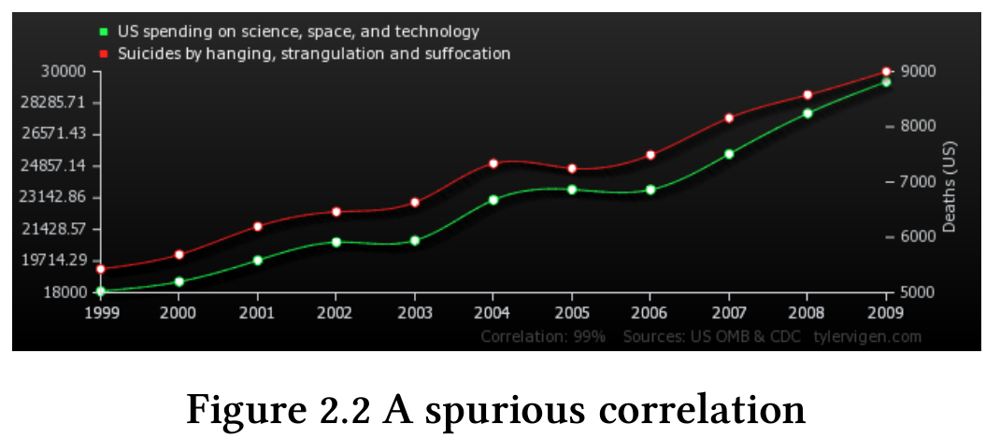

 \setcounter{section}{3}
 \setcounter{subsection}{2}
 \setcounter{subsubsection}{3}

```{r setup, include = FALSE}
knitr::opts_chunk$set(
  cache = FALSE, # if TRUE knitr will cache results to reuse in future knits
  fig.width = 6, # the width for plots created by code chunk
  fig.height = 4, # the height for plots created by code chunk
  fig.align = 'center', # how to align graphics. 'left', 'right', 'center'
  dpi = 300, 
  dev = 'png', # Makes each fig a png, and avoids plotting every data point
  # eval = FALSE, # if FALSE, then the R code chunks are not evaluated
  # results = 'asis', # knitr passes through results without reformatting
  echo = TRUE, # if FALSE knitr won't display code in chunk above it's results
  message = TRUE, # if FALSE knitr won't display messages generated by code
  strip.white = TRUE, # if FALSE knitr won't remove white spaces at beg or end of code chunk
  warning = FALSE, # if FALSE knitr won't display warning messages in the doc
  error = TRUE) # report errors
  # options(tinytex.verbose = TRUE)
```

--------------------------

#### First: Guess The Correlation Game

  - [Guess The Correlation Game](http://guessthecorrelation.com/)

--------------------------

#### Tidyverse thinking

##### Hadley Wickham Talk on Tidyverse

- Watch this one for class

  - [Hadley Wickham on Tidyverse](https://youtu.be/K-ss_ag2k9E)
  - [Hadley is from New Zealand](http://hadley.nz/)
    - And is chief scientist at RStudio company

Alternatively here is a more extended version

  - [RConf-Jan 2017: Data Science in the Tidyverse](https://www.rstudio.com/resources/videos/data-science-in-the-tidyverse/)
  And slides 
  
##### Hadley has a great book on making R packages

- Its available to read online

  - [R Packages](http://r-pkgs.had.co.nz/)

##### Purrr is another part of the Tidyverse

- purrr enhances R's functional programming (FP) toolkit 

  - by providing a complete and consistent set of tools 
  - for working with functions and vectors. 
  
If you've never heard of FP before, 

  - Check Wikipedia first
    - [Functional Programming](https://en.wikipedia.org/wiki/Functional_programming)
  - the best place to start is 
  - the family of map() functions 
    - which allow you to replace many for loops 
    - with code that is both more succinct and easier to read. 

The best place to learn about the map() functions 

  - is the iteration chapter in R for data science.

  - [Use quick formula functions in purrr::map (+ base vs tidtyverse idiom comparisons/examples)](https://rud.is/b/2016/07/26/use-quick-formula-functions-in-purrrmap-base-vs-tidtyverse-idiom-comparisonsexamples/)

  [purrr tutorial](https://jennybc.github.io/purrr-tutorial/)

#### An Example

- [Chart: It’s not your imagination, US gun violence is over the top this summer](https://qz.com/741391/its-not-your-imagination-gun-violence-is-over-the-top-this-summer/)

  [Falling into the Pit of Success](https://blog.codinghorror.com/falling-into-the-pit-of-success/)

##### Jenny Bryan on Data Wrangling

- [Jenny Bryan on Data Wrangling](https://youtu.be/4MfUCX_KpdE)

  [Basic care and feeding of data in R](http://stat546.com/block006_care-feeding-data.html)


#### Some Tidy Data Analysis Resources

##### Elements of Data Analytic Style; Jeff Leak

  - https://leanpub.com/datastyle
  
##### R for Data Science

  - By Garrett Grolemund, Hadley Wickham
  - http://r4ds.had.co.nz/

##### What is Tidy Data

  - A Wickham paper in your readings subdirectory
  - http://vita.had.co.nz/papers/tidy-data.pdf

#### Data Analysis Question, Tidying, Checking, Exploratory Data Analysis

##### Answering the question

  1. Did you specify the type of data analytic question 
  
    - (e.g. exploration, association, causality)
      - exploration
      - association
      - causality
      - inferential (mechanistic)
    - before touching the data?
  
So here is another [John Tukey quote](https://en.wikipedia.org/wiki/John_Tukey).

  The data may not contain the answer. 
  
  The combination of some data and an aching desire for an answer 
  
  - does not ensure that a reasonable answer can be extracted 
    - from a given body of data.
John Tukey

##### The Data Analysis Flow Chart


1. Types of Data Analyses

  - Descriptive: 
    - A descriptive data analysis seeks to summarize the measurements 
      - in a single data set without further interpretation. 
  - Exploratory: 
    - An exploratory data analysis builds on a descriptive analysis 
      - by searching for discoveries, trends, correlations, 
      - or relationships between the measurements of multiple variables 
        - to generate ideas or hypotheses. 
  - Inferential: 
    - An inferential data analysis goes beyond an exploratory analysis 
      - by quantifying whether an observed pattern will likely hold 
        - beyond the data set in hand. 
    - Inferential data analyses are the most common statistical analysis 
      - in the formal scientific literature. 
  - Predictive: 
    - While an inferential data analysis quantifies 
    - The relationships among measurements at population-scale, 
      -  a predictive data analysis uses a subset of measurements (the features) 
        - to predict another measurement (the outcome) on a single person or unit. 
  - Causal: 
    - A causal data analysis seeks to find out what happens to one measurement 
      - if you make another measurement change. 
  - Mechanistic: 
    - Causal data analyses seek to identify average effects 
      - between often noisy variables. 
    - For example, decades of data 
      - show a clear causal relationship between smoking and cancer. 
  
2. Did you define the metric for success before beginning?

3. Did you understand the context for the question and the scientific or business application?

4. Did you record the experimental design?

5. Did you consider whether the question could be answered with the available data?

##### Common Mistakes

  - Correlation does not imply causation: 
    - Interpreting an inferential analysis as causal.

Most data analyses involve inference or prediction. 

  - Unless a randomized study is performed, 
  - it is difficult to infer from The data analytic question 
  - if there is a relationship between two variables. 

A great website to hunt for spurious correlations is 

  - [http://tylervigen.com](http://tylervigen.com ) 



Particular caution should be used when applying words 

  - such as “cause” and “effect” when performing inferential analysis. 

Inference is not about causation; its infering relationships between variables. 

  - Overfitting: Interpreting an exploratory analysis as predictive
  
A common mistake is to use a single, unsplit data set 

  - for both model building and testing. 
  - If you apply a predictive model 
    - to the same data set used to build the model 
    - you can only estimate “resubstitution error” or “training set error”. 
  -  These estimates are very optimistic (Not Good) estimates of the error 
    - you would get if using the model in practice. 

If you try enough models on the same set of data, 

  - you eventually can predict perfectly.
  - but this is useless

For a predictive model; 

  - you need to split your data into training and test datasets, 
  -   and evaluate how well it predicts the test dataset.
  - n of 1 analysis: Descriptive versus inferential analysis. 

When you have a very small sample size, 

  - it is often impossible to explore the data, 
    - let alone make inference to a larger population. 
  - Data dredging: Interpreting an exploratory analysis as inferential
  
Similar to the idea of overfitting, 

  - if you fit a large number of models to a data set, 
    - it is generally possible to identify at least one model 
    - that will fit the observed data very well. 

As Ronald Coase said: 

  - “If you torture the data enough, nature will always confess.”

--------------------------

#### Tidying the data

- The point of creating a tidy data set 

  - is to get the data into a format 
    - that can be easily shared, computed on, and analyzed.
  - The components of a data set: 
  
The work of converting the data from raw form 

  - to directly analyzable form 
    - is the first step of any data analysis. 
  - It is important to see the raw data, 
    - understand the steps in the data processing pipeline, 
    - and be able to incorporate hidden sources of variability 
    - in one’s data analysis. 

On the other hand, for many data types, 

  - the processing steps are well documented and standardized.

##### These are the components of a processed data set:

  - The raw data.
  - A tidy data set.
  - A code(data) book describing each variable 
    - and its values in the tidy data set.
  - An explicit and exact recipe you used 
    - to go from raw to tidy and a databook.

  1. Is each variable one column?
  2. Is each observation one row?
  3. Do different data types appear in each table?
  4. Did you record the recipe for moving from raw to tidy data?
  5. Did you create a code(data) book?
  6. Did you record all parameters, units, and functions applied to the data?

##### Raw data: It is critical that you include 

  - the rawest form of the data that you have access to. 

Raw data is relative: 

  - The raw data will be different 
    - to each person that handles the data. 
  - One person's raw data, 
    - may be some previous persons tidy data!


##### Tidy data: 
  
- The general principles of tidy data are laid out by Hadley Wickham in 

  - this paper [http://vita.had.co.nz/papers/tidy-data.pdf](http://vita.had.co.nz/papers/tidy-data.pdf)
  - and this video [https://vimeo.com/33727555](https://vimeo.com/33727555). 
  
The paper and the video are both focused on the tidyverse R packages. 

Regardless the four general principles you should pay attention to are: 

  - Each variable you measure should be in one column
  - Each different observation of that variable should be in different row
  - There should be one table for each “kind” of variable
  - If you have multiple tables, 
    - they should include a column in the table 
    - that allows them to be linked

##### Include a row at the top of each data table/spreadsheet 

  - that contains full row names.
  - If you are sharing your data with the collaborator 
  
##### They should be shared as csv files, not in Excel

- Since Excel files can have buried macros, 

  - you lost control of the data analysis process.
  
Also one csv table per file, no workbooks

  - No highligting cells.
  - csv files are for data only; no code.  
  - or one Excel file per table.
    - but xls or xlsx files are binary and fragile
    - ascii csv files are more robust

#### The code (or data) book: 

- The measurements you calculate 

  - will need to be described in more detail 
  - than you will sneak into the spreadsheet. 
  
The code book contains this information. 

At minimum it should contain:

- Information about the variables (including units!) 
  - in the data set not contained in the tidy data
  - Information about the summary choices you made
  - Information about the experimental study design you used

##### The instruction list or script must be explicit

- You may have heard this before, 

  - but reproducibility is kind of a big deal in computational science.

##### The ideal instruction list is a script

- The ideal thing for you to do when performing summarization 

  - is to create a computer script (in R, Python, or something else) 
  - that takes the raw data as input 
    - and produces the tidy data you are sharing as output. 

##### If there is no script, 
 
- be very detailed about 

  - parameters, 
  - versions, and 
  - order of software

##### Common Mistakes

  - Combining multiple variables into a single column
  - Merging unrelated data into a single file
  - An instruction list that isn’t explicit
  
#### Checking the data

  1. Did you plot univariate and multivariate summaries of the data?
  2. Did you check for outliers?
  3. Did you identify the missing data code?
  
Data munging or processing is required 

  - for basically every data set that you will have access to. 

Even when the data are neatly formatted 

  - like you get from open data sources like [http://Data.gov](http://Data.gov) 
  - you’ll frequently need to do things that make it 
    - slightly easier to analyze or use the data for modeling. 

The first thing to do with any new data set is 

  - to understand the quirks of the data set and potential errors. 
  
This is usually done with a set of standard summary measures. 

The checks should be performed on 

  - the rawest version of the data set you ave available. 

A useful approach is to think of every possible thing that could go wrong 

  - and make a plot of the data to check if it did.

##### How to code variables

- When you put variables into a spreadsheet 

  - there are several main categories you will run into 
    - depending on their data type:
  - Continuous
  - Ordinal
  - Categorical
  - Missing
  - Censored

1. In the code book you should explain why censored values are missing.

2. Avoid coding categorical or ordinal variables as numbers.

3. Always encode every piece of information about your observations using text.

4. Identify the missing value indicator

There are a number of different ways 

  - that missing values can be encoded in data sets. 
  - The common choices are “NA”. Don't use numbers.

5. Check for clear coding errors

6. Check for label switching

7.  If you have data in multiple files, 

Ensure that data that 

  - should be identical across files 
  - is identical

In some cases you will have the same measurements 

  - recorded twice.

You should check that for each patient 

  - in the two files the sex is recorded the same.
  - This is part of data validation.

8. Check the units (or lack of units)

Define the units.

##### Common Mistakes

  - Failing to check the data at all
  - Encoding factors as quantitative numbers
  - Not making sufficient plots
  - Failing to look for outliers or missing values
  
  
