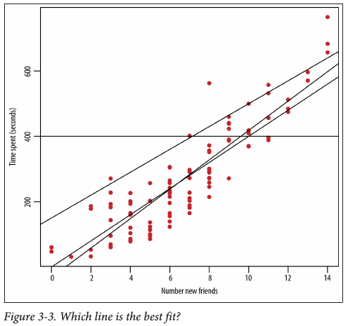

 
 \setcounter{section}{6}
 \setcounter{subsection}{2}
 \setcounter{subsubsection}{1}
 
```{r setup, include = FALSE}
knitr::opts_chunk$set(
  cache = FALSE, # if TRUE knitr will cache results to reuse in future knits
  fig.width = 6, # the width for plots created by code chunk
  fig.height = 4, # the height for plots created by code chunk
  fig.align = 'center', # how to align graphics. 'left', 'right', 'center'
  dpi = 300, 
  dev = 'png', # Makes each fig a png, and avoids plotting every data point
  # eval = FALSE, # if FALSE, then the R code chunks are not evaluated
  # results = 'asis', # knitr passes through results without reformatting
  echo = TRUE, # if FALSE knitr won't display code in chunk above it's results
  message = TRUE, # if FALSE knitr won't display messages generated by code
  strip.white = TRUE, # if FALSE knitr won't remove white spaces at beg or end of code chunk
  warning = TRUE, # if FALSE knitr won't display warning messages in the doc
  error = TRUE) # report errors
  # options(tinytex.verbose = TRUE)
```

#### Class Readings, Assignments, Syllabus Topics

##### Reading, Lab Exercises, SemProjects

  - Readings: 
    - For today: R4DS9-16
    - For next class: OIS6.1,2
  - Laboratory Exercises: 
    - LE3 : Is due Thursday midnight
    - LE4 : Will be distributed Thursday
    - LE4 is due Thursday October 20
  - Office Hours: (Class Canvas Calendar for Zoom Link)
    - Mondays @ 4:30 PM to 5:30 PM
    - Wednesdays @ 4:30 PM to 5:30 PM  
    - **Office Hours are on Zoom, and recorded**
      - MidTerm: Tuesday October 18th, in class or remote, 11:30 - 12:45 PM
      - Final: Monday December 19, 2022, 12:00PM - 3:00PM, Nord 356 or remote

#### Textbooks

  - [Peng: R Programming for Data Science](https://leanpub.com/rprogramming)
  - [Peng: Exploratory Data Analysis with R](https://leanpub.com/exdata)
  - [Open Intro Stats, v4](https://openintro.org/os)
  - [Wickham: R for Data Science](https://r4ds.had.co.nz/)
  - [Hastie: Intro to Statistical Learning with R, 2nd Ed.](https://www.statlearning.com/)

Introduction to R and Data Science

  - For R, Coding, Inferential Statistics
    - Peng: R Programming for Data Science
    - Peng: Exploratory Data Analysis with R
  
Textbooks for this class

  - OIS = Diez, Barr, Çetinkaya-Runde: Open Intro Stat v4
  - R4DS = Wickham, Grolemund: R for Data Science
  
Textbooks for DSCI353/353M/453, And in your Repo now

  - ISLR = James, Witten, Hastie, Tibshirani: Intro to Statistical Learning with R 2nd Ed.
  - ESL = Trevor Hastie, Tibshirani, Friedman: Elements of Statistical Learning
  - DLwR = Chollet, Allaire: Deep Learning with R

Magazine Articles about Deep Learning

  - DL1 to DL12 are "Deep Learning" articles in 3-readings/2-articles/

##### Tidyverse Cheatsheets, Functions and Reading Your Code

- Look at the Tidyverse Cheatsheet 

  - **Tidyverse For Beginners Cheatsheet**
    - In the Git/20s-dsci353-353m-453-prof/3-readings/3-CheatSheets/ folder
  - **Data Wrangling with dplyr and tidyr Cheatsheet**
  
  Tidyverse Functions & Conventions
  
    - The pipe operator `%>%`
    - Use `dplyr::filter()` to subset data row-wise.
    - Use `dplyr::arrange()`  to sort the observations in a data frame
    - Use `dplyr::mutate()` to update or create new columns of a data frame
    - Use `dplyr::summarize()` to turn many observations into a single data point
    - Use `dplyr::arrange()` to change the ordering of the rows of a data frame 
    - Use `dplyr::select()` to choose variables from a tibble, 
      - keeps only variables you mention
    - Use `dplyr::rename()` keeps all the variables and renames variables
      - rename(iris, petal_length = Petal.Length)
    - These can be combined using `dplyr::group_by()` 
      - which lets you perform operations “by group”. 
    - The `%in%` matches conditions provided by a vector using the c() function
    - The **forcats** package has tidyverse functions 
      - for factors (categorical variables)
    - The **readr** package has tidyverse functions 
      - to read_..., melt_... col_..., parse_... data and objects

Reading Your Code: Whenever you see

  - The assignment operator `<-`, think **"gets"**
  - The pipe operator, `%>%`, think **"then"**
  

##### Syllabus


### Basic steps we use to construct a data analysis.

- Modified from Jeff Leek’s slides 

  * ( available in your repo in 17f-dsci351-451-prof/3-readings/ )

#### Data Analysis: Part a) Define Question

  * Background on the research area and critical issues
  * Define the question
  * Define the ideal data set
  * Determine what data you can access
  * Define critical capabilities and identify packages you will draw upon
  * Obtain the data, define you target data structure
  * Clean and tidy the data

#### Data Analysis: Part b) Cleaning and EDA

  * Write you databook, defining variables, units and data structures
  * Data visualization and exploratory data analysis
  * Observations of trends and functional forms
  * Power transformations
  * Validate with reference to domain knowledge
  * Evaluate the types of Modeling Approaches to take

#### Data Analysis: Part c) Modeling and Statistical Learning

  * Types of modeling to try
  * Statistical prediction/modeling
  * Model selection
  * Cross-validation, Predictive R2
  * Interpret results
  * Challenge results

#### Data Analysis: Part d) Present your final models and learnings

  * Present your results
  * Present reproducible code
  * Comparison to other modeling approaches in the literature

### Categories of data analyses

#### Supervised and Unsupervised Learning

- Two broad families of algorithms will be covered: 

  * Unsupervised learning algorithms
  * Supervised learning algorithms

##### Unsupervised learning 

- In unsupervised learning, 

  - the algorithm will seek to find the structure that organizes unlabelled data. 

##### Supervised learning 

- In supervised learning, 

  - we know the class or the level of some observations of a given target attribute. 

#### Classification and Regression Problems

- There are basically two types of problems that predictive modeling deals with: 

  * Classification problems 
  * Regression problems

##### Classification

- In some cases, we want to predict which group an observation is part of. 

Here, we are dealing with a quality of the observation. 

##### Regression

- In other cases, we want to predict an observation's level on an attribute. 

Here, we are dealing with a quantity, and this is a regression problem. 

#### The critical role of domain knowledge 

  * in modeling and prediction

Domain knowledge informs and is informed by data understanding. 

  * The understanding of the data 
    - then informs how the data has to be prepared. 

The next step is data modeling, 

  * which can also lead to further data preparation. 

Data models have to be evaluated, 

  * and this evaluation can be informed by field knowledge, 
    - which is also updated through the data mining process. 

Finally, 

  * if the evaluation is satisfactory, 
    - the models are deployed for prediction. 


### Caveat: For Predictive Analytics

- Of course, predictions are not always accurate, 

  * and some have written about the caveats of data science. 

What do you think about the relationship between 

  * the attributes titled Predictor and Outcome on the following plot? 


It seems like there is a relationship between the two. 

  * For the statistically inclined, 
      - I tested its significance:
        - r = 0.4195, p = .0024. 
  * The value p is the probability of obtaining a relationship of this strength or stronger 
      - if there is actually no relationship between the attributes. 
  * ( This is the p-value of hypothesis testing, if p<0.05 
      - typically we assert we can reject the null hypothesis)
  * We could conclude that the relationship between these variables 
      - in the population they come from is quite reliable, 
      - **right?**
    
#### No: Lets think about this

- Believe it or not, 

  * the population these observations come from 
      - is that of randomly generated numbers. 
  * We generated a data frame of 50 columns 
      - of 50 randomly generated numbers. 
  * We then examined all the correlations (manually) 
      - and generated a scatterplot of the two attributes 
      - with the largest correlation we found. 
    
##### The code is provided here, 

- We'll use `runif()`

  * help(runif)
    - The Uniform Distribution
    - Description
    - These functions provide information about the uniform distribution 
    - on the interval from min to max. 
      - `dunif` gives the density, 
      - `punif` gives the distribution function 
      - `qunif` gives the quantile function and 
      - `runif` generates random deviates.

```{r,echo=TRUE}
set.seed(1)
DF = data.frame(matrix(nrow = 50, ncol = 50))
for (i in 1:50) {
  DF[, i] = runif(50)
}

plot(DF[[2]], DF[[16]], xlab = "Predictor", ylab = "Outcome")
abline(lm(DF[[2]] ~ DF[[16]]))
cor.test(DF[[2]], DF[[16]])

```

  - in case you want to check it yourself
  - line 1 sets the seed so that you find the same results as we did, 
  - line 2 generates to the data frame, 
  - line 3-5 the for loop fills it with random numbers, column by column, 
  - line 7 generates the scatterplot, 
  - line 8 fits the regression line, and 
  - line 9 tests the significance of the correlation:

Normally we reject the null with a p-value of <0.05

  * i.e. we'll be wrong 5% of the time
    - in a set of 20 trials
  
Here we did 50 trials

  * And cherry picked the best correlation
    - But its all randomly generated numbers
    - There is no predictive or causal relationship
  * And we'd only recognize this if we consider
    - That our p-value is reported for 1 trial
    - But we run many trials

#### [Bonferroni Correction](https://en.wikipedia.org/wiki/Bonferroni_correction) for multiple comparisons

- How could this relationship happen given that the odds were 2.4 in 1000 ? 

  * Well, think of it; 
    - we correlated all 50 attributes 2 x 2, 
    - which resulted in 2,450 tests 
      - (not considering the correlation of each attribute with itself). 
  * Such spurious correlation was quite expectable. 

The usual threshold below which we consider a relationship significant is p = 0.05. 

  * This means that we expect to be wrong once in 20 times.
  * You would be right to suspect that there are other significant correlations 
    - in the generated data frame (there should be approximately 125 of them in total). 
  * This is the reason why we should always correct the number of tests. 
  * In our example, 
    - as we performed 2,450 tests, 
    - our threshold for significance 
    - should be 0.0000204 (0.05 / 2450).
  * This is called the Bonferroni correction.

### Overfitting: The need for Training and Testing Datasets

- Spurious correlations are always a possibility in data analysis 

  * and this should be kept in mind at all times. 

A related concept is that of overfitting. 

  * Overfitting happens, for instance, 
    - when a weak classifier bases its prediction on the noise in data. 
  * We will discuss overfitting when discussing
    - Training datasets for fit a model to
    - Testing datasets for evaluating the goodness of fit
      - when using various types of cross-validation
    - And when evaluating $Predictive, Adjusted, R^2$
    
#### Lets get some basic ideas for background

  - [Standard Error](https://en.wikipedia.org/wiki/Standard_error)
  - [Margin of Error](https://en.wikipedia.org/wiki/Margin_of_error)
  - [Z score](https://en.wikipedia.org/wiki/Standard_score)
    - [Used in Z-test](https://en.wikipedia.org/wiki/Z-test)
    - [The analog of Students t-test](https://en.wikipedia.org/wiki/Student%27s_t-test)
  - [$Adjusted R^2$](https://en.wikipedia.org/wiki/Coefficient_of_determination)
  - [PRESS, predicted residual error sum of squares statistic](https://en.wikipedia.org/wiki/PRESS_statistic)

#### Dice statistics

  - [Weldon's Dice](https://en.wikipedia.org/wiki/Raphael_Weldon#Weldon's_dice)
    - [Weldon's Dice Automated](https://link.springer.com/article/10.1007%2Fs00144-009-0036-8)
    - Weldon's Dice Revisited, In readings Kemp and Kemp - 1991 - Weldon's Dice Data Revisited.pdf
  - [Reproducing Weldon's Dice Experiment](http:// www.youtube.com/watch?v=95EErdouO2w)
  - [Fair Dice (Part 2) - Numberphile](https://www.youtube.com/watch?v=8UUPlImm0dM)

### Doing Data Science 

  - Data Science is a melding of fields
  - And has some tension among pre-existing scientific community cultures
    + e.g. Statisitics and Computer Science
  - Stats traditionally focuses on Models and Uncertainty
  - Computer Science focuses on Algorithms and "Data Products"

#### Twitter Data mining for EDA

  * [deprecated twitter datamining](https://sites.google.com/site/miningtwitter/)
  * [How to reveal anyone’s interests on Twitter using social network analysis](http://www.r-bloggers.com/how-to-reveal-anyones-interests-on-twitter-using-social-network-analysis/)
  * [Twitter Network Analysis](http://www.eanalytica.com/blog/twitter-network-analysis-in-R/)
  * [Graph Analysis of Twitter and people's interests](http://cartesianfaith.com/2014/09/22/how-to-reveal-anyones-interests-on-twitter-using-social-network-analysis/)
  * [Social Network Analysis](https://rdatamining.wordpress.com/2012/03/27/social-network-analysis-with-r/)
  
#### Word clouds for visualization

  * [Shiny word clouds](http://shiny.rstudio.com/gallery/word-cloud.html)
  * [Word clouds in R](http://onertipaday.blogspot.com/2011/07/word-cloud-in-r.html)

### Algorithms 

- An algorithm is a procedure or set of steps or rules to accomplish a task. 

Algorithms are one of the fundamental concepts in, or building blocks of, computer science: 

  - the basis of the design of elegant and efficient code, 
    - data preparation and processing, 
    - and software engineering.

Efficient algorithms that work sequentially or in parallel 

  - are the basis of pipelines to process and prepare data.

With respect to data science,there are at least three classes of algorithms one should be aware of:

1. Data munging, preparation, and processing algorithms, 

- such as sorting, MapReduce, or Pregel.

2. Optimization algorithms for parameter estimation, including 

- Stochastic Gradient Descent, 
- Newton’s Method, and 
- Least Squares. 
- We mention these types of algorithms throughout, 
- and they underlie many R functions.

3. Machine learning algorithms are a big topic 

- and we discuss these more next.
- and in DSCI 353-353M-453
- They are covered in ISLR textbook
  
#### Machine Learning Algorithms

  * Machine learning algorithms are largely used 
    - to predict, classify, or cluster.

So modeling could be used to predict or classify? Yes. 

  - Here’s where some lines have been drawn that can make things a bit confusing, 
  - and it’s worth understanding who drew those lines.

Statistical modeling came out of statistics departments, 

  - and machine learning algorithms came out of computer science departments. 
  - Certain methods and techniques are considered to be part of both, 
    - and you’ll see that we often use the words somewhat interchangeably.

You’ll find some of the methods, such as linear regression, 

  - in machine learning books as well as intro to statistics books. 
  - It’s not necessarily useful to argue over 
    - who the rightful owner is of these methods, 
  - but it’s worth pointing out here that it can get 
    - a little vague or ambiguous about what the actual difference is.

In general, machine learning algorithms 

  - that are the basis of artificial intelligence (AI) 
    - such as image recognition, 
    -  speech recognition, 
    -  recommendation systems, 
    - ranking and personalization of content
      - often the basis of data products
    - are not usually part of a core statistics curriculum or department. 

They aren’t generally designed to infer the underlying generative process 

  - (e.g., to model something), 
  - but rather to predict or classify with the most accuracy. 

### Statistician and Computer Science Approaches

- We say the following lovingly and with respect: 

  * Statisticians have chosen to spend their lives investigating uncertainty, 
    * and they’re never 100% confident about anything. 
  
  * Software engineers like to build things. 
  * They want to build models that predict the best they can, 
    - but there are no concerns about uncertainty—just build it! 

#### Interpreting Parameters (such as Estimators, Predictors)

  * Statisticians think of the parameters 
    - in their linear regression models 
    - as having real-world interpretations, 

And typically want to be able to find meaning 

  - in behavior or 
  - describe the real-world phenomenon corresponding to those parameters. 

Whereas a software engineer or computer scientist 

  - might be wanting to build their linear regression algorithm 
    - into production-level code, 
  - and the predictive model is what is known as a black box algorithm,

They don’t generally focus on the interpretation of the parameters. 

  - If they do, it is with the goal of handtuning them 
  - in order to optimize predictive power.

#### Confidence Intervals 

  * Statisticians provide confidence intervals and posterior distributions 
    - for parameters and estimators, 

And are interested in capturing the variability or uncertainty of the parameters. 

  * Many machine learning algorithms, 
    - such as k-means or k-nearest neighbors, 
    - don’t have a notion of confidence intervals or uncertainty.

#### The Role of Explicit Assumptions 

  * Statistical models make explicit assumptions 
    - about data-generating processes and distributions, 
    - and you use the data to estimate parameters. 

Nonparametric solutions, 
  
  - don’t make any assumptions about probability distributions, 
  - or they are implicit.

#### So Is It An Algorithm Or A Model?

- While we tried to make a distinction between the two earlier, 

  - we admit the colloquial use of the words “model” and “algorithm” 
    - gets confusing because the two words seem to be used interchangeably 
  - when their actual definitions are not the same thing at all. 

In the purest sense, 

  - an algorithm is a set of rules or steps to follow 
    - to accomplish some task.
  - And a model is an attempt to describe or capture the world. 

These two seem obviously different, 

  - so it seems the distinction should should be obvious. 

Unfortunately, it isn’t. For example, 

  - regression can be described as a statistical model 
    - as well as a machine learning algorithm. 
  - You’ll waste your time trying to get people to discuss this with any precision.


In some ways this is a historical artifact 

  - of statistics and computer science communities 
  - developing methods and techniques in parallel 
    - and using different words for the same methods. 

The consequence of this is that the distinction 

  - between machine learning and statistical modeling is muddy. 

Some methods (for example, k-means, discussed in the next section) 

  * we might call an algorithm 
  * because it’s a series of computational steps 
    - used to cluster or classify objects
  
On the other hand, k-means can be reinterpreted as 

  - a special case of a Gaussian mixture model. 

The net result is that colloquially, 

  - people use the terms algorithm and model interchangeably 
    * when it comes to a lot of these methods, 
  * so try not to let it worry you. 
    - (Though it bothers us, too.)


### One basic algorithm: Linear Regression

- One of the most common statistical methods is linear regression. 

At its most basic, 

  - it’s used when you want to express the mathematical relationship 
    - between two variables or attributes.
  - between a predictor and a response

When you use it, you are making the assumption 

  - that there is a linear relationship between
    * an outcome variable 
      - (sometimes also called the response variable, dependent variable, or label) and a
    * predictor 
      - (sometimes also called an independent variable, explanatory variable, or feature); 

Or between 

  * one variable and several other variables, 
  * in which case you’re modeling the relationship as having a linear structure.

NOTE: the regression method (to fit the data) is a linear method.
But Linear Regression can be used for fitting equations of higher order than linear

  - So you can use linear regression to fit an exponential parametric equation to your data.
  - For this reason I tend to just refer to "regression", 
  - with a special case of "non-linear regression" 
    - if we are using more complex regression fitting methods

One entry point for thinking about linear regression is 

  * to think about deterministic lines first. 
  * We learned back in grade school that we could describe 
  * a line with a slope and an intercept, 
    - $y = f(x) = \beta_0 + \beta_1 * x$ . 
  * But the setting there was always deterministic.
    + Notice we don't have the explicit error term $\epsilon$ listed. 
    
    

Looking at real data and regressing a linear function fit

So with real data, we have an equation, 

  - but there is an error between the fitline and the data
  - RSS( $\beta$)  = $\sigma_i$ ($y_i$ - $\beta_xi$)$^2$
  - $y = f(x) = \beta_0 + \beta_1 * x + \epsilon$ . 

      
    
So which line fits best?

So we minimize the residual sum of squares (RSS) between the fitline and the data

  + where in vector notation $\beta * x = \beta_0 + \beta_1 * x$  

  

Estimators

  - Here the little “hat” symbol on top of the $\beta$
    - i. e. $\hat{\beta}$
  - indicates that it’s the estimator for $\beta$. 
  
You don’t know the true value of $\beta$; 
  
  - all you have is the observed data, 
  - which you plug into the estimator to get an estimate.

The `lm` (linear model) function does all this for you in R

#### Regression: Evaluation metrics

- `summary(model)` will give you metrics and measures of the goodness of fit, 

R-squared: This can be interpreted as the proportion of variance explained by our model. 

  - R-squared   
  
  
  
p-values:  We can interpret the values in this column as follows: 

  - We are making a null hypothesis that the $\beta$s are zero. 
  - For any given $\beta$, the p-value captures 
    - the probability of observing the data that we observed, 
  - and obtaining the test-statistic that we obtained under the null hypothesis. 
  - This means that if we have a low p-value, 
    - it is highly unlikely to observe such a test-statistic 
      - under the null hypothesis, 
      - and the coefficient is highly likely to be nonzero 
      - and therefore significant.
  
### Testing and Training datasets (or Cross-validation)

- Another approach to evaluating the model is as follows. 

  - Divide our data up into a training set and a test set: 
  - 80% in the training and 20% in the test. 
    + I prefer 60% training, 40% test set
  - Fit the model on the training set, 
    + then look at the mean squared error on the test set 
    + and compare it to that on the training set. 
  - Make this comparison across sample size as well.
  
If the mean squared errors are approximately the same, 
  
  - then our model generalizes well 
  
  - and we’re not in danger of overfitting. 
This approach is highly recommended.


#### Citations

* R Core Team. R: A Language and Environment for Statistical Computing. Vienna, Austria: R Foundation for Statistical Computing, 2014. http://www.R-project.org/.
* Gareth James, Daniela Witten, Trevor Hastie, and Robert Tibshirani. An Introduction to Statistical Learning: With Applications in R. 1st ed. 2013, Corr. 5th printing 2015 edition. Springer Texts in Statistics. New York: Springer, 2013.
* Diez, David M., Christopher D. Barr, and Mine Çetinkaya-Rundel. OpenIntro Statistics: Third Edition. 3 edition. S.l.: OpenIntro, Inc., 2015.
* Mayor, Eric. Learning Predictive Analytics with R. Packt Publishing - ebooks Account, 2015.

