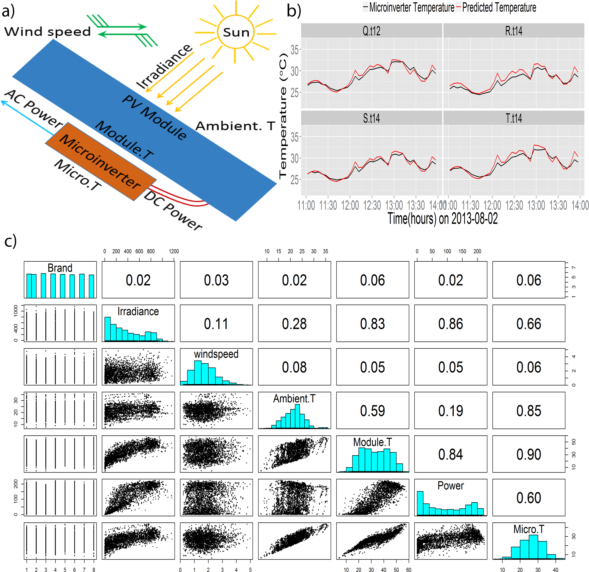

 
 \setcounter{section}{5}
 \setcounter{subsection}{2}
 \setcounter{subsubsection}{2}
 
```{r setup, include = FALSE}
knitr::opts_chunk$set(
  cache = FALSE, # if TRUE knitr will cache results to reuse in future knits
  fig.width = 6, # the width for plots created by code chunk
  fig.height = 4, # the height for plots created by code chunk
  fig.align = 'center', # how to align graphics. 'left', 'right', 'center'
  dpi = 300, 
  dev = 'png', # Makes each fig a png, and avoids plotting every data point
  # eval = FALSE, # if FALSE, then the R code chunks are not evaluated
  # results = 'asis', # knitr passes through results without reformatting
  echo = TRUE, # if FALSE knitr won't display code in chunk above it's results
  message = TRUE, # if FALSE knitr won't display messages generated by code
  strip.white = TRUE, # if FALSE knitr won't remove white spaces at beg or end of code chunk
  warning = TRUE, # if FALSE knitr won't display warning messages in the doc
  error = TRUE) # report errors
  # options(tinytex.verbose = TRUE)
```


### Pair Coding

  - Reading posted in the Class Repo
  - [What is Code Review](http://smartbear.com/all-resources/articles/what-is-code-review/)
  - [11 Best Practices for Peer Code Review](http://smartbear.com/smartbear/media/pdfs/wp-cc-11-best-practices-of-peer-code-review.pdf)
  
### Everything is a variable

And in EDA
  
  - Finding relationships among variables
    - Starting with scatterplots
  - And continuing with linear correlations
    - Is a good way to go
  
Pairs plots are a fast way to EDA for relationships

  - These may be expected, or unexpected
  - They don't necessarily mean causality


### Scatter Plot Matrices, Pair-wise Correlation "Pairs" plots

#### Using the iris dataset in R as an example 

Lets load the iris dataset, check out its background 

And then look at correlation coefficients among variables: numerically


```{r}
data(iris)
?iris
cor(iris[,1:4])

```

Tabular data doesn't communicate to us very well

##### so lets use a pairwise linear correlation plot

```{r}
pairs(iris[,1:4])

```

This is a nice example of un-biased analytics

  - We can visually see if relationships are present
  - but not necessarily what their origin or nature is

The upper right and lower left quadrants are identical

  - the diagonal is the variable names
  - I find it best to read the lower left quadrant

##### Lets make a better pairs plot

With the corrrelation coefficients and p values 

  - make r = correlation coefficients 
  - make p = p values for the correlation test
  - and lets make this into a function we can use later also.

```{r}
panel.cor <- function(x, y, digits = 2, cex.cor, ...)
{
  usr <- par("usr"); on.exit(par(usr))
  par(usr = c(0, 1, 0, 1))
  # correlation coefficient
  r <- cor(x, y)
  txt <- format(c(r, 0.123456789), digits = digits)[1]
  txt <- paste("r= ", txt, sep = "")
  text(0.5, 0.6, txt)
 
  # p-value calculation
  p <- cor.test(x, y)$p.value
  txt2 <- format(c(p, 0.123456789), digits = digits)[1]
  txt2 <- paste("p= ", txt2, sep = "")
  if (p < 0.01) txt2 <- paste("p= ", "<0.01", sep = "")
  text(0.5, 0.4, txt2)
}

pairs(iris, upper.panel = panel.cor)
```

##### even easier to do with ggplot and GGally

```{r}
library(GGally)
ggpairs(iris[,1:4])
```

Some tuning of the x-axis labels required!

#### Lets take another run at scatterplots

Lets use the mtcars dataset in R
  
  - Motor Trend Car Road Tests for 32, 1973-4 models

##### Simple Scatterplots

```{r}
attach(mtcars)
?mtcars
plot(wt, mpg, main = "Scatterplot Example", 
     xlab = "Car Weight ", ylab = "Miles Per Gallon ", pch = 19)
```

###### Add fit lines

```{r}
# Add fit lines
plot(wt, mpg, main = "Scatterplot Example", 
    xlab = "Car Weight ", ylab = "Miles Per Gallon ", pch = 19)
abline(lm(mpg~wt), col = "red") # regression line (y~x) 
lines(lowess(wt,mpg), col = "blue") # lowess line (x,y)
```

###### Try scatterplot function in the car package

```{r}
# Enhanced Scatterplot of MPG vs. Weight 
# by Number of Car Cylinders 
library(car) 
??car
scatterplot(mpg ~ wt | cyl, data = mtcars, xlab = "Weight of Car", 
            ylab = "Miles Per Gallon", main = "Enhanced Scatter Plot", 
            legend = row.names(mtcars))
```

#### Now onto pairs plots, i.e. scatterplot matrices

```{r}
# Basic Scatterplot Matrix
pairs(~mpg+disp+drat+wt,data = mtcars, 
      main = "Simple Scatterplot Matrix")
```

###### and using the car package

```{r}
# Scatterplot Matrices from the car Package
library(car)
attach(mtcars)
scatterplotMatrix(~ mpg + disp + drat + wt | cyl, data = mtcars, 
                  legend = "Three Cylinder Options")
```

###### and the gclus package

The gclus package gives pairs plots 

  - colored by magnitude of the correlation coefficient
  - very useful "signatures"

```{r}
# Scatterplot Matrices from the gclus Package 
library(gclus)
??gclus
dta <- mtcars[c(1,3,5,6)] # get data 
dta.r <- abs(cor(dta)) # get correlations
dta.col <- dmat.color(dta.r) # get colors
# reorder variables so those with highest correlation
# are closest to the diagonal
dta.o <- order.single(dta.r) 
cpairs(dta, dta.o, panel.colors = dta.col, gap = 0.5, 
       main = "Variables Ordered and Colored by Correlation" )
```

#### High Density scatterplots with Binning

##### using hexbin package

```{r}
# High Density Scatterplot with Binning
library(hexbin)
x <- rnorm(1000)
y <- rnorm(1000)
bin <- hexbin(x, y, xbins = 50) 
plot(bin, main = "Hexagonal Binning")
```

##### with sunflowerpot if the points overlap

```{r}
# High Density Scatterplot with Color Transparency 
x <- rnorm(1000)
y <- rnorm(1000) 
plot(x,y, main = "PDF Scatterplot Example", 
     col = rgb(0,100,0,50,maxColorValue = 255), pch = 16)
```


#### There is a 3D scatterplot package

```{r}
# 3D Scatterplot
library(scatterplot3d)
attach(mtcars)
scatterplot3d(wt,disp,mpg, main = "3D Scatterplot")
```

```{r}
# 3D Scatterplot with Coloring and Vertical Drop Lines
library(scatterplot3d) 
attach(mtcars) 
scatterplot3d(wt,disp,mpg, pch = 16, highlight.3d = TRUE, 
              type = "h", main = "3D Scatterplot")
```

```{r}
# 3D Scatterplot with Coloring and Vertical Lines
# and Regression Plane 
library(scatterplot3d) 
attach(mtcars) 
s3d <- scatterplot3d(wt, disp, mpg, pch = 16, highlight.3d = TRUE, 
                     type = "h", main = "3D Scatterplot")
fit <- lm(mpg ~ wt+disp) 
s3d$plane3d(fit)
```

##### 3D spinning scatterplots using rgl or Rcmdr packages

```{r}
# Spinning 3d Scatterplot
library(rgl)

plot3d(wt, disp, mpg, col = "red", size = 3)
```

### [Correlograms](https://en.wikipedia.org/wiki/Correlogram)

Many statistical tools exist for analyzing their structure, but, surprisingly, 

  - there are few techniques for exploratory visual display, 
    - and for depicting the patterns of relations among variables 
    -  in such matrices directly, 
    -  particularly when the number of variables is moderately large.

This describes a set of techniques we subsume under the name corrgram, 
based on two main schemes: 

  - (a) rendering the value of a correlation to depict its sign and magnitude. 
    - We consider some of the properties of several iconic representations, 
    -  in relation to the kind of task to be performed. 
  (b) re-ordering the variables in a correlation matrix 
    - so that “similar” variables are positioned adjacently, 
    - facilitating perception.

```{r}
# First Correlogram Example
library(corrgram)
corrgram(mtcars, order = TRUE, lower.panel = panel.shade, 
         upper.panel = panel.pie, text.panel = panel.txt, 
         main = "Car Milage Data in PC2/PC1 Order")
```

```{r}
# Second Correlogram Example
library(corrgram)
corrgram(mtcars, order = TRUE, lower.panel = panel.ellipse, 
         upper.panel = panel.pts, text.panel = panel.txt, 
         diag.panel = panel.minmax, 
   main = "Car Milage Data in PC2/PC1 Order")
```

```{r}
# Third Correlogram Example
library(corrgram)
corrgram(mtcars, order = NULL, lower.panel = panel.shade, 
         upper.panel = NULL, text.panel = panel.txt, 
         main = "Car Milage Data (unsorted)")
```

#### Psych package is very popular in our group

[From Degradation Science COSSMS review](http://dx.doi.org/10.1016/j.cossms.2014.12.008)



Fig. 9. (a) Schematic diagram of PV module and microinverter setup. 
(b) Comparison of actual microinverter temperature and fitted microinverter temperature for the
microinverters connected to four different PV module brands during noon time on a typical cloudy day. (c) Pairs plot and correlation coefficient between different environmental and application stressors. Irradiance, wind speed and ambient temperature (Ambient.T) are the environmental stressors. PV module temperature (Module.T), PV module brand(Brand), AC power (Power) and microinverter temperature (Micro.T) are application stressors.

#### As is the ggpairs function of the ggally package


```{r}
library(GGally)
library(ggplot2)
pairs(iris)
ggpairs(iris)

```

Compared to pairs() 

  - we are not just limited to scatterplots, 

And with ggpairs() 

  - we can see various plots for numeric/categorical variables.

What ggpairs provides us more than pairs()

  - Along with scatterplots 
    - correlation coefficients are also providing in the same panel.
  - Density plots for every numeric continuous variable 
    - help us to identify skewness, kurtosis and distribution information.
  - Box plots are used to represent a statistical summary 
    - for categorical and respective numeric variable.
  - Bar charts
  - Histograms
  
Additionaly you can also explore ggcorr() method of GGally 

  - which gives graphical representation of only correlation coefficients 
  - without any plots.

So we can conclude that the panel 

  - gives ample necessary insights 
  - but the process is a little bit time consuming 
    - compared to pairs() method.

Using some level of pre-examination over your dataset 

  - at the primary stage 
  - can help us identify significant variables 
    - for suitable regression models.

### An example of EDA with pipes and pairs plots

Library in the packages we will use

```{r}
library(ggplot2) # load package

? ggplot2

library(dplyr)  #load package

? dplyr
```


#### The Diamonds dataset

Do load the Diamonds dataset and do some quick EDA

```{r}
data(diamonds)  # load dataset that comes with ggplot

head(diamonds) # Return the First or Last Part of an Object
str(diamonds) # Compactly Display the Structure of an Arbitrary R Object
summary(diamonds) #  produce result summaries of the results of 
                  # various model fitting functions
```

#### Now some compact ggplot2 EDA code

Use the pipe %>% operator  

  - Which simply passes the output of the left operator 
  - As the first argument to the right operator

```{r}
diamonds %>% 
  ggplot(aes(x = carat,y = price)) +  # aes is aesthetic mapping
    geom_point(alpha = 0.5) + # each data point as a point 
    facet_grid(~cut) + # facet the scatter plot on cut, color or clarity
    stat_smooth(method = lm, formula = y ~ poly(x,2)) + # fit a 2nd order lin. model
    theme_bw()
```

With this simple visualization, 

  - We can quickly see that price increases with carat size,
    - The relationship is nonlinear, 
  - There are some outliers, 
    - And the relationship does not depend too heavily on cut. 

###### Now lets use GGally and GGpairs packages

These packages are extensions to GGplot 2

```{r}
library(GGally) # a ggplot2 extention; gallery of plot templates

? GGally  # This doesn't work for the GGally package

?? GGally # So try this
```

```{r}
diamonds %>% 
  mutate(volume = x*y*z) %>%    # in the pipe calculate the volume
  select(cut, carat, price, volume) %>% 
  sample_frac(0.5, replace = TRUE) %>% 
  ggpairs(axisLabels = "none") + 
  theme_bw() 
```


#### Citations

  1. [Scatter Plot Matrices in R](http://r-nold.blogspot.com/2014/11/scatter-plot-matrices-in-r.html)
  2. [Simple Scatterplot](http://www.statmethods.net/graphs/scatterplot.html)
  3. [Correlograms](http://www.statmethods.net/advgraphs/correlograms.html)
    + Michael Friendly [Corrgrams: Exploratory displays for correlation matrices](http://www.datavis.ca/papers/corrgram.pdf)
  4. Nice pairs plots with correlation coefficients in the upper quandrant
    + [psych: Procedures for Psychological, Psychometric, and Personality Research](http://cran.r-project.org/web/packages/psych/index.html)
    + [Using R and psych for personality and psychological research](http://personality-project.org/r/psych/)
