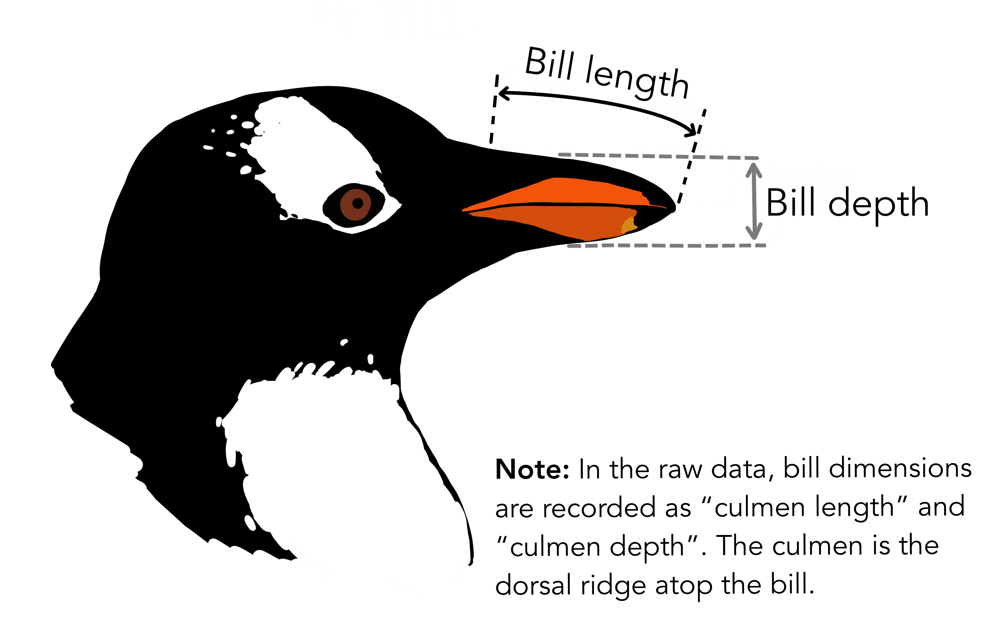

```{r setup, include = FALSE}
knitr::opts_chunk$set(
  cache = FALSE, # if TRUE knitr will cache results to reuse in future knits
  fig.width = 6, # the width for plots created by code chunk
  fig.height = 4, # the height for plots created by code chunk
  fig.align = 'center', # how to align graphics. 'left', 'right', 'center'
  dpi = 300, 
  dev = 'png', # Makes each fig a png, and avoids plotting every data point
  # eval = FALSE, # if FALSE, then the R code chunks are not evaluated
  # results = 'asis', # knitr passes through results without reformatting
  echo = TRUE, # if FALSE knitr won't display code in chunk above it's results
  message = TRUE, # if FALSE knitr won't display messages generated by code
  strip.white = TRUE, # if FALSE knitr won't remove white spaces at beg or end of code chunk
  warning = TRUE, # if FALSE knitr won't display warning messages in the doc
  error = TRUE) # report errors
  # options(tinytex.verbose = TRUE)
```

 \setcounter{section}{6}
 \setcounter{subsection}{2}
 \setcounter{subsubsection}{2}
 
 #### Class Readings, Assignments, Syllabus Topics

##### Reading, Lab Exercises, SemProjects

  - Readings: 
    - For today: OIS 6.1, 6.2
    - For next class: 
  - Laboratory Exercises: 
    - LE4 : is due Thursday October 20th 
    - LE : 
  - Office Hours: (Class Canvas Calendar for Zoom Link) 
    - Wednesday @ 4:00 PM to 5:00 PM, Will Oltjen
    - Saturday @ 3:00 PM to 4:00 PM, Kristen Hernandez 
    - **Office Hours are on Zoom, and recorded**
  - Semester Projects
    - DSCI 451 Students Biweekly Update 1 Due 
    - DSCI 451 Students 
      - Next Report Out #2 is Due Friday October 28th
    - All DSCI 351/351M/451 Students: 
      - Peer Grading of Report Out #1 is Due October 11th, 2022
    - Exams
      - Final: Monday December 19, 2022, 12:00PM - 3:00PM, Nord 356 or remote
    
##### Syllabus


#### Penguins Dataset Overview - iris alternative in R

- If there’s a dataset that’s been most used by data scientists / data analysts 

  - while they’re learning something or coaching something 
  - it’s either 
    - iris (more R users) or 
    - titanic (more Python users).

iris dataset isn’t most used 

  - just because it’s easy accessible, but it’s something 
  - that you can use to demonstrate many data science concepts 
    - like correlation, 
    - regression, 
    - classification.

Lets introduce you to the penguins dataset and 

  - get you started with a few code snippets 
    - so that you can take off yourself!

Very recently, there’s been growing sentiment in the community 

  - to [move away from iris due to Ronald Fisher’s eugenicist past](https://www.garrickadenbuie.com/blog/lets-move-on-from-iris/).

Last week, motivated by the Black Lives Matter movement 

  - and protests around the United States, 
    - [Daniela Witten](https://www.danielawitten.com/), 
    - co-author of ISLR, 
  - wrote a [long and insightful Twitter thread](https://twitter.com/daniela_witten/status/1268392721275744256) 
    - about the origins of an often-used and completely boring dataset: iris.

And now we are blessed with another iris-like dataset about penguins. 

  - Thanks to Allison Horst who packaged it 
    - as an R package palmerpenguins under CC-0 license.

#### Some background on Penguins, and some artwork

##### The dataset source

- Data were collected and made available 

  - by [Dr. Kristen Gorman](https://www.uaf.edu/cfos/people/faculty/detail/kristen-gorman.php) 
  - and the [Palmer Station, Antarctica LTER](https://pal.lternet.edu/), 
  - a member of the [Long Term Ecological Research Network](https://lternet.edu/).

The palmerpenguins package contains two datasets.

  - One is called `penguins`, 
    - and is a simplified version of the raw data
  - The second dataset is `penguins_raw`, 
    - and contains all the variables and original names as downloaded

##### Artwork

- You can download palmerpenguins art 

  - (useful for teaching with the data) in vignette("art"). 
  - If you use this artwork, 
    - please cite with: “Artwork by @allison_horst”.

##### Meet the Palmer penguins


##### Bill dimensions

- The culmen is the upper ridge of a bird’s bill. 

In the simplified penguins data, culmen length and depth are renamed as variables bill_length_mm and bill_depth_mm to be more intuitive.

For this penguin data, the culmen (bill) length and depth are measured as shown below:



##### License

- Data are available 

  - by Creative Commons [CC-0 license](https://creativecommons.org/share-your-work/public-domain/cc0/) 
    - in accordance with the [Palmer Station LTER Data Policy](http://pal.lternet.edu/data/policies) 
    - and the [LTER Data Access Policy for Type I data](https://lternet.edu/data-access-policy/).

Citation

#### Installation

- palmerpenguins is on CRAN, so you can install

  - `install.packages("palmerpenguins")`

```{r}
# install.packages("palmerpenguins")
```

#### Accessing Data

- After successful installation, 

  - you can find out that there are two datasets attached with the package 
    - penguins and 
    - penguins_raw. 
  - You can check out their help page 
    - (?penguins_raw) 
    - to understand more about respective datasets.

```{r}
library(palmerpenguins)
?penguins_raw
```

##### Loading Libraries

```{r}
library(tidyverse)
```

#### Initial EDA

##### Meta - Glimpse of penguins dataset

- penguins dataset has got the following 7 columns and 344 columns

```{r}
names(penguins)
```

Of the 7 columns, 3 are categorical (species,island,sex) and the rest are numeric.

```{r}
glimpse(penguins)
```

##### Penguins Databook: Column Definitions

- **species** 

  - a factor denoting penguin species (Adélie, Chinstrap and Gentoo)

**island** 

  - a factor denoting island in Palmer Archipelago, Antarctica (Biscoe, Dream or Torgersen)

**bill_length_mm** 

  - a number denoting bill length (millimeters)

**bill_depth_mm** 

  - a number denoting bill depth (millimeters)

**flipper_length_mm** 

  - an integer denoting flipper length (millimeters)

**body_mass_g** 

  - an integer denoting body mass (grams)

**sex** 

  - a factor denoting penguin sex (female, male)

#### Missing Values

- A good thing about penguins over iris is that, 

  - It’s got missing values NA. 
  - It’s quite an important thing to be present 
    - while using for educational purposes!

```{r}
penguins %>%
  #group_by(species) %>%
  select(everything()) %>%
  summarise_all(funs(sum(is.na(.)))) %>%
  pivot_longer(cols = 1:7,
               names_to = 'columns',
               values_to = 'NA_count') %>%
  arrange(desc(NA_count)) %>%
  ggplot(aes(y = columns, x = NA_count)) + geom_col(fill = 'darkorange') +
  geom_label(aes(label = NA_count)) +
  #   scale_fill_manual(values = c("darkorange","purple","cyan4")) +
  theme_minimal() +
  labs(title = 'Penguins - NA Count')
```

#### EDA visualisations

##### Simple Scatter Plot

- Like iris, You can simply make a scatter plot using base-R’s plot()

```{r}
plot(penguins)
```

In this Bar plot, We can visualize the count of each species in the penguins dataset

```{r}
penguins %>%
  count(species) %>%
  ggplot() + geom_col(aes(x = species, y = n, fill = species)) +
  geom_label(aes(x = species, y = n, label = n)) +
  scale_fill_manual(values = c("darkorange", "purple", "cyan4")) +
  theme_minimal() +
  labs(title = 'Penguins Species & Count')
```

In this Bar Plot, We can visualize Species distribution of each Sex (with faceted plot)

```{r}
penguins %>%
  drop_na() %>%
  count(sex, species) %>%
  ggplot() + geom_col(aes(x = species, y = n, fill = species)) +
  geom_label(aes(x = species, y = n, label = n)) +
  scale_fill_manual(values = c("darkorange", "purple", "cyan4")) +
  facet_wrap( ~ sex) +
  theme_minimal() +
  labs(title = 'Penguins Species ~ Gender')
```


##### Pair-wise Correlation Coefficient Matrix

```{r}
penguins %>%
  select_if(is.numeric) %>%
  drop_na() %>%
  cor() 
```


##### Scatter Plot - Penguins Size Relation wrt Species

- In this scatter plot, we’ll try to visualize 

  - the relationship between 
    - flipper_length_mm and body_mass_g 
    - with respect to each species.

```{r}
# library(tidyverse)
ggplot(data = penguins,
       aes(x = flipper_length_mm,
           y = body_mass_g)) +
  geom_point(aes(color = species,
                 shape = species),
             size = 3,
             alpha = 0.8) +
  #theme_minimal() +
  scale_color_manual(values = c("darkorange", "purple", "cyan4")) +
  labs(
    title = "Penguin size, Palmer Station LTER",
    subtitle = "Flipper length and body mass for Adelie, Chinstrap and Gentoo Penguins",
    x = "Flipper length (mm)",
    y = "Body mass (g)",
    color = "Penguin species",
    shape = "Penguin species"
  ) +
  theme_minimal()
```

##### Scatter Plot - Penguins Size Relation wrt Island

```{r}
# library(tidyverse)
ggplot(data = penguins,
       aes(x = flipper_length_mm,
           y = body_mass_g)) +
  geom_point(aes(color = island,
                 shape = species),
             size = 3,
             alpha = 0.8) +
  #theme_minimal() +
  scale_color_manual(values = c("darkorange", "purple", "cyan4")) +
  labs(
    title = "Penguin size, Palmer Station LTER",
    subtitle = "Flipper length and body mass for each island",
    x = "Flipper length (mm)",
    y = "Body mass (g)",
    color = "Penguin island",
    shape = "Penguin species"
  ) +
  theme_minimal()
```

##### ## Flipper length vs. bill length

```{r}
flipper_bill <- ggplot(data = penguins,
                       aes(x = flipper_length_mm,
                           y = bill_length_mm)) +
  geom_point(aes(color = species,
                 shape = species),
             size = 3,
             alpha = 0.8) +
  theme_minimal() +
  scale_color_manual(values = c("darkorange", "purple", "cyan4")) +
  labs(
    title = "Flipper and bill length",
    subtitle = "Dimensions for Adelie, Chinstrap and Gentoo Penguins at Palmer Station LTER",
    x = "Flipper length (mm)",
    y = "Bill length (mm)",
    color = "Penguin species",
    shape = "Penguin species"
  ) +
  theme(
    legend.position = c(0.85, 0.15),
    legend.background = element_rect(fill = "white", color = NA),
    plot.title.position = "plot",
    plot.caption = element_text(hjust = 0, face = "italic"),
    plot.caption.position = "plot"
  )

flipper_bill
```

##### ## Bill length vs. depth

```{r}
bill_len_dep <- ggplot(data = penguins,
                       aes(x = bill_length_mm,
                           y = bill_depth_mm,
                           group = species)) +
  geom_point(aes(color = species,
                 shape = species),
             size = 3,
             alpha = 0.8) +
  geom_smooth(method = "lm", se = FALSE, aes(color = species)) +
  theme_minimal() +
  scale_color_manual(values = c("darkorange", "purple", "cyan4")) +
  labs(
    title = "Penguin bill dimensions",
    subtitle = "Bill length and depth for Adelie, Chinstrap and Gentoo Penguins at Palmer Station LTER",
    x = "Bill length (mm)",
    y = "Bill depth (mm)",
    color = "Penguin species",
    shape = "Penguin species"
  ) +
  theme(
    legend.position = c(0.85, 0.15),
    legend.background = element_rect(fill = "white", color = NA),
    plot.title.position = "plot",
    plot.caption = element_text(hjust = 0, face = "italic"),
    plot.caption.position = "plot"
  )

bill_len_dep
```

##### Some other graphs for EDA exploring and  brainstorming

```{r}
flipper_hist <- ggplot(data = penguins, aes(x = flipper_length_mm)) +
  geom_histogram(aes(fill = species),
                 alpha = 0.5,
                 position = "identity") +
  scale_fill_manual(values = c("darkorange", "purple", "cyan4")) +
  theme_minimal() +
  labs(x = "Flipper length (mm)",
       y = "Frequency",
       title = "Penguin flipper lengths")

flipper_hist
```

Flipper lengths boxplots + jitter: 

```{r}
flipper_box <-
  ggplot(data = penguins, aes(x = species, y = flipper_length_mm)) +
  geom_boxplot(aes(color = species), width = 0.3, show.legend = FALSE) +
  geom_jitter(
    aes(color = species),
    alpha = 0.5,
    show.legend = FALSE,
    position = position_jitter(width = 0.2, seed = 0)
  ) +
  scale_color_manual(values = c("darkorange", "purple", "cyan4")) +
  theme_minimal() +
  labs(x = "Species",
       y = "Flipper length (mm)")

flipper_box
```

Body mass histograms: 

```{r}
mass_hist <- ggplot(data = penguins, aes(x = body_mass_g)) +
  geom_histogram(aes(fill = species),
                 alpha = 0.5,
                 position = "identity") +
  scale_fill_manual(values = c("darkorange", "purple", "cyan4")) +
  theme_minimal() +
  labs(x = "Body mass (g)",
       y = "Frequency",
       title = "Penguin body mass")

mass_hist
```

##### Facets

- Include penguin sex: 

```{r}
ggplot(penguins, aes(x = flipper_length_mm,
                     y = body_mass_g)) +
  geom_point(aes(color = sex)) +
  theme_minimal() +
  scale_color_manual(values = c("darkorange", "cyan4"),
                     na.translate = FALSE) +
  labs(
    title = "Penguin flipper and body mass",
    subtitle = "Dimensions for male and female Adelie, Chinstrap and Gentoo Penguins at Palmer Station LTER",
    x = "Flipper length (mm)",
    y = "Body mass (g)",
    color = "Penguin sex"
  ) +
  theme(
    legend.position = "bottom",
    legend.background = element_rect(fill = "white", color = NA),
    plot.title.position = "plot",
    plot.caption = element_text(hjust = 0, face = "italic"),
    plot.caption.position = "plot"
  ) +
  facet_wrap( ~ species)

```


#### Links

- AbdulMajedRaja RS, Jun 2020

  - [https://www.programmingwithr.com/penguins-dataset-overview-iris-alternative-in-r/](https://www.programmingwithr.com/penguins-dataset-overview-iris-alternative-in-r/)

Palmer Penguin dataset, by [Alison Horst](https://allisonhorst.github.io/)

  - [palmerpenguin - on CRAN](https://cran.r-project.org/web/packages/palmerpenguins/index.html)
  - [palmerpenguin - Github](https://github.com/allisonhorst/palmerpenguins/)
  - [palmerpenguin - Documentation](https://allisonhorst.github.io/palmerpenguins/)

#### How to get the citation for any R package

  - Use the `citation` command
  
```{r}
citation('palmerpenguins')
```


