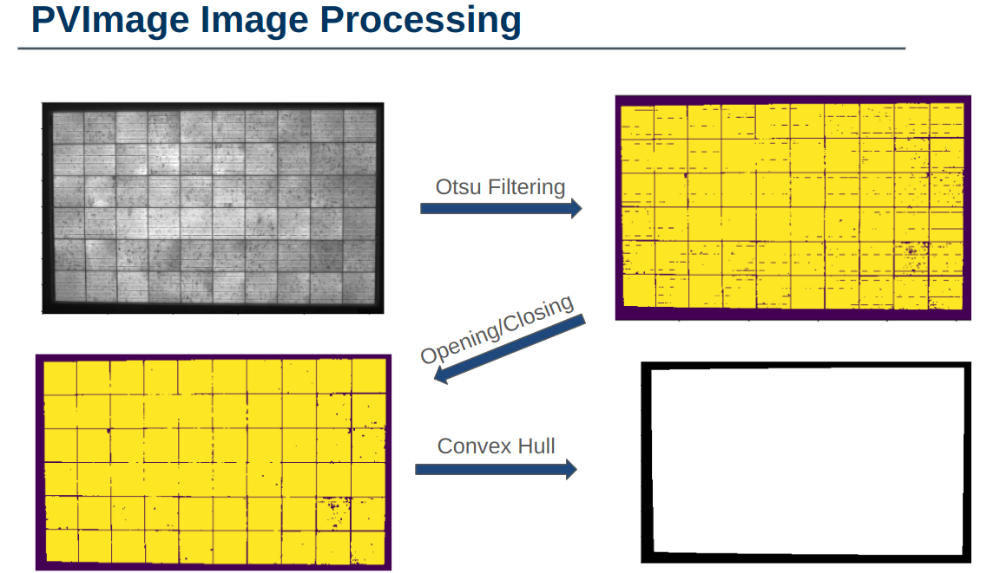
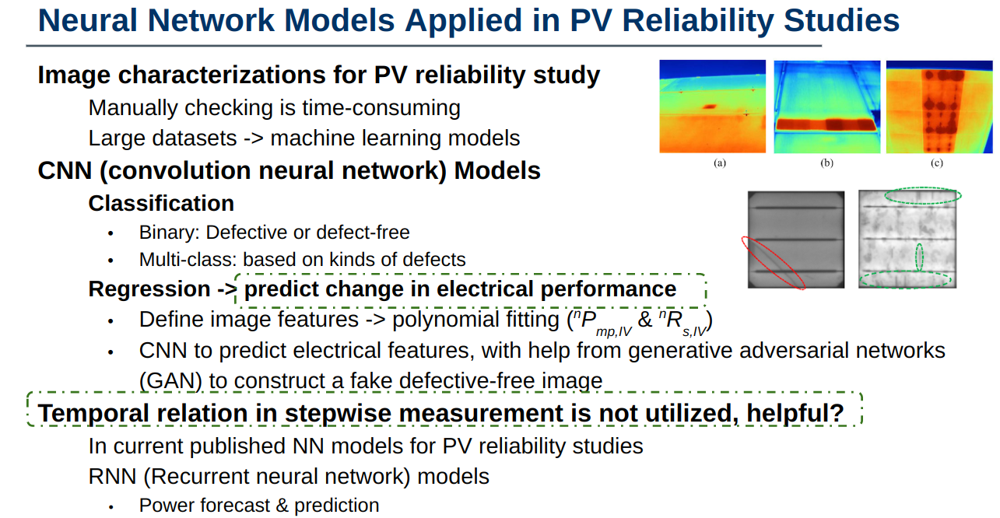

```{r setup, include = FALSE}
knitr::opts_chunk$set(
  cache = FALSE, # if TRUE knitr will cache results to reuse in future knits
  fig.width = 6, # the width for plots created by code chunk
  fig.height = 4, # the height for plots created by code chunk
  fig.align = 'center', # how to align graphics. 'left', 'right', 'center'
  dpi = 300, 
  dev = 'png', # Makes each fig a png, and avoids plotting every data point
  # eval = FALSE, # if FALSE, then the R code chunks are not evaluated
  # results = 'asis', # knitr passes through results without reformatting
  echo = TRUE, # if FALSE knitr won't display code in chunk above it's results
  message = TRUE, # if FALSE knitr won't display messages generated by code
  strip.white = TRUE, # if FALSE knitr won't remove white spaces at beg or end of code chunk
  warning = TRUE, # if FALSE knitr won't display warning messages in the doc
  error = TRUE) # report errors
  # options(tinytex.verbose = TRUE)
```

 \setcounter{section}{1}
 \setcounter{subsection}{1}
 \setcounter{subsubsection}{1}

#### Class Readings, Assignments, Syllabus Topics

##### Reading, Lab Exercises, SemProjects

  - Readings: 
    - For today: None
    - For next class: R4DS17-21
  - Laboratory Exercises: 
    - LE4 due tonight!
    - LE5 due 11/10
  - Office Hours: (Class Canvas Calendar for Zoom Link) 
    - Wednesday @ 4:00 PM to 5:00 PM, Will Oltjen
    - Saturday @ 3:00 PM to 4:00 PM, Kristen Hernandez 
    - **Office Hours are on Zoom, and recorded**
  - Semester Projects
    - DSCI 451 Students Biweekly Update 1 Due 
    - DSCI 451 Students 
      - Next **Update 4 is due Friday**
  - Exams
      - Final: Monday December 19, 2022, 12:00PM - 3:00PM, Nord 356 or remote

#### Textbooks

  - [Peng: R Programming for Data Science](https://leanpub.com/rprogramming)
  - [Peng: Exploratory Data Analysis with R](https://leanpub.com/exdata)
  - [Open Intro Stats, v4](https://openintro.org/os)
  - [Wickham: R for Data Science](https://r4ds.had.co.nz/)
  - [Hastie: Intro to Statistical Learning with R, 2nd Ed.](https://www.statlearning.com/)

Introduction to R and Data Science

  - For R, Coding, Inferential Statistics
    - Peng: R Programming for Data Science
    - Peng: Exploratory Data Analysis with R
  
Textbooks for this class

  - OIS = Diez, Barr, Çetinkaya-Runde: Open Intro Stat v4
  - R4DS = Wickham, Grolemund: R for Data Science
  
Textbooks for DSCI353/353M/453, And in your Repo now

  - ISLR2 = James, Witten, Hastie, Tibshirani: Intro to Statistical Learning with R 2nd Ed.
  - ESL = Trevor Hastie, Tibshirani, Friedman: Elements of Statistical Learning
  - DLwR = Chollet, Allaire: Deep Learning with R

Magazine Articles about Deep Learning

  - DL1 to DL13 are "Deep Learning" articles in 3-readings/2-articles/


#### Syllabus


#### For the DSCI 451 students they have an EDA SemProj to do

  - SemProjects:
    - SemProjects have a bi-weekly progress update 
      - due Friday's at 11:59 pm (6 updates)
    - Each update should be made in the report template 
      - found in the Repo with each update filled out
    - SemProj Report Out #1 Class W5, (recorded 10 min presentation)
      - Peer Grading by All DSCI 351/351m/451 students due a week later
    - SemProj Report Out #2 in Class W9 (recorded 10 min presentation)
      - Peer Grading by All DSCI 351/351m/451 students due a week later
    - SemProj Report Out #3 in Class W13 (recorded 10 min presentation)
      - Peer Grading by All DSCI 351/351m/451 students due a week later
    - SemProj Report is full comprehensive written project 
      - (report template updated from each report)
      - **due Friday 12-11-2021**
  - Assistance on SemProjects is done with DSCI352-352m-452 Class
    - SemProj's are taught by Prof. Laura Bruckman
    - SemProject office hours 9-10 am on Tuesdays

##### Care should be taken when choosing SemProj datasets.

  - Report Out 1 focuses on
    - Explaining the 'why' of your research project
    - Describing your dataset
    - Presenting an analysis plan
    - Cleaning your data
  - Report Out 2 focuses on:
    - EDA of your data
    - Visualizing your data
    - Further cleaning of your data
    - Reevaluation of your data analysis plan (Do you need more data?)
  - Report Out 3:
    - More data visualization
    - Initial modeling
    - Conclusions about your data
    - Were you able to answer your why question? 
    - What else would you need to do to get to understanding your data better?

#### Tidyverse Cheatsheets, Functions and Reading Your Code

- Look at the Tidyverse Cheatsheet 

  - **Tidyverse For Beginners Cheatsheet**
    - In the Git/20s-dsci353-353m-453-prof/3-readings/3-CheatSheets/ folder
  - **Data Wrangling with dplyr and tidyr Cheatsheet**
  
  Tidyverse Functions & Conventions
  
    - The pipe operator `%>%`
    - Use `dplyr::filter()` to subset data row-wise.
    - Use `dplyr::arrange()`  to sort the observations in a data frame
    - Use `dplyr::mutate()` to update or create new columns of a data frame
    - Use `dplyr::summarize()` to turn many observations into a single data point
    - Use `dplyr::arrange()` to change the ordering of the rows of a data frame 
    - Use `dplyr::select()` to choose variables from a tibble, 
      - keeps only variables you mention
    - Use `dplyr::rename()` keeps all the variables and renames variables
      - rename(iris, petal_length = Petal.Length)
    - These can be combined using `dplyr::group_by()` 
      - which lets you perform operations “by group”. 
    - The `%in%` matches conditions provided by a vector using the c() function
    - The **forcats** package has tidyverse functions 
      - for factors (categorical variables)
    - The **readr** package has tidyverse functions 
      - to read_..., melt_... col_..., parse_... data and objects

Reading Your Code: Whenever you see

  - The assignment operator `<-`, think **"gets"**
  - The pipe operator, `%>%`, think **"then"**

#### Topic

##### Python Packages in R

# Python in RMarkdown/RStudio

In the debate between Python and R, there moments where either side will excel. 
  - In these cases, it can be fruitful 
    - to use Python code snippets in R scripts or vice versa.

In this .Rmd, we will demonstrate how Python can be used in R.
  - and how to publish a Python package

## Reticulate Package

"The reticulate package provides a comprehensive set of tools 
  - for interoperability between Python and R."<sup> 1</sup>

Core functions include:

- Calling Python from R in a variety of ways: 
  - R Markdown
  - sourcing Python scripts
  - importing Python modules
  - using Python interactively within an R session.<sup> 1</sup>

- Translation between R and Python objects 
  - (for example, between R and Pandas data frames, or between R matrices and NumPy arrays.<sup> 1</sup>


```{r import_libraries}
# import reticulate
library(reticulate)

# set console messages off
options(reticulate.repl.quiet = TRUE)
```

In most environments this will be enough to start using Python. 

In our ODS Desktops, we need to set the Python path explicitly 
  - by editing the R profile. 
  
Run the command below and add the following to the file: 
  - RETICULATE_PYTHON="C:/Python/Python-3.10.4/Scripts/python.exe"

```{r update_python_path}
# edit the r profile file
usethis::edit_r_profile()
```

## Reticulate Basics

Once reticulate is imported, it is as easy at setting the chunk to use python with {python}.

```{python set_python_var}
# set value of a
a = "Hello" + " World"
print(a)
```
Note: the variables created in your Python environment will not be contained in your R environment.

```{r check_python_var}
# check if a exists
exists('a')
```
To get around this, we can pass the variable from one environment to another.

```{r call_python_var}
# return value of a by calling py environment
py$a
```
Likewise with R:

```{r set_r_var}
# set value of b
b <- 5
```

```{python call_r_var}
# return value of b by calling R env
r.b
```
## Reticulate Libraries

Basic variable manipulation is not the only Python feature available. 

More advanced Python can be leveraged with the ability to import Python libraries.

```{python os_python}
# import os library
import os

# get current working directory
os.getcwd()
```
Reticulate can also be used outside of .Rmd files where you can specify the cell language. 

It can be run in R scripts as well. 

Here is a sample of how a Python library would be called and used in an R script

```{r os_r}
# import os library
os <- import("os")

# get current working directory
os$getcwd()
```
These libraries can be leveraged to do classic Python manipulations.

```{r numpy}
# import numpy (specify no automatic Python to R conversion)
np <- import("numpy", convert = FALSE)

# create numpy array of 1-4
a <- np$array(c(1:4))

# apply cumulative sum to array
sum <- a$cumsum()

# convert object to R
py_to_r(sum)
```
## Reticulate Functions

One can design and run a function in Python as well.

```{r custom_function}
pyFunction <- "def print_message():
                print('Hello world!')"

py_run_string(pyFunction)

py$print_message()
```

One can even write a Python script into a .py file then run the script using reticulate

```{r python_script}
py_run_file("2208-mds-rely-bootcamp-reticulate-script.py")
```
```{r visualize results}
library(ggplot2)

df <- read.csv('./data/model_results.csv')

step_range <- 1:nrow(df)
percent_range <- (0:10) / 10

df$X <- step_range

colors <- c("training" = "red", "validation" = "blue")

ggplot(df, aes(x=X)) + 
  geom_line(aes(y = accuracy), color = "red") + 
  geom_line(aes(y = val_accuracy), color="blue", linetype="twodash") +
  labs(color = "Legend") +
  scale_color_manual(values = colors)

ggplot(df, aes(x=X)) + 
  geom_line(aes(y = loss), color="red") +
  geom_line(aes(y = val_loss), color="blue", linetype="twodash") +
  labs(color = "Legend") +
  scale_color_manual(values = colors)
```


### Python Packages

Now that we know how Python and R can work together
  - we can discuss how to make Python packages
  

We have a number of published Python packages in our lab
  - one of which is PVimage
  
PVimage <https://pypi.org/project/pvimage/>
  - is a package designed for the analysis of images in solar 
  - we can do automated segmentation of images
    - data cleaning!
  - then automated analysis of those segmented images
  


Within the package, we've designed pipelines:

<https://pvimage-doc.readthedocs.io/en/latest/pipelines.html>

  - with a number of functions that are called by each pipeline
    - so that the code is streamlined for users 
    - each function is used together in a string
    
We have documentation published online

  - to explain how to use our package
  - with examples written out in code
  
We publish our code and documentation to Pypi

  - The Python package index
  - So that anyone can find and use our packages
  

In order to publish a Python package

  - You need to use the pip package
    - Python package installer
    
Python packages are published much like R ones

  - except it is much easier to get Python packages published
  - since CRAN is much more specific about standards
    - this is good for R
      - Python has had issues with malware installed in packages due to poor standards
      
To publish a Python package

  - You need to make a setup.py file in your main package directory
  - Fill it with
    - Licence
    - Title
    - Version
    - Author
    - Dependencies
    - Github URL
    
  - And you should be good to go!
  
Here's a decent guide for how to do this <https://towardsdatascience.com/how-to-upload-your-python-package-to-pypi-de1b363a1b3>

## Acknowledgements

<sup> 1</sup> R Interface to Python. Interface to Python • reticulate. (n.d.). Retrieved April 12, 2022, from https://rstudio.github.io/reticulate/ 


#### Links


<!-- 
 How to make comments inside Rmarkdown
# Script Name: My class notes template for Fall 2020
# Purpose: This is a template Rmd file to start a new class from
# Authors: Roger H. French
# License: Creative Commons Attribution-ShareAlike 4.0 International License.
##########
# Latest Changelog Entires:
# v0.00.01 - Filename.Rmd - Roger French started this blank Rmd script
-->

<!-- Or on a single line like this -->
 
