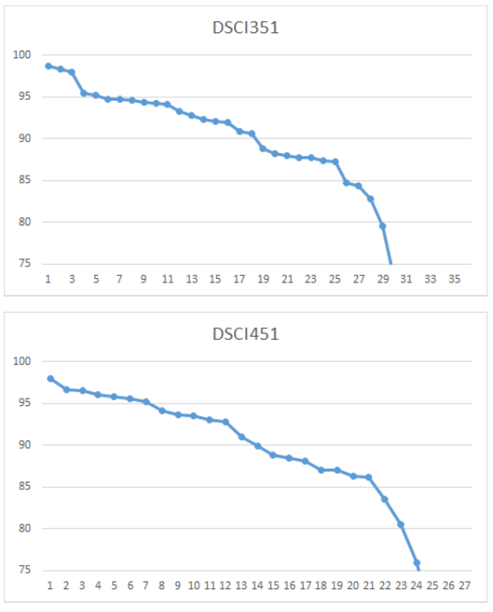

```{r setup, include = FALSE}
knitr::opts_chunk$set(
  cache = FALSE, # if TRUE knitr will cache results to reuse in future knits
  fig.width = 5, # the width for plots created by code chunk
  fig.height = 3, # the height for plots created by code chunk
  fig.align = 'center', # how to align graphics. 'left', 'right', 'center'
  dpi = 300, 
  dev = 'png', # Makes each fig a png, and avoids plotting every data point
  # eval = FALSE, # if FALSE, then the R code chunks are not evaluated
  # results = 'asis', # knitr passes through results without reformatting
  echo = TRUE, # if FALSE knitr won't display code in chunk above it's results
  message = TRUE, # if FALSE knitr won't display messages generated by code
  strip.white = TRUE, # if FALSE knitr won't remove white spaces at beg or end of code chunk
  warning = FALSE, # if FALSE knitr won't display warning messages in the doc
  error = TRUE) # report errors
  # options(tinytex.verbose = TRUE)
```

 \setcounter{section}{9}
 \setcounter{subsection}{2}
 \setcounter{subsubsection}{1}

## Class Readings, Assignments, Syllabus Topics

### Reading, Lab Exercises, SemProjects

  - Readings: 
    - For today: R4DS17-21, OIS6.3-6.4
    - For next class: OIS6.3-6.4
  - Laboratory Exercises: 
    - LE4 : has been turned in   
    - LE5 : Given out today. 
    - LE5 Due Thursday November 10th
  - Office Hours: (Class Canvas Calendar for Zoom Link) 
    - Wednesday @ 4:00 PM to 5:00 PM, Will Oltjen
    - Saturday @ 3:00 PM to 4:00 PM, Kristen Hernandez 
    - **Office Hours are on Zoom, and recorded**
  - Semester Projects
    - DSCI 451 Students Biweekly Update 1 Due 
    - DSCI 451 Students 
      - Next **Report Out #1 is Due Friday September 30th**
    - All DSCI 351/351M/451 Students: 
      - **Peer Grading of Report Out #1 is Due October 11th, 2022**
    - Exams
      - Final: Monday December 19, 2022, 12:00PM - 3:00PM, Nord 356 or remote

### Textbooks

  - [Peng: R Programming for Data Science](https://leanpub.com/rprogramming)
  - [Peng: Exploratory Data Analysis with R](https://leanpub.com/exdata)
  - [Open Intro Stats, v4](https://openintro.org/os)
  - [Wickham: R for Data Science](https://r4ds.had.co.nz/)
  - [Hastie: Intro to Statistical Learning with R, 2nd Ed.](https://www.statlearning.com/)

Introduction to R and Data Science

  - For R, Coding, Inferential Statistics
    - Peng: R Programming for Data Science
    - Peng: Exploratory Data Analysis with R
  
Textbooks for this class

  - OIS = Diez, Barr, Çetinkaya-Runde: Open Intro Stat v4
  - R4DS = Wickham, Grolemund: R for Data Science
  
Textbooks for DSCI353/353M/453, And in your Repo now

  - ISLR = James, Witten, Hastie, Tibshirani: Intro to Statistical Learning with R 2nd Ed.
  - ESL = Trevor Hastie, Tibshirani, Friedman: Elements of Statistical Learning
  - DLwR = Chollet, Allaire: Deep Learning with R

Magazine Articles about Deep Learning

  - DL1 to DL12 are "Deep Learning" articles in 3-readings/2-articles/


### Syllabus


### For the DSCI 451 students they have an EDA SemProj to do

- Some students didn't submit their Report out *.mp4 zoom file

  - So we'll circulate these as just pdfs for peer grading
    - an extra point for feedback on these


## Results and Observations from Midterm

  - Make sure you are loading the packages you are using!
    - Sometimes packages can run in your console
    - But don't run when you knit your PDF
    - And eventually, you don't see outputs.
  - The `library(tidyverse)` command
    - Is part of your code
    - It has to be in your .Rmd or .R file
      
  - CHECK YOUR SUBMISSIONS
    - We are not responsible for chasing down
      - Incorrect submissions
      - Late work
      - Un-uploaded PDFs
          
  - Explain your answers in detail
    - 'Yes' or 'No' will not receive full points
    - Comment your code
      - We can give more CREDIT IF you properly explain your thought process
      - As opposed to just showing the code
          
  - ?? and ? can be used to access the help documentation
    - This information can be useful in determining 
    - What function is from each package

### The Curve: DSCI is graded on a curve

- Results
  
DSCI 351/451

  - A > 93
  - B > 84
  - C > 75
  - D > 65

### MidTerm Grades

- The midterm grades
  
  - Use all the graded submissions of each student
    - If an assignment or activity
      - has not been graded
      - has not been submitted
    - It wasn't counted
      - So these grades didn't have "assumed zero points"
      


### General Observations and Common Mistakes
          
- ALL SUBMISSIONS should be DOUBLE CHECKED for proper submission quality
  
  - We cannot give points if we don't see reasonable outputs
  - This is applicable for LEs and exams
  - It is the responsibility of the student 
    - to verify that they are submitting the correct file
          
  - Explain your answers in detail
    - 'Yes' or 'No' will not receive full points
    - Comment your code
      - We can give more CREDIT IF you properly explain your thought process
      - As opposed to just showing the code
          
  - Some questions can be answered by knowing how certain functions work
    - `?function-name` and `??function-name` can be used 
      - to access the help documentation
    - This information can be useful 
      - in determining which function is from a certain package
      
  - Some students have spent a lot of time on some questions
    - And couldn't work on the remaining ones
    - Don't spend too much time on one question
    - Time management is always important!


### Comments on Grading Philosophy for the Midterm

  - Deductions where made for 
    - improper solutions 
    - and missing information. 
  
  - Failure to library in the appropriate packages 
    - resulted in a point deduction, 
    - with a maximum deduction of 0.5.
  - Additional points were deducted 
    - for not obtaining the output.
      
  - Solutions that 
    - did not library the appropriate packages 
    - and were incorrect received no credit. 
  
  - Partial credit was assigned as needed, 
    - especially when a solution was properly documented with comments. 

## Links


<!-- 
 How to make comments inside Rmarkdown
# Script Name: My class notes template for Fall 2020
# Purpose: This is a template Rmd file to start a new class from
# Authors: Roger H. French
# License: Creative Commons Attribution-ShareAlike 4.0 International License.
##########
# Latest Changelog Entires:
# v0.00.01 - Filename.Rmd - Roger French started this blank Rmd script
-->

<!-- Or on a single line like this -->
 
