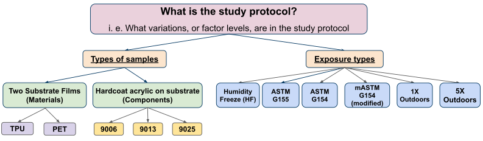
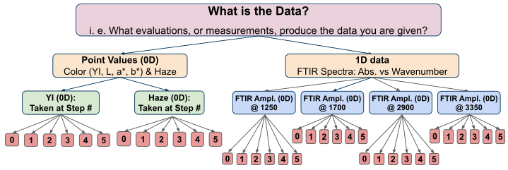

```{r setup, include = FALSE}
knitr::opts_chunk$set(
  cache = FALSE, # if TRUE knitr will cache results to reuse in future knits
  fig.width = 6, # the width for plots created by code chunk
  fig.height = 4, # the height for plots created by code chunk
  fig.align = 'center', # how to align graphics. 'left', 'right', 'center'
  dpi = 300, 
  dev = 'png', # Makes each fig a png, and avoids plotting every data point
  # eval = FALSE, # if FALSE, then the R code chunks are not evaluated
  # results = 'asis', # knitr passes through results without reformatting
  echo = TRUE, # if FALSE knitr won't display code in chunk above it's results
  message = TRUE, # if FALSE knitr won't display messages generated by code
  strip.white = TRUE, # if FALSE knitr won't remove white spaces at beg or end of code chunk
  warning = TRUE, # if FALSE knitr won't display warning messages in the doc
  error = TRUE) # report errors
  # options(tinytex.verbose = TRUE)
```

 \setcounter{section}{10}
 \setcounter{subsection}{1}
 \setcounter{subsubsection}{2}


#### The Study Protocol and Structure of the Data for Hardcoat Acyrlics

- In LE3-6, LE4-5 and LE5-6 students were asked to perform Exploratory Data Analysis 

  - on a "real" set of data
    - From a study of hardcoat acrylics
  - from a real world study
    - with its own questions, data taken and datafiles

The assignment was designed to 

  - lead you through a proper data analysis 
    - as if you were approaching the problem as a data scientist. 
    
Often times, data scientists will be given data 

  - that they have little to no understanding of. 
  
Therefore, it is not always the responsibility of the data scientist 

  - to completely understand the MEANING of the data that they work with, 
  - but rather to understand the STRUCTURE and DATA TYPES 
    - they are working with 
    - and what TECHNIQUES are appropriate for each DATA TYPE. 

##### Structure of a Study: The Study Protocol

The goal of this assignment was for students 

  - to design and structure 
    - their own data science analysis.
  - And assemble the supplied data into a Tidy dataframe
    - And do some EDA on their dataset

This process involved understanding:

- The Study Protocol: Parametric Variations of Observations
    - The variables you are studying
    - Predictors
    

    
- Data Manipulation 
    - Arranging the Data for a "tidy" analysis

- Dimensionality of the Data
    - Point Values are 0D
      - Point values through time are 0.5D
    - Spectra, or X vs. Y data are 1D 
      -  And if they change through time they are  1.5D
    - Images or Photos are 2D
      - Movies are Images through time so they are 2.5D
    - Volumetric Data is 3D
      - Volumetric Data through time is 3.5D
    

    
- Levels of Data 
    - Categories of Samples

### Links


