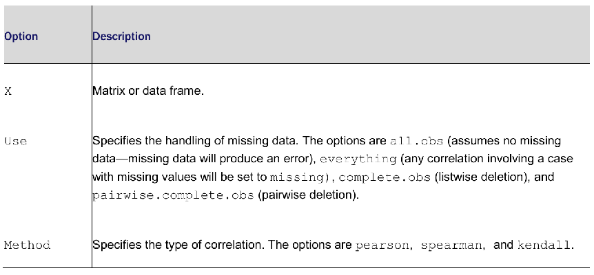

```{r setup, include = FALSE}
knitr::opts_chunk$set(
  cache = FALSE, # if TRUE knitr will cache results to reuse in future knits
  fig.width = 6, # the width for plots created by code chunk
  fig.height = 4, # the height for plots created by code chunk
  fig.align = 'center', # how to align graphics. 'left', 'right', 'center'
  dpi = 300, 
  dev = 'png', # Makes each fig a png, and avoids plotting every data point
  # eval = FALSE, # if FALSE, then the R code chunks are not evaluated
  # results = 'asis', # knitr passes through results without reformatting
  echo = TRUE, # if FALSE knitr won't display code in chunk above it's results
  message = TRUE, # if FALSE knitr won't display messages generated by code
  strip.white = TRUE, # if FALSE knitr won't remove white spaces at beg or end of code chunk
  warning = TRUE, # if FALSE knitr won't display warning messages in the doc
  error = TRUE) # report errors
  # options(tinytex.verbose = TRUE)
```

 \setcounter{section}{10}
 \setcounter{subsection}{2}
 \setcounter{subsubsection}{2}

#### Class Readings, Assignments, Syllabus Topics

##### Reading, Lab Exercises, SemProjects

  - Readings: 
    - For today: 
    - For next class: OIS 8
  - Laboratory Exercises: 
    - LE 5: is due Thursday November 10th 
    - LE 6: Will be posted Thursday November 10th
  - Office Hours: (Class Canvas Calendar for Zoom Link) 
    - Wednesday @ 4:00 PM to 5:00 PM, Will Oltjen
    - Saturday @ 3:00 PM to 4:00 PM, Kristen Hernandez 
    - **Office Hours are on Zoom, and recorded**
  - Semester Projects
    - DSCI 451 Students Biweekly Update #5 Due Friday Nov. 4th
    - DSCI 451 Students 
      - Next **Update #5 is Due Friday November 4th  **
    - All DSCI 351/351M/451 Students: 
      -  **Peer Grading of Report Out #2 is Due November 8th **
    - Exams
      - Final: Monday December 19, 2022, 12:00PM - 3:00PM, Nord 356 or remote
    
##### Textbooks

- Introduction to R and Data Science

  - For R, Coding, Inferential Statistics
    - Peng: R Programming for Data Science
    - Peng: Exploratory Data Analysis with R
  
Textbooks for this class

  - OIS = Diez, Barr, Çetinkaya-Runde: Open Intro Stat v4
  - R4DS = Wickham, Grolemund: R for Data Science
  
Textbooks for DSCI353/353M/453, And in your Repo now

  - ISLR = James, Witten, Hastie, Tibshirani: Intro to Statistical Learning with R
  - ESL = Trevor Hastie, Tibshirani, Friedman: Elements of Statistical Learning
  - DLwR = Chollet, Allaire: Deep Learning with R


##### Syllabus


#### CrossTab/Contingency Tables and T-tests 

- What are [Contingency Tables](https://en.wikipedia.org/wiki/Contingency_table)

  - a contingency table 
    - (also known as a cross tabulation or crosstab) 
  - is a type of table in a matrix format 
    - that displays the (multivariate) frequency distribution of the variables. 
    
They are heavily used in 

  - survey research, 
  - business intelligence, 
  - engineering, and scientific research. 
  
They provide a basic picture of 

  - the interrelation between two variables 
    - and can help find interactions between them. 

##### Frequency and Contingency Tables 

- Lets look at frequency and contingency tables 

  - from categorical variables, 
  - along with 
    - tests of independence, 
    - measures of association, and 
    - methods for graphically displaying results. 
    
We’ll be using functions in base R, 

  - along with functions from 
    - the `vcd` package
    - and the `gmodels` package
    
In the following examples, 

  - assume that A, B, and C 
  - represent categorical variables.

##### Frequency tables 

- The data for this section come from the Arthritis dataset 

  - included with the `vcd` package.

The data are from Kock & Edward (1988) 

  - and represent a double-blind clinical trial 
  - of new treatments for rheumatoid arthritis. 


```{r}
library(vcd)
head(Arthritis)

str(Arthritis)
```

Above are the first few observations:

  - Treatment (Placebo, Treated), 
  - Sex (Male, Female), and 
  - Improved (None, Some, Marked) 
    - are all categorical factors. 
    
Next we'll create 

  - frequency tables and 
  - contingency tables (cross-classifications) 
    - from the data.

We'll begin with simple frequencies, 

  - followed by two-way contingency tables, 
  - and end with multiway contingency tables. 

###### One way contigency table 

- The first step is to create a table 

  - using either the `table()` 
  - or `xtabs()` function 
    - and then manipulate it using the other functions.

You can generate simple frequency counts using the `table()` function. 

You can turn these frequencies into proportions with `prop.table()`

  - or into percentages using `prop.table()*100`:


```{r}
mytable <- table(Arthritis$Improved)
mytable                       # counts
prop.table(mytable)           # proportions
prop.table(mytable) * 100       # percents
```

###### Two way contingency table 

- For two-way tables, 

  - the format for the `table()` function is
    - `mytable <- table(A, B)`
  - where A is the row variable and 
  - B is the column variable. 

Alternatively, 

  - the `xtabs()` function allows you to create 
    - a contingency table 
    - using formula-style input. 

```{r}
mytable <- xtabs(~ Treatment + Improved, data = Arthritis)
mytable  # counts

margin.table(mytable, 1)    # total counts for Treatment
```

```{r}
prop.table(mytable, 1)      # row proportions (rows add to 1)
```

```{r}

margin.table(mytable, 2)    # total counts for Improved
```

```{r}
prop.table(mytable, 2)      # column proportions (columns add to 1)
```

```{r}
prop.table(mytable)         # cell proportions (all cells add to 1)
```

```{r}
addmargins(mytable)         # cell counts with row and column sums
```

```{r}
addmargins(prop.table(mytable)) # cell proportions with row and column proportions
```

```{r}
addmargins(prop.table(mytable, 1), 2) # row proportions with row sums
```

```{r}
addmargins(prop.table(mytable, 2), 1) # column proportions with column sums
```

###### Two-way table using `gmodels::CrossTable`

```{r}
library(gmodels)
CrossTable(Arthritis$Treatment, Arthritis$Improved)
```

###### Three-way contingency table 

- Both `table()` and `xtabs()` 

  - can be used to generate multidimensional tables 
    - based on three or more categorical variables. 
  - The `margin.table()`, `prop.table()`, and `addmargins()` functions
    - extend naturally to more than two dimensions. 
    
Additionally, the `ftable()` function 

  - can be used to print multidimensional tables 
  - in a compact and attractive manner. 
  
Here is an example.

```{r}
mytable <- xtabs( ~ Treatment + Sex + Improved, data = Arthritis) # 1. Cell Frequencies
mytable
margin.table(mytable, 1)  # totals for Treatment, 2. Marginal Frequencies
```

```{r}
margin.table(mytable, 2)  # totals for Sex
```

```{r}
margin.table(mytable, 3)  # totals for Improved
```

```{r}
margin.table(mytable, c(1, 3)) # totals for Treatment by Improved 
                               # 3.  Treatment × Improved marginal frequencies

```

```{r}
 ftable(prop.table(mytable, c(1, 2))) # 4.  Improved proportions for Treatment × Sex

```

```{r}
ftable(addmargins(prop.table(mytable, c(1,  2)), 3))

```

In the code above 

  - The code at #1 produces cell frequencies for the three-way classification. 
    - The code also demonstrates how the `ftable()` function can be used 
    - to print a more compact and attractive version of the table.
  - The code at #2 produces the marginal frequencies 
    - for Treatment, Sex, and Improved.
  - Because you created the table with 
    - the formula ~Treatment+Sex + Improved, 
  - Treatment is referred to by index 1, 
    - Sex is referred to by index 2, 
    - and Improved is referred to by index 3.
  - The code at #3 produces the marginal frequencies 
    - for the Treatment x Improved classification, 
    - summed over Sex. 
  - The proportion of patients with None, Some, and Marked improvement 
    - for each Treatment × Sex combination 
    - is provided in #4. 
  - Here you see that 36% of treated males had marked improvement, 
    - compared to 59% of treated females. 
  - In general, the proportions will add to 1 
    - over the indices not included in the prop.table() call 
    - (the third index, or Improved in this case). 
  - You can see this in the last example, 
      - where you add a sum margin over the third index.


Contingency tables tell you 

  - the frequency or proportions of cases 
    - for each combination of the variables that make up the table, 
  - but you’re probably also interested in whether the variables in the table 
    - are related or independent. 

Tests of independence are covered next.


##### Tests of Independence 

- R provides several methods of testing the independence 

  - of categorical variables. 
  
The three tests described in here are 

  - the $\chi^2$ (chi-square) test of independence, 
  - the Fisher exact test,
  - and the Cochran-Mantel–Haenszel test.

###### Treatment by Sex for each Level of Improved 

- We'll use this as our example

```{r}
ftable(mytable)
ftable(prop.table(mytable, c(1, 2))) # proportions sum to 1 over index omitted
```

```{r}
ftable(addmargins(prop.table(mytable, c(1, 2)), 3))
```

```{r}
ftable(addmargins(prop.table(mytable, c(1, 2)), 3)) * 100
```

###### $\chi^2$ (Chi-square) test of independence 

- You can apply the function `chisq.test()` 

  - to a two-way table in order to produce a chi-square test of independence
  - of the row and column variables. 

```{r}
library(vcd)
mytable <- xtabs(~ Treatment + Improved, data = Arthritis)
chisq.test(mytable) # 1
```

```{r}
mytable <- xtabs(~ Improved + Sex, data = Arthritis)
chisq.test(mytable) #2
```

1. Treatment and Improved aren’t independent.

2. Gender and Improved are independent. 

From the results #1, there appears to be 

  - a relationship between treatment received and level of improvement 
    - (p < .01). 

But there doesn’t appear to be a relationship #2 

  - between patient sex and improvement (p > .05). 
  
The p-values are the probability of obtaining the sampled results, 

  - assuming independence of the row and column variables in the population.
  
  
Because the probability is small for #1, 

  - you reject the hypothesis
    - that treatment type and outcome are independent. 

Because the probability for #2 isn’t small, 

  - it’s not unreasonable to assume that outcome and gender are independent. 

The warning message is produced because 

  - one of the six cells in the table (male-some improvement) 
    - has an expected value less than five, 
    - which may invalidate the chi-square approximation. 


###### Fisher's exact test 

- You can produce a [Fisher’s exact test](https://en.wikipedia.org/wiki/Fisher%27s_exact_test) 

  - via the `fisher.test()` function. 

Fisher’s exact test evaluates 

  - the null hypothesis of independence of rows and columns 
    - in a contingency table with fixed marginals. 

Fisher's exact test is a statistical significance test 

  - used in the analysis of contingency tables.
  - Although in practice it is employed 
    - when sample sizes are small, 
    - it is valid for all sample sizes. 
  - It is named after its inventor, Ronald Fisher, 
    - and is one of a class of exact tests, 
  - so called because the significance of the deviation from a null hypothesis 
    - (e.g., P-value) 
    - can be calculated exactly, 
  - rather than relying on an approximation 
    - that becomes exact in the limit 
    - as the sample size grows to infinity, 
    - as with many statistical tests.
  
The format is `fisher.test(mytable)`, 

  - where `mytable` is a two-way contingency table.


```{r}
mytable <- xtabs( ~ Treatment + Improved, data = Arthritis)
fisher.test(mytable)
```

In contrast to many statistical packages, 

  - the `fisher.test()` function can be applied 
    - to any two-way table with two or more rows and columns, 
    - not just a 2 × 2 table.


###### Chochran-Mantel-Haenszel test 

- The `mantelhaen.test()` function provides 

  - a Cochran–Mantel–Haenszel chi-square test of the null hypothesis 
    - that two nominal variables are conditionally independent 
    - in each stratum of a third variable. 

The following code tests the hypothesis 

  - that the Treatment and Improved variables 
    - are independent within each level for Sex. 

The test assumes 

  - that there’s no three-way (Treatment × Improved × Sex) interaction:


```{r}
mytable <- xtabs( ~ Treatment + Improved + Sex, data = Arthritis)
mantelhaen.test(mytable)
```

The results suggest that 

  - the treatment received 
  - and the improvement reported 
    - aren’t independent within each level of Sex 
    - (that is, treated individuals improved more 
    - than those receiving placebos when controlling for sex).


##### Measures of Association 

- The significance tests in the previous section 

  - evaluate whether sufficient evidence exists 
    - to reject a null hypothesis of independence between variables. 

If you can reject the null hypothesis, 

  - your interest turns naturally to measures of association 
    - in order to gauge the strength of the relationships present. 

The `assocstats()` function in the `vcd` package 

  - can be used to calculate 
    - the phi coefficient, 
    - contingency coefficient, 
    - and Cramer’s V for a two-way table. 

###### Measures of association for a two-way table 

- The significance tests in the previous section 

  - evaluate whether sufficient evidence exists 
    - to reject a null hypothesis of independence between variables. 

If you can reject the null hypothesis, 

  - your interest turns naturally to measures of association 
    - in order to gauge the strength of the relationships present. 

The `assocstats()` function in the `vcd` package 

  - can be used to calculate 
    - the $\phi$ coefficient, 
    - contingency coefficient, 
    - and Cramer’s V 
  - for a two-way table. 
  
Here's an example.


```{r}
library(vcd)
mytable <- xtabs(~ Treatment + Improved, data = Arthritis)
assocstats(mytable)
```

In general, larger magnitudes indicate stronger associations. 

The `vcd` package also provides a `kappa()` function 

  - that can calculate Cohen’s kappa and weighted kappa 
    - for a confusion matrix
  - (for example, the degree of agreement between two judges 
    - classifying a set of objects into categories).

We'll see more of confusion matrices in the spring.

###### Visualizing these types of results 

- To visually exploring the relationships among categorical variables

  - You typically use bar charts to visualize 
    - frequencies in one dimension. 
    
The `vcd` package has excellent functions for visualizing relationships 

  - among categorical variables in multidimensional datasets
  - using mosaic and association plots. 
  
Finally, correspondence-analysis functions in the `ca` package 

  - allow you to visually explore relationships 
    - between rows and columns in contingency tables 
  - using various geometric representations.


#### Correlations 

- Correlation coefficients are used to describe relationships 

  - among quantitative variables. 
  
The sign (plus or minus) indicates 

  - the direction of the relationship (positive or inverse), 
  - and the magnitude indicates the strength of the relationship 
    - (ranging from 0 for no relationship to 1
    - for a perfectly predictable relationship).
    
Here  we’ll look at a variety of correlation coefficients, 

  - as well as tests of significance. 
  
We’ll use the state.x77 dataset available in the base R installation. 

  - It provides data on 
    - the population, 
    - income, 
    - illiteracy rate, 
    - life expectancy, 
    - murder rate, and 
    - high school graduation rate 
  - for the 50 US states in 1977. 

There are also temperature and land-area measures, 

  - but we’ll drop them to save space. 
  
Use help(state.x77) to learn more about the dataset. 

In addition to the base installation, 

  - we’ll be using the `psych` and `ggm` packages.

R can produce a variety of correlation coefficients, including 

  - Pearson, 
  - Spearman, 
  - Kendall,
  - partial, 
  - polychoric, and 
  - polyserial. 

##### Pearson, Spearman, and Kendall Correlations 

- The Pearson product-moment correlation 

  - assesses the degree of linear relationship 
    - between two quantitative variables. 

Spearman’s rank-order correlation coefficient 

  - assesses the degree of relationship 
    - between two rank-ordered variables. 
    
Kendall’s tau is also 

  - a nonparametric measure of rank correlation. 


The `cor()` function produces all three correlation coefficients, 

  - whereas the `cov()` function provides covariances. 
  
There are many options, 

  - but a simplified format for producing correlations is
    - cor(x, use= , method= )

The options are described in table 7.2.



The default options are 

  - use = "everything" and 
  - method = "pearson". 


##### Covariances and correlations

```{r}
states <- state.x77[, 1:6]
cov(states)
```

```{r}
cor(states)
```

```{r}
cor(states, method = "spearman")
```

The first call 

  - produces the variances and covariances. 

The second provides 

  - Pearson product-moment correlation coefficients, 
  
And the third produces 

  - Spearman rank-order correlation coefficients. 
  
You can see, for example, 

  - that a strong positive correlation exists 
    - between income and high school graduation rate 
  - and that a strong negative correlation exists 
    - between illiteracy rates and life expectancy.

Notice that you get square matrices by default 

  - (all variables crossed with all other variables). 
  
You can also produce nonsquare matrices, 

  - as shown in the following example:


```{r}
x <- states[, c("Population", "Income", "Illiteracy", "HS Grad")]
y <- states[, c("Life Exp", "Murder")]
cor(x, y)
```


```{r}
x <- states[, c("Population", "Income", "Illiteracy", "HS Grad")]
y <- states[, c("Life Exp", "Murder")]
cor(x, y)
```

This version of the function is particularly useful 

  - when you’re interested in the relationships 
    - between one set of variables and another. 

Notice that the results don’t tell you if the correlations 

  - differ significantly from 0 
    - that is, whether there’s sufficient evidence based on the sample data 
    - to conclude that the population correlations differ from 0.

###### Partial correlations 

- A partial correlation is 

  - a correlation between two quantitative variables, 
    - controlling for one or more other quantitative variables. 
  
You can use the `pcor()` function in the `ggm` package 

  - to provide partial correlation coefficients. 
  - The format is `pcor(u, S)`
    - where u is a vector of numbers, 
      - with the first two numbers 
      - being the indices of the variables to be correlated, 
    - and the remaining numbers being the indices of the conditioning variables
      - (that is, the variables being partialed out). 
    - S is the covariance matrix among the variables. 
    
An example.

```{r}
library(ggm)
colnames(states)
pcor(c(1, 5, 2, 3, 6), cov(states))
```

In this case, 0.346 is the correlation between

  - population (variable 1) and 
    - murder rate (variable 5), 
  - controlling for the influence of 
    - income, illiteracy rate, and high school graduation rate 
    - (variables 2, 3, and 6 respectively). 
    
The use of partial correlations is common in the social sciences.

Other types of Correlations

The `hetcor()` function in the `polycor` package 

  - can compute a heterogeneous correlation matrix 
    - containing Pearson product-moment correlations 
    - between numeric variables, 
  - polyserial correlations between numeric and ordinal variables, 
  - polychoric correlations between ordinal variables, 
  - and tetrachoric correlations between two dichotomous variables. 
  
Polyserial, polychoric, and tetrachoric correlations 

  - assume that the ordinal or dichotomous variables 
  - are derived from underlying normal distributions. 

###### Testing a correlation coefficient for significance 

- Once you’ve generated correlation coefficients, 

  - how do you test them for statistical significance? 
  
The typical null hypothesis is no relationship 

  - (that is, the correlation in the population is 0). 
  
You can use the `cor.test()` function 

  - to test an individual Pearson, Spearman, \& Kendall correlation coefficient. 
  
A simplified format 

  - is `cor.test(x, y, alternative = , method = )`
    - where x and y are the variables to be correlated, 
  - alternative specifies a two-tailed or one-tailed test 
    - ("two.side", "less", or "greater"), 
  - and method specifies the type of correlation
    - ("pearson", "kendall", or "spearman") to compute. 
    
Use alternative ="less" when the research hypothesis 

  - is that the population correlation is less than 0.

Use alternative="greater" when the research hypothesis 

  - is that the population correlation is greater than 0. 
  
By default, alternative="two.side" 

  - (population correlation isn’t equal to 0)
  - is assumed.

```{r}
cor.test(states[, 3], states[, 5])
```

This code tests the null hypothesis 

  - that the Pearson correlation between life expectancy and murder rate is 0. 
  - Assuming that the population correlation is 0, 
    - you’d expect to see a sample correlation as large as 0.703 
    - less than 1 time out of 10 million (that is, p = 1.258e-08). 
  - Given how unlikely this is, 
    - you reject the null hypothesis in favor of the research hypothesis, 
    - that the population correlation 
    - between life expectancy and murder rate is not 0.

###### Correlation matrix and tests of significance via `corr.test()` 

- Unfortunately, you can 

  - test only one correlation at a time 
  - using `cor.test()`. 
  
Luckily, the `corr.test()` function provided in the `psych` package 

  - allows you to go further. 
  
The `corr.test()` function produces 

  - correlations and significance levels 
  - for matrices of Pearson, Spearman, and Kendall correlations. 
  
An example 

```{r}
library(psych)
corr.test(states, use = "complete")
```

Before leaving this topic, it should be mentioned that 

  - the `r.test()` function in the `psych` package 
  - also provides a number of useful significance tests. 
  
The function can be used to test the following:

  - The significance of a correlation coefficient
  - The difference between two independent correlations
  - The difference between two dependent correlations sharing a single variable
  - The difference between two dependent correlations 
    - based on completely different variables


#### t-tests 

- The most common activity in research is the comparison of two groups. 

  - Do patients receiving a new drug show greater improvement 
    - than patients using an existing medication? 
  - Does one manufacturing process produce fewer defects than another?
  - Which of two teaching methods is most cost-effective? 

If your outcome variable is categorical, 

  - you can use the methods just described.

Here, we’ll focus on group comparisons, 

  - where the outcome variable is continuous 
  - and assumed to be distributed -normally.

For this illustration, we’ll use the UScrime dataset in the `MASS` package. 

  - It contains information about the effect of punishment regimes 
    - on crime rates in 47 US states in 1960. 
  - The outcome variables of interest will be 
    - Prob (the probability of imprisonment), 
    - U1 (the unemployment rate for urban males ages 14–24), 
    - and U2 (the unemployment rate for urban males ages 35–39). 

The categorical variable So 

  - (an indicator variable for Southern states) 
  - will serve as the grouping variable. 

The data have been rescaled by the original authors. 


##### Independent t-test 

- Are you more likely to be imprisoned 

  - if you commit a crime in the South? 

The comparison of interest is Southern versus non-Southern states, 

  - and the dependent variable is the probability of incarceration. 
  
A two-group independent t-test can be used 

  - to test the hypothesis that the two population means are equal. 

Here, you assume 

  - that the two groups are independent 
  - and that the data is sampled from normal populations. 

The following code 

  - compares Southern (group 1) 
    - and non-Southern (group 0) states 
  - on the probability of imprisonment 
  - using a two-tailed test without the assumption of equal variances:


```{r}
library(MASS)
t.test(Prob ~ So, data = UScrime)
```

You can reject the hypothesis 

  - that Southern states and non-Southern states 
    - have equal probabilities of imprisonment 
  - (p < .001).


##### Dependent t-test 

- As a second example, you might ask 

  - if the unemployment rate for younger males (14–24) 
    - is greater than for older males (35–39). 
    
In this case, the two groups aren’t independent. 

You wouldn’t expect the unemployment rate 

  - for younger and older males in Alabama to be unrelated. 

When observations in the two groups are related, 

  - you have a dependent-groups design. 
  
Pre-post or repeated-measures designs 

  - also produce dependent groups.

A dependent t-test assumes that 

  - the difference between groups is normally distributed. 


```{r}
sapply(UScrime[c("U1", "U2")], function(x)
  (c(mean = mean(x), sd = sd(x))))
with(UScrime, t.test(U1, U2, paired = TRUE))
```

The mean difference (61.5) is large enough 

  - to warrant rejection of the hypothesis 
    - that the mean unemployment rate for older and younger males is the same. 
    - Younger males have a unemployment higher rate. 
  - In fact, the probability of obtaining a sample difference this large 
    - if the population means are equal 
    - is less than 0.00000000000000022 (that is, 2.2e–16).

###### When there are more than two groups 

- What do you do if you want to compare more than two groups? 

If you can assume that the data are 

  - independently sampled from normal populations, 
  - you can use analysis of variance (ANOVA). 

ANOVA is a comprehensive methodology 

  - that covers many experimental and quasi-experimental designs. 
  - As such it almost a topic of its own.


#### Nonparametric tests of group differences 

- If you’re unable to meet 

  - the parametric assumptions of a t-test or ANOVA, 
  - you can turn to nonparametric approaches. 
  
For example, if the outcome variables 

  - are severely skewed or ordinal in nature, 
  - you may wish to use the techniques in this section.

##### Comparing two groups 

- If the two groups are independent, 

  - you can use the Wilcoxon rank sum test 
    - (more popularly known as the Mann–Whitney U test) 
  - to assess whether the observations are sampled 
    - from the same probability distribution 
    - (that is, whether the probability of obtaining higher scores 
    - is greater in one population than the other). 

###### Mann-Whitney U-test 

- If you apply the Mann–Whitney U test 

  - to the question of incarceration rates from the previous section, 
  - you’ll get these results:


```{r}
with(UScrime, by(Prob, So, median))
wilcox.test(Prob ~ So, data = UScrime)
sapply(UScrime[c("U1", "U2")], median)
with(UScrime, wilcox.test(U1, U2, paired = TRUE))
```

Again, you can reject the hypothesis 

  - that incarceration rates are the same in Southern and non-Southern states 
    - (p < .001).

The Wilcoxon signed rank test provides 

  - a nonparametric alternative to the dependent sample t-test. 
  
It’s appropriate in situations where 

  - the groups are paired 
  - and the assumption of normality is unwarranted.

Let’s apply it to the unemployment question from the previous section.

```{r}
sapply(UScrime[c("U1", "U2")], median)
with(UScrime, wilcox.test(U1, U2, paired = TRUE))

```

Again, you reach the same conclusion reached with the paired t-test.

##### Comparing more than two groups 

- When there are more than two groups to be compared, 

  - you must turn to other methods.

Consider the state.x77 dataset we used earlier. 

  - It contains population, income, illiteracy rate, life expectancy, 
  - murder rate, and high school graduation rate data for US states. 
  
What if you want to compare the illiteracy rates 

  - in four regions of the country 
    - (Northeast, South, North Central, and West)? 
  
This is called a one-way design, 

  - and there are both parametric and nonparametric approaches available 
    - to address the question.

If you can’t meet the assumptions of ANOVA designs, 

  - you can use nonparametric methods to evaluate group differences. 

If the groups are independent, a Kruskal–Wallis test 

  - provides a useful approach. 
  
If the groups are dependent 

  - (for example, repeated measures or randomized block design), 
  - the Friedman test is more appropriate.


###### Kruskal-Wallis test 

- Let’s apply the Kruskal–Wallis test to the illiteracy question. 

First, you’ll have to add the region designations to the dataset. 

  - These are contained in the dataset state.region
  - distributed with the base installation of R:


```{r}
states <- data.frame(state.region, state.x77)
kruskal.test(Illiteracy ~ state.region, data = states)
```

The significance test suggests 

  - that the illiteracy rate isn’t the same 
    - in each of the four regions of the country (p <.001).


##### Nonparametric multiple comparisons 

- Although you can reject the null hypothesis of no difference, 

  - the test doesn’t tell you which regions 
    - differ significantly from each other. 
    
To answer this question, you could 

  - compare groups two at a time using the Wilcoxon test. 
  
A more elegant approach is to apply a multiple-comparisons procedure 

  - that computes all pairwise comparisons, 
  - while controlling the type I error rate 
    - (the probability of finding a difference that isn’t there).

Lets define a function `wmc()` that can be used for this purpose. 

  - It compares groups two at a time 
    - using the Wilcoxon test 
  - and adjusts the probability values using the `p.adj()` function.

The function’s format is `wmc(y ~ A, data, method)`, 

  - where y is a numeric outcome variable, 
  - A is a grouping variable, 
  - data is the data frame containing these variables, 
  - and method is the approach used to limit Type I errors. 
  
It uses an adjustment method developed by Holm (1979). 

  - It provides strong control of the family-wise error rate 
    - (the probability of making one or more Type I errors 
    - in a set of comparisons). 
  - See help(p.adjust) for a description of the other methods available.

The `wmc()` function 

  - first provides the 
    - sample sizes, 
    - medians, 
    - and median absolute deviations 
    - for each group #2. 

```{r}
wmc <- function(formula,
                data,
                exact = FALSE,
                sort = TRUE,
                method = "holm") {
  # setup
  df <- model.frame(formula, data)
  y <- df[[1]]
  x <- as.factor(df[[2]])
  
  
  # reorder levels of x by median y
  if (sort) {
    medians <- aggregate(y, by = list(x), FUN = median)[2]
    index <- order(medians)
    x <- factor(x, levels(x)[index])
  }
  
  groups <- levels(x)
  k <- length(groups)

  # summary statistics
  stats <-
    function(z)
      (c(
        N = length(z),
        Median = median(z),
        MAD = mad(z)
      ))
  sumstats <- t(aggregate(y, by = list(x), FUN = stats)[2])
  rownames(sumstats) <- c("n", "median", "mad")
  colnames(sumstats) <- groups
  cat("Descriptive Statistics\n\n")
  print(sumstats)

  # multiple comparisons
  mc <- data.frame(
    Group.1 = character(0),
    Group.2 = character(0),
    W = numeric(0),
    p.unadj = numeric(0),
    p = numeric(0),
    stars = character(0),
    stringsAsFactors = FALSE
  )

  # perform Wilcoxon test
  row <- 0
  for (i in 1:k) {
    for (j in 1:k) {
      if (j > i) {
        row <- row + 1
        y1 <- y[x == groups[i]]
        y2 <- y[x == groups[j]]
        test <- wilcox.test(y1, y2, exact = exact)
        mc[row, 1] <- groups[i]
        mc[row, 2] <- groups[j]
        mc[row, 3] <- test$statistic
        mc[row, 4] <- test$p.value
      }
    }
  }
  mc$p <- p.adjust(mc$p.unadj, method = method)
  
  # add stars
  mc$stars <- " "
  mc$stars[mc$p <   .1] <- "."
  mc$stars[mc$p <  .05] <- "*"
  mc$stars[mc$p <  .01] <- "**"
  mc$stars[mc$p < .001] <- "***"
  names(mc)[6] <- " "
  
  cat("\nMultiple Comparisons (Wilcoxon Rank Sum Tests)\n")
  cat(paste("Probability Adjustment = ", method, "\n\n", sep = ""))
  print(mc[-4], right = TRUE)
  cat("---\nSignif. codes:  0 '***' 0.001 '**' 0.01 '*' 0.05 '.' 0.1 ' ' 1\n")
  return(invisible(NULL))
}
```


```{r}
states <- data.frame(state.region, state.x77)
wmc(Illiteracy ~ state.region, data = states, method = "holm")
```

The West has the lowest illiteracy rate, 

  - and the South has the highest. 
  
The function then generates six statistical comparisons 

  - West versus North Central,
  - West versus Northeast, 
  - West versus South, 
  - North Central versus Northeast, 
  - North Central versus South, 
  - and Northeast versus South) #3. 
  
You can see from the two-sided p-values (p) that 

  - the South differs significantly from the other three regions 
  - and that the other three regions don’t differ from each other 
   - at a p < .05 level.

#### Summary 

- Inferential Statistics and statistical Tests

  - Descriptive statistics are used
    - to describe the distribution a quantitative variable numerically. 
    - Many packages in R provide descriptive statistics for data frames. 
    - The choice among packages is primarily a matter of personal preference.
  - Frequency tables and cross tabulations are used 
    - to summarize the distributions of categorical variables.
  - The t-tests and the Mann-Whitney U test can be used 
    - to compare two groups on a quantitative outcome.
  - A chi-square test can be used 
    - to evaluate the association between two categorical variables. 
  - The correlation coefficient is used 
    - to evaluate the association between two quantitative variables.
  - Numeric summaries and statistical tests 
    - should usually be accompanied by data visualizations. 
    - Otherwise, important features of the data may be missed.


### Links 

  - R. I. Kabacoff, R in Action, 3rd Edition, Manning Publications

 
