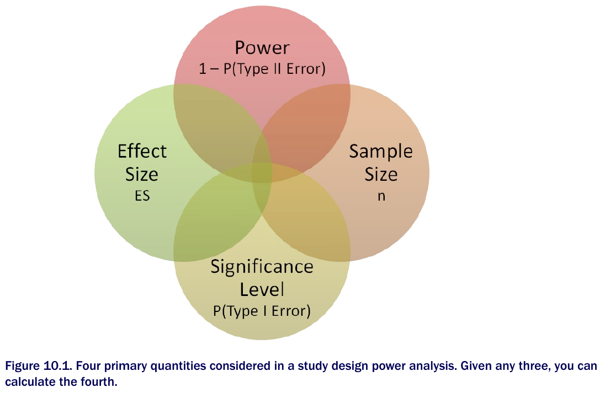
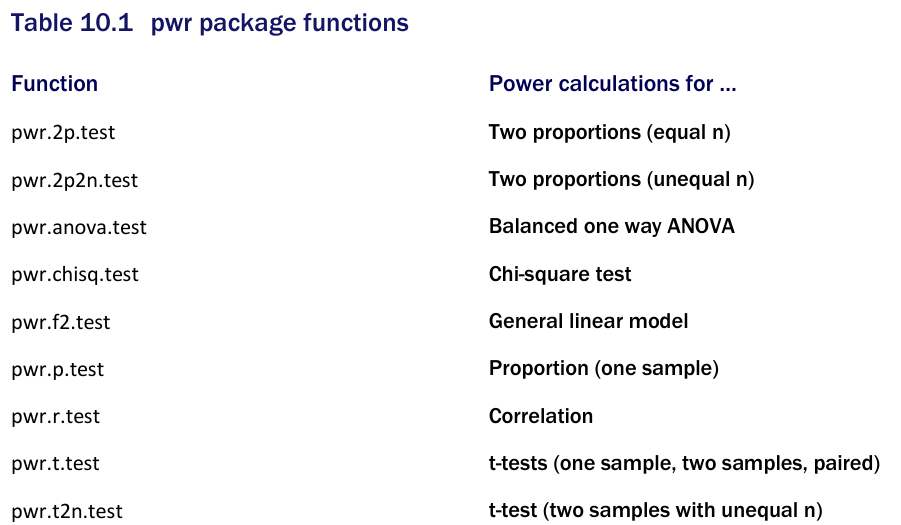
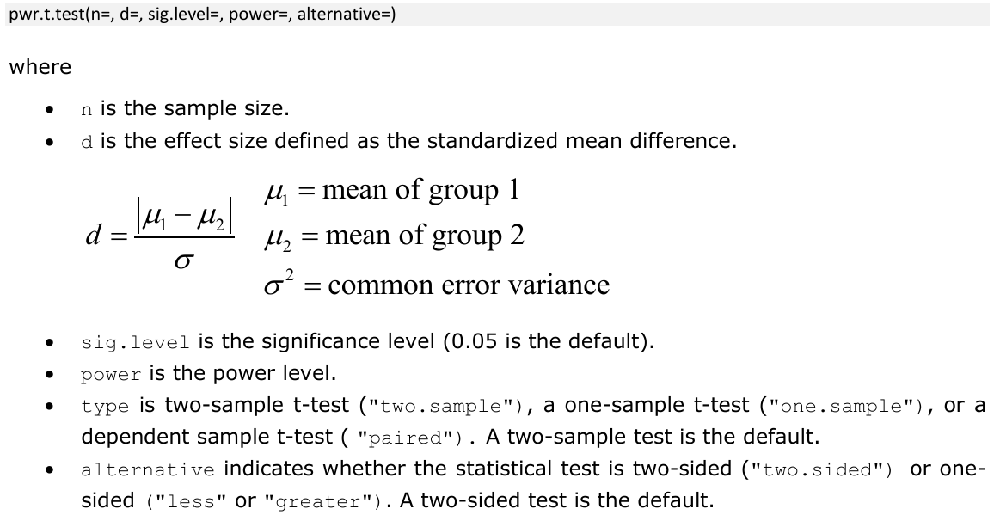
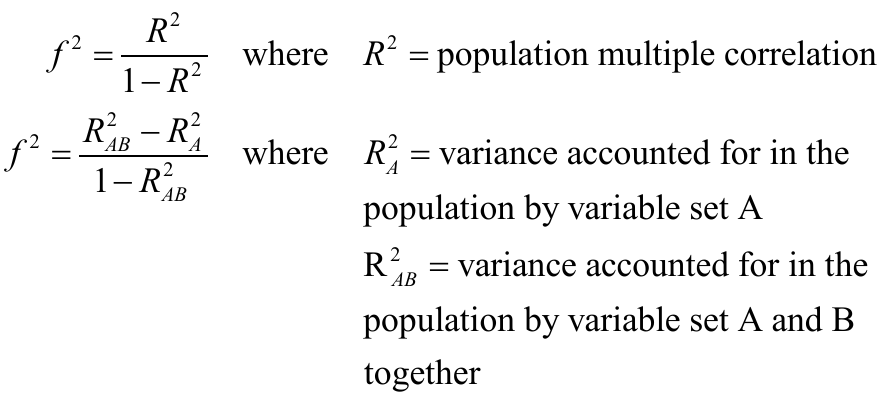
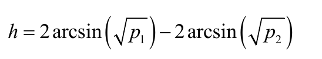
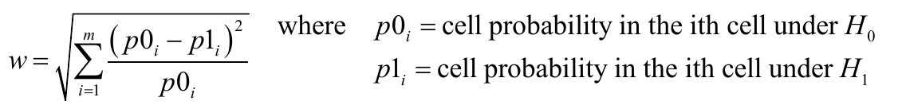
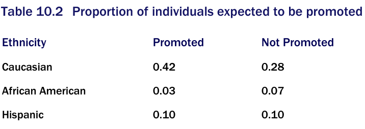

```{r setup, include = FALSE}
knitr::opts_chunk$set(
  cache = FALSE, # if TRUE knitr will cache results to reuse in future knits
  fig.width = 6, # the width for plots created by code chunk
  fig.height = 4, # the height for plots created by code chunk
  fig.align = 'center', # how to align graphics. 'left', 'right', 'center'
  dpi = 300, 
  dev = 'png', # Makes each fig a png, and avoids plotting every data point
  # eval = FALSE, # if FALSE, then the R code chunks are not evaluated
  # results = 'asis', # knitr passes through results without reformatting
  echo = TRUE, # if FALSE knitr won't display code in chunk above it's results
  message = TRUE, # if FALSE knitr won't display messages generated by code
  strip.white = TRUE, # if FALSE knitr won't remove white spaces at beg or end of code chunk
  warning = TRUE, # if FALSE knitr won't display warning messages in the doc
  error = TRUE) # report errors
  # options(tinytex.verbose = TRUE)
```

 \setcounter{section}{10}
 \setcounter{subsection}{2}
 \setcounter{subsubsection}{3}

#### Class Readings, Assignments, Syllabus Topics

##### Reading, Lab Exercises, SemProjects

  - Readings: 
    - For today: OIS 8
    - For next class: ISLR 1, 2.1, 2.2
  - Laboratory Exercises: 
    - LE 5: is due Thursday November 10th 
    - LE 6: Will be posted Thursday November 10th
  - Office Hours: (Class Canvas Calendar for Zoom Link) 
    - Wednesday @ 4:00 PM to 5:00 PM, Will Oltjen
    - Saturday @ 3:00 PM to 4:00 PM, Kristen Hernandez 
    - **Office Hours are on Zoom, and recorded**
  - Semester Projects
    - DSCI 451 Students Biweekly Update #6 Due Friday Nov. 18th
    - DSCI 451 Students 
      - Next **Report Out 3 is Due Frodau Mpvember 25th **
    - All DSCI 351/351M/451 Students: 
      - **Peer Grading of Report Out #2 is Due November 8th **
    - Exams
      - Final: Monday December 19, 2022, 12:00PM - 3:00PM, Nord 356 or remote
    
#### Power Analysis, Sample Size, Effect Size \

Power analysis allows you to 

  - determine the sample size required 
    - to detect an effect of a given "effect size" 
    - with a given degree of confidence. 

Conversely, it allows you to determine 

  - the probability of detecting an effect 
    - of a given effect size 
  - with a given level of confidence, 
    - under sample size constraints. 
    
If the probability is unacceptably low, 

  - you’d be wise to alter or abandon the experiment.

Lets see how to conduct power analyses 

  - for a variety of statistical tests,
    - including tests of proportions, 
    - t-tests, 
    - chi-square tests, 
    - balanced one-way ANOVA, 
    - tests of correlations, 
    - and linear models. 

Because power analysis applies to hypothesis testing situations, 

  - we’ll start with a review of null hypothesis significance testing (NHST). 
  
Then we’ll review conducting power analyses within R, 

  - focusing primarily on the `pwr` package.
  
Finally, we’ll consider other approaches to power analysis available with R.

##### Review of NHST \

In statistical hypothesis testing, 

  - you specify a hypothesis about a population parameter 
    - (your null hypothesis, or H0). 

You then draw a sample from this population 

  - and calculate a statistic that’s used 
    - to make inferences about the population parameter. 
  - Assuming that the null hypothesis is true, 
    - you calculate the probability of obtaining 
    - the observed sample statistic or one more extreme. 
  - If the probability is sufficiently small, 
    - you reject the null hypothesis in favor of its opposite 
    - (referred to as the alternative or research hypothesis, H 1).
    
An example will clarify the process. 

  - Say you’re interested in evaluating 
    - the impact of cell phone use on driver reaction time. 
  - Your null hypothesis is Ho: $\mu_1 - \mu_2 = 0$, 
    - where $\mu_1$ is the mean response time for drivers using a cell phone 
    - and $\mu_2$ is the mean response time for drivers that are cell phone free 
  - (here, $\mu_1 - \mu_2$ is the population parameter of interest). 

If you reject this null hypothesis, 

  - you’re left with the alternate or research hypothesis, 
    - namely H1: $\mu_1 - \mu_2 \neq 0$. 
  - This is equivalent to $\mu_1 \neq \mu_2$, 
    - that the mean reaction times for the two conditions are not equal.

A sample of individuals 

  - is selected 
    - and randomly assigned to one of two conditions. 
  - In the first condition, 
    - participants react to a series of driving challenges in a simulator 
    - while talking on a cell phone. 
  - In the second condition, participants complete the same series of challenges 
    - but without a cell phone. 
  - Overall reaction time is assessed for each individual.

Based on the sample data, you can calculate the statistic

  - $(\bar{X_1} - \bar{X_2}/(s/\sqrt{n}))$
    - where $(\bar{X_1}$ and $\bar{X_2}$
    - are the sample reaction time means in the two conditions, 
  - $s$ is the pooled sample standard deviation, 
  - and $n$ is the number of participants in each condition. 
  
If the null hypothesis is true 

  - and you can assume that reaction times are normally distributed, 
  - this sample statistic will follow 
    - a t distribution 
    - with $2n – 2$ degrees of freedom. 

Using this fact, you can calculate 

  - the probability of obtaining a sample statistic this large or larger. 

If the probability (p) is smaller than some predetermined cutoff 

  - (say p < .05), 
  - you reject the null hypothesis 
    - in favor of the alternate hypothesis. 

This predetermined cutoff (0.05) 

  - is called the significance level of the test.


Note that you use sample data 

  - to make an inference about the population it’s drawn from.
  
Your null hypothesis is 

  - that the mean reaction time of all drivers talking on cell phones 
    - isn’t different from 
  - the mean reaction time of all drivers who aren’t talking on cell phones, 
    - not just those drivers in your sample. 
    
The four possible outcomes from your decision are as follows:

  - 1. If the null hypothesis is false 
    - and the statistical test leads you to reject it, 
    - you’ve made a correct decision. 
    - You’ve correctly determined that reaction time 
    - is affected by cell phone use.
  - 2. If the null hypothesis is true and you don’t reject it, 
    - again you’ve made a correct decision. 
    - Reaction time isn’t affected by cell phone use.
  - 3. If the null hypothesis is true but you reject it, 
    - you’ve committed a Type I error. 
    - You’ve concluded that cell phone use affects reaction time 
    - when it doesn’t.
  - 4. If the null hypothesis is false and you fail to reject it, 
    - you’ve committed a Type II error.
    - Cell phone use affects reaction time, 
    - but you’ve failed to discern this.

##### Controversy surrounding null hypothesis significance testing \

Null hypothesis significance testing 

  - isn’t without controversy 
    - and detractors have raised numerous concerns about the approach, 
    - particularly as practiced in the field of psychology. 
  - They point to 
    - a widespread misunderstanding of p values,
    - reliance on statistical significance over practical significance, 
    - the fact that the null hypothesis is never exactly true 
    - and will always be rejected for sufficient sample sizes, 
    - and a number of logical inconsistencies in NHST practices.

An interesting discussion is in 3-readings/2-articles

  - [1]Bruce Thompson, Statistical Significance and Effect Size Reporting: Portrait of a Possible Future, Research in the Schools. 5 (1998) 33–38. 
  - [2]A. Gelman, E. Loken, The statistical crisis in science: data-dependent analysis–a" garden of forking paths"–explains why many statistically significant comparisons don’t hold up, American Scientist. 102 (2014) 460–466. https://doi.org/10.1511/2014.111.460.
  - [3]A. Gelman, The Problems With P-Values are not Just With P-Values, The American Statistician. (2016) 2.
  - [4]B.B. McShane, D. Gal, A. Gelman, C. Robert, J.L. Tackett, Abandon Statistical Significance, The American Statistician. 73 (2019) 235–245. https://doi.org/10.1080/00031305.2018.1527253.

-------------

Researchers typically pays special attention to four quantities

  - **Sample size** refers to the number of observations 
    - in each condition/group of the experimental design or study protocol
  - The **significance level** (also referred to as alpha) 
    - defined as the probability of making a Type I error. 
    - The significance level can also be thought of as 
    - the probability of finding an effect that is not there.
  - **Statistical Power ** defined as 
    - one minus the probability of making a Type II error. 
    - Power can be thought of as 
    - the probability of finding an effect that is there.
  - **Effect size** is the magnitude of the effect 
    - under the alternate or research hypothesis.
    - The formula for effect size depends on 
    - the statistical methodology employed in the hypothesis testing.




Although the sample size and significance level 

  - are under the direct control of the researcher,
    - power and effect size are affected more indirectly. 
  - For example, as you relax the significance level 
    - (in other words, make it easier to reject the null hypothesis), 
    - power increases. 
  - Similarly, increasing the sample size increases power.

Your research goal is typically 

  - to maximize the power of your statistical tests 
    - while maintaining an acceptable significance level 
    - and employing as small a sample size as possible. 
  - That is, you want to maximize the chances of finding a real effect 
    - and minimize the chances of finding an effect that isn’t really there, 
    - while keeping study costs within reason.

The four quantities 

  - **sample size, significance level, power, and effect size** 
    - have an intimate relationship. 
  - Given any three, 
    - you can determine the fourth. 

You’ll use this fact to carry out various power analyses 

  - as we move forward, 
  - we’ll look at ways of implementing power analyses 
    - using the R package pwr. 
  - And we’ll briefly look at some highly specialized power functions 
    - that are used in biology and genetics.

####  Implementing power analysis with the pwr package \

The pwr package  implements power analysis as outlined by Cohen (1988). 

Some of the more important functions are listed in table 10.1. 

For each function, 

  - the user can specify three of the four quantities 
    - (sample size, significance level, power, effect size), 
  - and the fourth will be calculated.



Of the four quantities, effect size is often the most difficult to specify. 

Calculating effect size  typically requires 

  - some experience with the measures involved 
    - and knowledge of past research. 
  - But what can you do if you have no clue 
    - what effect size to expect in a given study?
  - You’ll look at this difficult question in the next section. 
  
Here we'll apply `pwr` package functions 

  - to common statistical tests. 

##### t-tests \

When the statistical test to be used is a t-test, 

  - the pwr.t.test() function 
    - provides a number of useful power analysis options. 
    
The format is



Let’s work through an example. 

  - Continuing the experiment from section 10.1 
    - involving cell phone use and driving reaction time, 
  - assume that you’ll be using a two-tailed independent sample t-test 
    - to compare the mean reaction time 
    - for participants in the cell phone condition
  - with the mean reaction time for participants driving unencumbered.

Let’s assume that you know from past experience 

  - that reaction time has a standard deviation of 1.25 seconds. 
  - Also suppose that a 1-second difference in reaction time 
    - is considered an important difference. 
  - You’d therefore like to conduct a study 
    - in which you’re able to detect 
    - an effect size of d = 1/1.25 = 0.8 or larger. 
  - Additionally, you want to be 90% sure 
    - to detect such a difference if it exists, 
  - and 95% sure that you won’t declare a difference 
    - to be significant when it’s actually due to random variability. 
  - How many participants will you need in your study?

Entering this information in the `pwr.t.test()` function, you have the following:


```{r}
# t-tests
library(pwr)
pwr.t.test(
  d = .8,
  sig.level = .05,
  power = .9,
  type = "two.sample",
  alternative = "two.sided"
)
```

The results suggest that 

  - you need 34 participants in each group 
    - (for a total of 68 participants)
  - in order to detect an effect size of 0.8 
    - with 90% certainty 
    - and no more than a 5% chance of erroneously concluding 
  - that a difference exists 
    - when, in fact, it doesn’t.

Let’s alter the question. Assume that in comparing the two conditions 

  - you want to be able to detect 
    - a 0.5 standard deviation difference in population means. 
  - You want to limit the chances of falsely declaring 
    - the population means to be different to 1 out of 100. 
  - Additionally, you can only afford 
    - to include 40 participants in the study. 
  - What’s the probability that you’ll be able to detect 
    - a difference between the population means that’s this large, 
    - given the constraints outlined?

Assuming that an equal number of participants 

  - will be placed in each condition, you have

```{r}
pwr.t.test(
  n = 20,
  d = .5,
  sig.level = .01,
  type = "two.sample",
  alternative = "two.sided"
)
```


##### ANOVA \

You can also use the `pwr` package for ANOVA problems

```{r}
pwr.anova.test(
  k = 5,
  f = .25,
  sig.level = .05,
  power = .8
)
```

##### Correlations \

The `pwr.r.test()` function 

  - provides a power analysis for tests of correlation coefficients. 
  
The format is as follows

  - `pwr.r.test(n=, r=, sig.level=, power=, alternative=)`
  - where 
    - `n` is the number of observations, 
    - `r` is the effect size (as measured by a linear correlation coefficient), 
    - `sig.level` is the significance level, 
    - `power` is the power level, 
  - and `alternative` 
    - specifies a two-sided (`two.sided`) 
    - or a one-sided (`less` or `greater`) 
    - significance test.

For example, let’s assume that you’re studying 

  - the relationship between depression and loneliness. 
  
Your null and research hypotheses are 

  - H0: ρ ≤ 0.25 
  - versus H1: ρ > 0.25
    - where ρ is the population correlation 
    - between these two psychological variables. 
    
You’ve set your significance level to 0.05, 

  - and you want to be 90% confident 
    - that you’ll reject H0 if it’s false. 
  - How many observations will you need? 
  
This code provides the answer:

```{r}
# correlations
pwr.r.test(
  r = .25,
  sig.level = .05,
  power = .90,
  alternative = "greater"
)
```

Thus, you need to assess depression and loneliness 

  - in 134 participants 
  - in order to be 90% confident 
    - that you’ll reject the null hypothesis 
    - if it’s false.

##### Linear Models \

For linear models (such as multiple regression), 

  - the `pwr.f2.test()` function can be used 
    - to carry out a power analysis. 
  - The format is 
    - `pwr.f2.test(u=, v=, f2=, sig.level=, power=)`
  - where `u` and `v` are 
    - the numerator and denominator degrees of freedom 
  - and `f2` is the effect size.


The first formula for `f2` 

  - is appropriate when you’re evaluating 
    - the impact of a set of predictors on an outcome. 
  - The second formula is appropriate 
    - when you’re evaluating the impact of one set of predictors 
    - above and beyond a second set of predictors (or covariates).

Let’s say you’re interested in whether a boss’s leadership style 

  - impacts workers’ satisfaction 
    - above and beyond the salary and perks associated with the job. 
  - Leadership style is assessed by four variables, 
    - and salary and perks are associated with three variables. 
  - Past experience suggests that salary and perks 
    - account for roughly 30% of the variance in worker satisfaction. 

From a practical standpoint, 

  - it would be interesting if leadership style 
    - accounted for at least 5% above this figure. 
  - Assuming a significance level of 0.05, 
    - how many subjects would be needed 
    - to identify such a contribution with 90% confidence?

In this example 

  - `sig.level=0.05`
  - `power=0.90`
  - `u=3` 
    - (total number of predictors minus the number of predictors in set B), 
  - and the effect size is 
    - `f2` = (.35 – .30)/(1 – .35) = 0.0769. 
    
Entering this into the function yields the following:

```{r}
# linear models
pwr.f2.test(
  u = 3,
  f2 = 0.0769,
  sig.level = 0.05,
  power = 0.90
)
```

##### Tests of Propotions \

The `pwr.2p.test()` function 

  - can be used to perform a power analysis 
    - when comparing two proportions. 

The format is `pwr.2p.test(h=, n=, sig.level=, power=)`

  - where `h` is the effect size 
  - and `n` is the common sample size in each group. 
  
The effect size h is defined as



and can be calculated with the function `ES.h(p1, p2)`.

For unequal `n`s, 

  - the desired function is
  - `pwr.2p2n.test(h =, n1 =, n2 =, sig.level=, power=)`
  
The `alternative= option` 

  - can be used to specify 
    - a two-tailed (`two.sided`) 
    - or one-tailed (`less` or `greater`) test. 
  - A two-tailed test is the default.

Let’s say that you suspect 

  - that a popular medication relieves symptoms in 60% of users. 
  - A new (and more expensive) medication will be marketed 
    - if it improves symptoms in 65% of users. 
  - How many participants will you need to include in a study 
    - comparing these two medications 
    - if you want to detect a difference this large?

Assume that you want to be 90% confident in a conclusion 

  - that the new drug is better 
    - and 95% confident that you won’t reach this conclusion erroneously. 
  - You’ll use a one-tailed test 
    - because you’re only interested in assessing 
    - whether the new drug is better than the standard.

```{r}
# tests of proportions
pwr.2p.test(
  h = ES.h(.65, .6),
  sig.level = .05,
  power = .9,
  alternative = "greater"
)
```

Based on these results, 

  - you’ll need to conduct a study with 1,605 individuals 
    - receiving the new drug 
  - and 1,605 receiving the existing drug 
  - in order to meet the criteria.
  
##### $\chi^2$ tests \

$\chi^2$ tests are often used 

  - to assess the relationship between two categorical variables.

The null hypothesis is typically 

  - that the variables are independent 
    - versus a research hypothesis that they aren’t. 
  - The `pwr.chisq.test()` function can be used 
    - to evaluate the power, effect size, or requisite sample size 
    - when employing a $\chi^2$ test. 

The format is

  - `pwr.chisq.test(w =, N = , df = , sig.level =, power = )`
  - where `w` is the effect size, 
  - `N` is the total sample size, 
  - and `df` is the degrees of freedom. 

Here, effect size w is defined as



The summation goes from `1 to m`, 

  - where `m` is the number of cells in the contingency table.
  
The function `ES.w2(P)` can be used 

  - to calculate the effect size 
    - corresponding to the alternative hypothesis 
    - in a two-way contingency table. 
  - Here, `P` is a hypothesized two-way probability table.
  
As a simple example, let’s assume that you’re looking at 

  - the relationship between ethnicity and promotion. 
  - You anticipate that 
    - 70% of your sample will be Caucasian, 
    - 10% will be African American, 
    - and 20% will be Hispanic. 
  - Further, you believe that 
    - 60% of Caucasians tend to be promoted, 
    - compared with 30% for African Americans 
    - and 50% for Hispanics. 
    
Your research hypothesis is 

  - that the probability of promotion 
  - follows the values in this table.
  


For example, you expect that 

  - 42% of the population will be promoted Caucasians 
    - (.42 = .70 × .60) 
  - and 7% of the population will be non-promoted African Americans 
    - (.07 = .10 × .70). 

Let’s assume a significance level of 0.05 

  - and that the desired power level is 0.90. 
  
The degrees of freedom in a two-way contingency table 

  - are (r – 1) × (c – 1), 
    - where r is the number of rows 
    - and c is the number of columns. 
    
You can calculate the hypothesized effect size as follows

```{r}
# chi-square tests
prob <- matrix(c(.42, .28, .03, .07, .10, .10),
               byrow = TRUE,
               nrow = 3)
ES.w2(prob)
```

Using this information, you can calculate the necessary sample size by

```{r}
pwr.chisq.test(
  w = .1853,
  df = 2,
  sig.level = .05,
  power = .9
)
```

The results suggest that 

  - a study with 369 participants 
    - will be adequate to detect 
    - a relationship between ethnicity and promotion 
  - given the 
    - effect size, 
    - power, 
    - and significance level specified.

##### Samples Sizes in Anova Analysis \

```{r}
# Sample sizes for detecting significant effects in a one-way ANOVA
library(pwr)
es <-
  seq(.1, .5, .01) # Sets the range of correlations and power values
nes <- length(es)

samsize <-
  NULL
for (i in 1:nes) {  # Obtains sample sizes

  result <- pwr.anova.test(
    k = 5,
    f = es[i],
    sig.level = .05,
    power = .9
  )
  samsize[i] <- ceiling(result$n)
}

plotdata <- data.frame(es, samsize)

library(ggplot2)  # plot power curves
ggplot(plotdata, aes(x = samsize, y = es)) +
  geom_line(color = "red", size = 1) +
  theme_bw() +
  labs(
    title = "One Way ANOVA (5 groups)",
    subtitle = "Power = 0.90,  Alpha = 0.05",
    x = "Sample Size (per group)",
    y = "Effect Size"
  )
```

#### Creating Power Analysis Plots \

Let’s look at a more involved graphing example. 

Suppose you’d like to see the sample size necessary 

  - to declare a correlation coefficient statistically significant 
  - for a range of 
    - effect sizes 
    - and power levels. 

You can use the `pwr.r.test()` function

  - and for loops to accomplish this task
  
Here we use the `seq()` function 

  - to generate a range of effect sizes `r` 
    - (correlation coefficients under H 1) 
  - and power levels `p`. 
  - The `expand.grid()` function is used 
    - to create a data frame 
    - with every combination of these two variables.
  - A for loop then cycles through rows of the data frame, 
    - calculating the sample size (`n`) 
    - for that row's correlation and power level, 
    - and saving the result. 
  - The ggplot2 package is then used 
    - to plot a sample size vs. correlation curve for each power level. 

```{r}
# Sample size curves for detecting correlations of various sizes
library(pwr)
r <- seq(.1, .5, .01) #  Sets the range of correlations and power values
p <- seq(.4, .9, .1)

df <- expand.grid(r, p)
colnames(df) <- c("r", "p")

for (i in 1:nrow(df)) { # obtain sample sizes
  result <- pwr.r.test(
    r = df$r[i],
    sig.level = .05,
    power = df$p[i],
    alternative = "two.sided"
  )
  df$n[i] <- ceiling(result$n)
}

library(ggplot2) # plot power curves
ggplot(data = df,
       aes(x = r, y = n, color = factor(p))) +
  geom_line(size = 1) +
  theme_bw() +
  labs(
    title = "Sample Size Estimation for Correlation Studies",
    subtitle = "Sig=0.05 (Two-tailed)",
    x = "Correlation Coefficient (r)",
    y = "Samsple Size (n)",
    color = "Power"
  )
```

As you can see from the graph, 

  - you’d need a sample size of approximately 75 
    - to detect a correlation of  0.20 
    - with 40% confidence. 
  - You’d need approximately 185 additional observations 
    - (n = 260) 
    - to detect the same correlation with 90% confidence. 
  - With simple modifications, the same approach can be used 
    - to create sample size and power curve graphs
    - for a wide range of statistical tests.
    

#### Links \

Robert I. Kabacoff, R in Action, 3rd Edition, Manning Publications


 
