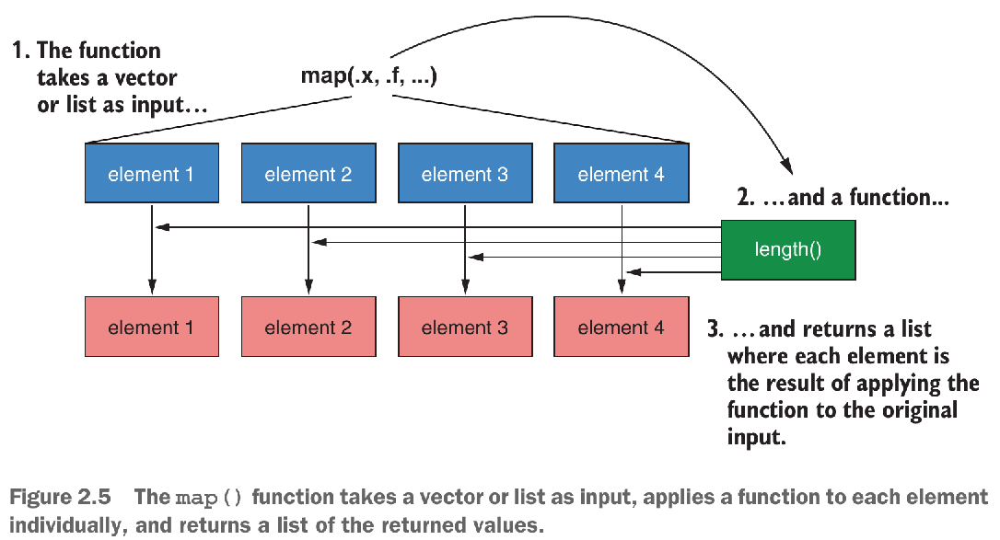

```{r setup, include = FALSE}
knitr::opts_chunk$set(
  cache = FALSE, # if TRUE knitr will cache results to reuse in future knits
  fig.width = 6, # the width for plots created by code chunk
  fig.height = 4, # the height for plots created by code chunk
  fig.align = 'center', # how to align graphics. 'left', 'right', 'center'
  dpi = 300, 
  dev = 'png', # Makes each fig a png, and avoids plotting every data point
  # eval = FALSE, # if FALSE, then the R code chunks are not evaluated
  # results = 'asis', # knitr passes through results without reformatting
  echo = TRUE, # if FALSE knitr won't display code in chunk above it's results
  message = TRUE, # if FALSE knitr won't display messages generated by code
  strip.white = TRUE, # if FALSE knitr won't remove white spaces at beg or end of code chunk
  warning = TRUE, # if FALSE knitr won't display warning messages in the doc
  error = TRUE) # report errors
  # options(tinytex.verbose = TRUE)
```

 \setcounter{section}{7}
 \setcounter{subsection}{2}
 \setcounter{subsubsection}{3}


### Tidyverse Review


```{r}
library(tidyverse)
```


#### CREATING TIBBLES WITH tibble() ----

```{r}
myTib <- tibble(x =  1:4,
                y = c("london", "beijing", "las vegas", "berlin"))

myTib
```

#### CONVERTING DATA FRAMES TO TIBBLES WITH as_tibble() ----

```{r}
myDf <- data.frame(x =  1:4,
                   y = c("london", "beijing", "las vegas", "berlin"))

dfToTib <- as_tibble(myDf)

dfToTib
```

#### TIBBLES DON'T CONVERT STRINGS TO FACTORS BY DEFAULT ----

```{r}
myDf <- data.frame(x =  1:4, 
                   y = c("london", "beijing", "las vegas", "berlin"))

myDfNotFactor <- data.frame(x =  1:4, 
                            y = c("london", "beijing", "las vegas", "berlin"),
                            stringsAsFactors = FALSE)

myTib <- tibble(x =  1:4, 
                y = c("london", "beijing", "las vegas", "berlin"))

class(myDf$y)

class(myDfNotFactor$y)

class(myTib$y)
```

#### IF YOU WANT TO CREATE A FACTOR, WRAP THE c() FUNCTION INSIDE factor() ----

```{r}
myTib <- tibble(x =  1:4, 
                y = factor(c("london", "beijing", "las vegas", "berlin")))
myTib
```

### Tidyverse of the `starwars` dataset of the dplyr package

Starwars characters

  - Description
    - This data comes from SWAPI, the Star Wars API, https://swapi.dev/
  - Usage
    - `starwars`
  - Format
    - A tibble with 87 rows and 13 variables:

```{r}
?starwars
```

#### PRINTING A TIBBLE KEEPS THE OUTPUT CONCISE ----

```{r}
data(starwars)

glimpse(starwars)

head(as.data.frame(starwars))
```

#### SUBSETTING WITH [ ALWAYS RETURNS ANOTHER TIBBLE ----

```{r}
myDf[, 1]
```

```{r}

myTib[, 1]
```

```{r}
myTib[[1]]
```

```{r}
myTib$x
```

#### VARIABLE CREATION IN tibble() IS SEQUENTIAL ----

```{r}
sequentialTib <- tibble(nItems = c(12, 45, 107),
                        cost = c(0.5, 1.2, 1.8),
                        totalWorth = nItems * cost)

sequentialTib
```

### EXPLORING THE CO2 DATASET ----

- Carbon Dioxide Uptake in Grass Plants

  - Description
    - The CO2 data frame has 84 rows and 5 columns of data 
      - from an experiment on the cold tolerance 
      - of the grass species Echinochloa crus-galli.

```{r}
data(CO2)

CO2tib <- as_tibble(CO2)

glimpse(CO2tib)
```

#### SELECTING COLUMNS WITH select() ----

```{r}
selectedData <- select(CO2tib, 1, 2, 3, 5)

glimpse(selectedData)
```

#### FILTERING DATA WITH filter() ----

```{r}
filteredData <- filter(selectedData, uptake > 16)

glimpse(filteredData)
```

#### GROUPING DATA WITH group_by() ----

```{r}
groupedData <- group_by(filteredData, Plant)

glimpse(groupedData)
```

#### SUMMARIZING DATA WITH summarize() ----

```{r}
summarizedData <- summarize(groupedData, meanUp = mean(uptake), 
                            sdUp = sd(uptake))

glimpse(summarizedData)
```

#### CREATING NEW VARIABLES WITH mutate() ----

```{r}
mutatedData <- mutate(summarizedData,  CV = (sdUp / meanUp) * 100)

mutatedData
```

#### ARRANGING DATA WITH arrange() ----

```{r}
arrangedData <- arrange(mutatedData, CV)

glimpse(arrangedData)
```


#### USING THE %>% ("PIPE") OPERATOR ----

```{r}
c(1, 4, 7, 3, 5) %>% mean()
```

#### COMBINING DPLYR VERBS WITH THE %>% OPERATOR ----

```{r}
arrangedData <- CO2tib %>%
  select(c(1:3, 5)) %>%
  filter(uptake > 16) %>%
  group_by(Plant) %>%
  summarize(meanUp = mean(uptake), sdUp = sd(uptake)) %>%
  mutate(CV = (sdUp / meanUp) * 100) %>%
  arrange(CV)

glimpse(arrangedData)
```

#### PLOTTING THE IRIS DATASET WITH ggplot() ----

```{r}
data(iris)
myPlot <- ggplot(iris, aes(x = Sepal.Length, y = Sepal.Width)) +
  geom_point() +
  theme_bw()

myPlot
```

#### ADDING ADDITIONAL GEOMETRIC OBJECTS ("GEOMS") AS PLOT LAYERS ----

```{r}
myPlot +
  geom_density_2d() +
  geom_smooth()
```

#### MAPPING SPECIES TO THE SHAPE AND COLOR AESTHETICS ----

```{r}
ggplot(iris, aes(x = Sepal.Length, y = Sepal.Width, shape = Species)) +
  geom_point()  +
  theme_bw()

ggplot(iris, aes(x = Sepal.Length, y = Sepal.Width, col = Species)) +
  geom_point()  +
  theme_bw()
```

#### FACETING BY SPECIES ----

```{r}
ggplot(iris, aes(x = Sepal.Length, y = Sepal.Width)) +
  facet_wrap(~ Species) +
  geom_point()  +
  theme_bw()
```

#### CREATING AN UNTIDY TIBBLE ----

```{r, warning = FALSE, message = FALSE}
patientData <- tibble(Patient = c("A", "B", "C"),
                      Month0 = c(21, 17, 29),
                      Month3 = c(20, 21, 27),
                      Month6 = c(21, 22, 23))

glimpse(patientData)

```

#### CONVERTING UNTIDY DATA TO TIDY FORMAT USING gather() 

```{r}
tidyPatientData <- gather(patientData, key = Month, 
                          value = BMI, -Patient)
glimpse(tidyPatientData)
```

##### or the same can be achieved with:

```{r}
gather(patientData, key = Month, value = BMI, Month0:Month6)
```

##### or:

```{r}
gather(patientData, key = Month, value = BMI, c(Month0, Month3, Month6))
```

#### CONVERTING DATA INTO WIDE FORMAT WITH spread() ----

```{r}
spread(tidyPatientData, key = Month, value = BMI)
```

#### EXAMPLE OF PURE FUNCTION VS ONE WITH SIDE EFFECTS ----

```{r}
a <- 20

pure <- function() {
  a <- a + 1
  a
}

side_effect <- function() {
  a <<- a + 1
  a
}

c(pure(), pure())

c(side_effect(), side_effect())
```

#### USING purrr FUNCTIONS FOR VECTORIZATION ----

```{r}
listOfNumerics <- list(a = rnorm(5), 
                       b = rnorm(9),
                       c = rnorm(10))

listOfNumerics

elementLengths <- vector("list", length = 3)

for (i in seq_along(listOfNumerics)) {
  elementLengths[[i]] <- length(listOfNumerics[[i]])
}

elementLengths
```

This code is difficult to read, 

  - requires us to predefine an empty vector 
    - to prevent the loop from being slow, 
  - and has a side effect: 
    - if we run the loop again, 
    - it will overwrite the elementLengths list.

Instead, we can replace the for loop with the map() function. 

The first argument of all the functions in the map family 

  - is the data we’re iterating over. 

The second argument is the function 

  - we’re applying to each list element. 
  
Take a look at figure 2.5, which illustrates how the map() function 

  - applies a function to every element of a list/vector 
  - and returns a list containing the outputs.



```{r}

map(listOfNumerics, length)
```


```{r}
map_int(listOfNumerics, length)

map_chr(listOfNumerics, length)

# map_lgl(listOfNumerics, length) # this throws an error
# Error: Can't coerce element 1 from a integer to a logical
```

We can do the same thing using the map_chr() function, 

  - which coerces the output into a character vector, 
  - but the map_lgl() function throws an error 
    - because it can’t coerce the output into a logical vector.

NOTE

  - Forcing us to explicitly state the type of output we want to return 
    - prevents bugs from unexpected types of output.


```{r}
map_df(listOfNumerics, length)

map(listOfNumerics, ~. + 2)

par(mfrow = c(1, 3))

walk(listOfNumerics, hist)

iwalk(listOfNumerics, ~hist(.x, main = .y))

multipliers <- list(0.5, 10, 3)

map2(.x = listOfNumerics, .y = multipliers, ~.x * .y)

arguments <- expand.grid(n = c(100, 200),
                         mean = c(1, 10),
                         sd = c(1, 10))

arguments

par(mfrow = c(2, 4))

pmap(arguments, rnorm) %>%
  iwalk(~hist(.x, main = paste("Element", .y)))
```


### Links

[1] Hefin I. Rhys, Machine Learning with R, the tidyverse, and mlr. Shelter Island, New York: Manning Publications, 2020. Available: [https://www.manning.com/books/machine-learning-with-r-the-tidyverse-and-mlr](https://www.manning.com/books/machine-learning-with-r-the-tidyverse-and-mlr). [Accessed: 20-Oct-2020]

