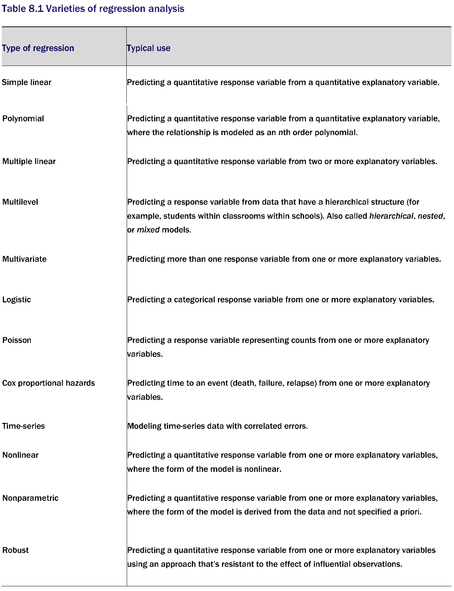
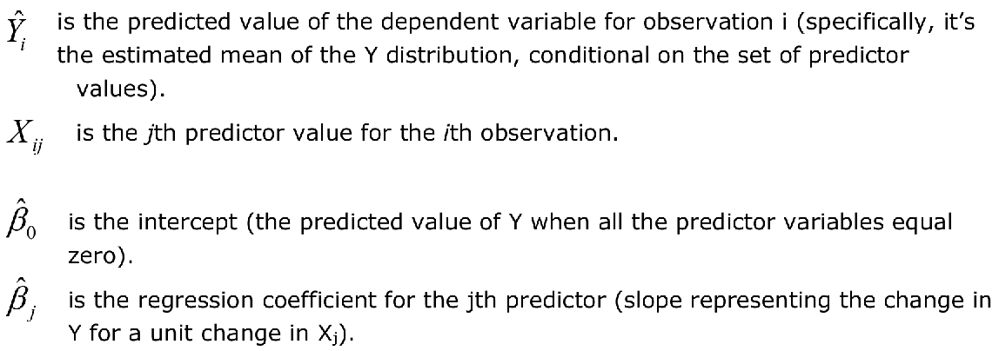
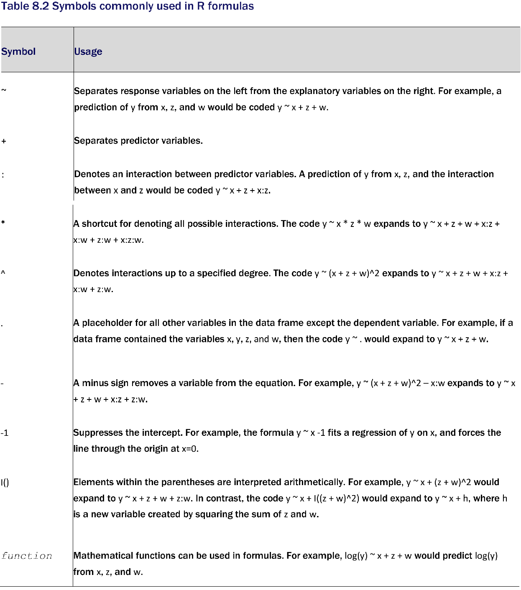
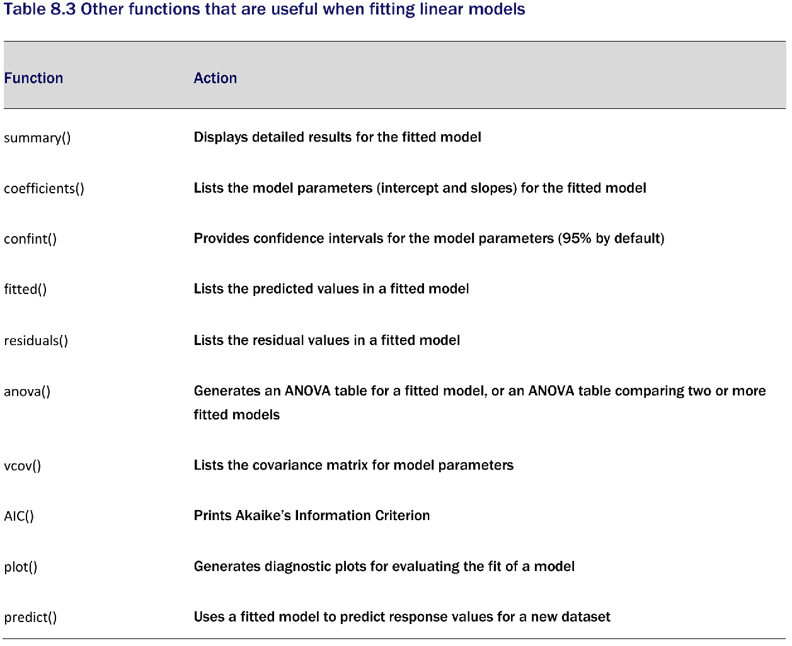

```{r setup, include = FALSE}
knitr::opts_chunk$set(
  cache = FALSE, # if TRUE knitr will cache results to reuse in future knits
  fig.width = 6, # the width for plots created by code chunk
  fig.height = 4, # the height for plots created by code chunk
  fig.align = 'center', # how to align graphics. 'left', 'right', 'center'
  dpi = 300, 
  dev = 'png', # Makes each fig a png, and avoids plotting every data point
  # eval = FALSE, # if FALSE, then the R code chunks are not evaluated
  # results = 'asis', # knitr passes through results without reformatting
  echo = TRUE, # if FALSE knitr won't display code in chunk above it's results
  message = TRUE, # if FALSE knitr won't display messages generated by code
  strip.white = TRUE, # if FALSE knitr won't remove white spaces at beg or end of code chunk
  warning = TRUE, # if FALSE knitr won't display warning messages in the doc
  error = TRUE) # report errors
  # options(tinytex.verbose = TRUE)
```

 \setcounter{section}{11}
 \setcounter{subsection}{2}
 \setcounter{subsubsection}{1}

#### Class Readings, Assignments, Syllabus Topics

##### Reading, Lab Exercises, SemProjects

  - Readings: 
    - For today: ISLR 2nd Ed. 1, 2.1, 2.2
    - For next class: OIS9
  - Laboratory Exercises: 
    - LE5 : Due Today Thursday Nov. 10th
    - LE6 : Given Out today or tomorrow
    - LE6 : Due Tuesday Nov. 22nd
  - Office Hours: (Class Canvas Calendar for Zoom Link)
    - Mondays @ 4:30 PM to 5:30 PM
    - Wednesdays @ 4:30 PM to 5:30 PM  
    - **Office Hours are on Zoom, and recorded**
  - Semester Projects
    - DSCI 451 Students **Biweekly Update 6 Due November 18th** 
    - DSCI 451 Students 
      - Next **Report Out #3 is Due Friday November 25th**
    - All DSCI 351/351M/451 Students: 
      - Peer Grading of Report Out #3 is Due Tuesday Nov. 29th
  - Exams
    - Final: Monday 12/13/2021, 12:00PM - 3:00PM, Nord 356 or remote
    
##### Textbooks

Introduction to R and Data Science

  - For R, Coding, Inferential Statistics
    - Peng: R Programming for Data Science
    - Peng: Exploratory Data Analysis with R
  
Textbooks for this class

  - OIS = Diez, Barr, Çetinkaya-Runde: Open Intro Stat v4
  - R4DS = Wickham, Grolemund: R for Data Science
  
Textbooks for DSCI353/353M/453, And in your Repo now

  - ISLR = James, Witten, Hastie, Tibshirani: Intro to Statistical Learning with R
  - ESL = Trevor Hastie, Tibshirani, Friedman: Elements of Statistical Learning
  - DLwR = Chollet, Allaire: Deep Learning with R

Magazine Articles about Deep Learning

  - DL1 to DL6 are "Deep Learning" articles in 3-readings/2-articles/

##### Syllabus


#### Linear Regression Overview

- Here we'll look at three important topics in data science

  - Fitting and interpreting linear models
  - Evaluating model assumptions
  - Selecting among competing models

Because regression analysis plays 

  - such a central role in modern statistics, 
    - we’ll cover it in detail. 
  - First, we’ll look at how to fit and interpret regression models.
  - Next, we’ll review a set of techniques 
    - for identifying potential problems with these models 
    - and how to deal with them. 
  - Third, we’ll explore the issue of variable selection. 
    - Of all the potential predictor variables available, 
    - how do you decide which ones to include in your final model?
  - Fourth, we’ll address the question of generalizability. 
    - How well will your model work 
    - when you apply it in the real world? 
  - Finally, we’ll consider relative importance 
    - of all the predictors in your model, 
    - which one is the most important, 
    - the second most important, 
    - and the least important?

Effective regression analysis is 

  - an interactive, holistic process with many steps, 
    - and it involves more than a little skill. 
  - Rather than break it up into multiple parts, 
    - We'll learn this as an integrated process
    - So as to understand the multi-faceted nature 
    - of regression modeling

##### The many faces of regression

- The term regression can be confusing 

  - because there are so many specialized varieties 
    - See table 8.1
  - In addition, R has powerful and comprehensive 
    - packages for fitting regression models, 
    - and this abundance of options can be confusing as well. 
  - For example, in 2005, Vito Ricci 
    - created a list of more than 205 functions in R 
    - that are used to generate regression analyses
    - [Regression RefCard Vito Ricci](https://cran.r-project.org/doc/contrib/Ricci-refcard-regression.pdf)



We’ll focus on regression methods 

  - that fall under the rubric of 
    - ordinary least squares (OLS) regression, 
  - including simple linear regression, 
  - polynomial regression, and
  - multiple linear regression. 
  
OLS regression is the most common variety of statistical analysis today.

Other types of regression models 

  - including logistic regression
    - which is really a bi-classification method
  - will be covered separately

#####  Scenarios for using OLS regression

- In OLS regression, 

  - a quantitative dependent variable (the **response**) 
    - is predicted from a weighted sum of predictor variables, 
    - where the weights are parameters estimated from the data. 
  - Often **predictors** are also called **features**    


Let’s look at an example, about concrete (fwa, 2006)

  - An engineer wants to identify the most important factors 
    - related to bridge deterioration 
  - such as 
    - age, 
    - traffic volume, 
    - bridge design, 
    - construction materials and methods, 
    - construction quality, 
    - and weather conditions) 
  - and determine the mathematical form of these relationships.


She collects data on each of these variables 

  - from a representative sample of bridges 
  - and models the data using OLS regression.

The approach is highly interactive. 

  - She fits a series of models, 
  - checks their compliance with underlying statistical assumptions,
  - explores any unexpected or aberrant findings, 
  - and finally chooses the “best” model 
    - from among many possible models. 
    
If successful, the results will help her to:

  - Focus on important variables, 
    - by determining which of the many collected variables 
    - are useful in predicting bridge deterioration, 
    - along with their relative importance.
  - Look for bridges that are likely to be in trouble, 
    - by providing an equation that can be used 
    - to predict bridge deterioration for new cases 
      - (where the values of the predictor variables are known, 
      - but the degree of bridge deterioration isn’t).
  - Take advantage of serendipity, 
    - by identifying unusual bridges. 
  - If she finds that some bridges 
    - deteriorate much faster or slower than predicted by the model, 
    - a study of these **outliers** may yield important findings 
    - that could help her to understand 
      - the mechanisms involved in bridge deterioration.

##### OLS Regression

- We’ll be predicting the response variable 

  - from a set of predictor variables using OLS
    - This is also called regressing the response variable 
    - on the predictor variables.

OLS regression fits models of the form 

  - where n is the number of observations 
  - and k is the number of predictor variables. 
  
We can represent this model by 

$$ \hat{Y_i}= \beta_0 + \beta_{1i} X_{1i} + ... + \beta_{ki} X_{ki},  i = 1...n $$


Our goal is to select model parameters 

  - (intercept and slopes) 
  - that minimize the difference between 
    - actual response values 
    - and those predicted by the model. 
    
Specifically, model parameters are selected 

  - to minimize the sum of squared residuals:

$$ Y_i - \hat{Y_i} = (Y_i - \hat{\beta_0} + \hat{\beta_k}X_{ki} + ... + \hat{\beta_1}X_{1i} = \epsilon_i^2 ) $$

To properly interpret the coefficients of the OLS model, 

  - you must satisfy a number of statistical assumptions:
  - **Normality**
    - For fixed values of the independent variables, 
      - the dependent variable is normally distributed.
  - **Independence** 
    - The $Y_i$ values are independent of each other. 
  - **Linearity** 
    - The dependent variable is linearly related 
      - to the independent variables.
  - **Homoscedasticity**
    - The variance of the dependent variable 
      - doesn’t vary with the levels of the independent variables. 
      
If you violate these assumptions, 

  - your statistical significance tests 
    - and confidence intervals
  - may not be accurate. 
  
Note that OLS regression also assumes 

  - that the independent variables
    - are fixed and measured without error,
    - but this assumption is typically relaxed in practice.

######  Fitting regression models with lm()

- In R, the basic function for fitting a linear model is `lm()`

  - `myfit <- lm(formula, data)`
  - where formula describes the model to be fit 
    - and data is the data frame containing the data 
    - to be used in fitting the model. 

The resulting object (myfit, in this case) 

  - is a list that contains extensive information about the fitted model. 

The formula is typically written as

  - `Y ~ X1 + X2 + ... + Xk`
  - where the `~` separates the response variable on the left 
    - from the predictor variables on the right, 
  - and the predictor variables are separated by + signs. 
  
Other symbols can be used 

  - to modify the formula in various ways (see table 8.2).



In addition to lm(), table 8.3 lists several functions 

  - that are useful 
    - when generating a simple or multiple regression analysis. 
  - Each of these functions 
    - is applied to the object returned by lm() 
    - in order to generate additional information based on that fitted model.



When the regression model contains 

  - one dependent variable 
    - and one independent variable,
    - the approach is called simple linear regression. 
  - When there’s one predictor variable 
    - but powers of the variable are included 
     - (for example, $X, X^2, X^3$), 
     - it’s called polynomial regression.
  - When there’s more than one predictor variable, 
    - it’s called multiple linear regression. 
    
###### Simple Linear Regression
    
- We’ll start with an example of simple linear regression, 

  - then progress to examples of polynomial 
    - and multiple linear regression, 
  - and end with an example of multiple regression 
    - that includes an interaction among the predictors.

```{r}
fit <- lm(weight ~ height, data = women)

summary(fit)

women$weight

fitted(fit)

residuals(fit)

plot(women$height, women$weight,
     xlab = "Height (in inches)",
     ylab = "Weight (in pounds)")
abline(fit)

```

From the output, we see that the prediction equation is

$$ W = -87.52 + 3.45 \space x \space H $$

Because a height of 0 is impossible, 

  - you wouldn’t try to give a physical interpretation to the intercept. 
  - It merely becomes an adjustment constant. 

From the Pr(>|t|) column, 

  - you see that the regression coefficient (3.45) 
    - is significantly different from zero (p < 0.001) 
  - and indicates that there’s an expected increase 
    - of 3.45 pounds of weight 
    0 for every 1 inch increase in height.

The multiple R-squared (0.991) 

  - indicates that the model accounts for 99.1% of the variance in weights. 

The multiple R-squared is 

  - also the squared correlation 
    - between the actual and predicted value 
  -  that is, $R^2 =  r_{\hat{y}y}$
  
The residual standard error (1.53 pounds) 

 - can be thought of as the average error 
   - in predicting weight from height using this model. 

The F statistic tests whether 

  - the predictor variables, taken together, 
    - predict the response variable above chance levels. 
  - Because there’s only one predictor variable in simple regression, 
    - in this example the F test 
    - is equivalent to the t-test for the regression coefficient for height.

#### A quick paced exposure to Linear Regression and Diagnostics

##### Simple Linear Regression

- The dataset women in the base installation 

  - provides the height and weight 
    - for a set of 15 women
    - ages 30 to 39. 
    
Suppose you want to predict weight from height. 

Having an equation for predicting weight from height 

  - can help you to identify overweight or underweight individuals.
  
The analysis is provided in the following listing, 

  - and the resulting graph is shown

```{r}

fit <- lm(weight ~ height, data = women)
summary(fit)
women$weight
fitted(fit)
residuals(fit)

plot(women$height, women$weight,
     xlab = "Height (in inches)",
     ylab = "Weight (in pounds)")
abline(fit)
```

From the output, you see that the prediction equation is

  - $ weight = -87.52 + 3.45 x height $

Because a height of 0 is impossible, 

  - you wouldn’t try to give a physical interpretation 
    - to the intercept. 
  - It merely becomes an adjustment constant.

##### Polynomial Regression

- The plot above suggests that you might be able to improve your prediction 

  - using a regression with a quadratic term (that is, $x^2$). 
  
You can fit a quadratic equation using the statement

```{r}

fit2 <- lm(weight ~ height + I(height ^ 2), data = women)
summary(fit2)

plot(women$height, women$weight,
     xlab = "Height (in inches)",
     ylab = "Weight (in lbs)")
lines(women$height, fitted(fit2))

```

##### Examining bivariate relationships

- When there’s more than one predictor variable, 

  - simple linear regression 
    - becomes multiple linear regression, 
  - and the analysis grows more involved. 
  
Technically, polynomial regression is 

  - a special case of multiple regression. 
  
Quadratic regression has two predictors ($x$ and $X^2$), and
cubic regression has three predictors ($X$, $X^2$, and $x^3$). 

Let’s look at a more general example.

We’ll use the state.x77 dataset in the base package for this example. 

Suppose you want to explore the relationship 

  - between a state’s murder rate 
    - and other characteristics of the state,
  - including 
    - population, 
    - illiteracy rate, 
    - average income, and 
    - frost levels 
      - (mean number of days below freezing).


```{r}

states <- as.data.frame(state.x77[, c("Murder", "Population",
                                      "Illiteracy", "Income", "Frost")])
cor(states)
library(car)
scatterplotMatrix(states, smooth = FALSE,
                  main = "Scatter Plot Matrix")

```

##### Multiple linear regression

- Now let’s fit the multiple regression model with the lm() function

When there’s more than one predictor variable, 

  - the regression coefficients indicate 
    - the increase in the dependent variable 
    - for a unit change in a predictor variable, 
    - holding all other predictor variables constant. 

For example, the regression coefficient for Illiteracy 

  - is 4.14,
  - suggesting that an increase of 1% in illiteracy 
    - is associated with a 4.14% increase 
  - in the murder rate, 
    - controlling for population, income, and temperature

```{r}

states <- as.data.frame(state.x77[, c("Murder", "Population",
                                      "Illiteracy", "Income", "Frost")])
fit <-
  lm(Murder ~ Population + Illiteracy + Income + Frost, data = states)
summary(fit)

```

##### Mutiple linear regression with a significant interaction term

- Some of the most interesting research findings 

  - are those involving interactions among predictor variables. 
  
Consider the automobile data in the mtcars data frame. 

Let’s say that you’re interested in 

  - the impact of automobile weight and horsepower 
    - on mileage. 
    
You could fit a regression model that includes both predictors, 

  - along with their interaction, 
  - as shown here 

```{r}

fit <- lm(mpg ~ hp + wt + hp:wt, data = mtcars)
summary(fit)

library(effects)
plot(effect("hp:wt", fit, , list(wt = c(2.2, 3.2, 4.2))),
     lines = c(1, 2, 3),
     multiline = TRUE)

```

##### Simple regression diagnostics

- In the previous section, you used the lm() function 

  - to fit an OLS regression model 
  - and the summary() function 
    - to obtain the model parameters and summary statistics. 
    
Unfortunately, nothing in this printout tells you 

  - whether the model you’ve fit is appropriate. 

Your confidence in inferences about regression parameters 

  - depends on the degree to which you’ve met 
    - the statistical assumptions of the OLS model. 

Although the summary() function describes the model, 

  - it provides no information concerning the degree 
    - to which you’ve satisfied 
  - the statistical assumptions underlying the model.

Why is this important? 

  - Irregularities in the data 
    - or misspecifications of the relationships
    - between the predictors and the response variable 
  - can lead you to settle on a model that’s wildly inaccurate.

```{r}

fit <- lm(weight ~ height, data = women)
par(mfrow = c(2, 2))
plot(fit)
par(mfrow = c(1, 1))

```

To understand these graphs, consider the assumptions of OLS regression:

  - Normality—If the dependent variable is normally distributed for a fixed set of predictor values, then the residual values should be normally distributed with a mean of 0. The Normal Q-Q plot (upper right) is a probability plot of the standardized residuals against the values that would be expected under normality. If you’ve met the normality assumption, the points on this graph should fall on the straight 45-degree line. Because they don’t, you’ve clearly violated the normality assumption. 
  - Independence—You can’t tell if the dependent variable values are independent from these plots. You have to use your understanding of how the data was collected. There’s no a priori reason to believe that one woman’s weight influences another woman’s weight. If you found out that the data were sampled from families, you might have to adjust your assumption of independence.
  - Linearity—If the dependent variable is linearly related to the independent variables, there should be no systematic relationship between the residuals and the predicted (that is, fitted) values. In other words, the model should capture all the systematic variance present in the data, leaving nothing but random noise. In the Residuals vs. Fitted graph (upper left), you see clear evidence of a curved relationship, which suggests that you may want to add a quadratic term to the regression.
  - Homoscedasticity—If you’ve met the constant variance assumption, the points in the Scale-Location graph (bottom left) should be a random band around a horizontal line. You seem to meet this assumption.


##### Assessing normality

- The qqPlot() function provides a more accurate method 

  - of assessing the normality assumption 
    - than that provided by the plot() function in the base package. 

It plots the studentized residuals 

  - (also called studentized deleted residuals or jackknifed residuals) 
    - against a t distribution with n – p – 1 degrees of freedom, 
  - where n is the sample size and 
    - p is the number of regression parameters (including the intercept). 

```{r}

library(car)
states <- as.data.frame(state.x77[, c("Murder", "Population",
                                      "Illiteracy", "Income", "Frost")])
fit <-
  lm(Murder ~ Population + Illiteracy + Income + Frost, data = states)
qqPlot(
  fit,
  simulate = TRUE,
  labels = row.names(states),
  id = list(method = "identify"),
  main = "Q-Q Plot"
)

```

##### Independence of errors

- the best way to assess whether the dependent variable values 

  - (and thus the residuals) 
    - are independent is from your knowledge of how the data were collected. 

For example, time series data often display autocorrelation

  - observations collected closer in time 
    - are more correlated with each other 
    - than with observations distant in time. 
    
The car package provides a function for the Durbin–Watson test 

  - to detect such serially correlated errors. 

You can apply the Durbin–Watson test to the multiple-regression problem 

```{r}

durbinWatsonTest(fit)

```

The nonsignificant p-value (p=0.282) 

  - suggests a lack of autocorrelation 
  - and, conversely, 
    - an independence of errors. 

##### Assessing linearity

- The component plus residual plots 

  - can confirm that you’ve met the linearity assumption. 
  
The form of the linear model 

  - seems to be appropriate for this dataset.


```{r}

library(car)
crPlots(fit)

```

##### Assessing homoscedasticity

- The car package also provides two useful functions 

  - for identifying non-constant error variance. 
  
The ncvTest() function 

  - produces a score test of 
    - the hypothesis of constant error variance 
  - against the alternative that 
    - the error variance changes 
    - with the level of the fitted values. 
    
A significant result 

  - suggests heteroscedasticity (nonconstant error variance).


```{r}

library(car)
ncvTest(fit)
spreadLevelPlot(fit)

```

The score test is nonsignificant (p = 0.19), 

  - suggesting that you’ve met the constant variance assumption. 

##### Evaluating multi-collinearity

- Before leaving this section on regression diagnostics, 

  - let’s focus on a problem that’s not directly related 
    - to statistical assumptions 
  - but is important in allowing you 
    - to interpret multiple regression results. 
    
Imagine you’re conducting a study of grip strength. 

  - Your independent variables include 
    - date of birth (DOB) 
    - and age. 
  - You regress grip strength 
    - on DOB and age 
    - and find a significant overall F test at p < .001. 
    
But when you look at the individual regression coefficients 

  - for DOB and age, 
  - you find that they’re both nonsignificant 
    - (that is, there’s no evidence that either is related to grip strength). 
    
What happened?


```{python}

library(car)
vif(fit)
vif(fit) > 10 # problem?

```

The problem is that DOB and age 

  - are perfectly correlated within rounding error. 
  
A regression coefficient 

  - measures the impact of one predictor variable 
    - on the response variable, 
  - holding all other predictor variables constant.
  
The problem is called multicollinearity. 

  - It leads to large confidence intervals for model parameters 
  - and makes the interpretation of individual coefficients difficult.
  
Multicollinearity can be detected 

  - using a statistic called the variance inflation factor (VIF). 
  
For any predictor variable, 

  - the square root of the VIF 
    - indicates the degree to which the confidence interval 
  - for that variable’s regression parameter 
    - is expanded relative to a model with uncorrelated predictors 
    - (hence the name).

#### Unusual Observations

- A comprehensive regression analysis

  - will also include a screening for unusual observations
    - namely outliers, 
    - high-leverage observations, 
    - and influential observations. 

These are data points that warrant further investigation, 

  - either because they’re different than other observations in some way, 
  - or because they exert a disproportionate amount of influence 
    - on the results. 
    
Let’s look at each in turn.


##### Assessing outliers

- Outliers are 

  - observations not predicted by the model

```{r}

library(car)
outlierTest(fit)

```

##### Identifying high leverage points

- Observations that have high leverage 

  - are outliers with regard to the other predictors. 
  
In other words, 

  - they have an unusual combination of predictor values. 
  
```{r}

hat.plot <- function(fit) {
  p <- length(coefficients(fit))
  n <- length(fitted(fit))
  plot(hatvalues(fit), main = "Index Plot of Hat Values")
  abline(h = c(2, 3) * p / n,
         col = "red",
         lty = 2)
  identify(1:n, hatvalues(fit), names(hatvalues(fit)))
}
hat.plot(fit)

```

##### Identifying influential observations: Cooks Distance

- Influential observations 

  - have a disproportionate impact 
    - on the values of the model parameters. 
    
There are two methods for identifying influential observations: 

  - Cook’s distance (or D statistic)
  - and added variable plots. 

```{r}

# Cooks Distance D
# identify D values > 4/(n-k-1)
cutoff <- 4 / (nrow(states) - length(fit$coefficients) - 2)
plot(fit, which = 4, cook.levels = cutoff)
abline(h = cutoff, lty = 2, col = "red")

```

##### Added variable plots

```{}

# add id.method = "identify" to interactively identify points
library(car)
avPlots(fit, ask = FALSE, id.method = "identify")

```

##### Influence Plot

```{r}

library(car)
influencePlot(fit, id = "noteworthy", main = "Influence Plot",
              sub = "Circle size is proportional to Cook's distance")

```

##### Box-Cox Transformation to normality

```{r}

library(car)
summary(powerTransform(states$Murder))

```

##### Box-Tidwell Transformations to linearity

```{r}

library(car)
boxTidwell(Murder ~ Population + Illiteracy, data = states)

```

##### Comparing nested models using the anova function

```{r}

states <- as.data.frame(state.x77[, c("Murder", "Population",
                                      "Illiteracy", "Income", "Frost")])
fit1 <- lm(Murder ~ Population + Illiteracy + Income + Frost,
           data = states)
fit2 <- lm(Murder ~ Population + Illiteracy, data = states)
anova(fit2, fit1)

```

##### Comparing models with the AIC

```{r}

fit1 <- lm(Murder ~ Population + Illiteracy + Income + Frost,
           data = states)
fit2 <- lm(Murder ~ Population + Illiteracy, data = states)
AIC(fit1, fit2)

```

##### Backward stepwise selection

```{r}

states <- as.data.frame(state.x77[, c("Murder", "Population",
                                      "Illiteracy", "Income", "Frost")])
fit <- lm(Murder ~ Population + Illiteracy + Income + Frost,
          data = states)
step(fit, direction = "backward")

```

##### All subsets regression

```{r}

library(leaps)
states <- as.data.frame(state.x77[, c("Murder", "Population",
                                      "Illiteracy", "Income", "Frost")])

leaps <- regsubsets(Murder ~ Population + Illiteracy + Income +
                      Frost,
                    data = states,
                    nbest = 4)

subsTable <- function(obj, scale) {
  x <- summary(leaps)
  m <- cbind(round(x[[scale]], 3), x$which[, -1])
  colnames(m)[1] <- scale
  m[order(m[, 1]),]
}

subsTable(leaps, scale = "adjr2")

```

##### Function for k-fold cross-validated R-square

```{r}

shrinkage <- function(fit, k = 10, seed = 1) {
  require(bootstrap)
  
  theta.fit <- function(x, y) {
    lsfit(x, y)
  }
  theta.predict <- function(fit, x) {
    cbind(1, x) %*% fit$coef
  }
  
  x <- fit$model[, 2:ncol(fit$model)]
  y <- fit$model[, 1]
  
  set.seed(seed)
  results <- crossval(x, y, theta.fit, theta.predict, ngroup = k)
  r2    <- cor(y, fit$fitted.values) ^ 2
  r2cv  <- cor(y, results$cv.fit) ^ 2
  cat("Original R-square =", r2, "\n")
  cat(k, "Fold Cross-Validated R-square =", r2cv, "\n")
}

states <- as.data.frame(state.x77[, c("Murder", "Population",
                                      "Illiteracy", "Income", "Frost")])
fit <-
  lm(Murder ~ Population + Income + Illiteracy + Frost, data = states)
shrinkage(fit)

fit2 <- lm(Murder ~ Population + Illiteracy, data = states)
shrinkage(fit2)

```

##### relweights function for calculating relative importance of predictors

```{r}

relweights <- function(fit, ...) {
  R <- cor(fit$model)
  nvar <- ncol(R)
  rxx <- R[2:nvar, 2:nvar]
  rxy <- R[2:nvar, 1]
  svd <- eigen(rxx)
  evec <- svd$vectors
  ev <- svd$values
  delta <- diag(sqrt(ev))
  lambda <- evec %*% delta %*% t(evec)
  lambdasq <- lambda ^ 2
  beta <- solve(lambda) %*% rxy
  rsquare <- colSums(beta ^ 2)
  rawwgt <- lambdasq %*% beta ^ 2
  import <- (rawwgt / rsquare) * 100
  import <- as.data.frame(import)
  row.names(import) <- names(fit$model[2:nvar])
  names(import) <- "Weights"
  import <- import[order(import), 1, drop = FALSE]
  dotchart(
    import$Weights,
    labels = row.names(import),
    xlab = "% of R-Square",
    pch = 19,
    main = "Relative Importance of Predictor Variables",
    sub = paste("Total R-Square=", round(rsquare, digits = 3)),
    ...
  )
  return(import)
}

```

Applying the relweights function

```{r}

states <- as.data.frame(state.x77[, c("Murder", "Population",
                                      "Illiteracy", "Income", "Frost")])
fit <-
  lm(Murder ~ Population + Illiteracy + Income + Frost, data = states)
relweights(fit, col = "blue")

```


#### Links

Robert I. Kabacoff, R in Action, 3rd Edition, Manning Publications 2020

Fwa, T., ed. 2006. The Handbook of Highway Engineering, 2nd ed. Boca Raton, FL: CRC Press.

