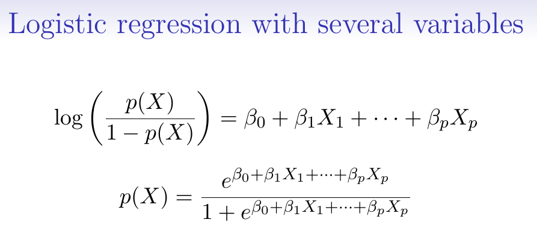
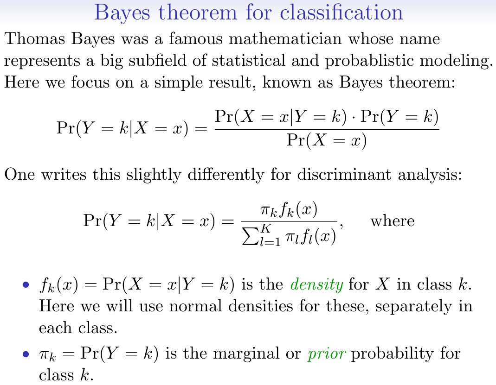

```{r setup, include = FALSE}
knitr::opts_chunk$set(
  cache = FALSE, # if TRUE knitr will cache results to reuse in future knits
  fig.width = 6, # the width for plots created by code chunk
  fig.height = 4, # the height for plots created by code chunk
  fig.align = 'center', # how to align graphics. 'left', 'right', 'center'
  dpi = 300, 
  dev = 'png', # Makes each fig a png, and avoids plotting every data point
  # eval = FALSE, # if FALSE, then the R code chunks are not evaluated
  # results = 'asis', # knitr passes through results without reformatting
  echo = TRUE, # if FALSE knitr won't display code in chunk above it's results
  message = TRUE, # if FALSE knitr won't display messages generated by code
  strip.white = TRUE, # if FALSE knitr won't remove white spaces at beg or end of code chunk
  warning = TRUE, # if FALSE knitr won't display warning messages in the doc
  error = TRUE) # report errors
  # options(tinytex.verbose = TRUE)
```

 \setcounter{section}{15}
 \setcounter{subsection}{1}
 \setcounter{subsubsection}{1}

#### Class Readings, Assignments, Syllabus Topics

##### Course Evaluations Are Open Now

-  lets get to 90% response rate

  - We want statistically significant results!
    - I look for suggestions on how to improve the course
  - [https://webapps.case.edu/courseevals/](https://webapps.case.edu/courseevals/)


#### [Machine Learning Portal](https://en.wikipedia.org/wiki/Portal:Machine_learning)

- A very useful resource
  
Also another useful overview of Machine Learning

  - Is in 3-readings/3-CheatSheets
    - super-cheatsheet-machine-learning.pdf
  - And the two cheat sheets in 3-readings/3-CheatSheets
    - supervised-learning.pdf
    - unsupervised-learning.pdf
  
  
#### Classification vs. Clustering; Whats the difference


  
- Classification and Clustering are the two types of learning methods 

  - which characterize objects into groups by one or more features. 

These processes appear to be similar, 

  - but there is a difference between them 
    - in context of **data mining**. 

The prior difference between classification and clustering 

  - is that classification is used in **supervised learning** techniques 
    - where predefined labels are assigned to instances by properties, 
  - on the contrary, clustering is used in **unsupervised learning** 
    - where similar instances are grouped, 
    - based on their features or properties
    
When the training is provided to the system, 

  - the class label of training "tuple" is known and then tested, 
    - (What is a "tuple"
      - a tuple is a finite ordered list (sequence) of elements)
  - this is known as supervised learning. 

On the other hand, unsupervised learning 

  - does not involve training or learning, 
  - and the training sample is not known previously.
  
##### Definition of Classification

- Classification is the process of learning a model 

  - that elucidate different predetermined classes of data. 
  - It is a two-step process, 
    - comprised of a learning step and a classification step. 
  - In the learning step, a classification model is constructed 
    - and in the classification step the constructed model is used 
    - to prefigure the class labels for given data.

For example, in a banking application, 

  - the customer who applies for a loan 
    - may be classified as a safe and risky 
    - according to his/her age and salary. 
  - This type of activity is also called supervised learning. 
    - The constructed model can be used to classify new data. 
  - The learning step can be accomplished 
    - by using already defined training set of data. 
  - Each record in the training data 
    - is associated with an attribute referred to as a class label, 
    - that signifies which class the record belongs to. 
  - The produced model could be in the form 
    - of a decision tree or in a set of rules.

A decision tree is a graphical depiction 

  - of the interpretation of each class or classification rules. 
  - Regression is the special application of classification rules. 
  - Regression is useful when 
    - the value of a variable 
    - is predicted based on the tuple 
    - rather than mapping a tuple of data 
    - from a relation to a definite class. 
  - Some common classification algorithms are 
    - decision tree, 
    - neural networks, 
    - logistic regression, etc.


##### Definition of Clustering

  - Clustering is a technique of organising a group of data 
    - into classes and clusters 
  - where the objects reside inside a cluster 
    - will have high similarity 
  - and the objects of two clusters 
    - would be dissimilar to each other. 
  - Here the two clusters can be considered as disjoint. 
  - The main target of clustering 
    - is to divide the whole data into multiple clusters. 
  - Unlike classification process, 
    - here the class labels of objects are not known before, 
    - and clustering pertains to unsupervised learning.

In clustering, 

  - the similarity between two objects 
    - is measured by the similarity function 
    - where the distance between those two object is measured. 
  - Shorter the distance higher the similarity, 
    - conversely longer the distance higher the dissimilarity.

Another example of clustering, 

  - there are two clusters named as mammal and reptile. 
  - A mammal cluster includes 
    - human, 
    - leopards, 
    - elephant, 
    - etc. 
  - On the other hand, reptile cluster includes 
    - snakes, 
    - lizard, 
    - komodo dragon etc. 
  - The tools mainly used in cluster analysis are 
    - k-means, 
    - k-medoids, 
    - density based, 
    - hierarchical 
    - and several other methods.

##### Key Differences Between Classification and Clustering


- Classification is the process of classifying the data 

  - with the help of class labels. 
  
On the other hand, Clustering is similar to classification 

  - but there are no predefined class labels.
  
  
Classification is supervised learning. 

  - While clustering is also known as unsupervised learning.
  
A training sample is provided in a classification method 

  - while in case of clustering training data is not provided.


#### [Overview of Clustering](https://en.wikipedia.org/wiki/Cluster_analysis)

- Cluster analysis or clustering is the task 

  - of grouping a set of objects 
    - in such a way that objects in the same group (called a cluster) 
    - are more similar (in some sense) to each other 
    - than to those in other groups (clusters). 

It is a main task of exploratory data mining, 

  - and a common technique for statistical data analysis, 
  - used in many fields, including 
    - machine learning, 
    - pattern recognition, 
    - image analysis, 
    - information retrieval, 
    - bioinformatics, 
    - data compression, 
    - and computer graphics.

##### [K-means Clustering](https://en.wikipedia.org/wiki/K-means_clustering)

- is a method of vector quantization, 

  - originally from signal processing, 
  - that is popular for cluster analysis in data mining. 

k-means clustering aims to partition 

  - n observations into k clusters 
    - in which each observation belongs to the cluster with the nearest mean, 
    -  serving as a prototype of the cluster. 
  - This results in a partitioning of the data space into Voronoi cells.

##### [Hierarchical Clustering](https://en.wikipedia.org/wiki/Hierarchical_clustering)

###### [Agglomerative Hierarchical Clustering](https://en.wikipedia.org/wiki/Hierarchical_clustering#Agglomerative_clustering_example)

- This is a "bottom up" approach: 

  - each observation starts in its own cluster, 
  - and pairs of clusters are merged as one moves up the hierarchy.

###### [Divisive Hierarchical Clustering](https://en.wikipedia.org/wiki/Hierarchical_clustering#Divisive_clustering)

- This is a "top down" approach: 

  - all observations start in one cluster, 
  - and splits are performed recursively as one moves down the hierarchy.

---------------------------------------

#### Classification (Supervised Learning)

- Supervised learning example

  * Classifying things into two cateogories 
    - eye color {brown, blue, green}
    - email {spam, ham}.
  - A categorical variable gives labels to the objects

Can we use linear regression for classification problems?

For binary classification, linear regression does a decent job.

This is called [linear discriminant analysis](https://en.wikipedia.org/wiki/Linear_discriminant_analysis)

Conditional mean of $Y$ given $X=x$. 

  + $E(Y|X=x) = Pr(Y=1|X=x)$

Linear regression can produce probabilities less than 0 or greater than 0

Instead Logistic Regression is more appropriate.

Cateogorical problems. 

  * Linear regression is not appropriate. 
  * Multi-class logistic regression is better. 

Similar to encoding levels of cateogorical variables 

  - into a series of bits 
  - that each have only two levels.


##### Logistic Regression

  - $p(X) = (e^{(\beta_0 + \beta_1 X)} / (1+e^{(\beta_0 + \beta_1 X)}))$

Monotone transformation gives us a logarithmic ln function

  + $log (p(X)/(1-p(X))) = \beta_0 + \beta_1(X)$

[note in R, $log$ is the natural log $ln$]

This is the "log odds" or the logit transformation of $p(X)$

[Maximum Likelihood](https://en.wikipedia.org/wiki/Maximum_likelihood) (Ronald Fisher)  

Use Maximum Likelihood to estimate the parameters of the Logistic Regression model.

Using the glm package, as opposed to the lm package.


And if you have multiple predictors and 1 categorical response, 

  * you can do multiple logistic regression, 
  * as a simple extension.




##### Case Control Sampling

- If your data science study is to learn about 

  - The rate of occurrence
  - Versus the benefits of a treatment

You build your study population differently

  - For treatment studies
  - You use case control sampling
  - So you have enough examples of the sickness

In epidemiology, you always want to use the cases of the disease, while then sampling from your control group.

The prevalence of disease in your study group (your sample) may be larger than in the population at large


So the probabilty of disease in you study sample 

  - (as opposed to the true population you pulled your sample from ) 
  - might mean your logistic regression model is wrong.

Instead it turns out that only the $\beta_0$ term, 

  - the intercept will be wrong, 
  - the slopes ($\beta_1$ term) will be right.

So you can correct the slope to represent the actual prevalence in your real population. 

  + $\tilde{\pi}$ is the apparent risk of disease in your study sample
  + while $\pi$ is the actual risk of disease in the larger population


##### Diminishing returns in unbalanced binary data


- This means that you don't get alot of 1's (the disease) 

  - if you use unbiased sampling from the larger population.

So you can do "control to cases ratio"  

If you have a sparse cases, you can sample it 


##### Multi-class Logistic Regression

- If you have multiple categorical responses then you use multi-class logistic regregression.

And here you use glmnet package


##### Discriminant Analysis

- A different form of classification analysis.

Model the distribution of $X$ in each of your classes $Y$.

Then use Bayes theorem to flip around and get $Pr(Y|X)$

You can get $Pr(Y=k|X=x)$ by knowing $Pr(X=x|Y=k)$ and adding in "priors"

  + $Pr(Y=k)$ is called the marginal probability or prior probability of $Y=k$
  + And you have the marginal probability of $Pr(X=x)$



Logistic regression works well when you don't have strong predictors, 

  * i.e. for very complex systems with lots of predictors and interactions

Discriminant analysis is bettter used 

  * for cases where the classes are well separated and predictors are strong.


  + $\mu_k$ is the mean in class k
  + $\sigma_k^2$ is the variance in class k


#### Notation Sidebar

- We have equations 

  + For models The $Y$'s $X$'s, 
  + The values of predictors $x_i$ and $y_i$'s, 
  + The expected values of responses $\hat{y}$

We have the `lm` model notation. 

We have 

  + $\mu$ is means, 
  + $\sigma^2$ are variances, 
  + $\pi$ are probabilities


---------------------------------------------

#### Machine Learning, Deep Learning and AI

- We'll start some readings on Deep Learning

  - Deep Learning is a type of Machine Learning
  - Done using large Neural Networks
  - And applied to very large datasets
  
##### Google, through its [Deep Mind unit](https://deepmind.com/),

has been doing cool things

  - [Google AI Blog](https://ai.googleblog.com/)
  - [Google DeepMind Blog](https://deepmind.com/blog/)
  - Alpha Go, Alpha Fold, Alpha Zero
    -  Using Deep Learning and Reinforcement Learning

##### Next semester we'll start learning GPU based ML/DL

  - So Machine Learning has many methods
  - Deep Learning is mostly done with Neural Networks
    - Relys on GPUs instead of CPUs
    - Mostly made by Nvidia

##### [TensorFlow](https://www.tensorflow.org/)

  - Is Google's Open Source ML Library
  
[Keras](https://keras.io/) is a higher level ML interface

  - Works with TensorFlow
    - And with [Theano](http://deeplearning.net/software/theano/)
    - And with [CNTK](https://www.microsoft.com/en-us/cognitive-toolkit/)
  - And makes for builing simpler Deep Learning models
    - With these ML Libraries
    
##### [TensorFlow/Keras can be used from R](https://tensorflow.rstudio.com/)

  - But Rstudio has made TensorFlow from R Package
  - And [R Interface for TensorFlow](https://tensorflow.rstudio.com/)
  - And [R Interface for Keras](https://keras.rstudio.com/)
  
##### So ML/DL Benefit in speed from GPUs

- Nvidia is the biggest GPU for ML producer 

  - Keras and TensorFlow only run on Nvidia GPUs 
    - And this requires rather complex setup to compute on GPU 
  - AMD makes GPUs for gaming 
    - But these haven't been developed into ML GPUs yet 
  -  And Intel GPUs don't work for ML 
    - Their "GPUs" are light weight, only to drive display screens 
  - Mac doesn't sell computers with real GPUs 
  
Also Operating Systems

  - Windows does not ship with code development tools
    - Like compilers and development environments
  - Apple hasn't been catering to Coders
    - So doesn't both making Nvidia GPU computers
    - They prefer the cheaper Intel and AMD GPUs
    - That don't work for ML
  - Apple (like Microsoft) have been removing development tools from OSX
    - This is why you have to install XQuartz and HomeBrew on a Mac
    - To do data science
    
So Linux is the main Operating System used for Machine Learning

  - Either Debian/Ubuntu/Kubuntu or Red Hat/CentOS/Fedora
  - So setting up GPUs and TensorFlow/Keras
    - Is easiest in Linux

We will use CWRU's Markov: High Performance Computing (HPC) Cluster

  - Runs on Red Hat RHEL7
  - Has TensorFlow and Keras installed
  - That Run on GPUs
  - And has R and RStudio
  
So we'll learn some Linux (like using Git Bash)

  - Using X2Go to graphically login to HPC
    - Get a compute node
    - Fire up Rstudio, and do your work
  - You can also login to HPC
    - Using a command line interface (CLI)
    - by "ssh'ing" in
    - But you don't typically use graphical interface tools this way

You can also access GPUs and Tensorflow

  - On Markov Data Science Cluster
  - Or from a [Kaggle account](https://www.kaggle.com/)
  - Or from [Google CoLab](https://colab.research.google.com/notebooks/welcome.ipynb)


