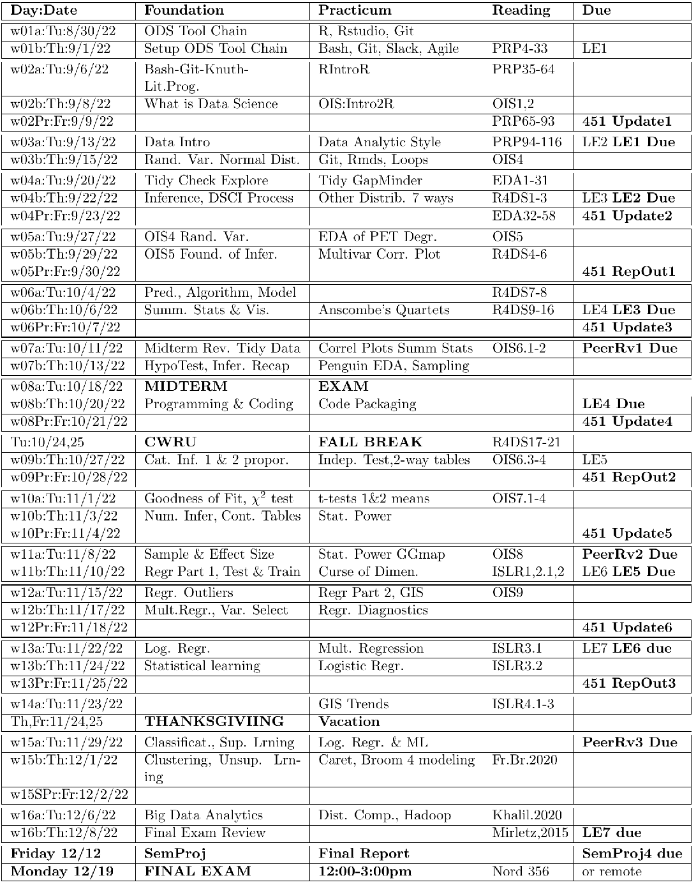

```{r setup, include = FALSE}
knitr::opts_chunk$set(
  cache = FALSE, # if TRUE knitr will cache results to reuse in future knits
  fig.width = 5, # the width for plots created by code chunk
  fig.height = 3, # the height for plots created by code chunk
  fig.align = 'center', # how to align graphics. 'left', 'right', 'center'
  dpi = 300, 
  dev = 'png', # Makes each fig a png, and avoids plotting every data point
  # eval = FALSE, # if FALSE, then the R code chunks are not evaluated
  # results = 'asis', # knitr passes through results without reformatting
  echo = TRUE, # if FALSE knitr won't display code in chunk above it's results
  message = TRUE, # if FALSE knitr won't display messages generated by code
  strip.white = TRUE, # if FALSE knitr won't remove white spaces at beg or end of code chunk
  warning = FALSE, # if FALSE knitr won't display warning messages in the doc
  error = TRUE) # report errors
  # options(tinytex.verbose = TRUE)
```

 \setcounter{section}{15}
 \setcounter{subsection}{1}
 \setcounter{subsubsection}{2}
 
#### Class Readings, Assignments, Syllabus Topics

##### Course Evaluations Are Open Now

-  lets get to 90% response rate

  - We want statistically significant results!
    - I look for suggestions on how to improve the course
  - [https://webapps.case.edu/courseevals/](https://webapps.case.edu/courseevals/)

##### Reading, Lab Exercises, SemProjects

  - Readings: 
    - For today: ISLR 3.1,3.2
    - For next class:  French & Bruckman 2020
  - Laboratory Exercises: 
    - LE7 : Due Thursday Dec. 8nd
    - LE7 : 
  - Office Hours: (Class Canvas Calendar for Zoom Link) 
    - Wednesday @ 4:00 PM to 5:00 PM, Will Oltjen
    - Saturday @ 3:00 PM to 4:00 PM, Kristen Hernandez 
    - **Office Hours are on Zoom, and recorded**
  - Semester Projects
    - DSCI 451 Students Biweekly Update 6 Due Friday November 18th
    - DSCI 451 Students 
      - Next 
    - All DSCI 351/351M/451 Students: 
      - **Peer Grading of Report Out #3 is Given out today**
    - Exams
      - Final: Monday December 19, 2022, 12:00PM - 3:00PM, Nord 356 or remote

#### Syllabus

 

### Logistic Regression 

```{r packages}
library(dplyr)
library(ggplot2)
library(broom)
library(forcats)
library(caret)
```

#### What is, Preparing data for, and how to evaluate, logistic regression

#### Logistic regression theory

##### What is a logistic regression?

- A logistic regression is a linear regression, 

  - applied to categorical outcomes 
  - by using the "logit", or log odds, transformation function.

##### A linear regression

- A linear regression 

  - uses a *line of best fit* 
    - (the old $y = mx + c$) 
    -  what we would call $Y = \beta_0 + \beta_1 X + \epsilon$
  - over multiple variables to predict a continuous variable.

{Are you familiar with `qplot` command?}

```{r xyc}
set.seed(777)
y_n <- rnorm(1000, 100, 25)
x_n <- y_n + rnorm(1000, 30, 20)

?qplot
qplot(x_n, y_n) + geom_smooth(method = "lm", se = FALSE) + theme_minimal()
```

##### Why do we need a transformation function?

- If you're trying to predict 

  - whether someone survives (1) or dies (0), 
  - does it make sense to say they're 
    - -0.2 alive, 0.5 alive, or 1.1 alive? 

```{r rbinom}
y_b <- rbinom(1000, size = 1, prob = .89)
qplot(y_b, binwidth = .5)
```

```{r}
x_b <- y_b + rnorm(1000)
qplot(x_b, y_b) + geom_smooth(method = "lm", se = FALSE) + theme_minimal()
```

##### What can we measure that is a continuous variable?

- We can measure the *probability* of someone surviving. 

  - This gives us data in the range $[ 0 , 1 ]$ 
    - which is better, 
  - but still not our ideal of $[-\infty,+\infty]$.

```{r probs}
prob_y <- seq(0, 1, by = .001)[-1]
qplot(y_b, prob_y) + theme_minimal() + geom_hline(aes(yintercept = .5),
                                                  linetype = "dashed",
                                                  colour = "red")
```

##### How can we transform it to be in the range we want?

- The *odds* of something happening are 

  - the probability of it happening versus 
  - the probability of it not happening can help us.

$$ \frac{p}{1-p} $$

As probability can never be less than 0 or greater than 1, 

  - we get a range between $[0, +\infty]$. 

```{r oddsdist}
odds_y <- prob_y / (1 - prob_y)
qplot(prob_y, odds_y) + theme_minimal()
```

##### How can allow negative values?

- The final step in this transformation 

  - is to take the log of the odds, 
  - which is commonly called the *logit*. 

This gets us to $[-\infty,+\infty]$.

```{r logitdist}
logit <- log(odds_y)
qplot(prob_y, logit) + theme_minimal()
```

##### Interpreting the results

```{r logittransform}
#install.packages("optiRum")
library(optiRum)
logits     <- -4:4
odds       <- logit.odd(logits)
probs      <- odd.prob(odds)
pred_class <- logits >= 0
knitr::kable(data.frame(logits, odds, probs, pred_class))
```

#### Logistic regressions in R

##### `glm()`  "generalized linear models"

- The `glm` function is used for performing logistic regressions. 

It can be used for other linear models too.

```{r glm}
?glm
glm(vs ~ mpg , data = mtcars, family = binomial(link = "logit"))
```

##### Formula

- R uses a formula system for specifying a model.

  - You put the outcome variable on the left
  - A tilde (`~`) is used for saying "predicted by"
  - Exclude an intercept term by adding `-1` to your formula
  - You can use a `.` to predict by all other variables e.g. `y ~ .`
  - Use a `+` to provide multiple independent variables e.g. `y ~ a + b`
  - You can use a `:` to use the interaction of two variables e.g. `y ~ a:b`
  - You can use a `*` to use two variables and their interaction e.g. `y ~ a*b` 
    - (equivalent to `y ~ a + b + a:b`)
  - You can construct features on the fly 
    - e.g. `y ~ log(x)` 
    -or use `I()` when adding values 
    - e.g. `y ~ I(a+b)`

For more info, check out `?formula`

##### Useful parameters

  - `na.action` can be set to amend the handling of missing values in the data
  - `model`,`x`,`y` controls whether you get extra info about the model and data back. 
    - Setting these to `FALSE` saves space

##### Functions working with `glm`

```{r }
df <-
  data.frame(
    Function = c(
      "coefficients",
      "summary",
      "fitted",
      "predict",
      "plot",
      "residuals"
    ),
    Purpose = c(
      "Extract coefficients",
      "Output a basic summary",
      "Return the predicted values for the training data",
      "Predict some values for new data",
      "Produce some basic diagnostic plots",
      "Return the errors on predicted values for the training data"
    )
  )
knitr::kable(df)

# kable is a simple way to make good looking tables in Rmd
?knitr::kable
```

##### Inputs

- You can provide a `glm` with continuous and categorical variables.

  >- Categorical variables get transformed into indicator (dummy) variables
  >- Continuous variables should ideally be scaled

#### Preparing data

##### Exploration

- Many ways to explore your data for outliers, patterns, issues etc.

```{r }
mtcarsVars <- mtcars[, colnames(mtcars)[colnames(mtcars) != "vs"]]
mtcarsOut <- mtcars[, "vs"]
```

```{r }
library(caret)
featurePlot(mtcarsVars, mtcarsOut)
```

##### Sampling

- Commonly, we will take a training sample and a testing sample.

```{r }
set.seed(77887)
trainRows <- createDataPartition(mtcarsOut, p = .7 , list = FALSE)
training_x <- mtcarsVars[trainRows,]
training_y <- mtcarsOut[trainRows]
testing_x <- mtcarsVars[-trainRows,]
testing_y <- mtcarsOut[-trainRows]
```

##### Why sample *before* processing?

- Sampling before scaling etc 

  - prevents information about the test data leaking into our model. 
  
By preventing such leaks 
 
  - we get a truer view of how well our model generalizes later.

##### Scaling variables

- **minmax** Express numbers 

  - as a percentage of the maximum 
    - after subtracting the minimum. 

This results in range $[0,1]$ 

  - for training data 
    - but can result in a different range in test data 
    - and, therefore, production!

$$ \frac{x - min(x)}{max(x) - min(x)} $$

- **z-score** Express numbers 

  - as the distance from the mean 
    - in standard deviations. 
    
This results in a range that's notionally $[-\infty,+\infty]$ 

  - and results will be in the same range in test data.
  
$$ \frac{x - mean(x)}{sd(x)} $$

Perform z-score scaling in R with the `scale` function:

```{r }
x <- rnorm(50, mean = 50, sd = 10)
x_s <- scale(x, center = TRUE, scale = TRUE)
summary(x_s)
```

##### Scaling variables

- Use `caret` package to scale multiple variables simultaneously and 

  - get a reusable scaling model for applying to test data, 
  - and eventually production data.

```{r}
transformations <- preProcess(training_x)
scaledVars <- predict(transformations, training_x)
knitr::kable(t(summary(scaledVars)))
```

##### Things to check for

  - Correlated variables 
  - Low variance columns 

the `caret` package is very useful for these

##### **Missingness**: How to handling missing values

- Common methods for coping with missing data:

  - Removing rows with missing values
    - Con: reduces sample size
    - Pro: use only complete data
  - [Continuous variables only] Putting in a default value like mean
    - Con: tends to flatten model coefficient for variable
    - Pro: simple to do
  - Putting in a predicted value
    - Con: requires another set of data
    - Pro: realistic values
  - [Continuous variables only] Making variable a categorical with an explicit missing category
    - Con: information loss on continuous variables
    - Pro: explicit modeling of missingness
    
#### Building models

##### Initial models

- I try to build some candidate models:

  - All variables
  - A few strongest variables

##### Stepwise variable selection

```{r }
fullmodel <- glm(training_y ~ .,
                 data = training_x,
                 family = binomial(link = "logit"))
steppedmodel <- step(fullmodel, direction = "both", trace = FALSE)
```

```{r }
summary(steppedmodel)
```

##### Other model types

  - Different logistic regression variants 
    - like the `glmnet`, `glm` packages
  - Different models 
    - like classification trees

##### Others

  - You can also try with different loss or error functions 
  - You should try "common sense" models

#### Evaluating `glm`s

##### `broom`

- Use `broom` to make tidy versions of model outputs.

```{r}
library(broom)
# Coefficients
knitr::kable(tidy(steppedmodel))
```

##### `broom`

- Use `broom` to make tidy versions of model outputs.

```{r}
# Fitted data
knitr::kable(head(augment(steppedmodel)))
```

##### `broom`

- Use `broom` to make tidy versions of model outputs.

```{r}
# Key statistics
knitr::kable(glance(steppedmodel))
```

##### Coefficients

  - Are the coefficient signs in the right directions?
  - How significant are they?
  - How important are they? 

##### Key metrics

- *Residual deviance* is a measure of how much error is in the model, 

  - after considering all the variables in the model. 
  - The smaller the residual deviance, the better.
  
[deviance](https://en.wikipedia.org/wiki/Deviance_(statistics))

```{r }
deviance(fullmodel)
```

*Akaike’s information criterion (AIC)* 

  - is a measure of information captured by a model 
    - and penalizes more variables over fewer variables. 
  - The smaller the AIC, the better.
  
[AIC information theory](https://en.wikipedia.org/wiki/Akaike_information_criterion)

The Akaike information criterion (AIC) 

  - is an estimator of out-of-sample prediction error 
    - and thereby relative quality of statistical models 
    - for a given set of data.
  - Given a collection of models for the data, 
    - AIC estimates the quality of each model, 
    - relative to each of the other models. 
  - Thus, AIC provides a means for model selection.

AIC is founded on [information theory](https://en.wikipedia.org/wiki/Information_theory). 

  - When a statistical model is used 
    - to represent the process that generated the data, 
    - the representation will almost never be exact; 
  - so some information will be lost 
    - by using the model to represent the process. 
  - AIC estimates the relative amount of information lost by a given model: 
    - the less information a model loses, 
    - the higher the quality of that model.

```{r }
AIC(fullmodel)
```

##### Classification rates

- A [Confusion Matrix](https://en.wikipedia.org/wiki/Confusion_matrix)

  - is a specific table layout that allows 
    - visualization of the performance of an algorithm, 
    - typically a supervised learning one. 
  - Each row of the matrix represents 
    - the instances in a predicted class 
    - while each column represents the instances in an actual class. 
  - The name stems from the fact that it makes it easy to see 
    - if the system is confusing two classes 
    - (i.e. commonly mislabeling one as another).

It is a special kind of [contingency table](https://en.wikipedia.org/wiki/Contingency_table), 

  - with two dimensions ("actual" and "predicted"), 
    - and identical sets of "classes" in both dimensions 
    - (each combination of dimension and class 
    - is a variable in the contingency table).

A contingency table 

  - (also known as a **cross tabulation** or **crosstab**) 
  - is a type of table in a matrix format 
    - that displays the (multivariate) frequency distribution of the variables. 
  - They are heavily used in 
    - survey research, business intelligence, engineering, & scientific research. 
  - They provide a basic picture of 
    - the interrelation between two variables 
    - and can help find interactions between them. 

Lets look at the confusion matrix
 
  - On the **training** data
  - And **predicting** on the training data

```{r }
training_pred <-
  ifelse(predict(steppedmodel, training_x) > 0, "1", "0")
training_pred <- factor(training_pred)
training_y <- factor(training_y)
confusionMatrix(training_pred, training_y)
```

##### Classification rates

- Now lets look at the confusion matrix
 
  - On the **testing** data
  - And **predicting** on the testing data

```{r }
testing_pred <- ifelse(predict(fullmodel, testing_x) > 0, "1", "0")
testing_pred <- factor(testing_pred)
testing_y <- factor(testing_y)
confusionMatrix(testing_pred, testing_y)
```

#### Links

  - [Steph Locke](https://itsalocke.com/blog/logistic-regressions-in-r/)
  