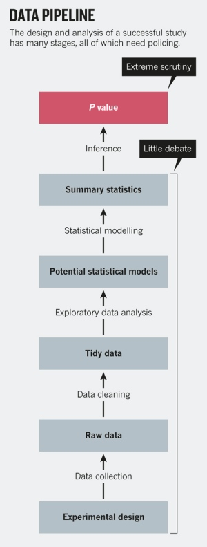
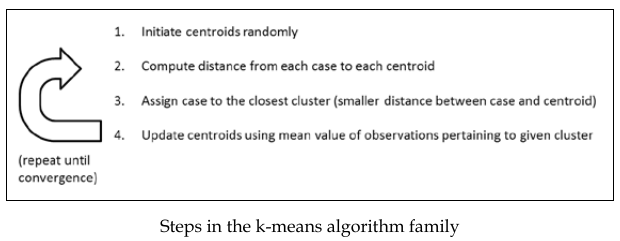

 

```{r setup, include=FALSE}
knitr::opts_chunk$set(
  cache = FALSE, # if TRUE knitr will cache results to reuse in future knits
  fig.width = 5, # the width for plots created by code chunk
  fig.height = 3.5, # the height for plots created by code chunk
  fig.align = 'center', # how to align graphics. 'left', 'right', 'center'
  dpi = 300, 
  dev = 'png', # Makes each fig a png, and avoids plotting every data point
  # eval = FALSE, # if FALSE, then the R code chunks are not evaluated
  # results = 'asis', # knitr passes through results without reformatting
  echo = TRUE, # if FALSE knitr won't display code in chunk above it's results
  message = TRUE, # if FALSE knitr won't display messages generated by code
  strip.white = TRUE, # if FALSE knitr won't remove white spaces at beg or end of code chunk
  warning = FALSE, # if FALSE knitr won't display warning messages in the doc
  error = TRUE) # report errors
  # options(tinytex.verbose = TRUE)
```

\setcounter{section}{15}
\setcounter{subsection}{2}
\setcounter{subsubsection}{1}
 

<!-- License CC by SA 4.0 -->


#### Geo-spatiotemporal data science 

##### For Wind on the globe

- [Windyty](https://www.windyty.com/?gust,2016-02-28-18,40.472,-61.708,2)

Another Geo-spatiotemporal application

  - Using distributed computing and Hadoop/Hbase/Spark
  - And Satellite imagery  
  
##### For more diverse applications

- [IBM's Environmental Intelligence Suite](https://ibmpairs.mybluemix.net/)


#### Who has heard of **DeepMind Alpha Fold**

- [AlphaFold: a solution to a 50-year-old grand challenge in biology](https://deepmind.com/blog/article/alphafold-a-solution-to-a-50-year-old-grand-challenge-in-biology)

Proteins are essential to life, supporting practically all its functions. 

They are large complex molecules, 

  - made up of chains of amino acids, 
  - and what a protein does largely depends on its unique 3D structure. 

Figuring out what shapes proteins fold into 

  - is known as the “protein folding problem”, 
  - and has stood as a grand challenge in biology for the past 50 years. 

In a major scientific advance, 

  - the latest version of our AI system AlphaFold 
  - has been recognised as a solution to this grand challenge 
    - by the organisers of 
    - the biennial Critical Assessment of protein Structure Prediction (CASP). 
  
This breakthrough demonstrates the impact AI can have on scientific discovery

  - and its potential to dramatically accelerate progress 
  - in some of the most fundamental fields 
    - that explain and shape our world.

##### Nature magazines take on this

- [‘It will change everything’: DeepMind’s AI makes gigantic leap in solving protein structures](https://www.nature.com/articles/d41586-020-03348-4)

##### AlphaFold has been applied to COVID-19 Research

- [Computational predictions of protein structures associated with COVID-19](https://deepmind.com/research/open-source/computational-predictions-of-protein-structures-associated-with-COVID-19)


#### Nature: P values are just the tip of the iceberg

- So Null Hypothesis Testing has been foundation of much research

  - For the past 100 years
  - But P-hacking makes it problematic

[Statistics: P values are just the tip of the iceberg](http://www.nature.com/news/statistics-p-values-are-just-the-tip-of-the-iceberg-1.17412?WT.mc_id=TWT_NatureNews)


P values, the 'gold standard' of statistical validity, are not as reliable as many scientists assume.

+ [Scientific method: Statistical errors](http://www.nature.com/news/scientific-method-statistical-errors-1.14700)


#### Data Analytics Pipeline

- From [Peng Leek](http://www.nature.com/news/statistics-p-values-are-just-the-tip-of-the-iceberg-1.17412?WT.mc_id=TWT_NatureNews)




#### Cluster Analysis: An example of unsupervised learning

- Unsupervised cluster analysis refers to algorithms 

  - that aim at producing homogeneous groups of cases from unlabeled data. 

Unlabeled data: 

  - where we don't have a response Y variable, 
  - just a number of predictor variables.

The algorithm doesn't know beforehand 

  - what the membership to the groups is, 
  - and its goal is to find the structure of the data 
  - from similarities (or differences) between the cases; 

A cluster is a group of cases, observations, individuals, or other units, 

  - that are similar to each other on the considered characteristics. 
  - These characteristics can be anything measurable or observable. 
    
The choice of characteristics, or attributes, is important 

  - as different attributes will lead to different clusters.

We'll discuss the following:

  - Distance measures
  - Partition clustering with k-means, 
    - including the steps in the computations of clusters, and 
    - the selection of the best number of clusters
  - Applications of k-means clustering

Clustering algorithms use distance measures between the cases 

  - in order to create these homogeneous groups of cases. 

It is therefore important to 

  - transform the data on all dimensions to a similar scale 
  - before performing partition clustering with tools such as kmeans(). 

This is important because the distances are computed 

  - from all the dimensions we consider. 
    - If one dimension has a range of values higher than the others 
  - (for example, values in centimeters compared to meters), 
  - differences in this dimension will be given much more importance compared to the others. 

This is also true for agglomerative clustering, 

  - with tools such as hclust(), 
  - or any algorithm using distance measures,
    - such as nearest neighbor classification, 
    - which we will also discuss.


#### Distance measures in clustering

##### Partitioning clustering algorithms

- Partitioning clustering algorithms 

  - iteratively define k cluster centers and 
  - assign cluster membership 
    - (or the probability of group membership) 
  - to cases based on distances between the case and the cluster. 

##### Agglomerative clustering algoriths

- Agglomerative clustering algorithms 

  - also create clusters based on distances, 
  - starting with each individual belonging to a separate cluster 
  - and the grouping clusters two by two. 

The k-nearest neighbors algorithm also uses distance measures.

Consider only one attribute, for instance the height of individuals. 

The distance of someone measuring 180 cm 

  - and someone measuring 170 cm will be 10 
  - on this sole dimension considering the algebraic difference 
  - between the two measures as our distance metric. 

Things get a little more complicated 

  - when we add more attributes, 
  - such as weight (we will not consider variable scaling here). 

Let's say the first individual is clearly overweight (90 kg), 

  - and the second has a normal weight (80 kg). 

Considering only the sum of the difference 

  - between the measures as our distance metric, 
  - the difference between the individuals would be: 
    - (180-170) + (90-100) = 0. 

This clearly doesn't reflect the huge differences between these individuals; 

  - one is bigger and slimmer than the other. 

Several distance metrics are available. Here are some examples: 

##### Euclidean and Manhattan distances

- The metrics closest to the sum of differences measure we just examined 

  - are the Euclidean and the Manhattan distances. 
  - The Manhattan distance 
    - sums the absolute value of the differences on all considered dimensions. 
  - The Euclidean distance 
    - sums the squares of the differences and then performs a square root on the result. 
  - In case of only one dimension, 
    - the result is equal to the difference between observations. 

#### A quick fast example of k-means clustering

- Use the iris dataset for Petal.Length and Petal.Width

##### What is k-Means Clustering?

- [k-means clustering](https://en.wikipedia.org/wiki/K-means_clustering)

K Means Clustering is an unsupervised learning algorithm 

  - that tries to cluster data based on their similarity. 

Unsupervised learning means that there is no outcome to be predicted, 

  - and the algorithm just tries to find patterns in the data. 

In k means clustering, 

  - we have to specify the number of clusters 
  - we want the data to be grouped into. 

The algorithm randomly assigns each observation to a cluster, 

  - and finds the centroid of each cluster. 

Then, the algorithm iterates through two steps:

  - Reassign data points to the cluster whose centroid is closest.
  - Calculate new centroid of each cluster.

These two steps are repeated 

  - till the within cluster variation cannot be reduced any further. 

The within cluster variation is calculated 

  - as the sum of the euclidean distance between the data points 
  - and their respective cluster centroids


```{r}
library(datasets)
head(iris)
```

Now library in ggplot2

```{r}
library(tidyverse)
ggplot(iris, aes(Petal.Length, Petal.Width, color = Species)) + geom_point()
```

Now do the k-means clustering on these variables

```{r}
set.seed(99)
irisCluster <- kmeans(iris[, 3:4], 3, nstart = 20)
irisCluster
```

Since we know that there are 3 species involved, 

  - we ask the algorithm to group the data into 3 clusters, 
  - and since the starting assignments are random, 
    - we specify nstart = 20. 

This means that R will try 20 different random starting assignments and 

  - then select the one with the lowest within cluster variation.

We can see the cluster centroids, 

  - the clusters that each data point was assigned to, 
  - and the within cluster variation.

```{r}
table(irisCluster$cluster, iris$Species)
```

As we can see, the data belonging to 

  - the setosa species got grouped into cluster 3, 
  - versicolor into cluster 2, and 
  - virginica into cluster 1. 

The algorithm wrongly classified 

  - two data points belonging to versicolor 
  -   and six data points belonging to virginica.

We can also plot the data to see the clusters:

```{r}
irisCluster$cluster <- as.factor(irisCluster$cluster)
ggplot(iris,
       aes(Petal.Length, Petal.Width, color = irisCluster$cluster)) + 
  geom_point()
```


#### Partition clustering with k-means: A non-optimal "internal-workings" example

- Perhaps the most widely used clustering family of algorithms is k-means. 

In this section, we will examine how it works and 

  - ways to assess the quality of a clustering solution.

K-means is a partitioning algorithm 

  - that produces k (user-defined number) clusters of cases 
  - that are more similar to each other than to cases outside the cluster. 

K-means starts by randomly initiating the centroid 

  - (the value of the considered dimensions) of each cluster. 

From now, the process, aiming at creating homogeneous clusters, 

  - is iterative until a final solution is found. 
  - For each case, the distance from the centroid of each cluster is computed, 
    - and cases are assigned to the closest cluster. 
  - After this step, k-means computes the new values of the centroid of each cluster, 
    - as the means of all the cases belonging to the cluster. 
  - The process stops when the distance between the cases 
    - and the centroid is not decreasing anymore. 

It is noteworthy that the final result at convergence 

  - depends upon the initial random values of the centroids. 

For this reason, it is advocated to configure kmeans() 

  - to repeat the process several times 
  - and select the best solution (using the nstart argument). 

The figure below illustrates this process. 

We will only use the default algorithm with kmeans(), 

  - but the function provides several to choose from
  - Hartigan-Wong, Lloyd, Forgy, and MacQueen
    - using the algorithm argument. 
    
We will discuss this later. 

  The interested reader can inquire about the differences 
  
  - using the references provided in the ad-hoc R manual page (type ?kmeans in the console).



In what follows, we will build our own k-means implementation 

  - in order to better understand its functioning. 

There is a slight difference in our implementation 

  - in that we do not initiate the centroids randomly. 

Instead we will attribute membership to the clusters randomly, 

  - and then compute the centroids. 

This is equivalent, but easier programmatically. 

**This implementation is intended only for pedagogical purposes.**

It lacks several important features, and sometimes converges non-optimally. 

For proper analyses, 

  - please use kmeans() 
  - or an implementation from another package available on CRAN.

##### Setting the centroids

- First, we need a function that attributes membership to the clusters randomly. 

We do this for all the observations at the same time, 

  - and return the result as vector clusters (see line 2). 

Our function takes 2 arguments: 

  - the number of observations (numrows) 
  - and the number of clusters (k).

```{r}
set.random.clusters <- function(numrows, k) {
  clusters = sample(1:k, numrows, replace = T)
}
```

We then create a function that computes the centroids, 

  - that is, the means for each case on each dimension and each cluster. 

Our function takes 2 arguments: 

  - the data frame on which to cluster the data (df), 
  - and the current cluster assignments (clusters).

```{r}
compute.centroids <- function(df, clusters) {
  means <- tapply(df[, 1], clusters, mean)
  for (i in 2:ncol(df)) {
    mean.case <- tapply(df[, i], clusters, mean)
    means <- rbind(means, mean.case)
  }
  centroids <- data.frame(t(means))
  names(centroids) <- names(df)
  centroids
} 
```

On line 2, we assign to vector means 

  - the mean values of attribute in column 1 for each of the clusters. 

In a loop, we assign to vector mean.case 

  - the values of attribute in column i for each cluster, 
  - and append it to means (lines 4 and 5). 

We then make a data frame 

  - from the transpose of object means and 
  - assign it to object centroids (line 8) 

We name the columns of this object 

  - as the columns in the original data frame (line 9).

Finally we return centroids (line 9).


##### Computing distances to centroids

- We then need a function that computes 

  - the distance between the actual values 
  - and the centroid of the clusters. 
  
This function takes the data and the centroids as arguments. 

It first creates a blank matrix that will contain the distances (line 2). 

It then loops over the cases and the clusters 

  - (see the code blocks started on lines 3 and 4) and 
  - computes the squares of the differences 
    - for the current case and current cluster, 
  - computes the square root of those, and 
  - assigns the value to the correct spot in the matrix (line 5).

It finally returns the matrix of Euclidean distances (line 8).

```{r}
euclid.sqrd <- function(df, centroids) {
  distances <- matrix(nrow = nrow(df), ncol = nrow(centroids))
  for (i in 1:nrow(df)) {
    for (j in 1:nrow(centroids)) {
      distances[i, j] <- sum((df[i, ] - centroids[j, ]) ^ 2)
    }
  }
  distances
}
```

##### Computing the closest cluster for each case

- We now need a function that will compare, for each case, 

  - its distance to each of the clusters and 
  - select the cluster where this value is minimum 
  - that is, assign the case to a cluster based on this comparison. 

For this purpose, on line 2, 

  - we simply use the which.min() function, 
    - which indicates in which column the minimal value is, 
  - as an argument of the apply() function, 
    - which applies a function to each row of its input.

We wrap this in the cbind() function, 

  - which allows it to return column-shaped vectors. 

If the number of returned clusters is less than expected 

  - (tested on line 3), 
  -  we restart the process by assigning cases to random clusters, 
  - using the set.random.clusters() function (line 5). 

In other words, we take the precaution of 

  - restarting the process of setting the centroids randomly 
  - if we find an empty cluster.

```{r}
assign <- function(distances) {
  clusters <- data.frame(cbind(c(apply(
    distances, 1, which.min
  ))))
  if (nrow(unique(clusters)) < ncol(distances)) {
    #precaution in case of empty cluster
    clusters <- set.random.clusters(nrow(distances), ncol(distances))
  }
  clusters
} 
```

##### Tasks performed by the main function

- We now almost have everything we need for our basic k-means implementation.

We finally need to wrap this together in a main function, 

  - which we call kay.means() .

Here we set initial cluster value (line 2) 

  - and then iterate over the computation of centroids (line 7), 
  - the calculation of distances (line 8), 
  - and the re-assignment of clusters (line 11).

Notice the code block is contained in a while loop, 

  - which stops when the sum of squares of the distances 
    - (that is the total sum of squares within clusters) 
  - is the same twice in a row 
    - (when ss.old equal to ss this value is set on line 10), and 
  - output the clustering solution (line 14).

```{r}
kay.means <- function(df, k) {
  clusters = set.random.clusters(nrow(df), k)
  ss.old = 1e100
  ss = 1e99
  while (ss != ss.old) {
    centroids <- compute.centroids(df, clusters)
    distances <- euclid.sqrd(df, centroids)
    ss.old <- ss
    ss <- sum(distances)
    clusters <- assign(distances)
  }
  names(clusters) <- "Clusters"
  clusters
}
```

Let's try this using a very popular dataset, 

  - which we have already encountered in the previous chapter: 
  - the iris dataset, where observations are 150 iris flowers. 

Attributes are the species of the flowers and their petal and sepal length and width. 

So, in this case, we know the groups beforehand 
  
  - and are interested in knowing whether 
  - k-means can predict it from the other attributes. 

Let's start by having a look at the correct classification, 

  - which is in the 5th column of the data set.

You will see in your console that 

  - cases 1 to 50 are of species Setosa, 
  - cases 51 to 100 are of species Versicolor, and 
  - cases 101 to 150 of species Virginica.

We will use our knowledge of the dataset 

  - to determine the number of clusters. 

We select three clusters as we know there are three species. 

We will talk later about determining the number of clusters 

  - when this information is not available.

```{r}
glimpse(iris[5])
```

#### Validation of our clustering method

- Our goal now is to assess the quality of our clustering solution. 

**We are lucky, as we have the right answer already (which is not always the case).** 

In order to check how well our clustering solution did, 

  - we first append a column to the iris dataset 
    - with the clustering solution of our implementation of k-means, and 
    - observe the convergence between the clustering and the species 
    - by creating a cross-tabulation of the data.

```{r}
set.seed(99)
irisClust <- cbind(iris, kay.means(iris[1:4], 3))
tableClust <- table(unlist(irisClust[5]), unlist(irisClust[6]))
tableClust
```

Our implementation of k-means did a good job on this dataset: 

  - flowers of the Setosa species are classified in cluster 3, 
  - flowers of the Versicolor species are **almost all** classified in cluster 2, 
  - while flowers of the Virginica species **are mostly** classified in cluster 1, 
    - with a larger degree of misclassifications in cluster 2 (about a third). 

##### Other measures of correctness: Cohen's Kappa
    
- As we have information about the correct solution, 

  - we can compute indices of the correctness of our cluster solution. 

For instance, we can compute Cohen's kappa, 

  - which assesses the agreement of our clustering solution with the correct one. 

See the paper [A coefficient of agreement for nominal scales, by Cohen (1960)](http://dx.doi.org/10.1177/001316446002000104) for a description of the measure. 

The closer its value is to 1, the better the agreement. 

This index is in the psych package, 

  - which needs installing and loading 
  - before we proceed with the analysis.

```{r}
# if(!require("psych")) install.packages("psych")
library(psych)
```

The index requires that categories are given the same name 

  - in both the classification and the original solution. 

We therefore need to recode our data to proceed:

```{r}
irisClust <- cbind(irisClust, rep(0, nrow(irisClust)))
names(irisClust[7]) <- "Species.recode"
irisClust[7][irisClust[5] == "setosa"] = 3
irisClust[7][irisClust[5] == "versicolor"] = 2
irisClust[7][irisClust[5] == "virginica"] = 1
```

We now have the data of both 

  - our clustering solution (in column 6) 
  - and the correct solution (in column 7) in the same format. 
  
We can now apply [Cohen's kappa](https://en.wikipedia.org/wiki/Cohen%27s_kappa) to our data:

```{r}
kappa = cohen.kappa(cbind(irisClust[6], irisClust[7]))
glimpse(kappa)
```

Cohen Kappa and Weighted Kappa correlation coefficient 

  - and confidence boundary output is as follows:


##### rand index, 

- We can also compute the rand index, 

  - which is another measure of agreement. 

We can find it in the flexclust package. 

  - Please install and load it before you proceed:

Here we can simply reuse the cross-tabulation we produced earlier:


```{r}
# if(!require("flexclust")) install.packages("flexclust")
library(flexclust)
randIndex(tableClust)
```

The value of the index is .716, 

  - indicating also a good agreement. 

Try using the kay.means() function with a different seed, 

  - such as 3 for instance, 
  - and notice the differences.

##### Summary

- While clustering solutions using k-means 

  - are always dependent on initial centroid values, 
  - our implementation is even more vulnerable. 

It is always a good idea to perform a cluster analysis 

  - with different seeds, 
  - which we will do later using the nstart argument with kmeans(). 

Nevertheless, our custom function fulfilled its purpose, 

  - which is to give the reader a sense of how k-means works.


#### Cites

  - [K-means clustering in R](http://datascienceplus.com/k-means-clustering-in-r/)
  - Learning Predictive Analytics with R, Eric Mayor, Packtpub 2015

