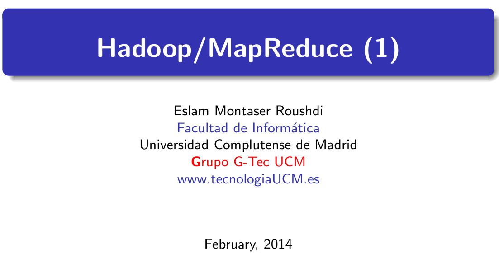
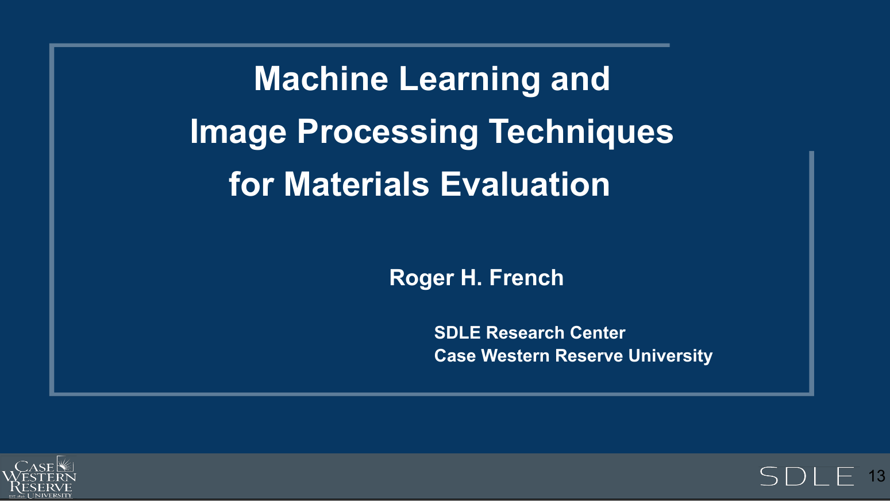

```{r setup, include=FALSE}
knitr::opts_chunk$set(
  cache = FALSE,
  # if TRUE knitr will cache results to reuse in future knits
  fig.width = 6,
  # the width for plots created by code chunk
  fig.height = 4,
  # the height for plots created by code chunk
  fig.align = 'center',
  # how to align graphics. 'left', 'right', 'center'
  dpi = 300,
  dev = 'png',
  # Makes each fig a png, and avoids plotting every data point
  # eval = FALSE, # if FALSE, then the R code chunks are not evaluated
  # results = 'asis', # knitr passes through results without reformatting
  echo = TRUE,
  # if FALSE knitr won't display code in chunk above it's results
  message = TRUE,
  # if FALSE knitr won't display messages generated by code
  strip.white = TRUE,
  # if FALSE knitr won't remove white spaces at beg or end of code chunk
  warning = TRUE,
  # if FALSE knitr won't display warning messages in the doc
  error = TRUE
) # report errors
# options(tinytex.verbose = TRUE)
```

\setcounter{section}{16}
\setcounter{subsection}{1}
\setcounter{subsubsection}{2}

#### Reading, Homeworks, Projects, SemProjects

  - Readings: 
    - For Today: Khalilnejad article, Khalilnejad et al_2020_Automated Pipeline Framework for Processing of Large-Scale Building Energy Time.pdf
    - For Thursday: Mirletz article in 3-readings/4-MatSci-And-SemProjReadings
      - [](../3-readings/4-MatSci-And-SemProjReadings/Mirletz et al. - 2015 - Degradation of transparent conductive oxides Inte.pdf)
  - Lab Exercises: 
    - LE7 due Thursday December 8th
  - 451 SemProjects:  
    - SemProj Peer Review 3 Due this past Tuesday
    - Final full SemProject Written Report Due Friday 12/11
  * Final Exam
    *  Final: Monday December 19, 2022, 12:00PM - 3:00PM, Nord 356 or remote

#### Final Exam ( worth 20 pts)

  - Will be held Monday 12/19
      - From 12pm to 3pm
  - Comprehensive overview of the course 
  
##### Before the final exam

- Confirm that you can 

  - `git push` and `git pull` your class repo
  
Confirm that you have your personal course Repo

  - Cloned on Ondemand.case.edu, Markov Data Science Cluster
    - in /mnt/pan/courses/dsci351-451/caseID/Git/...
  - And on myapps.case.edu, Open Data Science (ODS) Desktop
    - in /h/Git/....

So using the five commands on your fork of the git "...Prof" repository

  - `git pull`
  - `git status`
  - `git add --all :/`
  - `git status`
  - `git commit -m 'my commit message'`
  - `git status`
  - `git push`

##### Also confirm that you are running in Markov, and tested ODS Desktop 

  - And confirm that you have this when you first launch your Rstudio-4.2.2 app
    - in your R console of Rstudio
    - And the R version is now 4.2.2
  - On Markov, Check `.libPaths()` and that the first entry is
    - `[1] "/home/rxf131/ondemand/ubuntu2004/r4"`

  --------------------

 initializing... 

 R lib path check:  /home/rxf131/Kub1804/R-4.1.1 /usr/local/lib/R/site-library /usr/lib/R/site-library /usr/lib/R/library 

 Python path check:  /usr/local/lib/python3.6/dist-packages:/home/rxf131/Kub1804/Py3-packages 

 Time zone check:  America/New_York 

  --------------------

If you don't have "R lib path check: "

  - With "/home/rxf131/Kub1804/R-4.1.1"
    - As the FIRST directory in the list
  - Then you need to run the `source .....` command
    - That is in the "FixRstudioServer-R-libPaths.txt"
    - in the root directory of your class repo
  - The command to run is 
    - `source('/home/rxf131/ondemand/share/config/r-lib-path-fix.R')`

##### Final Exam Format

  - The exam will appear in the prof repo
  - In /assignments/finalexam folder
  - Done as Rmd file to turn in as .pdf report
  - Submit Final Exam .Rmd, .pdf to the Canvas Assignment Page
  - If you have problems compiling to .pdf
    - Then instead compile to .html
    - Open that html file in your browser
    - Print it to file, as a .pdf
    - And upload that .pdf, with the .Rmd to the Canvass Assignment page


##### Types of Questions

  - 8 questions total
  - OI Stats questions to do
  - Data Wrangling: Tidying, EDA
    - Read **Mirletz article**
  - 5 Paragraph Essay Question with cites: about Data Science 
    - Citations to literature supporting your discussion
      - These are done as footnotes
      - Format: Author, Title, Source:Journal,Magazine, Page, Year, URL link
  - Data Analysis: Modeling using Linear Regression

##### Points per question 

  - 1. OIS 1 pt
  - 2. OIS 1 pt
  - 3. OIS 1 pt
  - 4. Tidy data wrangling 2 pt
  - 5. EDA, Summary Stats & Visualization 3 pts
  - 6. 5 paragraph Essay 4 pts
  - 7. EDA on Real Dataset problem 4 pts
  - 8. Linear Regression on a dataset 4 pts

#### Course Evaluations

  - Please fill out and give feedback 
    - On what works, what needs improvement
  - [Course Eval Form To Fill Out](https://webapps.case.edu/courseevals/)

**We currently have 12% response rate**

  - So please go fill out the course evaluation

#### Questions on Course

##### Overarching Goal of Course

  - Teach you how to do real data analysis projects
    - Using a modern data analysis tool chain
    - Using real-world and lab-based (messy) datasets
  - Learn EDA to explore and discover insights from your data
    - And identify new data and metadata needed for data assembly

To achieve these goals 

  - What could be done better 

##### Utility of the 3 text books (R4DS, OIS, ISLR)

  - Which did you find useful? 
  - Which were not useful? 

##### The 3 books we used 

  - (R4DS) R for Data Science 
  - (OIS) Open Intro Stats v3 
  - (ISLR) Introduction to Statistical Learning with Applications in R 
  

##### Git Class Repo structure to class 

  - This is a basic open-source collaboration method 
    - did not use repo for turning in assignments 
    - better by Git or by Blackboard/Canvas? 

#### Hadoop and Big-Data Analytics

##### 3 Seminal Papers from Google

- Google File System

- Copies of these papers are in your readings folder of your Repo.

  - Ghemawat, S., Gobioff, H., Leung, S.-T., 2003. The Google file system. ACM SIGOPS Operating Systems Review 37, 29–43. [doi:10.1145/1165389.945450](http://dx.doi.org/10.1145/1165389.945450)
  - [Google File System](../3-readings/4-Hadoop/Ghemawatetal-2003-TheGooglefilesystem.pdf)
  
##### MapReduce

  - Dean, J., Ghemawat, S., 2004. MapReduce: Simplified Data Processing on Large Clusters. Communications of the ACM 51, 107–113. [doi:10.1145/1327452.1327492](http://dx.doi.org/10.1145/1327452.1327492)
  - [Google File System]("../3-readings/4-Hadoop/DeanandGhemawat-2004-MapReduceSimplifiedDataProcessingonLargeClu.pdf")
  
##### BigTable

  - Chang, F., Dean, J., Ghemawat, S., Hsieh, W.C., Wallach, D.A., Burrows, M., Chandra, T., Fikes, A., Gruber, R.E., 2006. Bigtable: A Distributed Storage System for Structured Data. ACM Transactions on Computer Systems (TOCS) 26, 1–26. [doi:10.1145/1365815.1365816](10.1145/1365815.1365816)
  - [BigTable]("../3-readings/4-Hadoop/Changetal-2006-BigtableADistributedStorageSystemforStructu.pdf")

#### Lets get introduced to the concepts

##### Hadoop/MapReduce

- [Hadoop/MapReduce](2108-351-351m-451-w15b-f1-Hadoop1.pdf)



##### Hadoop/Hbase/SPARK: CRADLE Analytics for ML/AI

- [CRADLE Analytics](2108-351-351m-451-w15b-f2-CRADLE-Analytics.pdf)



[NoSQL Data Warehouse and Analytics Environment](../3-readings/4-MatSci-And-SemProjReadings/Hu et al. - 2017 - A Nonrelational Data Warehouse for the Analysis of.pdf)


[Automated pipeline framework for processing of large-scale building energy time series data ](../3-readings/4-MatSci-And-SemProjReadings/Khalilnejad et al. - 2020 - Automated Pipeline Framework for Processing of Lar.pdf)

##### SPARK for stream processing (In RAM)

- [Apache Spark Tutorials](http://spark.apache.org/documentation.html)

#### Citations


