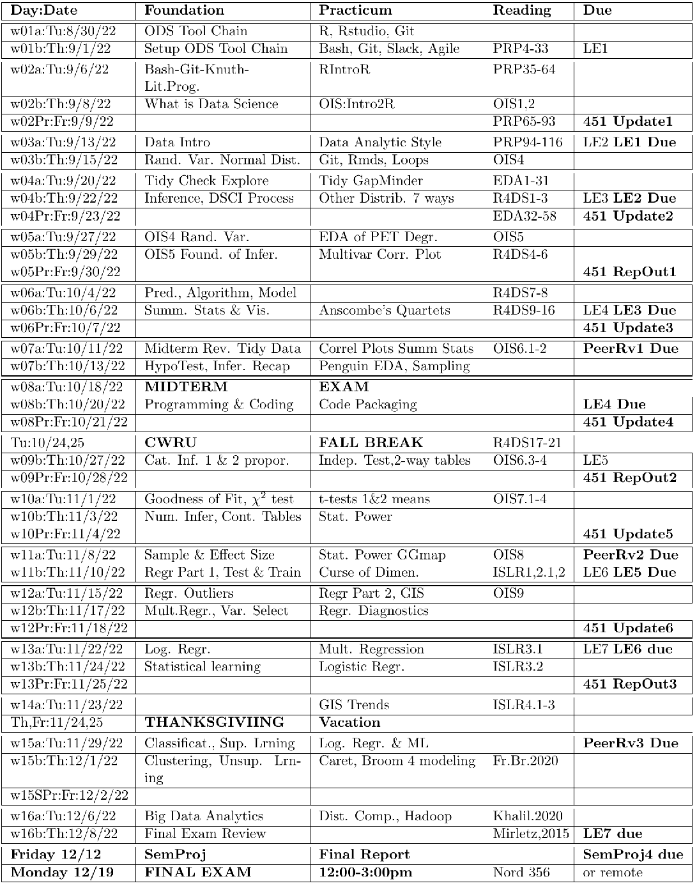

 
```{r setup, include=FALSE}
knitr::opts_chunk$set(
  cache = FALSE, # if TRUE knitr will cache results to reuse in future knits
  fig.width = 6, # the width for plots created by code chunk
  fig.height = 4, # the height for plots created by code chunk
  fig.align = 'center', # how to align graphics. 'left', 'right', 'center'
  dpi = 300, 
  dev = 'png', # Makes each fig a png, and avoids plotting every data point
  # eval = FALSE, # if FALSE, then the R code chunks are not evaluated
  # results = 'asis', # knitr passes through results without reformatting
  echo = TRUE, # if FALSE knitr won't display code in chunk above it's results
  message = TRUE, # if FALSE knitr won't display messages generated by code
  strip.white = TRUE, # if FALSE knitr won't remove white spaces at beg or end of code chunk
  warning = TRUE, # if FALSE knitr won't display warning messages in the doc
  error = TRUE) # report errors
  # options(tinytex.verbose = TRUE)
```

 \setcounter{section}{16} 
 \setcounter{subsection}{2} 
 \setcounter{subsubsection}{1} 

#### Reading, Homeworks, Projects, SemProjects

  - Readings: 
    - For last Class: Khalilnejad article, Khalilnejad et al_2020_Automated Pipeline Framework for Processing of Large-Scale Building Energy Time.pdf
    - For Thursday: Mirletz article in 3-readings/4-MatSci-And-SemProjReadings
      - [](../3-readings/4-MatSci-And-SemProjReadings/Mirletz et al. - 2015 - Degradation of transparent conductive oxides Inte.pdf)
  - Lab Exercises: 
    - LE7 due Thursday December 8th
  - 451 SemProjects:  
    - SemProj Peer Review 3 Due this past Tuesday
    - Final full SemProject Written Report Due Friday 12/11
  * Final Exam
    *  Final: Monday December 19, 2022, 12:00PM - 3:00PM, Nord 356 or remote

#### Textbooks

  - [Peng: R Programming for Data Science](https://leanpub.com/rprogramming)
  - [Peng: Exploratory Data Analysis with R](https://leanpub.com/exdata)
  - [Open Intro Stats, v4](https://openintro.org/os)
  - [Wickham: R for Data Science](https://r4ds.had.co.nz/)
  - [Hastie: Intro to Statistical Learning with R](http://faculty.marshall.usc.edu/gareth-james/ISL/)

##### Tidyverse Cheatsheets, Functions and Reading Your Code

Look at the Tidyverse Cheatsheet 

  - **Tidyverse For Beginners Cheatsheet**
    - In the Git/20s-dsci353-353m-453-prof/3-readings/3-CheatSheets/ folder
  - **Data Wrangling with dplyr and tidyr Cheatsheet**

  
  Tidyverse Functions & Conventions
  
    - The pipe operator `%>%`
    - Use `dplyr::filter()` to subset data row-wise.
    - Use `dplyr::arrange()`  to sort the observations in a data frame
    - Use `dplyr::mutate()` to update or create new columns of a data frame
    - Use `dplyr::summarize()` to turn many observations into a single data point
    - Use `dplyr::arrange()` to change the ordering of the rows of a data frame 
    - Use `dplyr::select()` to choose variables from a tibble, 
      - keeps only variables you mention
    - Use `dplyr::rename()` keeps all the variables and renames variables
      - rename(iris, petal_length = Petal.Length)
    - These can be combined using `dplyr::group_by()` 
      - which lets you perform operations “by group”. 
    - The `%in%` matches conditions provided by a vector using the c() function
    - The **forcats** package has tidyverse functions 
      - for factors (categorical variables)
    - The **readr** package has tidyverse functions 
      - to read_..., melt_... col_..., parse_... data and objects

Reading Your Code: Whenever you see

  - The assignment operator `<-`, think **"gets"**
  - The pipe operator, `%>%`, think **"then"**

#### Syllabus




#### Final Exam ( worth 20 pts)

  - Will be held Monday 12/13 
      - From 12pm to 3pm
  - Comprehensive overview of the course 
  
##### Before the final exam

- Confirm that you can 

  - `git push` and `git pull` your class repo

So using the five commands on your fork of the git "...Prof" repository

  - `git pull`
  - `git status`
  - `git add --all :/`
  - `git status`
  - `git commit -m 'my commit message'`
  - `git status`
  - `git push`

##### Also confirm that you are running in Markov 

  - And confirm that you have this when you first launch your Rstudio-4.2.2 app
    - in your R console of Rstudio
  - And the R version is now 4.2.2

  --------------------

 initializing... 

 R lib path check:  /home/rxf131/ondemand/ubuntu2004/r4

 Time zone check:  America/New_York

  --------------------

If you don't have "R lib path check: "

  - With "/home/rxf131/ondemand/ubuntu2004/r4"
    - As the FIRST directory in the list
  - Then you need to run the `source .....` command
    - That is in the "FixRstudioServer-R-libPaths.txt"
    - in the root directory of your class repo
  - The command to run is 
    - `source('/home/rxf131/ondemand/share/config/r-lib-path-fix.R')`

##### Final Exam Format

  - The exam will appear in the prof repo
  - In /assignments/finalexam folder
  - Done as Rmd file to turn in as .pdf report
  - Submit Final Exam .Rmd, .pdf to the Canvas Assignment Page

##### Types of Questions

  - 8 questions total
  - OI Stats questions to do
  - Data Wrangling: Tidying, EDA
    - Read **Mirletz article**
  - 5 Paragraph Essay Question with cites: about Data Science 
    - Citations to literature supporting your discussion
      - These are done as footnotes
      - Format: Author, Title, Source:Journal,Magazine, Page, Year, URL link
  - Data Analysis: Modeling using Linear Regression

##### Points per question 

  - 1. OIS 1 pt
  - 2. OIS 1 pt
  - 3. OIS 1 pt
  - 4. Tidy data wrangling 2 pt
  - 5. EDA, Summary Stats & Visualization 3 pts
  - 6. 5 paragraph Essay 4 pts
  - 7. EDA on Real Dataset problem 4 pts
  - 8. Linear Regression on a dataset 4 pts

#### Course Evaluations

  - Please fill out and give feedback 
    - On what works, what needs improvement
  - [Course Eval Form To Fill Out](https://webapps.case.edu/courseevals/)

We currently have 14% response rate

  - So please go fill out the course evaluation

#### Questions on Course

##### Overarching Goal of Course

  - Teach you how to do real data analysis projects
    - Using a modern data analysis tool chain
    - Using real-world and lab-based (messy) datasets
  - Learn EDA to explore and discover insights from your data
    - And identify new data and metadata needed for data assembly

To achieve these goals 

  - What could be done better 

##### Utility of the 3 text books (R4DS, OIS, ISLR)

  - Which did you find useful? 
  - Which were not useful? 

##### The 3 books we used 

  - (R4DS) R for Data Science 
  - (OIS) Open Intro Stats v3 
  - (ISLR) Introduction to Statistical Learning with Applications in R 
  

##### Git Class Repo structure to class 

  - This is a basic open-source collaboration method 
    - did not use repo for turning in assignments 
    - better by Git or by Blackboard/Canvas? 

#### Some CWRU alums in Computing

##### [Bill Gropp: National Center for Supercomputing Applications(NCSA)](https://en.wikipedia.org/wiki/Bill_Gropp)

##### [Donald Knuth: TeX, The Art of Computer Programming](https://en.wikipedia.org/wiki/Donald_Knuth)

##### [Peter Tippett: Norton Antivirus etc.](https://en.wikipedia.org/wiki/Peter_Tippett)

Things Tippett has done

  - [History & Development of Norton  AntiVirus](http://touque.ca/EC/ICS2O/students/2010-09/ICS2O7B/ZhuY/Mosaic%20project/Norton%20Antivirus%20Software.html)
  - [Verizon Data Breach Investigation Report](https://enterprise.verizon.com/resources/reports/dbir/)
    - [2018 DBIR](https://enterprise.verizon.com/resources/reports/DBIR_2018_Report_execsummary.pdf)
  - [Veris: The Vocabulary for Event Recording and Incident Sharing](http://veriscommunity.net/)
    - [Veris DB, an open source database of data breaches](http://veriscommunity.net/vcdb.html)


