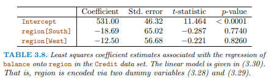
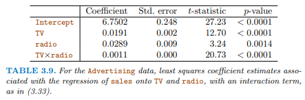

```{r setup, include=FALSE}
knitr::opts_chunk$set(echo = TRUE)
```

```{r}
library(tidyverse)
library(tidytext)
library(ggplot2)
library(wordcloud)
library(textdata)
```

\setcounter{section}{1}
\setcounter{subsection}{1}
\setcounter{subsubsection}{0}

## Lab Exercise 1 (LE1) 9 points total

  - LE1a, 3 points
  - LE1b, 3 points
  - LE1c, 3 points


# LE1a: 1 question, 3 points.

Details

  - Due 
    - Before Class
  - The grading is done on how you show your thinking, 
    - explain yourself and 
    - show your Rcode and 
    - the output you got from your code.
  - Code style is important
    - Follow Rstudio code diagnostics notices
    - And the [Google R Style Guide](https://google.github.io/styleguide/Rguide.xml)

To be done as an Rmd file, 

  - where you turn in 
    - the Rmd file and 
    - the compiled pdf showing your work. 
    - and the R script of IntroR.R
    
You will want to produce a report type format 

  - (html or pdf type document) to turn in. 
  - And not an ioslides or beamer (slide type) compiled output. 
    - These are presentation formats, and can be fussy

Also are you backing up your git repo 

  - in a second and third location, 
  - to avoid corruption problems?


## Combined Problems Looking at GGplot and Tidyverse

Here' we're looking at the gapminder data set. 

This set includes data about many different countries, 

  - including their life expectancies, population, and GDP. 

### Filter the data for the Americas in 2007, deselect all other variables.

```{r}
library(tidyverse)
library(gapminder)
glimpse(gapminder)


```


### Create the variable gdp, defined as the product of population size and gdp per person. Do this two times, once with the tidyverse commands and once without.

```{r}


```

### Identify the observation with lowest gdp per person.

```{r}

```

### Identify all observations with above average life expectancy, stratified for each continent.

```{r}


```

### Count the observations identified in the last step.

```{r}


```

### Compute the mean life expectancy (the grand mean; ie., across all observations).

```{r}


```

### Compute the mean life expectancy for each year.

```{r}


```


# LE1b: 6 questions, 3 points.

  -  Each Question 0.5 points

Text Mining of Song Lyrics 2.0

  - Complete the given problems
  - dplyr, ggplot, and pipelines are highly recommended
    - Remember to library in packages that you will use at the beginning of your code
  - We will be using the Tidytext package to aid with our text mining
  - The dataset for this assignment is a collection of the information and lyrics from every top 100 billboard song since 1965

## 1b-1 Artist analysis 

  - Load in the dataset (billboard_lyrics_1964-2015)
  - Show the titles, ranks, and years of all the songs by the Beatles in the dataset
    - what's the highest ranked Beatles song on the list?
    
  - Count the number of songs each artist has on the list, and
    - show the top 20 artists with the most hits.
    - which artist has the most total top 100 hits?
    
  - How many artists have exactly two top 100 hits?
    - How many are there if you exclude artists whose two hits were in the same year? 

```{r}
billboard_data <- read.csv('data/billboard_lyrics_1964-2015.csv')
billboard_df <- as.data.frame(billboard_data)


```

## 1b-2 Madonna's songs
  
  - Build a histogram of the number of words used in Madonna's songs
    - Is there a trend? How does this line up with your expectations?
    - How do you think this data would be distributed if Madonna kept writing songs?
    - Hint: the unnest_tokens() function from tidytext can be used to split the lyrics up so that each word has its own row

```{r}

```

## 1b-3 Lyrical comparison

  - Lets do a lyrical comparison between all the top artists
  - Use the unnest_tokens() function from tidytext to split the lyrics up so that each word has its own row
  - Show the most commonly used word for each artist

```{r}

```

  - It should be clear that most of these are not significantly meaningful words and should be removed, we can remove them using the stop_words dataframe provided with the tidytext package (hint: look at dplyr anti_join())
  - Additionally, we have an issue with artists that feature other artists appearing multiple times. Let's clean our data so that we **group artists together without including their features** before applying our word ranking
  - Remove the stop_words and group the artists correctly, and show the top remaining word for each artist

```{r}
# create stop_words dataframe
data("stop_words")

```

## 1b-4 Word cloud

Visualizing text data can be tricky, but wordclouds are a helpful way to do so. Use the wordcloud package in R to compare two artists of your choice.

  - Build a word cloud of the lyrics for each artist
    - Specify the minimum frequency for words to appear, in order to prevent warnings from appearing
    - Change the random.order argument so that the most frequently used words are in the center
    - Add color to the word cloud
  - Compare and contrast the word clouds
  - Did the stop_words dataframe work well to remove non-meaningful words?

```{r}

```

## 1b-5 Sentiment Analysis

  - The tidytext package gives us the ability to run sentiment analysis as well
  - There are multiple sentiment methods available 
    - for example, the bing and loughran methods give you "positive" or "negative" connotations for words
  - We'll use the AFINN-111 lexicon for this exercise, because it gives us numeric values
    - This requires downloading the database as it is not packaged with tidytext
  - The data has been downloaded and is in the `LE1/data` subfolder.

```{r}
# afinn <- get_sentiments("afinn")
# read in the AFINN-111.txt  
```

  - What is the afinn dataframe?
  - Let's assign different songs different total scores based on the afinn dataframe
  - Also assign a Positive or Negative overall score based on this value
  - Make a histogram to look at the distribution of positive and negative songs
    - Use color to make the plot more interesting
    
  - Select by specific artists to see what their net totals look like
    - Create a barchart with songs on the x axis and values on the y axis
    - What does Cher's histogram look like? Is she more positive or negative?
    - What does 2pac's histogram look like? Is he more positive or negative?

```{r}

```

  - Based on what you might know about some of these songs, do you think the sentiment analysis gives a good indication of the positive of negative tone for each song or not?


# LE1c: 10 questions, 3 points.

  -  Each Question 0.3 points
  
Use ISLR Chapter 3 for this assignment

## 3.1.R1

### Why is linear regression important to understand? Select all that apply:

  1. The linear model is often correct  
  2.  Linear regression is very extensible and can be used to capture nonlinear effects  
  3.  Simple methods can outperform more complex ones if the data are noisy  
  4. Understanding simpler methods sheds light on more complex ones

Answer :

Explanation:


## 3.1.R2

You may want to reread the paragraph on confidence intervals on page 66 of the textbook before trying this question (the distinctions are subtle).

### Which of the following are true statements? Select all that apply:

  1. A 95% confidence interval is a random interval that contains the true parameter 95% of the time  
  2. The true parameter is a random value that has 95% chance of falling in the 95% confidence interval  
  3. I perform a linear regression and get a 95% confidence interval from 0.4 to 0.5. There is a 95% probability that the true parameter is between 0.4 and 0.5.  
  4. The true parameter (unknown to me) is 0.5. If I sample data and construct a 95% confidence interval, the interval will contain 0.5 95% of the time.

Answer :

Explanation:  

## 3.2.R1

We run a linear regression and the slope estimate is 0.5 with estimated standard error of 0.2. 

### What is the largest value of $b$ for which we would NOT reject the null hypothesis that $\beta_1=b$? 

  * (assume normal approximation to t distribution, and 
  * that we are using the 5% significance level for a two-sided test; 
  * need two significant digits of accuracy)

Answer: 

Explanation:  

## 3.2.R2

### Which of the following indicates a fairly strong relationship between X and Y?

  1. $R^2=0.9$  
  2. The p-value for the null hypothesis $\beta_1=0$ is 0.0001  
  3. The t-statistic for the null hypothesis $\beta_1=0$ is 30

Answer :

Explanation: 

## 3.3.R1

Suppose we are interested in learning about a relationship between X1 and Y, which we would ideally like to interpret as causal.

### True or False? 

The estimate $\hat{\beta}_1$ in a linear regression that controls for many variables (that is, a regression with many predictors in addition to $X_1$) is usually a more reliable measure of a causal relationship than $\hat{\beta}_1$ from a univariate regression on $X_1$.

Answer : 

Explanation:


## 3.4.R1 

According to the balance vs region model on page 86,



### what is the predicted balance for someone from the South in the data set? (within 0.01 accuracy)

```{r}
credit_data <- read.csv('./data/Credit.csv')
head(credit_data)


```

Answer: 

Explanation: 
    

## 3.4.R2 

### What is the predicted balance for someone from the East? (within .01 accuracy)

Answer:

Explanation: 
  

## 3.5.R1  

According to the model for sales vs TV interacted with radio on page 89, 



### what is the effect of an additional $1 of radio advertising if TV=$50? (with 4 decimal accuracy)

```{r}
advertising_data <- read.csv('data/Advertising.csv')


```

Answer : 

## 3.5.R2  (1/1 point)

### What if TV=$250? (with 4 decimal accuracy)

Answer: 


## 3.R.R1  

What is the difference between `lm(y ~ x*z)` and `(y ~ I(x*z))`, when x and z are both numeric variables?

  1. The first one includes an interaction term between x and z, whereas the second uses the product of x and z as a predictor in the model.  
  2.The second one includes an interaction term between x and z, whereas the first uses the product of x and z as a predictor in the model.  
  3. The first includes only an interaction term for x and z, while the second includes both interaction effects and main effects.  
  4. The second includes only an interaction term for x and z, while the first includes both interaction effects and main effects.

```{r}


```

Answer : 

Explanation: 

      

## Cites

* Gareth James, Daniela Witten, Trevor Hastie, and Robert Tibshirani. An Introduction to Statistical Learning: With Applications in R. 1st ed. 2013, Corr. 5th printing 2015 edition. Springer Texts in Statistics. New York: Springer, 2013.

