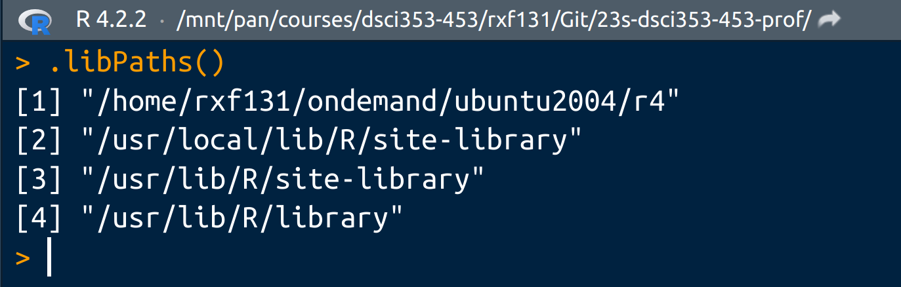
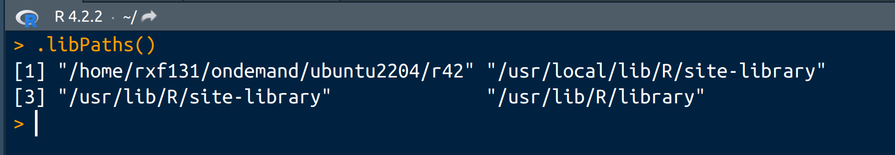
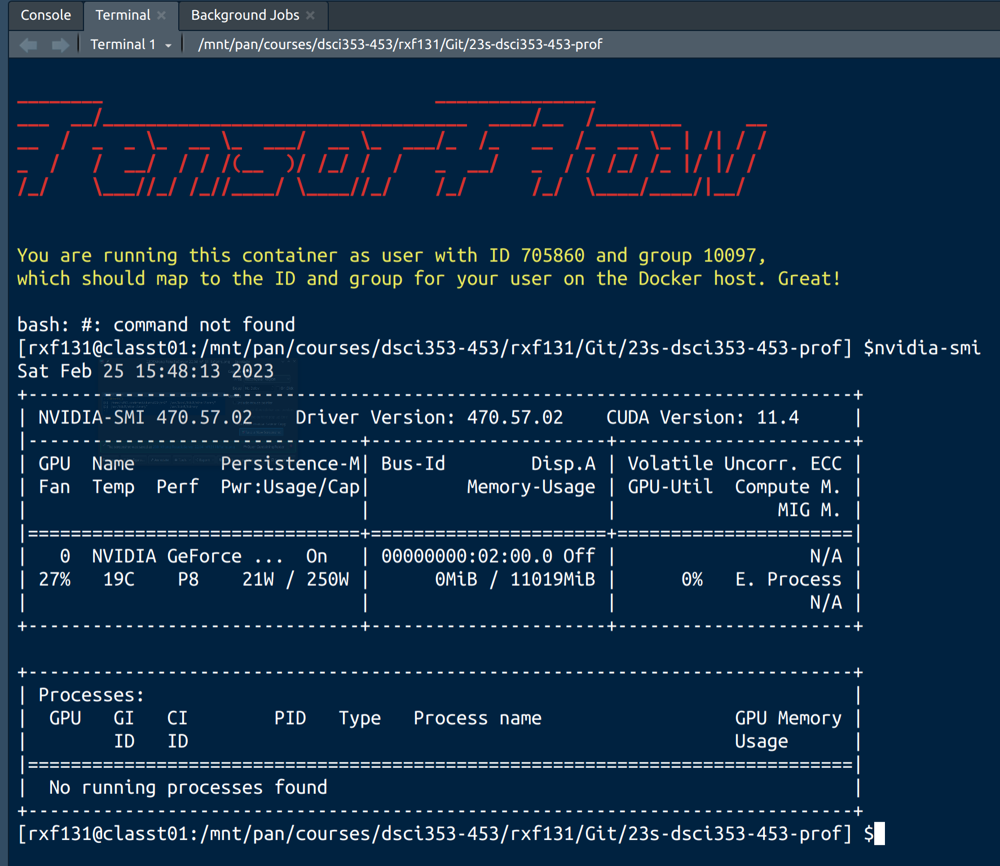

```{r setup, include = FALSE}
knitr::opts_chunk$set(
  cache = TRUE, # if TRUE knitr will cache results to reuse in future knits
  fig.width = 6, # the width for plots created by code chunk
  fig.height = 4, # the height for plots created by code chunk
  fig.align = 'center', # how to align graphics. 'left', 'right', 'center'
  dpi = 300, 
  dev = 'png', # Makes each fig a png, and avoids plotting every data point
  # options(tinytex.verbose = TRUE),
  # eval = FALSE, # if FALSE, then the R code chunks are not evaluated
  results = 'asis', # knitr passes through results without reformatting
  echo = TRUE, # if FALSE knitr won't display code in chunk above it's results
  message = TRUE, # if FALSE knitr won't display messages generated by code
  strip.white = TRUE, # if FALSE knitr won't remove white spaces at beg or end of code chunk
  warning = TRUE, # if FALSE knitr won't display warning messages in the doc
  error = TRUE) # report errors
```

```{=tex}
\setcounter{section}{4}
\setcounter{subsection}{3}
\setcounter{subsubsection}{0}
```
## Preliminary Checks

### Confirm that you have the Correct R Package Library Path

-   Make sure that you have the right R package library
    -   Run in the R Console : \`.libPaths()
-   The first directory listed HAS TO BE
    -   `/home/rxf131/ondemand/ubuntu2004/r4`



If you have this for your `.libPaths()`

-   then you are in the RStudio with 22.04 release of Ubuntu Linux
    -   Which doesn't have the right versions of GPU drivers



### Confirm that you have a GPU in your Rstudio Server rxf131 Session

Did you choose a GPU Compute Node to start this session?

-   In the Linux Terminal of your Rstudio Server rxf131
-   Run the command : `nvidia-smi`
    -   It should tell you about your GPU
    -   And how full its GPU Ram is



------------------------------------------------------------------------

LE4, in 5 parts (A, B, C, D)

Details

-   Due Thursday, March 9th
    -   At 11:59 p.m.
-   The grading is done on how you show your thinking,
    -   explain yourself and
    -   show your R code and
    -   the output you got from your code.
-   Code style is important
    -   Follow Rstudio code diagnostics notices
    -   And the [Google R Style Guide](https://google.github.io/styleguide/Rguide.xml)

LE4 Points

-   LE4A: 2 points total

-   LE4B: 2 points total

-   LE4C: 2 points total

-   LE4D: 2 point total

-   0.5 point Code Style

-   0.5 points, setting your cluster storage to course group

To be done as an Rmd file,

-   where you turn in
    -   the Rmd file and
    -   the compiled html, that you then print to pdf.

You will want to produce a report type format

-   (html and pdf type document) to turn in.
-   And not an ioslides or beamer (slide type) compiled output.
    -   These are presentation formats, and can be fussy

Also are you backing up your git repo

-   in a second and third location,
-   to avoid corruption problems?

Now do the separate \*.Rmd problem LE4D

-   This will require a GPU
-   So you should start a GPU session on Markov
    -   To do this LE4D problem

You can confirm that you have a GPU session

-   By going to the Linux Terminal in Rstudio
-   and typing the `nvidia-smi` command
    -   which will confirm you have a GPU
    -   and how full its memory is

<!-- ####################################################################### -->

## LE4D: ML Algorithms: LR, RF, & SVM, 1 points total

<!-- ####################################################################### -->

***For this LE4E problem, we give you all the code,***

-   And you just execute the code
-   And **Write your english sentence answers**
    -   **Intrepreting the results**
-   And compile the full data analysis to pdf
    -   for submission to the Assignment page

In this exercise, we will take a look at predicting

-   whether an individual makes more than or less than \$50,000
-   based on census data.

This data is quite old (from 1994),

-   but the data is valid
-   and this serves as a good benchmark
-   for supervised classification machine learning models.

This task is supervised classification:

-   Supervised: we have training data
    -   with both the features (explanatory variables)
    -   and the target (response) variable
-   Classification: the target is a categorical variable,
    -   in this case it is binary
    -   meaning it can only take on two values,
    -   0 (less than \$50,000)
    -   and 1 (more than \$50,000)

A standard machine learning problem involves several steps, which we will work through:

-   **ML-0. Data Wrangling**
    -   Read in the data and make your analysis dataframe
-   **ML-1. Exploratory data analysis:**
    -   find any trends that can help you build a model
-   **ML-2. Split into training and testing sets:**
    -   we need some data to train the model
        -   to learn the relationship between the features and the target
    -   and then a testing set to evaluate
        -   how well the model can predict new observations
-   **ML-3. Feature preparation/feature engineering:**
    -   prepare the data to train the machine learning model
        -   and create any new features that you believe may be useful
-   **ML-4. Establish a baseline:**
    -   determine a common sense prediction to try and beat.
    -   For example, this might be the mean in a regression task
        -   or the majority class in classification.
    -   If your model cannot beat the baseline,
        -   then maybe machine learning will not work on the problem
-   **ML-5. Evaluate a range of models:**
    -   try a number of models with different complexity
        -   and judge performance based on a common metric on the test set
-   **ML-6. Compare models and select the best performer:**
    -   all models need to be compared on the same testing set
    -   using the same metric to be objective
-   **ML-7. Tune the hyper-parameters of the best model using cross validation:**
    -   this step is used to optimize the performance of the model.
-   **ML-8. Train the final tuned model on the training data**
    -   and make predictions on the test data: evaluate the performance of the model
-   **ML-9. If performance is poor, try creating new features or a better model:**
    -   this might require going all the way back to step 3
    -   and iterating through the process
-   **ML-10. Interpret the best model**
    -   as far as is possible
    -   and draw conclusions

We will go through this process together!

```{r}
# These are packages you'll be using

# Data manipulation
library(tidyverse)
# Machine learning
library(caret)

# One-hot encoding- the dummies package has been removed due to incompatibilities
# library(dummies) - So we'll use a function from the caret package
#  called caret::dummyVars
?caret::dummyVars


# Support Vector Machine modeling
library(e1071)

# Random Forest modeling
library(ranger)

# Artificial Neural Network modeling, on CPU
library(nnet)
library(neuralnet)

# Deep Neural Network modeling with Keras/TensorFlow2 on GPU
library(keras)
library(tensorflow)

# Useful metrics for Machine Learning models
library(Metrics)

```

### ML-0. Load the Data and Prepare it for Modeling

The first step is to get a look at the data.

-   in the `adults.csv` file in the `./data` folder
-   more info available here
    -   [1994 Census Data](https://www.kaggle.com/uciml/adult-census-income)

As mentioned, we are using census data from 1994

-   with the objective of predicting
-   whether or not an individual made over \$50,000.

Read in the data and print out the first few lines.

```{r}
# Put your code here, with comments and good style and syntax

# Read in data and glimpse
census <- read.csv("./data/adult.csv")
dim(census)
str(census)
glimpse(census)
```

There are 32,561 observations with 14 features.

-   The `income` variable is the target,
-   i.e. what we are trying to predict.

A machine learning model cannot handle factor variables.

-   Therefore, we need to perform what is known as
    -   **one-hot encoding** of the factors.
-   In one-hot encoding,
    -   we take a factor variable
    -   and convert it into a vector of integers
    -   with length equal to the number of unique factors in the variable.
-   The value of the variable is encoded as a 1
    -   with the other entries in the vector set to 0.
-   This is best illustrated with an example.

```{r}
original_data <-
  data.frame(
    "day_of_week" = c("Mon", "Tues", "Weds"),
    "weather" = c("nice", "too_hot", "too_hot"),
    "test" = c(1, 2, 3)
  )
```

We will take this simple data frame

-   and one-hot encode the factors.

We are using the `dummy.data.frame` function from the `dummies` package. - The `day_of_week` column - will become three separate columns - and the `weather` column - will become two columns, - representing the number of unique factors in each variable.

```{r}
# one_hot_data <- dummy.data.frame(original_data)
# glimpse(one_hot_data)

# How to one-hot-encode with caret and its dummyVars function
hot_data <- caret::dummyVars(" ~ .", data = original_data)
one_hot_data <-
  data.frame(predict(hot_data, newdata = original_data))
glimpse(one_hot_data)
```

We can see that the single factor columns

-   have been expanded in order to represent the factors as integers.

This is a standard practice in machine learning

-   in order to allow our models to handle categorical variables.

We could convert the strings into numbers

-   (1-7 for days of the week for example)
-   but this would impose an arbitrary ordering of the factors
    -   which might not be correct.
-   One-hot encoding is a safer approach to
    -   converting categorical data than encoding as sequences.

#### One-Hot Encode the Adult Data

```{r}
# adult <- dummy.data.frame(census)
# glimpse(adult)

adult_tmp <- caret::dummyVars(" ~ .", data = census)
adult <- data.frame(predict(adult_tmp, newdata = census))
glimpse(adult)
```

One-hot encoding of the factors

-   increased the 15 original features to 110!
-   This is not a problem,
    -   except that it might make interpreting the model
    -   results a little more difficult.
-   To reduce the dimensions (number of features)
    -   we could use principal components analysis,
    -   but then this would obscure any meaning whatsoever in our data!
-   For now we will use all of the features to train our models.

#### Identify the labels

Now we need to separate out the labels.

If we look at the data,

-   there are now two columns
    -   that use our target, income\>50k and income\<=50k
    -   these correspond to income.50K and income...50K.
        -   But the "greater than" and "less than or equal to" characters are dropped,
            -   due to character set problems
-   We will use the first and set that to "y"
    -   a variable commonly used to represent the response or 'target'
    -   in a machine learning problem.
    -   We can discard the other column.

```{r}
# Set the target equal to y
adult$y <- adult$income.50K

# Drop the old target columns
adult$`income..50K` <- NULL
adult$`income.50K` <- NULL
```

### ML-1. Exploratory Data Analysis

Now that we have the data in order,

-   we might want to see if there are any insights.
-   One place to start
    -   is to find the features
    -   that are most highly correlated with the response.

Make a few graphs exploring correlations or trends within the data.

```{r}
# Find the correlations in the data frame
corrs <- cor(adult)

# Arrange in absolute descending order
corrs <- sort(abs(corrs), decreasing = TRUE)
plot(corrs)
corrs[1:10]
```

Here we can see the top 10

-   most highly correlated variables with the response
-   in terms of the magnitude of the correlation coefficient.

These may be the most useful variables for predicting the response,

-   but for now we will use all of the variables.

### ML-2 Split into Training and Testing Sets

Now we need to split the data

-   into training and testing dataset.

We will use

-   75% of the data for training
-   and the last 25% for testing.

```{r}
set.seed(50)
# Using 75% of the data for training
n <- dim(adult)[1]
train_indices <- sample(n, round(n * .75))
adult_train <- adult[train_indices,]
adult_test <- adult[-train_indices,]
```

##### QUESTION: Why do we set.seed here?

ANSWER:

### ML-3 Scale Features between 0 and 1

Another feature pre-processing step we need to do

-   is to put all of the features values between 0 and 1.
-   This helps speed up machine learning model training
    -   because all of the features are now on the same scale.
-   This is especially crucial for deep neural networks.
-   Notice that we train the preprocessor
    -   using the training data only
    -   and then make predictions (transform)
    -   both the training and testing data.
-   We always have to train the preprocessor
    -   on only the training data
    -   because when we get in new data,
    -   we only want to transform it using the already trained preprocessor.

```{r}
# Labels
train_labels <- adult_train$y
test_labels <- adult_test$y

# Remove labels for preprocessing
full_train <- adult_train[, -109]
full_test <- adult_test[, -109]

# Scale the features between 0 and 1
preprocessor <-
  preProcess(adult_train,
             method = c("range"),
             rangeBounds = c(0, 1))
full_train <- predict(preprocessor, adult_train)
full_test <- predict(preprocessor, adult_test)

# Add the targets back into the datasets
full_train$y <- train_labels
full_test$y <- test_labels

```

#### Shorten Dataset

In order to make this feasible to run on a personal computer,

-   we will train using the first 1000 observations
-   and test on 500 observations.

```{r}
set.seed(50)
# Randomly select 1000 trainig examples and 500 testing examples
n1 <- dim(full_train)[1]
n2 <- dim(full_test)[1]
s1 <- sample(n1, 1000)
s2 <- sample(n2, 500)
train_keep <- full_train[s1, ]
test_keep <- full_test[s2, ]

# Keep the first 1000 training examples and 500 testing examples
train <- full_train[1:1000, ]
test  <- full_test[1:500, ]

```

All of the variables are between 0 and 1

-   and our data is ready to go for the machine learning models.

### ML-4 Baseline Model

However, before we can get started training,

-   we need to establish a baseline metric to try and beat.

What is a good baseline?

-   Well, for a classification problem,
-   we want to build a model that does better
    -   than if we simply guessed the most common class.
-   So, our baseline model will be one
    -   that predicts the most common class for all testing instances.
-   (I'll call the test and train data of my shortened dataset
    -   `test_keep` and `train_keep`)

Let's see the accuracy of this approach.

```{r, eval=FALSE}
baseline <- rep(0,500)
table(test_keep$y)

base.mat <- matrix(c(372, 0, 128, 0), ncol = 2)
colnames(base.mat) <- c(0,1)
rownames(base.mat) <- c("0", "1")
base.table <- as.table(base.mat)
```

```{r}
base.table
```

```{r}
table_y <- table(adult$y)
table_y[1] / (table_y[1] + table_y[2])
```

##### QUESTION: What does this baseline mean?

ANSWER:

##### QUESTION: Explain the confusion matrix you get

ANSWER:

##### QUESTION: Where does 75% come from?

ANSWER:

### ML-5 Evaluate a Range of Models

Let's make a function to evaluate our models.

We can use accuracy

-   to get a single number
-   and the confusion matrix for the full picture.

```{r warning = FALSE}
# Function to evaluate predictions
accuracyFunction <- function(cm) {
  tn <- cm[1, 1]    # tn = true negative
  fp <- cm[1, 2]    # fp = false positive
  fn <- cm[2, 1]    # fn = false negative
  tp <- cm[2, 2]    # tp = true positive
  
  accuracy <- (tp + tn) / (tp + tn + fp + fn)
  return(accuracy)
}

# Show the metrics for the baseline predictions
#Calculate by hand
accuracyFunction(base.table)
```

##### QUESTION: Explain what this accuracy represents for this baseline model

ANSWER:

We'll also record the start time

-   for each model type
    -   using `proc.time`
-   And then calculate the run time of each model

#### Logistic Regression

The first method we will use is logistic regresssion

To convert the predicted values

-   to a 0 or 1 binary label
-   we round them.

The first method we will use is logistic regression.

```{r warning = FALSE}
start_time <- proc.time()

# Train a linear model
start_time <- proc.time()

# Train a linear model
lr.adult <-
  glm(y ~ ., data = train_keep, family = binomial(link = logit))

# Now evaluate its performance by predicting on the test data
predicted <- predict(lr.adult, test_keep, type = "response")

time_lr <- proc.time() - start_time

# Convert predictions to either 0 or 1

predicted <- round(predicted)

# Evaluate accuracy

cm_lr <- confusionMatrix(factor(predicted), factor(test_keep$y))
cm_lr

time_lr
```

##### QUESTION: Interpret the confusion matrix and the accuracy relative to the baseline.

-   And note the model training time

ANSWER:

#### Random Forest using the `ranger` package

The next method to try is a random forest

-   using the ranger package.

This tends to be quicker than the randomForest method.

To tell caret that we are doing classification,

-   we have to use a training set
-   where the labels are encoded as factors.

```{r}
# Create training and testing sets with labels as factors
train_keep$y <- as.factor(train_keep$y)
test_keep$y <- as.factor(test_keep$y)

```

This will take a few minutes or more to run.

```{r}
# library(ranger)

start_time <- proc.time()

rf.adult <-
  caret::train(y ~ .,
               data = train_keep,
               method = "ranger",
               importance = "permutation")
predicted.rf <- predict(rf.adult, test_keep)

time_rf <- proc.time() - start_time

cm_rf <- confusionMatrix(factor(predicted.rf), factor(test_keep$y))
cm_rf

time_rf 
```

#### Support Vector Machine

This will take a moment to run.

```{r}

start_time <- proc.time()

adult.svm <-
  svm(y ~ .,
      data = train_keep,
      kernel = "linear",
      scale = FALSE)

predicted.svm <- predict(adult.svm, test_keep)

time_svm <- proc.time() - start_time

cm_svm <- confusionMatrix(factor(predicted.svm), factor(test_keep$y))

cm_svm

time_svm 

```

Its surprising how different the training time is for different models

#### Artificial Neural Network

The `nnet` R library, implements artificial neural network models

-   And runs on CPU
-   So it can be slow

This may take a while to run!

```{r}

start_time <- proc.time()

adult.nn <- nnet(y ~ ., data = train_keep, size = 5)

predicted.nn <- predict(adult.nn, test_keep)

time_ann <- proc.time() - start_time

cm_ann <-
  confusionMatrix(factor(round(predicted.nn)), factor(test_keep$y))

cm_ann

time_ann

```

### ML-6 Compare models and select the best performer:

    - all models need to be compared on the same testing set 
    - using the same metric to be objective

##### QUESTION: How do each of these different modeling results compare to each other?

-   For Accuracy
-   For Confusion Matrix
-   For Training Time

ANSWER:

### Deep Learning with Keras & TensorFlow 2.11

This only works if you have

-   the Keras R package installed.

If your operating system is Linux

-   Such as Ubuntu 20.04, or Kubuntu 20.04
-   Then using the R package `keras`
-   You can use Keras
    -   With the Tensorflow DL library
-   And this only works with Nvidia brand GPUs

So this you need to run on Markov Data Science Cluster

-   Using a GPU session

So confirm you have a GPU in this RstudioServer session

-   go to the linux terminal
    -   in bottom left quadrant of Rstudio
-   And run this command
    -   `nvidia-smi`

Now first lets define a Keras NN Model

-   Using Keras' "Layer API" language

We'll learn more about

-   The types of Keras Layers
-   The Activation Functions
-   In the weeks ahead

```{r}
# First define the architecture of your Keras NN Model
adultDD <- keras_model_sequential()

adultDD %>% layer_dense(
  units = 64,
  activation = 'elu',
  input_shape = dim(train)[2]
) %>%
  layer_dropout(rate = 0.5) %>%
  layer_dense(units = 256, activation = 'elu') %>%
  layer_dropout(rate = 0.5) %>%
  layer_dense(units = 128, activation = 'elu') %>%
  layer_dropout(rate = 0.5) %>%
  layer_dense(units = 64, activation = 'elu') %>%
  layer_dropout(rate = 0.5) %>%
  layer_dense(units = 64, activation = 'elu') %>%
  layer_dense(units = 1, activation = 'sigmoid')

# Now Compile the model, defining the optimizer, loss and metrics
adultDD %>% compile(
  optimizer = 'adam',
  loss = c('binary_crossentropy'),
  metrics = c('accuracy')
)

# And now print out the layer structure of your Keras NN model
summary(adultDD)

```

Keras and TF2 works in three steps:

-   

    1.  Defined the Keras NN Architecture

-   

    2.  Compile the NN with its optimizer, loss and metrics

    -   And this defines the "computation graph" of your NN
    -   defining the structure of the neural network
    -   And defines how the tensor will flow through the computational graph
    -   During the next step, the NN training steup

-   

    3.  Train the model weights in the "fit step"

```{r}
# start_time <- proc.time()

modelpath <- 'keras_dnn1.hdf5'
callback_list <- list(
  callback_early_stopping(patience = 5, monitor = 'val_loss'),
  callback_model_checkpoint(filepath = modelpath,
                            save_best_only = TRUE)
)

# Now start your NN training on the training data
start <- Sys.time()

# We'll train for 20 "epochs" and use a "batch size" of trainin data of 256
# and saving the "learning curves" as history
history <- adultDD %>% fit(
  as.matrix(train),
  train_labels,
  batch_size = 256,
  epochs = 20,
  callbacks = callback_list,
  validation_split = 0.25
)

# time_dnn <- proc.time() - start_time
end <- Sys.time()

time_dnn <- as.numeric(difftime(end, start, units = 's'))
time_dnn

```

Keras is much quicker

-   than the `neuralnet` or `nnet` packages
    -   because it has smarter implementation of the training algorithms.
-   If you have any interest in applying deep learning,
    -   Keras is the best library to learn (at the moment).

```{r}
# Now we'll load the best deep neural network you trained
best_dnn_model <- load_model_hdf5(modelpath)

# And predict on the test data
dnn_pred <- best_dnn_model %>% predict(as.matrix(test))

# now make your confusion matrix, comparing your predictions to the ground truth
cm_dnn <-
  confusionMatrix(factor(round(dnn_pred)), factor(test_keep$y))

cm_dnn

```

##### QUESTION: So how is your Confusion Matrix, Accuracy and Speed with Keras/TF2?

ANSWER

#### ML-7 Tune the hyper-parameters of the best model using cross validation

Now we will try and optimize the model using hyper-parameter tuning.

This means searching through a number of model hyper-parameters,

-   trying each one,
-   evaluating the performance,
    -   and selecting the hyper-parameters
    -   that result in the best performance.

This is unfeasible to run on a personal computer

#### Hyperparameter tuning for the Random Forest

```{r}
start_time <- proc.time()

set.seed(7)
# Tuning grid for ranger
rangerGrid <-
  expand.grid(
    .mtry = 2:10,
    .splitrule = "gini",
    .min.node.size = c(10, 20)
  )

# Training control using 3-fold cv
rangerControl <- trainControl(method = "cv", number = 3)

# Build the tuning object
adult.rf2 <-
  caret::train(
    y ~ .,
    data = train_keep,
    method = "ranger",
    trControl = rangerControl,
    tuneGrid = rangerGrid
  )

# Extract the best results
adult.rf2

rf_pred_tuned <-
  round(as.numeric(as.character(
    predict(adult.rf2, newdata = test_keep, probability = TRUE)
  )))

time_rf2 <- proc.time() - start_time

cm_rf2 <- confusionMatrix(factor(rf_pred_tuned), factor(test_keep$y))
cm_rf2

time_rf2 

```

After tuning, the best model had mtry = 9, splitrule = gini, and min.node.size = 10.

#### Hyperparameter tuning for the Support Vector Machine

Create a tuning grid

-   and perform hyper-parameter tuning
    -   as was done with the random forest.
-   Select the best model.

```{r}
start_time <- proc.time()

set.seed(7)
svmGrid <- expand.grid(C = seq(.1, 2, .2))
svmControl <- trainControl(method = "cv", number = 3)

adult.svm3 <-
  caret::train(
    y ~ .,
    data = train_keep,
    method = "svmLinear",
    trControl = svmControl,
    tuneGrid = svmGrid
  )

adult.svm3

svm_pred_tuned <-
  round(as.numeric(as.character(
    predict(adult.svm3, newdata = test_keep, probability = TRUE)
  )))

time_svm3 <- proc.time() - start_time

cm_svm3 <- confusionMatrix(factor(svm_pred_tuned), factor(test_keep$y))
cm_svm3

time_svm3

```

After parameter tuning, the best model has C = .1.

#### Hyperparameter tuning for the Artificial Neural Network

Evaluate different model hyper-parameters

-   such as the number of hidden layers,
-   the activations in the hidden layers,
-   the number of units in the hidden layers,
-   and the algorithm uses to train the network.

```{r}
start_time <- proc.time()

set.seed(7)
library(neuralnet)

nnetGrid <- expand.grid(size = 2:6, decay = c(T, F))
nnetControl <- trainControl(method = "cv", number = 3)

adult.nn2 <- caret::train(
  y ~ .,
  data = train_keep,
  method = "nnet",
  trControl = nnetControl,
  stepmax = 700,
  learningrate = .05,
  threshold = .1,
  tuneGrid = nnetGrid,
  linear.output = TRUE
)

glimpse(adult.nn2)

nn_pred_tuned <- round(as.numeric(as.character(
  predict(adult.nn2,
          newdata = test_keep,
          probability = TRUE)
)))

time_ann2 <- proc.time() - start_time

cm_ann2 <- confusionMatrix(factor(nn_pred_tuned), factor(test_keep$y))
cm_ann2

time_ann2

```

#### ML-10 Interpret Results

##### Feature Importances in Random Forest

One way to get a look inside the black box

-   is through relative feature importance
    -   in a Random Forest.

The numbers themselves

-   are not as important
-   as the relative ordering of the variables.

We can use `varImp` from `caret`

-   to look at the feature importances
    -   of our trained random forest.
-   We will order these by importance
    -   and look at the 15 most important features.

```{r}
library(tidyverse)
library(ggthemes)

rfImp <- varImp(rf.adult, scale = FALSE)
rfImp
```

##### QUESTION: Interpret the feature importances.

-   Do these make sense in terms of your domain knowledge?
-   There are 20 values given,
    -   so the top 15 are the 15 most important.

[Here I give an example of a conclusion from this data analysis.]

ANSWER: This makes sense considering some of the variables listed.

-   For example, I would consider age to be a very important variable.
    -   The older you are, the further in your career you are,
    -   so the more likely you will be making an income greater thatn 50K.\
-   Additionally, looking at the variable `hours.per.week`,
    -   one would be more likely to be making over 50K the more hours they worked.
-   Finally, education is the least surprising to me,
    -   because the more educated you are,
    -   the more likely you are to be making over 50K.
-   Based on my doman knowledge of the issue,
    -   it would seem like this list of 15 parameters
    -   is fairly accurate for predicting importance.

##### Make a Histogram showing the following about all the models

-   Training Time
-   Acccuracy

```{r}
# Make your histogram here, using ggPlot


```

##### QUESTION: From your figure, how useful are NNs and GPUs,

-   compared to statistical learning models?

ANSWER:

##### QUESTION: What are your have other insights,

-   from the different Machine Learning approaches used?

ANSWER:

------------------------------------------------------------------------
