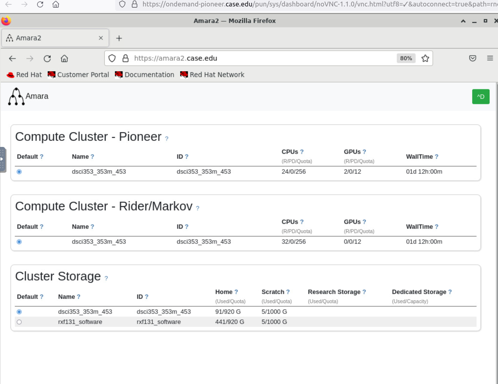

```{r setup, include = FALSE}
knitr::opts_chunk$set(
  cache = FALSE, # if TRUE knitr will cache results to reuse in future knits
  fig.width = 6, # the width for plots created by code chunk
  fig.height = 4, # the height for plots created by code chunk
  fig.align = 'center', # how to align graphics. 'left', 'right', 'center'
  dpi = 300, 
  dev = 'png', # Makes each fig a png, and avoids plotting every data point
  # eval = FALSE, # if FALSE, then the R code chunks are not evaluated
  # results = 'asis', # knitr passes through results without reformatting
  echo = TRUE, # if FALSE knitr won't display code in chunk above it's results
  message = TRUE, # if FALSE knitr won't display messages generated by code
  strip.white = TRUE, # if FALSE knitr won't remove white spaces at beg or end of code chunk
  warning = TRUE, # if FALSE knitr won't display warning messages in the doc
  error = TRUE) # report errors
  # options(tinytex.verbose = TRUE)
```


\setcounter{section}{4}
\setcounter{subsection}{0}
\setcounter{subsubsection}{0}

LE4, in 4 parts (A, B, C, D)

Details

  - Due Tuesday, March 1st
    - At 11:59 p.m.
  - The grading is done on how you show your thinking, 
    - explain yourself and 
    - show your R code and 
    - the output you got from your code.
  - Code style is important
    - Follow Rstudio code diagnostics notices
    - And the [Google R Style Guide](https://google.github.io/styleguide/Rguide.xml)

LE4 Points

  - LE4A: 2 points total
  - LE4B: 2 points total
  - LE4C: 2 points total
  - LE4D: 2 points total (in a separate file because requires GPUs on Markov)

    - 0.5 point Code Style
    - **0.5 Set your primary linux group to be DSCI33-4453**

To be done as an Rmd file, 

  - where you turn in 
    - the Rmd file and 
    - the compiled pdf showing your work. 

You will want to produce a report type format 

  - (html and pdf type document) to turn in. 
  - And not an ioslides or beamer (slide type) compiled output. 
    - These are presentation formats, and can be fussy

Are **you backing up your git repo**

  - in a second and third location, 
  - to avoid corruption problems?

________________________________________________________________________________

## LE4: Set Your Primary Linux Group To Course Group, 0.5 points total

To avoid us all getting "Quota Locked Out" 

  - as we move to Machine Learning and Deep Learning
    - With Neural Networks
  - Its important everyone has their primary Linux Group
    - Set to be `dsci353_353m_453`

To do this you need to login to https://amara.case.edu

  - Using your CaseID and your pwd (password)
  - And then locate the section for
    - **Cluster Storage Group**

Some background info on your Cluster Storage Group

  - This table lists the storage groups that you belong to across all clusters,
    - So the Markov Data Science Cluster, 
    - And the Rider (RHEL7) and Pioneet (RHEL8) compute clusters
    - including the quota and current usage. 
  - Your default group will be used to create files (and accrue quota usage) 
    - if you do not explicitly change groups using the `newgrp` command.
    
Under Cluster Storage Group you should see two or more choices

  - You sould see `rxf131-software`
    - This gives you access to our OnDemand Containerized Apps
  - And you should see `dsci353_353m_453`

So in your CaseID account's Amara settings

  - Your Cluster Storage Group **Should Be dsci353_353m_453**
  - If it isn't then select the radio button
    - next to `dsci353_353m_453`

When done successfully, You should see this in Amara



Now launch an SDLE-Diagnostics OnDemand App 

  - from https://ondemand.case.edu
  - And in SDLE-Diagnostics
    - On the first screen ("User Diagnostics")
  - You should see GREEN box, stating
    - `dsci353_353m_453`
    -  "Your primary group is correct!"
  
Now you won't be the cause of us all getting 

  - Quota Lockout, as we move forward this semester. 
  
  
________________________________________________________________________________

## LE4A: ISLR2 Chapter 7: Moving Beyond Linearity, 2 points total

<!-- ####################################################################### -->
### LE4A: ISLR2 7.7, 0.5 point
<!-- ####################################################################### -->

In this exercise, you will further analyze the $Wage$ data set considered
throughout this chapter.

The Wage data set contains a number of other features 

  - not explored in this chapter, 
  - such as marital status (`maritl` ), job class (`jobclass`),
  - and others. 
  
Explore the relationships between some of these other predictors and wage, 

  - and use non-linear fitting techniques 
  - in order to fit flexible models to the data. 

Use the `deviance()` function to evaluate the accuracy of the model fits.


```{r}
# Put your code here, with comments and good style and syntax
library(ISLR2)
library(gam)

# Firstly, load the data

```

```{r}
# draw some plots to see the relationship between each factor and the response:

```

```{r}
# Now make a number of gam models with different predictors

```

```{r}
# Do ANOVA tests to find out best model:

```

```{r}
# Find the deviance of each model

```

```{r}
# Find the smallest deviance

```

```{r}
# Make the plot to visualize


```


1. What is the number output telling you?

  - Is this value absolute or relative? 
  - Is it meaningful on its own?
  
ANSWER: 


2. Why can't we fit splines with variables like `maritl` and `jobclass`?

ANSWER: 

  - Why is the `predict` function unable to generate values?

ANSWER: 

3. What did you find was the best model for predicting wage?

ANSWER: 


<!-- ####################################################################### -->
### LE4A Continued: ISLR2 7.9 1.5 point
<!-- ####################################################################### -->

This question uses the variables 

  - `dis` (the weighted mean of distances to five Boston employment centers) 
  - and `nox` (nitrogen oxides concentration in parts per 10 million) 
  - from the `Boston` data. 
  
We will treat `dis` as the predictor and `nox` as the response.

#### (a) 

Use the `poly()` function to fit a cubic polynomial regression 

  - to predict `nox` using `dis`. 
  
Report the regression output, 

  - and plot the resulting data and polynomial fits.
  - using `ggplot2`

```{r}

```

ANSWER:

#### (b) 

Plot the polynomial fits for a range of different polynomial degrees 

  - (say, from 1 to 10), 
  - and report the associated residual sum of squares.


```{r}
# Put your code here, with comments and good style and syntax
# Make the fitting models from 1 to 10


# Make the plots


# Make ANOVA Analysis


# Store the RSS


 
```

ANSWER: 
#### (c) 

Perform cross-validation or another approach 

  - to select the optimal degree for the polynomial, 
  - and explain your results.


```{r}
# Put your code here, with comments and good style and syntax


```


ANSWER: 

#### (d) 

Use the `bs()` function to fit a regression spline 

  - to predict `nox` using `dis`. 
  
Report the output for the fit 

  - using four degrees of freedom. 

How did you choose the knots? 

Plot the resulting fit, using `ggplot2`.

```{r}
# Put your code here, with comments and good style and syntax
library(splines)

# fit a model


# summary of your model


# visualize your model


# knots chosen:


# Plot with the knots added, use base plot as a comparison to ggplot


# Predict based on model


# Plot, including 2-se confidence interval


# Add knots to your plot, to visualize them


```

ANSWER: 

#### (e) 

Now fit a regression spline for a range of degrees of freedom, 

  - and plot the resulting fits 
  - and report the resulting RSS. 
  
Describe the results obtained.

```{r}
# Put your code here, with comments and good style and syntax


# fit models


# Summary of the model


# knots chosen:


# ANOVA and RSS calculation


# Visualize


# Predict based on model


# Plot, including 2-se confidence interval


# Draw the graph to choose

```

ANSWER: 

#### (f) 

Perform cross-validation or another approach 

  - in order to select the best degrees of freedom 
  - for a regression spline on this data.

Describe your results.

```{r}
# Put your code here, with comments and good style and syntax

```

ANSWER:

________________________________________________________________________________

## LE4B: ISLR2 Chapter 8: Tree-Based Methods, 2 points total

<!-- ####################################################################### -->
### LE4B: ISLR2 8.7, 0.5 point
<!-- ####################################################################### -->

In the lab, we applied random forests to the Boston data 

  - using `mtry = 6` and using `ntree = 25` and `ntree = 500`. 

Create a plot displaying the test error resulting from 

  - training random forest models on this data set 
  - for a more comprehensive range of values for `mtry` and `ntree`. 

You can model your plot after Figure 8.10. 


```{r}
# Put your code here, with comments and good style and syntax
library(randomForest)

```

Describe the results obtained.

ANSWER: 


<!-- ####################################################################### -->
### LE4B Continued: ISLR2 8.8, 1.5 points
<!-- ####################################################################### -->

In the lab, a classification tree was applied to the `Carseats` data set 

  - after converting `Sales` into a qualitative response variable. 

Now we will seek to predict `Sales` using regression trees and related approaches, 

  - treating the response as a quantitative variable.

#### (a) 

Split the data set into a training set and a test set.

```{r}
# Put your code here, with comments and good style and syntax
library(ISLR2)
library(ggplot2)

```

#### (b) 

Fit a regression tree to the training set. 

  - Plot the tree, 
  - and interpret the results. 

```{r}
# Put your code here, with comments and good style and syntax
library(tree)

```

What test MSE do you obtain?  

ANSWER:


#### (c) 

Use cross-validation in order to determine the optimal level of tree complexity. 

Does pruning the tree improve the test MSE?

ANSWER: 

```{r}
# Put your code here, with comments and good style and syntax


```

#### (d) 

Use the bagging approach in order to analyze this data. 

What test MSE do you obtain? 

ANSWER: 

Use the `importance()` function 

  - to determine which variables are most important.

```{r}
# Put your code here, with comments and good style and syntax

```

ANSWER: 

#### (e) 

Use random forests to analyze this data. 

```{r}
# Put your code here, with comments and good style and syntax

```

What test MSE do you obtain? 

ANSWER: 

Use the `importance()` function 

  - to determine which variables are most important. 

Describe the effect of `m`, 

  - the number of variables considered at each split, 
  - on the error rate obtained.


```{r}
# Put your code here, with comments and good style and syntax

```

ANSWER:

#### (f)

The `BART` package is for Bayesian Additive Regression Trees 

  - discussed in section 8.2.4.

Now analyze the data using `BART`, 

  - and report your results.

```{r}

```

ANSWER: 


________________________________________________________________________________

<!-- ####################################################################### -->
## LE4C: Support Vector Machine, 2 points total 
<!-- ####################################################################### -->

<!-- ####################################################################### -->
### LE4C: ISLR 12.8 Principal Components Analysis (1 point)
<!-- ####################################################################### -->

The `Water Potability` dataset is available here:
https://www.kaggle.com/datasets/adityakadiwal/water-potability, 

It is a dataset that
  - records the potability (whether the water can be drunk) 
  - and the related variables


#### (a) Data Preparation

- Read the data from the file, and separate into training and testing data (70%/30%)
- Eliminate the missing data
- Standardize the data (exclude the Potability response) by using scale() function.
- Calculate the Point-biserial correlation coefficient (for variables and the response "Potability")
- Then draw the plot to describe the data.
- What are the results of the correlations?

```{r}
# Read the data
rawdata <- read.csv("data/water_potability.csv")
# Eliminate the missing data
data <- na.omit(rawdata)
# Standardize the data

# Training and testing

# point-biserial correlation

```

ANSWER: 


#### (b) SVM

Now, we use support vector machine to train the model
  - By using different kernel functions
  - Try different kernel functions (linear, radial, polynomial, etc)
  - Select the best kernel functions and made the predictions (With the Confusion Matrix for each cases)

```{r}


```

ANSWER: 

#### (c) ROC curve and predictions
After choosing the kernel function, draw the ROC curve
  - What is the accuracy of your model?
  - Choose the threshold to determine whether the water should be used for drink or not
```{r}
# Thus the best kernel here is radial, which accuracy is:


```

Answer:

________________________________________________________________________________

