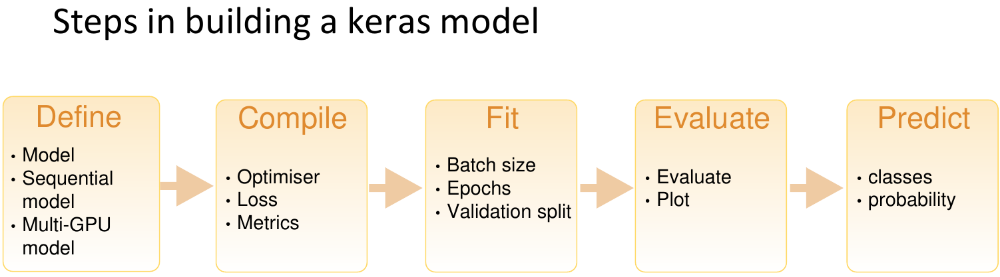

```{r setup, include = FALSE}
knitr::opts_chunk$set(
  cache = FALSE, # if TRUE knitr will cache results to reuse in future knits
  fig.width = 4, # the width for plots created by code chunk
  fig.height = 3, # the height for plots created by code chunk
  fig.align = 'center', # how to align graphics. 'left', 'right', 'center'
  dpi = 300, 
  dev = 'png', # Makes each fig a png, and avoids plotting every data point
  # eval = FALSE, # if FALSE, then the R code chunks are not evaluated
  # results = 'asis', # knitr passes through results without reformatting
  echo = TRUE, # if FALSE knitr won't display code in chunk above it's results
  message = TRUE, # if FALSE knitr won't display messages generated by code
  strip.white = TRUE, # if FALSE knitr won't remove white spaces at beg or end of code chunk
  warning = FALSE, # if FALSE knitr won't display warning messages in the doc
  error = TRUE) # report errors
```

If you are compiling to pdf, for submission, 

  - after having run all your code
    - So that the results of each code block is visible
  - Then uncomment the line above
    - that says `  # eval = FALSE, `


# LE5: Introduction to Deep Learning

Grading Rubric:

  *LE5a (2 points)
  *LE5b (3 points)
  *LE5c (4 points)


-----------------PLEASE READ BEFORE DOING THE ASSIGNMENT-----------------------

Now that we are doing deep learning[1], 

  - we will need to be a little more careful abouthow we utilize the HPC. 
  
You will need to **reserve a compute node WITH A GPU** 

  - in order to complete this assignment. 
  
You can test that you have a working GPU in your requested compute node

  - by going into your linux Terminal 
    - (right next to the R console below). 
  - It should have a stylized (ASCII Art) TensorFlow[2] logo.
    - We are using TensorFlow2 version 2.12 this year
  - TensorFlow1 was introduced in 2015
    - And in 2020, we were using TF version 1.17

If you are working with the Keras package, 

  - and at any time you get an error 
    - that refers to **conda/python**, 
  - **DO NOT download the "fix" onto your computer**. 
  - It will break your TensorFlow environment, 
    - and it is difficult to fix. 
  - The fix is to go into Rstudio's Global Options
    - Find the Python choice on the left navbar
    - And confirm that it is set to point to `/usr/local/bin/python`

You can check your R package library path

  - by using the `.libPaths()`
    - In your R console
  - The **first R package library path**
    -  **Has to be '[1] "/home/rxf131/ondemand/ubuntu2004/r4" '**

If this isn't the first path you see for .libPaths()

  - Then you can reset your libPaths to the correct one
    - by running this code block

```{r, eval = FALSE}
source('/home/rxf131/ondemand/share/config2004/r-lib-path-fix.R')
```

--------------------------------------------------------------------------------

### LE5a: Deep Learning Short Answer


#### Question 1: What is an activation function, and what does it do? 

  - Please provide two examples 
    - and compare/contrast them. 

ANSWER =>

#### Question 2: What is stochastic gradient descent 

  - in the context of machine learning?

ANSWER =>

#### Question 3: What happens if the learning rate 

  - is too high
    -  or too low 
  - during gradient descent?

ANSWER =>

#### Question 4: What is the loss of a neural network model?

ANSWER =>

#### Question 5: What is back propagation, 

  - and why is it important?

ANSWER =>

--------------------------------------------------------------------------------

### LE5b: Working with the MNIST dataset

Let’s look at a concrete example of a neural network 

  - that uses the Keras R package [3,4]
  - to learn to classify handwritten digits. 
  
The problem we’re trying to solve here is 

  - to classify grayscale images of handwritten digits (28 × 28 pixels) 
    - into their 10 categories (0 through 9). 

We’ll use the MNIST dataset, [5] 

  - a classic in the machine-learning community, 
    - which has been around almost as long as the field itself
    - and has been intensively studied. 
    
It’s a set of 

  - 60,000 training images, 
    - plus 10,000 test images, 
  - assembled by the National Institute of Standards and Technology 
    - (the NIST in MNIST) in the 1980s. 
  - You can think of “solving” MNIST 
    - as the “hello world” of deep learning
  - it’s what you do to verify that your algorithms are working as expected. 
    
You can see some sample digits in the figure below.


The MNIST dataset comes preloaded in Keras, 

  - in the form of train and test lists,

Each of which includes 

  - a set of images (x) 
    = and associated labels (y).

```{r LoadData}
set.seed(1234567)
library(keras)
# Note: we don't explicitly library(TensorFlow). Keras will take care of that.
library(tidyverse)

mnist <- dataset_mnist()
train_images <- mnist$train$x
train_labels <- mnist$train$y
test_images <- mnist$test$x
test_labels <- mnist$test$y

str(train_images)
str(train_labels)

str(test_images)
str(test_labels)
```


Let’s jump right in and start building a network! 

There are 5 basic steps in building any Keras NN model:



We first create the architecture for our model 

  - before actually training it on our training data:

```{r DefineNN1}
network <- keras_model_sequential() %>%
  layer_dense(units = 512,
              activation = "relu",
              input_shape = c(28 * 28)) %>%
  layer_dense(units = 10, activation = "softmax")
```

The red text you get here, is TensorFlow2 talking to you

  -  Telling you what it sees going on
    - Did it find a GPU, etc
  - So its useful to read what TF is saying
    - even if we don't exactly understand what its saying
  - after a while you'll get familiar with 
    - what is "normal"
    - and what is "an error, or mistake"
    
-------


The core building block of neural networks is the layer, 

  - a data-processing module that you can think of as a filter for data. 
  
Some data goes in, 

  - and it comes out in a more useful form. 

Specifically, layers extract representations out of the data fed into them

  - hopefully, representations that are more meaningful for the problem at hand. 
  
Most of deep learning consists of chaining together simple layers 

  - that will implement a form of progressive data distillation. 
  
A deep-learning model is 

  - like a sieve for data processing, 
  - made of a succession of increasingly refined data filters—the layers.

Here, our network consists of a sequence of two layers, 

  - which are densely connected 
    - (also called fully connected) neural layers. 
    
The second (and last) layer 

  - is a 10-way softmax layer, 
  - which means it will return an array of 10 probability scores 
    - (summing to 1). 
  - Each score will be the probability that the current digit image 
    - belongs to one of our 10 digit classes.

To make the network ready for training, 

  - we need to pick three more things, as part of the compilation step:

**A loss function** 

  - How the network will be able to measure its performance on the training data, 
    - and thus how it will be able to steer itself in the right direction.

**An optimizer**

  - The mechanism through which the network will update itself
    - based on the data it sees and its loss function.

**Metrics** to monitor during training and testing

  - Here, we’ll only care about accuracy 
    - (the fraction of the images that were correctly classified).

```{r CompileNN1}
network %>% compile(optimizer = "rmsprop",
                    loss = "categorical_crossentropy",
                    metrics = c("accuracy"))
```

Before training, we’ll preprocess the data 

  - by reshaping it into the shape the network expects 
    - and scaling it so that all values are in the [0, 1] interval. 
    
Previously, our training images, for instance, 

  - were stored in an array of shape (60000, 28, 28) 
    - of type integer with values in the [0, 255] interval. 
  - We transform it into a double array of shape (60000, 28 * 28) 
    - with values between 0 and 1. We also need to make our labels categorical. 

```{r ReshapeRescaleData4NN1}
train_images <- array_reshape(train_images, c(60000, 28 * 28))
train_images <- train_images / 255

test_images <- array_reshape(test_images, c(10000, 28 * 28))
test_images <- test_images / 255

train_labels <- to_categorical(train_labels)
test_labels <- to_categorical(test_labels)
```

We’re now ready to train the network, 

  - which in Keras is done via a call to the network’s fit method
    - we fit the model to its training data:

```{r FitNN1}
network %>% fit(train_images,
                train_labels,
                epochs = 5,
                batch_size = 128)
```

Two quantities are displayed during training: 

  - **the loss** of the network over the training data, 
  - and **the accuracy** of the network over the training data.

We quickly reach a strong accuracy on the training data. 

Now let’s check that the model performs well 

  - on the test set, too:

```{r EvaluateNN1}
metrics <- network %>% evaluate(test_images, test_labels)
metrics
```

The **test-set accuracy** turns out to be 97.8% 

  - that’s quite a bit lower than the **training set accuracy**. 
  
This gap between training accuracy and test accuracy 

  - is an example of **overfitting** 
    - the fact that machine-learning models tend to perform worse 
    - on new data than on their training data.

Let’s generate predictions 

  - for the first 10 samples of the test set:

```{r PredictNN1}
network %>% predict(test_images[1:10, ]) %>% k_argmax()
```

We can see that these predictions 

  - are sensible to what we would expect. 
    - Well done!
  - You've created a working neural network using Keras. 
  
Now it's time to try some things out for yourself. 

Please go through and change three parameters in the model we just made. 

  - Explain how your changes have affected the model fitting, 
    - and explain why they have the effect that they have. 

It could be anything 

  - (number of epochs, 
  - type of layer, 
  - layer size, 
  - optimizer, 
  - loss, etc). 
  
These changes don't even need to improve the accuracy of the model,

  - just be able to link the changes you notice in your model's performance
    - to your changed inputs. 

If you're having trouble, I'd recommend leafing through 

  - Deep Learning with R [6] to get ideas. 
  
So for each step in the Keras NN modeling

  - Define what changes you made
  - And what difference it made

```{r DefineNN2}

```

ANSWER =>

```{r CompileNN2}

```

ANSWER =>

```{r FitNN2}

```

ANSWER =>

```{r EvaluateNN2}

```

ANSWER =>

```{r PredictNN2}

```

ANSWER =>

--------------------------------------------------------------------------------

### LE5c: Classifying Movie Reviews

Two-class classification, 

  - or binary classification, 
    - is one of the most common kinds of machine learning problems. 
    
In this example, 

  - you’ll learn to classify movie reviews 
    - as positive 
    - or negative, 
  - based on the text content of the reviews. 
  
This should sound a little similar 

  - to how we worked with the billboards music data earlier this semester. 

You’ll work with the IMDB dataset: 

  - a set of 50,000 highly polarized reviews 
    - from the Internet Movie Database. 
  - They’re split into 25,000 reviews for training 
    - and 25,000 reviews for testing, 
  - each set consisting of 
    - 50% negative 
    - and 50% positive reviews.

```{r LoadDataNN3}
imdb <- dataset_imdb(num_words = 10000)
c(c(train_data, train_labels), c(test_data, test_labels)) %<-% imdb

str(train_data[1])
str(train_labels)
```

The argument `num_words = 10000` 

  - means you’ll keep only the top 10,000 most frequently occurring words 
    - in the training data. 
  - Rare words will be discarded. 

This allows you to work with 

  - vector data of a manageable size.

The variables `train_data` and `test_data` 

  - are lists of reviews; 
  - each review is a list of word indices 
    - (encoding a sequence of words). 
    
The `train_labels` and `test_labels` 

  - are lists of 0s and 1s, 
    - where 0 stands for negative 
    - and 1 stands for positive.

You can’t feed lists of integers 

  - into a neural network. 
  
You have to turn your lists 

  - into **tensors**.
  - This is why its called "TensorFlow"
  
There are two ways to do that:

**Pad your lists** 

  - so that they all have the same length, 
  - turn them into an integer tensor of shape (samples, word_indices), 
    - and then use as the first layer in your network 
    - a layer capable of handling such integer tensors 
  -  (This layer is the “embedding” layer, 
    - which we’ll cover in detail later in the book).

**One-hot encode** your lists 

  - to turn them into vectors of 0s and 1s. 
  - This would mean, for instance, 
    - turning the sequence [3, 5] 
  - into a 10,000-dimensional vector that would be all 0s 
    - except for indices 3 and 5, 
    - which would be 1s. 
  - Then you could use as the first layer in your network 
    - a dense layer, 
    - capable of handling floating-point vector data.

Let’s go with the latter solution 

  - to vectorize the data, 
    - which you’ll do manually for maximum clarity.
  - So you can see how this works.

```{r OneHotEncodeNN3}
vectorize_sequences <- function(sequences, dimension = 10000) {
  results <- matrix(0, nrow = length(sequences), ncol = dimension)
  
  for (i in 1:length(sequences))
    results[i, sequences[[i]]] <- 1
  
  return(results)
  
}

x_train <- vectorize_sequences(train_data)
x_test <- vectorize_sequences(test_data)

y_train <- as.numeric(train_labels)
y_test <- as.numeric(test_labels)
```

The input data are vectors, 

  - and the labels are scalars (1s and 0s): 
  - this is the easiest setup you’ll ever encounter. 
  
A type of neural network that performs well on such a problem 

  - is a simple stack of fully connected (dense) layers 
    - with relu activations: 
    - `layer_dense (units = 16, activation = "relu")`.

The argument being passed to each dense layer (16) 

  - is the number of hidden units ( or nodes) in the layer. 
  - A hidden unit is a dimension in the representation space of the layer.

You can intuitively understand the **dimensionality of your representation space** 

  - as “how much freedom you’re allowing the network to have 
    - when learning internal representations.” 
  - Having more hidden units 
    - (a higher-dimensional representation space)
  - allows your network to learn more-complex representations, 
    - but it makes the network more computationally expensive 
  - and may lead to learning unwanted patterns 
    - (patterns that will improve performance on the training data 
    - but not on the test data).

There are two key architecture decisions to be made 

  - about such a stack of dense layers:
    - How many layers to use
    - How many hidden units to choose for each layer

```{r DefineNN3}
model <- keras_model_sequential() %>%
  layer_dense(units = 16,
              activation = "relu",
              input_shape = c(10000)) %>%
  layer_dense(units = 16, activation = "relu") %>%
  layer_dense(units = 1, activation = "sigmoid")
```

Finally, you need to choose 

  - a loss function 
  - and an optimizer. 
  
Because you’re facing a binary classification problem 

  - and the output of your network is a probability 
    - (you end your network with a single-unit (single node) layer 
    - with a sigmoid activation), 
  - it’s best to use the binary_crossentropy loss. 
  
It isn’t the only viable choice: 

  - you could use, for instance, mean_squared_error. 
  - But crossentropy is usually the best choice 
    - when you’re dealing with models that output probabilities. 
  - Crossentropy is a quantity from the field of Information Theory [7,8]
    - that measures the distance between probability distributions 
  - or, in this case, 
    - between the ground-truth distribution and your predictions.

```{r CompileNN3}
model %>% compile(optimizer = "rmsprop",
                  loss = "binary_crossentropy",
                  metrics = c("accuracy"))
```

In order to monitor during training the accuracy of the model 

  - on data it has never seen before, 
    - you’ll create a validation set 
    - by setting apart 10,000 samples from the original training data.

```{r ReshapeRescaleNN3}
val_indices <- 1:10000

x_val <- x_train[val_indices,]
partial_x_train <- x_train[-val_indices,]

y_val <- y_train[val_indices]
partial_y_train <- y_train[-val_indices]
```


You’ll now train the model for 20 epochs 

  - (20 iterations over all samples in the x_train and y_train tensors), 
    - in mini-batches of 512 samples. 
  - At the same time, you’ll monitor 
    - loss and accuracy on the 10,000 validation samples 
    - that you set apart. 
  - You do so by passing the validation data 
    - as the validation_data argument.

```{r FitNN3}
history <- model %>% fit(
  partial_x_train,
  partial_y_train,
  epochs = 20,
  batch_size = 512,
  validation_data = list(x_val, y_val)
)
```

Note that the call to fit() 

  - returns a history object. 
  - Let’s take a look at it.
  
The history object includes 

  - parameters used to fit the model 
    - (`history-$params`) 
  - as well as data for each of the metrics being monitored 
    - (`history$metrics`).

The history object 

  - has a plot() method 
  - that enables you to visualize 
    - training and
    - validation metrics by epoch.

```{r}
str(history)
plot(history)
```

As you can see, 

  - the training loss decreases 
    - with every epoch, 
  - and the training accuracy increases 
    - with every epoch. 
    
That’s what you would expect 

  - when running a gradient-descent optimization
    - the quantity you’re trying to minimize 
    - should be less with every iteration. 
  - But that isn’t the case for 
    - the validation loss and accuracy: 
    - they seem to peak at the fourth epoch. 
    
This is an example of what we warned against earlier: 

  - a model that performs better on the training data 
    - isn’t necessarily a model that will do better on data 
    - it has never seen before. 

In precise terms, what you’re seeing is overfitting: 

  - after the second epoch, 
    - you’re overoptimizing on the training data, 
  - and you end up learning representations 
    - that are specific to the training data 
    - and don’t generalize to data outside of the training set.

In this case, to prevent overfitting, 

  - you could stop training after three epochs. 

In general, 

  - you can use a range of techniques to mitigate overfitting.

```{r DefineCompileFitEvaluateNN4}
model <- keras_model_sequential() %>%
  layer_dense(units = 16,
              activation = "relu",
              input_shape = c(10000)) %>%
  layer_dense(units = 16, activation = "relu") %>%
  layer_dense(units = 1, activation = "sigmoid")

model %>% compile(optimizer = "rmsprop",
                  loss = "binary_crossentropy",
                  metrics = c("accuracy"))

model %>% fit(
  x_train,
  y_train,
  epochs = 4,
  batch_size = 512,
  validation_data = list(x_val, y_val)
)

results <- model %>% evaluate(x_test, y_test)

results
```

We can also mitigate overfitting 

  - through the addition of a droupout layer. 

Dropout is one of the most effective and most commonly used 

  - regularization techniques for neural networks; 
  - it was developed by Geoff Hinton 
    - and his students at the University of Toronto. 

Dropout, applied to a layer, 

  - consists of randomly dropping out (setting to zero) 
  - a number of output features of the layer during training.

This technique may seem strange and arbitrary. 

  - Why would this help reduce overfitting? 
  - Hinton says he was inspired by, among other things, 
    - a fraud-prevention mechanism used by banks. 
  - In his own words, 
    - “I went to my bank. 
    - The tellers kept changing and I asked one of them why. 
    - He said he didn’t know but they got moved around a lot.
  - I figured it must be because it would require cooperation 
    - between employees to successfully defraud the bank. 
  - This made me realize that 
    - randomly removing a different subset of neurons 
    - on each example 
    - would prevent conspiracies and thus reduce overfitting.” 
  - The core idea is that introducing noise 
    - in the output values of a layer 
    - can break up happenstance patterns 
    - that aren’t significant 
      - (what Hinton refers to as conspiracies), 
    - which the model will start memorizing if no noise is present.

You can add a dropout layer in R 

  - using `layer_dropout(percent)`, 
    - where the percent argument is something like 0.3. 
  - Try adding dropout layers between your dense layers 
    - in your model and see what kind of effect 
    - it has on your validation loss. 

```{r DefineCompileFitEvaluateNN5}

```

ANSWER => 

Play around with all of the parameters in your model 

  - in order to get the best fit that you can achieve. 
    - Add more layers, 
    - use less units in a layer, 
    - try different loss and activation functions, etc. 
    
Explain the changes that you've made 

  - and why they make your model more accurate. 

So for each step in the Keras NN modeling

  - Define what changes you made
  - And what differenece it made

```{r DefineNN6}

```

ANSWER =>

```{r CompileNN6}

```

ANSWER =>

```{r FitNN6}

```

ANSWER =>

```{r EvaluateNN6}

```

ANSWER =>

```{r PredictNN6}

```

ANSWER =>


--------------------------------------------------------------------------------

1. Y. LeCun, Y. Bengio, and G. Hinton, “Deep learning,” Nature, vol. 521, no. 7553, pp. 436–444, May 2015, doi: 10.1038/nature14539. [Online]. Available: http://www.nature.com/articles/nature14539. [Accessed: 05-Mar-2022]

2. M. Abadi, P. Barham, J. Chen, Z. Chen, A. Davis, J. Dean, M. Devin, S. Ghemawat, G. Irving, M. Isard, M. Kudlur, J. Levenberg, R. Monga, S. Moore, D. G. Murray, B. Steiner, P. Tucker, V. Vasudevan, P. Warden, M. Wicke, Y. Yu, and X. Zheng, “TensorFlow: A System for Large-Scale Machine Learning,” in Proceedings of the 12th USENIX Symposium on Operating Systems Design and Implementation 16, Savannah, GA, 2016, pp. 265–283 [Online]. Available: https://www.usenix.org/conference/osdi16/technical-sessions/presentation/abadi. [Accessed: 26-Jan-2019]

3. F. Chollet and others, “Keras,” 2015.  [Online]. Available: https://github.com/fchollet/keras

4. T. Kalinowski, D. Falbel, J. J. Allaire, F. Chollet, RStudio, Google, Y. Tang  [ctb, cph, W. V. D. Bijl, M. Studer, and S. Keydana, keras: R Interface to “Keras.” 2022 [Online]. Available: https://CRAN.R-project.org/package=keras. [Accessed: 20-Mar-2022]

5. Y. LeCun, B. E. Boser, J. S. Denker, D. Henderson, R. E. Howard, W. E. Hubbard, and L. D. Jackel, “Handwritten Digit Recognition with a Back-Propagation Network,” in Advances in neural information processing systems, 1989, vol. 2, p. 9 [Online]. Available: https://proceedings.neurips.cc/paper/1989/file/53c3bce66e43be4f209556518c2fcb54-Paper.pdf

6. Francois Chollet and J. J. Allaire, Deep Learning with R. Manning Publications, 2018 [Online]. Available: https://www.manning.com/books/deep-learning-with-r. [Accessed: 29-May-2019]

7. J. V. Stone, Information Theory: A Tutorial Introduction, 1st edition. England: Sebtel Press, 2015. http://jim-stone.staff.shef.ac.uk/BookInfoTheory/InfoTheoryBookMain.html

8. [1]C. E. Shannon, “A Mathematical Theory of Communication,” SIGMOBILE Mob. Comput. Commun. Rev., vol. 5, no. 1, pp. 3–55, Jan. 2001, doi: 10.1145/584091.584093. [Online]. Available: http://doi.acm.org/10.1145/584091.584093. [Accessed: 24-Dec-2016]


