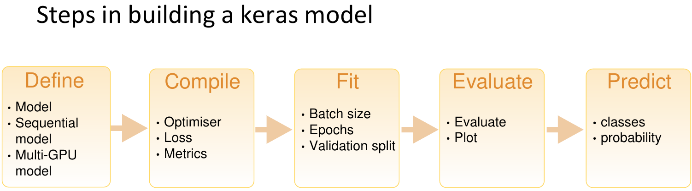
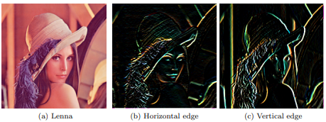
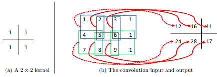
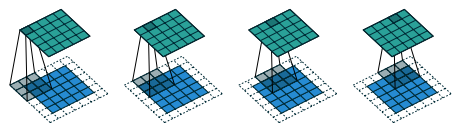
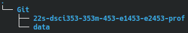
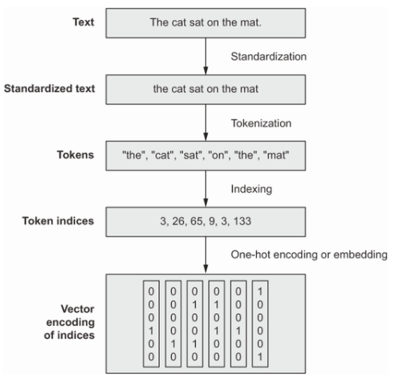

```{r KnitrSetup, include = TRUE}
knitr::opts_chunk$set(
  fig.width = 4, # the width for plots created by code chunk
  fig.height = 3, # the height for plots created by code chunk
  fig.align = 'center', # how to align graphics. 'left', 'right', 'center'
  dpi = 300, 
  dev = 'png', # Makes each fig a png, and avoids plotting every data point
  # cache = TRUE, # if TRUE knitr will cache results to reuse in future knits
  # eval = TRUE, # if FALSE, then the R code chunks are not evaluated
  # results = 'markup', # asis means without reformatting, markup with fences
  # include = TRUE, # Whether to include the chunk output in the output document. 
  echo = TRUE, # if FALSE knitr won't display code in chunk above it's results
  message = TRUE, # if FALSE knitr won't display messages generated by code
  strip.white = TRUE, # if FALSE knitr won't remove white spaces at beg or end of code chunk
  warning = FALSE, # if FALSE knitr won't display warning messages in the doc
  error = TRUE) # report errors
```

\setcounter{section}{6}
\setcounter{subsection}{1}
\setcounter{subsubsection}{0}

## If you are compiling to pdf, for submission, 

  - after having run all your code
    - So that the results of each code block is visible
  - Then uncomment the FOUR lines above
    - that say `cache = TRUE, eval = TRUE, results = "markup", include = TRUE `

And you will want to also do the following 

  - Restart your R session, under the "Session" menu of Rstudio
    - To clear your GPU's memory
    - And any running processes
  - Clear your Global Environment
  - And then Knit to PDF
    - And let your models run

-----------------PLEASE READ BEFORE DOING THE ASSIGNMENT-----------------------

You need sufficient RAM in your GPU node

  - To do this LE.
  - Without requesting enough RAM, 
    - Your R session can hang, and lockup

When I run this LE6, as given 

  - So without any extra NN models, that you will be making. 
  - In my environment
    - It tells me that it will take 10 Gb of RAM
  - So your request for a GPU node on Markov
    - Should be for **24 Gb of RAM and 3 Cores**
      - Remember 1 core for each 8Gb of RAM
    - **and 1 GPU**

--------------------------------------------------------------------------------

Check your R package library path

  - by using the `.libPaths()`
    - In your R console
  - The **first R package library path**
    -  **Has to be '[1] "/home/rxf131/ondemand/ubuntu2004/r4" '**

If this isn't the first path you see for .libPaths()

  - Then you can reset your libPaths to the correct one
    - by running this code block

```{r, eval = FALSE, include = TRUE}
source('/home/rxf131/ondemand/share/config2004/r-lib-path-fix.R')
```

--------------------------------------------------------------------------------

Now that we are doing deep learning[1], 

  - we will need to be a little more careful about how we utilize the HPC. 
  
You will need to **reserve a compute node WITH A GPU** 

  - in order to complete this assignment. 
  
You can test that you have a working GPU in your requested compute node

  - by going into your Linux Terminal in Rstudio Server (rxf131)
    - (right next to the R console below). 
  - It should have a stylized (ASCII Art) TensorFlow[2] logo.
    - We are using TensorFlow2 version 2.7 this year
  - TensorFlow1 was introduced in 2015
    - And in 2020, we were using TF version 1.15
    
You can also check the status of your GPU

  - By running the `nvidia-smi` command
    - In your Linux Terminal
    - Which is next to the R console
    - Or in a separate 
      - Linux Terminal Shell
      -  or a LXDE or other desktop session

--------------------------------------------------------------------------------

If you are working with the Keras package, 

  - and at any time you get an error 
    - that refers to **conda/python**, 
  - **DO NOT download the "fix" onto your computer**. 
  - It will break your TensorFlow environment, 
    - and it is difficult to fix. 
  - The fix is to go into Rstudio's Global Options
    - Find the Python choice on the left navbar
    - And confirm that it is set to point to `/usr/local/bin/python`


--------------------------------------------------------------------------------

We'll also continue labeling our R code blocks (or "code chunks")

  - After the basic steps in building NN models
    - Using the Keras "layer" API

When we give a name to a code chunk

  - There can be no spaces in the code chunk name



But we'll also expand to add a couple of more steps, as follows

  - 1. **LoadDataNN**
    - Load, split and label your data
  - 2. **Reshape-RescaleNN**
    - If you need to make images into vectors
    - And scale the values to between 0 and 1, 
      - or -1 and 1
  - 3. **DefineNN**
    - Define the layer structure of your NN model
  - 4. **CompileNN** 
    - Define the optimizer, loss and metrics
      - and put the NN model together
      - and check your model structure with `summary`
  - 5. **FitNN** 
    - Train your NN model
      - By feeding batches of training data
      - And 1 epoch is when you feed all training data once
      - So we typically train for 5, 10, 50 epochs
  - 6. **EvaluateNN** 
    - Evaluate the NN's performance 
      - Often by `plot(history)`
      - If you have been using `callbacks` from your GPU during training
  - 7. **PredictNN** 
    - predict for your test data
      - Now use your NN to predict the responses/results
      - When you feed it your test data


--------------------------------------------------------------------------------

# LE6: Convolutional Neural Networks & Natural Language Processing

Grading Rubric:

  * LE6a (3 points)
  * LE6b (4 points)
  * LE6c (2 points)

## LE6a: Introduction to Convolutional Neural Networks (CNNs) (3 points)

In LE5 we classified MNIST numerical digits using a densely connected network.

  - This gave a good classification accuracy.
  - However, we can do better on images 
    - using an operation known as convolution.

### A little review of convolution and pooling operations: 

Convolution is an operation that takes two functions and outputs a third that

  - indicates how one affects the other.
  - The first two functions can be thought of as the image and the kernel.
    - The image is just that, what we are looking to classify.
    - The kernel is an n x n matrix that traverses the entirety of the image.
  - The third function is the feature map.
    - This is where the kernel's outputs after convolving the image are mapped.
    - The **feature map** can be seen in the figure below 
    - as the 2 x 2 turqoise matrix [1].

As seen in the figure below, the convolution step causes a loss of dimensions

  - if there is no padding present.
  


Different kernels are designed to highlight certain features and minimize all

  - other features.
  - The image below has three pictures:
    - a) The original.
    - b) All horizontal edges.
    - c) All vertical edges [2].
  - The matrices designed to pull out the horizontal and vertical edges is known
    - as a Sobel matrix.
    - The vertical kernel is simply the transpose of the horizontal kernel.
    


It is key to remember, a computer does not visualize images in the same manner

  - as humans.
  - They see in the form of numbers 
    - with color and grayscale 
    - each having their own unique matrix forms.
  - The image below shows how a simple kernel 
    - can convolve a 3 x 4 matrix and
    - output a 2 x 3 matrix [2].
  


When there is padding surrounding an image (clear grids shown below) then one

  - can control whether or not there is a reduction in dimensions 
  - within the associated feature map [1].
  


Padding can be added in the form 

  - of zeros (blank space) 
  - or even mirroring an image.

However, it is key to note that maintaining dimensionality is not always

  - integral to a well-performing model.

Pooling does just this, it is designed to reduce the amount of data fed into

  - the next portion of the model.
  - Pooling is essentially an n x n kernel (usually 2 x 2) 
    - that takes the maximum value 
    - and maps it to a new feature map.
  - The pooling kernel can also take 
    - the average of the n x n region, 
    - it must just be specified while building the model.

While pooling, the kernel will move over, with a "stride" of n pixels 

  - instead of 1; 

This guarantees

  - a drop of 1/(n^2) in data throughput.
  
The idea is that if less data is delivered to the fully connected neural network

  - then it will be more efficient time AND power-rise.
  - Additionally, then the important features mostly remain while the less
    - important (background) features are dropped.
  - This is why CNNs are spatially invariant; they only care about the features
    - themselves, not where they are located.

### Applying A CNN to the MNIST Dataset. 

We will begin as we always do with setting up our environment.

```{r, include = TRUE}
# Setting a seed for replicability
set.seed(1)

# Initializing our packages.
library(keras)
library(tidyverse)
```

Import and reorganize the dataset.

```{r LoadDataNN1, include = TRUE}
# Import the dataset.
mnist <- dataset_mnist()

# Split the dataset.
train_images <-
  array_reshape(mnist$train$x, c(60000, 28, 28, 1)) / 255
test_images <-
  array_reshape(mnist$test$x, c(10000, 28, 28, 1)) / 255

# Label the two datasets.
train_labels <- mnist$train$y
test_labels <- mnist$test$y
```

### Creating the CNN model, NN1.

```{r DefineNN1, include = TRUE}
# Our inputs are 28 pixels by 28 pixels and are grayscale, hence the 1 layer depth.
inputs <- layer_input(shape = c(28, 28, 1))

# Operations to reach our output.
outputs <- inputs %>%
  layer_conv_2d(filters = 32,
                kernel_size = 3,
                activation = "relu") %>%
  layer_max_pooling_2d(pool_size = 2) %>%
  layer_conv_2d(filters = 64,
                kernel_size = 3,
                activation = "relu") %>%
  layer_max_pooling_2d(pool_size = 2) %>%
  layer_conv_2d(filters = 128,
                kernel_size = 3,
                activation = "relu") %>%
  layer_flatten() %>%
  layer_dense(10, activation = "softmax")

# Passing our input and output layers to Keras.
model <- keras_model(inputs, outputs)
```

How many layers are in the model above? What are they (what is their purpose)?

  - (Hint: you can type the model name into a code chunk 
    - and run it to look at it.)

ANSWER=> There's 7 layers in this model, and they are categorized accoridng to their specific purpose:

- 3 convolutional layers: 1 for 32 filters, 1 for 64 filters and 1 for 128 filters:
  - each of them use the ReLU activation
  
- 2 pooling layers: reduce the spatial dimensions of the feature maps produced by the convolutional layers by taking 2 pools

- 1 flattening layer: flatten the output of the last layer_conv_2d to a 1D vector

Compiling the CNN model.

```{r CompileNN1, include = TRUE}
model %>% compile(optimizer = "rmsprop",
                  loss = "sparse_categorical_crossentropy",
                  metrics = c("accuracy"))
```

And now fit your CNN model

```{r FitNN1, include = TRUE}
model %>% fit(train_images,
              train_labels,
              epochs = 5,
              batch_size = 64)
```

You should check and see how much you've occupied your GPU

  - Run `nvidia-smi` in your Linux Terminal
  
How much GPU RAM is Occupied?  

ANSWER-> 10866 Megabytes

```{r EvaluateNN1, include = TRUE}
metrics <- model %>% evaluate(test_images, test_labels)
metrics
```

How does this model compare to those used on MNIST in LE5?

ANSWER=> The error is less, the accuracy is more

Try running the same model with more epochs below.
```{r FitNN1b, include = TRUE}
model %>% fit(train_images,
              train_labels,
              epochs = 10,
              batch_size = 64)
```

Does this improve your result much in comparison to the first model?

  - Please explain why you think it does/does not?

ANSWER=> Running the same model with increased epochs improved the accuracy and decreased the error by 0.0154. This is because we have already trained the data and we can readjust the already existing weights to understand the existing training data better, but this can lead to overfitting and can make the model not perform as well on new data.

### Here is a new CNN model (NN2) with something changed.

```{r DefineNN2, include = TRUE}
inputs <- layer_input(shape = c(28, 28, 1))

outputs <- inputs %>%
  layer_conv_2d(filters = 32,
                kernel_size = 3,
                activation = "relu") %>%
  layer_conv_2d(filters = 64,
                kernel_size = 3,
                activation = "relu") %>%
  layer_conv_2d(filters = 128,
                kernel_size = 3,
                activation = "relu") %>%
  layer_flatten() %>%
  layer_dense(10, activation = "softmax")

model2 <- keras_model(inputs = inputs, outputs = outputs)
```

What is different about this model?

  - Would you expect this to improve the performance or not?

ANSWER=> There's no pooling, and this may impair the performance of the model because we now consider more outputs from different features, making the model less robust and take a lot more computation

Run the model below to verify your answer.

```{r CompileNN2, include = TRUE}
model2 %>% compile(optimizer = "rmsprop",
                  loss = "sparse_categorical_crossentropy",
                  metrics = c("accuracy"))
```

```{r FitNN2, include = TRUE}
model2 %>% fit(train_images,
              train_labels,
              epochs = 5,
              batch_size = 64)
```

```{r EvaluateNN2, include = TRUE}
metrics <- model2 %>% evaluate(test_images, test_labels)
metrics
```

Were you correct or not?

  - If you were incorrect, why do you think the model performed differently
  - than you initially thought.

ANSWER=> The performance decreased as expected

### Create your own model below based on CNN model NN1, 

  - but this time add at least one dense layer.

Remember that the dimensions (number of neurons) in the first layer do not

  - have to match the flattened image.
    - So, the number of inputs to a neuron does not matter.
  - However, it is key to note that the number of neurons at the output layer
  - must match the number of classes that you are trying to classify within.
    - In this case zero through nine, so ten classes.
    
```{r DefineNN3, include = TRUE}
# Our inputs are 28 pixels by 28 pixels and are grayscale, hence the 1 layer depth.
inputs <- layer_input(shape = c(28, 28, 1))

# Operations to reach our output.
outputs <- inputs %>%
  layer_conv_2d(filters = 32,
                kernel_size = 3,
                activation = "relu") %>%
  layer_max_pooling_2d(pool_size = 2) %>%
  layer_conv_2d(filters = 64,
                kernel_size = 3,
                activation = "relu") %>%
  layer_max_pooling_2d(pool_size = 2) %>%
  layer_conv_2d(filters = 128,
                kernel_size = 3,
                activation = "relu") %>%
  layer_flatten() %>%
  layer_dense(10, activation = "softmax")

# Passing our input and output layers to Keras.
model3 <- keras_model(inputs, outputs)
```

```{r CompileNN3, include = TRUE}
model3 %>% compile(optimizer = "rmsprop",
                  loss = "sparse_categorical_crossentropy",
                  metrics = c("accuracy"))
```


```{r FitNN3, include = TRUE}
model3 %>% fit(train_images,
              train_labels,
              epochs = 10,
              batch_size = 64)
```

```{r EvaluateNN3, include = TRUE}
metrics <- model3cd  %>% evaluate(test_images, test_labels)
metrics
```

What happened to the performance of your model when you added the new layers?

  - You can play around with epochs and time as well.
  - Accuracy is not the only metric you can consider.

ANSWER=> 

--------------------------------------------------------------------------------

## LE6b: CNNs Continued (4 points)

### We will be using a Kaggle data set 

  - with pictures of cats and dogs for this portion.

To make it easier to access the data, 

  - **please download (to your OnDemand desktop)**
  - from this link: (it's called the training data set)
    - https://drive.google.com/file/d/1C2Q_evoxt79mJ-W3Lp2_awHu7K_OkEVB/view?usp=sharing

Our datasets are getting larger as we get into deep learning.

  - If your forked repo gets too large 
    - then it may break/take extraordinarily long to push.
  - To prevent this we will have you save the data 
    - in another location outside of of our personal class Git repository. 

Please begin by creating a new folder under your Git folder called "**data**".

  - **Note: this is NOT your repo folder under your Git folder.**
  - The path should be "/home/caseID/Git/" in HPC.
  - This can be seen in the tree image below.
  


Once you have downloaded the file, 

  - please copy and paste it from your downloads folder
    - to your "/home/caseID/Git/data" folder.
  - This is the same folder that you just created above.

Then we will unzip the data using this code below.

  - **ONLY RUN THIS ONCE, YOU DO NOT NEED TO UNZIP AGAIN!**
  
```{r, include = TRUE, eval = FALSE}
# Initialize the zip package.
library(zip)

# Unzip the file to your data folder.
zip::unzip("../../../../data/train.zip", exdir = "../../../../data/")
```

This dataset may be a little larger 

  - than others you've worked with in the past:
    - It has 50,000 images.
  - The zip file alone, is 1/2 Gb

### We will build smaller subsets here 

  - of training, 
  - validation, 
  - and testing data.
  
```{r LoadDataNN4, include = TRUE}
# Directory pointers.
original_dir <- fs::path("../../../../data/train/")
new_base_dir <- fs::path("../../../../data/cat_vs_dogs_small")

# A function to create the subsets for us.
make_subset <- function(subset_name, start_index, end_index) {
  categories <- c("dog", "cat")
  df <- tidyr::expand_grid(category = categories,
                           id = start_index:end_index) %>%
    dplyr::mutate(file_name = glue::glue("{category}.{id}.jpg"))
  fs::dir_create(new_base_dir / subset_name / categories)
  fs::file_copy(original_dir / df$file_name,
                new_base_dir / subset_name / df$category / df$file_name)
}
```


```{r, include = TRUE, eval = FALSE}
# Making the subsets.
make_subset("train", start_index = 0, end_index = 999)
make_subset("validation", start_index = 1000, end_index = 1499)
make_subset("test", start_index = 1500, end_index = 2499)
```

We have created 

  - 2,000 training images, 
  - 1,000 validation images, 
  - and 2,000 test images
    - with the same numbers of cats and dogs in each.

What is overfitting? 

  - Provide an example in terms of the cats vs. dogs dataset.

ANSWER=> 

### Now we will build a basic CNN model for our dataset.

```{r DefineNN4, include = TRUE}
inputs <- layer_input(shape = c(180, 180, 3))

outputs <- inputs %>%
  layer_rescaling(1 / 255) %>%
  layer_conv_2d(filters = 32,
                kernel_size = 3,
                activation = "relu") %>%
  layer_max_pooling_2d(pool_size = 2) %>%
  layer_conv_2d(filters = 64,
                kernel_size = 3,
                activation = "relu") %>%
  layer_max_pooling_2d(pool_size = 2) %>%
  layer_conv_2d(filters = 128,
                kernel_size = 3,
                activation = "relu") %>%
  layer_max_pooling_2d(pool_size = 2) %>%
  layer_conv_2d(filters = 256,
                kernel_size = 3,
                activation = "relu") %>%
  layer_max_pooling_2d(pool_size = 2) %>%
  layer_conv_2d(filters = 256,
                kernel_size = 3,
                activation = "relu") %>%
  layer_flatten() %>%
  layer_dense(1, activation = "sigmoid")

model4 <- keras_model(inputs, outputs)
```

Let's take a look at our model.

```{r, include = TRUE}
# Displays the structure of our model.
model4
```

### What is the structure of the NN4 model?

ANSWER=> 

How many parameters are their in your NN model 4?

ANSWER=> 

Now we will configure the model for training.

```{r CompileNN4, include = TRUE}
model4 %>% compile(loss = "binary_crossentropy",
                  optimizer = "rmsprop",
                  metrics = "accuracy")
```

Our data currently sits as .jpg files 

  - so we need to perform some data pre-processing 
    - in order to feed it into the model.

The Reshape-Rescale steps neeeded are:

  - Read the files.
  - Decode the .jpg format to 3 grids of pixels (RGB).
  - Change these grids into floating-point tensors.
  - Cut them down to a uniform size (180 x 180 in this case).
  - Put them in batches of images (32 per batch in this case).

Using Keras, we can essentially do these steps automatically.

```{r ResharepRescaleNN4, include = TRUE}
# Performing our data pre-processing and assigning the images to their associated
# set. The function will return a TensorFlow dataset object that is designed to 
# read all of the images, randomize their order, store them as tensors, resize 
# said tensor, and batch them.
train_dataset <- image_dataset_from_directory(
  new_base_dir / "train",
  image_size = c(180, 180),
  batch_size = 32)

validation_dataset <- image_dataset_from_directory(
  new_base_dir / "validation",
  image_size = c(180, 180),
  batch_size = 32)

test_dataset <- image_dataset_from_directory(
  new_base_dir / "test",
  image_size = c(180, 180),
  batch_size = 32)
```

Why would you use batches of images?

ANSWER=> 

Now we will run the model.

```{r FitNN4, include = TRUE}
# This saves the model after each epoch and only keep the best model based on 
# the validation loss.
callbacks <- list(
  callback_model_checkpoint(
    filepath = "convnet_from_scratch.keras",
    save_best_only = TRUE,
    monitor = "val_loss"
  )
)

# Tracking the model's performance over each epoch.
history <- model4 %>%
  fit(
    train_dataset,
    epochs = 30,
    validation_data = validation_dataset,
    callbacks = callbacks
  )
```

Visualizing the model's evolution 

  - throughout all iterations.

```{r, include = TRUE}
plot(history)
```

Testing the best model 

  - against the test data set.

```{r EvaluateNN4, include = TRUE}
# Reading in the best model after training.
test_model <- load_model_tf("convnet_from_scratch.keras")

# Running and outputting the results against testing data.
result <- evaluate(test_model, test_dataset)
cat(sprintf("Test accuracy: %.3f\n", result["accuracy"]))
```

Why may overfitting be a concern in the case of this example?

ANSWER=> 

Now that we have walked through a couple examples of CNNs, 

### Let's have you make your own CNN model NN5.
  
This may be intimidating if this is your first time building your own CNN

  - so please start early 
    - and come to office hours
    - and use the Slack channel 
    - if you have questions.
    
All necessary code is provided above, 

  - it's just like building blocks in this
    - specific case where you can stack them as you see fit.
  - **Please call your model, "NN5,"** 
    - **and don't forget to save the best result**
    - **to use for classifying the test data set.**
  - **Please change variables as you see fit.** 
    - **Your goal is to improve upon the**
    - **basic model above.**

Variables that you may want to change include:  

  - Number of layers.
  - Input dimensions.
  - Number of feature maps.
  - Type of pooling,
  - Number of epochs.
  - Training metric.
  - Number of neurons.

Please create CNN model NN5 here.

  - After after each step, 
    - At the `ANSWER=>`  prompt
  - Describe what you are doing
  
```{r DefineNN5, include = TRUE}
# Add your code here.

```

ANSWER=>

```{r CompileNN5, include = TRUE}
# Add your code here.

```

ANSWER=>

```{r FitNN5, include = TRUE}
# Add your code here.

```

ANSWER=>

```{r EvaluateNN5, include = TRUE}
# Add your code here.

```

ANSWER=>

```{r PredictNN5}
# Add your code here.
```

You have used the textbook's model and created your own; 

Which one is performing
  - better?
  - Why do you think this?
  - Please explain why you think any difference between your model and theirs
  - resulted in changes in performance.

ANSWER=> 

--------------------------------------------------------------------------------

## LE6c: Introduction to Natural Language Processing (NLP) (2 points)

Human languages or **natural** languages are those created through evolution of 

  - usage and followed by rules.

Machine languages were designed by humans 

  - where the rules came before the 
    - actual use.

Because a large amount of human communication occurs through language

  - especially text, 
  - there is great interest in creating algorithms that can understand
  - natural language.

Initial attempts of NLP involved creating rule sets for the entirety of the 

  - English language.
  - Ultimately these models, like ELIZA, used complex rules and pattern matching
  - to hold simple conversations.
  - However, their capabilities remained relatively limited.

### Modern NLP now uses machine learning accompanied by massive datasets 

  - in order toteach computers 
    - and give them the ability to understand natural language.
  - Some goals include:
    - Text classification.
    - Content filtering.
    - Sentiment analysis.
    - Language modeling.
    - Translation.
    - Summarization.

The text-processing model in this example doesn't actually understand text in

  - the same way that you do.
  - Rather, it searches for statistical regularities in input data.
  - So, in comparison to the CNNs above, NLP algorithms use words/sentences 
  - instead of pixels.

It is key to note that, like in the case of CNNs, NLP models require numerical

  - data in the form of tensors.
  - The image below walks through the process:
    - You begin by standardizing all text (remove cases, punctuation, etc.).
    - Then you split unique text into tokens, this could be words, characters, 
    - groups of words, etc.
    - Lastly, you will index all tokens and convert them into numerical vectors [9].
    


### Now we will download the IMDB movie reviews data set for processing words via

  - the bag-of-words approach.
  - Please download the dataset from here:
    - https://drive.google.com/file/d/188Iy5xAlN8-95FaSDolWHljOlXnGNVLp/view?usp=sharing
  - Then you should copy and paste the "aclImdb_v1.tar.gz" file 
    - to your new data folder that we created 
    - under the **Git** folder 
    - in /mnt/pan/courses/dsci353-453/caseID/Git
    - from the last problem.

Next, you should open LXTerminal in an LXDE desktop

  - and navigate to your new data folder under the Git folder.
  - An example pathway to your data folder in the OnDemand environment is:
    - "**/mnt/pan/courses/dsci353-453/caseID/Git**".
  - Remember that you can use **ls** to list all files and folders (directories)
    - in your current directory.
  - **cd** followed by a folder name (in your current directory) will bring you
    - inside said folder.
  - You can always check your working location using **pwd**.
  - If you accidentally enter the wrong folder, you can move "up" outside of it
    - using "**cd ..**".
      - **Tip**: quotation marks are not a part of any of these commands.

Please double check your location in the terminal using pwd and verify that you

  - are in the correct data folder.
  - Then use ls to make sure that you can see the **aclImdb_v1.tar.gz** file.
  - Lastly, run the following command:
    - **tar -xf aclImdb_v1.tar.gz**
  - This may take a while, so just let it run to completion; your final file size
    - should be 618.8 MiB.

Once you have fully extracted the dataset please open the file manager in your 

  - OnDemand desktop.
  - This is the program that we are probably all familiar with, it has a gui/
    - visual view of all folders/files.
  - Please navigate to your Git/data folder and enter the newly created 
    - **aclImdb** file.
  - Right click on empty space and within the box that pops up hover your mouse
    - over **Create New...** then click on **Folder**.
  - Name this folder **DoNotUse**
  - Next, enter the **train** folder.
  - Right click the **unsup** folder and select **Cut**.
  - Hit the back arrow in the upper left and enter your **DoNotUse** folder.
  - Right click anywhere and hit **Paste**.

Now we will set aside 20% of the training text files for validation.
  - **PLEASE ONLY RUN THIS ONCE!**
  
```{r LoadDataNN6, include = TRUE}
# Initialize the fs package for an interface with file-system operations.
library(fs)

# Setting up our directories.
base_dir <- path("../../../../data/aclImdb")
val_dir <- base_dir / "val"
train_dir <- base_dir / "train"

# A function for shuffling.
shuffle <- function(x) sample(x, length(x))
```


```{r, include = TRUE, eval = FALSE}
# Loop to create the validation folder (including "neg" and "pos" within) and 
# randomly select files and move them to their corresponding location within the 
# validation folder.
for (category in c("neg", "pos")) {
  dir_create(val_dir / category)
  file_names <- dir_ls(train_dir / category) %>%
    basename() %>%
    shuffle()
  num_val_samples <- round(0.2 * length(file_names))
  val_file_names <- tail(file_names, num_val_samples)
  file_move(train_dir / category / val_file_names,
            val_dir / category / val_file_names)
}
```

You can look at the aclImdb folder 

  - to verify that a **val** folder was created.

Like in the CNN example from part b, 

  - we will create a batched dataset just with 
  - text files this time.

We are creating three Dataset objects here 

  - for our training, validation, and 
  - testing datasets.
  - **Note**: the default batch size is 32.
  
```{r ReshapeRscaleNN6, include = TRUE}
train_ds <- text_dataset_from_directory("../../../../data/aclImdb/train")
val_ds <- text_dataset_from_directory("../../../../data/aclImdb/val")
test_ds <- text_dataset_from_directory("../../../../data/aclImdb/test")
```

### Now we can try to learn something from this data.

For this LE6 we will process the words as a set 

  - using the **bag-of-words** approach.

Text is encoded for processing by treating it as a "bag" of words.

  - That is you don't care about order.
  - You can treat them as unigrams (individual words) or consider local order 
    - information with N-grams (up to N nummber of words).

An example of a bag with single words for the sentence:

  - "The quick brown fox jumps over the lazy dog"
  - When encoded this becomes:
    - {"brown", "dog", "fox", "jumps", "lazy", "over", "quick", "the", "the"}

Using this encoding allows us to represent the entire text as one vector with

  - each entry as a presence indicator for a certain word.
  - Multi-hot encoding has the following dimensions for the matrix:
    - Rows: total number of words in the dataset.
    - Columns: total number of **unique** words.
  - So, the matrix (on a varied data set) will be composed mostly of zeros,
    - however each row will contain a 1 in the column corresponding to that
    - word; the rest will be zeros in that row.

Let's process the raw text into multi-hot encoded binary word vectors.

```{r OneHotEncodeNN6, include = TRUE}
# Initialize package to use dataset_map() to map a function across an entire dataset.
library(tfdatasets)

text_vectorization <- layer_text_vectorization(max_tokens = 20000,
                                               output_mode = "multi_hot")

text_only_train_ds <- train_ds %>%
  dataset_map(function(x, y) x)
adapt(text_vectorization, text_only_train_ds)

binary_1gram_train_ds <- train_ds %>%
  dataset_map(~list(text_vectorization(.x), .y), num_parallel_calls = 4)
binary_1gram_val_ds <- val_ds %>%
  dataset_map(~list(text_vectorization(.x), .y), num_parallel_calls = 4)
binary_1gram_test_ds <- test_ds %>%
  dataset_map(~list(text_vectorization(.x), .y), num_parallel_calls = 4)
```

### Now we can create a model NN6.

  - This chunk creates a function that builds a model 
  - and can be re-used for each model.
  
```{r DefnineNN6, include = TRUE}
get_model <- function(max_tokens = 20000, hidden_dim = 16) {
  inputs <- layer_input(shape = c(max_tokens))
  outputs <- inputs %>%
    layer_dense(hidden_dim, activation = "relu") %>%
    layer_dropout(0.5) %>%
    layer_dense(1, activation = "sigmoid")
  model <- keras_model(inputs, outputs)
  model %>% compile(optimizer = "rmsprop",
                    loss = "binary_crossentropy",
                    metrics = "accuracy")
  model
}
```

Let's train and test our model.

```{r FitNN6, include = TRUE}
model6 <- get_model()

model6
callbacks = list(
  callback_model_checkpoint("binary_1gram.keras", save_best_only = TRUE)
)

model6 %>% fit(
  dataset_cache(binary_1gram_train_ds),
  validation_data = dataset_cache(binary_1gram_val_ds),
  epochs = 10,
  callbacks = callbacks
)
```

```{r EvaluateNN6, include = TRUE}
model6 <- load_model_tf("binary_1gram.keras")
sprintf("Test acc: %.3f", evaluate(model6, binary_1gram_test_ds)["accuracy"])
```

What results did you get with this model?

ANSWER=> 

Do you feel that running more Epochs 

  - will help get better results with this dataset?
  - Or should we take another approach?

ANSWER=> 

### In the code above we walked through a binary unigram model.

  - Please make a binary **bigram** model 
    - and call it **NN7** in the code
    - chunks below.
  - You **do not** need to re-run the code chunk that creates the validation set.
  - I recommend starting at the step above that uses the layer_text_vectorization()
    - function and seeing what other features are available for said function.
  - Make sure that you understand what the difference between a unigram and 
    - bigram model is in this case.
    
And after each code chunk

  - At the `ANSWER=>`  prompt
  - Describe what you are doing

```{r DefineNN7, include = TRUE}
# Add your code here.

```

ANSWER=>

```{r CompileNN7, include = TRUE}
# Add your code here.

```

ANSWER=>

```{r FitNN7, include = TRUE}
# Add your code here.

```

ANSWER=>

```{r EvaluateNN7, include = TRUE}
# Add your code here.

```

ANSWER=>

```{r PredictNN7, include = TRUE}
# Add your code here.
```

What differences in performance do you see between model6 and model7?
  - Why do you think this is the case?

ANSWER=> 


--------------------------------------------------------------------------------

1. V. Dumoulin and F. Visin, "A guide to convolution arithmetic for deep learning," arXiv, 2016, doi: 10.48550/ARXIV.1603.07285. [Online]. Available: https://doi.org/10.48550/arxiv.1603.07285. [Accessed: 25-Mar-2022]

2. J. Wu, "Introduction to Convolutional Neural Networks," 2017 [Online]. Available: https://cs.nju.edu.cn/wujx/paper/CNN.pdf. [Accessed: 25-Mar-2022]

3. A. L. Maas, R. E. Daly, Pham, Peter T. D. Huang, A. Y. Ng, and C. Potts, "Learning Word Vectors for Sentiment Analysis," Proceedings of the 49th Annual Meeting of the Association for Computational Linguistics: Human Language Technologies, pp. 142-150, 2011 [Online]. Available: http://www.aclweb.org/anthology/P11-1015. [Accessed: 25-Mar-2022]

4. Y. LeCun, Y. Bengio, and G. Hinton, “Deep learning,” Nature, vol. 521, no. 7553, pp. 436–444, May 2015, doi: 10.1038/nature14539. [Online]. Available: http://www.nature.com/articles/nature14539. [Accessed: 05-Mar-2022]

5. M. Abadi, P. Barham, J. Chen, Z. Chen, A. Davis, J. Dean, M. Devin, S. Ghemawat, G. Irving, M. Isard, M. Kudlur, J. Levenberg, R. Monga, S. Moore, D. G. Murray, B. Steiner, P. Tucker, V. Vasudevan, P. Warden, M. Wicke, Y. Yu, and X. Zheng, “TensorFlow: A System for Large-Scale Machine Learning,” in Proceedings of the 12th USENIX Symposium on Operating Systems Design and Implementation 16, Savannah, GA, 2016, pp. 265–283 [Online]. Available: https://www.usenix.org/conference/osdi16/technical-sessions/presentation/abadi. [Accessed: 26-Jan-2019]

6. F. Chollet and others, “Keras,” 2015.  [Online]. Available: https://github.com/fchollet/keras

7. T. Kalinowski, D. Falbel, J. J. Allaire, F. Chollet, RStudio, Google, Y. Tang  [ctb, cph, W. V. D. Bijl, M. Studer, and S. Keydana, keras: R Interface to “Keras.” 2022 [Online]. Available: https://CRAN.R-project.org/package=keras. [Accessed: 20-Mar-2022]

8. Y. LeCun, B. E. Boser, J. S. Denker, D. Henderson, R. E. Howard, W. E. Hubbard, and L. D. Jackel, “Handwritten Digit Recognition with a Back-Propagation Network,” in Advances in neural information processing systems, 1989, vol. 2, p. 9 [Online]. Available: https://proceedings.neurips.cc/paper/1989/file/53c3bce66e43be4f209556518c2fcb54-Paper.pdf

9. Francois Chollet and J. J. Allaire, Deep Learning with R. Manning Publications, 2018 [Online]. Available: https://www.manning.com/books/deep-learning-with-r. [Accessed: 29-May-2019]

10. J. V. Stone, Information Theory: A Tutorial Introduction, 1st edition. England: Sebtel Press, 2015. http://jim-stone.staff.shef.ac.uk/BookInfoTheory/InfoTheoryBookMain.html

11. [1]C. E. Shannon, “A Mathematical Theory of Communication,” SIGMOBILE Mob. Comput. Commun. Rev., vol. 5, no. 1, pp. 3–55, Jan. 2001, doi: 10.1145/584091.584093. [Online]. Available: http://doi.acm.org/10.1145/584091.584093. [Accessed: 24-Dec-2016]