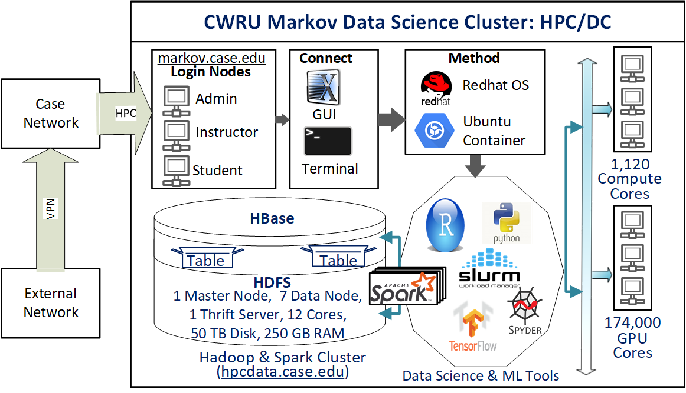

```{r setup, include = FALSE}
knitr::opts_chunk$set(
  cache = FALSE, # if TRUE knitr will cache results to reuse in future knits
  fig.width = 6, # the width for plots created by code chunk
  fig.height = 4, # the height for plots created by code chunk
  fig.align = 'center', # how to align graphics. 'left', 'right', 'center'
  dpi = 300, 
  dev = 'png', # Makes each fig a png, and avoids plotting every data point
  # eval = FALSE, # if FALSE, then the R code chunks are not evaluated
  # results = 'asis', # knitr passes through results without reformatting
  echo = TRUE, # if FALSE knitr won't display code in chunk above it's results
  message = TRUE, # if FALSE knitr won't display messages generated by code
  strip.white = TRUE, # if FALSE knitr won't remove white spaces at beg or end of code chunk
  warning = FALSE, # if FALSE knitr won't display warning messages in the doc
  error = TRUE) # report errors
  # options(tinytex.verbose = TRUE)
```

License: [CC-BY-SA 4.0](https://creativecommons.org/licenses/by-sa/4.0/)

 \setcounter{section}{1}
 \setcounter{subsection}{1}
 \setcounter{subsubsection}{1}

#### Class Readings, Assignments, Textbooks Syllabus Topics

##### Reading, Lab Exercises, SemProjects

  - Readings: 
    - For today: 
    - For next class: ISRL1,2 (R4DS)
  - Laboratory Exercises: 
    - LE0 : Do this as a refresher 
    - LE1 : Given out next Tuesday Jan. 24th
    - LE2 : Is Due Thursday Feb. 2nd
  - Office Hours: (Class Canvas Calendar for Zoom Link)
    - Wednesdays @ 4:00 PM to 5:00 PM  
    - Saturdays @ 3:00 PM to 4:00 PM
    - **Office Hours are on Zoom, and recorded**
  - Semester Projects
    - DSCI 453 Students Biweekly Updates Due 
      - Update #1 is Due **Friday Jan. 27th**
    - DSCI 453 Students 
      - Next Report Out #1 is Due **Friday Feb. 17th**
    - All DSCI 353/353M/453, E1453/2453 Students: 
      - Peer Grading of Report Out #1 is Due **Thursday March 2nd**
    - Exams
      - MidTerm: **Thursday March 9th**, in class or remote, 11:30 - 12:45 PM
      - Final: **Thursday May 4th**, 2023, 12:00PM - 3:00PM, Nord 356 or remote

##### Textbooks

-Text Books for DSCI353/353M/453

  - [R4DS: Wickham: R for Data Science](https://r4ds.had.co.nz/)
  - [ISLR: Intro to Statistical Learning with R, 2nd Ed.](https://www.statlearning.com/)
  - DLwR: Deep Learning with R, Chollet, Allaire, 
  - [DLGB: Deep Learning, Goodfellow, Bengio,  Courville](https://www.deeplearningbook.org/)

- Magazine Articles about Deep Learning

  - DL1 to DL12 are "Deep Learning" articles in 3-readings/2-articles/


- Books from DSCI351/351M/451

  - [Peng: R Programming for Data Science](https://leanpub.com/rprogramming)
  - [Peng: Exploratory Data Analysis with R](https://leanpub.com/exdata)
  - [Open Intro Stats, v4](https://openintro.org/os)
  - [R4DS: Wickham: R for Data Science](https://r4ds.had.co.nz/)


##### Tidyverse Cheatsheets, Functions and Reading Your Code

- Look at the Tidyverse Cheatsheet 

  - **Tidyverse For Beginners Cheatsheet**
    - In the Git/20s-dsci353-353m-453-prof/3-readings/3-CheatSheets/ folder
  - **Data Wrangling with dplyr and tidyr Cheatsheet**

  
  Tidyverse Functions & Conventions
  
    - The pipe operator `%>%`
    - Use `dplyr::filter()` to subset data row-wise.
    - Use `dplyr::arrange()`  to sort the observations in a data frame
    - Use `dplyr::mutate()` to update or create new columns of a data frame
    - Use `dplyr::summarize()` to turn many observations into a single data point
    - Use `dplyr::arrange()` to change the ordering of the rows of a data frame 
    - Use `dplyr::select()` to choose variables from a tibble, 
      - keeps only variables you mention
    - Use `dplyr::rename()` keeps all the variables and renames variables
      - rename(iris, petal_length = Petal.Length)
    - These can be combined using `dplyr::group_by()` 
      - which lets you perform operations “by group”. 
    - The `%in%` matches conditions provided by a vector using the c() function
    - The **forcats** package has tidyverse functions 
      - for factors (categorical variables)
    - The **readr** package has tidyverse functions 
      - to read_..., melt_... col_..., parse_... data and objects

Reading Your Code: Whenever you see

  - The assignment operator `<-`, think **"gets"**
  - The pipe operator, `%>%`, think **"then"**

##### Syllabus


#### The DSCI courses and class sections

##### In these Applied Data Science (DSCI) classes

  - We focus on teaching all necessary data science skills
    - Including coding in R
    - Use of Rmarkdown for data analysis reports and presentations
    - Git for code versioning and collaboration
    - Linear and non-linear regression and classification
    - Beyond linear modeling, including Support Vector Machines, Random Forest
    - Machine Learning, including Neural Networks, non-parametric regression
    - Deep Learning, including Keras/TensorFlow running on GPUs


##### The course sections

  - DSCI35x (x = 1,3,2) 
    - Is undergraduate class for "general" applied data science
  - DSCI35xM (x=1,2,3) focuses on materials science systems
  - DSCI45x (x=1,2,3)
    - Is a graduate level class
    - With the same class material and DSCI35x
    - Additionally the students do a 40 point Semester Data Analysis Project
    
And we have University of Pittsburgh (Pitt) students

  - Taken E1453 and E2453
  - With Prof. Paul Leu and TA Mingxuan Li

##### The specific courses

  - DSCI351, 351M, 451 
    - Is an introduction to Exploratory Data Science
  - DSCI353, 353M, 453 
    - Focuses on Modeling, Prediction and Machine Learning
  - DSCI 352, 352M, 452
    - Is a Semester long Data Science Project Class
    - Providing a data analysis for inclusion 
    - In your Data Science Portfolio
  - DSCI 354, 354M, 454
    - Is on Data Visualization and Analytics
    - Alternative Level 5 course for the ADS UG Minor
    

##### DSCI45x Graduate level courses

  - For graduate students, 
    - DSCI451 is not listed as a suggested prerequisite
  - Therefore some DSCI453 grad. students
    - Do not have familiarity with Open Data Science, R, Git etc.
  - For these "New to R" students
    - The initial weeks in class have optional content
    - To get people familiar with Open Data Science
      

##### Semester Data Science Projects

  - Are done in DSCI352, 352M by students who have completed both DSCI351,3
  - And by graduate students in DSCI 451, 453 and 452
  
For DSCI45x students, their Semester Project is developed in the DSCI352 course

  - With Prof. Laura Bruckman
  - During team meetings during Friday Community Hour
    - 12:45 to 1:45 in Olin 303
  - And during class office hours
    - Monday/Wednesday 4pm to 5pm in White 540
  - There are weekly SemProj updates due each week on progress
  - And 3 SemProj Presentations in DSCI35x class

##### For the DSCI 453 students they have an EDA SemProj to do

  - SemProjects:
    - SemProjects have a 5 progress update 
      - due Friday's at 11:59 pm (5 updates)
    - Each update should be made in the report template 
      - found in the Repo with each update filled out with the new things in the document
     - the update helps TA and professor grade and follow you project
    - The document should be filled in under each section and update throughout the semester until the final written report
    - SemProj Report Out #1 Class W5, (recorded 10 min presentation)
      - Peer Grading by All DSCI 353/353m/453 students due on syllabus
    - SemProj Report Out #2 in Class W9 (recorded 10 min presentation)
      - Peer Grading by All  DSCI 353/353m/453 students due on syllabus
    - SemProj Report Out #3 in Class W13 (recorded 10 min presentation)
      - Peer Grading by All DSCI 353/353m/453 students due on syllabus
    - SemProj Report is full comprehensive written project 
      - (report template updated from each report)
  - Assistance on SemProjects is done with DSCI353-353m-453 Class
    - SemProj's are taught by Prof. Laura Bruckman
    - SemProject office hours 9-10 am on Tuesdays

##### Care should be taken when choosing SemProj datasets.

  - Report Out 1 focuses on
    - Explaining the 'why' of your research project
    - Describing your dataset
    - Presenting an analysis plan
    - Cleaning your data
  - Report Out 2 focuses on:
    - EDA of your data
    - Visualizing your data
    - Further cleaning of your data
    - Reevaluation of your data analysis plan (Do you need more data?)
  - Report Out 3:
    - More data visualization
    - Initial modeling
    - Conclusions about your data
    - Were you able to answer your why question? 
    - What else would you need to do to get to understanding your data better?

#### Syllabus

 

#### Open Data Science (ODS) & HPC Compute Engines

- You can do data analysis on your notebook computer

  - You can setup your own notebook
    - For data science using R or Python
    - Full instructions are in the class syllabus, section 11
    - For Linux, Mac's or Windows Operating Systems
    - But Many times you'll need more compute power than your notebook
    - Such as GPUs (Graphics Processing Units) to accelerate computations
    
But its useful to learn about a variety of Compute Resources

  - In Class we'll use 
    - Markov Data Science Cluster
      - A high performance computing cluster
    - or Open Data Science Desktops
  
These are all configured the same

  - Independent of the Operating System
  - They have R with Rstudio IDE (Integrated Development Environment)
  - Git for code versioning
  - LaTeX for publication quality report generation
  - And also Python3 with PyCharm IDE
  
##### The two cloud computing systems: Markov HPC Cluster & ODS Win10 Desktop

  - Markov Data Science HPC Cluster
    - Log in to http://ondemand.case.edu 
    - Using your CaseID and password
    - Launch the SDLE Rstudio Server-4.1.1
    - You can also get a KDE Desktop on Markov

##### CWRU HPC provides Markov

  - [CWRU's HPC (High Peformance Computing) Markov Cluster](https://sites.google.com/a/case.edu/hpcc/)
    - This runs RedHat Linux version 7
    - Has 4400 CPU cores
    - Has 100,000 GPU cores
    - Up to a terabyte of Ram
  - And has a new Data Science Cluster, named [Markov.case.edu](https://markov.case.edu)
    - With a Hadoop Cluster for distributed computing
    - And dedicated GPUs
  - You'll get accounts on CWRU HPC
  - And use [http://ondemand.case.edu](http://ondemand.case.edu)
    - To login to Markov and get a KDE Desktop session
  

  
##### You also have access to the ODS Win10 Desktops

  - These are cloud Windows computers
    - That you log into from a Browser 
    - login to http://myapps.case.edu
    - With your CaseID and password
  - The ODS VDIs are Windows 10 computers
  - The ODS VDIs don't have GPUs
    
Not for class, but for your own data science projects.

##### And you can also use [Google's Kaggle.com](http://www.kaggle.com) 
  
  - Here one can run R or Python
  - Using [Jupyter Notebooks](https://jupyter.org/) Interface
  - Has Free GPUs
  
And you can use Google's Collaboratory](https://colab.research.google.com/notebooks/welcome.ipynb)

  - For Jupyter Notebooks
  - Running Python3
  - Doesn't support R language yet
  - Free GPUs and [TPUs (Tensor Processing Unit)](https://en.wikipedia.org/wiki/Tensor_processing_unit)
  


#### Operating Systems: Windows, OSX and Linux

- Command Line Environments

  - Linux: Bash on Linux, or Git Bash on Windows
  - Mac OSX: Bash in Terminal
  - Windows: Command.com Terminal
  - In R: R Console, or Console in RStudio
  


    Item               Linux       OSX Mac       Windows 
-----------------  ------------  ------------  ------------ 
folder demarcation     /              /        "\\" don't use
directory listing     ls             ls            dir     
present work. dir     pwd           pwd           
change directory      cd            cd               cd
drives               root          root         drive letters
NO SPACES in        filenames     spaces         don't work


##### Basic/Universal Rules

  - No Spaces in Filenames
  - Only 1 period in a filename, before file extension
  - No other periods
  - Only Letters, Underscore (_), and Dashes (-) in Filenames
  - In code scripts, use forward slash in all file paths and directories
  - You can use CamelBack or snake_case in variable or file names
    - To make code easier to read.
  - Code Style is Rstudio or Google R style
  - No use of = for Assignments
  - Only use <- as the Assignment Operator in R
    - Rstudio Cheat Sheet says <- is "Alt -" in R code

#### Quick Introduction to R/Rstudio/Git

- R is the statistical programming language

Rstudio is the Integrated Development Environment (IDE)

Git is the distributed content versioning system

#### What we need to do this week

- 1. Setup our Markov and Open Data Science (ODS) Computers

    - For Markov Data Science Cluster
      - login to http://ondemand.case.edu
      - Launch the SDLE Rstudio Server-4.1.1
    - For the ODS Desktop
      - Rstudio 
      - Drag icons of R, Rstudio, Git Bash, Spyder, Jupyter Notebook, DSCI Slack 
        - to desktop 

  2. Setup Git

    - make /home/caseID/Git folder on Markov 
      - git config your name and email of your git server
    - make H:\\Git folder on ODS Desktop
      - git config your name and email of your git server

  3. Setup Bitbucket account 
  4. Setup [DSCI Slack Account](http://cwru-dsci.slack.com)
  5. Setup StackExchange account
  7. Git Fork the Class "Prof" Repo
    - In your Bitbucket Account
  8. Git Clone your Fork of the Class Repo
    
##### So go make accounts, using your case.edu email address

  - Most students have already been invited
    - Pitt students have been issued CaseIDs
      - That you will use for logging in to
      - Markov
      - ODS Desktop
      - DSCI Slack
      - CWRU Canvas

  - Our DSCI Slack class channel
    - [CWRU Data Science Slack](http://cwru-dsci.slack.com)
    - This is [an invite link to CWRU DSCI Slack](https://join.slack.com/t/cwru-dsci/shared_invite/zt-gy4t8444-WZifMnxeReZRw8q~uJUxpQ)
  - For you cloud Git server
    - [Bitbucket.org](http://bitbucket.org)  
  - A [Stack Exchange account](https://stackexchange.com/)


#### Your Open Data Science Tool Chain

##### Its all about a Data Science Tool Chain

  - Use R and build on the communities foundation
  - Use Rstudio as a comfy environment
  - Share your Open Data and Open Source Code
  - Produce Reproducible Science with Rmarkdown  
    + Use [Creative Commons Licenses](https://creativecommons.org/)
    + Or other [Open Source Licenses](https://en.wikipedia.org/wiki/Comparison_of_free_and_open-source_software_licenses)
    + Such as the [Gnu Public License: GPL](https://en.wikipedia.org/wiki/GNU_General_Public_License)
    - Or one of my favorites, [the Apache License](https://en.wikipedia.org/wiki/Apache_License)

###### Pilot your Data Science studies using available data

  - Find available data sets
  - Before starting the costly process of making data

###### Use Git repositories

  - For Code Version Control
  - For Collaboration
  - For Open Science sharing
  
##### Online Git Server Communities

  - We use [BitBucket Account](http://bitbucket.org)
    - In class, for our class code repositories
    - These are private repositories
  - You'll probably also want a [GitHub](http://github.com/) account.
    - Many Rprojects are there, and 
    - you can fork their repo's as inspect the code very easily.


#### Things you need to do

##### Online accounts

  - Sign up for our [Class Slack](http://it-fundamental-2019.slack.com) with your personal or case.edu email 
  * Sign up for a [bitbucket.org](http://bitbucket.org) account 
    - with your case.edu address  
  * Sign up for a [twitter account](http://twitter.com), 
    - then follow @frenchrh, @hadleywickham, @dataandme, @JennyBryan
    - @minebocek, @juliasilge, @rdpeng, @jtleek, @robjhyndman, @daniela_witten
    - and others as you want, such as
    - @fchollet, @TensorFlow, @ylecun, @GoogleAI, @egorzakharovdl 
  * Sign up for a [stack overflow account on stack exchange](http://stackoverflow.com/)
    


##### Lab Exercises are submitted and graded on Canvas

  - Assignment turn in pages will be posted when LE are given out.

##### Your Class Git Repo

  * My "Professor" Repo is 20s-dsci353-353m-453-prof
    + On bitbucket, you will fork this repo to your own account
    + Each day prior to class, update your fork from my prof. repo

 
#### Intro to some R: Data Types
 
  * Primitives (numeric, integer, character, logical, factor)
  * Data Frames
  * Lists
  * Tables
  * Arrays
  * Environments
  * Others (functions, closures, promises..)
 
##### Simple Types 

```{r,collapse=TRUE}
x <- 1
class(x)
 
y <- "Hello World"
class(y)
 
z <- TRUE
class(z)
 
as.integer(z)
```

##### Example: Generating Random Data {.smaller}

```{r}
randomWalk <- function(N)(cumsum(ifelse(rbinom(prob = 0.5, size = 1, N) == 0,-1,1)))
AUDUSD <- 1.2345 + randomWalk(1000)*.0001
plot(AUDUSD, type = 'l')
```
 
#### Recommended R Libraries

- We're running R 4.1.2, named "Bird Hippie"

All our "Standard R Packages" are loaded in the Markov and the ODS Desktop

##### Basic useful packages (and many more than this)

  - Rcpp - Convenient C++ interface 
  - zoo/xts - Time series libraries
  - Matrix - Enhanced matrix library

##### Hadley Wickham Tidyverse packages

  - This is the content of [R for Data Science (R4DS) book](https://r4ds.had.co.nz/). 
    - Using Pipes "%>%" to replace loops
    - Makes syntax more compact and readable
    - Makes code faster
  - [Tidyverse Style Guide](https://style.tidyverse.org/)
    - Using tidy dataframes
  - ggplot2 - Mini-DSL (domain specific language) for data visualization
  - plyr/reshape - Data reshaping/manipulation
  - dplyr
  - data.table - Faster data.frame manipulation
  - knitr -  for  markdown processing
  - among others like purrr etc.


##### Statistical and Machine Learning

  - e1071 Functions for latent class analysis, short time Fourier transform, fuzzy clustering, support vector machines, shortest path computation, bagged clustering, naive Bayes classifier etc (142479 downloads) 
  - MASS tools for variable selection etc.
  - rpart Recursive Partitioning and Regression Trees. (135390)
  - igraph A collection of network analysis tools. (122930)
  - nnet Feed-forward Neural Networks and Multinomial Log-Linear Models. (108298)
  - randomForest Breiman and Cutler's random forests for classification and regression. (105375)
  - caret package (short for Classification And REgression Training) is a set of functions that attempt to streamline the process for creating predictive models. (87151)
  - kernlab Kernel-based Machine Learning Lab. (62064)
  - glmnet Lasso and elastic-net regularized generalized linear models. (56948)
  - ROCR Visualizing the performance of scoring classifiers. (51323)
  - gbm Generalized Boosted Regression Models. (44760)
  - party A Laboratory for Recursive Partitioning. (43290)
  - arules Mining Association Rules and Frequent Itemsets. (39654)
  - tree Classification and regression trees. (27882)
  - klaR Classification and visualization. (27828)
  - RWeka R/Weka interface. (26973)
  - ipred Improved Predictors. (22358)
  - lars Least Angle Regression, Lasso and Forward Stagewise. (19691)
  - earth Multivariate Adaptive Regression Spline Models. (15901)
  - CORElearn Classification, regression, feature evaluation and ordinal evaluation. (13856)
  - mboost Model-Based Boosting. (13078)

##### Twitter used for Data Science

- As part of setting up our Data Science Tool Chain

  - Signup for a Twitter account 
  - [Using Twitter in university research](http://blogs.lse.ac.uk/impactofsocialsciences/files/2011/11/Published-Twitter_Guide_Sept_2011.pdf)
  - [10 Commandments of Twitter for Academics](http://chronicle.com/article/10-Commandments-of-Twitter-for/131813/)

Data Science People to follow on Twitter

  - @hadleywickham 
  - @jtleek Jeff Leek JHU
  - @rdpeng Roger Peng JHU  
  - @simplystats
  - @Rbloggers
  - @JennyBryan 
  - @hspter Hilary Parker
  - @NSSDeviations
  - @dataandme
  - @rstudio
  - @rstudiotips
  - @R_Programming 
  - @CRANberriesFeed
  - @timoreilly
  - @kaggle
  - @SciPyTip
  - @PyData
  - @debian
  - @ubuntu
  - @GuardianData
  - @UpshotNYT
  - @EdwardTufte
  - @ProjectJupyter
  - @doctorow Cory Doctorow
  - @gvanrossum Founder of Python
  - @NateSilver538
  - @cutting  Founder of Hadoop
  - @RProgLangRR
  - @BitbucketStatus
  - @CWRUITS_STATUS
  - @cshirky Clay Shirky
  - @robjhyndman
  - @geoffreyhinton
  - @ylecun
  - @fchollet
  - @TensorFlow
  - @JeffDean
  - @yudapearl
  - @AndrewYNg

#### Links
 
[http://www.r-project.org](http://www.r-project.org) 

Rory Winston, for the Learning R intro
[http://www.theresearchkitchen.com/archives/1017](http://www.theresearchkitchen.com/archives/1017)

R for Data Science [http://r4ds.had.co.nz/](http://r4ds.had.co.nz/)

  - Or pull the R4DS repo from Bitbucket [https://bitbucket.org/cwrudsci/r4ds](https://bitbucket.org/cwrudsci/r4ds)

  - [Peng-Computing For Data Analysis Playlist](https://youtu.be/EiKxy5IecUw?list=PL7Tw2kQ2edvpNEGrU0cGKwmdDRKc5A6C4)

