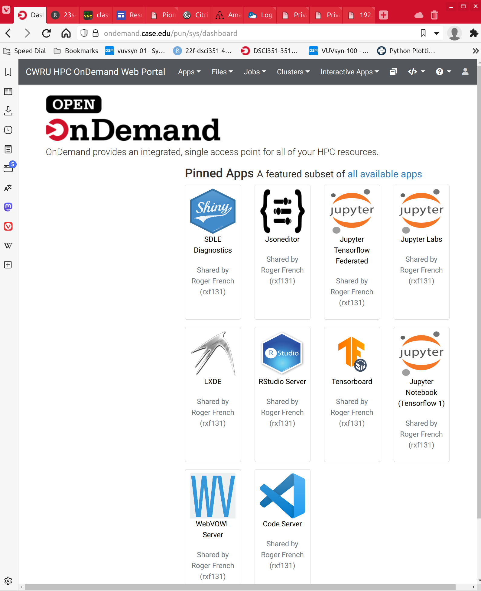
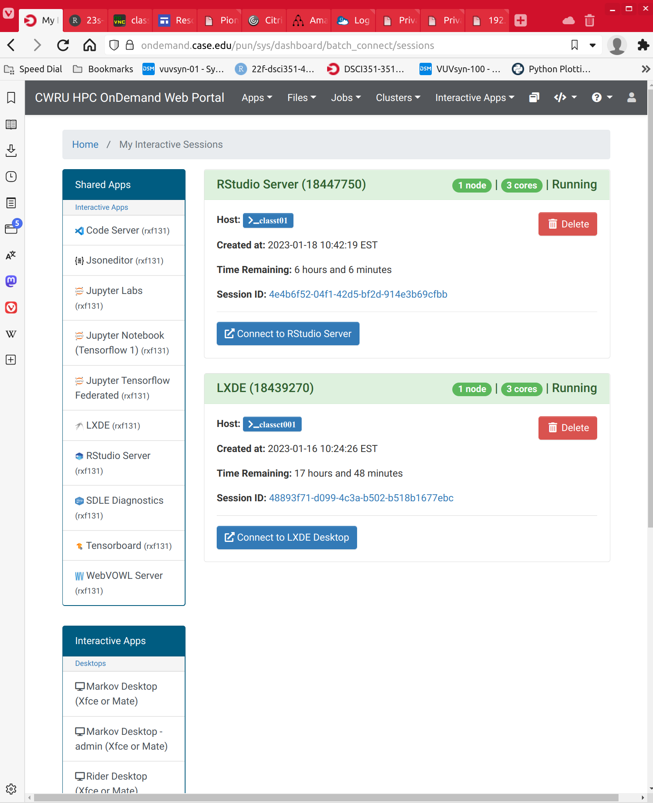
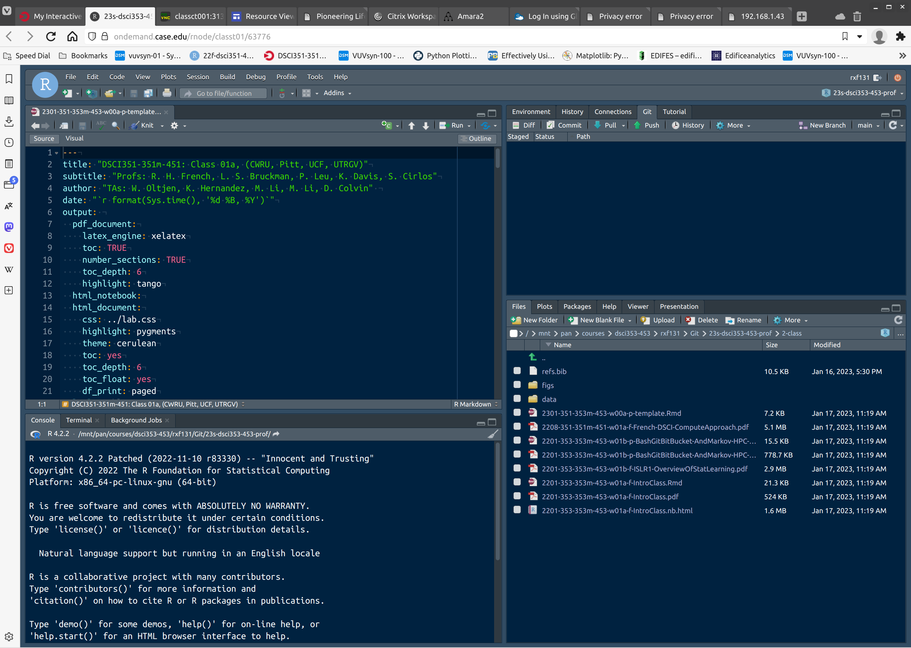
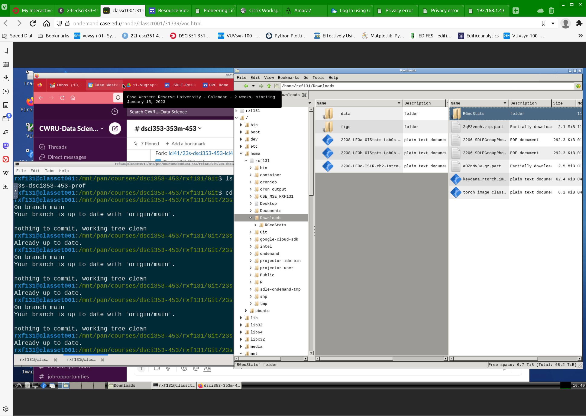

```{r setup, include = FALSE}
knitr::opts_chunk$set(
  cache = FALSE, # if TRUE knitr will cache results to reuse in future knits
  fig.width = 6, # the width for plots created by code chunk
  fig.height = 4.5, # the height for plots created by code chunk
  fig.align = 'center', # how to align graphics. 'left', 'right', 'center'
  dpi = 150, 
  # results = 'asis', # knitr passes through results without reformatting
  echo = TRUE, # if FALSE knitr won't display code in chunk above it's results
  message = TRUE, # if FALSE knitr won't display messages generated by code
  strip.white = TRUE, # if FALSE knitr won't remove white spaces at beg or end of code chunk
  warning = FALSE) # if FALSE knitr won't display warning messages in the doc
```

\setcounter{section}{1}
\setcounter{subsection}{2}
\setcounter{subsubsection}{3}


#### Class Readings, Assignments, Syllabus Topics

  - Readings: 
    - For today: ISRL1,2 (R4DS)
    - For next class: ISLR3,(R4DS-4-6)
  - Laboratory Exercises: 
    - LE0 : Do this as a refresher 
    - LE1 : Given out next Tuesday Jan. 24th
    - LE2 : Is Due Thursday Feb. 2nd
  - Office Hours: (Class Canvas Calendar for Zoom Link)
    - Wednesdays @ 4:00 PM to 5:00 PM  
    - Saturdays @ 3:00 PM to 4:00 PM
    - **Office Hours are on Zoom, and recorded**
  - Semester Projects
    - DSCI 453 Students Biweekly Updates Due 
      - Update #1 is Due **Friday Jan. 27th**
    - DSCI 453 Students 
      - Next Report Out #1 is Due **Friday Feb. 17th**
    - All DSCI 353/353M/453, E1453/2453 Students: 
      - Peer Grading of Report Out #1 is Due **Thursday March 2nd**
    - Exams
      - MidTerm: **Thursday March 9th**, in class or remote, 11:30 - 12:45 PM
      - Final: **Thursday May 4th**, 2023, 12:00PM - 3:00PM, Nord 356 or remote
      
##### Syllabus

 

#### An update for Pitt, UCF, UTRGV Students

- To access the Markov HPC Cluster of ODS Desktop Computer, and the Zoom recordings

  - You need to use a CaseID account
    - So you will have a caseID email
    - mine is rxf131@case.edu
  - If you took the Fall class, you have a CaseID
    - Otherwise I made yours today
    - You have to **Activate** you account by making your password
  - Once activated, you need to tell us, 
    - So I can give you Canvas access 
    - and Markov and ODS Desktop access
  - You will find the Zoom invites for class, and office hours
    - On the Case Canvas site for DSCI353
  - **And you will turn in Assignments to the Pitt, UCF, UTRGV Canvas sites**
    - For E1453 and E2453


#### R Learning Resources  

  - Peng: R Programming for Data Science (Book, in readings)
  - Roger Peng's [Youtube Playlist for 4 weeks of Coursera R Programming](https://www.youtube.com/playlist?list=PLjTlxb-wKvXNSDfcKPFH2gzHGyjpeCZmJ)
  
  
##### SDLE Teatime Learning

  - 2016 year was intro to datascience, R, Python, Git, LaTeX
  - 2017 was more advanced topics including Hadoop and Spark and SparklyR
  - 2018 continued with more advanced topics and review
  
##### SDLE TeaTime Learnings Materials are available Online

  - [2018 SDLE Teatime Repo](https://bitbucket.org/cwrudsci/18-sdle-teatime/)
    - 2018 contains the prior years code
    - [2016 SDLE Teatime Repo](https://bitbucket.org/cwrudsci/16-sdle-teatime) 
    - [2017SDLE Teatime Repo](https://bitbucket.org/cwrudsci/17-sdle-teatime) 
  - [SDLE Teatime Youtube Videos and Playlists](https://www.youtube.com/channel/UCer8o-Bxh-xef_6Kdmq4Kvg/videos)
 
```{r,echo=FALSE,message=FALSE}
options("digits" = 5)
options("digits.secs" = 3)
```

#### What we need setup by now for class

-1. [Setup Data Science Slack for class](http://cwru-dsci.slack.com)
    - Use case.edu email address
  2. [Setup Bitbucket Account](http://bitbucket.org)
    - Use case.edu email address
  3. Setup your Markov Data Science Cluster environment
   - Rstudio Server (rxf131)
   - Slack client in Firefox of the LXDE Desktop on Markov
   - Can put slack app on phone, or on your notebook
  4. Setup Git
    - make Git folder 
    - Then do git config name and email
  5. Setup StackExchange
  6. Git Clone
    - For Class-Prof Repo
      - Fork the prof repo up on bitbucket
        - remove `-prof` and rename your student repo with your `-caseID`
      - Clone your fork of the Prof Class Repo
        - Down onto your ODS VDI's H: drive in the `H:/Git/` folder
    - For those "new to R" 18-sdle-tea-time
      - for quick introduction to data science techniques and tools
      - `git clone git@bitbucket.org:cwrudsci/18-sdle-teatime.git`


##### Some students may not have forked the class repo?

  - [DSCI-353-353m-453 group in CWRU-DSCI team](https://bitbucket.org/cwrudsci/21s-dsci353-353m-453-prof/src/main/)
 
#### Bash: The language of the Linux Console 
 
  - Bash is the command line processor of the Linux Console
  - R has its own command line processor for the R Console
  - Bash is the default Console for both Linux and for Mac
    - Mac's are based on BSD-Unix OS
    - A close variant of Linux, only different by the licensing
  - Windows uses the DOS command line processor in its 'Command Prompt'

##### This semester we want to use Markov Data Science Cluster most

  - You login via [https://ondemand.case.edu](https://ondemand.case.edu)
  - And choose the OnDemand "App" called "Rstudio Server (rxf131)"


 
##### You can use the ODS Win10 Desktops

- But note these ODS Desktops don't have GPUs
  - So they are slow for Neural Network Training
  - https://myapps.case.edu 
  
On the ODS Desktop, we use "Git Bash" as a linux terminal to work with Git

  - MinGW64 is a little Linux OS running inside Windows
    - It has the standard Bash commands
    - And tools like vim (the visual text editor)
    
##### Lets see some Bash Commands we'll be using

  - `ls` is the "list" command, to get a directory of files and folders
  - `pwd` is the "present working directory" command, to know where you are
  - `cd` is "change directory" 
  - `..` refers to the directory one up from where you are
  - so `cd ..` moves you up one directory
  - and `cd Downloads` would move you down into Downloads directory (if it exists)
  - To copy a file use `cp`
  - To move a file use `mv`  
  - To make a new directory use `mkdir`
    
##### A good resource for Bash Commands and Man pages

  - Is [An A-Z Index of the Bash command line for Linux](http://ss64.com/bash/)
  - There are many other resources too

#### Now lets start working with our local Git Server

  - Using Linux Terminal to talk to it
    - Git is also a linux program 
  - All Git commands are entered at the Bash Prompt
  - All Git commands start with `git` 
  - So that the Bash prompt knows who to send the subsequent command to
    
##### Check your Git Server Configuration
          
          `git config --list`

##### Essential `git config --global`'s, Set your user info

  - `git config --global user.name "[name]"`
  - `git config --global user.email "[email address]"`
  - `git config --global color.ui auto`

##### First we need to go up to Bitbucket and "Fork" the Prof. Repo

  - This will give you a copy of Prof. Repo
    - In your personal account area
    - You want to change the ending from "Prof" to your caseID
    
##### Now you want to open a Linux Terminal

- On Markov
  - There is a Linux Terminal "Pane" in the lower left
  - Or you can launch an "LXDE Desktop session"
    - And use the Linux Terminal there
  - So on Markov, with your Linux Terminal
    - `pwd` will tell you your present working directory
    - `cd ..` moves up a directory
    - `pwd` to see where you have moved
    - When you login you are in your home directory: `/home/caseID`
      - So for me I'm in `/home/rxf131` 
    - `pwd` see where you are
    - `ls` see what files are there
    - `mkdir Git`  this will make a new directory at `/home/caseID/Git`
      - So you'll keep all your repositories under `/home/caseID/Git` 
    
On ODS Win10 Desktop 

  - You launch "Git Bash" on Windows

  - You need to save your Repos on your H: drive, NOT C drive
    - C Drive is restricted
    - H Drive is your personal area that follows your caseID login
  - So in Git Bash on windows
    - `pwd` will tell you your present working directory
    - `cd ..` moves up a directory
    - `pwd` to see where you have moved
    - Now change to H: `cd /h`
    - `pwd` see where you are
    - `ls` see what files are there
    - `mkdir Git`  this will make a new directory at H:Git
      - So you'll keep all your repositories under H:Git 

##### Important Note: **Windows ignores case, Linux and BSD-Unix (Mac) respect case**

  - So Git and git are the same on windows for a folder
  - They are totally different on Linux or Mac
  - Best practice Use capitals sparingly
  - About only useful place is in CamelBack filenames
    - Since I said, no spaces in filenames
    - To make things readable, you can do CamelBack
    - Example: `2201-353-353m-453-01b-f-ISLR1-OverviewOfStatLearning.Rmd`
    
##### Now lets Clone your personal class repo    
    
  - Now you want to Clone your personal class repo
    - This is a one time operation
    - To copy all the files and folders down to your local computer
  - In Git Bash, you want to be at H:Git or h:Git
    Check with `pwd`
  - Now go to your personal class repo on Bitbucket
    - And find the clone command
    - **Choose https protocol (Not ssh)**
  - Copy the command
    - Its something like this 
    - `git clone https://vuvlab@bitbucket.org/cwrudsci/22s-dsci353-353m-453-e1453-e2453-caseid.git`
  - Now that that is on your clipboard
  - Go to you Linux Terminal, and use "Shift-Insert" (Not "Cntrl-v")
    - To copy it onto the Bash Command line
    - Hit enter, and watch a full copy of your repo being copied locally
    
#### For class repos

  - Before each class, or whenever you want
  - Up on Bitbucket
    - You should sync your fork
    - With my Prof repo
    - To get the latest file version and new files
    - After syncing
    - Now `git pull` to bring the updated files to your local git server

##### Now lets pull and push changes from to your repo

  - cd into your repo's top folder
    - This can be done with tab completion
    - `cd 22s-d ` and hit tab, it auto completes
  - Now type `git pull` To see if there are any changes up on bitbucket
    - And to pull these down and merge them in

##### Making local changes, Adding, Commmitting and Pushing

  - Now change a local file by adding something into it
  - Now you add this changed file to be tracked by Git
    - `git add --all :/` 
  - Now commit your changes
    - `git commit -m 'I have changed the readme.md' `
  - Now push your changes up to Bitbucket, to your personal repo
    - `git push`
    
#### Deep Learning in CWRU's **Markov HPC/DC Data Science Cluster**

- For our the work in this class

  - We'll be using Markov HPC Cluster
  


[Who was Markov](https://en.wikipedia.org/wiki/Andrey_Markov)

Andrey Markov

  - Born 1856, Died 1922. 
  - Was a Russian mathematician 
  - Best known for his work on 
    - [Stochastic Processes](https://en.wikipedia.org/wiki/Stochastic_process)
    - [Markov Chains](https://en.wikipedia.org/wiki/Markov_chain)
    - [Markov Processes](https://en.wikipedia.org/wiki/Markov_process)
    
#### For DSCI Classes, use the Markov Data Science Cluster in HPC

  - And we'll use containers (i.e. singularity)
  - to run KDE desktop on Ubuntu 20.04 Linux
    - The HPC natively runs RedHat RHEL7
    

#### OnDemand browser access, Or X2Go Client Access to Markov

##### OnDemand Browser access (Suggested, when you are off campus)

##### Use Browser-based OnDemand Client

  - Go to [ondemand.case.edu](http://ondemand.case.edu)
  - Select "Rstudio Server (rxf131)" on the first page
  - You can also get a LXDE desktop (rxf131)
  - And there are Markov Desktop (KDE)
  


  - Here you don't need to use the Forticlient VPN 

You can find your current running, or finished, interactive sessions



This takes you directly to a compute node

  - login to [https://ondemand.case.edu](https://ondemand.case.edu)
  
You can now request either 

  - a terminal or command line session
  - or a GUI session

For a graphical, GUI session

  - Select "Rstudio Server (rxf131)" on the first page



  - You can also get a LXDE desktop (rxf131)


  
We also have Python3 setup

  - So you can use JupyterLab (i.e. iPythonNotebooks)
    - Or VS Codium (the open source version of Microsofts VS Code)
  
##### Alternative, use X2Go Client setup: 

  - This is more complicated, and therefore less desirable

  - This takes you to hpc1, hpc2, hpc3, hpc4 login nodes

Then you need to request 

  - a compute node, 
  - or gpu node with a srun command
  
If of campus, then connect to case VPN

  - Here are instructions: https://case.edu/utech/sites/case.edu.utech/files/2019-12/Forticlient%20VPN%20Installation%20for%20Linux.pdf

Connect to markov.case.edu for class work

  - disable printer and audio in X2G0 session icon settings

#### Login to Markov.case.edu

##### Some customizations to your own home/<caseid> directory

6c.2 One Time Setup: 

6c.2.1 You need to setup your <caseid> tmp subfolder 

  - In your home directory /home/caseID
  - Make a tmp directory under your /home/caseID directory
  - `mkdir tmp`

6c.2.2 Make your Git folder and setup your git server

If you are on Markov, and are in DSCI class

  - You'll make your Git folder in your /home/caseID directory
  - Make a Git directory using mkdir Git 
  - under home (DSCI students on Markov) 

Now check your Git Server Configuration

  - `git config --list`
  
Essential git config --global’s, Set your user info

  - `git config --global user.name "[name]"`
  - `git config --global user.email "[email address]"`
  - `git config --global color.ui auto`
  
6d Lets see some Bash Commands we’ll be using

  - ls is the “list” command, to get a directory of files and folders
  - pwd is the “present working directory” command, to know where you are
  - cd is “change directory”
  - .. refers to the directory one up from where you are
  - so cd .. moves you up one directory
  - and cd Downloads would move you down into Downloads directory (if it exists)
  - To copy a file use cp
  - To move a file use mv
  - To make a new directory use mkdir

6e Now lets pull and push changes from to your repo

  -  cd into your repo’s top folder
  - This can be done with tab completion
  - cd 20s-d and hit tab, it auto completes

Now type git pull To see if there are any changes up on bitbucket
  
  - And to pull these down and merge them in

6f Making local changes, Adding, Committing and Pushing

  - Now change a local file by adding something into it

And use git status to see what going on locally in your repo

  - `git status`
  
Now you add this changed file to be tracked by Git

  - `git add --all :/`
  
Now commit your changes

  - `git commit -m 'I have changed the readme.md'`

Now push your changes up to Bitbucket, to your personal repo

  - `git push`
  

6g Customize your bash Note: This is a single line command

Following command will update your bash settings to USER@HOST:PATH(GIT BRANCH) format 

`PS1="\[\e]0;\u@\h:\w\a\]\[\033[01;34m\]\u@\h\[\033[00m\]:\[\033[32m\]\w\[\033[91m\]\$(git branch 2> /dev/null | sed -e '/^[^*]/d' -e 's/* \(.*\)/(\1)/')\[\e[00m\]$ "`

You are now on the Login Node of the Markov Cluster

  - The Cluster has 1120 Compute Cores (computers)
  - And 174,000 GPU Cores
  
##### Make sure to shutdown 

  - `Exit` your Rstudio or LXDE Desktop
  - `Exit` your Singularity shell
  - `Exit` from your compute node using your Konsole terminal
  - Now your Konsole prompt should show you as being on `hpc1` or `hpc2`
    - The Markov Login Nodes
  - Logout of your RedHat session on Markov
  
    
    
#### Links
 
  - https://www.r-project.org 
  
  - https://help.ubuntu.com/community/UsingTheTerminal
  
  


