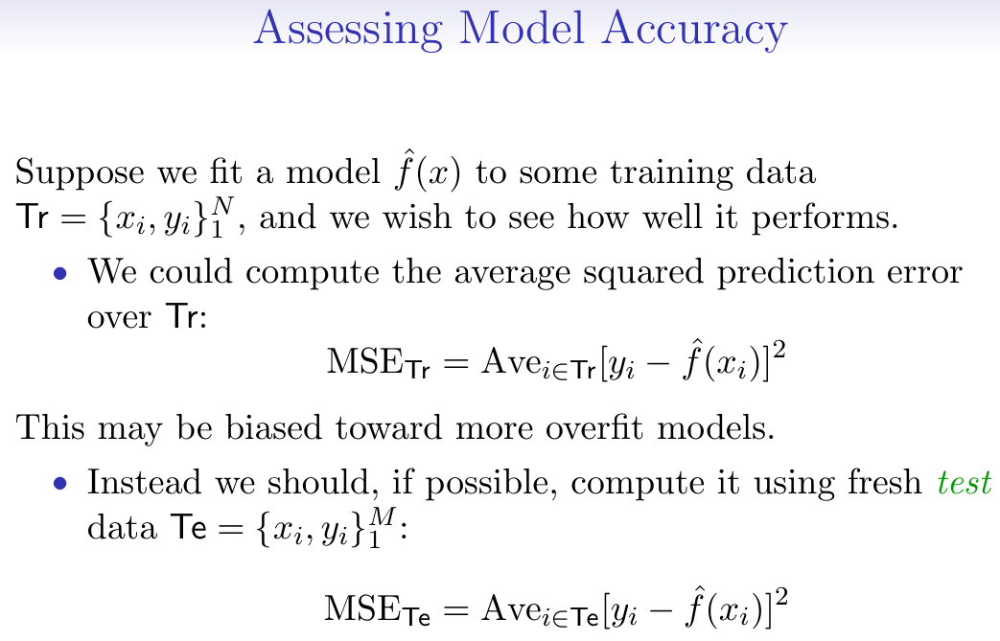

 
 \setcounter{section}{2}
 \setcounter{subsection}{2}
 \setcounter{subsubsection}{2}
 

License: [CC-BY-SA 4.0](https://creativecommons.org/licenses/by-sa/4.0/)

 

```{r setup, include = FALSE}
knitr::opts_chunk$set(
  cache = FALSE, # if TRUE knitr will cache results to reuse in future knits
  fig.width = 5, # the width for plots created by code chunk
  fig.height = 3.5, # the height for plots created by code chunk
  fig.align = 'center', # how to align graphics. 'left', 'right', 'center'
  dpi = 300, 
  dev = 'png', # Makes each fig a png, and avoids plotting every data point
  # eval = FALSE, # if FALSE, then the R code chunks are not evaluated
  # results = 'asis', # knitr passes through results without reformatting
  echo = TRUE, # if FALSE knitr won't display code in chunk above it's results
  message = TRUE, # if FALSE knitr won't display messages generated by code
  strip.white = TRUE, # if FALSE knitr won't remove white spaces at beg or end of code chunk
  warning = FALSE, # if FALSE knitr won't display warning messages in the doc
  error = TRUE) # report errors
  # options(tinytex.verbose = TRUE)
```


#### Class Readings, Assignments, Syllabus Topics

##### Reading, Lab Exercises, SemProjects

  - Readings: 
    - For today: DL01, DL02, (R4DS7-8) 
    - For next class: DL03, ISLR3
  - Laboratory Exercises: 
    - LE1 Given out today
    - LE1 is due on Thursday Feb. 2nd
  - Office Hours: (Class Canvas Calendar for Zoom Link)
    - Wednesdays @ 4:00 PM to 5:00 PM  
    - Saturdays @ 3:00 PM to 4:00 PM
    - **Office Hours are on Zoom, and recorded**
  - Semester Projects
    - Office Hours for SemProjs: Mondays at 4pm on Zoom
    - DSCI 453 Students Biweekly Updates Due 
      - Update #1 is Due ** This Friday **
    - DSCI 453 Students 
      - Next Report Out #1 is Due ** Feb. `17th **
    - All DSCI 353/353M/453, E1453/2453 Students: 
      - Peer Grading of Report Out #1 is Due **  **
    - Exams
      - MidTerm: **Thursday March 9th**, in class or remote, 11:30 - 12:45 PM
      - Final: **Thursday May 4th**, 2023, 12:00PM - 3:00PM, Nord 356 or remote
    

##### Textbooks

- Introduction to R and Data Science

  - For R, Coding, Inferential Statistics
    - Peng: R Programming for Data Science
    - Peng: Exploratory Data Analysis with R
  
Textbooks for this class

  - OIS = Diez, Barr, Çetinkaya-Runde: Open Intro Stat v4
  - R4DS = Wickham, Grolemund: R for Data Science
  
Textbooks for DSCI353/353M/453, And in your Repo now

  - ISLR = James, Witten, Hastie, Tibshirani: Intro to Statistical Learning with R
  - ESL = Trevor Hastie, Tibshirani, Friedman: Elements of Statistical Learning
  - DLwR = Chollet, Allaire: Deep Learning with R

Magazine Articles about Deep Learning

  - DL1 to DL6 are "Deep Learning" articles in 3-readings/2-articles/

#### Syllabus

 

##### Tidyverse Cheatsheets, Functions and Reading Your Code

- Look at the Tidyverse Cheatsheet 

  - **Tidyverse For Beginners Cheatsheet**
    - In the Git/20s-dsci353-353m-453-prof/3-readings/3-CheatSheets/ folder
  - **Data Wrangling with dplyr and tidyr Cheatsheet**

  
  Tidyverse Functions & Conventions
  
    - The pipe operator `%>%`
    - Use `dplyr::filter()` to subset data row-wise.
    - Use `dplyr::arrange()`  to sort the observations in a data frame
    - Use `dplyr::mutate()` to update or create new columns of a data frame
    - Use `dplyr::summarize()` to turn many observations into a single data point
    - Use `dplyr::arrange()` to change the ordering of the rows of a data frame 
    - Use `dplyr::select()` to choose variables from a tibble, 
      - keeps only variables you mention
    - Use `dplyr::rename()` keeps all the variables and renames variables
      - rename(iris, petal_length = Petal.Length)
    - These can be combined using `dplyr::group_by()` 
      - which lets you perform operations “by group”. 
    - The `%in%` matches conditions provided by a vector using the c() function
    - The **forcats** package has tidyverse functions 
      - for factors (categorical variables)
    - The **readr** package has tidyverse functions 
      - to read_..., melt_... col_..., parse_... data and objects

Reading Your Code: Whenever you see

  - The assignment operator `<-`, think **"gets"**
  - The pipe operator, `%>%`, think **"then"**
  

#### ISLR Chapter 2 Regression and IntroR Lab Excerise

- From Hastie and Tibshirani

  * They have good notation
  * And a good intro to R

##### Regression is the case of supervised learning

- Where we have a quantitative response 

  - that is associated with the predictors
  * And we want to develop a predictive model
    - that relates predictors with response

#### Function Notation for a Predictive model

- Some notation for predictive models

  * Response $Y$ which we want to predict
  * And the Predictors we will use are $\textbf{X}=X{_1}+X{_2}+X{_3}$
    - when we have $P$ number of predictors, 
      - and $P=3$ in this example
    - where the predictors $\textbf{X}$ is a vector
    - And $\textbf{X}$ is a column vector containing  $(X{_1},X{_2},X{_3})$
    - Which has 3 components $X{_1}+X{_2}+X{_3}$ 
    - We also have to have an error term $\epsilon$
  * Our predictive model will then be 
    - $Y = f(\textbf{X}) + \epsilon$ 
  * $\epsilon$ error term is a catch all
    - captures measurement error, and other discrepancies
    - we can never model something perfectly
  * And for the predictor $\textbf{X}$ 
    - A single instance of $X$ is $x$ 
    - i.e. $(x{_1},x{_2},x{_3})$
    - three specific values of the 3 components
    - of 1 individual observation, i.e. $x$ 
    - of the predictor $X$

##### Variables 

  * Independent Variables $\textbf{X}$ are called
    - independent variables
    - predictors
    - exogenous variables
    - features (this is general CS term)
  * Dependent Variables $\textbf{Y}$ are called
    - dependent variables
    - responses
    - endogenous variables
    
In some cases, such as network models

  * Some variables may be both.
    - independent, predictors
    - and also  dependent response
  * Such as in our group's netSEM structural equation models
    - take a look at SEM package
    
```{r,Echo=TRUE} 
# install.packages("sem") 
library(sem) 
help(sem) 


# install.packages("lavaan") 
library(lavaan) 
help(lavaan) 

# install.packages("netSEM")
library(netSEM) 
help(netSEM) 
```

##### Expected Values of a Predictive Model

- Now, once you have a predictive model

How well does it do, fitting your actual response?

  * Remember a function is by definition single-valued 
    - for a given value $x{_1}$ of the independent variable X 
    - there is only dependent value $y{_1}$ for the dependent variable Y 
  * Therefore it can never actually predict 
    - the exact observed value of the response
  - this is why we keep the error term $\epsilon$ explicit
    
The Expected Value of a Regression Function

  * Our regression function is $Y=f(\textbf{X})+\epsilon$
  * Gives the Expected value of the response for $X=4$

Notation for this is:

  $$f(4)=E(Y|X=4)$$
  
Or for our vector $\textbf{X}$

  $$ f(x) = f(x{_1}, x{_2}, x{_3}) = E(Y |X{_1} = x{_1}, X{_2} = x{_2}, X{_3} = x{_3})$$
  
##### The ideal or optimal predictor of Y

  - Minimizes the **loss function** 
    - between the function and the data
  - For example minimizing the sum of squared errors

##### An estimate (one version) of $f(X)$ 

  * is called $\hat{f}(X)$
  * since we could determine many versions of $f(X)$

And then we'll determine the best one of these $\hat{f}(X)$ functions

  * That reduces the loss function


##### And then we are left with the irreducible error

  * Which is just the variance of the errors.

##### So by better model building

  * we can reduce the reducible error
  * and we're left with the irreducible error. 
    - Which I think of as the true "noise" in the data


#### Overview of the Regression Function and its nature


##### How do we estimate the function $f(X)$?

- We can perform the loss function minimization, at each specific value $x$ of $X$.

  * Or at least in the neighborhood of $x$, 
    - which is denoted by $\mathcal{N}(x)$
    - and called Nearest Neighbor Averaging

Note that the regression function $f(X)$ is not an algebraic function

  * We didn't guesstimate it should be quadratic or some such.
  * It is a numerical function defined for each value $x$ of $X$


#### The Curse of Dimensionality

- When we are doing our nearest neighborhood averaging

  * in high dimensional datasets
  * we are hit by the curse of dimensionality
    - We can't define who are nearest neighbors
    - Because they tend to be far away in high dimensions
    
This hits us in many places of Prediction, Modeling and Statistical Learning

  * [The Curse of Dimensionality](https://en.wikipedia.org/wiki/Curse_of_dimensionality)

#### Parametric and Structured Models

- One way to get around the curse of dimensionality,

  * Use Parametric Models

$$ f_{l}(X)=\beta_{0}+\beta_{1}X_{1}+\beta_{2}X_{2}+...\beta_{p}X_{p}$$

Where there are $p+1$ parameters in the model

  * Which are estimated by fitting the model to the data

Estimated values of a parameter $\beta$

  * are denoted as $\hat{\beta}$


##### Some tradeoffs in regression modeling

  * Prediction accuracy versus interpretability.
    - Linear models are easy to interpret; 
    - thin-plate splines are not.
  * Good fit versus over-fit or under-fit.
    - How do we know when the fit is just right?
  * Parsimony versus black-box.
    - We often prefer a simpler model 
      - involving fewer variables 
    - Over a black-box predictor 
      - involving them all.
      
##### Interpretability vs Flexibility

- Here are some of the approaches we'll look at this semester

  * Simpler models could be more interpretable
    - Or could be too naive
  * Flexibility makes for good fits
    - But can lead to overfitting
    


#### Assessing Model Accuracy

##### Have to use training (Tr) and testing (Te) datasets

- To determine the best predictive model



#### The Bias vs. Variance Trade-off


  * The hat is the estimated value of something. $\hat{f}(X)$
  * We can see the variance of $\hat{f}(X)$
  * And the bias in $\hat{f}(X)$
  
Choosing the flexibility of your fitting function

  * (i.e the number of predictors, or coefficients, in your model function)
  * based on average test error
  * amounts to what we call a bias-variance trade-off

And we use training datasets and testing datasets

  * which we apply our model to
  * to determine the optimal tradeoff we should use
  * for a specific problem and model


##### How does all this play out in Classification Problems

- As opposed to Regression Problems, which we just discussed


#### Citations

* R Core Team. R: A Language and Environment for Statistical Computing. Vienna, Austria: [R Foundation for Statistical Computing, 2014.](http://www.R-project.org/).
* G. James, D. Witten, T. Hastie, and R. Tibshirani, An Introduction to Statistical Learning: 2nd Ed., with Applications in R, 2nd ed. 2021 edition. New York: Springer, 2021. 
* Abbass Al Sharif. “Applied Modern Statistical Learning Techniques.” [Abbass-Al-Sharif. Accessed January 17, 2016.(http://www.alsharif.info/).
* Diez, David M., Christopher D. Barr, and Mine Çetinkaya-Rundel. OpenIntro Statistics: Third Edition. 3 edition. S.l.: OpenIntro, Inc., 2015.
* Mayor, Eric. Learning Predictive Analytics with R. Packt Publishing - ebooks, 2015.


