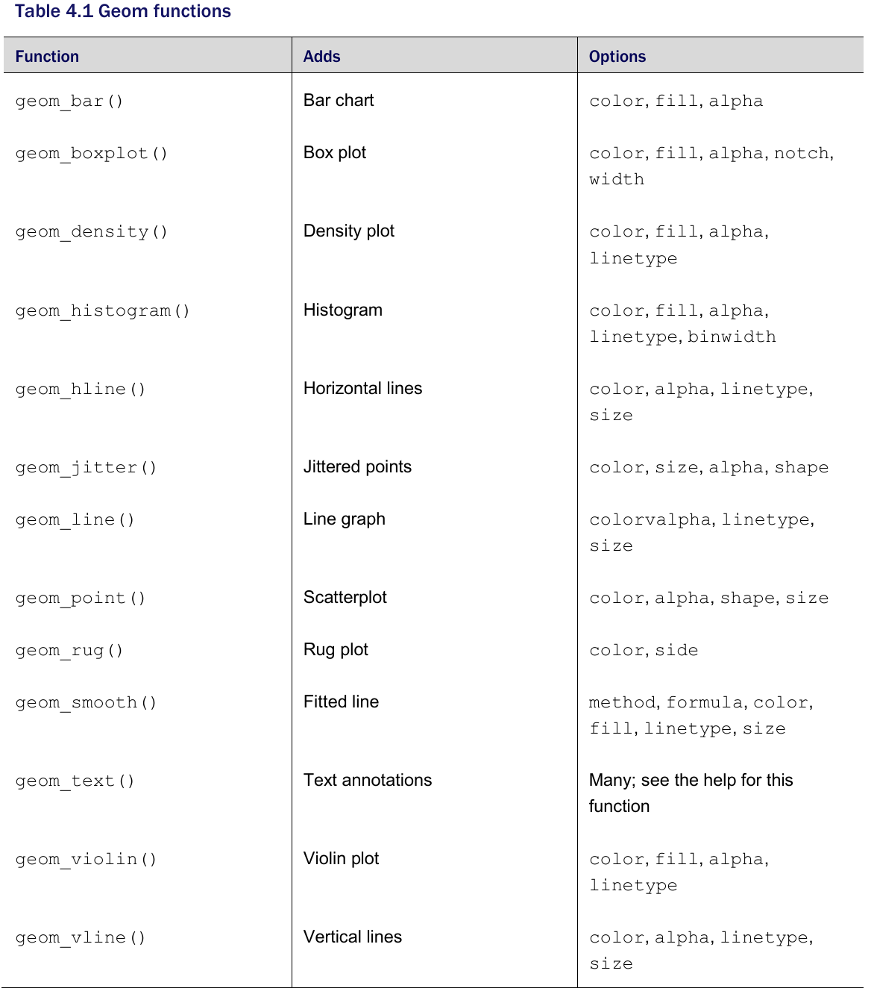
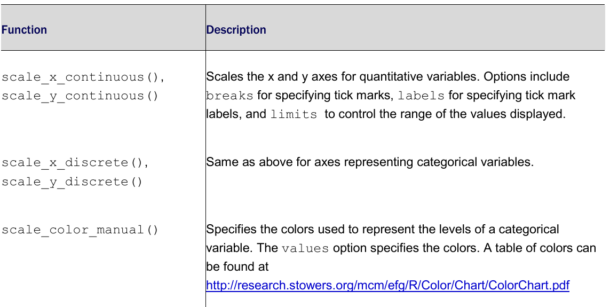
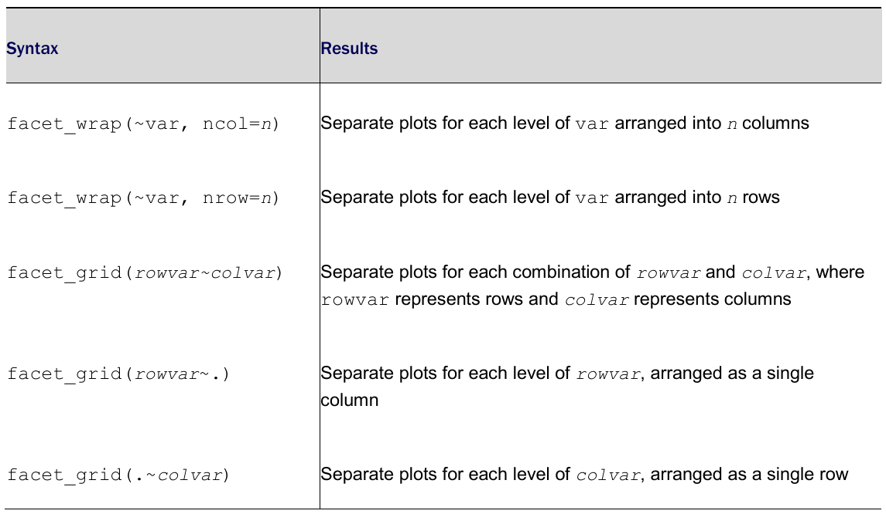
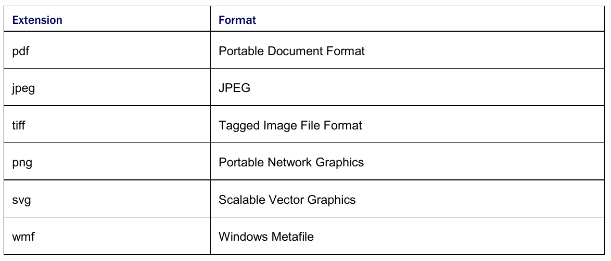

```{r setup, include = FALSE}
knitr::opts_chunk$set(
  cache = FALSE, # if TRUE knitr will cache results to reuse in future knits
  fig.width = 5, # the width for plots created by code chunk
  fig.height = 3.5, # the height for plots created by code chunk
  fig.align = 'center', # how to align graphics. 'left', 'right', 'center'
  dpi = 300, 
  dev = 'png', # Makes each fig a png, and avoids plotting every data point
  # eval = FALSE, # if FALSE, then the R code chunks are not evaluated
  # results = 'asis', # knitr passes through results without reformatting
  echo = TRUE, # if FALSE knitr won't display code in chunk above it's results
  message = TRUE, # if FALSE knitr won't display messages generated by code
  strip.white = TRUE, # if FALSE knitr won't remove white spaces at beg or end of code chunk
  warning = FALSE, # if FALSE knitr won't display warning messages in the doc
  error = TRUE) # report errors
  # options(tinytex.verbose = TRUE)
```

 \setcounter{section}{4}
 \setcounter{subsection}{1}
 \setcounter{subsubsection}{3}


#### `ggplot2` Graphics

- A good book on `ggplot2` is  [The Grammar of Graphics](../3-readings/1-Textbooks/Wickham-Ggplot2.pdf)

#### Creating a graph with ggplot

  - The `ggplot2` package uses a series of functions 
    - to build up a graph in layers. 
  - We’ll build a complex graph 
    - by starting with a simple graph 
    - and adding additional elements, one at a time. 
  - By default, `ggplot2` graphs 
    - appear on a grey background 
    - with white reference lines. 
  - We'll start by setting the default theme 
    - to a white background 
    - with light grey reference lines. 
  - This looks better when printed in black and white. 
  
Let's load the `ggplot2` package and set this default theme.

```{r}
library(ggplot2)
theme_set(theme_bw())
```

##### 

  - The first function in building a graph is the `ggplot()` function. 
  - It specifies the
    - data frame containing the data to be plotted
    - the mapping of the variables to visual properties of the graph. 
    
The mappings are placed in an `aes()` function 

  - (which stands for aesthetics or "something you can see").

```{r}
library(ggplot2)
library(mosaicData)
ggplot(data = CPS85, mapping = aes(x = exper, y = wage))
```

Why is the graph empty? 

  - We specified that the exper variable 
    - should be mapped to the x-axis 
  - and that the wage variable 
    - should be mapped to the y-axis, 
  - but we haven’t yet specified what we wanted placed on the graph. 
  
In this case, 

  - we'll want points to represent each participant.

##### Geoms

Geoms are the geometric objects 

  - (points, lines, bars, and shaded regions) 
    - that can be placed on a graph. 
  - They are added using functions that start with the phrase `geom_`. 
  - Currently, 37 different `geoms` are available and the list is growing. 
  
Table 4.1 describes the more common `geoms`, 

  - along with frequently used options for each.



We’ll add points using the `geom_point()` function, 

  - creating a scatterplot. 
  
In `ggplot2` graphs, functions are chained together 

  - using the `+` sign to build a final plot.

```{r}
library(ggplot2)
library(mosaicData)
ggplot(data = CPS85, mapping = aes(x = exper, y = wage)) + geom_point()
```

It appears that as experience goes up, 

  - wages go up, 
  - but the relationship is weak. 
  
The graph also indicates 

  - that there is an outlier. 
  - One individual has a wage 
    - much higher than the rest. 
  - We’ll delete this case and reproduce the plot.

```{r}
CPS85 <- CPS85[CPS85$wage < 40, ]
ggplot(data = CPS85, mapping = aes(x = exper, y = wage)) +
  geom_point()
```

A number of options can be specified 

  - in a `geom_` function (see table 4.1). 
  - Options for `geom_point()` 
    - include `color`, `size`, `shape`, and `alpha`. 
  - These control 
    - the point color, size, shape, and transparency, respectively. 
  - Colors can be specified by name or hexadecimal code.
  - Shape and linetype can be specified by 
    - the name or number representing the pattern or symbol respectively. 
  - Point size is specified with positive real numbers starting at zero. 
  - Large numbers produce larger point sizes. 
  - Transparency (`alpha`) ranges from 
    - 0 (completely transparent) 
    - to 1 (completely opaque). 
  - Adding a degree of transparency 
    - can help visualize overlapping points.

We'll also change the gray background to white using theme


```{r}
ggplot(data = CPS85, mapping = aes(x = exper, y = wage)) +
  geom_point(color = "cornflowerblue",
             alpha = .7,
             size = 3)
```

It would be helpful if the graph 

  - had a line summarizing the trend between experience and wages.

We can add this line with the `geom_smooth()` function. 

  - Options control the type of line 
    - (linear, quadratic, nonparametric), 
  - the thickness of the line, 
  - the line’s color, 
  - and the presence or absence of a confidence interval. 

Here we request a linear regression (`method = lm`) line.

```{r}
ggplot(data = CPS85, mapping = aes(x = exper, y = wage)) +
  geom_point(color = "cornflowerblue",
             alpha = .7,
             size = 3) +
  geom_smooth(method = "lm")
```

We can see from this line that on average, 

 - wages appear to increase to a moderate degree with experience. 

##### Grouping

  - In the previous section, we set graph characteristics 
    - such as color and transparency to a constant value. 
  - However, we can also map variables values 
    - to the color, shape, size, transparency, line style, 
    - and other visual characteristics of geometric objects. 
  - This allows groups of observations 
    - to be superimposed in a single graph 
    - (a process called grouping).
    
Let’s add sex to the plot 

  - and represent it by color, shape, and linetype.

```{r}
ggplot2::ggplot(
  data = CPS85,
  mapping = aes(
    x = exper,
    y = wage,
    color = sex,
    shape = sex,
    linetype = sex
  )
) +
  geom_point(alpha = .7, size = 3) +
  geom_smooth(method = "lm", se = FALSE, size = 1.5)
```

By default, the first group (female) is represented 

  - by pink filled circles 
    - and a solid pink line, 
  - while the second group (male) is represented 
    - by teal filled triangles 
    - and a dashed teal line. 

Note that the `color = sex`, `shape = sex`, and `linetype = sex`, options 

 - are placed in the `aes()` function 
   - because we are mapping a variable to an aesthetic. 
  - The geom_smooth option (`se = FALSE`) 
    - was added to suppresses the confidence intervals, 
    - making the graph less busy and easier to read. 
  - The size = 1.5 option 
    - makes the line a bit thicker.

##### Scales

As we've seen, the `aes()` function is used 

  - to map variables to the visual characteristics of a plot. 
  - Scales specify how each of these mappings occurs. 
  - For example, `ggplot2` automatically creates plot axes 
    - with tick marks, tick mark labels, and axis labels. 
  - Often they look fine, but occasionally 
    - you'll want to take greater control over their appearance. 
  - Colors that represent groups are chosen automatically, 
    - but you may want to select a different set of colors 
    - based on your tastes or a publication's requirements.

Scale functions (which start with `scale_`) 

  - allow you to modify these default scaling. 



In the next plot, 

  - we’ll change the x- and y-axis scaling, 
    - and the colors representing males and females. 
  - The x-axis representing `exper` 
    - will range from 0 to 60 by 10, 
  - and the y-axis representing `wage` 
    - will range from 0 to 30 by 5. 
  - Females will be coded with an off-red color
    - and males will be coded with an off-blue color. 
    
The code

```{r}
ggplot(data = CPS85,
  mapping = aes(x = exper, y = wage,
  color = sex, shape=sex, linetype=sex)) +
  geom_point(alpha = .7, size = 3) +
  geom_smooth(method = "lm", se = FALSE, size = 1.5) +
  scale_x_continuous(breaks = seq(0, 60, 10)) +
  scale_y_continuous(breaks = seq(0, 30, 5)) +
  scale_color_manual(values = c("indianred3", "cornflowerblue"))
```


Code Styling, using Rstudio's `Cntrl-Shft-A` to reformat the code.

```{r}
ggplot(
  data = CPS85,
  mapping = aes(
    x = exper,
    y = wage,
    color = sex,
    shape = sex,
    linetype = sex
  )
) +
  geom_point(alpha = .7, size = 3) +
  geom_smooth(method = "lm", se = FALSE, size = 1.5) +
  scale_x_continuous(breaks = seq(0, 60, 10)) +
  scale_y_continuous(breaks = seq(0, 30, 5)) +
  scale_color_manual(values = c("indianred3", "cornflowerblue"))
```

The numbers on the x- and y-axes are better, 

  - and the colors are more attractive.
  - However, 
    - wages are in dollars. 
  - We can change the labels on the y-axis 
    - to represent dollars using the `scales` package. 
  - The scales package provides 
    - label formatting for dollars, euros, percents, and more.

```{r}
ggplot(
  data = CPS85,
  mapping = aes(
    x = exper,
    y = wage,
    color = sex,
    shape = sex,
    linetype = sex
  )
) +
  geom_point(alpha = .7, size = 3) +
  geom_smooth(method = "lm", se = FALSE, size = 1.5) +
  scale_x_continuous(breaks = seq(0, 60, 10)) +
  scale_y_continuous(breaks = seq(0, 30, 5),
                     label = scales::dollar) +
  scale_color_manual(values = c("indianred3", "cornflowerblue"))
```

We are definitely getting there. 

##### Facets

  - Here is the next question. 
  - Is the relationship between 
    - `experience`, `wages` and `sex` 
    - the same for each job sector? 
  - Let’s repeat this graph once 
    - for each job sector in order to explore this.

Sometimes relationships are clearer 

  - if groups appear in side-by-side graphs 
    - rather than overlapping in a single graph. 
  - Facets reproduce a graph 
    - for each level of a given variable 
      - (or combination of variables). 
  - You can create faceted graphs 
    - using the `facet_wrap()` and `facet_grid()` functions. 
  
The syntax is given in table 14.3, 

  - where `var`, `rowvar`, and `colvar` are factors.



Here, facets will be defined 

  - by the eight levels of the sector variable. 
  - Since each facet 
    - will be smaller than a one panel graph alone, 
  - we'll omit `size = 3` from `geom_point()` 
    - and `size = 1.5` from `geom_smooth()`. 
  - This will reduce the point and line sizes 
    - compared with the previous graphs 
    - and looks better in a faceted graph. 

```{r}
ggplot(
  data = CPS85,
  mapping = aes(
    x = exper,
    y = wage,
    color = sex,
    shape = sex,
    linetype = sex
  )
) +
  geom_point(alpha = .7) +
  geom_smooth(method = "lm", se = FALSE) +
  scale_x_continuous(breaks = seq(0, 60, 10)) +
  scale_y_continuous(breaks = seq(0, 30, 5),
                     label = scales::dollar) +
  scale_color_manual(values = c("indianred3", "cornflowerblue")) +
  facet_wrap( ~ sector)
```

It appears that the differences between men and women 

  - depend on the job sector under consideration. 
  - For example, there is a strong positive relationship 
    - between experience and wages for male managers, 
    - but not for female managers. 
  - To a lesser extent, 
    - this is also true for sales workers.
  - There appears to be no relationship 
    - between experience and wages 
    - for both male and female service workers. 
    - In either case, males make slightly more. 
  - Wages go up with experience for female clerical workers, 
    - but may go down for male clerical workers 
    - (the relationship may not be significant here). 
  - We have gained a great deal of insight into 
    - the relationship of wages and experience at this point.

##### Labels

  - Graphs should be easy to interpret 
    - and informative labels are a key element 
    - in achieving this goal. 
  - The `labs()` function provides customized labels 
    - for the axes and legends. 
  - Additionally, a custom title, subtitle, and caption can be added. 

```{r}
ggplot(
  data = CPS85,
  mapping = aes(
    x = exper,
    y = wage,
    color = sex,
    shape = sex,
    linetype = sex
  )
) +
  geom_point(alpha = .7) +
  geom_smooth(method = "lm", se = FALSE) +
  scale_x_continuous(breaks = seq(0, 60, 10)) +
  scale_y_continuous(breaks = seq(0, 30, 5),
                     label = scales::dollar) +
  scale_color_manual(values = c("indianred3",
                                "cornflowerblue")) +
  facet_wrap( ~ sector) +
  labs(
    title = "Relationship between wages and experience",
    subtitle = "Current Population Survey",
    caption = "source: http://mosaic-web.org/",
    x = " Years of Experience",
    y = "Hourly Wage",
    color = "Gender",
    shape = "Gender",
    linetype = "Gender"
  )
```

Now a viewer doesn’t need to guess 

  - what the labels `expr` and `wage` mean, 
  - or where the data come from.

##### Themes

  - Finally, we can fine tune the appearance of the graph 
    - using themes. 
  - Theme functions (which start with `theme_`) 
    - control background colors, fonts, grid-lines, legend placement, 
    - and other non-data related features of the graph. 
  - Let’s use a cleaner theme. 
  - We used themes at the beginning in order 
    - to give each plot a white background. 
  - Let's try a different theme 
    - one that is more minimalistic. 

```{r}
ggplot(data = CPS85,
       mapping = aes(x = exper, y = wage, color = sex)) +
  geom_point(alpha = .6) +
  geom_smooth(method = "lm", se = FALSE) +
  scale_x_continuous(breaks = seq(0, 60, 10)) +
  scale_y_continuous(breaks = seq(0, 30, 5),
                     label = scales::dollar) +
  scale_color_manual(values = c("indianred3", "cornflowerblue")) +
  facet_wrap( ~ sector) +
  labs(
    title = "Relationship between wages and experience",
    subtitle = "Current Population Survey",
    caption = "source: http://mosaic-web.org/",
    x = " Years of Experience",
    y = "Hourly Wage",
    color = "Gender"
  ) +
  theme_minimal()
```

This is our finished graph, 

  - ready for publication. 
  - Of course, these findings are tentative.
  - They are based on a limited sample size and 
    - don't involve statistical testing 
    - to assess whether differences may be due to chance variation. 

#### `ggplot2` details

  - Before we finish, there are three important topics to consider: 
    - the placement of the `aes()` function, 
    - the treatment of `ggplot2` graphs as R objects, 
    - and various methods to save your graphs 
      - for use in reports and webpages.

##### Placing the data and mapping options

  - Plots created with `ggplot2` 
    - always start with the `ggplot` function. 
  - In the previous examples,
    - the data= and mapping= options were placed in this function. 
  - In this case they apply to each geom function that follows.

You can also place these options 

  - directly within a geom. 
  - In that case, they only apply to that specific geom. 
  
Consider the following graph.

```{r}
ggplot(CPS85,
       mapping = aes(x = exper, y = wage, color = sex)) +
  geom_point(alpha = .7, size = 3) +
  geom_smooth(method = "lm", se = FALSE, size = 1.5)
```

Since the mapping of sex to color 

  - appears in the `ggplot()` function, 
    - it applies to both `geom_point` and `geom_smooth`. 
  - The color of the point indicates the sex, 
    - and a separate colored trend line is produced for men and women. 
    
Compare this to

```{r}
ggplot(CPS85, aes(x = exper, y = wage)) +
  geom_point(aes(color = sex), alpha = .7, size = 3) +
  geom_smooth(method = "lm", se = FALSE, size = 1.5)
```

Since the sex to color mapping 

  - only appears in the `geom_point()` function, 
    - it is only used there. 
  - A single trend line is created for all observations.

Most examples place the data and mapping options 

  - in the `ggplot` function. 
  - Additionally, the phrases `data =` and `mapping =` are omitted 
    - since the first option always refers to data 
    - and the second option always refers to mapping.

But your code will be more readable and understandable

  -  If you put the `data =` and `mapping =`
    - in your code explicitly. 
    
##### Graphs as objects

  - A `ggplot2` graph can be saved as 
    - a named R object (a list), 
  - or manipulated further, 
    - and then printed or saved to disk. 
    
```{r}
data(CPS85 , package = "mosaicData")      #A
CPS85 <- CPS85[CPS85$wage < 40,]      #A

myplot <- ggplot(data = CPS85, aes(x = exper, y = wage)) + geom_point()     #B

myplot      #C

myplot2 <- myplot + geom_point(size = 3, color = "blue")     #D
myplot2      #D

myplot + geom_smooth(method = "lm") +      #E
  labs(title = "Mildly interesting graph")     #E
```

And here is what the codes doing at each letter step

  - #A Prepare data
  - #B Create a scatterplot and save it as myplot
  - #C Display myplot
  - #D Make the points larger and blue, 
    - save it as myplot2 and display the graph
  - #E Display myplot with a best fit line and a title

First the data are imported and outliers are removed #A. 

  - Then a simple scatter plot of experience vs. wages 
    - is created and saved as myplot #B. 
  - Next, the plot is printed #C. 
  - The plot is then modified 
    - by changing the point size and color, 
    - saved as myplot2 and printed #D.
  - Finally, the original plot 
    - is given a line of best fit and title, and printed #E. 
    
Note that these changes are not saved.

The ability to save graphs as objects 

  - allows you to continue to work with and modify them.
  - This can be a real time saver (and help you avoid carpal tunnel syndrome). 
  - It is also handy when saving graphs programmatically.
  
##### Exporting graphs

  - You can export graphs created by `ggplot2` 
    - in a variety of image formats 
    - using the RStudio GUI 
    - or through your code. 
  - To export a graph using the RStudio menus, 
    - go to the Plots tab and choose Export
  
To export a graph via code 

  - use the `ggsave()` function. 
  - You can specify the plot to save, 
    - its size and format, 
    - and where to save it. 
  For example,
    - `ggsave(file = "mygraph.png", plot = myplot, width = 5, height = 4)`
    - saves myplot as a 5-inch by 4-inch PNG file 
    - named mygraph.png 
    - in the current working directory. 
    
You can save the graph in a different format 

  - by changing the file extension.
  

  
The pdf, svg, and wmf formats are lossless 

  - they resize without fuzziness or pixilation.
  - The other formats are lossy 
    - they will pixelate when resized. 
    - This is especially noticeable when small images are enlarged. 
  - The png format is popular for images destined for webpages.
  - The jpeg and tif formats are usually reserved for photographs.

The `wmf` format is usually recommended for graphs 

  - that will appear in Microsoft Word or PowerPoint documents. 
  - MS Office does not support `pdf` or `svg` files, 
    - and the `wmf` format will rescale well. 
  - However, note that `wmf` files 
    - will lose any transparency settings that have been set.

If you omit the `plot =` option, 

  - the most recently created graph is saved. 
  
The code is valid and 

  - saves the graph to disk as a PDF document. 
  - See `help(ggsave)` for additional details.

```{r}
ggplot(data = mtcars, aes(x = mpg)) + geom_histogram()
ggsave(file = "mygraph.pdf")
```

##### Common Mistakes

After working with `ggplot2` for years, 

   - I've found that there are two mistakes that are frequently made. 
   - The first is omitting or misplacing a closing parentheses. 
     - This happens most often following the aes() function. 

Consider the following code.

```{ }
ggplot(CPS85, aes(x = exper, y = wage, color = sex) +
         geom_point()
```

  - Note the lack of a closing parentheses at the end of the first line. 
    - I can't tell you how many times I've done this.

The second error is confusing an assignment for a mapping. 

This code produces the next graph. 

```{r}
ggplot(CPS85, aes(x = exper, y = wage, color = "blue")) +
  geom_point()
```

The points are red (not blue) and there is a strange legend.

  - What happened?

The `aes()` function is used 

  - to map variables to the visual characteristics of the graph.
  - Assigning constant values is done outside the `aes()` function. 


#### `ggplot2` Summary

  - The `ggplot2` package provides a powerful platform 
    - for creating both simple and complex graphs. 
    - Graphs are built up in layers 
      - using functions chained together with the plus (`+`) symbol.
  - The `ggplot()` function specifies a data frame 
    - containing plot data 
    - and an `aes()` function that maps variables 
      - to visual aspects of the graph.
    - `geom_` functions specify the geometric objects 
      - (bars, lines, points, etc.) 
      - to be placed on the graph.
  - Optional `scale_` functions allow you to 
    - customize how a variable's values 
      - will be translated into their visual representations on the graph 
      - (e.g., the x- and y-axis scales and labels to used, 
      - and what colors, shapes, and line-types 
      - will be mapped to a variable's values).
  - Data from two or more groups 
    - can be represented by grouping 
    - (superimposing plots distinguished by visual aspects such as color) 
    - or faceting (placing several small plots in a matrix-like array).
  - Two common errors of ggplot are 
    - missing/misplaced parentheses 
    - nd confusing an assignment for a mapping.
  - Graphs can be exported in a wide variety of image formats 
    - (such as tiff, pdf, jpg, png, svg, and wmf) 
    - using the RStudio GUI 
    - or with the `ggsave()` function.


#### Links

  - Robert I. Kabacoff, R in Action, 3rd Edition, Manning Publications 2020


 
