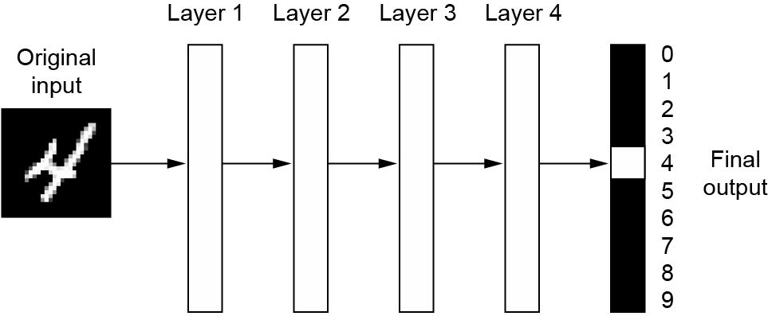
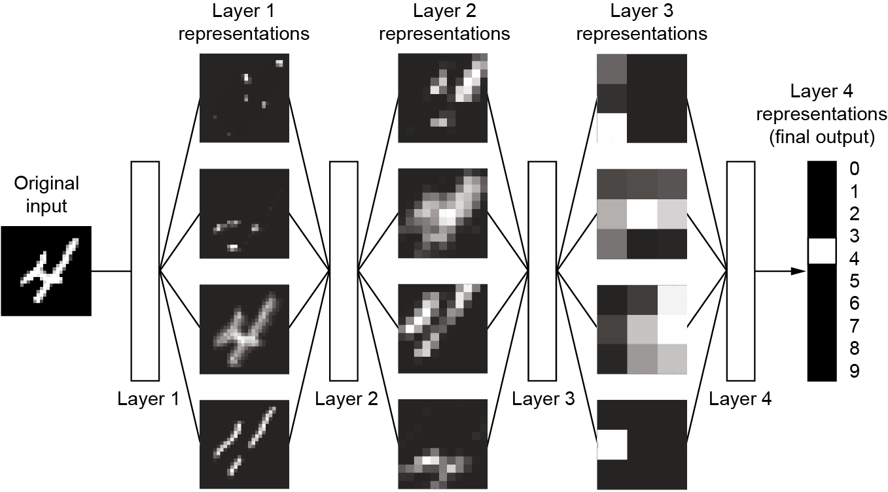

```{r setup, include = TRUE}
knitr::opts_chunk$set(
  cache = FALSE, # if TRUE knitr will cache results to reuse in future knits
  fig.width = 6, # the width for plots created by code chunk
  fig.height = 4, # the height for plots created by code chunk
  fig.align = 'center', # how to align graphics. 'left', 'right', 'center'
  dpi = 300, 
  dev = 'png', # Makes each fig a png, and avoids plotting every data point
  # eval = FALSE, # if FALSE, then the R code chunks are not evaluated
  # results = 'asis', # knitr passes through results without reformatting
  echo = TRUE, # if FALSE knitr won't display code in chunk above it's results
  message = TRUE, # if FALSE knitr won't display messages generated by code
  strip.white = TRUE, # if FALSE knitr won't remove white spaces at beg or end of code chunk
  warning = TRUE, # if FALSE knitr won't display warning messages in the doc
  error = TRUE) # report errors
  # options(tinytex.verbose = TRUE)
```

\setcounter{section}{6}
\setcounter{subsection}{1}
\setcounter{subsubsection}{1}

#### Class Readings, Assignments, Textbooks Syllabus Topics

##### Reading, Lab Exercises, SemProjects

  - Readings: 
    - For today: ISLR7
    - For next class: ISLR10 (R4DS22-25)
  - Laboratory Exercises: 
    - LE3 : is due Thursday   
  - Office Hours: (Class Canvas Calendar for Zoom Link)
    - **Mondays @ 4:00 PM to 5:00 PM**
    - Wednesdays @ 4:00 PM to 5:00 PM  
    - Office Hours are on Zoom, and recorded
  - Semester Projects
    - DSCI 453 Students Biweekly Updates Due 
    - DSCI 453 Students 
      - **Next Report Out #2 is Due This Friday March 18th**
    - SemProj Office Hours, with Prof. Bruckman
      - Tuesdays at 9am to 10am. 
      - Zoom Invites are in Case Canvas
    - All DSCI 353/353M/453, E1453/2453 Students: 
      - **Peer Grading of Report Out 2 is Due March 25th**
    - Exams
      - Final: Thursday March 28th, 2022, 12:00PM - 3:00PM, Nord 356 or remote

##### Textbooks

- Text Books for DSCI353/353M/453

  - [R4DS: Wickham: R for Data Science](https://r4ds.had.co.nz/)
  - [ISLR: Intro to Statistical Learning with R, 2nd Ed.](https://www.statlearning.com/)
  - DLwR: Deep Learning with R, Chollet, Allaire, 
  - [DLGB: Deep Learning, Goodfellow, Bengio,  Courville](https://www.deeplearningbook.org/)

- Magazine Articles about Deep Learning

  - DL1 to DL12 are "Deep Learning" articles in 3-readings/2-articles/

##### Syllabus


\FloatBarrier


#### Introduction to Machine Learning and Deep Learning with Neural Networks

- This is a companion notebook for the book 

  - [Deep Learning with R, Second Edition](https://www.manning.com/books/deep-learning-with-R-second-edition). 

For readability, 

  - it only contains runnable code blocks and section titles, 
  - and omits everything else in the book: text paragraphs, figures, and pseudocode.

**If you want to be able to follow what's going on,** 

  - I recommend reading the notebook side by side with your copy of the book

This notebook was generated for TensorFlow 2.11.


This is using the [MNIST dataset](https://en.wikipedia.org/wiki/MNIST_database)


MNIST images through a Neural Network Model layers




MNIST and how the layers learn representations




#### Fundamentals of machine learning

##### Generalization: The goal of machine learning

  - Underfitting and overfitting
  - Noisy training data
  - Ambiguous features
  - Rare features and spurious correlations

##### **Adding white-noise channels or all-zeros channels to MNIST**

```{r} 
library(keras)

mnist <- dataset_mnist()
train_labels <- mnist$train$y
train_images <- mnist$train$x %>%
  array_reshape(c(60000, 28 * 28))
train_images <- train_images / 255

noise_channels <- array(runif(nrow(train_images) * 784),
                        dim = c(nrow(train_images), 784))
train_images_with_noise_channels <-
  cbind(train_images, noise_channels)

zeros_channels <- array(0, dim = c(nrow(train_images), 784))
train_images_with_zeros_channels <-
  cbind(train_images, zeros_channels)
```

##### **Training the same model on MNIST data with noise channels or all-zero channels**

```{r}
library(keras)

get_model <- function() {
  model <- keras_model_sequential() %>%
    layer_dense(512, activation = "relu") %>%
    layer_dense(10, activation = "softmax")
  
  model %>% compile(optimizer = "rmsprop",
                    loss = "sparse_categorical_crossentropy",
                    metrics = "accuracy")
  
  model
}
```


```{r}

model <- get_model()
history_noise <- model %>% fit(
  train_images_with_noise_channels,
  train_labels,
  epochs = 10,
  batch_size = 128,
  validation_split = 0.2
)
```


```{r}

model <- get_model()
history_zeros <- model %>% fit(
  train_images_with_zeros_channels,
  train_labels,
  epochs = 10,
  batch_size = 128,
  validation_split = 0.2
)
```

##### **Plotting a validation accuracy comparison**

TODO: plot() should always draw to the graphics device,

  - currently when method==ggplot it only returns a plot object
    - which should be the work of autoplot()
  - data.frame(
    - "Validation accuracy with noise_channels" = history_noise$metrics$val_accuracy,
    - "Validation accuracy with zeros channels" = history_zeros$metrics$val_accuracy
    - %>% plot(type = 'l')

```{r}
library(patchwork)

plot(
  NULL,
  NULL,
  main = "Effect of Noise Channels on Validation Accuracy",
  xlab = "Epochs",
  xlim = c(1, history_noise$params$epochs),
  ylab = "Validation Accuracy",
  ylim = c(0.9, 1)
)
lines(history_zeros$metrics$val_accuracy,
      lty = 1,
      type = 'o')
lines(history_noise$metrics$val_accuracy,
      lty = 2,
      type = 'o')
legend(
  "bottomright",
  legend = c(
    "Validation accuracy with zeros channels",
    "Validation accuracy with noise channels"
  ),
  lty = 1:2
)
```


#### The nature of generalization in deep learning

##### **Fitting a MNIST model with randomly shuffled labels**

```{r}
c(c(train_images, train_labels), .) %<-% dataset_mnist()
train_images <- train_images %>%
  array_reshape(c(60000, 28 * 28)) %>%
  `/`(255) #Q: do we teach this?

random_train_labels <- sample(train_labels)

model <- keras_model_sequential() %>%
  layer_dense(512, activation = "relu") %>%
  layer_dense(10, activation = "softmax")


```


```{r}

model %>% compile(optimizer = "rmsprop",
                  loss = "sparse_categorical_crossentropy",
                  metrics = "accuracy")


```

```{r}
history <- model %>% fit(
  train_images,
  random_train_labels,
  epochs = 20, # best use 100 epochs
  batch_size = 128,
  validation_split = 0.2
)

summary(model)

plot(history)
```

#### The manifold hypothesis

  - Interpolation as a source of generalization
  - Why deep learning works
  - Training data is paramount
  - Evaluating machine-learning models
  - Training, validation, and test sets
  - Simple hold-out validation
  - K-fold validation
  - Iterated K-fold validation with shuffling
  - Beating a common-sense baseline
  - Things to keep in mind about model evaluation
  - Improving model fit
  - Tuning key gradient descent parameters

#### **Training a MNIST model with an incorrectly high learning rate**

```{r}
c(c(train_images, train_labels), .) %<-% dataset_mnist()
train_images <- train_images %>%
  array_reshape(c(60000, 28 * 28)) %>% `/`(255)

model <- keras_model_sequential(list(
  layer_dense(units = 512, activation = "relu"),
  layer_dense(units = 10, activation = "softmax")
))
model %>% compile(optimizer = optimizer_rmsprop(1.),
                  loss = "sparse_categorical_crossentropy",
                  metrics = "accuracy")


```


```{r}

model %>% fit(
  train_images,
  train_labels,
  epochs = 10,
  batch_size = 128,
  validation_split = 0.2
)

summary(model)

```

##### **The same model with a more appropriate learning rate**

```{r}
model <- keras_model_sequential(list(
  layer_dense(units = 512, activation = "relu"),
  layer_dense(units = 10, activation = "softmax")
))
model %>% compile(optimizer = optimizer_rmsprop(1e-2),
                  loss = "sparse_categorical_crossentropy",
                  metrics = "accuracy")
model %>% fit(
  train_images,
  train_labels,
  epochs = 10,
  batch_size = 128,
  validation_split = 0.2
)

summary(model)
```

#### Leveraging better architecture priors

##### Increasing model capacity

**A simple logistic regression on MNIST**

```{r}
model <- keras_model_sequential() %>%
  layer_dense(10, activation = "softmax")
model %>% compile(optimizer = "rmsprop",
                  loss = "sparse_categorical_crossentropy",
                  metrics = "accuracy")
history_small_model <- model %>% fit(
  train_images,
  train_labels,
  epochs = 20,
  batch_size = 128,
  validation_split = 0.2
)

summary(model)
```


```{r}
dplyr::as_tibble(history_small_model) %>%
  dplyr::filter(metric == "loss", data == "validation") %>%
  plot(
    value ~ epoch,
    data = .,
    type = "o",
    main = "Effect of Insufficient Model Capacity on Validation Loss",
    xlab = "Epochs",
    ylab = "Validation Loss"
  )

# w/o going through data.frame
plot(
  history_small_model$metrics$val_loss,
  type = 'o',
  main = "Effect of Insufficient Model Capacity on Validation Loss",
  xlab = "Epochs",
  ylab = "Validation Loss"
)
```

```{r}
model <- keras_model_sequential() %>%
  layer_dense(96, activation = "relu") %>%
  layer_dense(96, activation = "relu") %>%
  layer_dense(10, activation = "softmax")

model %>% compile(optimizer = "rmsprop",
                  loss = "sparse_categorical_crossentropy",
                  metrics = "accuracy")
history_large_model = model %>% fit(
  train_images,
  train_labels,
  epochs = 20,
  batch_size = 128,
  validation_split = 0.2
)

summary(model)
```

#### Improving generalization

  - Dataset curation
  - Feature engineering
  - Using early stopping
  - Regularizing your model
  - Reducing the network's size

**Original model**


```{r}
c(c(train_data, train_labels), .) %<-% dataset_imdb(num_words = 10000)

vectorize_sequences <- function(sequences, dimension = 10000) {
  results <- matrix(0, nrow = length(sequences), ncol = dimension)
  # results[cbind(seq_along(sequences), sequences)] <- 1
  for (i in seq_along(sequences))
    results[i, sequences[[i]]] <- 1.
  results
}
train_data <- vectorize_sequences(train_data)

model <- keras_model_sequential() %>%
  layer_dense(16, activation = "relu") %>%
  layer_dense(16, activation = "relu") %>%
  layer_dense(1, activation = "sigmoid")

model %>% compile(optimizer = "rmsprop",
                  loss = "binary_crossentropy",
                  metrics = "accuracy")

history_original <- model %>% fit(
  train_data,
  train_labels,
  epochs = 20,
  batch_size = 512,
  validation_split = 0.4
)

plot(history_original)

summary(model)
```

**Version of the model with lower capacity**

```{r}
model = keras_model_sequential() %>%
  layer_dense(4, activation = "relu") %>%
  layer_dense(4, activation = "relu") %>%
  layer_dense(1, activation = "sigmoid")

model %>% compile(optimizer = "rmsprop",
                  loss = "binary_crossentropy",
                  metrics = "accuracy")

history_smaller_model <- model %>% fit(
  train_data,
  train_labels,
  epochs = 20,
  batch_size = 512,
  validation_split = 0.4
)

summary(model)

plot(history_smaller_model)
```

**Version of the model with higher capacity**


```{r}
model = keras_model_sequential() %>%
  layer_dense(512, activation = "relu") %>%
  layer_dense(512, activation = "relu") %>%
  layer_dense(1, activation = "sigmoid")

model %>% compile(optimizer = "rmsprop",
                  loss = "binary_crossentropy",
                  metrics = "accuracy")

history_larger_model <- model %>% fit(
  train_data,
  train_labels,
  epochs = 20,
  batch_size = 512,
  validation_split = 0.4
)

summary(model) 

plot(history_larger_model)
```

##### Adding weight regularization

**Adding L2 weight regularization to the model**


```{r}
model <- keras_model_sequential() %>%
  layer_dense(16,
              kernel_regularizer = regularizer_l2(0.002),
              activation = "relu") %>%
  layer_dense(16,
              kernel_regularizer = regularizer_l2(0.002),
              activation = "relu") %>%
  layer_dense(1, activation = "sigmoid")

model %>% compile(optimizer = "rmsprop",
                  loss = "binary_crossentropy",
                  metrics = "accuracy")
history_l2_reg <- model %>% fit(
  train_data,
  train_labels,
  epochs = 20,
  batch_size = 512,
  validation_split = 0.4
)

summary(model)

plot(history_l2_reg)
```

##### Adding weight regulariza

**Different weight regularizers available in Keras**


```{r}
regularizer_l1(0.001)
regularizer_l1_l2(l1 = 0.001, l2 = 0.001)
```

##### Adding dropout

**Adding dropout to the IMDB model**


```{r}
model <- keras_model_sequential() %>%
  layer_dense(16, activation = "relu") %>%
  layer_dropout(0.5) %>%
  layer_dense(16, activation = "relu") %>%
  layer_dropout(0.5) %>%
  layer_dense(1, activation = "sigmoid")

model %>% compile(optimizer = "rmsprop",
                  loss = "binary_crossentropy",
                  metrics = "accuracy")

history_dropout <- model %>% fit(
  train_data,
  train_labels,
  epochs = 20,
  batch_size = 512,
  validation_split = 0.4
)

summary(model)

plot(history_dropout)
```


#### Links

- Chollet, Allaire, Deep Learning with R, 2nd Edition

 
