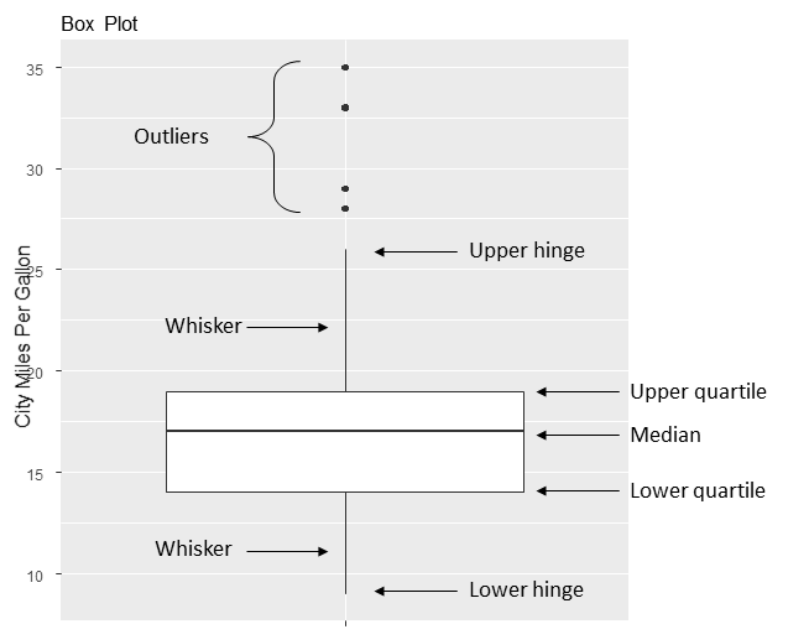

```{r setup, include = FALSE}
knitr::opts_chunk$set(
  cache = FALSE, # if TRUE knitr will cache results to reuse in future knits
  fig.width = 5, # the width for plots created by code chunk
  fig.height = 3.5, # the height for plots created by code chunk
  fig.align = 'center', # how to align graphics. 'left', 'right', 'center'
  dpi = 300, 
  dev = 'png', # Makes each fig a png, and avoids plotting every data point
  # eval = FALSE, # if FALSE, then the R code chunks are not evaluated
  # results = 'asis', # knitr passes through results without reformatting
  echo = TRUE, # if FALSE knitr won't display code in chunk above it's results
  message = TRUE, # if FALSE knitr won't display messages generated by code
  strip.white = TRUE, # if FALSE knitr won't remove white spaces at beg or end of code chunk
  warning = FALSE, # if FALSE knitr won't display warning messages in the doc
  error = TRUE) # report errors
  # options(tinytex.verbose = TRUE)
```

 \setcounter{section}{6}
 \setcounter{subsection}{1}
 \setcounter{subsubsection}{2}


#### ggplot2 Graphics 

- Whenever we analyze data, the first thing we should do is look at it. 

  - For each variable, 
    - what are the most common values? 
    - How much variability is present? 
    - Are there any unusual observations? 
  - R provides a wealth of functions for visualizing data. 
  Lets look at graphs that help is understand 
    - a single categorical or continuous variable. 
    
This topic includes

  - Visualizing the distribution of a variable
  - Comparing the distribution of a variable across two or more groups

In both cases, the variable 

  - can be continuous (for example, car mileage as miles per gallon) 
    - or categorical (for example, treatment outcome as none, some, or marked). 
  - Later we’ll explore graphs that display 
    - more complex relationships among variables.

Here we'll explore 

  - bar charts, 
  - pie charts, 
  - tree maps, 
  - histograms,
  - kernel density plots, 
  - box plots, 
  - violin plots, 
  - and dot plots. 

Some of these may be familiar to you, 

  - whereas others (such as tree charts or violin plots) may be new to you. 
  
The goal, as always, is 

  - to understand your data better 
  - and to communicate this understanding to others.

#### Bar Charts

  - In these examples, you’ll plot the outcome of a study 
    - investigating a new treatment for rheumatoid arthritis. 
  - The data are contained in the Arthritis data frame 
    - distributed with the `vcd` package. 
  - Note that the vcd package isn’t needed to create bar charts. 
    - You’re installing it to gain access to the Arthritis dataset.

In the Arthritis study, the variable `Improved` 

  - records the patient outcomes for individuals receiving a placebo or drug:

```{r}
data(Arthritis, package = "vcd")
table(Arthritis$Improved)
```

Here, you see that 

  - 28 patients showed marked improvement, 
  - 14 showed some improvement,
  - and 42 showed no improvement. 
  
You can graph these counts using a vertical or horizontal bar chart. 

```{r}
library(ggplot2)
data(Arthritis, package = "vcd")
ggplot(Arthritis, aes(x = Improved)) + geom_bar() +
  labs(title = "Simple Bar chart",
       x = "Improvement",
       y = "Frequency")   
```

```{r}
ggplot(Arthritis, aes(x = Improved)) + geom_bar() +
  labs(title = "Horizontal Bar chart",
       x = "Improvement",
       y = "Frequency") +
  coord_flip()  
```

##### Stacked, grouped and filled bar charts

  - The central question in the Arthritis study is 
    - "How does the level of improvement 
      - vary between the placebo and treated conditions?".

The table() function can used 

  - to generate a cross-tabulation of the variables.

```{r}
table(Arthritis$Improved, Arthritis$Treatment)
```

While the tabulation is helpful, 

  - the results are easier to grasp with a bar chart. 
  - The relationship between two categorical variables can be plotted 
    - using stacked, grouped, or filled bar charts. 

#A Stacked bar chart
#B Grouped bar chart
#C Filled bar chart
```{r}
ggplot(Arthritis, aes(x = Treatment, fill = Improved)) +     #A
  geom_bar(position = "stack") +
  labs(title = "Stacked Bar chart",
       x = "Treatment",
       y = "Frequency")

ggplot(Arthritis, aes(x = Treatment, fill = Improved)) +     #B
  geom_bar(position = "dodge") +
  labs(title = "Grouped Bar chart",
       x = "Treatment",
       y = "Frequency")

ggplot(Arthritis, aes(x = Treatment, fill = Improved)) +     #C
  geom_bar(position = "fill") +
  labs(title = "Stacked Bar chart",
       x = "Treatment",
       y = "Frequency") 
```

In the stacked bar chart, 

  - each segment represents the frequency or proportion of cases
    - within in a given Treatment (Placebo, Treated) 
    - and Improvement (None, Some, Marked) level combination. 
  - The segments are stacked separately for each Treatment level. 
  - The grouped bar chart 
    - places the segments representing Improvement 
      - side by side within each Treatment level. 
  - The filled bar chart is a stacked bar chart 
    - rescaled so that the height of each bar is 1 
    - and the segment heights represent proportions.
  - Filled bar charts are particularly useful 
    - for comparing the proportions of one categorical variable 
    - over the levels of another categorical variable. 
    - For example, the filled bar chart 
      - clearly displays the larger percentage of treated patients 
      - with marked improvement
      - compared with patients receiving a placebo.

##### Mean bar charts

  - Bar plots needn’t be based on counts or frequencies. 
    - You can create bar charts that represent 
      - means, medians, percents, standard deviations, and so forth 
      - by summarizing the data with an appropriate statistic 
      - and passing the results to ggplot2.

In the following graph, we'll plot 

  - the mean illiteracy rate for regions of the United States in 1970. 
  - The built-in R dataset state.x77 has the illiteracy rates by state, 
    - and the dataset state.region has the region names for each state. 

#1 Generate means by region
#2 Plot means in a sorted bar chart
```{r}
states <- data.frame(state.region, state.x77)

library(dplyr)
plotdata <- states %>%     #1
  group_by(state.region) %>%
  summarize(mean = mean(Illiteracy))
plotdata

ggplot(plotdata, aes(x = reorder(state.region, mean), y = mean)) +     #2
  geom_bar(stat = "identity") +
  labs(x = "Region",
       y = "",
       title = "Mean Illiteracy Rate")
```

When plotting summary statistics such as means, 

  - it's good practice to indicate the variability of the estimates involved. 
  - One measure of variability 
    - is the standard error of the statistic
  - an estimate of the expected variation of the statistic 
    - across hypothetical repeated samples. 

#1 Generate means and standard errors by region
#2 Plot means in a sorted bar chart
#3 Add error bars
```{r}
plotdata <- states %>%     #1
  group_by(state.region) %>%
  summarize(
    n = n(),
    mean = mean(Illiteracy),
    se = sd(Illiteracy) / sqrt(n)
  )

plotdata

ggplot(plotdata, aes(x = reorder(state.region, mean), y = mean)) +     #2
  geom_bar(stat = "identity", fill = "skyblue") +
  geom_errorbar(aes(ymin = mean - se, ymax = mean + se), width = 0.2) +     #3
  labs(
    x = "Region",
    y = "",
    title = "Mean Illiteracy Rate",
    subtitle = "with standard error bars"
  )
```

The means and standard errors are calculated for each region #1. 

  - The bars are then plotted in order of increasing illiteracy. 
  - The color is changed from a default dark grey 
    - to a lighter shade (sky blue) 
    - so that error bars to be added in the next step will stand out #2.
  - Finally, the error bars are plotted #3. 
    - The width option in the `geom_errorbar()` function 
    - controls the horizontal width of the error bars and is purely aesthetic 
      - it has no statistical meaning. 
      
In addition to displaying the mean illiteracy rates, 

  - we can see that the mean for the North Central region 
    - is the most reliable (least variability) 
  - and the West region is least reliable 
    - (largest variability).

##### Tweaking Bar Charts

  - There are several ways to tweak the appearance of a bar chart. 
    - The most common are customizing the bar colors and labels.

Fill vs. Color

  - In general, ggplot2 uses **fill** 
    - to specify the color of geometric objects that have area 
    - (such as bars, pie slices, boxes),
  - and the term **color** when referring to 
    - the color of geometric objects without area 
    - (such as lines, points, and borders).

```{r}
data(Arthritis, package = "vcd")
ggplot(Arthritis, aes(x = Improved)) +
  geom_bar(fill = "gold", color = "black") +
  labs(title = "Treatment Outcome")
```

Here, bar fill colors are mapped to the levels of the variable Improved. 

  - The `scale_fill_manual()` function specifies 
    - red for None, 
    - grey for Some, 
    - and gold for Marked improvement.
 
##### Bar Chart Labels

- When there are many bars or long labels, 

  - bar chart labels tend to overlap and become unreadable. 
  - Consider the following example. 
  - The dataset mpg in the ggplot2 package
    - describes fuel economy data from for 38 popular car models 
      - in 1999 and 2008. 
    - Each model has several configurations 
      - (transmission type, number of cylinders, etc.). 
 
```{r}
ggplot(mpg, aes(x = model)) +
  geom_bar() +
  labs(title = "Car models in the mpg dataset",
       y = "Frequency", x = "")
```

Two simple tweaks will make the labels readable. 

  - First, we can plot the data as a horizontal bar chart.
  - Second, we can angle the label text and use a smaller font.

```{r}
ggplot(mpg, aes(x = model)) +
  geom_bar() +
  labs(title = "Car models in the mpg dataset",
       y = "Frequency", x = "") +
  coord_flip()
```


```{r}
ggplot(mpg, aes(x = model)) +
  geom_bar() +
  labs(title = "Model names in the mpg dataset",
       y = "Frequency", x = "") +
  theme(axis.text.x = element_text(
    angle = 45,
    hjust = 1,
    size = 8
  ))
```

#### Pie Charts (Something I don't use)

- Pie charts are ubiquitous in the business world, 

  - but they’re denigrated by most statisticians,
    - including the authors of the R documentation. 
  - They recommend bar or dot plots over pie charts 
    - because people are able to judge length more accurately than volume. 
  - Perhaps for this reason, the pie chart options in R 
    - are severely limited 
    - when compared with other statistical platforms.

[The issue with Pie Charts](https://www.data-to-viz.com/caveat/pie.html)


#### Tree Maps

- An alternative to a pie chart is a tree map. 

  - A tree map displays the distribution of a categorical variable 
    - using rectangles that are proportional to variable levels. 
  - Unlike pie charts, tree maps 
    - can handle categorical variables with many levels. 
  - We'll use the `treemapify` package
  
We'll start by creating a tree map 

  - displaying the distribution of car manufacturers in the mpg data frame.   

#1 Summarize the data
#2 Create the tree map
```{r}
library(ggplot2)
library(dplyr)
library(treemapify)

plotdata <- mpg %>% count(manufacturer)     #1

ggplot(plotdata,     #2
       aes(fill = manufacturer,
           area = n,
           label = manufacturer)) +
  geom_treemap() +
  geom_treemap_text() +
  theme(legend.position = "none")
```

First we calculate the frequency counts 

  - for each level the manufacturer variable #1. 
  - This information is passed to ggplot2 
    - to create the graph #2. 
  - In the `aes()` function, 
    - fill refers to the categorical variable, 
    - area is the count for level, 
    - and label is the option variable used to label the cells. 
  - The `geom_treemap()` function 
    - creates the tree map 
    - and the `geom_tree_text()` function adds the labels to each cell. 
  - The `theme()` function is used to suppress the legend,
    - which is redundant here, since each cell is labeled.

In the next example, a second variable is added drivetrain. 

  - The number of cars by manufacturer is plotted 
    - for front-wheel, rear-wheel, and four-wheel drives. 

#1 Compute cell counts
#2 Provide better labels for drivetrains
#3 Create tree map
```{r}
plotdata <- mpg %>%     #1
  count(manufacturer, drv)
plotdata$drv <- factor(
  #2
  plotdata$drv,
  #3
  levels = c("4", "f", "r"),
  labels = c("4-wheel", "front-wheel", "rear")
)

ggplot(plotdata,
       aes(
         fill = manufacturer,
         area = n,
         label = manufacturer,
         subgroup = drv
       )) +
  geom_treemap() +
  geom_treemap_subgroup_border() +
  geom_treemap_subgroup_text(
    place = "middle",
    colour = "black",
    alpha = 0.5,
    grow = FALSE
  ) +
  geom_treemap_text(colour = "white",
                    place = "centre",
                    grow = FALSE) +
  theme(legend.position = "none")
```

#### Histograms

  - Histograms display the distribution of a continuous variable 
    - by dividing the range of scores 
    - into a specified number of bins on the x-axis 
    - and displaying the frequency of scores in each bin on the y-axis. 

  `ggplot(data, aes(x = contvar)) + geom_histogram()`

You can create histograms using `geom_histogram`

  - where data is a data frame 
  - and contvar is a continuous variable. 

Using the mpg data set in the ggplot package, 

  - we'll examine the distribution of city miles per gallon (cty) 
    - for 117 automobile configurations in 2008. 

#1 Simple histogram
#2 Colored histogram with 20 bins
#3 Histogram with percentages
#4 Histogram with density curve
```{r}
library(ggplot2)
library(scales)

data(mpg)
cars2008 <- mpg[mpg$year == 2008, ]

ggplot(cars2008, aes(x = hwy)) +      #1
  geom_histogram() +
  labs(title = "Default histogram")

ggplot(cars2008, aes(x = hwy)) +
  geom_histogram(bins = 20, color = "white", fill = "steelblue") +     #2
  labs(title = "Colored histogram with 20 bins",
       x = "Highway Miles Per Gallon",
       y = "Frequency")

ggplot(cars2008, aes(x = hwy, y = ..density..)) +
  geom_histogram(bins = 20, color = "white", fill = "steelblue") +     #3
  scale_y_continuous(labels = scales::percent) +
  labs(title = "Histogram with percentages",
       y = "Percent",
       x = "Highway Miles Per Gallon")

ggplot(cars2008, aes(x = hwy, y = ..density..)) +
  geom_histogram(bins = 20, color = "white", fill = "steelblue") +      #4
  scale_y_continuous(labels = scales::percent) +
  geom_density(color = "red", size = 1) +
  labs(title = "Histogram with density curve",
       y = "Percent" ,
       x = "Highway Miles Per Gallon")
```

The first histogram #1 

  - demonstrates the default plot when no options are specified. 
    - In this case, 30 bins are created. 
  - For the second histogram #2, 
    - 20 bins, a steel blue fill, and a white border color are specified. 
    - In addition, more informative labels have been added. 
  - The number of bins can strongly influence the appearance of the histogram. 
  - It is a good idea to experiment with the bins value 
    - until you find one that captures the distribution well. 
    - With 20 bins, it appears that there are two peaks to the distribution 
      - one around 13 mpg 
      - and one around 20.5 mpg.
  - The third histogram #3 plots the data as percents rather than frequencies. 
    - This is accomplished by assigning 
      - the built-in variable `density` to the y axis. 
    - The scales package is used to format the y-axis as percents. 
    - The fourth histogram #4 is similar to the previous plot, 
      - but adds a density curve. 
      - The density curve is a kernel density estimate 
      - and is described in the next section. 
    - It provides a smoother description of the distribution of scores. 
    - The geom_density() function is used 
      - to plot the kernel curve in a red color 
      - and a width that’s slightly larger the default thickness for lines.
    - The density curve also suggests a bimodal distribution (two peaks).

#### Kernel density plots

  - Technically, kernel density estimation 
    - is a nonparametric method for estimating 
      - the probability density function of a random variable. 
  - Basically, we're trying to draw a smoothed histogram,
    - where the area under the curve equals one. 
  - Although the mathematics are beyond the scope now, 
    - density plots can be an effective way 
      - to view the distribution of a continuous variable. 
  - The format for a density plot is
    - `ggplot(data, aes(x = contvar)) + geom_density()`
      - where data is a data frame 
      - and contvar is a continuous variable. 


#1 Default density plot
#2 Filled density plot
#3 Print default bandwidth
#4 Density plot with smaller bandwidth
```{r}
data(mpg, package = "ggplot2")
cars2008 <- mpg[mpg$year == 2008,]

ggplot(cars2008, aes(x = cty)) +      #1
  geom_density() +
  labs(title = "Default kernel density plot")

ggplot(cars2008, aes(x = cty)) +      #2
  geom_density(fill = "red") +
  labs(title = "Filled kernel density plot")

bw.nrd0(cars2008$cty)     #3

ggplot(cars2008, aes(x = cty)) +      #4
  geom_density(fill = "red", bw = .5) +
  labs(title = "Kernel density plot with bw=0.5")
```

The default kernel density plot is given first #1. 

  - In the second example #2, the area under the curve is fill with red. 
  - The smoothness of the curve is controlled with a bandwidth parameter,
    - which is calculated from the data being plotted. 
    - The code `bw.nrd0(cars2008$cty)` displays this value (1.408) #3. 
  - Using a larger bandwidth will give a smoother curve with less details. 
    - A smaller value will give a more squiggly curve. 
  - The third example uses a smaller bandwidth (`bw= `), 
    - allowing us to see more detail #4. 
  - As with the bins parameter for histograms, 
    - it is a good idea to try several bandwidth values 
    - to see which value helps you visualize the data most effectively.

Kernel density plots can be used to compare groups. 

  - This is a highly underutilized approach, 
    - probably due to a general lack of easily accessible software. 


For this example, we'll compare the 2008 city gas mileage estimates 

  - for 4-, 6-, and 8- cylinder cars. 
  - There are only a handful of cars with 5 cylinders 
    - so we will drop them from the analyses. 

#1 Prepare the data
#2 Plots the density curves
#3 Plot filled density curves
```{r}
data(mpg, package = "ggplot2")     #1
cars2008 <- mpg[mpg$year == 2008 & mpg$cyl != 5,]
cars2008$Cylinders <- factor(cars2008$cyl)

ggplot(cars2008, aes(
  #2
  x = cty,
  color = Cylinders,
  linetype = Cylinders
)) +
  geom_density(size = 1)  +
  labs(title = "Fuel Efficiecy by Number of Cylinders",
       x = "City Miles per Gallon")

ggplot(cars2008, aes(x = cty, fill = Cylinders)) +     #3
  geom_density(alpha = .4) +
  labs(title = "Fuel Efficiecy by Number of Cylinders",
       x = "City Miles per Gallon")
```

First, a fresh copy of the data is loaded 

  - and 2008 data for cars with 4, 6, or 8 cylinders are retained #1. 
  - The number of cylinders (cyl) is saved as a categorical factor (Cylinders). 
  - The transformation is required 
    - because ggplot2 expects the grouping variable to be categorical
    - (and cyl is stored as a continuous variable).
  - A kernel density curve is plotted for each level of the Cylinders variable #2. 
    - Both the color (red, green, blue) 
    - and line type (solid, dotted, dashed) 
    - are mapped to the number of cylinders. 
  - Finally, the same plot is produced with filled curves #3. 
    - Transparency is added ($\alpha = 0.4$),
      - since the filled curves overlap 
      - and we want to be able to see each one.

Overlapping kernel density plots 

  - can be a powerful way to compare groups of observations
    - on an outcome variable. 
  - Here you can see both the shapes of the distributions 
    - and the amount of overlap between groups. 

#### Box Plots

  - A box-and-whiskers plot describes 
    - the distribution of a continuous variable 
      - by plotting its five-number summary: 
        - the minimum, 
        - lower quartile (25th percentile), 
        - median (50th percentile), 
        - upper quartile (75th percentile), 
        - and maximum. 
    - It can also display observations 
      - that **may be outliers* (values outside the range of $\pm 1.5 \cdot IQR$, 
        - where IQR is the interquartile range 
        - defined as the upper quartile minus the lower quartile).

```{r}
ggplot(mtcars, aes(x = "", y = mpg)) +
  geom_boxplot() +
  labs(y = "Miles Per Gallon", x = "", title = "Box Plot")

boxplot.stats(mtcars$mpg)
```



By default, each whisker extends to the most extreme data point, 

  - which is no more than 1.5 times the interquartile range for the box. 
  - Values outside this range are depicted as dots.

For example, in this sample of cars, 

  - the median mpg is 17, 
    - 50% of the scores fall between 14 and 19, 
    - the smallest value is 9, 
    - and the largest value is 35. 
  - How did I read this so precisely from the graph? 
    - Issuing `boxplot.stats(mtcars$mpg)` 
      - prints the statistics used to build the graph. 
  - There are four outliers 
    - (greater than the upper hinge of 26).
    - These values would be expected to occur 
      - less than 1% of the time in a normal distribution.

##### Using parallel box plots to compare groups

- Box plots are a useful method of comparing 

  - the distribution of a quantitative variable 
    - across the levels of a categorical variable. 
  - Once again, let's compare city gas mileage for 3-, 6-, and 8-cylinder cars, 
    - but this time use both 1999 and 2008 data. 
  - Since there are only a few 5-cylinder cars, 
    - we will delete them. 
  - We'll also convert year and cyl 
    - from continuous numeric variables 
    - into categorical (grouping) factors.

```{r}
library(ggplot2)
cars <- mpg[mpg$cyl != 5,]
cars$Cylinders <- factor(cars$cyl)
cars$Year <- factor(cars$year)

ggplot(cars, aes(x = Cylinders, y = cty)) +
  geom_boxplot() +
  labs(x = "Number of Cylinders",
       y = "Miles Per Gallon",
       title = "Car Mileage Data")
```

You can see that there’s a good 

  - separation of groups based on gas mileage, 
    - with fuel efficiency dropping as the number of cylinders increases. 
  - There are also four outliers 
    - (cars with unusually high mileage) 
    - in the four-cylinder group.

Box plots are very versatile. 

  - By adding notch=TRUE, 
    - you get notched box plots. 
  - If two boxes’ notches don’t overlap, 
    - there’s strong evidence that their medians differ 

```{r}
ggplot(cars, aes(x = Cylinders, y = cty)) +
  geom_boxplot(notch = TRUE,
               fill = "steelblue",
               varwidth = TRUE) +
  labs(x = "Number of Cylinders",
       y = "Miles Per Gallon",
       title = "Car Mileage Data")
```

The fill option fills the box plots with a red color. 

  - In a standard box plot, 
    - the box width has no meaning. 
  - Adding `varwidth=TRUE`, 
    - draws box widths proportional to the square roots 
      - of the number of observations in each group.
  - The scale_fill_manual() function has been added 
    - in order to customize the fill colors.

```{r}
ggplot(cars, aes(x = Cylinders, y = cty, fill = Year)) +
  geom_boxplot() +
  labs(x = "Number of Cylinders",
       y = "Miles Per Gallon",
       title = "City Mileage by # Cylinders and Year") +
  scale_fill_manual(values = c("gold", "green"))
```

##### Violin Plots

  - Before we end our discussion of box plots, 
    - it’s worth examining a variation called a **violin plot**.
  - A violin plot is a combination 
    - of a box plot and a kernel density plot. 
  - You can create one using the `geom_violin()` function.

```{r}
cars <- mpg[mpg$cyl != 5, ]
cars$Cylinders <- factor(cars$cyl)

ggplot(cars, aes(x = Cylinders, y = cty)) +
  geom_boxplot(width = 0.2,
               fill = "green") +
  geom_violin(fill = "gold",
              alpha = 0.3) +
  labs(x = "Number of Cylinders",
       y = "City Miles Per Gallon",
       title = "Violin Plots of Miles Per Gallon")
```

The width of the box plots 

  - are set to 0.2 
    - so that they will fit inside the violin plots. 
  - The violin plots are set with a transparency level of 0.3 
    - so that the box plots are still visible.

Violin plots are basically kernel density plots 

  - superimposed in a mirror-image fashion over box plots. 
    - The middle lines are the medians, 
    - the black boxes range from the lower to the upper quartile, 
    - and the thin black lines represent the whiskers. 
    - Dots are outliers. 
  - The outer shape provides the kernel density plot. 
    - Here we can see that the distribution of 
      - gas mileage for 8-cylinder cars 
    - may be bimodal
      - a fact that is obscured by using box plots alone. 


#### Dot Plots

  - Dot plots provide a method of plotting 
    - a large number of labeled values on a simple horizontal scale. 
  - You create them with the `dotchart()` function, 
    - using the format
    - `ggplot(data, aes(x=contvar, y=catvar)) + geom_point()`
    
Here’s an example using the highway gas mileage 

  - for the 2008 automobiles in the mpg dataset. 
  - Highway gas mileage is averaged by car model.

```{r}
plotdata <- mpg %>%
  filter(year == "2008") %>%
  group_by(model) %>%
  summarize(meanHwy = mean(hwy))
plotdata

ggplot(plotdata, aes(x = meanHwy, y = model)) +
  geom_point() +
  labs(x = "Miles Per Gallon",
       y = "",
       title = "Gas Mileage for Car Models")

ggplot(plotdata, aes(x = meanHwy, y = reorder(model, meanHwy))) +
  geom_point() +
  labs(
    x = "Miles Per Gallon",
    y = "",
    title = "Gas Mileage for Car Models",
    subtitle = "with standard error bars"
  )
```

This graph allows you to see 

  - the mpg for each car model on the same horizontal axis. 
  - Dot plots typically become most useful 
    - when they’re sorted. 
  - The following code sorts the cars 
    - from lowest to highest mileage.

```{r}
ggplot(plotdata, aes(x = meanHwy, y = reorder(model, meanHwy))) +
  geom_point() +
  labs(x = "Miles Per Gallon",
       y = "",
       title = "Gas Mileage for Car Models")
```

You can gain significant insight from the dot plot in this example 

  - because each point is labeled, 
    - the value of each point is inherently meaningful, 
    - and the points are arranged in a manner that promotes comparisons. 
  - But as the number of data points increases, 
    - the utility of the dot plot decreases.

#### Summary

  - 1. Bar charts (and to a lesser extent pie charts and tree maps) 
    - can be used to gain insight into **the distribution of a categorical variable**.
  - 2. Stacked, grouped, and filled bar charts 
    - can help you understand **how groups differ on a categorical outcome**.
  - 3. Histograms, box plots, violin plots, and dot plots 
    - can help you **visualize the distribution of continuous variables**.
  - 4. Overlapping kernel density plots and parallel box plots 
    - can help you **visualize group differences on a continuous outcome variable**.

#### Links

  - Robert I. Kabacoff, R in Action, 3rd Edition, Manning Publications 2020


 
