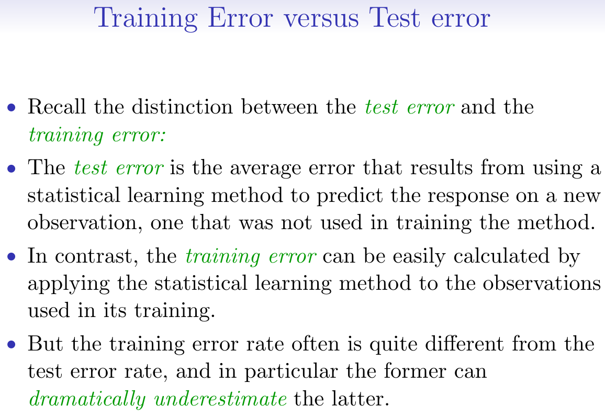
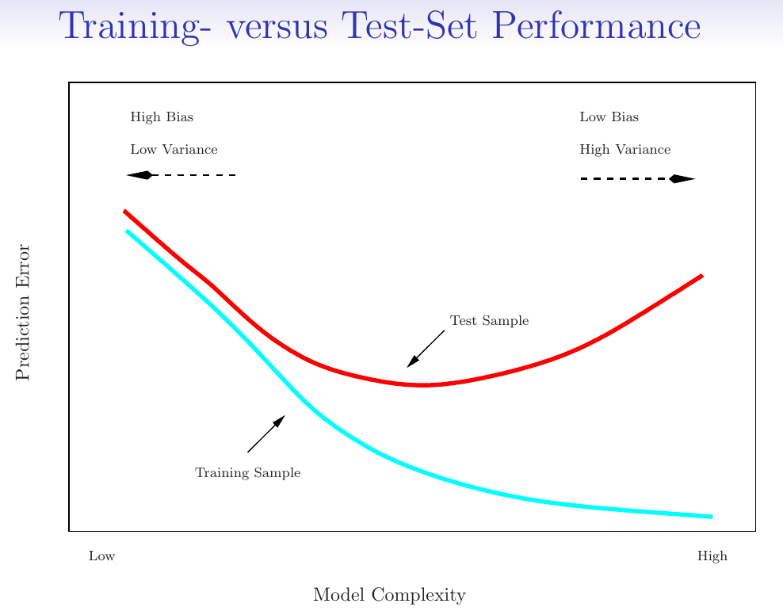
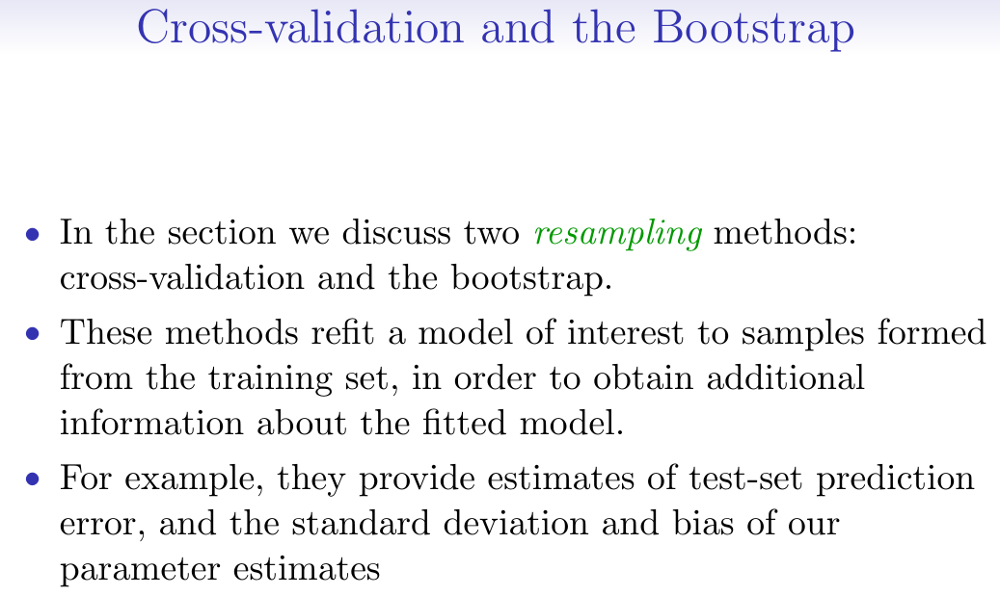
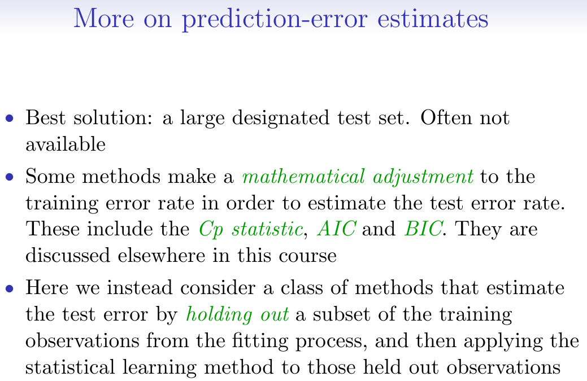

```{r setup, include = FALSE}
knitr::opts_chunk$set(
  cache = FALSE, # if TRUE knitr will cache results to reuse in future knits
  fig.width = 5, # the width for plots created by code chunk
  fig.height = 3.5, # the height for plots created by code chunk
  fig.align = 'center', # how to align graphics. 'left', 'right', 'center'
  dpi = 300, 
  dev = 'png', # Makes each fig a png, and avoids plotting every data point
  # eval = FALSE, # if FALSE, then the R code chunks are not evaluated
  # results = 'asis', # knitr passes through results without reformatting
  echo = TRUE, # if FALSE knitr won't display code in chunk above it's results
  message = TRUE, # if FALSE knitr won't display messages generated by code
  strip.white = TRUE, # if FALSE knitr won't remove white spaces at beg or end of code chunk
  warning = FALSE, # if FALSE knitr won't display warning messages in the doc
  error = TRUE) # report errors
  # options(tinytex.verbose = TRUE)
```

 \setcounter{section}{6}
 \setcounter{subsection}{1}
 \setcounter{subsubsection}{2}

#### Reading, Homeworks, Projects, SemProjects

  - Readings for next class: 
    - For Today, ISLR7 Beyond Linear Models, (R4DS22-25)
    - For next Tuesday ISLR8 and DL08/DL09 
  - Laboratory Exercises: 
    - LE3 due on Today
    - LE4 given out Tommorrow

  - Office Hours: (Class Canvas Calendar for Zoom Link)
    - Wednesdays @ 4:00 PM to 5:00 PM  
    - Saturdays @ 3:00 PM to 4:00 PM
    - **Office Hours are on Zoom, and recorded**
  - Semester Projects
    - Office Hours for SemProjs: Mondays at 4pm on Zoom
    - DSCI 453 Students Biweekly Updates Due 
      - Update # is Due **  **
    - DSCI 453 Students 
      - Next Report Out # is Due ** **
    - All DSCI 353/353M/453, E1453/2453 Students: 
      - Peer Grading of Report Out #1 is Due **  **
    - Exams
      - MidTerm: **Thursday March 9th**, in class or remote, 11:30 - 12:45 PM
        - **CWRU Spring Break is March 13th to March 17, so NO CLASS**
      - Final: **Thursday May 4th**, 2023, 12:00PM - 3:00PM, Nord 356 or remote

  
#### Textbooks

##### Introduction to R and Data Science

- For students new to R, Coding, Inferential Statistics

  - Peng: R Programming for Data Science
  - Peng: Exploratory Data Analysis with R
  - OIS = Diez, Barr, Çetinkaya-Runde: Open Intro Stat v4
  
#### Tidyverse Cheatsheets, Functions and Reading Your Code

- Look at the Tidyverse Cheatsheet

  - **Tidyverse For Beginners Cheatsheet**
    - In the Git/20s-dsci353-353m-453-prof/3-readings/3-CheatSheets/ folder
  - **Data Wrangling with dplyr and tidyr Cheatsheet**
]
  
Tidyverse Functions & Conventions

  - The pipe operator `%>%`
  - Use `dplyr::filter()` to subset data row-wise.
  - Use `dplyr::arrange()`  to sort the observations in a data frame
  - Use `dplyr::mutate()` to update or create new columns of a data frame
  - Use `dplyr::summarize()` to turn many observations into a single data point
  - Use `dplyr::arrange()` to change the ordering of the rows of a data frame 
  - These can be combined using `dplyr::group_by()` 
    - which lets you perform operations “by group”. 
  - The `%in%` matches conditions provided by a vector using the c() function
  - The **forcats** package has tidyverse functions 
    - for factors (categorical variables)
  - The **readr** package has tidyverse functions 
    - to read_..., melt_... col_..., parse_... data and objects

Reading Your Code: Whenever you see

  - The assignment operator `<-`, think **"gets"**
  - The pipe operator, `%>%`, think **"then"**
  

#### Syllabus


#### ISLR Chapter 5 Resampling Methods: Prediction Error Estimates

- Having procedures to evaluate different statistical methods is essential

  + Such as using Training and Testing Datasets
      - So that we can determine the prediction accuracy
      - Or the prediction error
    
Resampling Methods also do the same thing

  + Such as Cross-validation
  + Bootstrap
  + Leave-one-out cross-validation

In addition there are other metrics of statistical significance

We've seen 

  + $R^2$ and $adj.R^2$ 
  + p-values for null hypothesis testing

There are also $C_p$ statistic, $AIC$ and $BIC$ and others

  + Malloy's $C_p$ statistic
  + Akaike Information Criteria, $AIC$
  + Bayesian Information Criteria, $BIC$

#### Training and Testing for Prediction Error Determination

- Training vs. Testing Error



Training vs. Testing Performance



#### Cross-validation and Bootstrap

- Cross-validation and Bootstrap




#### Other Prediction Error Estimates

- Other Prediction Error Estimates



### ISLR6 Linear Model Selection and Regularization

#### Feature or Variable Selection

- These are all parts of the general topic of Feature Selection

In machine learning and statistics, feature selection, 

  + also known as variable selection, 
    - attribute selection or variable subset selection, 
  + is the process of selecting a subset of relevant features 
    - (variables, predictors) for use in model construction. 

Feature selection techniques are used for three reasons:

  + simplification of models to make them easier to interpret by researchers/users,
  + shorter training times,
  + enhanced generalization by reducing overfitting
    - (formally, reduction of variance)

The central premise when using a feature selection technique is 

   + that the data contains many features that are either redundant or irrelevant, 
   + and can thus be removed without incurring much loss of information. 

 Redundant or irrelevant features are two distinct notions, 

   + since one relevant feature may be redundant 
   + in the presence of another relevant feature 
       - with which it is strongly correlated.

Feature selection techniques should be distinguished from feature extraction. 

  + Feature extraction creates new features from functions of the original features, 
  + whereas feature selection returns a subset of the features. 

Feature selection techniques are often used in domains 

   + where there are many features 
   + and comparatively few samples (or data points). 

 Archetypal cases for the application of feature selection include 

   + the analysis of written texts and 
   + DNA microarray data, 

 where there are many thousands of features, 

   + and a few tens to hundreds of samples.

#### Prediction Error Estimates and Optimality Criteria

- And [Optimality Criteria](https://en.wikipedia.org/wiki/Feature_selection#Optimality_criteria)

Three common ones are the following

  + [Malloy's $C_p$ Statistic](https://en.wikipedia.org/wiki/Mallows%27s_Cp)
  + [Aikake Information Criteria](https://en.wikipedia.org/wiki/Akaike_information_criterion)
  + [Bayesian Information Criteria](https://en.wikipedia.org/wiki/Bayesian_information_criterion)

##### Malloy's $C_p$ Statistic

- In statistics, Mallows's $C_p$, 

  - named for Colin Lingwood Mallows, 
  - is used to assess the fit of a regression model 
    - that has been estimated using ordinary least squares. 

It is applied in the context of model selection, 

  - where a number of predictor variables are available for predicting some outcome, 
    - and the goal is to find the best model involving a subset of these predictors. 
  + A small value of $C_p$ means that the model is relatively precise.

Mallows's $C_p$ has been shown to be equivalent 

  - to Akaike information criterion 
    - in the special case of Gaussian linear regression.

##### Aikake Information Criteria

- The Akaike information criterion ($AIC$) 

  - is a measure of the relative quality of statistical models 
    - for a given set of data.
    - based on Shannon's information theory and information entropy

Given a collection of models for the data, 

  - $AIC$ estimates the quality of each model, 
    - relative to each of the other models. 
  + Hence, $AIC$ provides a means for model selection.

$AIC$ is founded on information theory: 

  + it offers a relative estimate of the information lost 
    - when a given model is used to represent the process that generates the data. 
  + In doing so, it deals with the trade-off between 
    - the goodness of fit of the model 
    - and the complexity of the model.
  + The Akaike information criterion ($AIC$) 
    - is a measure of the relative quality of statistical models 
    - for a given set of data. 
  + Given a collection of models for the data, 
    - $AIC$ estimates the quality of each model, 
    - relative to each of the other models. 
  - Again, $AIC$ provides a means for model selection.
  
  

$AIC$ does not provide a test of a model 

  - in the sense of testing a null hypothesis; i.e. 

$AIC$ can tell nothing about the quality of the model in an absolute sense. 

  + If all the candidate models fit poorly, 
  - $AIC$ will not give any warning of that.

##### Bayesian Information Criteria

- In statistics, the Bayesian information criterion ($BIC$) 

  - or Schwarz criterion (also $SBC$, $SBIC$) 
  - is a criterion for model selection 
    - among a finite set of models; 
    - the model with the lowest $BIC$ is preferred. 

It is based, in part, on the likelihood function 

  - and it is closely related to the Akaike information criterion ($AIC$).

When fitting models, 

  - it is possible to increase the likelihood by adding parameters, 
  - but doing so may result in overfitting. 

Both $BIC$ and $AIC$ resolve this problem 

  - by introducing a penalty term for the number of parameters in the model; 
  - the penalty term is larger in $BIC$ than in $AIC$.

The $BIC$ was developed by Gideon E. Schwarz 

  - and published in a 1978 paper, 
  - where he gave a Bayesian argument for adopting it.


#### Cites

  + Gareth James, Daniela Witten, Trevor Hastie, and Robert Tibshirani. An Introduction to Statistical Learning: With Applications in R. 1st ed. 2013, Corr. 5th printing 2015 edition. Springer Texts in Statistics. New York: Springer, 2013.
  + [https://en.wikipedia.org/wiki/Statistics](https://en.wikipedia.org/wiki/Statistics)