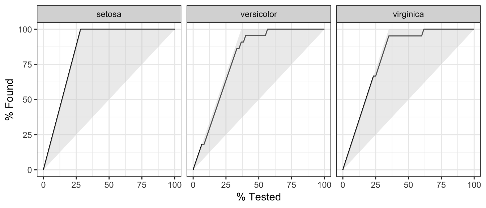
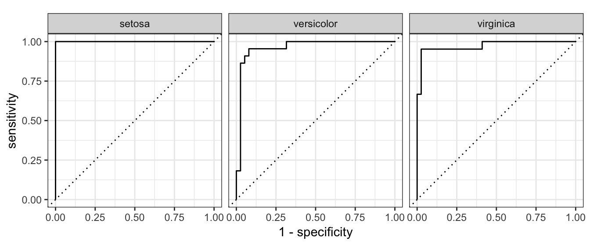

```{r setup, include = FALSE}
knitr::opts_chunk$set(
  cache = FALSE, # if TRUE knitr will cache results to reuse in future knits
  fig.width = 5, # the width for plots created by code chunk
  fig.height = 3.5, # the height for plots created by code chunk
  fig.align = 'center', # how to align graphics. 'left', 'right', 'center'
  dpi = 300, 
  dev = 'png', # Makes each fig a png, and avoids plotting every data point
  # eval = FALSE, # if FALSE, then the R code chunks are not evaluated
  # results = 'asis', # knitr passes through results without reformatting
  echo = TRUE, # if FALSE knitr won't display code in chunk above it's results
  message = TRUE, # if FALSE knitr won't display messages generated by code
  strip.white = TRUE, # if FALSE knitr won't remove white spaces at beg or end of code chunk
  warning = FALSE, # if FALSE knitr won't display warning messages in the doc
  error = TRUE) # report errors
  # options(tinytex.verbose = TRUE)
```
  
 \setcounter{section}{7}
 \setcounter{subsection}{1}
 \setcounter{subsubsection}{2}

#### Class Readings, Assignments, Textbooks Syllabus Topics

##### Reading, Lab Exercises, SemProjects

  - Readings: 
    - For today: ISLR8, DL08,09
    - For next class: ISLR9, (R4DS26-30)
  - Laboratory Exercises: 
    - LE4 given out
    - LE4 due March 9th
  - Office Hours: (Class Canvas Calendar for Zoom Link)
    - Wednesdays @ 4:00 PM to 5:00 PM  
    - Saturdays @ 3:00 PM to 4:00 PM
    - **Office Hours are on Zoom, and recorded**
  - Semester Projects
    - Office Hours for SemProjs: Mondays at 4pm on Zoom
    - DSCI 453 Students Biweekly Updates Due 
      - Update #4 is Due **Friday March 10th**
    - DSCI 453 Students 
      - Next Report Out # is Due ** **
    - All DSCI 353/353M/453, E1453/2453 Students: 
      - **Peer Grading of Report Out #1 is Due Thursday March 2nd **
    - Exams
      - MidTerm: **Thursday March 9th**, in class or remote, 11:30 - 12:45 PM
        - **CWRU Spring Break is March 13th to March 17, so NO CLASS**
      - Final: **Thursday May 4th**, 2023, 12:00PM - 3:00PM, Nord 356 or remote


##### Textbooks

- Text Books for DSCI353/353M/453

  - [R4DS: Wickham: R for Data Science](https://r4ds.had.co.nz/)
  - [ISLR: Intro to Statistical Learning with R, 2nd Ed.](https://www.statlearning.com/)
  - DLwR: Deep Learning with R 2nd. Ed., Chollet, Kalinoxski, Allaire, 
  - [DLGB: Deep Learning, Goodfellow, Bengio,  Courville](https://www.deeplearningbook.org/)

- Magazine Articles about Deep Learning

  - DL1 to DL12 are "Deep Learning" articles in 3-readings/2-articles/


- Books from DSCI351/351M/451

  - [Peng: R Programming for Data Science](https://leanpub.com/rprogramming)
  - [Peng: Exploratory Data Analysis with R](https://leanpub.com/exdata)
  - [Open Intro Stats, v4](https://openintro.org/os)
  - [R4DS: Wickham: R for Data Science](https://r4ds.had.co.nz/)


##### Tidyverse Cheatsheets, Functions and Reading Your Code

- Look at the Tidyverse Cheatsheet 

  - **Tidyverse For Beginners Cheatsheet**
    - In the Git/20s-dsci353-353m-453-prof/3-readings/3-CheatSheets/ folder
  - **Data Wrangling with dplyr and tidyr Cheatsheet**

  
  Tidyverse Functions & Conventions
  
    - The pipe operator `%>%`
    - Use `dplyr::filter()` to subset data row-wise.
    - Use `dplyr::arrange()`  to sort the observations in a data frame
    - Use `dplyr::mutate()` to update or create new columns of a data frame
    - Use `dplyr::summarize()` to turn many observations into a single data point
    - Use `dplyr::arrange()` to change the ordering of the rows of a data frame 
    - Use `dplyr::select()` to choose variables from a tibble, 
      - keeps only variables you mention
    - Use `dplyr::rename()` keeps all the variables and renames variables
      - rename(iris, petal_length = Petal.Length)
    - These can be combined using `dplyr::group_by()` 
      - which lets you perform operations “by group”. 
    - The `%in%` matches conditions provided by a vector using the c() function
    - The **forcats** package has tidyverse functions 
      - for factors (categorical variables)
    - The **readr** package has tidyverse functions 
      - to read_..., melt_... col_..., parse_... data and objects

Reading Your Code: Whenever you see

  - The assignment operator `<-`, think **"gets"**
  - The pipe operator, `%>%`, think **"then"**

##### Syllabus


#### ISLR6 is Model and Variable Selection

- So Regularization is reducing the dimensions / degrees of freedom in a model

  - By choosing fewer variables (e.g. variable selection)
  - By forcing $\beta$ coefficients towards or to zero (e.g. Lasso)
  - Using constrained functions (e.g. natural splines)
  - By combining variables (e.g. PCA)

So its useful to recognize this need

  - And learn all the ways we try to accomplish it

[Principal component analysis](https://en.wikipedia.org/wiki/Principal_component_analysis)

[Principal component regression](https://en.wikipedia.org/wiki/Principal_component_regression)

[Partial least squares regression](https://en.wikipedia.org/wiki/Partial_least_squares_regression)

  - PCA, PCR, PLS are covered in 
    - ISLR 6.3
    - ISLR 10.2

[Factor analysis](https://en.wikipedia.org/wiki/Factor_analysis)

  - Factor Analysis is covered in ESL Chapter 14.7
  
The similarities and differences among these approaches

  - Can be subtle, or fine
  - They are very powerful approaches.

#### A systematic/programmatic approach to data-driven modeling

  - Its not just building one model
  - Its building a series of models
  - Using training and testing splits for Validation

So in Lab Exercises

  - It was written so that you would do a large number of models
  - And be discussing all the modeling choices
  - And be able to demonstrate why you chose each choice
  - And how, by quantitative statistical metrics,
    - The one you choose is the best one

#### Tidy Modeling

- Using Tidy approaches to enable efficient meta-modeling and model selection

##### Introduction


- Lets look at the `tidymodels` R package

Let frame where `tidymodels` fit 

  - in a data-driven analysis

Lets illustrates what step each package covers. 

Developing models is a bit of a more complex

  - developing models can benefit from having a `tidyverse`-friendly interface 
  - that is where `tidymodels` package can come in

It is important to clarify that 

  - the group of packages that make up `tidymodels` 
    - do not implement statistical models themselves. 
  - Instead, they focus on making all the tasks 
    - around fitting the model much easier. 
  - Those tasks are 
    - data pre-processing and 
    - results validation.

So `tidymodels` is an R metapackage

  -  Similar in this sense to the `caret` package
  - [`caret` Classification and Regression Training](https://cran.r-project.org/web/packages/caret/index.html)

In a way, the Model step itself has sub-steps. 

  - For these sub-steps, `tidymodels` provides one or several packages. 
  - Here we'll look at four `tidymodels` packages:

The Tidymodel packages

  - `rsample` - Different types of re-samples
  - `recipes` - Transformations for model data pre-processing
  - `parsnip` - A common interface for model creation
  - `yardstick` - Measure model performance

The following diagram 

  - illustrates each modeling step, and 
  - lines up the `tidymodels` packages we'll discuss


In a given analysis, a `tidyverse` package may or may not be used. 

  - For example, not all projects need to work with time variables, 
    - so there is no need to use functions from the `hms` package. 
  - The same idea applies to `tidymodels`. 
  - Depending on what type of modeling is going to be done, 
    - only functions from some its packages will be used.

#### An Example

- Lets use the `iris` data set for an example. 

  - Its data is already imported
  - and sufficiently tidy to move directly to modeling.

##### Load only the `tidymodels` library

- We can just load the tidymodel metapackage 

  - Apart from loading its core modeling packages, 
  - `tidymodels` also conveniently loads some `tidyverse` packages, 
    - including `dplyr` and `ggplot2`. 
  - Throughout this exercise, we will use some functions out of those packages, 
    - but we don’t have to explicitly load them into our R session.

```{r}
library(tidyverse)
library(tidymodels)
```

##### Pre-process

- This step focuses on making data 

  - suitable for modeling by using data transformations. 

All transformations can be accomplished 

  - with `dplyr`, or other `tidyverse` packages 
  
Consider using `tidymodels` packages 

 - when model development is more heavy and complex.

##### Data Sampling

- The `rsample::initial_split()` function is specially built 

  - to separate the data set into a training and testing set. 
  - By default, 
    - it holds 3/4 of the data for training 
    - and the rest for testing. 
  - That can be changed by passing the `prop` argument. 
  - This function generates an `rsplit` object, 
    - not a data frame. 
  - The printed output shows the row count 
    - for testing, training, and total.

```{r}
iris_split <- initial_split(iris, prop = 0.6)
iris_split
## <90/60/150>
```
  
To access the observations reserved for training, 

  - use the `training()` function. 

Similarly, use `testing()` 

 - to access the testing data.

```{r}
iris_split %>%
  training() %>%
  glimpse()
## Observations: 90
## Variables: 5
## $ Sepal.Length <dbl> 5.1, 4.9, 4.7, 4.6, 5.0, 5.4, 4.6, 5.0, 4.9, 5.4, 4…
## $ Sepal.Width  <dbl> 3.5, 3.0, 3.2, 3.1, 3.6, 3.9, 3.4, 3.4, 3.1, 3.7, 3…
## $ Petal.Length <dbl> 1.4, 1.4, 1.3, 1.5, 1.4, 1.7, 1.4, 1.5, 1.5, 1.5, 1…
## $ Petal.Width  <dbl> 0.2, 0.2, 0.2, 0.2, 0.2, 0.4, 0.3, 0.2, 0.1, 0.2, 0…
## $ Species      <fct> setosa, setosa, setosa, setosa, setosa, setosa, set…
```

These sampling functions 

  - are courtesy of the `rsample` package, 
  - which is part of `tidymodels`.
  
##### Pre-process interface

- In `tidymodels`, the `recipes` package 

  - provides an interface that specializes in data pre-processing. 

Within the package, 

  - the functions that start, or execute, 
    - the data transformations are named after cooking actions. 
  - That makes the interface more user-friendly. 

For example:

  - `recipe()` - Starts a new set of transformations to be applied, 
    - similar to the `ggplot()` command. 
    - Its main argument is the model’s formula.
  - `prep()` - Executes the transformations 
    - on top of the data that is supplied 
    - (typically, the training data).

Each data transformation is a step. 

  - Functions correspond to specific types of steps, 
    - each of which has a prefix of `step_` 

There are several `step_` functions; 

  - in this example, we will use three of them:
  - `step_corr()` 
    - Removes variables 
    - that have large absolute correlations with other variables
  - `step_center()`
    - Normalizes numeric data to have a mean of zero
  - `step_scale()` 
    - Normalizes numeric data to have a standard deviation of one

Another nice feature is that the step can be applied 

  - to a specific variable, 
  - groups of variables, 
  - or all variables. 

The `all_outcomes()` and `all_predictors()` functions 

  - provide a very convenient way to specify groups of variables. 

For example, if we want the `step_corr()` 

  - to only analyze the predictor variables, 
  - we use `step_corr(all_predictors())`. 
    - This capability saves us from having to enumerate each variable.

In the following example, 

  - we will put together 
    - the `recipe()`, `prep()`, and `step` functions 
    - to create a recipe object. 
  - The `training()` function 
    - is used to extract that data set 
    - from the previously created split sample data set.

```{r}
iris_recipe <- training(iris_split) %>%
  recipe(Species ~.) %>%
  step_corr(all_predictors()) %>%
  step_center(all_predictors(), -all_outcomes()) %>%
  step_scale(all_predictors(), -all_outcomes()) %>%
  prep()
```

If we call the `iris_recipe` object, 

  - it will print details about the recipe. 
  - The Operations section describes what was done to the data. 
  - One of the operations entries in the example 
    - explains that the correlation step 
    - removed the `Petal.Length` variable.

```{r}
iris_recipe
## Data Recipe
## 
## Inputs:
## 
##       role #variables
##    outcome          1
##  predictor          4
## 
## Training data contained 90 data points and no missing data.
## 
## Operations:
## 
## Correlation filter removed Petal.Length [trained]
## Centering for Sepal.Length, Sepal.Width, Petal.Width [trained]
## Scaling for Sepal.Length, Sepal.Width, Petal.Width [trained]
```
      
##### Execute the pre-processing

- The testing data can now be transformed 

  - using the exact same 
    - steps, 
    - weights, 
    - and categorization 
  - used to pre-process the training data. 

To do this, another function 

  - with a cooking term is used: `bake()`. 
  - Notice that the `testing()` function is used 
    - in order to extract the appropriate data set.

```{r}
iris_testing <- iris_recipe %>%
  bake(testing(iris_split)) 

glimpse(iris_testing)
## Observations: 60
## Variables: 4
## $ Sepal.Length <dbl> -1.597601746, -1.138960096, 0.007644027, -0.7949788…
## $ Sepal.Width  <dbl> -0.41010139, 0.71517681, 2.06551064, 1.61539936, 0.…
## $ Petal.Width  <dbl> -1.2085003, -1.2085003, -1.2085003, -1.0796318, -1.…
## $ Species      <fct> setosa, setosa, setosa, setosa, setosa, setosa, set…
```


Performing the same operation 

  - over the training data is redundant, 
    - because that data has already been prepped. 

To load the prepared training data 

  - into a variable, 
    - we use juice(). 
  - It will extract the data 
    - from the iris_recipe object.

```{r}
iris_training <- juice(iris_recipe)

glimpse(iris_training)
## Observations: 90
## Variables: 4
## $ Sepal.Length <dbl> -0.7949789, -1.0242997, -1.2536205, -1.3682809, -0.…
## $ Sepal.Width  <dbl> 0.94023245, -0.18504575, 0.26506553, 0.04000989, 1.…
## $ Petal.Width  <dbl> -1.2085003, -1.2085003, -1.2085003, -1.2085003, -1.…
## $ Species      <fct> setosa, setosa, setosa, setosa, setosa, setosa, set…
```

##### Model training

- In R, there are multiple packages that fit the same type of model. 

  - It is common for each package to provide a unique interface. 
  - In other words, 
    - things such as an argument for the same model attribute 
    - is defined differently for each package. 

For example, the `ranger` and `randomForest` packages 

  - fit Random Forest models. 
  - In the `ranger()` function, 
    - to define the number of trees we use `num.trees`. 
  - In `randomForest` package, 
    - that argument is named `ntree`. 
  - It is not easy to switch between packages 
    - to run the same model.

Instead of replacing the modeling package, 

  - `tidymodels` replaces the interface. 

Better said, `tidymodels` 

  - provides a single set of functions and arguments 
    - to define a model.
  - It then fits the model 
    - against the requested modeling package.

In the example below, 

  - the `rand_forest()` function is used 
    - to initialize a Random Forest model. 
    - To define the number of trees, 
    - the trees argument is used. 
  - To use the ranger version of Random Forest, 
    - the `set_engine()` function is used. 
  - Finally, to execute the model, 
    - the `fit()` function is used. 
  - The expected arguments are the formula and data. 
  - Notice that the model runs 
    - on top of the juiced trained data.

```{r}
iris_ranger <- rand_forest(trees = 100, mode = "classification") %>%
  set_engine("ranger") %>%
  fit(Species ~ ., data = iris_training)
```

The payoff is that 

  - if we now want to run the same model 
    - against randomForest, 
  - we simply change the value in set_engine() 
    - to `randomForest`.

```{r}
iris_rf <-  rand_forest(trees = 100, mode = "classification") %>%
  set_engine("randomForest") %>%
  fit(Species ~ ., data = iris_training)
```

It is also worth mentioning that 

  - the model is not defined 
    - in a single, large function with a lot of arguments. 
  - The model definition is separated 
    - into smaller functions 
    - such as `fit()` and `set_engine()`. 
  - This allows for a more flexible, and easier to learn, interface.

##### Predictions

- Instead of a vector, 

  - the `predict()` function 
    - ran against a parsnip model 
    - returns a tibble. 
  - By default, the prediction variable 
    - is called `.pred_class`. 
  - In the example, notice that 
    - the baked testing data is used.

```{r}
predict(iris_ranger, iris_testing)
## # A tibble: 60 x 1
##    .pred_class
##    <fct>      
##  1 setosa     
##  2 setosa     
##  3 setosa     
##  4 setosa     
##  5 setosa     
##  6 setosa     
##  7 setosa     
##  8 setosa     
##  9 setosa     
## 10 setosa     
## # … with 50 more rows
```

It is very easy to add the predictions 

  - to the baked testing data 
  - by using `dplyr`’s `bind_cols()` function.

```{r}
iris_ranger %>%
  predict(iris_testing) %>%
  dplyr::bind_cols(iris_testing) %>%
  glimpse()
## Observations: 60
## Variables: 5
## $ .pred_class  <fct> setosa, setosa, setosa, setosa, setosa, setosa, set…
## $ Sepal.Length <dbl> -1.597601746, -1.138960096, 0.007644027, -0.7949788…
## $ Sepal.Width  <dbl> -0.41010139, 0.71517681, 2.06551064, 1.61539936, 0.…
## $ Petal.Width  <dbl> -1.2085003, -1.2085003, -1.2085003, -1.0796318, -1.…
## $ Species      <fct> setosa, setosa, setosa, setosa, setosa, setosa, set…
```

##### Model Validation

- Use the `metrics()` function 

  - to measure the performance of the model. 

It will automatically choose metrics 

  - appropriate for a given type of model. 

The function expects a tibble 

  - that contains the actual results (truth) 
  - and what the model predicted (estimate).

```{r}
iris_ranger %>%
  predict(iris_testing) %>%
  bind_cols(iris_testing) %>%
  metrics(truth = Species, estimate = .pred_class)
## # A tibble: 2 x 3
##   .metric  .estimator .estimate
##   <chr>    <chr>          <dbl>
## 1 accuracy multiclass     0.917
## 2 kap      multiclass     0.874
```

Because of the consistency of the new interface, 

  - measuring the same metrics 
    - against the `randomForest` model 
  - is as easy as replacing the model variable 
    - at the top of the code.

```{r}
iris_rf %>%
  predict(iris_testing) %>%
  dplyr::bind_cols(iris_testing) %>%
  metrics(truth = Species, estimate = .pred_class)
## # A tibble: 2 x 3
##   .metric  .estimator .estimate
##   <chr>    <chr>          <dbl>
## 1 accuracy multiclass     0.883
## 2 kap      multiclass     0.824
```

##### Per classifier metrics

- It is easy to obtain the probability 

  - for each possible predicted value 
    - by setting the type argument to prob. 
  - That will return a tibble 
    - with as many variables 
    - as there are possible predicted values. 
  - Their name will default 
    - to the original value name, 
    - prefixed with .pred_.

```{r}
iris_ranger %>%
  predict(iris_testing, type = "prob") %>%
  glimpse()
## Observations: 60
## Variables: 3
## $ .pred_setosa     <dbl> 0.677480159, 0.978293651, 0.783250000, 0.983972…
## $ .pred_versicolor <dbl> 0.295507937, 0.011706349, 0.150833333, 0.001111…
## $ .pred_virginica  <dbl> 0.02701190, 0.01000000, 0.06591667, 0.01491667,…
```

Again, use `dplyr::bind_cols()` 

  - to append the predictions 
  - to the baked testing data set.

```{r}
iris_probs <- iris_ranger %>%
  predict(iris_testing, type = "prob") %>%
  dplyr::bind_cols(iris_testing)

glimpse(iris_probs)
## Observations: 60
## Variables: 7
## $ .pred_setosa     <dbl> 0.677480159, 0.978293651, 0.783250000, 0.983972…
## $ .pred_versicolor <dbl> 0.295507937, 0.011706349, 0.150833333, 0.001111…
## $ .pred_virginica  <dbl> 0.02701190, 0.01000000, 0.06591667, 0.01491667,…
## $ Sepal.Length     <dbl> -1.597601746, -1.138960096, 0.007644027, -0.794…
## $ Sepal.Width      <dbl> -0.41010139, 0.71517681, 2.06551064, 1.61539936…
## $ Petal.Width      <dbl> -1.2085003, -1.2085003, -1.2085003, -1.0796318,…
## $ Species          <fct> setosa, setosa, setosa, setosa, setosa, setosa,…
```

Now that everything is in one tibble, 

  - it is easy to calculate curve methods. 
  - In this case we are using `gain_curve()`.

```{r}
iris_probs %>%
  gain_curve(Species, .pred_setosa:.pred_virginica) %>%
  glimpse()
## Observations: 141
## Variables: 5
## $ .level          <chr> "setosa", "setosa", "setosa", "setosa", "setosa"…
## $ .n              <dbl> 0, 1, 3, 4, 5, 7, 8, 9, 10, 12, 13, 14, 15, 16, …
## $ .n_events       <dbl> 0, 1, 3, 4, 5, 7, 8, 9, 10, 12, 13, 14, 15, 16, …
## $ .percent_tested <dbl> 0.000000, 1.666667, 5.000000, 6.666667, 8.333333…
## $ .percent_found  <dbl> 0.000000, 5.882353, 17.647059, 23.529412, 29.411…
```

The curve methods 

  - include an `autoplot()` function 
  - that easily creates a `ggplot2` visualization.

```{r}
iris_probs %>%
  gain_curve(Species, .pred_setosa:.pred_virginica) %>%
  autoplot()
```


  
This is an example of a `roc_curve()`. 

  - roc means ["Receiver Operating Characteristic"](https://en.wikipedia.org/wiki/Receiver_operating_characteristic)
  - Again, because of the consistency of the interface, 
    - only the function name needs to be modified; 
    - even the argument values remain the same.

```{r}
iris_probs %>%
  roc_curve(Species, .pred_setosa:.pred_virginica) %>%
  autoplot()
```



To measured the combined 

  - single predicted value 
    - and the probability of each possible value, 
  - combine the two prediction modes 
    - (with and without prob type). 

In this example, 

  - using `dplyr`’s `select()` 
  - makes the resulting tibble easier to read.

```{r}
predict(iris_ranger, iris_testing, type = "prob") %>%
  bind_cols(predict(iris_ranger, iris_testing)) %>%
  bind_cols(select(iris_testing, Species)) %>%
  glimpse()
## Observations: 60
## Variables: 5
## $ .pred_setosa     <dbl> 0.677480159, 0.978293651, 0.783250000, 0.983972…
## $ .pred_versicolor <dbl> 0.295507937, 0.011706349, 0.150833333, 0.001111…
## $ .pred_virginica  <dbl> 0.02701190, 0.01000000, 0.06591667, 0.01491667,…
## $ .pred_class      <fct> setosa, setosa, setosa, setosa, setosa, setosa,…
## $ Species          <fct> setosa, setosa, setosa, setosa, setosa, setosa,…
```

Pipe the resulting table into `metrics()`. 

In this case, specify `.pred_class` as the estimate.

```{r}
predict(iris_ranger, iris_testing, type = "prob") %>%
  bind_cols(predict(iris_ranger, iris_testing)) %>%
  bind_cols(select(iris_testing, Species)) %>%
  metrics(Species, .pred_setosa:.pred_virginica, estimate = .pred_class)
## # A tibble: 4 x 3
##   .metric     .estimator .estimate
##   <chr>       <chr>          <dbl>
## 1 accuracy    multiclass     0.917
## 2 kap         multiclass     0.874
## 3 mn_log_loss multiclass     0.274
## 4 roc_auc     hand_till      0.980
```

##### Summary

- This end-to-end example can serve as a gentle introduction to `tidymodels`. 

The number of functions, 

  - and options of such functions, 
  - were kept at a minimum for the purposes of this demonstration, 
    - but there is much more that can be done with this wonderful metapackages. 
    
Hopefully, this serves as an initial example

  - you can build from 
  - for automating your data-driven modeling

#### Links

- Background on these topics

[Principal Components Analysis](https://en.wikipedia.org/wiki/Principal_component_analysis)

[Principal Components Regression](https://en.wikipedia.org/wiki/Principal_component_regression)

[Partial Least Squares Regression](https://en.wikipedia.org/wiki/Partial_least_squares_regression)

[Factor Analysis](https://en.wikipedia.org/wiki/Factor_analysis)

[Edgar Ruiz, A Gentle Introduction to tidymodels](https://rviews.rstudio.com/2019/06/19/a-gentle-intro-to-tidymodels/)


