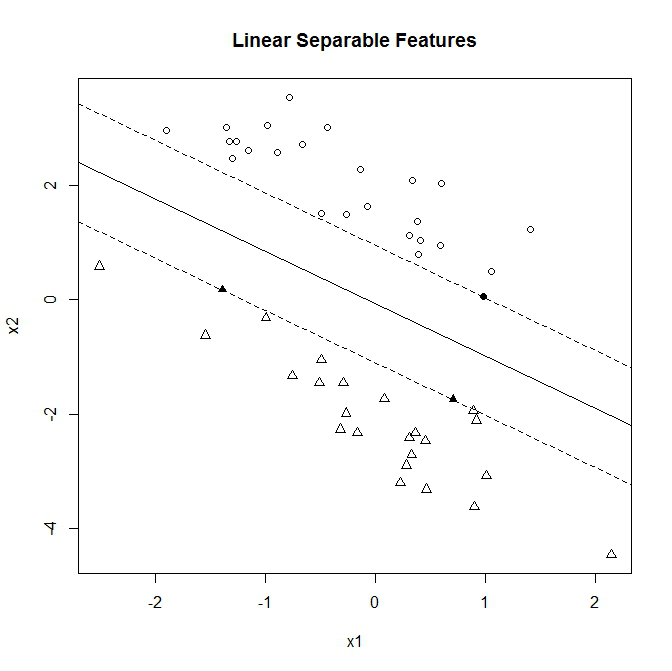
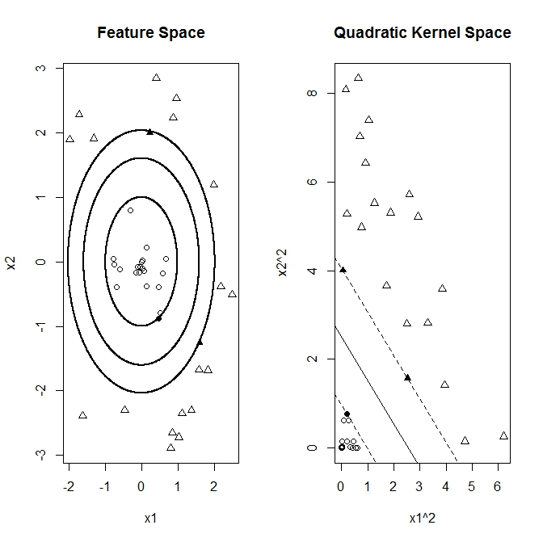
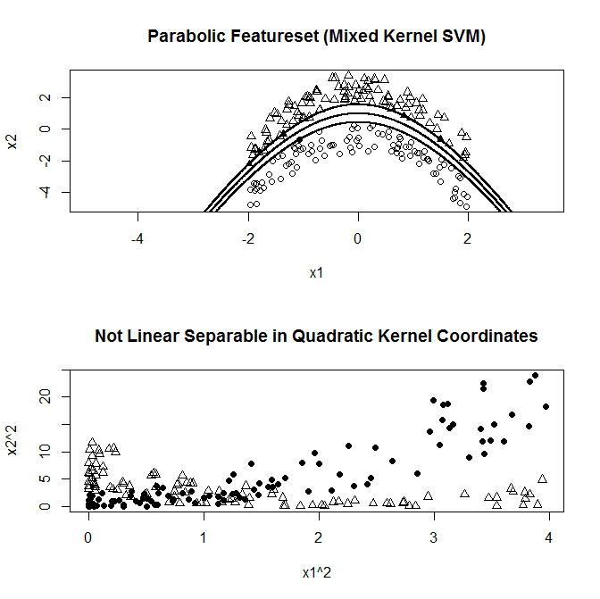

```{r setup, include=FALSE}
knitr::opts_chunk$set(
  cache = FALSE, # if TRUE knitr will cache results to reuse in future knits
  fig.width = 4, # the width for plots created by code chunk
  fig.height = 3, # the height for plots created by code chunk
  fig.align = 'center', # how to align graphics. 'left', 'right', 'center'
  dpi = 300, 
  dev = 'png', # Makes each fig a png, and avoids plotting every data point
  # eval = FALSE, # if FALSE, then the R code chunks are not evaluated
  # results = 'asis', # knitr passes through results without reformatting
  echo = TRUE, # if FALSE knitr won't display code in chunk above it's results
  message = TRUE, # if FALSE knitr won't display messages generated by code
  strip.white = TRUE, # if FALSE knitr won't remove white spaces at beg or end of code chunk
  warning = FALSE, # if FALSE knitr won't display warning messages in the doc
  eval = TRUE, # if FALSE knitr doesn't run any code blocks
  error = TRUE) # report errors
```

 \setcounter{section}{7}
 \setcounter{subsection}{2}
 \setcounter{subsubsection}{3}
 
#### Class Readings, Assignments, Syllabus Topics


#### Machine Learning and Kernels

- A common application of machine learning (ML) 

  - is the learning and classification of a set of raw data features 
  - by a ML algorithm or technique. 

In this context a ML kernel 

  - acts to the ML algorithm like sunshades, 
    - a telescope or a magnifying glass 
  - to the observing eye of a student learner. 

A good kernel 

  - filters the raw data 
  - and presents its features to the machine 
  - in a way that makes the learning task as simple as possible.

Historically a lot of progress in machine learning 

  - has been made in the development sophisticated learning algorithms, 
  - however selecting appropriate kernels 
    - remains a largely manual and time consuming task.

This discussion is inspired by a presentation 

  - by Prof. Mehryar Mohri about [learning kernels](http://www.cs.nyu.edu/~mohri/icml2011-tutorial/). 

It reflects on the importance of kernels 

  - in support vector machines (SVM).

A total of three examples are presented. 

  - A linear kernel is shown to solve the first example 
    - but fails for the second task. 
  - There a square kernel is successful. 
  - Then a third example is presented 
    - that both linear and square kernels are not sufficient. 
  
A successful kernel can be generated 

  - out of a mixture of both base kernels. 

This illustrates that kernels can be generated out of bases, 

  - resulting in products that are more powerful 
  - in solving the task at hand 
  - than each individual components.

#### Support Vector Machines

- Consider a support vector machine (SVM) for a classification task. 

Given a set of 

  - pairs of feature data-point vectors $x$ 
    - and classifier labels $y={-1,1}$, 
  - the task of the SVM algorithm 
    - is to learn to group features $x$ by classifier labels $y$. 

After training on a known data set 

  - the SVM machine is intended to correctly predict the class $y$ 
  - of an previously unseen feature vector $x$.

Applications in quantitative finance of support vector machines 

  - include for example predictive tasks, 
  - where $x$ consists of features 
    - derived from a historical stock indicator time series 
  - and $y$ is a sell or buy signal.
  
Another example could be 

  - that $x$ consist of counts of key-words within a text 
    - such as an news announcements 
  - and $y$ categorizes it again 
    - according on its impact to market movements. 

Outside of finance a text based SVM 
  
  - could be used to filter e-mail to be forwarded 
  - to either the inbox or the spam folder.

##### Linear Kernel

- As indicated above the SVM works 

  - by grouping feature points according to its classifiers.
  
For illustration in the toy example below 

  - two dimensional feature vectors $x={x1,x2}$ 
  - are generated in such a way that the class $y=-1$ points (triangles) 
  - are nicely separated from the class $y=1$ (circles).

The SVM algorithm finds the largest possible linear margin 

  - that separates these two regions. 

The marginal separators 

  - rest on the outpost points 
    - that are right on the front line of their respective regions. 
  - These points, 
    - marked as two bold triangles and one bold circle in the picture below, 
  - are named the ‘support vectors’ 
    - as they are supporting the separation boundary lines. 

In fact the SVM learning task 

  - fully consists of determining these support vector points 
    - and the margin distance that separates the regions. 

After training 

  - all other non-support points 
  - are not used for prediction.



In linear feature space 

  - the support vectors add to an overall hypothesis vector 
    - $h$, $h = \sum c_i x_i$, 
  - such that the classification frontiers are given by the lines 
    - $h x + b = 1$ and $h x + b = -1$ centered around $h x + b = 0$.

The code below utilizes the ksvm implementation 

  - in the R package ‘kernlab’, 
  - making use of “[Jean-Philippe Vert’s](http://cbio.ensmp.fr/~jvert/)” tutorials 
  - for graphing the classification separation lines.


Lets define a function `kfunction`

```{r}
# require('kernlab')
library(tidyverse)
library(kernlab)

?kernlab::ksvm

kfunction <- function(linear = 0, quadratic = 0) {
  k <- function(x, y)  {
    linear * sum((x) * (y)) + quadratic * sum((x ^ 2) * (y ^ 2))
  }
  class(k) <- "kernel"
  k
}
```

```{r}
n <- 25
a1 <- rnorm(n)
a2 <- 1 - a1 + 2 * runif(n)
b1 <- rnorm(n)
b2 <- -1 - b1 - 2 * runif(n)
x <- rbind(matrix(cbind(a1, a2), , 2), matrix(cbind(b1, b2), , 2))
y <- matrix(c(rep(1, n), rep(-1, n)))

glimpse(x)
glimpse(y)
```

Lets define another function `ksvm`

```{r}
svp <- ksvm(
  x,
  y,
  type = "C-svc",
  C = 100,
  kernel = kfunction(1, 0),
  scaled = c()
)
```

Now lets look at the results

```{r}
{
  plot(
    c(min(x[, 1]), max(x[, 1])),
    c(min(x[, 2]), max(x[, 2])),
    type = 'n',
    xlab = 'x1',
    ylab = 'x2'
  )
  title(main = 'Linear Separable Features')
}
ymat <- ymatrix(svp)
points(x[-SVindex(svp), 1], x[-SVindex(svp), 2],
       pch = ifelse(ymat[-SVindex(svp)] < 0, 2, 1))
points(x[SVindex(svp), 1], x[SVindex(svp), 2],
       pch = ifelse(ymat[SVindex(svp)] < 0, 17, 16))

# Extract w and b from the model
w <- colSums(coef(svp)[[1]] * x[SVindex(svp),])
b <- b(svp)

# Draw the lines
abline(b / w[2], -w[1] / w[2])
abline((b + 1) / w[2], -w[1] / w[2], lty = 2)
abline((b - 1) / w[2], -w[1] / w[2], lty = 2)
```

##### Quadratic Kernel

- The following example illustrates a case 

  - where the feature points are non-linear separated. 
  
Points of the class $y=1$ (circles below) 

  - are placed in a inner region 
    - surrounded from all sides by points of class y = -1, 
    - again depicted as triangles. 

In this example there is no single straight (linear) line 

  - that can separate both regions. 

However here it is still possible to find such a separator 

  - by transforming the points $x=\{x_1, x_2\}$ from feature space 
  - to a quadratic kernel space 
    - with points given by the corresponding square coordinates $\{x_1^2, x_2^2\}$.

The technique of transforming from feature space 

  - into a measure that allows for a linear separation 
    - can be formalized in terms of kernels. 

Assuming  $\Phi()$ is a vector coordinate transformation function. 

  - For example a squared coordinate space would be 
    - $\{ \Phi(x)_1 , \Phi(x)_2 \} = \{ x_1^2 , x_2^2 \}$. 
  - The SVM separation task is now acting in the transformed space 
    - to find the support vectors that generate

$$h \Phi(x) + b = \pm 1$$

for the hypothesis vector $h = \sum c_i \Phi(x_i)$ 

  - given by the sum over support vector points $x_i$. 
  
Putting both expressions together we get

$$\sum c_i K(x_i,x) + b = \pm 1$$

with the scalar kernel function $$K(x_i,x) = \Phi(x_i) \Phi(x)$$. 

The kernel is composed out of the scalar product 

  - between a support vector $x_i$ 
  - and another feature vector point $x$ 
    - in the transformed space. 

In practice the SVM algorithm 

  - can be fully expressed in terms of kernels 
    - without having to actually specify the feature space transformation. 

Popular kernels are for example 

  - higher powers of the linear scalar product (polynomial kernel). 
  - Another example is 
    - a probability weighed distance between two points (Gaussian kernel).

Implementing a two dimensional quadratic kernel function 

  - allows the SVM algorithm to find support vectors 
    - and correctly separate the regions. 

The graph below illustrates that 

  - the non-linear regions are linearly separated 
  - after transforming to the squared kernel space.



The “R” implementation makes use of ksvm’s flexibility 

  - to allow for custom kernel functions. 
  - The function `kfunction`’ 
    - returns a linear scalar product kernel for parameters (1,0) 
    - and a quadratic kernel function for parameters (0,1).

```{r}
library('kernlab')
kfunction <- function(linear = 0, quadratic = 0)
{
  k <- function(x, y)
  {
    linear * sum((x) * (y)) + quadratic * sum((x ^ 2) * (y ^ 2))
  }
  class(k) <- "kernel"
  k
}

n = 20
r = runif(n)
a = 2 * pi * runif(n)
a1 = r * sin(a)
a2 = r * cos(a)
r = 2 + runif(n)
a = 2 * pi * runif(n)
b1 = r * sin(a)
b2 = r * cos(a)
x = rbind(matrix(cbind(a1, a2), , 2), matrix(cbind(b1, b2), , 2))
y <- matrix(c(rep(1, n), rep(-1, n)))

glimpse(x)
glimpse(r)
```


```{r}
svp <-
  ksvm(
    x,
    y,
    type = "C-svc",
    C = 100,
    kernel = kfunction(0, 1),
    scaled = c()
  )
par(mfrow = c(1, 2))
plot(
  c(min(x[, 1]), max(x[, 1])),
  c(min(x[, 2]), max(x[, 2])),
  type = 'n',
  xlab = 'x1',
  ylab = 'x2'
)
title(main = 'Feature Space')
ymat <- ymatrix(svp)
points(x[-SVindex(svp), 1], x[-SVindex(svp), 2], 
       pch = ifelse(ymat[-SVindex(svp)] < 0, 2, 1))
points(x[SVindex(svp), 1], x[SVindex(svp), 2], 
       pch = ifelse(ymat[SVindex(svp)] < 0, 17, 16))
```


```{r}
# Extract w and b from the model
w2 <- colSums(coef(svp)[[1]] * x[SVindex(svp), ] ^ 2)
b <- b(svp)

x1 = seq(min(x[, 1]), max(x[, 1]), 0.01)
x2 = seq(min(x[, 2]), max(x[, 2]), 0.01)

plot.new()

points(-sqrt((b - w2[1] * x2 ^ 2) / w2[2]), x2, pch = 16 , cex = .1)
points(sqrt((b - w2[1] * x2 ^ 2) / w2[2]), x2, pch = 16 , cex = .1)
points(x1, sqrt((b - w2[2] * x1 ^ 2) / w2[1]), pch = 16 , cex = .1)
points(x1,  -sqrt((b - w2[2] * x1 ^ 2) / w2[1]), pch = 16, cex = .1)

points(-sqrt((1 + b - w2[1] * x2 ^ 2) / w2[2]) , x2, pch = 16 , cex = .1)
points(sqrt((1 + b - w2[1] * x2 ^ 2) / w2[2]) , x2,  pch = 16 , cex = .1)
points(x1 , sqrt((1 + b - w2[2] * x1 ^ 2) / w2[1]), pch = 16 , cex = .1)
points(x1 , -sqrt((1 + b - w2[2] * x1 ^ 2) / w2[1]), pch = 16, cex = .1)

points(-sqrt((-1 + b - w2[1] * x2 ^ 2) / w2[2]) , x2, pch = 16 , cex = .1)
points(sqrt((-1 + b - w2[1] * x2 ^ 2) / w2[2]) , x2,  pch = 16 , cex = .1)
points(x1 , sqrt((-1 + b - w2[2] * x1 ^ 2) / w2[1]), pch = 16 , cex = .1)
points(x1 , -sqrt((-1 + b - w2[2] * x1 ^ 2) / w2[1]), pch = 16, cex = .1)

xsq <- x ^ 2
svp <-
  ksvm(
    xsq,
    y,
    type = "C-svc",
    C = 100,
    kernel = kfunction(1, 0),
    scaled = c()
  )

plot(
  c(min(xsq[, 1]), max(xsq[, 1])),
  c(min(xsq[, 2]), max(xsq[, 2])),
  type = 'n',
  xlab = 'x1^2',
  ylab = 'x2^2'
)
title(main = 'Quadratic Kernel Space')
ymat <- ymatrix(svp)
points(xsq[-SVindex(svp), 1], xsq[-SVindex(svp), 2], 
       pch = ifelse(ymat[-SVindex(svp)] < 0, 2, 1))
points(xsq[SVindex(svp), 1], xsq[SVindex(svp), 2], 
       pch = ifelse(ymat[SVindex(svp)] < 0, 17, 16))

# Extract w and b from the model
w <- colSums(coef(svp)[[1]] * xsq[SVindex(svp), ])
b <- b(svp)

# Draw the lines
abline(b / w[2], -w[1] / w[2])
abline((b + 1) / w[2], -w[1] / w[2], lty = 2)
abline((b - 1) / w[2], -w[1] / w[2], lty = 2)
```

##### Alignment and Kernel Mixture

- The final exploratory feature data set 

  - consists again of two classes of points 
  - within two dimensional space.
  
This time two distinct regions of points 

  - are separated by a parabolic boundary, 
  - where vector points of class $y=1$ (circles) are below 
  - and $y=-1$ (triangles) are above the separating curve. 

The example is selected for its property 

  - that neither the linear nor the quadratic kernels alone 
  - are able to resolve the SVM classification problem.

The second graph below illustrates that feature points of both classes 

  - are scattered onto overlapping regions in the quadratic kernel space. 

It indicates that for this case 

  - the sole utilization of the quadratic kernel 
  - is not enough to resolve the classification problem.

In [“Algorithms for Learning Kernels Based on Centered Alignment”](http://http//www.cs.nyu.edu/~mohri/pub/alignj.pdf) 

  - Corinna Cortes, Mehryar Mohri and Afshin Rostamizadeh 
  - compose mixed kernels out of base kernel functions. 

This is perhaps similar to how a vector 

  - can be composed out of its coordinate base vectors 
  - or a function can be assembled in functional Hilbert space.

In our example 

  - we form a new mixed kernel 
    - out of the linear and the quadratic kernels $K_1$ and $K_2$

$$K_M(x,z) = \rho_1 K_1(x,z) + \rho_2 K_2(x,z)$$

The graph below demonstrate 

  - that the mixed kernel successfully solves the classification problem 
  - even thought each individual base kernels are insufficient on its own.
  
In experimentation 

  - the actual values of the mixture weights $\rho_1$, $\rho_2$ are not critical. 

Following the study above we choose the weights 

  - according to how much each individual base kernel 
    - on its individual aligned with the raw classification matrix 
  - $Y = y^T y$ composed out of the classifier vector $y$.

Alignment is based on the observation that 

  - a perfectly selected kernel matrix $K_{i,j} = K(x_i,x_j)$ 
  - would trivially solve the classification problem 
    - if its elements are equal to the $Y$ matrix. 
  - In that case choosing an arbitrary vector $x_1$ as support 
  - the the kernel $K(x_1, x_i)$ would give 1 
    - if $x_1$ and $x_i$ are in the same category and -1 otherwise.

Similar to the concept of correlation, 

  - kernel alignment between two kernels 
    - is defined by the expectation over the feature space, 
    - resulting in matrix products

$$\rho ( K^c_1 , K^c_2 ) =  \frac{ < K^c_1 , K^c_2  > }{ \sqrt{ < K^c_1 , K^c_1  > < K^c_2 , K^c_2  > } }$$

with the product $latex = Tr[A^T B]$. 

The expectation is take 

  - assuming centered $n \times n$ kernel matrices 
    - according to $K^c = (I-(11^T)/n)K(I-(11^T)/n).$ 
  - (For details see [reference](http://http//www.cs.nyu.edu/~mohri/pub/alignj.pdf) above.)



Kernel matrix centering and alignment functions 

  - are implemented in the ‘R’ as following


Setup

```{r}
library('kernlab')

kfunction <- function(linear, quadratic) {
  k <- function(x, y) {
    linear * sum((x) * (y)) + quadratic * sum((x ^ 2) * (y ^ 2))
  }
  class(k) <- "kernel"
  k
}

n <- 100
a1 <- 4 * runif(n) - 2
a2 <- 1 - a1 ^ 2 - 0.5 - 2 * runif(n)
b1 <- 4 * runif(n) - 2
b2 <- 1 - b1 ^ 2 + 0.5 + 2 * runif(n)

x <- rbind(matrix(cbind(a1, a2), , 2), matrix(cbind(b1, b2), , 2))
y <- matrix(c(rep(1, n), rep(-1, n)))

glimpse(x)
glimpse(y)
```

Prep our desired kernel

```{r}
center_kernel <- function(kernel) {
  m <- length(kernel[, 1])
  ones <- matrix(rep(1, m), m)
  (diag(m) - ones %*% t(ones) / m) * kernel * (diag(m) - ones %*% t(ones) / m)
}
f_product <- function(x, y) {
  sum(diag(crossprod(t(x), y)))
}
f_norm <- function(x) {
  sqrt(f_product(x, x))
}
kernel_alignment <- function(x, y) {
  f_product(x, y) / (f_norm(x) * f_norm(y))
}

x_kernel1 <- kernelMatrix(kfunction(1, 0), x)
y_kernel  <- y %*% t(y)
x_kernel2 <- kernelMatrix(kfunction(0, 1), x)

x_kernel1_c <- center_kernel(x_kernel1)
x_kernel2_c <- center_kernel(x_kernel2)

y_kernel_c <- center_kernel(y_kernel)

alignment1 <- kernel_alignment(x_kernel1_c, y_kernel_c)
alignment2 <- kernel_alignment(x_kernel2_c, y_kernel_c)

x_kernel3 <- kernelMatrix(kfunction(alignment1, alignment2), x)
x_kernel3_c <- center_kernel(x_kernel3)
alignment3 <- kernel_alignment(x_kernel3_c, y_kernel_c)
```

Now lets see the kernel SVM results

```{r}
svp <- ksvm(
  x,
  y,
  type = "C-svc",
  C = 100,
  kernel = kfunction(alignment1, alignment2),
  scaled = c()
)
par(mfrow = c(2, 1))
plot(
  c(min(x[]), max(x[])),
  c(min(x[]), max(x[])),
  type = 'n',
  xlab = 'x1',
  ylab = 'x2'
)
title(main = 'Parabolic Featureset (Mixed Kernel SVM)')
ymat <- ymatrix(svp)
points(x[-SVindex(svp), 1], x[-SVindex(svp), 2], 
       pch = ifelse(ymat[-SVindex(svp)] < 0, 2, 1))
points(x[SVindex(svp), 1], x[SVindex(svp), 2], 
       pch = ifelse(ymat[SVindex(svp)] < 0, 17, 16))
```

```{r}
plot.new()

# Extract w and b from the model
w <- colSums(coef(svp)[[1]] * (alignment1 * x[SVindex(svp),]))
v <- colSums(coef(svp)[[1]] * (alignment2 * x[SVindex(svp),] ^ 2))
b <- b(svp)

x1 = seq(min(x[]), max(x[]), 0.01)
x2 = seq(min(x[]), max(x[]), 0.01)

points(sqrt((b - w[2] * x2 - v[2] * x2 ^ 2) / v[1] +
              (w[1] / (2 * v[1])) ^2) - w[1] / (2 * v[1]), x2, pch = 16, cex = .1)
points(-sqrt((b - w[2] * x2 - v[2] * x2 ^ 2) / v[1] + 
               (w[1] / (2 * v[1])) ^2) - w[1] / (2 * v[1]), x2, pch = 16, cex = .1)
points(x1, sqrt((b - w[1] * x1 - v[1] * x1 ^ 2) / v[2] + 
                  (w[2] / (2 * v[2])) ^2) - w[2] / (2 * v[2]), pch = 16, cex = .1)
points(x1, -sqrt((b - w[1] * x1 - v[1] * x1 ^ 2) / v[2] + 
                   (w[2] / (2 * v[2])) ^2) - w[2] / (2 * v[2]), pch = 16, cex = .1)

points(sqrt((1 + b - w[2] * x2 - v[2] * x2 ^ 2) / v[1] + 
              (w[1] / (2 * v[1])) ^2) - w[1] / (2 * v[1]), x2, pch = 16, cex = .1)
points(-sqrt((1 + b - w[2] * x2 - v[2] * x2 ^ 2) / v[1] + 
               (w[1] / (2 * v[1])) ^2) - w[1] / (2 * v[1]), x2, pch = 16, cex = .1)
points(x1, sqrt((1 + b - w[1] * x1 - v[1] * x1 ^ 2) / v[2] + 
                  (w[2] / (2 * v[2])) ^ 2) - w[2] / (2 * v[2]), pch = 16, cex = .1)
points(x1, -sqrt((1 + b - w[1] * x1 - v[1] * x1 ^ 2) / v[2] + 
                   (w[2] / (2 *v[2])) ^ 2) - w[2] / (2 * v[2]), pch = 16, cex = .1)

points(sqrt((-1 + b - w[2] * x2 - v[2] * x2 ^ 2) / v[1] + 
              (w[1] / (2 * v[1])) ^2) - w[1] / (2 * v[1]), x2, pch = 16, cex = .1)
points(-sqrt((-1 + b - w[2] * x2 - v[2] * x2 ^ 2) / v[1] + 
               (w[1] / (2 *v[1])) ^ 2) - w[1] / (2 * v[1]), x2, pch = 16, cex = .1)
points(x1, sqrt((-1 + b - w[1] * x1 - v[1] * x1 ^ 2) / v[2] + 
                  (w[2] / (2 * v[2])) ^ 2) - w[2] / (2 * v[2]), pch = 16, cex = .1)
points(x1, -sqrt((-1 + b - w[1] * x1 - v[1] * x1 ^ 2) / v[2] + 
                   (w[2] / (2 * v[2])) ^ 2) - w[2] / (2 * v[2]), pch = 16, cex = .1)
```

```{r}
plot(x[] ^ 2,
     type = 'n',
     xlab = 'x1^2',
     ylab = 'x2^2')
title(main = 'Not Lin. Sep. in Quad. Kernel Coords.')
points(x[1:100,] ^ 2, pch = 16)
points(x[101:200,] ^ 2, pch = 2)
```

#### Conclusion

- In conclusion we illuminate 

  - the important role of kernel selection 
    - in machine learning 
  - and demonstrates the use of kernel mixture techniques. 

Kernel weights were chosen somewhat ad-hoc 

  - by alignments to the target classifiers, 
  - thus preceding the actual SVM learning phase. 

More sophisticated algorithms and techniques 

  - that automate and combine these steps 
  - are a topic of current ongoing research.

#### Cites

[Machine Learning and Kernels](https://quantsignals.wordpress.com/2012/09/25/kernel-learning-svm/)
