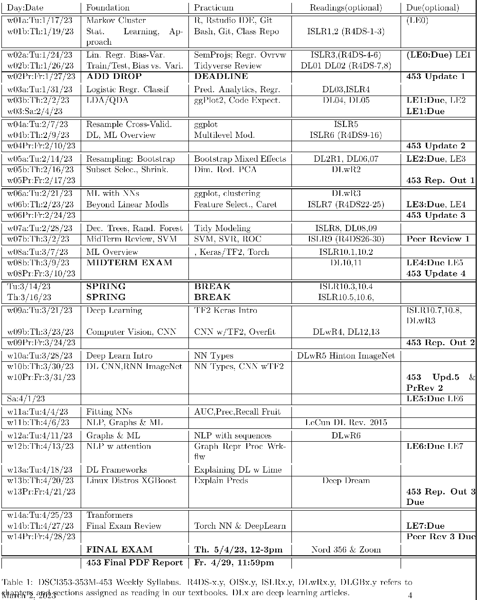

```{r setup, include = FALSE}
knitr::opts_chunk$set(
  cache = FALSE, # if TRUE knitr will cache results to reuse in future knits
  fig.width = 4, # the width for plots created by code chunk
  fig.height = 3, # the height for plots created by code chunk
  fig.align = 'center', # how to align graphics. 'left', 'right', 'center'
  dpi = 300, 
  dev = 'png', # Makes each fig a png, and avoids plotting every data point
  # eval = FALSE, # if FALSE, then the R code chunks are not evaluated
  # results = 'asis', # knitr passes through results without reformatting
  echo = TRUE, # if FALSE knitr won't display code in chunk above it's results
  message = TRUE, # if FALSE knitr won't display messages generated by code
  strip.white = TRUE, # if FALSE knitr won't remove white spaces at beg or end of code chunk
  warning = FALSE, # if FALSE knitr won't display warning messages in the doc
  eval = TRUE, # if FALSE knitr doesn't run any code blocks
  error = TRUE) # report errors
```

 \setcounter{section}{8}
 \setcounter{subsection}{1}
 \setcounter{subsubsection}{2}
 
 #### Reading, Homeworks, Projects, SemProjects

  - Readings: 
    - For today: ISLR6 (R4DS9-16)
    - For Tuesday: DL2Rch1, DL06,07
    - Now:  Deep Learning with R (2nd Ed.) and ISLR2
  - Laboratory Exercises: 
    - LE2 is Due next Tuesday Feb. 14th
  - Office Hours: (Class Canvas Calendar for Zoom Link)
    - Wednesdays @ 4:00 PM to 5:00 PM  
    - Saturdays @ 3:00 PM to 4:00 PM
    - **Office Hours are on Zoom, and recorded**
  - Semester Projects
    - Office Hours for SemProjs: Mondays at 4pm on Zoom
    - DSCI 453 Students Biweekly Updates Due 
      - Update # is Due **  **
    - DSCI 453 Students 
      - Next Report Out # is Due ** **
    - All DSCI 353/353M/453, E1453/2453 Students: 
      - Peer Grading of Report Out #1 is Due **  **
    - Exams
      - MidTerm: **Thursday March 9th**, in class or remote, 11:30 - 12:45 PM
        - **CWRU Spring Break is March 13th to March 17, so NO CLASS**
      - Final: **Thursday May 4th**, 2023, 12:00PM - 3:00PM, Nord 356 or remote


#### Textbooks

##### Introduction to R and Data Science

For students new to R, Coding, Inferential Statistics

  - Peng: R Programming for Data Science
  - Peng: Exploratory Data Analysis with R
  - OIS = Diez, Barr, Çetinkaya-Runde: Open Intro Stat v4
  
##### Textbooks for this class

  - R4DS = Wickham, Grolemund: R for Data Science
  - ISLR = James, Witten, Hastie, Tibshirani: Intro to Statistical Learning with R
  - ESL = Trevor Hastie, Tibshirani, Friedman: Elements of Statistical Learning
  - DLwR = Chollet, Allaire: Deep Learning with R

DL1 to DL6 are "Deep Learning" articles in 3-readings/2-articles/

#### Tidyverse Cheatsheets, Functions and Reading Your Code

Look at the Tidyverse Cheatsheet

  - **Tidyverse For Beginers Cheatsheet**
    - In the Git/20s-dsci353-353m-453-prof/3-readings/3-CheatSheets/ folder
  - **Data Wrangling with dplyr and tidyr Cheatsheet**
]
  
Tidyverse Functions & Conventions

  - The pipe operator `%>%`
  - Use `dplyr::filter()` to subset data row-wise.
  - Use `dplyr::arrange()`  to sort the observations in a data frame
  - Use `dplyr::mutate()` to update or create new columns of a data frame
  - Use `dplyr::summarize()` to turn many observations into a single data point
  - Use `dplyr::arrange()` to change the ordering of the rows of a data frame 
  - These can be combined using `dplyr::group_by()` 
    - which lets you perform operations “by group”. 
  - The `%in%` matches conditions provided by a vector using the c() function

Reading Your Code: Whenever you see

  - The assignment operator `<-`, think **"gets"**
  - The pipe operator, `%>%`, think **"then"**
  

#### Syllabus




 
#### Some important Data Science Concepts

Category      | Either        | Or
------------- | ------------- | ------------- 
Learning      | Supervised    | Unsupervised
Supervised Learning  | Regression    | Classification
Unsupervised Learning | Dim. Reduction | Clustering
Algorithms    | Shallow       | Deep
`n`             | observations
`p`             | Predictors    | Features
`k`             | classes       | groups
------------- | ------------- | ------------- 


#### Machine Learning Overview

##### The data science/machine learning process

  - **1. Predict / Infer**
    - The value of the response 
      - for an observation in your dataframe
    - Using the predictors/features in your dataframe
  - **2. Evaluate the Error / Loss**
    - Evaluate the error or loss function next
      - How good was your prediction based on these features
    - To evaluate how good your data-driven model is
  - **3. Use Gradient Descent to adjust your model coefficients** 
    - From you error, decide how to adjust your $\beta$ coefficients
    - To reduce the error or minimize your loss function
  - **4. Cycle back to step 1**
  
##### Shallow vs. Deep Algorithms and Learning

- Just like there is both 

  - Statistical Learning from statisticians
  - And Machine Learning from the computer scientists
  
We can organize our Statistical and Machine Learning Algorithms & Tools Into

  - Shallow Algorithms
    - Linear Regression
    - Logistic Regressions-Classification
    - GAM, Spline models
    - Support Vector Machines
    - Decision Trees
    
  Deep Algorithms
  
  - Mostly Neural Networks
  - Using a deep learning framework
    - We'll use [Google's Tensorflow](https://www.tensorflow.org/)
      - [Tensorflow Wikipedia page](https://en.wikipedia.org/wiki/TensorFlow)
      - [Accessible from R](https://tensorflow.rstudio.com/)
    - [Keras is a higher level interface](https://en.wikipedia.org/wiki/Keras) 
      -  That is now integrated into Tensorflow2 
    - We can also use [PyTorch or its Torch Library](https://en.wikipedia.org/wiki/PyTorch)
      - Torch has a simpler interface
      - And is faster for initial development
      - But is not as robust for production-worthy data science
    
##### These all use

  - `n` Observations (Rows)
  - `p` Predictors or Features
  - `r` Responses  (Univariate or Multivariate models)
  
A big difference is how we choose or develop "features" or "predictors"

  - Simple regression or classification
    - Use the predictors/features that are you input variables
  - As problems get larger
    - May need to do Variable/Model Selection (Forward or Reverse)
    - Or dimension reduction to combine features into "new" features
    - Like with PCA, or Factor Analysis

Dimension Reduction, or Interaction Terms

  - Can be thought of as Feature Engineering
  - Done manually or by algorithm
  - To improve results
  
Shallow learning requires manual feature engineering

For Deep Learning, the Neural Network (NN)

  - Perform the 3 steps (Predict, Error, Gradient Descent)
    - Just like we would in shallow learning
  - But it does its own feature engineering
    - Removing one of the hardest aspects of good NN modeling
    - From requiring human insights
    
##### Python has [SciKit Learn Package](https://scikit-learn.org/stable/)

- Python is the other scripting language used in Data Science

  - [Python programming language](https://en.wikipedia.org/wiki/Python_(programming_language))
  - Its a similar high-level, scripting language
  - And also a general purpose programming language
 
"Scikits" are Python packages for different uses: ML, Images, etc

[Scikit-learn Wikipedia page](https://en.wikipedia.org/wiki/Scikit-learn)


This has a nice decision tree for Data Science Algorithms

  - [And its interactive on the web](https://scikit-learn.org/stable/tutorial/machine_learning_map/)


We also use [Scikit-image](https://en.wikipedia.org/wiki/Scikit-image)

  - Which is more modern and reliable
    - Than the functions in [OpenCV](https://en.wikipedia.org/wiki/OpenCV)
    - Which is the "Open Source Computer Vision Library"


OpenCV has had some legal problems

  - Because its "Open Source" code
  - But includes various Patented algorithms, SURF and SIFT
    - So if you accidentally use them
    - You could be held liable for damages
  - [More information here](https://opencv.org/opencv-is-to-change-the-license-to-apache-2/)
    - But this solution doesn't give the user any protection
    - From patent claims

##### There are different shallow and deep machine learning techniques

  - The most relevant branches of techniques: 
    - supervised and unsupervised learning
  - Making predictions with supervised learning
  - Identifying hidden patterns and structures with unsupervised learning
  - Pros and cons of these techniques


The supervised and unsupervised learning techniques 

  - deal with objects described by features
  - think of "features" as anything you could use as a predictor.
  
An example of 

  - supervised learning techniques is decision tree learning
  - unsupervised technique is k-means. 

In both cases, the algorithms learn from a set of objects 

  - and the difference is their target: 
    - supervised techniques predict attributes whose nature is already known and 
    - unsupervised techniques identify new patterns.

The supervised learning techniques predict an attribute of the objects. 

  - The algorithms learn from a training set of objects 
  - whose attribute is known and they predict the attribute of other objects. 
  
There are two categories of supervised learning techniques:

  - classification and regression. 
  
We talk about classification

  - if the predicted attribute is categorical 
  - and about regression if the attribute is numeric.

The unsupervised learning techniques 

  - identify patterns and structures of a set of objects. 
  
The two main branches of unsupervised learning are 

  - clustering and dimensionality reduction. 
  
The clustering techniques identify homogeneous groups of objects 

  - on the basis of their attributes 
  - an example is k-means. 
  
Dimensionality reduction techniques 

  - identify a small set of significant features 
  - describing the objects 
  - an example is the principal component analysis. 
  
The difference between clustering and dimensionality reduction 

  - depends on the identified attribute 
  - that is categorical or numeric respectively


#### Supervised learning

- Supervised learning algorithms are very useful

  - they make predictions about future attributes and outcomes
  - It is possible to measure the accuracy of each technique and/or parameter 
  - in order to choose the most suitable one and set it up in the best way.
  
There are two categories of techniques: classification and regression

##### The k-nearest neighbors (KNN) algorithm

- Dont confuse k-nearest neighbors, 

  - with k-means a different algorithm and modeling approach
    - That we'll also discuss below

KNN is a supervised learning algorithm 

  - that performs classification or regression.

Given a new object, the algorithm predicts its attribute 

  - starting from its k neighbors that are its most similar objects. 
  
KNN is a lazy learning algorithm in the sense that 

  - it directly queries the training data to make a prediction.

In the case of a categorical attribute, 

  - the algorithm estimates it as the most common among the similar objects. 

In the case of a numeric attribute, 

  - it computes the median or average between them. 
  
In order to state which are the k most similar objects, 

  - KNN uses a similarity function that evaluates how similar two objects are. 
  - In order to measure similarity, 
    - the starting point is often a distance matrix 
    - expressing the dissimilarity. 
  - Then, the algorithm computes the similarity 
    - between the new object and each other 
    - and picks the k most similar objects.

In an example, we will use the flag dataset 

  - and the features are the number of stripes 
  - and the number of colors in the flags. 

The attribute that we want to predict 

  - starting from its flag attributes 
  - is the language of a new country.
  
The training set is composed of some countries in such a way that 

  - there are no two countries with the same flag features. 
  
The features contained in the dataset display some information about:

  - The colors in the flag
  - The patterns in the flag
  - Some additional elements in the flag, 
    - such as text or some stars
  - Some geographical data, 
    - such as continent, geographic quadrant, area, and population
  - The language and religion of the country


First, let's visualize the data. 

  - We can show the countries in a chart 
    - whose dimensions are the two features 
    - and whose color is the language, 
  - as follows:


We have two new countries with:

  - 7 stripes and 4 colors
  - 3 stripes and 7 colors

We want to determine the language of two new countries 

  - using a 4-nearest-neighbor algorithm. 

We can add the two countries to the chart 

  - and determine the 4 closest points for each of them, 
  - as shown here:


With regard to the country on the right-hand side of the chart, 

  - all its 4 closest neighbors belong to Others, 
  - so we estimate that its language is Others. 
  
The other country has a mixed neighborhood: 

  - 1 English, 1 Other Ind-European, and 2 Spanish countries. 
  
The most common language is Spanish, 

  - so we estimate that it is a Spanish-speaking country.

The KNN is a simple and salable algorithm 

  - that achieves good results in many contexts. 

However, in the presence of many features, 

  - the similarity function takes account of all of them, 
    - including the less relevant, 
  - making it difficult to use the distance. 
  
In that context, the KNN is 

  - not able to identify the meaningful nearest neighbors and 
  - this issue is called the curse of dimensionality. 
  
A solution is to reduce the dimensionality 

  - by selecting the most relevant features 
  - or using a dimensionality reduction technique

##### Decision tree learning

- Decision tree learning is a supervised learning algorithm

  - that builds a classification 
  - or regression tree. 

Each leaf of the tree 

  - represents the attribute estimation 
  - and each node splits the data 
    - accordingly with a condition of the features.

The decision tree learning is an eager method 

  - in the sense that it uses a training set to build a model 
  - that doesn't require you to query the data. 

All the other supervised learning techniques are eager as well.

The target of the algorithm is to 

  - define the most relevant feature and 
    - split the set in two groups accordingly with it. 
  - Then, for each group, the algorithm 
    - identifies its most relevant feature and 
    - divides the objects of the groups into two parts. 
  
This procedure goes on until we identify the leaves as small groups of objects. 

For each leaf, the algorithm estimates the feature 

  - as a mode, if it is categorical, 
  - or average, if it is numeric. 
  
After building the tree, if we have too many leaves, 

  -  we can define a level in which we stop splitting the tree. 
  
In this way, each leaf will contain a reasonably big group. 

This procedure of stopping splitting is called pruning. 

In this way, we find a less complex and more accurate prediction.

In our example, we want to determine the language of a new country 

  - starting from different flag attributes, 
  - such as colors and patterns. 
  
The algorithm builds the tree learning from a training set. 

Let's visualize it:


In any node, 

  - if the answer is TRUE, we go to the left, and 
  - if the answer is FALSE, we go to the right. 
  
First, the model identifies the most relevant attribute that is saltires. 

  - (a saltire is a flag of Scotland https://en.wikipedia.org/wiki/Flag_of_Scotland)
  

  
If a flag contains a saltire, 

  - We go to the left 
    - and we determine that the related country is English. 
  Otherwise, we go to the right 
    - and we check if the flag contains the blue color. 
  - Then, we go on checking the conditions until we reach a leaf.

Let's suppose that we built the tree without taking account of the Spanish flag.

  - How do we estimate the language of Spain? 
  - Starting from the top, we check the conditions on each node we encounter.

These are the steps:

  - 1. The flag doesn't contain a saltire, 
    - so we go to the left.
  - 2. The flag contains the blue color, 
    - so we go to the right.
  - 3. The flag doesn't contain a cross, 
    - so crosses = no is true 
    - and we go to the left.
  - 4. The flag doesn't contain an animated image, 
    - so we go to the right.
  - 5. The flag has two main colors, 
    - so number of colors not equal to 4 or 5 is true 
    - and we go to the left.
  - 6. The flag doesn't contain any bars, 
    - so we go to the left.

The flag doesn't have any vertical stripes, 

  - so nStrp0 = no is true and 
  - we go to the left, as shown here:
  


In the end, the estimated language is Spanish.


The decision tree learning 

  - can deal with numeric and/or categorical features and attributes, 
  - so it can be applied in different contexts with just a little data preparation.

In addition, it is applicable 

  - when there are many features, 
  - which is different from other algorithms. 

A disadvantage is that the algorithm can overt 

  - in the sense that the model is too close to the data 
  - and is more complicated than the reality, although pruning can help with this.

CLASS STOPPED HERE

##### Linear regression

- Linear regression is a statistical model 

  - identifying a relationship between numeric variables. 

Given a set of objects 

  - described by the y attribute and the x1, …, 
    - and xn features, 
  - the model defines a relationship 
    - between the features and the attribute. 

The relationship is described by 

  - the linear function $y = a_0 + a_1 * x_1 + … + a_n * x_n$, 
  - and $a_0, …$, and $a_n$ are parameters 
    - defined by the method in such a way 
    - that the relationship is as close as possible to the data.

In the case of machine learning, 

  - linear regression can be used to predict a numeric attribute. 

The algorithm learns from the training dataset to determine the parameters. 

Then, given a new object, 

  - the model inserts its features 
  - into the linear function to estimate the attribute.

In our example, we want to 

  - estimate the population of a country starting from its area. 

First, let's visualize the data 

  - about the area (in thousand $km^2$) 
  - and the population (in millions), 
  - as shown in the following figure:

 

Most of the countries have 

  - an area below 3000 thousand km2 
    - and a population below 200 million 
  - and just a few countries have a much higher area and/or population. 
  
For this reason, 

  - most of the points are concentrated in the bottom-left area of the chart. 

In order to spread the points, 

  - we can transform the features 
    - using the logarithmic area and population, 
  - as shown in the following figure:

 

The target of linear regression is to identify a linear relationship 

  - that is as close to the data as possible. 
  
In our case, we have two dimensions, 

  - so we can visualize the relationship using a line. 

Given the area, 

  - the linear regression estimates 
    - that the population is on the line. 

Let's see it in the chart with the logarithmic features:


Given a new country about which we know the area, 

  - we can estimate its population using the regression line. 
  
In the chart, there is a new country of which we know the area. 

The linear regression estimates that its point is on the red line.

Linear regression is a very simple and basic technique. 

  - The disadvantage is that it requires numeric features and attributes, 
  - so there are many contexts in which it is not applicable. 
  
However, it is possible to convert the categorical features 

  - into a numeric format using dummy variables or other techniques.

Another disadvantage is that 

  - the model makes strong assumptions 
  - on how the features and the attributes are related. 

The function estimating the output is linear,

  - so in some contexts it might be far from the real relationship. 
  
In addition, if in reality the features interact with each other, 

  - the model is not able to keep track of the interaction. 
  
It's possible to solve this problem 

  - using a variable transformation that makes the relationship linear. 
  
It is also possible to define new features expressing non-linear interactions.

The linear regression is very basic 

  - and it is the starting point of some other techniques. 

For instance, the logistic regression 

  - predicts an attribute 
    - whose value is in the 0 to 1 range.

##### The Perceptron (Neural Networks)

- Artificial Neural Networks (ANN) 

  - are the supervised learning techniques 
  - whose logic is similar to biological neural systems. 

A simple ANN technique is the single-layer perceptron 

  - and it is a classification technique 
  - estimating a binary attribute whose value can be 0 or 1. 
  
The perceptron works like a neuron 

  - in the sense that it sums the impact 
  - of all the inputs and outputs to 1
  - if the sum is above a defined threshold. 

The model is based on the following parameters:

  - A weight for each feature, defining its impact
  - A threshold above which the estimated output is 1

Starting from the features, the model estimates the attribute through these steps

  - Compute the output through a linear regression: 
    - multiply each feature by its weight and sum all of them
  - Estimate the attribute 
    - to 1 if the output is above the threshold 
    - and to 0 otherwise

The models are as shown in the following figure:


In the beginning, the algorithm 

  - builds the perceptron with 
  - a defined set of coefficients 
  - and with a threshold. 
  
Then, the algorithm iteratively improves the coefficients using the training set. 

At each step, the algorithm estimates the attribute of each object. 

Then, the algorithm computes the difference 

  - between the real and the estimated attribute 
  - and uses the difference to modify the coefficients. 
  
In many situations, the algorithm 

  - does not reach a stable set of coefficients that are not modified, 
  - so we need to define at which point we stop.
  
In the end, we have a perception defined 

  - by a set of coefficients and 
  - we can use it to estimate the attribute of new objects.


The perceptron is a simple example of a neural network 

  - and it allows us to easily understand the impact of the variables. 

However, the perceptron depends on a linear regression, 

  - so it is limited in the same way: 
    - the feature impact is linear 
    - and the features can't interact with each other.

##### Ensembles

- Each algorithm has some weaknesses leading to incorrect results. 

What if we were able to solve the same problem 

  - using different algorithms and 
  - to pick the best result? 
  
If just a few algorithms commit the same mistake, 

  - we can just ignore them.

It is not possible to determine 

  - which result is correct and which is not, 
  - but there is another option.
  
By performing supervised learning on a new object, 

  - we can apply different algorithms 
  - and pick the most common or average result among them. 

In this way, if most of the algorithms 

  - identify the correct estimation, 
  - we will take it into account. 

The ensemble methods are based on this principle: 

  - they combine different classification or regression algorithms 
  - to increase their accuracy.

An ensemble method 

  - requires variability between the results 
  - coming from different algorithms 
    - and/or training datasets. 

Some options are:

  - Changing the algorithm configuration: 
    - The algorithm is the same and its parameters vary within a range.
  - Changing the algorithm: 
    - We predict the attribute using different techniques. 
    - In addition, for each technique, we can use different configurations.
  - Using different data subsets: 
    - The algorithm is the same 
    - and every time it learns from a different random subset of the training data.
  - Using different data samples (bagging): 
    - The algorithm is the same and it learns from a bootstrap sample, 
    - that is, a set of objects picked randomly from the training dataset. 
    - The same object can be picked more than once.
  
  
The final result combines the output of all the algorithms. 

  - In the case of classification, we use the mode, and 
  - in the case of regression, we use the average or median.

We can build an ensemble algorithm 

  - using any combination of supervised learning techniques, 
  - so there are several options. 

An example is a random forest that 

  - combines decision tree learning algorithms 
  - using bagging (the technique explained in the last bullet point in the previous list).

The ensemble methods often perform much better than the single algorithms. 

  - In the case of classification, 
    - the ensemble removes the biases affecting just a small part of the algorithms. 
  - However, the logic of different algorithms is often related and 
    - the same bias might be common. 
    - In this case, the ensemble keeps the bias.

The ensemble methods don't always work in the case of regression problems 

  - since the biases affect the final result. 
  
For instance, if there is just an algorithm computing a very biased result, 

  - the average will be highly affected by that. 

In this context, 

  - the median works better 
    - since it is much more stable 
    - and it is not affected by outliers.

#### Unsupervised learning

- Unsupervised learning techniques 

  - allow us to identify hidden structures and patterns 
  - and perform exploratory data analysis. 

In addition, unsupervised learning can simplify the problem, 

  - allowing us to build more accurate and less elaborated solutions. 

These techniques can also be used in the solution of the problem itself.

The two branches of techniques are 

  - clustering and 
  - dimensionality reduction 
  - and most of them are not applicable in both the contexts. 
  
##### k-means

- k-means is a centroid-based clustering technique. 

Given a set of objects, 

  - the algorithm identifies k homogeneous clusters. 
  
k-means is centroid-based 
  
  - in the sense that each cluster is defined by 
  - its centroid representing its average object.

The target of the algorithm is to identify k centroids. 

  - Then, the k-means associates each object to the closest centroid, 
  - defining k clusters. 

The algorithm starts with a random set of centroids 

  - and it iteratively changes them, 
  - improving the clustering.

In our example, the data is about the country flags 

  - and the two features are 
    - the number of stripes 
    - and the number of colors. 

We select a subset of the countries in such a way 

  - that there are no two flags 
    - with the same value of the attributes.

Our target is to identify two homogeneous groups of countries. 

  - The first step of the k-means is identifying two random centroids. 
  - Let's visualize the data and the centroids in a chart:


The $o$ represents the country flags 

  - and the $x$ represents the centroids. 

Before running k-means, 

  - we need to define a distance 
    - that is a way of determining dissimilarity between objects. 

For instance, in the preceding chart, 

  - we can use the Euclidean distance 
    - that expresses the length of the line connecting two points. 

The algorithm is iterative and each step consists of the following steps:

  - 1. For each point, determine the centroid whose distance is the minimum. 
    - Then, assign the point to the cluster related to the closest centroid.
  - 2. Recompute the centroid of each cluster in such a way 
    - that it is the average between its objects.
  
In the end, we have two clusters 

  - with the related centroids representing average objects. 
  
Let's visualize them, as shown here:


The colors represent the clusters and the black x represents the final centroids.

k-means is one of the most popular clustering techniques 

  - because it is easy to understand and 
  - it doesn't require a lot of computational power. 
  
However, the algorithm has some limitations. 

  - It contains a random component, 
  - so if we run it twice on the same set of data 
    - it will probably identify different clusters. 

Another disadvantage is that 

  - it is not able to identify the clusters in some specific contexts,
  - for instance, when the clusters have different sizes or elaborated shapes. 
  
k-means is a very simple and basic algorithm 

  - and it is the starting point to some more elaborate techniques.

##### Hierarchical clustering

- Hierarchical clustering is a branch of clustering techniques. 

  - Starting from a set of objects, 
  - the target builds a hierarchy of clusters. 

In agglomerative hierarchical clustering, 

  - each object belongs to a different cluster in the beginning. 
  - Then, the algorithm merges the clusters 
    - until there is one cluster containing all the objects.

After having identified the hierarchy, 

  - we can define the clusters 
  - and stop their merging at any point.

During each agglomeration step, 

  - the algorithm merges the two most similar clusters 
  - and there are some parameters defining the similarity. 
  
First, we need to define a way to measure how similar two objects are. 

There are several options, depending on the situation. 

Then, we need to define the similarity between clusters; the methods are called linkage. 

In order to measure the similarity, we start defining a distance function that is the opposite. 

To determine the distance between cluster1 and cluster2, 

  - we measure the distance between every possible object of cluster1 and 
  - every object of cluster2. 
  
Some options to measure the distance between the two clusters are:

  - Single linkage: This is the minimum distance
  - Complete linkage: This is the maximum distance
  - Average linkage: This is the average distance

Depending on the linkage, the results of the algorithms will be different.

The example uses the same data as k-means. 
  
The country flags 

  - are represented by the number of stripes and colors 
    - and we want to identify homogeneous groups. 
  - The distance that we use is the Euclidean 
    - (just the distance between two points) and 
  - the linkage is complete. 
  
First, let's identify the clusters from their hierarchy, as shown in the following figure:


The chart is called a dendrogram 

  - and at the bottom of the chart 
  - every object belongs to a different cluster. 

Then, going up, 

  - we merge the clusters 
  - until all the objects belong to the same cluster. 

The height is the distance at which 

  - the algorithm merges the clusters. 

For instance, at a height of 3, 

  - all the clusters whose distance is below 3 are already merged.

The red line is at a height of 6 

  - and it defines when we stop merging 
  - and below it the objects are divided in 4 clusters. 

Now we can visualize the clusters in a chart as follows:


The colors of the points represent the clusters. 

The algorithm has correctly identified 
  
  - the group on the right 
  - and has split the group on the left in three parts in a good way.

There are different options for the hierarchical cluster 

  - and some of them produce very good results in some contexts. 
  
Different from the k-means, 
  
  - the algorithm is deterministic, 
    - so it always leads to the same result.

A big disadvantage of hierarchical clustering 

  - is the computational time (O(n3)) 
  - that makes it impossible to apply it on large datasets. 
  
Another lack is the manual component 

  - to choose the algorithm configuration 
  - and the dendrogram cut. 
  
In order to identify a good solution, 

  - we usually need to run the algorithm with different configurations 
  - and to visualize the dendrogram to define its cut.

##### PCA

- Principal Components Analysis (PCA) is a statistical procedure 

  - transforming the features. 
  
The PCA logic is based on 

  - the concepts of linear correlation and variance.

In a machine learning context, 

  - PCA is a dimensionality reduction technique.

Starting with the features describing a set of objects, 

  - the target defines other variables
  - that are linearly uncorrelated with each other. 
  
The output is a new set of variables 

  - defined as linear combinations of the initial features. 
  - In addition, the new variables are ranked on the basis of their relevance. 
  - The number of the new variables is 
    - less than or equal to the initial number of features 
    - and it is possible to select the most relevant features. 
  - Then, we are able to define a smaller set of features, 
    - reducing the problem's dimension.

The algorithm starts 

  - defining the feature combination with the highest variance.

Then, at each step, 

  - it iteratively defines another feature combination 
    - maximizing the variance, 
  - under the condition that the new combination 
    - is not linearly correlated with the others.
    - i.e. its orthonormal
    
In the presence of a lot of features, 

  - PCA allows us to define a smaller set of relevant variables. 
  
However, this technique is not applicable in all the contexts. 

A lack is that the result 

  - depends on how the features are scaled, 
  - so it is necessary to standardize the variables first.

Dealing with a supervised learning problem, 

  - we can use the PCA to reduce its dimensionality. 
  - However, the PCA only takes into account the features, 
    - ignoring how they are related with the attribute to predict, 
  - so it might select feature combinations that are 
    - not very relevant to the problem.

#### Summary

- We learned about the main branches of machine learning techniques:

  - supervised and unsupervised learning. 
  
We saw how to estimate a numeric or categorical attribute 

  - using supervised learning techniques 
  - such as KNN, decision tree, linear regression, and neural networks. 
    
We saw that it is possible to increase performance 

  - using ensembles that are techniques 
  - combining different supervised learning algorithms. 

We learned how to identify homogeneous groups 

  - using clustering techniques 
  - such as k-means and hierarchical clustering. 

We have also understood the importance of dimensionality reduction techniques 

  - such as the PCA
  - to transform the features defining a smaller set of variables.

#### Cites

  - R Machine Learning Essentials, by Michele Usuelli, Packt Publishing, 2014


 
