```{r setup, include = FALSE}
knitr::opts_chunk$set(
  cache = FALSE, # if TRUE knitr will cache results to reuse in future knits
  fig.width = 4.5, # the width for plots created by code chunk
  fig.height = 4, # the height for plots created by code chunk
  fig.align = 'left', # how to align graphics. 'left', 'right', 'center'
  dpi = 300, 
  dev = 'png', # Makes each fig a png, and avoids plotting every data point
  # options(tinytex.verbose = TRUE)
  # eval = FALSE, # if FALSE, then the R code chunks are not evaluated
  # results = 'asis', # knitr passes through results without reformatting
  echo = TRUE, # if FALSE knitr won't display code in chunk above it's results
  message = TRUE, # if FALSE knitr won't display messages generated by code
  strip.white = TRUE, # if FALSE knitr won't remove white spaces at beg or end of code chunk
  warning = TRUE, # if FALSE knitr won't display warning messages in the doc
  error = TRUE) # report errors
```

 \setcounter{section}{9}
 \setcounter{subsection}{2}
 \setcounter{subsubsection}{1}
 
##### Reading, Lab Exercises, SemProjects

  - Readings: 
    - For today:ISLR10.1 to 10.6
    - For next class: DLwR4, DL12,13
  - Laboratory Exercises: 
    - LE5: Given out today
    - LE5: Due Saturday April 1st
  - Office Hours: (Class Canvas Calendar for Zoom Link)
    - Wednesdays @ 4:00 PM to 5:00 PM  
    - Saturdays @ 3:00 PM to 4:00 PM
    - **Office Hours are on Zoom, and recorded**
  - Semester Projects
    - Office Hours for SemProjs: Mondays at 4pm on Zoom
    - DSCI 453 Students Biweekly Updates Due 
      - Update # is Due **  **
    - DSCI 453 Students 
      - Next Report Out #2 is Due **Friday March 24th**
    - All DSCI 353/353M/453, E1453/2453 Students: 
      - **Peer Grading of Report Out #2 is Due Friday March 31st**
    - Exams
      - Final: **Thursday May 4th**, 2023, 12:00PM - 3:00PM, Nord 356 or remote


##### Textbooks

- Text Books for DSCI353/353M/453

  - [R4DS: Wickham: R for Data Science](https://r4ds.had.co.nz/)
  - [ISLR: Intro to Statistical Learning with R, 2nd Ed.](https://www.statlearning.com/)
  - DLwR: Deep Learning with R, Chollet, Allaire, 
  - [DLGB: Deep Learning, Goodfellow, Bengio,  Courville](https://www.deeplearningbook.org/)

- Magazine Articles about Deep Learning

  - DL1 to DL13 are "Deep Learning" articles in 3-readings/2-articles/


- Books from DSCI351/351M/451

  - [Peng: R Programming for Data Science](https://leanpub.com/rprogramming)
  - [Peng: Exploratory Data Analysis with R](https://leanpub.com/exdata)
  - [Open Intro Stats, v4](https://openintro.org/os)
  - [R4DS: Wickham: R for Data Science](https://r4ds.had.co.nz/)


##### Tidyverse Cheatsheets, Functions and Reading Your Code

- Look at the Tidyverse Cheatsheet 

  - **Tidyverse For Beginners Cheatsheet**
    - In the Git/20s-dsci353-353m-453-prof/3-readings/3-CheatSheets/ folder
  - **Data Wrangling with dplyr and tidyr Cheatsheet**


##### Syllabus


##### MidTerm Exam (CWRU, UCF, UTRGV)

- Midterm results

  - A > 93
  - B > 86
  - C > 74

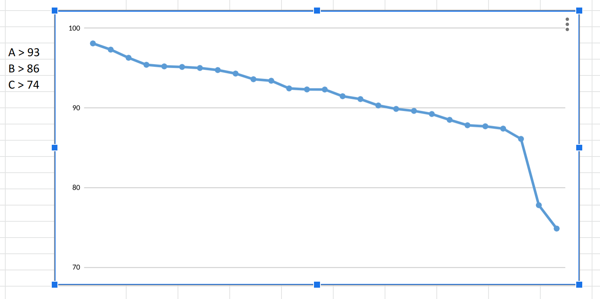

##### Also its useful to pick up a second Coding Language

- So Python complements R

  - In DL2R2nd, there is a nice Appendix
    - in 3-readings/1-textbooks/DLwR-SecondEd-PythonAppendix.pdf

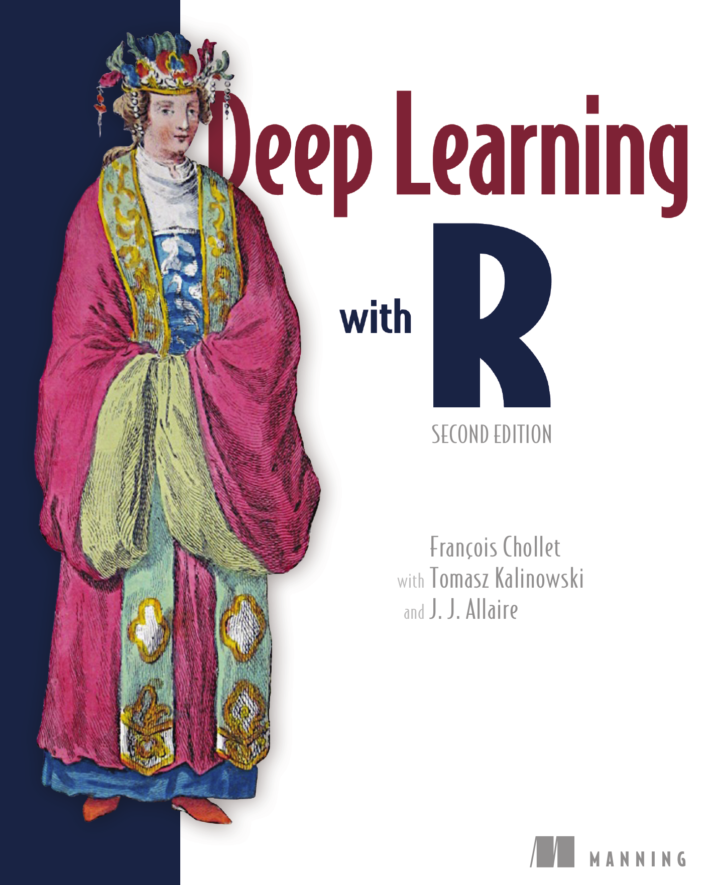

\FloatBarrier

#### Another take on Neural Networks and the Perceptron 

- Neural networks are a biologically inspired model, 

  - the origins of which date back to the 1940s. 

Interest in neural networks has fluctuated greatly over the years 

  - as the first models proved to be quite limited 
  - compared to the expectations at the time. 
  
Additionally, training a large neural network 

  - requires substantial computational resources. 

Recently, there has been a huge surge in interest in neural networks 

  - as distributed on-demand computing resources 
    - are now widespread 
  - and an important area of machine learning, 
    - known as deep learning, 
  - is already showing great promise. 
  
For this reason, it is a great time to be learning about this type of model.


##### The biological Neuron

- Neural network models draw their analogy 

  - from the organization of neurons in the human brain, 
  - and for this reason they are also often referred to 
    - as artificial neural networks (ANNs) 
    - to distinguish them from their biological counterparts. 

The key parallel is that a single biological neuron 

  - acts as a simple computational unit, 
  - but when a large number of these are combined together, 
    - the result is an extremely powerful 
    - and massively distributed processing machine capable of complex learning, 
    - known more commonly as the human brain.

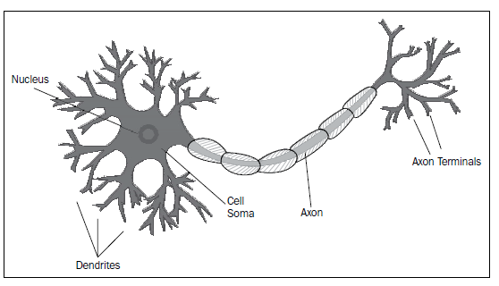

##### The Artificial Neuron

- Using our biological analogy, 

  - we can construct a model of a computational neuron, 
  - and this model is known as the McCulloch-Pitts model of a neuron:

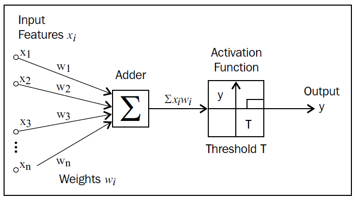

This computational neuron is the simplest example of a neural network. 

We can construct the output function, $y$, 

  - of our neural network directly 
  - from following our diagram:

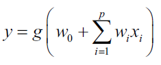

The function $g()$ in our neural network is the activation function. 

Here, the specific activation function that is chosen is the step function:

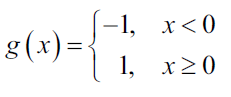

When the linear weighted sum of inputs 

  - exceeds zero, the step function outputs 1, 
  - and when it does not, the function outputs -1. 

It is customary to create a dummy input feature $x_0$ 

  - which is always taken to be 1, 
  - in order to merge the bias or threshold $w_0$ 
  - into the main sum as follows:

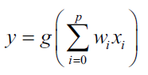

Using our experience with logistic regression, 

  - it should be very easy to conclude 
  - that we could construct a simple classifier 
  - using this setup for the binary classification problem. 
  
The only difference is that in logistic regression, 

  - we would choose the logistic function 
    - as the activation function. 
    
In fact, in 1957, Frank Rosenblatt proposed a supervised learning algorithm 

  - for training the McCulloch-Pitts model of neurons 
    - to perform binary classification, 
  - and this algorithm along with the learning model produced 
    - is known as the Rosenblatt perceptron.
    
Now that we have built up some experience with classification and regression, 

  - we will look at some of the details of how predictive models are trained. 
  
In addition, neural networks differ substantially 

  - from previous models we have seen so far, 
  - in that training a neural network 
    - is often more time consuming 
    - and involves adjusting a number of parameters, 
    - many of which arise from the optimization procedure itself. 
    
Thus, it helps to understand the role these parameters play 

  - during training and 
  - how they can affect the final model.

##### Stochastic gradient descent

- In the models we've seen so far, 

  - such as linear regression, 
  - we've talked about a criterion or objective function 
  - that the model must minimize while it is being trained. 

This criterion is also sometimes known as the cost function. 

For example, the least squares cost function for a model can be expressed as:

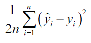

In linear regression, 
  
  - just as with our perceptron model, 
  - our model's predicted $\hat{y}_i$ 
  - is just the sum of a linear weighted combination of the input features. 

If we assume that our data is fixed and 

  - that the weights are variable 
    - and must be chosen so as to minimize our criterion, 
  - we can treat the cost function as being a function of the weights:

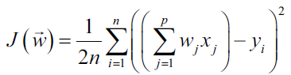
or 

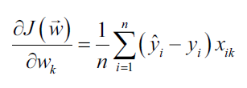


To find the optimal weights, 
  
  - we need to solve this eqn. 
  - for every weight in our weight vector. 

Note that through the predicted output term, 

  - all the weights in the model appear 
  - in the partial derivative of every individual weight. 
  
Put differently, this produces a complete system of linear equations 

  - that is often very large, 
  - so solving this directly 
    - is often prohibitively expensive, computationally speaking.

Instead, many model implementations use iterative optimization procedures 

  - that are designed to gradually approach the correct solution. 

One such method is gradient descent. 

For a particular value of the weight vector, 

  - gradient descent finds the direction 
    - in which the gradient of the cost function is steepest, 
  - and adjusts the weights in that direction by a small amount, 
    - which is determined by a parameter known as the learning rate. 
    
Thus, the update equation is:

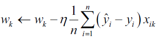

In the previous equation, the learning rate is denoted by the Greek letter $\eta$. 

Setting the learning rate to an appropriate value 

  - is a very important aspect of optimizing with gradient descent. 
  
If we choose a value that is too small, 

  - the algorithm will update the weights by a very small amount each time, 
  - and thus it will take too long to finish. 

If we use a value that is too large, 

  - we may cause the weights to change too drastically, 
    - oscillating between values, 
  - and so again the learning algorithm will either 
    - take too long to converge 
    - or oscillate continuously.

A variant of the gradient descent method 

  - is stochastic gradient descent, 
  - which does a similar computation 
    - but takes the observations one at a time instead of all together. 
    
The key idea is that, on average, 

  - the gradient of the cost function computed for a particular observation 
  - will equal that of the gradient computed across all observations. 
  
This is, of course, an approximation, 

  - but it does mean that we can process individual observations one at a time, 
  - which is very useful, especially if we want to perform online learning. 
  
Stochastic gradient descent updates a particular weight, $w_k$, 

  - when processing the $ith$ observation in the data set 
  - according to the following equation

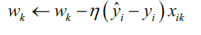


##### Gradient Descent and Local Minima

- Gradient descent methods 

  - rely on the idea that the cost function 
  - that is being minimized is a convex function.
  
https://en.wikipedia.org/wiki/Convex_function 

Let's look at an example of 

  0 a non-convex cost function in terms of a single weight $w$:

```{r}
####################################################
# Gradient Descent
####################################################

x <- seq(0, 20, by = 0.01)
y <- exp(-x / 10) * sin(x)
library(ggplot2)
p <- qplot(x, y)
p <- p + ggtitle("Example of a Non-Convex Function")
p <-
  p + theme(plot.title = element_text(
    lineheight = .8,
    face = "bold",
    vjust = 2
  ))
p <- p + xlab("Weight w")
p <- p + ylab("Cost Function J(w)")
p 
```

The global minimum of this function 

  - is the first trough on the left 
  - for a value of $w$, close to 4.5. 

If our initial guess for the weight w is 1, 

  - the gradient of the cost function points towards the global minimum, 
  - and we will progressively approach it until we reach it. 

If our initial guess of the weight is 12, 

  - then the gradient of the cost function will point downwards 
  - towards the trough near the value 10.5. 

Once we reach the second trough, 

  - the gradient of the cost function will be 0 and consequently, 
  - we will not be able to make any progress towards our global minimum 
    - because we have landed in a local minimum.

Detecting and avoiding local minima can be very tricky, 

  - especially if there are many of them. 

One way to do this is to repeat the optimization 

  - with different starting points 
  - and then pick the weights that produce the lowest value of the cost function 
    - across the different times the optimization is run. 

This procedure works well 

  - if the number of local minima is small 
  - and they are not too close together. 

Thankfully, the squared error cost function 

  - that we saw in the previous section is a convex function and 
  - so gradient descent methods are guaranteed to find the global minimum, 
  - but it is good to be aware that there are other examples of cost functions 
  - that we will encounter that are non-convex

#### The perceptron algorithm

- Without further ado, we'll present our first training algorithm 

  - for classification with neural networks. 
  
This is a variation of the perceptron learning algorithm and 

  - is known as the pocket perceptron algorithm.
  
Inputs:

  - $x$: 
    - A two-dimensional matrix, 
      - where the rows are the observations 
      - and the columns are the input features.
  - $y$: 
    - A vector with the class label (-1 or 1) 
      - for all the observations in x.
  - learning_rate: 
    - A number that controls the learning rate of the algorithm.
  - max_iterations: 
    - The maximum number of cycles 
      - through our data 
      - that our algorithm is allowed to perform while learning.
      
Outputs:

  - $w$: 
    - The learned weights of the perceptron.
    - converged: 
    - Whether the algorithm converged (true or false).iterations: 
    - The actual number of iterations through the data performed during learning.

Method:

  1. Randomly initialize the weights $w$.  
  2. Select an observation in $x$, and call it $x_i$.  
  3. Compute the predicted class, $\hat{y}_i$,  
    i) using the current values of the weights $w$  
    ii) and the equation for the output of the perceptron.  
  4. If the predicted class, $\hat{y}_i$,  
    i) is not the same as the actual class, $y_i$,  
    ii) then update the weights vector using stochastic gradient descent.  
  5. Repeat steps 2–4 for all the observations in our data set  
    i) and count the number of errors made.  
  6. If the number of errors is zero,  
    i) we have converged and the algorithm terminates.  
  7. If the number of errors made in the current iteration 
    i) was less than the lowest numbers of errors ever made,
    ii) store the weights vector as the best weights vector seen so far.
  8. If we have reached the maximum number of iterations,  
    i) stop and return the value of the best weights vector.
    ii) Otherwise, begin a new iteration over the data set at step 2.
  
```{r}
####################################################
# Perceptron
####################################################

# Algorithm
step_function <- function(x) {
  if (x < 0)
    -1
  else
    1
}
```

The first function we define is the step function, 

  - which we know will produce either the value -1 or the value 1 
  - corresponding to the two classes in our data set. 

We then define our main function, which we call pocket_perceptron(). 

The job of this function is to learn the weights for our perceptron 

  - so that our model classifies our training data correctly.

The main while loop of the function 

  - controls the number of iterations over which our algorithm will run. 

We will only begin a new iteration 

  - when we have not converged 
  - and when we have not hit our maximum number of iterations. 

Inside the while loop, 

  - we use a for loop to iterate over the observations in our data set 
  - and classify these using the current version of our weight vector.

Every time we make a mistake in classification, 

  - we update our error rate, 
    - note that we have not converged in this iteration, 
    - and update our weight vector 
    - according to the stochastic gradient descent update rule 
    - for least squares that we saw in the previous section. 

```{r}
pocket_perceptron <- function(x, y, learning_rate, max_iterations) {
  nObs <- nrow(x)
  nFeatures <- ncol(x)
  w <- rnorm(nFeatures + 1, 0, 2) # Random weight initialization
  current_iteration <- 0
  has_converged <- F
  best_weights <- w
  best_error <-
    nObs #Start by assuming you get all the examples wrong
  while ((has_converged == F) &
         (current_iteration < max_iterations)) {
    has_converged <-
      T # Assume we are done unless we misclassify an observation
    current_error <- 0 # Keep track of misclassified observations
    for (i in 1:nObs) {
      xi <- c(1, x[i, ]) # Append 1 for the dummy input feature x0
      yi <- y[i]
      y_predicted <- step_function(sum(w * xi))
      if (yi != y_predicted) {
        current_error <- current_error + 1
        has_converged <-
          F # We have at least one misclassified example
        w <- w + learning_rate * sign(yi - y_predicted) * xi
      }
    }
    if (current_error < best_error) {
      best_error <- current_error
      best_weights <- w
    }
    current_iteration <- current_iteration + 1
  }
  model <-
    list(
      "weights" = best_weights,
      "converged" = has_converged,
      "iterations" = current_iteration
    )
  model
}

```

Although the cost function for the perceptron 

  - is not differentiable 
    - because of the step function used to threshold the output, 
  - it turns out that we can, in fact, 
    - still use the same update rule for the weights.
    
At the end of a complete iteration through our data set, 

  - also known as an epoch, 
  - we check whether we need to 
    - update our best weights vector 
    - and update the number of iterations. 

We update our best weights vector 

  - only if the performance in the current iteration on the training data 
  - was the best performance we have seen thus far 
  - across all completed iterations. 

When the algorithm terminates, 

  - we return the best weights we found, 
    - whether or not we converged, 
  - and the total number of completed iterations.


##### Lets fit a pocket perceptron neural network model

- We can put our model to the test by generating some artificial data. 

  - We'll do this by sampling values from two uniform distributions 
    - in order to create two input features: x1 and x2. 
  - We'll then separate these data points into two different classes 
    - according to a linear decision boundary that we've chosen randomly:

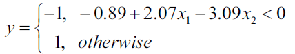


```{r}
# Dummy Data:
set.seed(4910341)
x1 <- runif(200, 0, 10)
set.seed(2125151)
x2 <- runif(200, 0, 10)
x <- cbind(x1, x2)
y <- sign(-0.89 + 2.07 * x[, 1] - 3.09 * x[, 2])
```


```{r}
# Fit the pocket perceptron model 
pmodel <- pocket_perceptron(x, y, 0.1, 1000)
summary(pmodel)
pmodel
```


```{r}
# Plot
a_pop <- -0.89 / 3.09
b_pop <- 2.07 / 3.09
a_model <- -pmodel$weights[1] / pmodel$weights[3]
b_model <- -pmodel$weights[2] / pmodel$weights[3]

p <-
  ggplot(data = NULL, aes(
    x = x1,
    y = x2,
    shape = ifelse(y > 0, "Class 1",
                   "Class -1")
  ))
p <- p + geom_point()
p <-
  p + ggtitle("Binary Classification with the Perceptron Algorithm")
p <-
  p + theme(
    plot.title = element_text(
      lineheight = .8,
      face = "bold",
      vjust = 2
    ),
    legend.position = "bottom"
  )
p <- p + xlab("x1")
p <- p + ylab("x2")
p <- p + scale_shape_manual(name = "Class Labels", values = c(1, 15))
p <- p + geom_abline(
  intercept = a_pop,
  slope = b_pop,
  aes(linetype = "Population Line"),
  size = 0.5,
  show_guide = T
)
p <- p + geom_abline(
  intercept = a_model,
  slope = b_model,
  aes(linetype = "Model Line"),
  size = 0.5,
  show_guide = T
)
p <- p + scale_linetype_manual(name = "Decision Boundaries",
                               values = c("dashed", "solid"))
p <-
  p + guides(shape = guide_legend(override.aes = list(linetype = 0)),
             linetype = guide_legend())
p
```

#### Cites

- [Gareth James, Daniela Witten, Trevor Hastie, Rob Tibshirani, 2021, Introduction to Statistical Learning with R, 2nd Edition](https://www.statlearning.com/)

- [The Elements of Statistical Learning - Data Mining, Inference, | Trevor Hastie | Springer, 2009.](http://statweb.stanford.edu/~tibs/ElemStatLearn/printings/ESLII_print10.pdf)

- [Forte, R.M., 2015. Mastering Predictive Analytics with R. Packt Publishing - ebooks Account, Birmingham Mumbai.](https://www.packtpub.com/application-development/mastering-predictive-analytics-r)

- [McCulloch, W.S., Pitts, W., 1943. A logical calculus of the ideas immanent in nervous activity. Bulletin of Mathematical Biophysics 5, 115–133. doi:10.1007/BF02478259](http://dx.doi.org/10.1007/BF02478259)

- [Rosenblatt, F., 1961. Principles of Neurodynamics. Perceptrons and the Theory of Brain Mechanisms](http://oai.dtic.mil/oai/oai?verb=getRecord&metadataPrefix=html&identifier=AD0256582)

- ["Accurate quantitative estimation of energy performance of residential buildings using statistical machine learning tools", Athanasios Tsanas and Angeliki Xifara, published in Energy and Buildings, Vol. 49, in 2012.](http://www.sciencedirect.com/science/article/pii/S037877881200151X)

- [UCI Machine Learning Repository](http://archive.ics.uci.edu/ml/datasets/Energy+efficiency)

