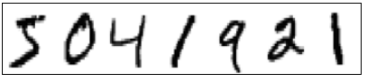
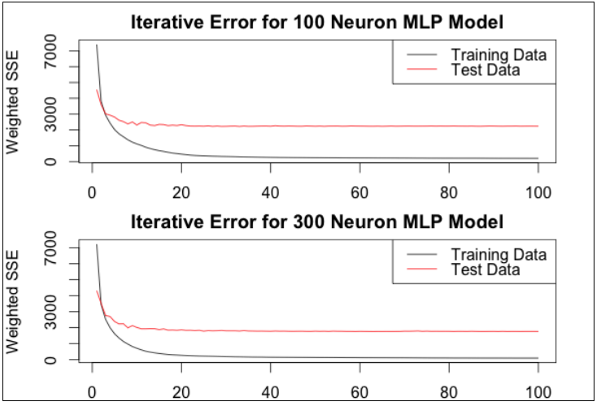
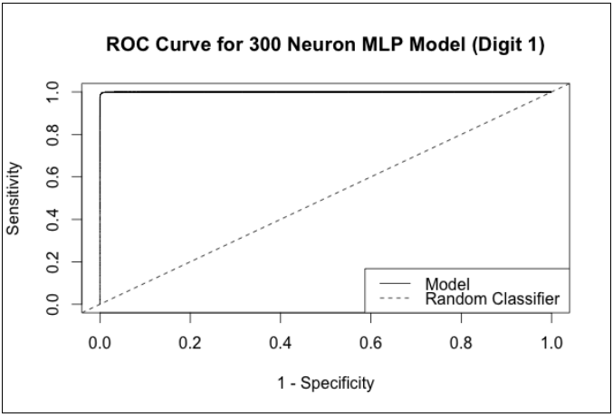

```{r setup, include = FALSE}
knitr::opts_chunk$set(
  cache = TRUE, # if TRUE knitr will cache results to reuse in future knits
  fig.width = 6, # the width for plots created by code chunk
  fig.height = 4, # the height for plots created by code chunk
  fig.align = 'center', # how to align graphics. 'left', 'right', 'center'
  dpi = 300, 
  dev = 'png', # Makes each fig a png, and avoids plotting every data point
  # options(tinytex.verbose = TRUE)
  # eval = FALSE, # if FALSE, then the R code chunks are not evaluated
  results = 'asis', # knitr passes through results without reformatting
  echo = TRUE, # if FALSE knitr won't display code in chunk above it's results
  message = TRUE, # if FALSE knitr won't display messages generated by code
  strip.white = TRUE, # if FALSE knitr won't remove white spaces at beg or end of code chunk
  warning = TRUE, # if FALSE knitr won't display warning messages in the doc
  error = TRUE) # report errors
```

 \setcounter{section}{9}
 \setcounter{subsection}{1}
 \setcounter{subsubsection}{3}

\FloatBarrier

#### Predicting handwritten digits

- An image recognition application for neural networks 

  - will be the handwritten digit prediction task. 
  
In this task, 

  - the goal is to build a model 
    - that will be presented with an image of a numerical digit (0–9) 
    - and the model must predict which digit is being shown. 
    
We will use the MNIST database of handwritten digits 

  - from http://yann.lecun.com/exdb/mnist/.

From this page, we have downloaded and unzipped 

  - the two training files train-images-idx3-ubyte.gz 
  - and train-images-idx3-ubyte.gz. 
  
The former contains the data from the images 

  - and the latter contains the corresponding digit labels. 
  
The advantage of using this website 
  
  - is that the data has already been preprocessed 
    - by centering each digit in the image 
    - and scaling the digits to a uniform size. 

##### Load the digit datasets and check them out

- To load the data, 

  - we've used information from the website 
  - about the IDX format to write two functions:


```{r}
read_idx_image_data <- function(image_file_path) { 
  con <- file(image_file_path, "rb")
  magic_number <- readBin(con, what = "integer", n = 1, size = 4, 
                          endian = "big")
  n_images <- readBin(con, what = "integer", n = 1, size = 4, endian = "big")
  n_rows <- readBin(con, what = "integer", n = 1, size = 4, endian = "big")
  n_cols <- readBin(con, what = "integer", n = 1, size = 4, endian = "big")
  n_pixels <- n_images * n_rows * n_cols
  pixels <- readBin(con, what = "integer", n = n_pixels, size = 1, signed = F)
  image_data <- matrix(pixels, nrow = n_images, ncol = n_rows * n_cols, 
                       byrow = T)
  close(con)
  return(image_data)
}
```

Notice: **endian = "big"**
What is ["Endianness"](https://en.wikipedia.org/wiki/Endianness)

  - endianness indicates the ordering of bytes within a multi-byte number
    - Big Endian big-endian ordering places the most significant byte first 
      - and the least significant byte last
    - Little Endian is the inverse
  - Details about how computers and languages represent data

```{r}
read_idx_label_data <- function(label_file_path) {
  con <- file(label_file_path, "rb")
  magic_number <- readBin(con, what = "integer", 
                          n = 1, size = 4, endian = "big")
  n_labels <- readBin(con, what = "integer", n = 1, size = 4, endian = "big")
label_data <- readBin(con, what = "integer", n  = n_labels, size = 1, 
                      signed = F)
  close(con)
  return(label_data)
}
```

We can then load our two data files by issuing the following two commands:

```{r}
mnist_train <- read_idx_image_data("./data/train-images-idx3-ubyte")
mnist_train_labels <- read_idx_label_data("./data/train-labels-idx1-ubyte")
```

Lets look at the training images dataframe

```{r}
str(mnist_train)
```

```{r}
str(mnist_train_labels)
```

Each image is represented by 

  - a 28-pixel by 28-pixel matrix of grayscale values 
    - in the range 0 to 255, 
    - where 0 is white and 255 is black. 
    
Thus, our observations each have 282 = 784 feature values. 

Each image is stored as a vector 

  - by rasterizing the matrix from right to left and top to bottom. 
  
There are 60,000 images in the training data, 

  - and our mnist_train object 
    - stores these as a matrix of 60,000 rows by 78 columns 
    - so that each row corresponds to a single image. 
    
To get an idea of what our data looks like, 

  - we can visualize the first seven images:



##### Lets use the RSSNS Package for the Stuttgart Neural Network Simulator 

- To analyze this data set, 

  - we will introduce our third and final R package 
  - for training neural network models, RSNNS. 
  
This package is actually an R wrapper 

  - around the Stuttgart Neural Network Simulator (SNNS), 
    - a popular software package containing standard implementations 
    - of neural networks in C created at the University of Stuttgart.

The package authors have added a convenient interface 

  - for the many functions in the original software. 
  
One of the benefits of using this package 

  - is that it provides several of its own functions for data processing, 
    - such as splitting the data into a training and test set. 
  - Another is that it implements many different types of neural networks, 
    - not just Multilayer Perceptrons (MLPs). 

We will begin by normalizing our data 

  - to the unit interval by dividing by 255 
  - and then indicating that our output 
    - is a factor with each level corresponding to a digit:


```{r}
mnist_input <- mnist_train / 255
mnist_output <- as.factor(mnist_train_labels)
```

Although the MNIST website already contains separate files with test data, 

  - we have chosen to split the training data file 
    - as the models already take quite a while to run.

The reader is encouraged to repeat the analysis that follows 

  - with the supplied test files as well. 

##### Lets Prepare the Training and Testing Datasets

- To prepare the data for splitting, 

  - we will randomly shuffle our images in the training data:

```{r}
set.seed(252)
mnist_index <- sample(1:nrow(mnist_input), nrow(mnist_input))
mnist_data <- mnist_input[mnist_index, 1:ncol(mnist_input)]
mnist_out_shuffled <- mnist_output[mnist_index]
```


Next, we must dummy-encode our output factor 

  - as this is not done automatically for us. 
  
The decodeClassLabels() function 

  - from the RSNNS package 
  - is a convenient way to do this. 

Additionally, we will split our shuffled data 

  - into an 80–20 training and test set split 
    - using splitForTrainingAndTest(). 
  - This will store the features and labels 
    - for the training and test sets separately, 
    - which will be useful for us shortly.

Finally, we can also normalize our data 

  - using the normTrainingAndTestSet() function. 

To specify unit interval normalization, 

  - we must set the type parameter to 0_1:


```{r}
library("RSNNS")
mnist_out <- decodeClassLabels(mnist_out_shuffled)
mnist_split <- splitForTrainingAndTest(mnist_data, mnist_out, ratio = 0.2)
mnist_norm <- normTrainingAndTestSet(mnist_split, type = "0_1")
```


##### Lets traing to MLP Networks, with 1 hidden layer with 100 or 300 nodes

- For comparison, we will train two MLP networks using the mlp() function. 

  - By default, this is configured 
    - for classification 
    - and uses the logistic function 
    - as the activation function for hidden layer neurons. 

The first model will have 

  - a single hidden layer with 100 neurons; 
  - the second model will use 300.

The first argument to the mlp() function 

  - is the matrix of input features 
  - and the second is the vector of labels. 

The size parameter 

  - plays the same role as the hidden parameter 
    - in the neuralnet package. 
  - That is to say, we can specify a single integer for a single hidden layer, 
    - or a vector of integers specifying 
    - the number of hidden neurons per layer 
    - when we want more than one hidden layer.

Next, we can use 

  - the inputsTest and targetsTest parameters 
    - to specify the features and labels of our test set beforehand, 
  - so that we can be ready to observe 
    - the performance on our test set in one call. 

The models we will train will take several hours to run. 

If we want to know how long each model took to run, 

  - we can save the current time using proc.time() 
    - before training a model 
  - and comparing it against the time when the model completes. 

Putting all this together, 

  - here is how we trained our two MLP models:


** BEWARE, THESE CAN TAKE A LONG TIME TO RUN ON CPU! Like overnight. **


```{r}
start_time <- proc.time()
 mnist_mlp <- mlp(mnist_norm$inputsTrain, mnist_norm$targetsTrain, size = 100, 
                 inputsTest = mnist_norm$inputsTest, 
                 targetsTest = mnist_norm$targetsTest)
proc.time() - start_time
```

```{r}
start_time <- proc.time()
mnist_mlp2 <- mlp(mnist_norm$inputsTrain, mnist_norm$targetsTrain, size = 300, 
                  inputsTest = mnist_norm$inputsTest, 
                  targetsTest = mnist_norm$targetsTest)
proc.time() - start_time
```

As we can see, the models take quite a long time to run (the values are in seconds).

For reference, these were trained on 

  - a 2.5 GHz Intel Core i7 PC with 16 cores and 64 GB of memory. 

The model predictions on our test set 

  - are saved in the fittedTestValues attribute 
  - (and for our training set, 
    - they are stored in the fitted.values attribute). 

##### Lets Check Test Set Accuracy of our 2 MLP Networks

- We will focus on test set accuracy. 

  - First, we must decode the dummy-encoded network outputs 
    - by selecting the binary column with the maximum value. 
  - We must also do this for the target outputs. 
  - Note that the first column corresponds to the digit 0.


```{r}
mnist_class_test <- (0:9)[apply(mnist_norm$targetsTest, 1, which.max)]
mlp_class_test <- (0:9)[apply(mnist_mlp$fittedTestValues, 1, which.max)]
mlp2_class_test <- (0:9)[apply(mnist_mlp2$fittedTestValues, 1, which.max)]
```

Now we can check the accuracy of our two models, as follows:


```{r}
mean(mnist_class_test == mlp_class_test)
```
```{r}
mean(mnist_class_test == mlp2_class_test)
```

The accuracy is very high for both models, 

  - with the second model slightly outperforming the first. 
  
##### Now Lets See The Confusion Matrix

- [Confusion Matrix](https://en.wikipedia.org/wiki/Confusion_matrix)

We can use the confusionMatrix() function 

  - to see the errors made in detail:

 
```{r}
confusionMatrix(mnist_class_test, mlp2_class_test)
```

As expected, we see quite a bit of symmetry in this confusion matrix 

  - because certain pairs of digits 
    - are often harder to distinguish than others. 
  - For example, the most common pair of digits that the model confuses 
    - is the pair (3,5). 
  - The test data available on the website 
    - contains some examples of digits 
    - that are harder to distinguish from others.

By default, the mlp() function 

  - allows for a maximum of 100 iterations, 
    - via its maxint parameter. 
  - Often, we don't know the number of iterations 
    - we should run for a particular model; 

A good way to determine the necesary number of interations 

  - is to plot the training and testing error rates 
      - versus iteration number. 
  - With the RSNNS package, 
    - we can do this with the plotIterativeError() function.

The following graphs show that for our two models, 

  - both errors plateau after 30 iterations:



#### Receiver operating characteristic (ROC) curves

- [Receiver Operating Characteristic curves](https://en.wikipedia.org/wiki/Receiver_operating_characteristic)

In logistic regression, 

  - the precision-recall graph 
    - is an example of an important graph 
  - showing the trade-off between two important performance metrics 
    - of a binary classifier
    - precision and recall. 

Here we present another related and commonly used graph 

  - to show binary classification performance, 
  - the receiver operating characteristic (ROC) curve.

This curve is a plot of 

  - the true positive rate on the y axis 
  - and the false positive rate on the x axis. 
  
- The true positive rate, as we know, 

  - is just the recall or, 
    - equivalently, the sensitivity of a binary classifier. 
  
The false positive rate is just 

  - 1 minus the specificity.
  
A random binary classifier 

  - will have a true positive rate 
    - equal to the false positive rate and thus, 
  - on the ROC curve, 
    - the line y = x is the line 
    - showing the performance of a random classifier. 

Any curve lying above this line 
  
  - will perform better than a random classifier.


A perfect classifier will exhibit an ROC curve 

  - from the origin to the point (0,1), 
    - which corresponds to a 100 percent true positive rate 
    - and a 0 percent false positive rate.
    
We often talk about the ROC Area Under the Curve (ROC AUC) 

  - as a performance metric. 
  
The area under the random classifier is just 0.5 

  - as we are computing the area under the line y = x on a unit square. 
  
By convention, the area under a perfect classifier 

  - is 1 as the curve passes through the point (0,1). 
  
In practice, we obtain values between these two. 

For our MNIST digit classifier, 
  
  - we have a multiclass problem, 
  - but we can use the plotROC() function 
    - of the RSNNS package to study 
    - the performance of our classifier on individual digits. 

The following plot shows the ROC curve for digit 1, 

  - which is almost perfect:



#### Neural Network Modeling Summary

- Neural networks are a nonlinear method 

  - capable of solving both regression and classification problems. 
  - Motivated by the biological analogy to human neurons, 
    - we first introduced the simplest neural network, 
    - the perceptron.
  - This is able to solve binary classification problems 
    - only when the two classes are linearly separable, 
    - something that we very rarely rely upon in practice.

By changing the function 

  - that transforms the linear weighted combination of inputs,
    - namely the activation function, 
  - we discovered how to create different types of individual neurons. 
  - A linear activation function creates a neuron 
    - that performs linear regression, 
  - whereas the logistic activation function creates a neuron 
    - that performs logistic regression. 
  - By organizing and connecting neurons into layers, 
    - we can create multilayer neural networks 
    - that are powerful models for solving nonlinear problems.

The idea behind having hidden layers of neurons 

  - is that each hidden layer learns a new set of features from its inputs. 
  - As the most common type of multilayer neural network, 
    - we introduced the multilayer perceptron 
    -  and saw that it can naturally 
    - learn multiple outputs with the same network. 
  - In addition, we experimented on real-world data sets 
    - for both regression and classification tasks, 
    - including a multiclass classification problem 
      - that we saw is also handled naturally. 
  - R has a number of packages for implementing neural networks, 
    - including neuralnet, nnet, and RSNNS, 
    - and we experimented with each of these in turn. 
  - Each has its respective advantages and disadvantages 
    - and there isn't a clear winner for every circumstance.

An important benefit of working with neural networks 

  - is that they can be very powerful in solving 
    - highly complex nonlinear problems 
    - of regression and classification alike 
    - without making any significant assumptions 
    - about the relationships between the input features. 
  - On the other hand, neural networks can often be quite tricky to train. 
  - Scaling input features is important. 
  - It is also important to be aware of the various parameters 
    - affecting the convergence of the model, 
    - such as the learning rate 
    - and the error gradient tolerance. 
  - Another crucial decision to make is 
    - the number and distribution of hidden layer neurons. 
  - As the complexity of the network, 
    - the number of input features, 
    - or the size of the training data increases, 
    - the training time often becomes quite long 
    - compared to other supervised learning methods.

We also saw in our regression example that 

  - because of the flexibility and power of neural networks, 
  - they can be prone to overfitting the data, 
    - thus overestimating the model's accuracy. 
  - Regularization approaches, 
    - such as weight decay, 
    - exist to mitigate this problem to a certain extent. 

Finally, one clear disadvantage 
  
  - that deserves mention is that the neural weights 
    - have no direct interpretation, 
  - unlike regression coefficients, 
  - and even though the neural network topology 
    - may learn features,
    - these are difficult to explain or interpret.


