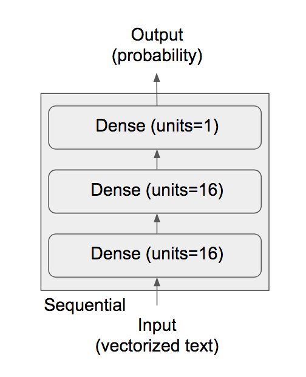

```{r setup, include = FALSE}
knitr::opts_chunk$set(
  cache = FALSE, # if TRUE knitr will cache results to reuse in future knits
  fig.width = 6, # the width for plots created by code chunk
  fig.height = 4, # the height for plots created by code chunk
  fig.align = 'center', # how to align graphics. 'left', 'right', 'center'
  dpi = 300, 
  dev = 'png', # Makes each fig a png, and avoids plotting every data point
  # options(tinytex.verbose = TRUE)
  # eval = FALSE, # if FALSE, then the R code chunks are not evaluated
  # results = 'asis', # knitr passes through results without reformatting
  echo = TRUE, # if FALSE knitr won't display code in chunk above it's results
  message = TRUE, # if FALSE knitr won't display messages generated by code
  strip.white = TRUE, # if FALSE knitr won't remove white spaces at beg or end of code chunk
  warning = TRUE, # if FALSE knitr won't display warning messages in the doc
  error = TRUE) # report errors
```

 \setcounter{section}{9}
 \setcounter{subsection}{2}
 \setcounter{subsubsection}{2}


#### Class Readings, Assignments, Syllabus Topics

##### Reading, Lab Exercises, SemProjects

  - Readings: 
    - For today: DLwR4, DL12,13
    - For next class: DLwR5 and Hinton Imagenet
      - Krizhevsky Hinton - 2012 - ImageNet Classification with Deep Convolutional NN-paper.pdf
      - Krizhevsky Hinton - 2012 - ImageNet Classification with Deep Convolutional NN-talk.pdf
  - Laboratory Exercises: 
    - LE5: Given out today
    - LE5: Due Saturday April 1st
  - Office Hours: (Class Canvas Calendar for Zoom Link)
    - Wednesdays @ 4:00 PM to 5:00 PM  
    - Saturdays @ 3:00 PM to 4:00 PM
    - **Office Hours are on Zoom, and recorded**
  - Semester Projects
    - Office Hours for SemProjs: Mondays at 4pm on Zoom
    - DSCI 453 Students Biweekly Updates Due 
      - Update # is Due **  **
    - DSCI 453 Students 
      - Next Report Out #2 is Due **Friday March 24th**
    - All DSCI 353/353M/453, E1453/2453 Students: 
      - **Peer Grading of Report Out #2 is Due Friday March 31st**
    - Exams
      - Final: **Thursday May 4th**, 2023, 12:00PM - 3:00PM, Nord 356 or remote

#### Syllabus


\FloatBarrier

***
Some Notes on TensorFlow2 and Markov

  - For TF2 we say TF2 or DLwR in the class notes title
  - You want to use OnDemand.case.edu
  - Its best to use LXDE desktop if you need to manage your files
    - And its Dolphin File Manager
    - And its Konsole terminal
  - And for GPU, use RStudioServer(20.04)
    - Check your `.libPaths()`
    - `nvidia-smi` will confirm that you have a GPU
  


  This notebook contains the code samples 

  - found in Chapter 3, Section 5 of [Deep Learning with R](https://www.manning.com/books/deep-learning-with-r). 
  - Note that the original text features far more content, 
    - in particular further explanations and figures: 
  - in this notebook, you will only find source code and related comments.

If you compile to pdf, 

  - the .nb.html file contains the training details
  
***

#### Keras/TensorFlow concepts

##### Anatomy of a neural network

- Training a neural network revolves around the following objects:

  - **Layers**, which are combined into a network (or model )
  - The **input data** and corresponding **targets/responses**
  - The **loss function**, which defines the feedback signal used for learning
  - The **optimizer**, which determines how learning proceeds

You can visualize their interaction as illustrated in figure 3.1: 

  - the network, 
    - composed of layers that are chained together, 
    - maps the input data to predictions. 
  - the loss function then 
    - compares these predictions to the targets, 
    - producing a loss value: a measure of 
    - how well the network’s predictions match what was expected. 
  - The optimizer uses this loss value 
    - to update the network’s weights.


######  Layers: the building blocks of deep learning

- The fundamental data structure in neural networks is the layer

A layer is a data-processing module that 

  - takes as input one or more tensors and 
  - that outputs one or more tensors. 

Some layers are stateless, but more frequently layers have a state: 

  - the layer’s weights, 
    - one or several tensors learned with stochastic gradient descent, 
  - which together contain the network’s knowledge.

Different layers are appropriate for 

  - different tensor formats and 
  - different types of data processing. 

For instance, 

  - **simple vector data**, 
    - stored in 2D tensors of shape (samples, features), 
    - is often processed by densely connected layers, 
      - also called fully connected or dense layers 
      - (the layer_dense function in Keras). 
  - **Sequence data**, 
    - stored in 3D tensors of shape (samples, timesteps, features), 
    - is typically processed by recurrent layers 
      - such as layer_lstm. 
  - **Image data**, 
    - stored in 4D tensors, 
    - is usually processed by 2D convolution layers (layer_conv_2d).

You can think of layers as the LEGO bricks of deep learning, 

  - a metaphor that is made explicit by frameworks like Keras. 

Building deep-learning models in Keras is done by 

  - clipping together compatible layers 
  - to form useful data-transformation pipelines. 
  
The notion of layer compatibility here refers specifically to the fact that 

  - every layer will only accept input tensors of a certain shape and 
  - will return output tensors of a certain shape. 

###### Models: networks of layers

- A deep-learning model is a directed, acyclic graph of layers. 

  - The most common instance is a linear stack of layers, 
    - mapping a single input to a single output.
  - But as you move forward, 
    - you’ll be exposed to a much broader variety of network topologies. 
    
Some common ones include the following:

  - Two-branch networks
  - Multihead networks
  - Inception blocks
  
The topology of a network defines a hypothesis space. 

  - We define machine learning as 
    - “searching for useful representations of some input data, 
    - within a predefined space of possibilities, 
    - using guidance from a feedback signal.” 
  - By choosing a network topology, 
    - you constrain your space of possibilities (the hypothesis space) 
    - to a specific series of tensor operations, 
      - mapping input data to output data. 
  - What you’ll then be searching for is 
    - a good set of values for the weight tensors 
      - involved in these tensor operations.
      
Picking the right network architecture 

  - is more an art than a science; 
    - and although there are some best practices and principles you can rely on, 
  - only practice can help you become a proper neural-network architect. 
  
The next few chapters will both teach you 

  - explicit principles for building neural networks and help you 
  - develop intuition as to 
    - what works or doesn’t work for specific problems.

###### Loss functions and optimizers: keys to configuring the learning process

- Once the network architecture is defined, you still have to choose two more things:  

  - **Loss function** (objective function) 
    - The quantity that will be minimized during training. 
    - It represents a measure of success for the task at hand.
  - **Optimizer**
    - Determines how the network will be updated 
      - based on the loss function. 
    - It implements a specific variant of **stochastic gradient descent** (SGD).

A neural network that has multiple outputs 

  - may have multiple loss functions (one per output). 
  - But the gradient-descent process 
    - must be based on a single scalar loss value;
  - So, for multiloss networks, 
    - all losses are combined (via averaging) 
    - into a single scalar quantity.
    
Choosing the right objective (or loss) function 

  - for the right problem is extremely important: 
  - your network will take any shortcut it can, 
    - to minimize the loss; 
  - so if the objective doesn’t fully correlate 
    - with success for the task at hand, 
  - your network will end up doing things you may not have wanted. 

Imagine a stupid, omnipotent AI 

  - trained via SGD, with this poorly chosen objective function: 
    - “maximizing the average well-being of all humans alive.” 
  - To make its job easier, this AI might choose to 
    - kill all humans except a few 
    - and focus on the well-being of the remaining ones
    - because average well-being isn’t affected by how many humans are left. 
  - That might not be what you intended! 
    - Just remember that all neural networks you build 
    - will be just as ruthless in lowering their loss function
      - so choose the objective wisely, 
      - or you’ll have to face unintended side effects.
      
Fortunately, when it comes to common problems 

  - such as classification, regression, and sequence prediction, 
  - there are simple guidelines you can follow to choose the correct loss. 

For instance, the Loss Functions you’ll use are 

  - **binary crossentropy** for a **two-class classification problem**, 
  - **categorical crossentropy** for a **many-class classification problem**, 
  - **mean-squared error** for a **regression problem**, 
  - **connectionist temporal classification** (CTC) for a **sequence-learning problem**, 
  - and so on. 

Only when you’re working on truly new research problems 

  - will you have to develop your own objective functions. 
  
Going forward we’ll detail explicitly 

  - which loss functions to choose 
  - for a wide range of common tasks.

##### Introduction to Keras

- [Keras is a deep-learning framework](https://en.wikipedia.org/wiki/Keras) that 

  - provides a convenient way to define and train
  - almost any kind of deep-learning model. 
  
Keras was initially developed for researchers, 

  - with the aim of enabling fast experimentation.

Keras has the following key features:

  - It allows the same code to run seamlessly on CPU or GPU.
  - It has a user-friendly API that makes it easy 
    - to quickly prototype deep-learning models.
  - It has built-in support for 
    - **convolutional networks** (for computer vision), 
    - **recurrent networks** (for sequence processing), 
    - and any combination of both.
  - It supports arbitrary network architectures: 
    - multi-input or multi-output models,
    - layer sharing, 
    - model sharing, and so on. 

This means Keras is appropriate for building essentially any deep-learning model, 

  - from a generative adversarial network 
  - to a neural Turing machine.

Keras and its R interface 

  - are distributed under the permissive MIT license, 
  - which means they can be freely used in commercial projects. 

The Keras R package is compatible with R versions 3.2 and higher. 

The documentation for the R interface 

  - is available at [https://keras.rstudio.com](https://keras.rstudio.com_. 

The main Keras project website 

  - can be found at [https://keras.io](https://keras.io).

Keras has well over 250,000 users (as of 2018),

  - ranging from academic researchers and engineers 
    - at both startups and large companies 
    - to graduate students and hobbyists. 

Keras is used at Google, Netflix, Uber, CERN, Yelp, Square, and others

  - working on a wide range of problems. 
  
Keras is also a popular framework on Kaggle, 

  - the machine-learning competition website, 
  - where almost every recent deep-learning competition 
   - has been won using Keras models (see figure 3.2).


###### Keras, TensorFlow, Theano, and CNTK
  
- Keras is a model-level library, 

  - providing high-level building blocks 
  - for developing deep-learning models. 
  
It doesn’t handle low-level operations 

  - such as tensor manipulation and differentiation. 
  - Instead, it relies on 
    - a specialized, well-optimized tensor library to do so, 
    - serving as the backend engine of Keras. 
  - Rather than choosing a single tensor library and 
    - tying the implementation of Keras to that library, 
    - Keras handles the problem in a modular way (see figure 3.3); 
  - Thus, several different backend engines 
    - can be plugged seamlessly into Keras. 
  
Currently, the three existing backend implementations are 

  - the [TensorFlow2](https://en.wikipedia.org/wiki/TensorFlow) backend, 
  - the [Theano](https://en.wikipedia.org/wiki/Theano_(software)) backend, and 
    - "On 28 September 2017, Pascal Lamblin posted a message from Yoshua Bengio, Head of MILA: major development would cease after the 1.0 release due to competing offerings by strong industrial players."
  - the Microsoft Cognitive Toolkit (CNTK) backend. 
    - "Today’s 2.7 release will be the last main release of CNTK."
  
In the future, it’s likely that Keras will be extended 

  - to work with even more deep-learning execution engines.
  
One popular Deep Learning Framework is [PyTorch](https://en.wikipedia.org/wiki/PyTorch)

  - Which uses dynamic computation graphs
  - And is not supported by Keras. 

You can see mulitple [deep learning frameworks here](https://en.wikipedia.org/wiki/Comparison_of_deep-learning_software). 


TensorFlow, CNTK (deprecated), and Theano (deprecated) 

  - are some of the primary platforms for deep learning today. 
  - [Theano](http://deeplearning.net/software/theano) 
    - was developed by the MILA lab at Université de Montréal, 
    - And stopeed development in 2017
  - [CNTK](https://github.com/Microsoft/CNTK) 
    - was developed by Microsoft.
    - and stopped development in 2018
    
[TensorFlow2](https://en.wikipedia.org/wiki/TensorFlow) 

  - is developed by Google
    - Who released TensorFlow2 in Sept. 2019
  - TensorFlow: Large-Scale Machine Learning on Heterogeneous Distributed Systems
    - In 3-readings/2-articles


Starting in 2011, Google Brain built DistBelief 

  - as a proprietary machine learning system 
    - based on deep learning neural networks. 
  - Its use grew rapidly across diverse Alphabet companies 
    - in both research and commercial applications. 
  - Google assigned multiple computer scientists, including [Jeff Dean](https://en.wikipedia.org/wiki/Jeff_Dean_(computer_scientist)), 
    - to simplify and refactor the codebase of DistBelief 
      - into a faster, more robust application-grade library,
    - which became TensorFlow.
  - In 2009, the team, led by [Geoffrey Hinton](https://en.wikipedia.org/wiki/Geoffrey_Hinton), 
    - had implemented generalized backpropagation and other improvements 
  - which allowed generation of neural networks 
    - with substantially higher accuracy, 
    - for instance a 25% reduction in errors in speech recognition.
    
Google has also developed the [Tensor Processing Unit](https://en.wikipedia.org/wiki/Tensor_processing_unit)

  - Which focuses on expanding beyond GPU 2D matrix operations
    - To volumetric 3D operations
  - "Tensor" units are now implemented by Nvidia in their GPUs
  

Any piece of code that you write with Keras 

  - can be run with any of these backends 
    - without having to change anything in the code: 
  - you can seamlessly switch between the two during development, 
    - which often proves useful
  - for instance, if one of these backends proves to be faster for a specific task. 
  
We recommend using the TensorFlow backend 

  - as the default for most of your deep-learning needs, 
  - because it’s the most widely adopted, scalable, and production ready.

Via TensorFlow (or Theano, or CNTK), Keras is able to run seamlessly 

  - on both CPUs and GPUs. 

When running on CPU, TensorFlow is itself 

  - wrapping a low-level library for tensor operations, 
  - called [Eigen](http://eigen.tuxfamily.org). 

On GPU, TensorFlow 

  - wraps a library of well-optimized deep-learning operations 
  - called the [NVIDIA CUDA Deep Neural Network library](https://en.wikipedia.org/wiki/CUDA).
  
###### Developing with Keras

- You’ve already seen one example of a Keras model: 

  - the MNIST example. 
  
The typical Keras workflow looks just like that example:

  - Define your training data: 
    - input tensors and target tensors.
  - Define a network of layers (or model ) 
    - that maps your inputs to your targets.
  - Configure the learning process by choosing 
    - a loss function, 
    - an optimizer, and
    - some metrics to monitor.
  - Iterate on your training data 
    - by calling the fit() method of your model.

There are two ways to define a model: 

  - using the keras_model_sequential() function
    - (only for linear stacks of layers, 
      - which is the most common network architecture by far) 
  - or the functional API 
    - (for directed acyclic graphs of layers, 
      - which let you build completely arbitrary architectures).

As a refresher, here’s a two-layer model 

  - defined using keras_model_sequential
    - (note that we’re passing 
      - the expected shape of the input data to the first layer):

`model <- keras_model_sequential() %>%`
  `layer_dense(units = 32, input_shape = c(784)) %>%`
    `layer_dense(units = 10, activation = "softmax")`

And here’s the same model defined using the functional API:

`input_tensor <- layer_input(shape = c(784))`
`output_tensor <- input_tensor %>%`
  `layer_dense(units = 32, activation = "relu") %>%`
  `layer_dense(units = 10, activation = "softmax")`
`model <- keras_model(inputs = input_tensor, outputs = output_tensor)`

With the functional API, 

  - you’re manipulating the data tensors 
    - that the model processes and 
  - applying layers to this tensor 
    - as if they were functions.

Once your model architecture is defined, 

  - it doesn’t matter whether you used keras_model_sequential 
    - or the functional API. 
  - All of the following steps are the same.

The learning process is configured in the compilation step, 

  - where you specify 
    - the optimizer and 
    - loss function(s)
    - that the model should use, 
  - as well as the metrics 
    - you want to monitor during training. 
  
Here’s an example with a single loss function, 

  - which is by far the most common case:
  
`model %>% compile(`
  `optimizer = optimizer_rmsprop(lr = 0.0001),`
  `loss = "mse",`
  `metrics = c("accuracy")`
`)`

Finally, the learning process 

  - consists of passing arrays of input data 
    - (and the corresponding target data) 
  - to the model via the fit() method, 
    - similar to what you’d do with other machine-learning libraries:
    
`model %>% fit(input_tensor, target_tensor, batch_size = 128, epochs = 10)`

Going forward we'll build a solid intuition 

  - about what type of network architectures 
    - work for different kinds of problems, 
  - how to pick the right learning configuration, and 
    - how to tweak a model 
  - until it gives the results you want to see.


#### Two-class classification, or binary classification, 

  - may be the most widely applied kind of machine learning problem. 

In this example, we will learn to classify movie reviews 

  - into "positive" reviews and "negative" reviews,   
  - just based on the text content of the reviews.

##### Lets confirm we are setup with TF2, GPU

Lets check that we have TF2 and a GPU setup

```{r}
tensorflow::as_tensor(1)
```

And below, you'll see active R code blocks

  - These are for TF2 v2.11, which we are running
  - The below, inactive code block
    - Is for TF2 v2.6
  - For comparison of changes in TF2 version
    - https://www.tensorflow.org/versions 


##### The IMDB dataset

- We'll be working with "IMDB dataset", 

  - a set of 50,000 highly-polarized reviews from the Internet Movie Database.  
    - They are split into 25,000 reviews for training 
    - and 25,000 reviews for testing, 
  - each set consisting in 50% negative and 50% positive reviews.

###### Why do we have these two separate training and test sets? 

  - You should never test a machine learning model 
    - on the same data that you used to train it! 
  - Just because a model performs well on its training data 
    - doesn't mean that it will perform well on data it has never seen, 
  - and what you actually care about is your model's performance on new data
    - (since you already know the labels of your training data 
    - obviously you don't need your model to predict those). 

For instance, it is possible that your model 

  - could end up merely _memorizing_ a mapping 
    - between your training samples and their targets 
  - which would be completely useless 
    - for the task of predicting targets for data never seen before. 
  - We will go over this point in much more detail in the next chapter.

Just like the MNIST dataset, 

  - the IMDB dataset comes packaged with Keras. 

It has already been preprocessed: 

  - the reviews (sequences of words) have been turned into sequences of integers,
  - where each integer stands for a specific word in a dictionary.

###### The following code will load the dataset 

  - (when you run it for the first time, 
    - about 80MB of data will be downloaded to your machine):
  -  But I have already saved the dataset into the ./data folder

```{r, echo=TRUE}
library(keras)

imdb <- dataset_imdb(num_words = 10000)
c(c(train_data, train_labels), c(test_data, test_labels)) %<-% imdb

```

```{}
# ```{r}
library(keras)

# imdb <- dataset_imdb(num_words = 10000) # here keras reads it from AWS storage
imdb <-
  readRDS("./data/imdb.rds") # or load copy stored in data subfolder

c(c(train_data, train_labels), c(test_data, test_labels)) %<-% imdb
```

The argument `num_words = 10000` 

  - means that we will only keep the top 10,000 
    - most frequently occurring words in the training data. 
  - Rare words will be discarded. 
  - This allows us to work with vector data of manageable size.

The variables `train_data` and `test_data` are lists of reviews, 

  - each review being a list of word indices 
    - (encoding a sequence of words). 
  - `train_labels` and `test_labels` are lists of 0s and 1s, 
    - where 0 stands for "negative" 
    - and 1 stands for "positive":

```{r, echo=TRUE}
library(tidyverse)
str(train_data[[1]])

```

```{}
str(train_data[[1]])
```

```{r, echo=TRUE}
str(train_labels[[1]])

```

```{}
train_labels[[1]]
```

Since we restricted ourselves to the top 10,000 most frequent words, 

  - no word index will exceed 10,000:

```{r, echo=TRUE}
max(sapply(train_data, max))

```

```{}
max(sapply(train_data, max))
```

For kicks, 

  - here's how you can quickly decode 
  - one of these reviews back to English words:

```{r, echo=TRUE}
word_index <- dataset_imdb_word_index()

reverse_word_index <- names(word_index)
names(reverse_word_index) <- as.character(word_index)

decoded_words <- train_data[[1]] %>%
  sapply(function(i) {
    if (i > 3)
      reverse_word_index[[as.character(i - 3)]]
    else
      "?"
  })
decoded_review <- paste0(decoded_words, collapse = " ")

```

```{}
# word_index is a dictionary mapping words to an integer index
word_index <- dataset_imdb_word_index()

# We reverse it, mapping integer indices to words
reverse_word_index <- names(word_index)
names(reverse_word_index) <- word_index

# We decode the review; note that our indices were offset by 3
# because 0, 1 and 2 are reserved indices for "padding", "start of sequence", and "unknown".
decoded_review <- sapply(train_data[[1]], function(index) {
  word <-
    if (index >= 3)
      reverse_word_index[[as.character(index - 3)]]
  if (!is.null(word))
    word
  else
    "?"
})
```

```{r, echo=TRUE}
decoded_review

```

```{}
cat(decoded_review)
```

##### Preparing the data

- You can't feed lists of integers into a neural network. 

  - You have to turn your lists into tensors. 
  
There are two ways to do that:

  * Pad your lists so that they all have the same length, 
    - turn them into an integer tensor of shape `(samples, word_indices)`, 
    - and then use as the first layer in your network 
       - a layer capable of handling such integer tensors 
        - (the "embedding" layer, which we'll cover in detail later in the book).
  * One-hot-encode your lists to turn them into vectors of 0s and 1s. 
    - This would mean, for instance, turning the sequence `[3, 5]` 
        - into a 10,000-dimensional vector that would be all zeros 
        - except for indices 3 and 5, which would be ones. 
    - Then you could use as the first layer in your network a dense layer,
        - capable of handling floating-point vector data.

Let's go with the latter solution 

  - and vectorize the data, 
  - which you'll do manually for maximum clarity.

```{r, echo=TRUE}
vectorize_sequences <- function(sequences, dimension = 10000) {
  # Create an all-zero matrix of shape (len(sequences), dimension)
  results <- array(0, dim = c(length(sequences), dimension))
  for (i in seq_along(sequences)) {
    # Sets specific indices of results[i] to 1s
    sequence <- sequences[[i]]
    for (j in sequence)
      results[i, j] <- 1
  }
  results
}

```

```{r, echo=TRUE}
# Our vectorized training data
x_train <- vectorize_sequences(train_data)

```

```{r,echo=TRUE}
# Our vectorized test data
x_test <- vectorize_sequences(test_data)

```

```{}
vectorize_sequences <- function(sequences, dimension = 10000) {
  # Create an all-zero matrix of shape (len(sequences), dimension)
  results <- matrix(0, nrow = length(sequences), ncol = dimension)
  for (i in 1:length(sequences))
    # Sets specific indices of results[i] to 1s
    results[i, sequences[[i]]] <- 1
  results
}

# Our vectorized training data
x_train <- vectorize_sequences(train_data)

# Our vectorized test data
x_test <- vectorize_sequences(test_data)
```

Here's what our samples look like now:

```{r, echo=TRUE}
str(x_train[1,])

```

```{}
str(x_train[1,])
```

We should also vectorize our labels, 

  - which is straightforward:

```{r, echo=TRUE}
# Our vectorized labels
y_train <- as.numeric(train_labels)
y_test <- as.numeric(test_labels)

```

```{}
# Our vectorized labels
y_train <- as.numeric(train_labels)
y_test <- as.numeric(test_labels)
```

Now our data is ready to be fed into a neural network.

##### Building our network

- [Activation Functions](https://en.wikipedia.org/wiki/Activation_function)

  - Used in the Nodes/Neurons of a layer
    - Can be of many types, depending of the purpose of the layer
  - [**relu**](https://en.wikipedia.org/wiki/Rectifier_(neural_networks)) is a Rectified Linear Unit
  - [Sigmoid](https://en.wikipedia.org/wiki/Sigmoid_function) or Logistic is another
  - the simple Step function
    [Softmax](https://en.wikipedia.org/wiki/Softmax_function) 
      - is often used in output layers

Our input data is vectors, and the labels are scalars (1s and 0s): 

  - this is the easiest setup you'll ever encounter. 
  - A type of network that performs well on such a problem 
    - is a simple stack of fully connected ("dense") layers 
    - with **relu** activations: 
    - `layer_dense(units = 16, activation = "relu")`.

The argument being passed to each dense layer (16) 

  - is the number of hidden units of the layer. 
  - A _hidden unit_ is a dimension in the representation space of the layer. 
  - You may remember from chapter 2 that each such dense layer 
    - with a **relu** activation 
    - implements the following chain of tensor operations:
    - `output = relu(dot(W, input) + b)`

Having 16 hidden units means that the weight matrix `W` 

  - will have shape `(input_dimension, 16)`, 
  - i.e. the dot product with `W` will project the input data 
    - onto a 16-dimensional representation space 
    - (and then we would add the bias vector `b` and apply the **relu** operation). 
You can intuitively understand the dimensionality of your representation space 

  - as "how much freedom you are allowing the network to have 
    - when learning internal representations". 
  - Having more hidden units (a higher-dimensional representation space) 
    - allows your network to learn more complex representations, 
    - but it makes your network more computationally expensive 
    - and may lead to learning unwanted patterns 
  - (patterns that will improve performance 
    - on the training data but not on the test data).

###### There are two key architecture decisions to be made 

  - about such a stack of dense layers:
    - How many layers to use.
    - How many "hidden units" to chose for each layer.

###### In the next chapter, you will learn formal principles 

  - to guide you in making these choices. 
  
For the time being, you will have to trust us 

  - with the following architecture choice: 
    - two intermediate layers with 16 hidden units each, 
    - and a third layer which will output the scalar prediction 
    - regarding the sentiment of the current review. 
  - The intermediate layers will use `relu` as their "activation function", 
  - and the final layer will use a sigmoid activation 
    - so as to output a probability 
    - (a score between 0 and 1, 
    - indicating how likely the sample is to have the target "1", 
    - i.e. how likely the review is to be positive). 
  - A `relu` (rectified linear unit) 
    - is a function meant to zero-out negative values, 
  - while a sigmoid "squashes" arbitrary values into the `[0, 1]` interval, 
    - thus outputting something that can be interpreted as a probability.

###### Here's what our network looks like:




And here's the Keras implementation, 

  - very similar to the MNIST example you saw previously:

```{r, echo=TRUE}
model <- keras_model_sequential() %>%
  layer_dense(16, activation = "relu") %>%
  layer_dense(16, activation = "relu") %>%
  layer_dense(1, activation = "sigmoid")

```

```{}
library(keras)

model <- keras_model_sequential() %>%
  layer_dense(units = 16,
              activation = "relu",
              input_shape = c(10000)) %>%
  layer_dense(units = 16, activation = "relu") %>%
  layer_dense(units = 1, activation = "sigmoid")
```

###### Lastly, we need to pick a loss function and an optimizer. 

- Since we are facing a binary classification problem 

  - and the output of our network is a probability 
    - (we end our network with a single-unit layer with a sigmoid activation), 
  - is it best to use the `binary_crossentropy` loss. 
  - It isn't the only viable choice: 
    - you could use, for instance, `mean_squared_error`. 
  - But crossentropy is usually the best choice 
    - when you are dealing with models that output probabilities. 
  - Crossentropy is a quantity from the field of Information Theory, 
    - that measures the "distance" between probability distributions, 
  - or in our case, between the ground-truth distribution and our predictions.

Here's the step where we configure our model 

  - with the `rmsprop` optimizer 
  - and the `binary_crossentropy` loss function. 
  
Note that we will also monitor accuracy during training.

```{r, echo=TRUE}
model %>% compile(optimizer = "rmsprop",
                  loss = "binary_crossentropy",
                  metrics = "accuracy")

```

```{}
model %>% compile(optimizer = "rmsprop",
                  loss = "binary_crossentropy",
                  metrics = c("accuracy"))
```

You're passing your optimizer, loss function, and metrics as strings, 

  - which is possible because `rmsprop`, `binary_crossentropy`, and `accuracy`
    - are packaged as part of Keras. 
  - Sometimes you may want to 
    - configure the parameters of your optimizer 
    - or pass a custom loss function or metric function. 
  - The former can be done by 
    - passing an optimizer instance as the `optimizer` argument: 

Here is an example of reducing the learning rate `lr`

```{}
model %>% compile(
  optimizer = optimizer_rmsprop(lr = 0.001),
  loss = "binary_crossentropy",
  metrics = c("accuracy")
) 
```

The latter can be done by 

  - passing function objects 
    - as the `loss` or `metrics` arguments:


```{}
model %>% compile(optimizer = optimizer_rmsprop(lr = 0.001),
                  loss = loss_binary_crossentropy,
                  metrics = metric_binary_accuracy) 
```

##### Validating our approach

- In order to monitor during training 

  - the accuracy of the model on data that it has never seen before, 
  - we will create a "validation set" 
    - by setting apart 10,000 samples 
    - from the original training data:

```{r, echo=TRUE}
x_val <- x_train[seq(10000),]
partial_x_train <- x_train[-seq(10000),]
y_val <- y_train[seq(10000)]
partial_y_train <- y_train[-seq(10000)]

```

```{}
val_indices <- 1:10000

x_val <- x_train[val_indices, ]
partial_x_train <- x_train[-val_indices, ]

y_val <- y_train[val_indices]
partial_y_train <- y_train[-val_indices]
```

```{}
# ```{r, echo=TRUE, results='hide'}
model %>% compile(optimizer = "rmsprop",
                  loss = "binary_crossentropy",
                  metrics = c("accuracy"))
```

##### We will now train our model for 20 epochs 

  - (20 iterations over all samples in the `x_train` and `y_train` tensors), 
    - in mini-batches of 512 samples. 
  - At this same time we will monitor loss and accuracy 
    - on the 10,000 samples that we set apart. 
  - This is done by passing the validation data 
    - as the `validation_data` argument:

```{r, echo=TRUE}
history <- model %>% fit(
  partial_x_train,
  partial_y_train,
  epochs = 20,
  batch_size = 512,
  validation_data = list(x_val, y_val)
)

```


```{}
history <- model %>% fit(
  partial_x_train,
  partial_y_train,
  epochs = 20,
  batch_size = 512,
  validation_data = list(x_val, y_val)
)
```

###### On GPU, this will take less than two seconds per epoch 

  - training is over in 20 seconds. 
  - At the end of every epoch, 
    - there is a slight pause as the model computes its loss and accuracy 
    - on the 10,000 samples of the validation data.

Note that the call to `fit()` returns a `history` object. 

  - Let's take a look at it:

```{r, echo=TRUE}
str(history$metrics)

```

```{}
str(history)
```

###### The `history` object includes 

  - various parameters used to fit the model (`history$params`) 
  - as well as data for each of the metrics being monitored (`history$metrics`).

The `history` object 

  - has a `plot()` method that enables us 
  - to visualize the training and validation metrics by epoch:

```{r, echo=TRUE}
plot(history)

```

```{}
plot(history)
```


```{r, echo=TRUE}
history_df <- as.data.frame(history)
str(history_df)

```

The accuracy is plotted on the bottom panel 

  - and the loss on the top panel. 

Note that your own results may vary slightly 

  - due to a different random initialization of your network.


The dots are the training loss and accuracy, 

  - while the solid lines are the validation loss and accuracy. 

Note that your own results may vary slightly 

  - due to a different random initialization of your network.

As you can see, 

  - the training loss decreases with every epoch, 
  - and the training accuracy increases with every epoch. 

That's what you would expect when running a gradient-descent optimization 

  - the quantity you're trying to minimize should be less with every iteration. 
  - But that isn't the case for the validation loss and accuracy: 
    - they seem to peak at the fourth epoch. 
  - This is an example of what we warned against earlier: 
    - a model that performs better on the training data 
    - isn't necessarily a model that will do better 
    - on data it has never seen before. 
  - In precise terms, what you're seeing is _overfitting_: 
    - after the second epoch, 
    - you're over-optimizing on the training data, 
  - and you end up learning representations 
    - that are specific to the training data 
  = and don't generalize to data outside of the training set.

In this case, to prevent overfitting, 

  - you could stop training after three epochs. 
  - In general, you can use a range of techniques 
    - to mitigate overfitting, which we'll cover in chapter 4.

#### Let's train a new network from scratch 

  - for four epochs 
  - and then evaluate it on the test data.

```{r, echo=TRUE}
model <- keras_model_sequential() %>%
  layer_dense(16, activation = "relu") %>%
  layer_dense(16, activation = "relu") %>%
  layer_dense(1, activation = "sigmoid")

model %>% compile(optimizer = "rmsprop",
                  loss = "binary_crossentropy",
                  metrics = "accuracy")

model %>% fit(x_train, y_train, epochs = 4, batch_size = 512)

results <- model %>% evaluate(x_test, y_test)

```

```{}
# ```{r, echo=TRUE, results='hide'}

model <- keras_model_sequential() %>%
  layer_dense(units = 16,
              activation = "relu",
              input_shape = c(10000)) %>%
  layer_dense(units = 16, activation = "relu") %>%
  layer_dense(units = 1, activation = "sigmoid")

model %>% compile(optimizer = "rmsprop",
                  loss = "binary_crossentropy",
                  metrics = c("accuracy"))

model %>% fit(x_train, y_train, epochs = 4, batch_size = 512)
results <- model %>% evaluate(x_test, y_test)
```

```{r, echo=TRUE}
library(tidyverse)
glimpse(results)

```

```{}
results
```

###### Our fairly naive approach achieves an accuracy of 88%. 

- With state-of-the-art approaches, 

  - one should be able to get close to 95%.

##### Using a trained network to generate predictions on new data

After having trained a network, 

  - you'll want to use it in a practical setting. 
  - You can generate the likelihood of reviews being positive 
    - by using the `predict` method:

```{r, echo=FALSE}
model %>% predict(x_test[1:10, ])

```

```{}
model %>% predict(x_test[1:10, ])
```

As you can see, the network is very confident for some samples 

  - (0.99 or more, or 0.02 or less) 
  - but less confident for others. 

#### Further experiments


  * We were using 2 hidden layers. 
    - Try to use 1 or 3 hidden layers 
    - and see how it affects validation and test accuracy.
  * Try to use layers with more hidden units or less hidden units: 
    - 32 units, 64 units...
  * Try to use the `mse` loss function 
    - instead of `binary_crossentropy`.
  * Try to use the `tanh` activation 
    - (an activation that was popular in the early days of neural networks) 
    - instead of `relu`.

These experiments will help convince you 

  - that the architecture choices we have made 
    - are all fairly reasonable, 
  - although they can still be improved!

#### Conclusions


- Here's what you should take away from this example:

  * You usually need to do quite a bit of preprocessing on your raw data 
    - in order to be able to feed it
    - as tensors -- into a neural network. 
    - Sequences of words can be encoded as binary vectors, 
    - but there are other encoding options, too.
  * Stacks of dense layers with `relu` activations 
    - can solve a wide range of problems 
    - (including sentiment classification), 
    - and you'll likely use them frequently.
  * In a binary classification problem (two output classes), 
    - your network should end with a dense layer 
    - with one unit and a `sigmoid` activation. 
    - That is, the output of your network 
    - should be a scalar between 0 and 1, 
    - encoding a probability.
  * With such a scalar sigmoid output on a binary classification problem, 
    - the loss function you should use is `binary_crossentropy`.
  * The `rmsprop` optimizer is generally a good enough choice, 
    - whatever your problem. 
    - That's one less thing for you to worry about.
  * As they get better on their training data, 
    - neural networks eventually start _overfitting_ 
    - and end up obtaining increasingly worse results 
    - on data they've never seen before. 
    - Be sure to always monitor performance 
    - on data that is outside of the training set.

#### Links

[1] Francois Chollet, J. J. Allaire, Deep Learning with R, https://www.manning.com/books/deep-learning-with-r  Manning Publications, 2018.
