```{r setup, include=FALSE}
knitr::opts_chunk$set(
  cache = FALSE, # if TRUE knitr will cache results to reuse in future knits
  fig.width = 6, # the width for plots created by code chunk
  fig.height = 4, # the height for plots created by code chunk
  fig.align = 'center', # how to align graphics. 'left', 'right', 'center'
  dpi = 300, 
  dev = 'png', # Makes each fig a png, and avoids plotting every data point
  # options(tinytex.verbose = TRUE)
  # eval = FALSE, # if FALSE, then the R code chunks are not evaluated
  # results = 'asis', # knitr passes through results without reformatting
  echo = TRUE, # if FALSE knitr won't display code in chunk above it's results
  message = TRUE, # if FALSE knitr won't display messages generated by code
  strip.white = TRUE, # if FALSE knitr won't remove white spaces at beg or end of code chunk
  warning = TRUE, # if FALSE knitr won't display warning messages in the doc
  error = TRUE) # report errors
```

 \setcounter{section}{11}
 \setcounter{subsection}{1}
 \setcounter{subsubsection}{1}
 

#### Understanding neural networks: Perceptron Basics

- The human brain is made up of about 85 billion neurons, resulting in a network capable
of representing a tremendous amount of knowledge. 

  - As you might expect, this dwarfs the brains of other living creatures. 
  - For instance, 
    - a cat has roughly a billion neurons, 
    - a mouse has about 75 million neurons, 
    - and a cockroach has only about a million neurons.
  - In contrast, many ANNs contain far fewer neurons, 
    - typically only several hundred, 
  - So we're in no danger of creating an artificial brain 
    - anytime in the near future - 
    - even a fruit fly brain with 100,000 neurons 
    - far exceeds the current state-of-the-art ANN.

Though it may be unfeasible to completely model a cockroach's brain, 

  - a neural network may still provide an adequate heuristic model of its behavior. 
  - Suppose that we develop an algorithm that can mimic how a roach flees when discovered. 
  - If the behavior of the robot roach is convincing, 
    - does it matter whether its brain is as sophisticated as the living creature's? 
  - This question is the basis of the controversial Turing test, 
    - proposed in 1950 by the pioneering computer scientist Alan Turing, 
    - which grades a machine as intelligent 
    - if a human being cannot distinguish its behavior from a living creature's.

Rudimentary ANNs have been used for over 50 years 

  - to simulate the brain's approach to problem-solving. 
  - At first, this involved learning simple functions 
    - like the logical AND function or the logical OR function. 
  - These early exercises were used primarily 
    - to help scientists understand how biological brains might operate. 

However, as computers have become increasingly powerful in the recent years, 

  - the complexity of ANNs has likewise increased so much 
  - that they are now frequently applied to more practical problems including:
  - Speech and handwriting recognition programs 
    - like those used by voicemail transcription services 
    - and postal mail sorting machines
  - The automation of smart devices 
    - like an office building's environmental controls 
    - or self-driving cars and self-piloting drones
  - Sophisticated models of weather and climate patterns, 
    - tensile strength, fluid dynamics, 
    - and many other scientific, social, or economic phenomena

Broadly speaking, ANNs are versatile learners 

  - that can be applied to nearly any learning task: 
    - classification, 
    - numeric prediction, and even 
    - unsupervised pattern recognition.

ANNs are best applied to problems 

  - where the input data and output data 
    - are well-defined or at least fairly simple, 
  - yet the process that relates the input to output is extremely complex. 

As a black box method, 

  - they work well for these types of black box problems.

##### How do Neural Networks work

- The model of a single artificial neuron can be understood in terms 

  - very similar to the biological model. 
  - As depicted in the following figure, 
    - a directed network diagram 
    - defines a relationship between the input signals 
    - received by the dendrites ($x$ variables), 
    - and the output signal ($y$ variable). 
  - Just as with the biological neuron, 
    - each dendrite's signal is weighted (w values) 
    - according to its importance
    - ignore, for now, how these weights are determined. 
  - The input signals are summed by the cell body 
    - and the signal is passed on 
    - according to an activation function denoted by $f$:

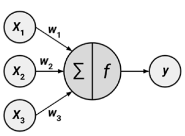

A typical artificial neuron with $n$ input dendrites can be represented by the formula
that follows. 

  - The $w$ weights allow each of the $n$ inputs (denoted by $x_i$) 
    - to contribute a greater or lesser amount to the sum of input signals. 
  - The net total is used by the activation function $f(x)$, 
    - and the resulting signal, $y(x)$, is the output axon:


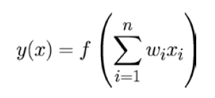

Neural networks 

  - use neurons defined this way as building blocks 
  - to construct complex models of data. 

Although there are numerous variants of neural networks, 

  - each can be defined in terms of the following characteristics:
  - An activation function, 
    - which transforms a neuron's combined input signals 
    - into a single output signal to be broadcasted further in the network
  - A network topology (or architecture), 
    - which describes the number of neurons in the model 
    - as well as the number of layers and manner in which they are connected
  - The training algorithm that specifies 
    - how connection weights are set 
    - in order to inhibit or excite neurons in proportion to the input signal

Let's take a look at some of the variations within each of these categories 

  - to see how they can be used to construct typical neural network models.

##### Activation Functions

- The activation function is the mechanism 

  - by which the artificial neuron 
    - processes incoming information and passes it throughout the network. 
  - Just as the artificial neuron is modeled after the biological version, 
  - so is the activation function modeled after nature's design.

In the biological case, the activation function could be imagined as 

  - a process that involves summing the total input signal 
  - and determining whether it meets the firing threshold. 
  - If so, the neuron passes on the signal; 
    - otherwise, it does nothing. 
  - In ANN terms, this is known as a threshold activation function, 
    - as it results in an output signal 
    - only once a specified input threshold has been attained.

The following figure depicts a typical threshold function; 

  - in this case, the neuron fires when the sum of input signals is at least zero. 
  - Because its shape resembles a stair, 
    - it is sometimes called a unit step activation function.


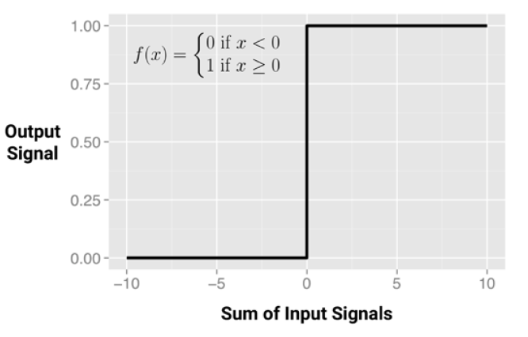

Although the threshold activation function is interesting 

  - due to its parallels with biology, 
    - it is rarely used in artificial neural networks. 
  - Freed from the limitations of biochemistry, 
  - the ANN activation functions can be chosen 
    - based on their ability to demonstrate desirable mathematical characteristics 
    - and accurately model relationships among data.

Perhaps the most commonly used alternative is the sigmoid activation function 

  - (more specifically, the logistic sigmoid) shown in the following figure. 
    - Note that in the formula shown, e is the base of the natural logarithm.
  - Although it shares a similar step or "S" shape with the threshold activation function,
    - the output signal is no longer binary; 
    - output values can fall anywhere in the range from 0 to 1. 
  - Additionally, the sigmoid is differentiable, 
    - which means that it is possible to calculate the derivative 
    - across the entire range of inputs.    
  - As you will learn later, this feature is crucial 
    - to create efficient ANN optimization algorithms.

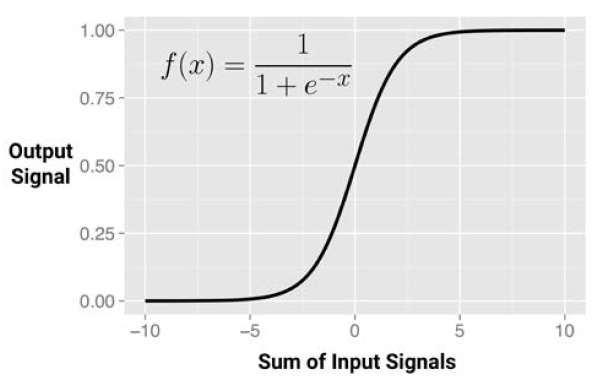

Although the sigmoid is perhaps the most commonly used activation function 

  - and is often used by default, 
  - some neural network algorithms allow a choice of alternatives.
  
A selection of such activation functions is shown in the following figure:

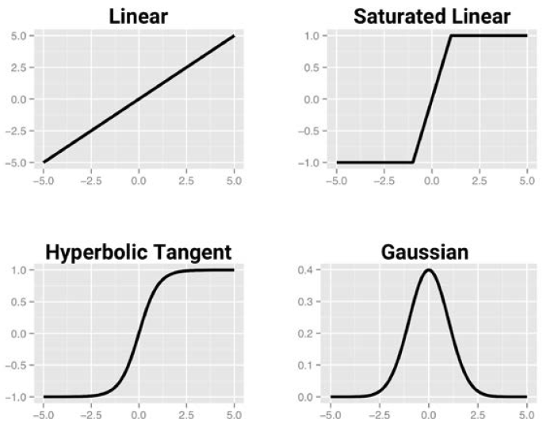

The primary detail that differentiates these activation functions 

  - is the output signal range. 
  - Typically, this is one of (0, 1), (-1, +1), or (-inf, +inf). 
  - The choice of activation function biases the neural network 
    - such that it may fit certain types of data more appropriately, 
    - allowing the construction of specialized neural networks. 
  - For instance, a linear activation function 
    - results in a neural network very similar to a linear regression model, 
    - while a Gaussian activation function 
      - results in a model called a Radial Basis Function (RBF) network. 
    - Each of these has strengths better suited for certain learning tasks and not others.

It's important to recognize that for many of the activation functions, 

  - the range of input values that affect the output signal is relatively narrow. 
    - For example, in the case of sigmoid, 
    - the output signal is always nearly 0 or 1 
      - for an input signal below -5 or above +5, respectively. 
  - The compression of signal in this way results in a saturated signal 
    - at the high and low ends of very dynamic inputs, 
    - just as turning a guitar amplifier up too high results in a distorted sound 
    - due to clipping of the peaks of sound waves. 
  - Because this essentially squeezes the input values 
    - into a smaller range of outputs, 
    - activation functions like the sigmoid 
      - are sometimes called squashing functions.

The solution to the squashing problem 

  - is to transform all neural network inputs 
    - such that the features' values fall within a small range around 0. 
  - Typically, this involves standardizing or normalizing the features. 
  - By restricting the range of input values, 
    - the activation function will have action across the entire range, 
    - preventing large-valued features such as household income 
    - from dominating small-valued features such as the number of children in the household. 
  - A side benefit is that the model may also be faster to train, 
    - since the algorithm can iterate more quickly through the actionable range of input values.

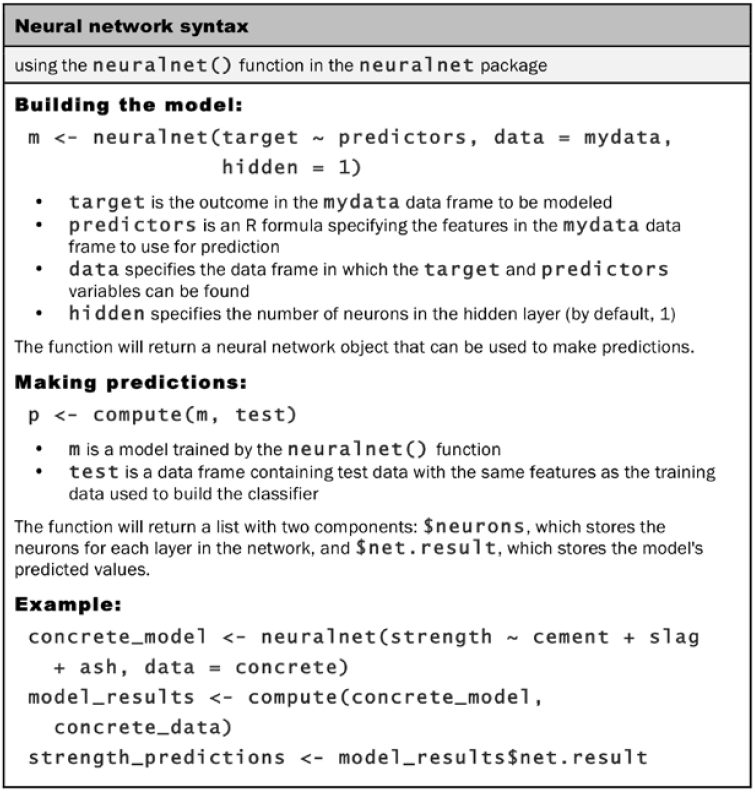

#### Neural Network Topology

- The ability of a neural network to learn is rooted in its topology, 

  - or the patterns and structures of interconnected neurons. 

Although there are countless forms of network architecture, 

  - they can be differentiated by three key characteristics:
    - The number of layers
    - Whether information in the network is allowed to travel backward
    - The number of nodes within each layer of the network

The topology determines the complexity of tasks that can be learned by the network.

  - Generally, larger and more complex networks are 
    - capable of identifying more subtle patterns and complex decision boundaries. 
  - However, the power of a network is not only a function of the network size, 
    - but also the way units are arranged.

##### The number of layers

- To define topology, we need a terminology 

  - that distinguishes artificial neurons based on their position in the network. 

The figure that follows illustrates the topology of a very simple network. 

  - A set of neurons called input nodes 
    - receives unprocessed signals directly from the input data. 
  - Each input node is responsible for processing a single feature in the dataset; 
    - the feature's value will be transformed by the corresponding node's activation function. 
  - The signals sent by the input nodes are received by the output node, 
    - which uses its own activation function 
    to generate a final prediction (denoted here as $p$).

The input and output nodes are arranged in groups known as layers. 

  - Because the input nodes process the incoming data exactly as it is received, 
  - the network has only one set of connection weights 
    - (labeled here as $w_1$, $w_2$, and $w_3$). 
  - It is therefore termed a single-layer network. 
  - Single-layer networks can be used for basic pattern classification, 
    - particularly for patterns that are linearly separable, 
  - but more sophisticated networks are required for most learning tasks.


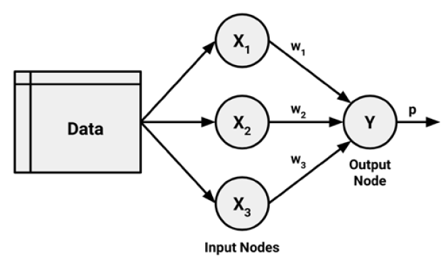

As you might expect, an obvious way to create more complex networks 

  - is by adding additional layers. 

As depicted here, a multilayer network 

  - adds one or more hidden layers that process the signals 
    - from the input nodes prior to it reaching the output node. 
  - Most multilayer networks are fully connected, 
    - which means that every node in one layer 
    - is connected to every node in the next layer, 
    - but this is not required.

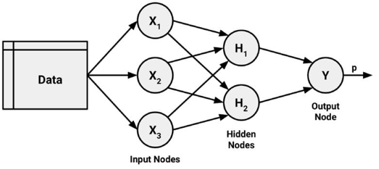

##### The direction of information travel

- You may have noticed that in the prior examples, 

  - arrowheads were used to indicate signals traveling in only one direction. 
  - Networks in which the input signal is fed continuously in one direction 
    - from connection to connection 
    - until it reaches the output layer 
    - are called **feedforward networks**.

In spite of the restriction on information flow, 

  - feedforward networks offer a surprising amount of flexibility. 
  - For instance, 
    - the number of levels and nodes at each level can be varied, 
    - multiple outcomes can be modeled simultaneously, 
    - or multiple hidden layers can be applied. 
  - A neural network with multiple hidden layers 
    - is called a **Deep Neural Network (DNN)** and 
  - the practice of training such network 
    - is sometimes referred to as **deep learning**.

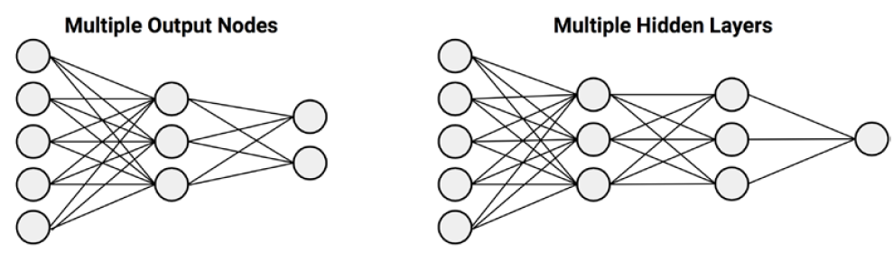

In contrast, a **recurrent network (or feedback network)** 

  - allows signals to travel in both directions using loops. 
  - This property, 
    - which more closely mirrors how a biological neural network works, 
    - allows extremely complex patterns to be learned.

The addition of a short-term memory, or delay, 

  - increases the power of recurrent networks immensely. 
  - Notably, this includes the capability to understand 
    - the sequences of events over a period of time. 
  - This could be used for 
    - stock market prediction, 
    - speech comprehension, 
    - or weather forecasting. 
    
A simple recurrent network is depicted as follows:

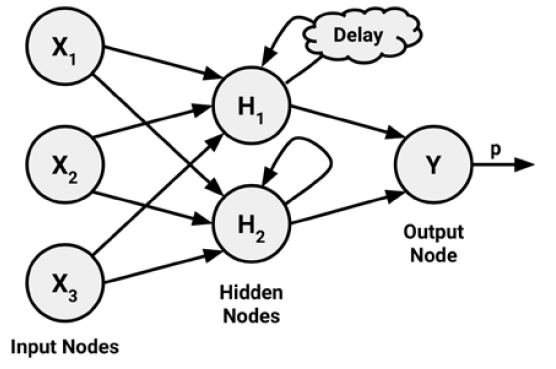

In spite of their potential, **recurrent networks** 

  - are an area of active research 
  - and have some applications in practice. 
  
On the other hand, **feedforward networks** 

  - have been extensively applied to real-world problems. 

In fact, the **multilayer feedforward network**, 

  - sometimes called the **Multilayer Perceptron (MLP)**, 
  - is the de facto standard ANN topology. 
  - If someone mentions that they are fitting a neural network, 
    - they are most likely referring to a MLP.

##### The number of nodes in each layer

- In addition to the variations in 

  - the number of layers and 
  - the direction of information travel, 

Neural networks can also vary in complexity 

  - by the number of nodes in each layer. 
  - The number of input nodes is predetermined 
    - by the number of features in the input data. 
  - Similarly, the number of output nodes is predetermined 
    - by the number of outcomes to be modeled 
    - or the number of class levels in the outcome. 
  - However, the number of hidden nodes 
    - is left to the user to decide 
    - prior to training the model.

Unfortunately, there is no reliable rule 

  - to determine the number of neurons in the hidden layer. 
  - The appropriate number depends 
    - on the number of input nodes,
    - the amount of training data, 
    -  the amount of noisy data, 
    - and the complexity of the learning task, 
    - among many other factors.

In general, more complex network topologies 

  - with a greater number of network connections 
    - allow the learning of more complex problems. 
  - A greater number of neurons 
    - will result in a model that more closely mirrors the training data, 
    - but this runs a risk of **overfitting**; 
    - it may generalize poorly to future data. 
  - Large neural networks can also be 
    - computationally expensive 
    - and slow to train.

The best practice is to use the fewest nodes 

  - that result in adequate performance 
    - in a validation dataset. 
  - In most cases, even with only a small number of hidden nodes 
    - often as few as a handful
  - the neural network can offer a tremendous amount of learning ability.

#### Training neural networks with backpropagation

- The network topology is a blank slate that by itself has not learned anything. 

  - Like a newborn child, 
    - it must be trained with experience. 
  - As the neural network processes the input data, 
    - connections between the neurons are strengthened or weakened,
    - similar to how a baby's brain develops 
    - as he or she experiences the environment. 
  - The network's connection weights are adjusted 
    - to reflect the patterns observed over time.

Training a neural network by adjusting connection weights 

  - is very computationally intensive. 
  - Consequently, though they had been studied for decades prior, 
    - ANNs were rarely applied to real-world learning tasks 
    - until the mid-to-late 1980s, 
    - when an efficient method of training an ANN was discovered. 
  - The algorithm, which used a strategy of **back-propagating errors**, 
    - is now known simply as **backpropagation**.

##### Backpropagation speeds up NN training

- Although NN's still notoriously slow 

  - relative to many other machine learning algorithms,
  - the backpropagation method 
    - led to a resurgence of interest in ANNs. 
  - As a result, **multilayer feedforward networks** 
    - that use the **backpropagation algorithm**
    - are now common in the field of data mining. 

Such models offer the following strengths and weaknesses:

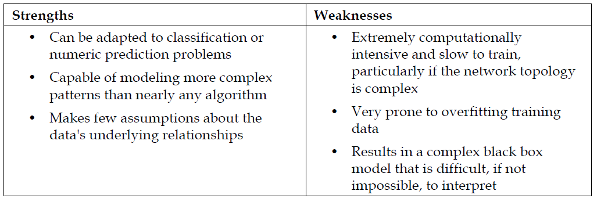

In its most general form, the backpropagation algorithm 

  - iterates through many cycles of two processes. 

Each cycle is known as an **epoch**. 

  - Because the network contains no a priori (existing) knowledge, 
    - the starting weights are typically set at random. 
  - Then, the algorithm iterates through the processes, 
    - until a stopping criterion is reached. 

Each epoch in the backpropagation algorithm includes:

  - A forward phase in which the neurons are activated in sequence 
    - from the input layer to the output layer, 
    - applying each neuron's weights and activation function along the way. 
    - Upon reaching the final layer, 
    - an output signal is produced.
  - A backward phase in which the network's output signal 
    - resulting from the forward phase 
    - is compared to the true target value in the training data. 
  - The difference between the network's output signal 
    - and the true value 
    - results in an error that is **propagated backwards** in the network 
    - to modify the connection weights between neurons 
    - and reduce future errors.

Over time, the network uses the information sent backward 

  - to reduce the total error of the network. 
  - Yet one question remains: 
    - because the relationship between each neuron's inputs and outputs is complex, 
    - how does the algorithm determine how much a weight should be changed? 
  - The answer to this question involves a technique called **gradient descent**. 
  - Conceptually, it works similarly to 
    - how an explorer trapped in the jungle might find a path to water. 
    - By examining the terrain and continually walking in the direction 
    - with the greatest downward slope, 
    - the explorer will eventually reach the lowest valley, 
    - which is likely to be a riverbed.

In a similar process, the backpropagation algorithm 

  - uses the derivative of each neuron's activation function 
    - to identify the gradient in the direction of 
    - each of the incoming weights
    - hence the importance of having a differentiable activation function. 
  - The gradient suggests how steeply the error will 
    - be reduced or increased for a change in the weight. 
  - The algorithm will attempt to change the weights 
    - that result in the greatest reduction in error 
    - by an amount known as the **learning rate**. 
  - The greater the learning rate, 
    - the faster the algorithm will attempt to descend down the gradients, 
    - which could reduce the training time 
    - at the risk of overshooting the valley.

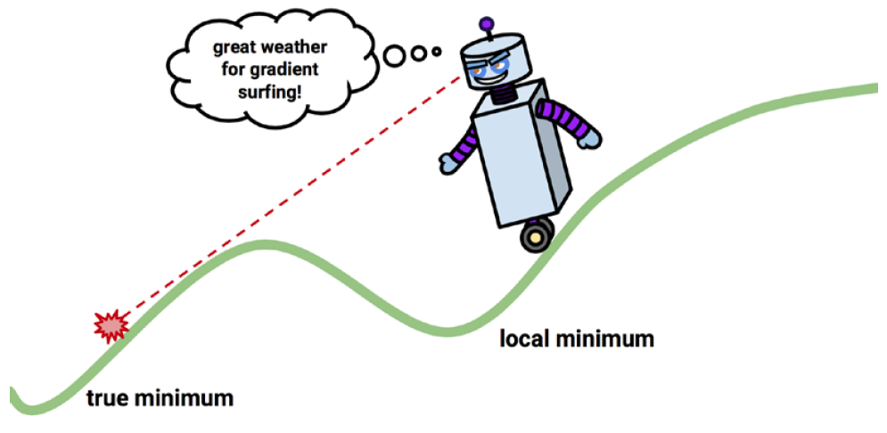

#### Cites

- Machine Learning with R, Brett Lantz

[Perceptron: the main component of neural networks](https://www.neuraldesigner.com/blog/perceptron-the-main-component-of-neural-networks)

[Introduction to Deep Neural Networks](https://deeplearning4j.org/neuralnet-overview.html)

