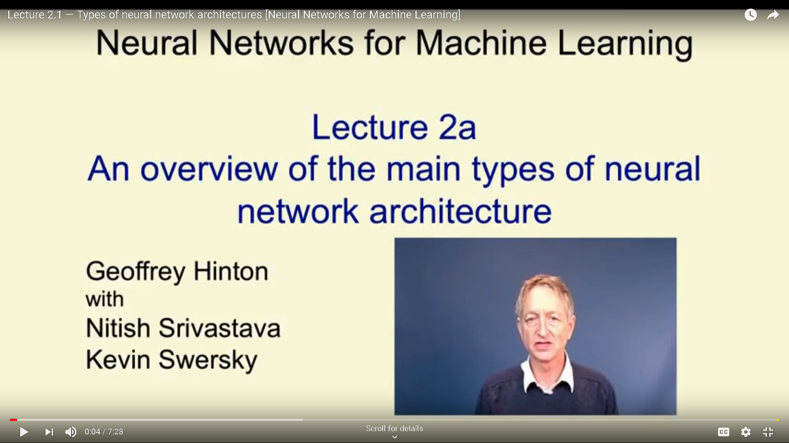
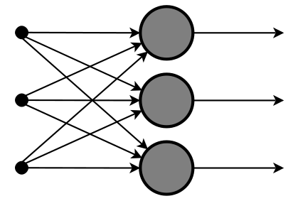
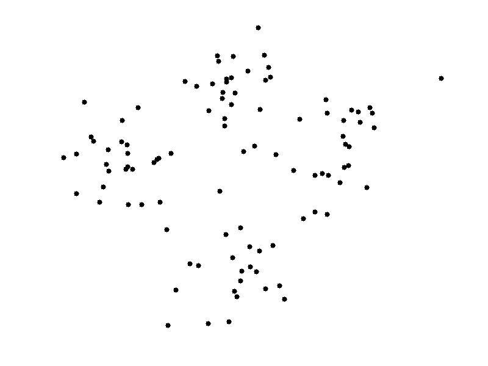
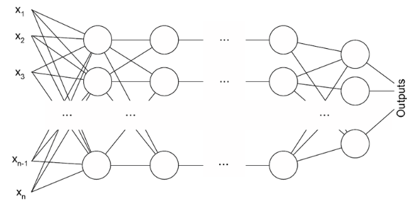
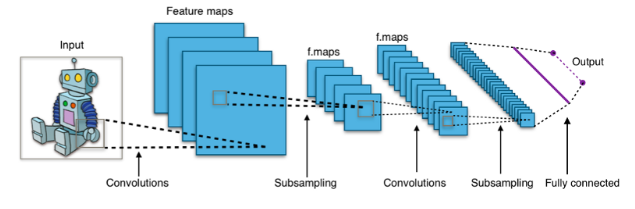
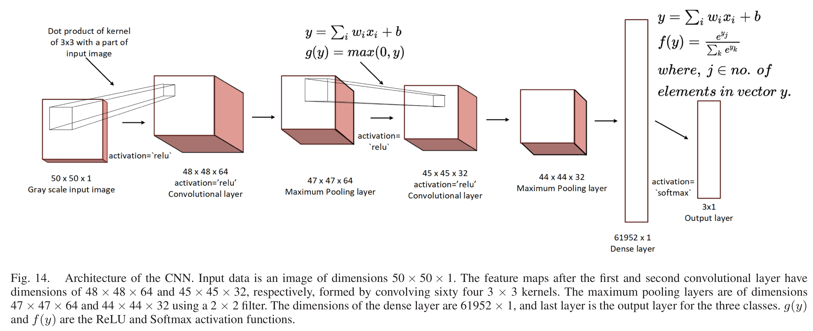

```{r setup, include = FALSE}
knitr::opts_chunk$set(
  cache = FALSE, # if TRUE knitr will cache results to reuse in future knits
  fig.width = 6, # the width for plots created by code chunk
  fig.height = 4, # the height for plots created by code chunk
  fig.align = 'center', # how to align graphics. 'left', 'right', 'center'
  dpi = 300, 
  dev = 'png', # Makes each fig a png, and avoids plotting every data point
  # options(tinytex.verbose = TRUE)
  # eval = FALSE, # if FALSE, then the R code chunks are not evaluated
  # results = 'asis', # knitr passes through results without reformatting
  echo = TRUE, # if FALSE knitr won't display code in chunk above it's results
  message = TRUE, # if FALSE knitr won't display messages generated by code
  strip.white = TRUE, # if FALSE knitr won't remove white spaces at beg or end of code chunk
  warning = TRUE, # if FALSE knitr won't display warning messages in the doc
  error = TRUE) # report errors
```

 \setcounter{section}{11}
 \setcounter{subsection}{1}
 \setcounter{subsubsection}{2}
 
#### Class Readings, Assignments, Syllabus Topics

##### Reading, Lab Exercises, SemProjects

  - Readings: 
    - For today: 
    - For next class: LeCun Deep Learning 2015 Review
    - Next is:  
  - Laboratory Exercises: 
    - LE posted
    - **LE6 is due this coming Thursday April 13th**
  - Office Hours: (Class Canvas Calendar for Zoom Link)
    - Wednesdays @ 4:00 PM to 5:00 PM  
    - Saturdays @ 3:00 PM to 4:00 PM
    - **Office Hours are on Zoom, and recorded**
  - Semester Projects
    - Office Hours for SemProjs: Mondays at 4pm on Zoom
    - DSCI 453 Students Biweekly Updates Due 
      - Update # is Due **  **
    - DSCI 453 Students 
      - Next Report Out # is Due  
    - All DSCI 353/353M/453, E1453/2453 Students: 
      - **Peer Grading of Report Out  is Due Friday **
  - Exams
    - Final: Tuesday May 11th 2021, 12:00 PM to 3 PM
    


    
#### Syllabus


\FloatBarrier


#### The recipients of the 2019 Turing Award of ACM

  - [Association for Computing Machinery](www.acm.org)

Geoffrey Hinton, Yann Lecun and Yoshua Bengio 

  - [Geoffrey Hinton](https://en.wikipedia.org/wiki/Geoffrey_Hinton)
    - **Backpropagation**: In a 1986 paper, “Learning Internal Representations by Error Propagation,” co-authored with David Rumelhart and Ronald Williams, Hinton demonstrated that the backpropagation algorithm allowed neural nets to discover their own internal representations of data, making it possible to use neural nets to solve problems that had previously been thought to be beyond their reach. The backpropagation algorithm is standard in most neural networks today.
    - **Boltzmann Machines**: In 1983, with Terrence Sejnowski, Hinton invented Boltzmann Machines, one of the first neural networks capable of learning internal representations in neurons that were not part of the input or output.
    - **Improvements to convolutional neural networks**: In 2012, with his students, Alex Krizhevsky and Ilya Sutskever, Hinton improved convolutional neural networks using rectified linear neurons and dropout regularization. In the prominent ImageNet competition, Hinton and his students almost halved the error rate for object recognition and reshaped the computer vision field.
  - [Yann Lecun](https://en.wikipedia.org/wiki/Yann_LeCun)
    - **Convolutional neural networks**: In the 1980s, LeCun developed convolutional neural networks, a foundational principle in the field, which, among other advantages, have been essential in making deep learning more efficient. In the late 1980s, while working at the University of Toronto and Bell Labs, LeCun was the first to train a convolutional neural network system on images of handwritten digits. Today, convolutional neural networks are an industry standard in computer vision, as well as in speech recognition, speech synthesis, image synthesis, and natural language processing. They are used in a wide variety of applications, including autonomous driving, medical image analysis, voice-activated assistants, and information filtering.
    - **Improving backpropagation algorithms**: LeCun proposed an early version of the backpropagation algorithm (backprop), and gave a clean derivation of it based on variational principles. His work to speed up backpropagation algorithms included describing two simple methods to accelerate learning time.
    - **Broadening the vision of neural networks**: LeCun is also credited with developing a broader vision for neural networks as a computational model for a wide range of tasks, introducing in early work a number of concepts now fundamental in AI. For example, in the context of recognizing images, he studied how hierarchical feature representation can be learned in neural networks—a concept that is now routinely used in many recognition tasks. Together with Léon Bottou, he proposed the idea, used in every modern deep learning software, that learning systems can be built as complex networks of modules where backpropagation is performed through automatic differentiation. They also proposed deep learning architectures that can manipulate structured data, such as graphs.
  - [Yoshua Bengio](https://en.wikipedia.org/wiki/Yoshua_Bengio)
    - **Probabilistic models of sequences**: In the 1990s, Bengio combined neural networks with probabilistic models of sequences, such as hidden Markov models. These ideas were incorporated into a system used by AT&T/NCR for reading handwritten checks, were considered a pinnacle of neural network research in the 1990s, and modern deep learning speech recognition systems are extending these concepts.
    - **High-dimensional word embeddings and attention**: In 2000, Bengio authored the landmark paper, “A Neural Probabilistic Language Model,” that introduced high-dimension word embeddings as a representation of word meaning. Bengio’s insights had a huge and lasting impact on natural language processing tasks including language translation, question answering, and visual question answering. His group also introduced a form of attention mechanism which led to breakthroughs in machine translation and form a key component of sequential processing with deep learning.
    - **Generative adversarial networks**: Since 2010, Bengio’s papers on generative deep learning, in particular the Generative Adversarial Networks (GANs) developed with Ian Goodfellow, have spawned a revolution in computer vision and computer graphics. In one fascinating application of this work, computers can actually create original images, reminiscent of the creativity that is considered a hallmark of human intelligence.
    
##### Hinton and LeCun's Turing Award Lecture recordings

  - [ACM youtube](https://fcrc.acm.org/turing-lecture-at-fcrc-2019)
      
#### Types of Neural Networks

- Much of modern technology is based on computational models 

  - known as artificial neural networks. 
  
There are many different types of neural networks 

  - which function on the same principles 
  - as the nervous system in the human body.

As [Howard Rheingold](https://rheingold.com/) said, 

```
“The neural network is this kind of technology that is not an algorithm, 
it is a network that has weights on it, 
and you can adjust the weights so that it learns. 
You teach it through trials.”
```

##### What are Artificial Neural Networks?

- An artificial neural network is a system of hardware or software 

  - that is patterned after the working of neurons 
    - in the human brain and nervous system. 

Artificial neural networks are 

  - a variety of deep learning technology 
  - which comes under the broad domain 
    - of Artificial Intelligence.

Deep learning is a branch of Machine Learning 

  - which uses different types of neural networks. 
  
These algorithms are inspired by the way our brain functions 

  - and therefore many experts believe they are our best shot 
  - to moving towards real AI (Artificial Intelligence).

Deep learning is becoming especially exciting now 

  - as we have more amounts of data 
  - and larger neural networks to work with.

Moreover, the performance of neural networks 

  - improves as they grow bigger and work with more and more data, 
  - unlike other Machine Learning algorithms 
    - which can reach a plateau after a point.


Figure 1. A mostly complete chart of Neural Networks

##### How do Neural Networks work?

- A neural network has a large number of nodes. 

  - These nodes (or processors) operate parallelly 
    - but are arranged as layers. 
  - The first layer receives the raw input 
    - similar to how the optic nerve 
    - receives the raw information in human beings.

Each successive layer then receives input 

  - from the layer before it 
    - and then passes on its output to the layer after it. 
  - The last layer processes the final output.

Nodes make up each tier. 

  - The nodes are highly interconnected 
    - with the nodes in the tier before and after. 
  - Each node in the neural network has its own sphere of knowledge, 
    - including rules that it was programmed with 
    - and rules it has learnt by itself.  

The key to the efficacy of neural networks 

  - is they are extremely adaptive and learn very quickly. 
  - Each node weighs the importance of the input 
    - it receives from the nodes before it. 
  - The inputs that contribute the most towards the right output 
    - are given the highest weight.

##### What are the Different Types of Neural Networks?

- Different types of neural networks 

  - use different principles 
    - in determining their own rules. 

There are many types of artificial neural networks, each with their unique strengths. 

This Hinton video discusses the 

  - different types of neural networks 
  - and their applications in detail.

[Neural Networks for Machine Learning, Class 2a, Geoffrey Hinton](https://youtu.be/l0foB9mUrc4)



Figure 2. Geoffrey Hinton on Types of Neural Networks

##### Geoffrey Hinton 

- He has developed many of the most important advances in machine learning.

These papers are in your 3-readings / 2-articles

  - Backpropagation [@rumelhartLearningRepresentationsBackpropagating1986]
  - t-SNE for data visualization [@maatenVisualizingDataUsing2008]
  - Deep NNs for ImageNet Image Classification [@krizhevskyImageNetClassificationDeep2012a,@krizhevskyImageNetClassificationDeep2017]
  - Deep Learning [@lecunDeepLearning2015]
  - His [**Neural Networks for Machine Learning** class videos playlist](https://www.youtube.com/playlist?list=PLoRl3Ht4JOcdU872GhiYWf6jwrk_SNhz9)

#### Important types of neural networks and their applications

- ##### Feedforward Neural Network – Artificial Neuron

This is one of the simplest types of artificial neural networks. 

  - In a feedforward neural network, 
    - the data passes through the different input nodes 
    - till it reaches the output node.

In other words, data moves in only one direction 

  - from the first tier onwards 
    - until it reaches the output node. 
  - This is also known as a front propagated wave 
    - which is usually achieved 
    - by using a classifying activation function.

Unlike in more complex types of neural networks, 

  - there is no backpropagation 
    - and data moves in one direction only. 
  - A feedforward neural network 
    - may have a single layer 
    - or it may have hidden layers.

In a feedforward neural network, 

  - the sum of the products of the inputs and their weights are calculated. 
  - This is then fed to the output. 

Here is an example of a single layer feedforward neural network.



Figure 3. Feedforward Neural Network – Artificial Neuron

Feedforward neural networks are used in technologies like 

  - Face recognition and computer vision. 
  - This is because the target classes in these applications 
    - are hard to classify.

A simple feedforward neural network is equipped to deal with data 

  - which contains a lot of noise. 
  - Feedforward neural networks are also relatively simple to maintain.

##### Radial Basis Function Neural Network

- A radial basis function 

  - considers the distance of any point relative to the centre. 

Such neural networks have two layers. 

  - In the inner layer, 
    - the features are combined with the radial basis function.

Then the output of these features is taken into account 

  - when calculating the same output in the next time-step. 
  
Here is a diagram which represents a radial basis function neural network.

# {width=50%}

```{r RBFNN, out.width = "400px", fig.cap="Radial Basis Function Neural Network"}
knitr::include_graphics[width = 0.8\textwidth]("./figs/TypeNN-4-RBFNN.gif")
```

Figure 4. Radial Basis Function Neural Network

The radial basis function neural network is applied extensively 

  - in power restoration systems. 
  - In recent decades, power systems have become bigger and more complex.
  - This increases the risk of a blackout. 

This neural network is used in the power restoration systems 

  - in order to restore power in the shortest possible time.

##### Multilayer Perceptron

- A multilayer perceptron has three or more layers. 

  - It is used to classify data that cannot be separated linearly. 
  - It is a type of artificial neural network that is **fully connected**. 
  - This is because every single node in a layer 
    - is connected to each node in the following layer.

A multilayer perceptron 

  - uses a nonlinear activation function 
    - (mainly hyperbolic tangent or logistic function). 

Here’s what a multilayer perceptron looks like.



Figure 5. Multilayer Perceptron

This type of neural network is applied extensively 

  - in speech recognition 
  - and machine translation technologies.

##### Convolutional Neural Network

- A convolutional neural network(CNN) 

  - uses a variation of the multilayer perceptrons. 

A CNN contains one or more than one convolutional layers. 

  - These layers can either be 
    - completely interconnected 
    - or pooled.

Before passing the result to the next layer, 

  - the convolutional layer 
    - uses a convolutional operation on the input. 
  - Due to this convolutional operation, 
    - the network can be much deeper 
    - but with much fewer parameters.

Due to this ability, convolutional neural networks show very effective results 

  - in image and video recognition, 
  - natural language processing, 
  - and recommender systems.

Convolutional neural networks also show great results 

  - in semantic parsing and paraphrase detection. 

They are also applied in 

  - signal processing 
  - and image classification.

CNNs are also being used in image analysis and recognition in agriculture 

  - where weather features are extracted from satellites 
    - like LSAT 
  - to predict the growth and yield of a piece of land. 
  
Here’s an image of what a Convolutional Neural Network looks like.



Figure 6. Convolutional Neural Network



Figure 6b. Our ConvNet used for Image Machine Learning of PV Cell Degradation


Figure 6c. Time series gif of PV module degradation Electroluminesent Images

From our paper

  - [1]A.M. Karimi, J.S. Fada, M.A. Hossain, S. Yang, T.J. Peshek, J.L. Braid, R.H. French, Automated Pipeline for Photovoltaic Module Electroluminescence Image Processing and Degradation Feature Classification, IEEE Journal of Photovoltaics. (2019) 1–12. doi:[10.1109/JPHOTOV.2019.2920732](http://dx.doi.org/10.1109/JPHOTOV.2019.2920732).


#####  Recurrent Neural Network(RNN) – Long Short Term Memory

- A Recurrent Neural Network is a type of artificial neural network 

  - in which the output of a particular layer 
    - is saved 
    - and fed back to the input.
  - This helps predict the outcome of the layer.

The first layer is formed in the same way 

  - as it is in the feedforward network. 
  - That is, with the product of 
    - the sum of the weights and features. 
  - However, in subsequent layers, 
    - the recurrent neural network process begins.

From each time-step to the next, 

  - each node will remember some information 
    - that it had in the previous time-step. 
  - In other words, each node acts as a memory cell 
    - while computing and carrying out operations. 
  - The neural network begins with the front propagation as usual 
    - but remembers the information it may need to use later.

If the prediction is wrong, 

  - the system self-learns and works towards making 
    - the right prediction during the backpropagation. 

This type of neural network is very effective in 

  - text-to-speech conversion technology.  
  
Here’s what a recurrent neural network looks like.


Figure 7. Recurrent Neural Network(RNN) – Long Short Term Memory

##### Modular Neural Network

- A modular neural network 

  - has a number of different networks 
    - that function independently and perform sub-tasks. 
  - The different networks do not really interact with or signal each other 
    - during the computation process. 
  - They work independently towards achieving the output.

As a result, a large and complex computational process 

  - can be done significantly faster 
    - by breaking it down into independent components. 
  - The computation speed increases 
    - because the networks are not interacting with 
    - or even connected to each other.  

Here’s a visual representation of a Modular Neural Network.


Figure 8. Modular Neural Network

##### Sequence-To-Sequence Models

- A sequence to sequence model 

  - consists of two recurrent neural networks. 
  - There’s an encoder that 
    - processes the input 
    - and a decoder that processes the output. 
  - The encoder and decoder can either 
    - use the same parameters
    - or different parameters. 
  - This model is particularly applicable 
    - in those cases where the length of the input data 
    - is not the same as the length of the output data.  

Sequence-to-sequence models are applied mainly in 

  - chatbots, 
  - machine translation, and 
  - question answering systems.

##### Summary

- There are many types of artificial neural networks 

  - that operate in different ways to achieve different outcomes. 

The most important part about neural networks is that 

  - they are designed in a way that is similar to how neurons in the brain work.

As a result, they are designed 

  - to learn more and improve more 
  - with more data and more usage. 

Unlike traditional machine learning algorithms 

  - which tend to stagnate after a certain point, 
  - neural networks have the ability to truly grow 
    - with more data and more usage.

That’s why many experts believe that different types of neural networks 

  - will be the fundamental framework on which 
  - next-generation Artificial Intelligence will be built.

#### Cites

##### Geoffrey Hinton

  - Learning Representations by Back-propogating Errors [@rumelhartLearningRepresentationsBackpropagating1986]
    - Visualizing Data using t-SNE [@maatenVisualizingDataUsing2008]
  - Deep Learning (review) [@lecunDeepLearning2015]
  - ImageNet Classification with Deep Convolutional Neural Networks [@krizhevskyImageNetClassificationDeep2012a]
  - ImageNet Classification with Deep Convolutional Neural Networks (ACM letter) [@krizhevskyImageNetClassificationDeep2017]


##### Blogs

  - Ankurati Mehta [A Complete Guide to Types of Neural Networks](https://www.digitalvidya.com/blog/types-of-neural-networks/) Jan. 25, 2019
  - Fjodor van Veen [The Neural Network Zoo](http://www.asimovinstitute.org/neural-network-zoo/), Sept. 14, 2016
  - Fjodor van Veen [The Neural Network Zoo Prequel: Cells and Layers ](https://www.asimovinstitute.org/author/fjodorvanveen/), Sept. 14, 2016
  
#### References


