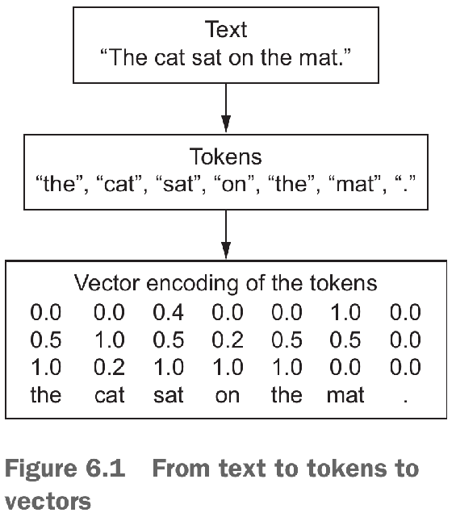
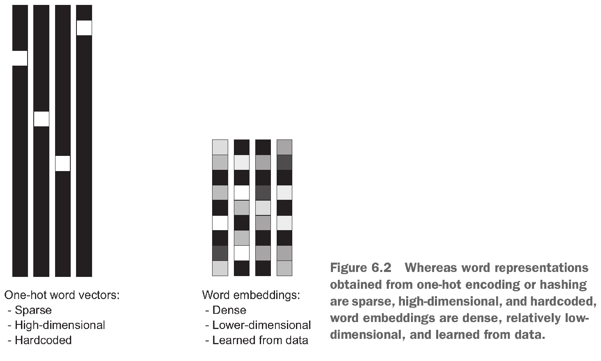
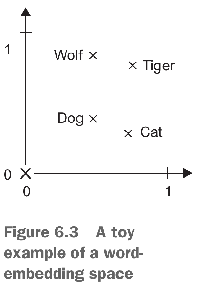
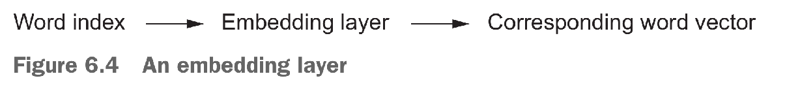
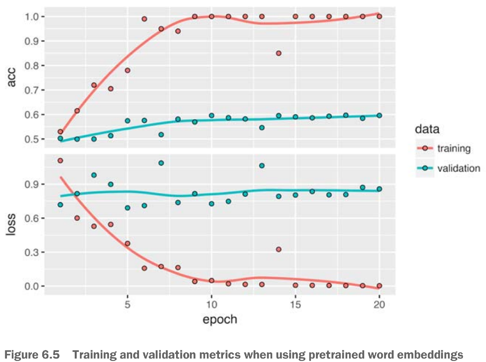

```{r setup, include = FALSE}
knitr::opts_chunk$set(
  fig.width = 4, # the width for plots created by code chunk
  fig.height = 3, # the height for plots created by code chunk
  fig.align = 'center', # how to align graphics. 'left', 'right', 'center'
  dpi = 300, 
  dev = 'png', # Makes each fig a png, and avoids plotting every data point
  # cache = TRUE, # if TRUE knitr will cache results to reuse in future knits
  # eval = TRUE, # if FALSE, then the R code chunks are not evaluated
  # results = 'markup', # asis means without reformatting, markup with fences
  # include = TRUE, # Whether to include the chunk output in the output document. 
  echo = TRUE, # if FALSE knitr won't display code in chunk above it's results
  message = TRUE, # if FALSE knitr won't display messages generated by code
  strip.white = TRUE, # if FALSE knitr won't remove white spaces at beg or end of code chunk
  warning = FALSE, # if FALSE knitr won't display warning messages in the doc
  error = TRUE) # report errors
```

##### If you are compiling to pdf, for submission, 

  - after having run all your code
    - So that the results of each code block is visible
  - Then uncomment the FOUR lines above
    - that say `cache = TRUE, eval = TRUE, results = "markup", include = TRUE `

--------------------------------------------------------------------------------

 \setcounter{section}{11}
 \setcounter{subsection}{2}
 \setcounter{subsubsection}{1}

--------------------------------------------------------------------------------

#### Natural Language Processing

- Lets explore deep-learning models that can 

  - process text 
    - (understood as sequences of words or sequences of characters), 
  - timeseries, 
  - and sequence data in general. 
  
The two fundamental deep-learning algorithms for sequence processing are

  - Recurrent neural networks (RNNs) 
  - and 1D convnets, or CNNs 
    - the one-dimensional version of the 2D convnets that we've used

Applications of these algorithms include the following:

  - Document classification and timeseries classification, 
    - such as identifying the topic of an article or the author of a book
  - Timeseries comparisons, 
    - such as estimating how closely related 
    - two documents or two stock tickers are
  - Sequence-to-sequence learning, 
    - such as decoding an English sentence into French
  - Sentiment analysis, 
    - such as classifying the sentiment of tweets or movie reviews
    - as positive or negative
  - Timeseries forecasting, 
    - such as predicting the future weather at a certain location, 
    - given recent weather data
    
These examples will focus on two narrow tasks: 

  - sentiment analysis on the IMDB dataset, 
    - a task we approached earlier, 
  - and temperature forecasting. 
  
But the techniques demonstrated for these two tasks 

  - are relevant to all the applications just listed, 
  - and many more.

#### Working with text data

- Text is one of the most widespread forms of sequence data. 

It can be understood as either 

  - a sequence of characters 
    - or a sequence of words, 
  - but it’s most common to work at the level of words. 
  
The deep-learning sequence-processing models introduced here

  - can use text to produce a basic form of natural-language understanding, 
  - sufficient for applications 
    - including document classification, 
    - sentiment analysis, 
    - author identification, 
    - and even question answering (QA) in a constrained context. 

Keep in mind throughout this chapter that 

  - none of these deep-learning models 
    - truly understand text in a human sense; 
  - rather, these models can 
    - map the statistical structure of written language, 
    - which is sufficient to solve many simple textual tasks.

Deep learning for natural-language processing 

  - is pattern recognition applied to words, sentences, and paragraphs, 
  - in much the same way that computer vision 
    - is pattern recognition applied to pixels.

Like all other neural networks, 

  - deep-learning models don’t take as input raw text:
  - they only work with numeric tensors. 

Vectorizing text is the process of 

  - transforming text into numeric tensors. 

This can be done in multiple ways:

  - Segment text into words, 
    - and transform each word into a vector.
  - Segment text into characters, 
    - and transform each character into a vector.
  - Extract n-grams of words or characters, 
    - and transform each n-gram into a vector.
    - (N-grams are overlapping groups 
    - of multiple consecutive words or characters).

Collectively, the different units into which you can break down text 

  - (words, characters, or n-grams) 
    - are called tokens, 
  - and breaking text into such tokens 
    - is called tokenization. 

All text-vectorization processes consist of 

  - applying some tokenization scheme 
    - and then associating numeric vectors 
    - with the generated tokens. 

These vectors, 

  - packed into sequence tensors, 
  - are fed into deep neural networks. 
  
There are multiple ways to associate a vector with a token. 

We’ll present two major ones: 

  - one-hot-encoding of tokens, and 
  - token embedding 
    - (typically used exclusively for words, and called word embedding). 
    
Here we'll explain these techniques and 

  - show how to use them to go 
  - from raw text to a tensor that 
  - you can send to a Keras network.




##### Understanding n-grams and bag-of-words

- **Word n-grams** are groups of N (or fewer) consecutive words 

  - that you can extract from a sentence. 
  - The same concept may also be applied to characters 
    - instead of words.

Here’s a simple example. 

  - Consider the sentence “The cat sat on the mat.” 
  - It may be decomposed into the following set of **2-grams**:
    - {"The", "The cat", "cat", "cat sat", "sat",
    - "sat on", "on", "on the", "the", "the mat", "mat"}
  - It may also be decomposed into the following set of 3-grams:
    - {"The", "The cat", "cat", "cat sat", "The cat sat",
    - "sat", "sat on", "on", "cat sat on", "on the", "the",
    - "sat on the", "the mat", "mat", "on the mat"}
  - Such a set is called a 
    - bag-of-2-grams or 
    - bag-of-3-grams, respectively. 

The term bag here refers to the fact that you’re dealing with 

  - a set of tokens rather than a list or sequence: 
    - the tokens have no specific order. 
  - This family of tokenization methods is called **bag-of-words**.

Because bag-of-words 

  - isn’t an order-preserving tokenization method 
    - (the tokens generated are understood as a set, not a sequence, 
    - and the general structure of the sentences is lost), 
  - it tends to be used in shallow language-processing models 
    - rather than in deep-learning models. 

Extracting n-grams is a form of feature engineering, 

  - and deep learning does away with this kind of rigid, brittle approach, 
    - replacing it with hierarchical feature learning. 
  - One-dimensional convnets and recurrent neural networks,
    - introduced later in this chapter, 
    - are capable of learning representations for groups of words and characters 
    - without being explicitly told about the existence of such groups,
    - by looking at continuous word or character sequences. 

For this reason, we won’t cover n-grams any further in this book. 

  - But do keep in mind that they’re a powerful, 
    - unavoidable feature-engineering tool 
  - when using lightweight, shallow, text-processing models 
    - such as logistic regression and random forests.

#### One-hot encoding of words and characters

- One-hot encoding is 

  - the most common, most basic way to turn a token into a vector.
  
You saw it in action in 

  - the initial IMDB and Reuters examples in chapter 3 
  - (done with words, in that case). 

It consists of associating a unique integer index 

  - with every word 
  - and then turning this integer index i 
    - into a binary vector of size N 
    - (the size of the vocabulary); 
  - the vector is all zeros 
    - except for the i th entry, which is 1.

Of course, one-hot encoding can be done at the character level, as well. 

To unambiguously drive home 

  - what one-hot encoding is and 
  - how to implement it, 
  - listings 6.1 and 6.2 in DLwR show two toy examples: 
    - one for words, the other for characters.

Note that Keras has built-in utilities for 

  - doing one-hot encoding of text 
    - at the word level or character level, 
    - starting from raw text data. 
  - You should use these utilities, because they take care of 
    - a number of important features 
    - such as stripping special characters from strings 
    - and only taking into account the N most common words in your dataset 
    - (a common restriction, to avoid dealing with very large input vector spaces).

##### Using word embeddings

- Another popular and powerful way to associate a vector with a word 

  - is the use of dense word vectors, 
    - also called word embeddings. 
  - Whereas the vectors obtained through one-hot encoding 
    - are binary, sparse (mostly made of zeros), 
    - and very high-dimensional (same dimensionality 
      - as the number of words in the vocabulary), 
  - word embeddings are low-dimensional floating-point vectors 
    - (that is, dense vectors, as opposed to sparse vectors)
    - see figure 6.2. 
    

    
Unlike the word vectors obtained via one-hot encoding, 

  - **word embeddings** are learned from data. 
  It’s common to see word embeddings 
    - that are 256-dimensional, 512-dimensional, or 1,024-dimensional, 
    - when dealing with very large vocabularies. 
  - On the other hand, one-hot encoding words 
    - generally leads to vectors that are 20,000-dimensional or greater 
    - (capturing a vocabulary of 20,000 tokens, in this case). 
  - So, word embeddings pack more information into far fewer dimensions.

There are two ways to obtain word embeddings: 

  - Learn word embeddings jointly with the main task you care about 
    - (such as document classification or sentiment prediction). 
    - In this setup, you start with random word vectors and 
    - then learn word vectors in the same way 
      - you learn the weights of a neural network.
  - Load into your model word embeddings that were precomputed 
    - using a different machine-learning task 
      - than the one you’re trying to solve. 
    - These are called pretrained word embeddings.

##### Learning word embeddings with an embedding layer

- The simplest way to 

  - associate a dense vector with a word 
    - is to choose the vector at random. 
  - The problem with this approach is that 
    - the resulting embedding space has no structure: 
    - for instance, the words accurate and exact 
      - may end up with completely different embeddings, 
      - even though they’re interchangeable in most sentences. 
  - It’s difficult for a deep neural network 
    - to make sense of such a noisy, unstructured embedding space.
    
To get a bit more abstract, 

  - the geometric relationships between word vectors
    - should reflect the semantic relationships between these words. 
  - Word embeddings are meant to map human language 
    - into a geometric space. 
  - For instance, in a reasonable embedding space, 
    - you would expect synonyms to be embedded into similar word vectors; 
    - and in general, you would expect the geometric distance 
      - (such as L2 distance)
    - between any two word vectors 
      - to relate to the semantic distance 
      - between the associated words 
    - (words meaning different things 
      - are embedded at points far away from each other, 
      - whereas related words are closer). 
  - In addition to distance, 
    - you may want specific directions in the embedding space to be meaningful. 
    
To make this clearer, let’s look at a concrete example.



In figure 6.3, four words are embedded on a 2D plane: 

  - cat, dog, wolf, and tiger. 
  - With the vector representations we chose here, 
    - some semantic relationships between these words 
    - can be encoded as geometric transformations. 
  - For instance, the same vector allows us 
    - to go from cat to tiger 
    - and from dog to wolf: 
  - This vector could be interpreted as a 
    - “from pet to wild animal” vector. 
  - Similarly, another vector lets us go
    - from dog to cat and 
    - from wolf to tiger, 
  - which could be interpreted as a 
    - “from canine to feline” vector.

In real-world word-embedding spaces, 

  - common examples of meaningful geometric transformations are 
    - “gender” vectors and 
    - “plural” vectors. 
  - For instance, by adding a “female” vector 
    - to the vector “king,” 
    - we obtain the vector “queen.” 
  - By adding a “plural” vector, 
    - we obtain “kings.” 
  - Word-embedding spaces typically feature 
    - thousands of such interpretable and potentially useful vectors.

Is there some ideal word-embedding space 

  - that would perfectly map human language and 
    - could be used for any natural-language-processing task? 
  - Possibly, but we have yet to compute anything of the sort. 

Also, there is no such a thing as human language 

  - there are many different languages, 
    - and they aren’t isomorphic, 
  - because a language is the reflection of 
    - a specific culture and 
    - a specific context. 

But more pragmatically, 

  - what makes a good word-embedding space 
    - depends heavily on your task:
  - the perfect word-embedding space 
    - for an English-language movie-review sentiment-analysis model 
  - may look different from the perfect embedding space 
    - for an English-language legal-document-classification model, 
    - because the importance of certain semantic relationships 
    - varies from task to task.

It’s thus reasonable to learn a new embedding space with every new task. 

Fortunately, backpropagation makes this easy, 

  - and Keras makes it even easier. 
  - It’s about learning the weights of a layer 
    - using layer_embedding.

The embedding layer takes at least two arguments: 

  - the number of possible tokens (here, 1,000) and 
    - the dimensionality of the embeddings (here, 64).
  - layer_embedding is best understood as a dictionary 
    - that maps integer indices (which stand for specific words) 
    - to dense vectors. 
  - It takes integers as input, 
    - it looks up these integers in an internal dictionary, and 
    - it returns the associated vectors. 
  - It’s effectively a dictionary lookup (see figure 6.4).



An embedding layer takes as input 

  - a 2D tensor of integers, 
    - of shape (samples, sequence_length), 
    - where each entry is a sequence of integers. 
  - It can embed sequences of variable lengths: 
    - for instance, you could feed into the embedding layer in listing 6.5 
    - batches with shapes (32, 10)
      - (batch of 32 sequences of length 10) 
    - or (64, 15) 
      - (batch of 64 sequences of length 15). 
  - All sequences in a batch must have the same length, 
    - though (because you need to pack them into a single tensor), 
    - so sequences that are shorter than others should be padded with zeros, 
    - and sequences that are longer should be truncated.

This layer returns a 3D floating-point tensor 

  - of shape (samples, sequence_length, embedding_dimensionality). 
  - Such a 3D tensor can then be processed by 
    - an RNN layer or a 1D convolution layer 
    - (both will be introduced in the following sections).

When you instantiate an embedding layer, 

  - its weights (its internal dictionary of token vectors) are initially random, 
    - just as with any other layer. 
  - During training, these word vectors 
    - are gradually adjusted via backpropagation, 
    - structuring the space into something the downstream model can exploit. 

Once fully trained, the embedding space 

  - will show a lot of structure
    - a kind of structure specialized for the specific problem 
    - for which you’re training your model.

##### Using Pretrained Word Embeddings, **Word2Vec**

- Sometimes, you have so little training data available 

  - that you can’t use your data alone 
    - to learn an appropriate task-specific embedding of your vocabulary. 
  - What do you do then?
  
Instead of learning word embeddings 

  - jointly with the problem you want to solve,
  - you can load embedding vectors from a precomputed embedding space 
    - that you know is highly structured and 
    - exhibits useful properties
    - that captures generic aspects of language structure. 
    
https://en.wikipedia.org/wiki/Word2vec

And the 2013 Word2Vec paper cited below [1]

The rationale behind 

  - using pretrained word embeddings in natural-language processing 
  - is much the same as for using pretrained convnets in image classification: 
  - you don’t have enough data available 
    - to learn truly powerful features on your own, 
    - but you expect the features that you need to be fairly generic
    - that is, common visual features or semantic features. 
  - In this case, it makes sense to reuse features 
    - learned on a different problem.

Such word embeddings are generally computed 

  - using word-occurrence statistics
    - (observations about what words co-occur in sentences or documents), 
    - using a variety of techniques, 
      - some involving neural networks, others not. 
  - The idea of a dense, low-dimensional embedding space for words, 
    - computed in an unsupervised way, 
    - was initially explored by Bengio et al. in the early 2000s, 
  - But it only started to take off in research and industry applications 
    - after the release of one of the most famous and successful 
    - word-embedding schemes: [**the word2vec algorithm**](https://code.google.com/archive/p/word2vec), 
    - developed by Tomas Mikolov at Google in 2013.

Word2vec dimensions 

  - capture specific semantic properties, 
  - such as gender.

There are various precomputed databases of word embeddings 

  - that you can download and use in a Keras embedding layer. 
  - Word2vec is one of them. 
  - Another popular one is called [Global Vectors for Word Representation (GloVe)](https://nlp.stanford.edu/projects/glove)
    - which was developed by Stanford researchers in 2014. 
  - Glove is based on factorizing a matrix 
    - of word co-occurrence statistics. 
    - Its developers have made available precomputed embeddings 
     - for millions of English tokens, 
     - obtained from Wikipedia data 
     - and Common Crawl data.

Let’s look at how you can get started 

  - using GloVe embeddings in a Keras model.
  - The same method is valid for Word2vec embeddings 
    - or any other word-embedding database. 

#### Putting it all together: from raw text to word embeddings

- You’ll use a model similar to the one we just went over: 

  - embedding sentences in sequences of vectors, 
  - flattening them, and 
  - training a dense layer on top. 

But you’ll do so using pretrained word embeddings; 

  - and instead of using the pretokenized IMDB data packaged in Keras, 
  - you’ll start from scratch by downloading the original text data.

##### Downloading the IMDB data as raw text

- Note: Since in DLR First Edition, which we are using

  - Is written for TF version 1.15
    - Not TF2 version 2.7
  - So the code in our book doesn't work
    - DLR 2nd Edition is coming out soon
    - And will have working code
  - So I don't include code in the practicum.
    - Since it won't run


First, download the raw IMDB dataset 

  - from [http://mng.bz/0tIo](http://mng.bz/0tIo). 
  - Uncompress it.

Now, let’s collect the individual training reviews 

  - into a list of strings, 
    - one string per review. 

You’ll also collect the review labels 

  - (positive/negative) 
  - into a labels list.

DLwR: Listing 6.8

##### Tokenizing the data

- Let’s vectorize the text and prepare a training and validation split, 

  - using the concepts introduced earlier in this section. 
  - Because pretrained word embeddings are meant to be particularly useful 
    - on problems where little training data is available 
    - (otherwise, task-specific embeddings are likely to outperform them), 
  - we’ll add the following twist:
    restricting the training data to the first 200 samples. 
    - So you’ll learn to classify movie reviews 
      - after looking at just 200 examples.

DLwR: Listing 6.9

##### Downloading the GLOVE embeddings

- Go to [https://nlp.stanford.edu/projects/glove](https://nlp.stanford.edu/projects/glove),

  - and download the precomputed embeddings from 2014 English Wikipedia. 
  - It’s an 822 MB zip file called glove.6B.zip,
    - containing 100-dimensional embedding vectors 
    - for 400,000 words (or nonword tokens). 
  - Unzip it.

##### Preprocessing the embeddings

- Let’s parse the unzipped file (a .txt file) 

  - to build an index that maps words (as strings)
  - to their vector representation (as number vectors).

DLwR: Listing 6.10

Next, you’ll build an embedding matrix 

  - that you can load into an embedding layer. 
  - It must be a matrix of shape (max_words, embedding_dim), 
    - where each entry i contains the embedding_dim-dimensional vector 
    - for the word of index i 
    - in the reference word index (built during tokenization). 
  - Note that index 1 isn’t supposed to stand for any word or token
    - it’s a placeholder.

DLwR: Listing 6.11

Defining a model

You’ll use the same model architecture as before.

DLwR: Listing 6.12

##### Loading the GLOVE embeddings into the model

- The embedding layer has a single weight matrix: 

  - a 2D float matrix 
    - where each entry i is the word vector 
    - meant to be associated with index i. 
  - Simple enough. 
    - Load the GloVe matrix you prepared into the embedding layer, 
    - the first layer in the model.

DLwR: Listing 6.13

Additionally, you’ll freeze the weights of the embedding layer, 

  - following the same rationale you’re already familiar with 
  - in the context of pretrained convnet features:
    - when parts of a model are pretrained (like your embedding layer) 
    - and parts are randomly initialized (like your classifier), 
  - the pretrained parts shouldn’t be updated during training, 
    - to avoid forgetting what they already know. 
  - The large gradient updates triggered by the randomly initialized layers 
    - would be disruptive to the already-learned features.

##### Training and evaluating the model

- Compile and train the model.

DDLwR: Listing 6.14

Now, plot the model’s performance over time (see figure 6.5).

DLwR: Listing 6.15



The model quickly starts overfitting, 

  - which is unsurprising given the small number of training samples. 
  - Validation accuracy has high variance for the same reason, 
    - but it seems to reach the high 50s.

Note that your mileage may vary: 

  - because you have so few training samples, 
  - performance is heavily dependent on exactly which 200 samples you choose
    - and you’re choosing them at random. 
  - If this works poorly for you, 
    - try choosing a different random set of 200 samples, 
      - for the sake of the exercise 
    - (in real life, you don’t get to choose your training data).

You can also train the same model 

  - without loading the pretrained word embedings and 
    - without freezing the embedding layer. 
  - In that case, you’ll learn a task-specific embedding of the input tokens, 
    - which is generally more powerful than pre-trained word embeddings 
    - when lots of data is available. 
  - But in this case, you have only 200 training samples. 

#### Cites

- This notebook is based on Chapter 6, [Deep Learning with R](https://www.manning.com/books/deep-learning-with-r). 

[1] T. Mikolov, K. Chen, G. S. Corrado, and J. Dean, “Efficient estimation of word representations in vector space.” 2013 [Online]. Available: http://arxiv.org/abs/1301.3781

