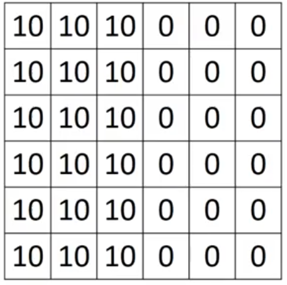
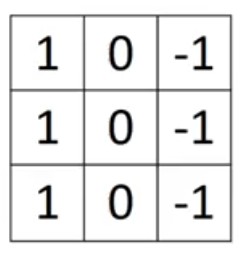
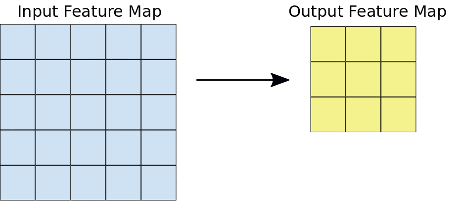
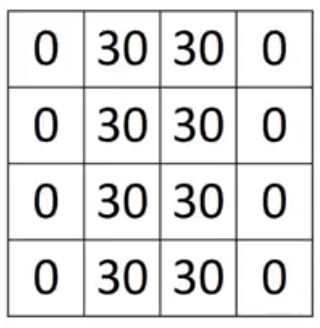
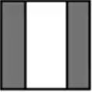
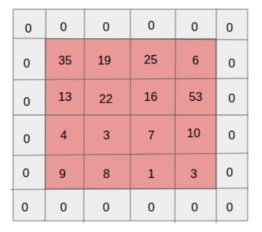
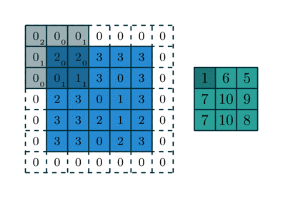
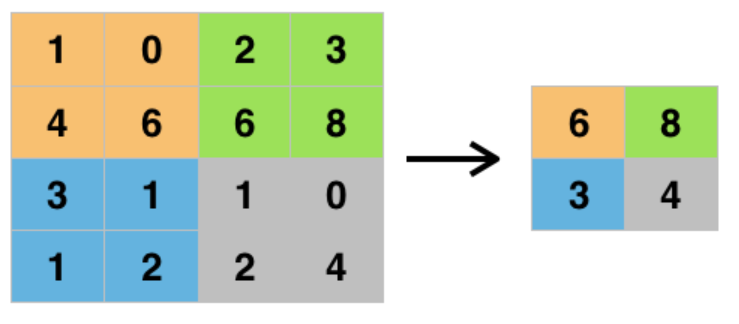

```{r setup, include = FALSE}
knitr::opts_chunk$set(
  cache = FALSE, # if TRUE knitr will cache results to reuse in future knits
  fig.width = 6, # the width for plots created by code chunk
  fig.height = 4, # the height for plots created by code chunk
  fig.align = 'center', # how to align graphics. 'left', 'right', 'center'
  dpi = 300, 
  dev = 'png', # Makes each fig a png, and avoids plotting every data point
  # options(tinytex.verbose = TRUE)
  # eval = FALSE, # if FALSE, then the R code chunks are not evaluated
  # results = 'asis', # knitr passes through results without reformatting
  echo = TRUE, # if FALSE knitr won't display code in chunk above it's results
  message = TRUE, # if FALSE knitr won't display messages generated by code
  strip.white = TRUE, # if FALSE knitr won't remove white spaces at beg or end of code chunk
  warning = TRUE, # if FALSE knitr won't display warning messages in the doc
  error = TRUE) # report errors
```

\setcounter{section}{11}
\setcounter{subsection}{2}
\setcounter{subsubsection}{2}

#### Class Readings, Assignments, Syllabus Topics

##### Reading, Lab Exercises, SemProjects

  - Readings: 
    - For today: LeClun Deep Learning 2015 Reviewr
    - For next class: DLwR2 Ch 6
  - Laboratory Exercises: 
    - LE6: Due Thursday April 13th
    - LE7 : 
  - Office Hours: (Class Canvas Calendar for Zoom Link)
    - Wednesdays @ 4:00 PM to 5:00 PM  
    - Saturdays @ 3:00 PM to 4:00 PM
    - **Office Hours are on Zoom, and recorded**
  - Semester Projects
    - Office Hours for SemProjs: Mondays at 4pm on Zoom
    - DSCI 453 Students Biweekly Updates Due 
      - Update # is Due **  **
    - DSCI 453 Students 
      - Next Report Out # is Due ** **
    - All DSCI 353/353M/453, E1453/2453 Students: 
      - **Peer Grading of Report Out # is Due  **
    - Exams
      - Final: **Thursday May 4th**, 2023, 12:00PM - 3:00PM, Nord 356 or remote

#### Syllabus


\FloatBarrier

#### Introduction to Convolutional Neural Networks (CNN) with TensorFlow 

- Learn 

  - The foundations of convolutional neural networks for computer vision 
  - And build a CNN with Google's TensorFlow
  
Convolutional Neural Networks are 

  - Also referred to as CNN
  - Or ConvNets
  
Recent advances in deep learning 

  - have made computer vision applications leap forward: 
    - from unlocking our mobile phone with our face, 
    - to safer self-driving cars.

Convolutional neural networks (CNN) 

  - are the architecture behind computer vision applications. 
  
Lets look at the foundations of CNNs and computer vision such as 

  - the convolution operation, 
  - padding, 
  - strided convolutions 
  - and pooling layers. 

Then, we will use TensorFlow 

  - to build a CNN for image recognition.

##### Understanding Convolution

- The convolution operation is the building block 

  - of a convolutional neural network as the name suggests it.

Now, in the field of computer vision, 

  - an image can be expressed as a matrix of RGB values. 

To complete the convolution operation, 

  - we need an image 
  - and a filter.

Therefore, let’s consider the 6x6 matrix below 

  - as a part of an image:



Figure 1. A 6 x 6 matrix. 

And the filter 
 
  - will be the following matrix:


Figure 2. 3 x 3 filter matrix.

Then, the convolution involves 

  - superimposing the filter onto the image matrix, 
  - adding the product of the values from the filter 
    - and the values from the image matrix, 
  - which will generate a 4x4 convoluted layer.

This is very hard to put in words, 

  - but here is an animation 
  - that explains the convolution:

 

Figure 3: Convolution operation.

Performing this on the image matrix above 

  - and using the filter defined above,
  - you should get the following resulting matrix:



Figure 4. A 4 x 4 output layer. 

How do you interpret the output layer?

Well, considering that each value 

  - is indicative of color, 
  - or how dark a pixel is 
    - (positive value means light, negative value means dark), 
  - then you can interpret the output layer as:



Figure 5. Output layer interpretation. 

Therefore, it seems that this particular filter 

  - is responsible to detect vertical edges in images!

###### How do you choose the right filter?

- This is a natural question, as you might realize that 

  - there is an infinite number of possible filters 
  - you can apply to an image.

It turns out that the exact values in your filter matrix 

  - can be trainable parameters based on the model’s objective. 
  - Therefore, you can either choose a filter that 
    - has worked for your specific application, 
  - or you can use [backpropagation](http://en.wikipedia/backpropagation) 
    - to determine the best values for your filter 
    - that will yield the best outcome.

##### Padding in computer vision

- Previously, we have seen that 

  - a 3x3 filter 
    - convoluted (or convolved) with a 6x6 image, 
  - will result in 4x4 matrix. 
  This is because there are 4x4 possible positions 
    - for the filter to fit in a 6x6 image.

Therefore, after each convolution step, 

  - the image shrinks, 
  - meaning that only a finite number of convolution 
    - can be performed until the image cannot be shrunken anymore. 
  - Furthermore, pixels situated in the corner of the image 
    - are only used once, 
    - and this results in loss of information 
    - for the neural network.

In order to solve both problems stated above, 

  - padding is used. 
  - Padding consists in adding a border 
    - around the input image as shown below:



Figure 6. Input image with padding of 1.

As you can see, the added border is usually filled with zeros. 

  - Now, the corner pixel of the image will be used many times 
    - to calculate the output, 
  - effectively preventing loss of information. 
  - Also, it allows us to keep the input matrix shape in the output.

Considering our 6x6 input image, 

  - if we add a padding of 1, 
    - we get a 8x8 matrix. 
  - Applying a 3x3 filter, 
    - this will result in a 6x6 output.

A simple equation can help us figure out the shape of the output:

$$ n+2p-f+1 $$

  - Where $n$ is the input shape, 
  - $p$ is the padding size, and 
  - $f$ is the filter shape

To reiterate, we have:

  - 6x6 input
  - padding of 1
  - 3x3 filter

Thus, the output shape will be: $6+2(1)-3+1 = 6$. 

Therefore, 

  - the output will be a 6x6 matrix, 
  - just like the input image!

Padding is not always required. However, when padding is used, 

  - it is usually for the output to have the same size 
    - as the input image. 
  - This yields two types of convolutions.

When no padding is applied, 

  - this is called a “valid convolution”. 
  - Otherwise, it is termed “same convolution”. 
  
To determine the padding size required 

  - to keep the dimensions of the input image, 
  - simply equate the formula above to n. 
  = After solving for p, you should get:

$$ p = \frac{f-1}{2} $$

You might have noticed that 

  - $f$ should be odd in order 
    - for the padding to be a whole number. 
  - Hence, it is a convention in the field of computer visions 
    - to have odd filters.

##### Strided convolution

- Previously, we have seen a convolution with a *stride* of 1. 

  - This means that the filter was 
    - moving horizontally 
    - and vertically 
  - by 1 pixel.

A strided convolution is when 

  = the stride is greater than 1. 
  
In the animation below, the stride is 2:



Figure 7. Convolution with a stride of 2

Now, taking into account the stride, 

  - the formula to calculate the shape of the output matrix is:

$$ \frac{n+2p-f}{s}+1 $$

  - Where $s$ is the stride.

As a convention, if the formula above 

  - does not yield a whole number, 
  - then we round down to the nearest integer.

##### Pooling layers

- Pooling layers are another way 

  - to reduce the size of the image interpretation 
    - in order to speed up computation, 
  - and it makes the detected features more robust.

Pooling is best explained with an image. 

Below is an example of **max pooling**:



Figure 8. Max pooling with a 2x2 filter. 

As you can see, 

  - we chose a 2x2 filter 
    - with a stride of 2. 
  - This is equivalent to dividing the input 
    - into 4 identical squares, 
  - we then take the maximum value of each square, 
    - and use it in the output.

Average pooling can also be performed, 

  -  but it less popular than max pooling.

You can think of pooling 

  - as a way to prevent overfitting, 
  - since we are removing some features 
    - from the input image.

##### Why use a convolutional neural network? 

- We now have a strong foundational knowledge of convolutional neural networks. 

However, why do deep learning practitioners use them?

Unlike fully connected layers, 

  - convolutional layers 
    - have a much smaller set of parameters to learn. 
  - This is due to:
    - parameter sharing
    - sparsity of connection
  - Parameter sharing refers to the fact that one feature detector, 
    - such as vertical edges detector, 
    - will be useful in many parts of the image. 
  - Then, the sparsity of connections refers to the fact that 
    - only a few features are related 
    - to a certain output value.

Considering the above example of max pooling, 

  - the top left value for the output 
    - depends solely on the top left 2x2 square 
    - from the input image.

Therefore, we can 

  - train on smaller datasets and 
  - greatly reduce the number of parameters to learn, 
  - making CNNs a great tool for computer vision tasks.


#### Cites

##### Marco Peixeiro, [Introduction to Convolutional Neural Networks (CNN) with TensorFlow](https://towardsdatascience.com/introduction-to-convolutional-neural-networks-cnn-with-tensorflow-57e2f4837e18), April 3,2019. 

##### [ This is developed from the Convolutional Neural Networks Coursera class](https://www.coursera.org/learn/convolutional-neural-networks/lecture/4Trod/edge-detection-example)

